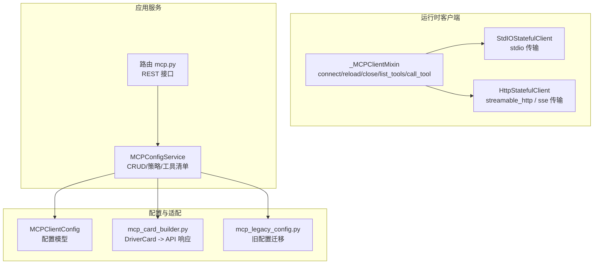
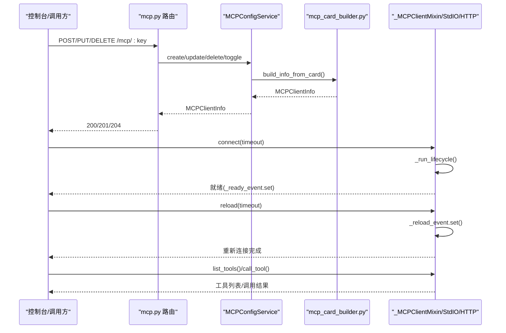
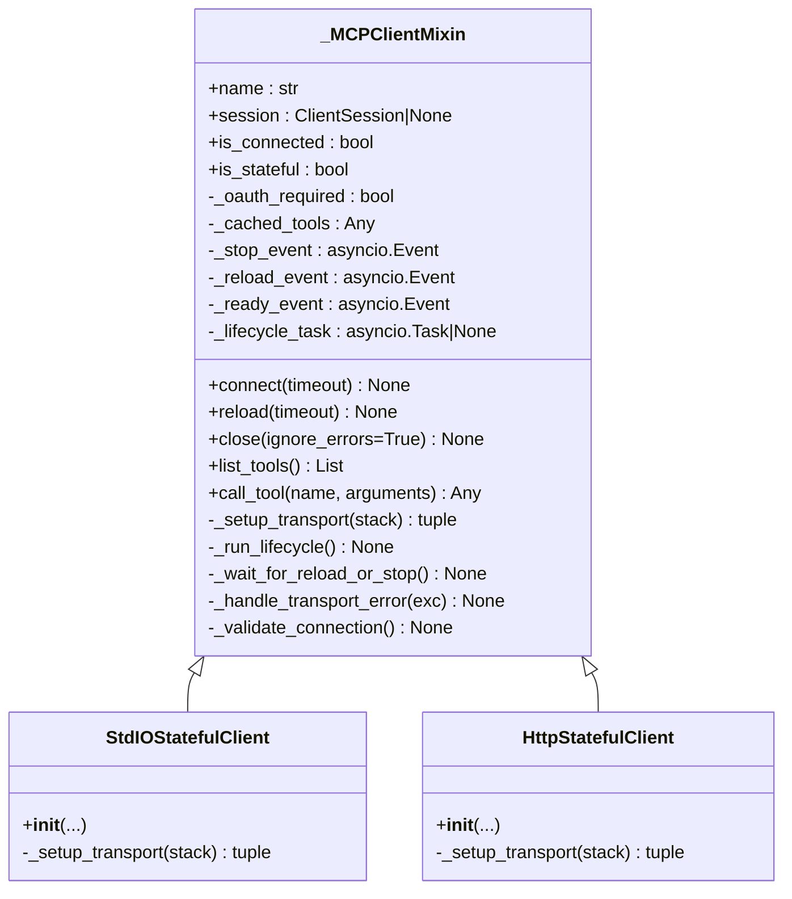
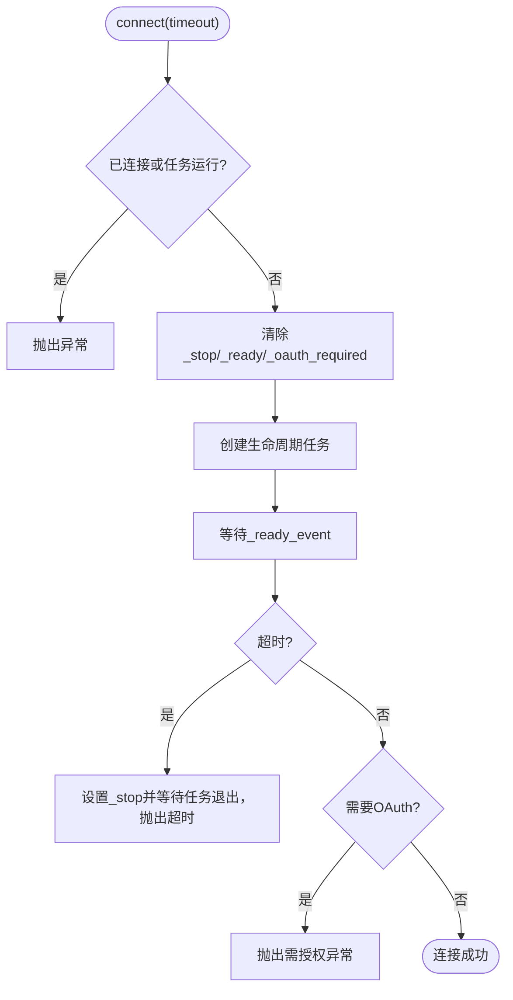
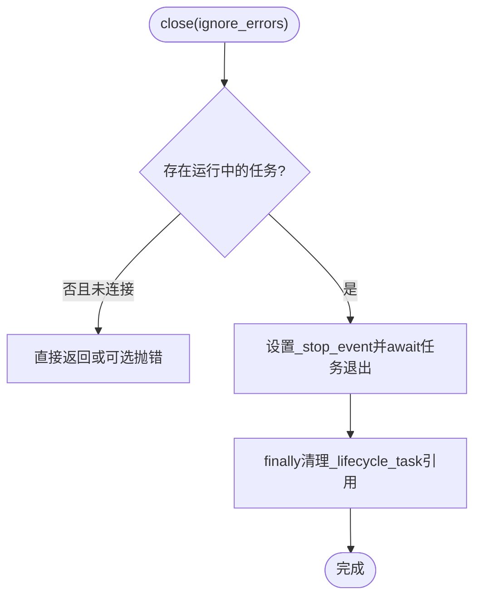
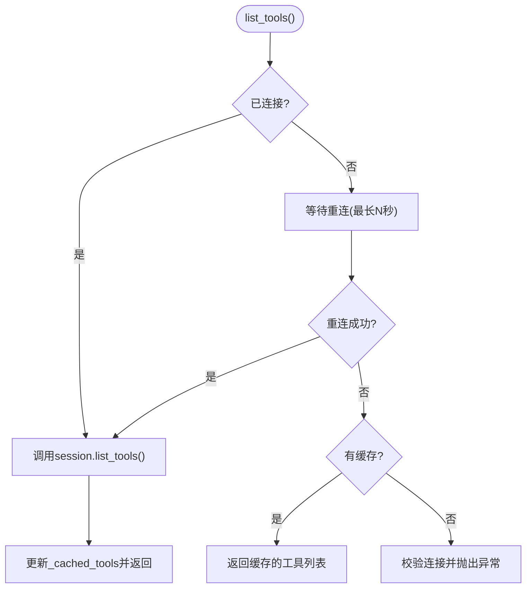
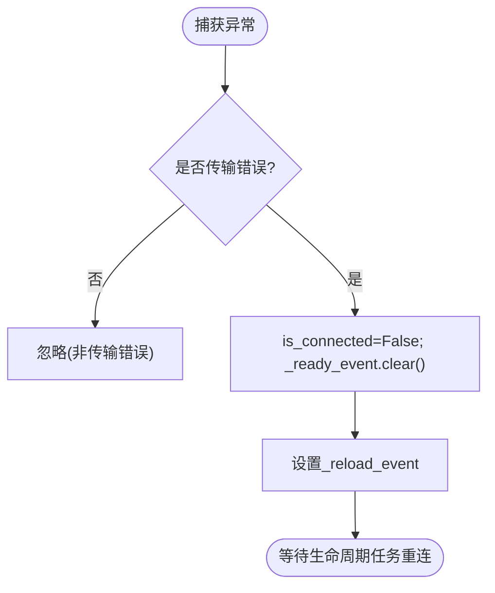
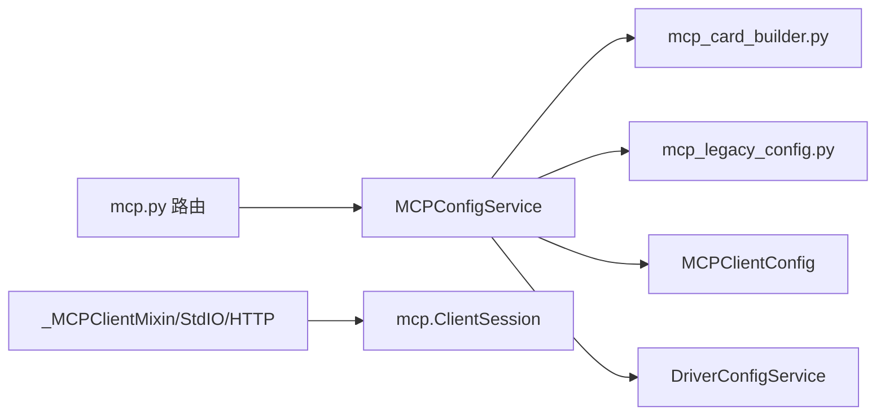

# 客户端生命周期管理

<cite>
**本文引用的文件**   
- [mcp_stateful_client.py](file://src/qwenpaw/drivers/handlers/mcp_stateful_client.py)
- [config_service.py](file://src/qwenpaw/app/mcp/config_service.py)
- [schemas.py](file://src/qwenpaw/app/mcp/schemas.py)
- [mcp.py](file://src/qwenpaw/app/routers/mcp.py)
- [config.py](file://src/qwenpaw/config/config.py)
- [mcp_card_builder.py](file://src/qwenpaw/drivers/adapters/mcp_card_builder.py)
- [mcp_legacy_config.py](file://src/qwenpaw/drivers/adapters/mcp_legacy_config.py)
- [test_mcp.py](file://e2e/tests/test_mcp.py)
</cite>

## 目录
1. [简介](#简介)
2. [项目结构](#项目结构)
3. [核心组件](#核心组件)
4. [架构总览](#架构总览)
5. [详细组件分析](#详细组件分析)
6. [依赖关系分析](#依赖关系分析)
7. [性能与可靠性](#性能与可靠性)
8. [故障排查指南](#故障排查指南)
9. [结论](#结论)
10. [附录：API 与配置参考](#附录api-与配置参考)

## 简介
本文件围绕 QwenPaw 的 MCP（Model Context Protocol）客户端生命周期管理，系统性阐述启动、停止、重启与销毁过程；覆盖进程/连接管理、资源清理、错误恢复、状态监控与健康检查、动态配置热重载与自动重连；并提供批量操作、状态同步与故障转移的实践示例。文档既面向初学者，也为有经验的开发者提供深入的技术细节与图示。

## 项目结构
MCP 客户端生命周期涉及三层：
- 运行时客户端层：负责建立/维护与 MCP 服务器的连接，处理跨任务上下文退出导致的资源泄漏问题，实现连接、重载、关闭等生命周期方法。
- 应用服务层：提供 MCP 客户端配置的创建、更新、删除、工具白名单、访问策略等能力，并对外暴露 API。
- 配置与适配层：将控制台管理的 DriverCard 映射为 MCP 客户端信息，兼容旧版配置，支持 OAuth 与静态凭据。



图表来源
- [mcp_stateful_client.py:88-542](file://src/qwenpaw/drivers/handlers/mcp_stateful_client.py#L88-L542)
- [mcp_stateful_client.py:545-754](file://src/qwenpaw/drivers/handlers/mcp_stateful_client.py#L545-L754)
- [config_service.py:74-353](file://src/qwenpaw/app/mcp/config_service.py#L74-L353)
- [mcp.py:162-251](file://src/qwenpaw/app/routers/mcp.py#L162-L251)
- [config.py:1571-1652](file://src/qwenpaw/config/config.py#L1571-L1652)
- [mcp_card_builder.py:183-223](file://src/qwenpaw/drivers/adapters/mcp_card_builder.py#L183-L223)
- [mcp_legacy_config.py:145-231](file://src/qwenpaw/drivers/adapters/mcp_legacy_config.py#L145-L231)

章节来源
- [mcp_stateful_client.py:88-542](file://src/qwenpaw/drivers/handlers/mcp_stateful_client.py#L88-L542)
- [mcp_stateful_client.py:545-754](file://src/qwenpaw/drivers/handlers/mcp_stateful_client.py#L545-L754)
- [config_service.py:74-353](file://src/qwenpaw/app/mcp/config_service.py#L74-L353)
- [mcp.py:162-251](file://src/qwenpaw/app/routers/mcp.py#L162-L251)
- [config.py:1571-1652](file://src/qwenpaw/config/config.py#L1571-L1652)
- [mcp_card_builder.py:183-223](file://src/qwenpaw/drivers/adapters/mcp_card_builder.py#L183-L223)
- [mcp_legacy_config.py:145-231](file://src/qwenpaw/drivers/adapters/mcp_legacy_config.py#L145-L231)

## 核心组件
- _MCPClientMixin：统一的生命周期与工具调用逻辑，包含 connect、reload、close、list_tools、call_tool、_run_lifecycle、_handle_transport_error、_validate_connection 等。
- StdIOStatefulClient：基于 stdio 的子进程驱动 MCP 客户端，封装子进程生命周期与管道清理。
- HttpStatefulClient：基于 streamable_http 或 SSE 的远程 MCP 客户端，封装 HTTP/SSE 连接与超时。
- MCPConfigService：控制台侧的 MCP 客户端配置服务，提供 CRUD、工具白名单、访问策略、凭据管理等。
- 路由层 mcp.py：暴露 REST 接口，转发到 MCPConfigService。
- 配置模型 MCPClientConfig：定义单个 MCP 客户端的配置项与校验规则。
- 适配器 mcp_card_builder.py：将 DriverCard 转换为 API 返回的 MCPClientInfo。
- 旧配置迁移 mcp_legacy_config.py：兼容第三方示例字段别名与旧格式。

章节来源
- [mcp_stateful_client.py:88-542](file://src/qwenpaw/drivers/handlers/mcp_stateful_client.py#L88-L542)
- [mcp_stateful_client.py:545-754](file://src/qwenpaw/drivers/handlers/mcp_stateful_client.py#L545-L754)
- [config_service.py:74-353](file://src/qwenpaw/app/mcp/config_service.py#L74-L353)
- [mcp.py:162-251](file://src/qwenpaw/app/routers/mcp.py#L162-L251)
- [config.py:1571-1652](file://src/qwenpaw/config/config.py#L1571-L1652)
- [mcp_card_builder.py:183-223](file://src/qwenpaw/drivers/adapters/mcp_card_builder.py#L183-L223)
- [mcp_legacy_config.py:145-231](file://src/qwenpaw/drivers/adapters/mcp_legacy_config.py#L145-L231)

## 架构总览
下图展示了从控制台 API 到 MCP 客户端生命周期的端到端流程，包括连接、重载、关闭以及工具调用路径。



图表来源
- [mcp.py:162-251](file://src/qwenpaw/app/routers/mcp.py#L162-L251)
- [config_service.py:74-353](file://src/qwenpaw/app/mcp/config_service.py#L74-L353)
- [mcp_card_builder.py:183-223](file://src/qwenpaw/drivers/adapters/mcp_card_builder.py#L183-L223)
- [mcp_stateful_client.py:88-542](file://src/qwenpaw/drivers/handlers/mcp_stateful_client.py#L88-L542)

## 详细组件分析

### 生命周期类图


图表来源
- [mcp_stateful_client.py:88-542](file://src/qwenpaw/drivers/handlers/mcp_stateful_client.py#L88-L542)
- [mcp_stateful_client.py:545-754](file://src/qwenpaw/drivers/handlers/mcp_stateful_client.py#L545-L754)

章节来源
- [mcp_stateful_client.py:88-542](file://src/qwenpaw/drivers/handlers/mcp_stateful_client.py#L88-L542)
- [mcp_stateful_client.py:545-754](file://src/qwenpaw/drivers/handlers/mcp_stateful_client.py#L545-L754)

### 启动流程（connect）
- 入口：connect(timeout)。若已连接或已有生命周期任务运行，抛出异常；否则清除事件标志，创建后台任务执行 _run_lifecycle。
- 后台任务：在 AsyncExitStack 中建立传输（stdio/http/sse），初始化 ClientSession，标记 is_connected 并设置 _ready_event。
- 等待就绪：调用方通过 wait_for(_ready_event) 阻塞直至连接成功或超时。
- OAuth 检测：若服务端要求 OAuth（HTTP 401），设置 _oauth_required 并提前结束生命周期，调用方收到后抛出明确错误提示授权。



图表来源
- [mcp_stateful_client.py:213-263](file://src/qwenpaw/drivers/handlers/mcp_stateful_client.py#L213-L263)
- [mcp_stateful_client.py:143-211](file://src/qwenpaw/drivers/handlers/mcp_stateful_client.py#L143-L211)

章节来源
- [mcp_stateful_client.py:213-263](file://src/qwenpaw/drivers/handlers/mcp_stateful_client.py#L213-L263)
- [mcp_stateful_client.py:143-211](file://src/qwenpaw/drivers/handlers/mcp_stateful_client.py#L143-L211)

### 重载流程（reload）
- 入口：reload(timeout)。仅在已连接时允许触发。
- 信号机制：设置 _reload_event，并清空 _ready_event，使调用方等待新的连接就绪。
- 生命周期：后台任务检测到 _reload_event 后，清理当前会话与连接状态，退出 AsyncExitStack，随后进入下一轮连接循环。
- 完成通知：新连接成功后再次设置 _ready_event，调用方解除阻塞。

```mermaid
sequenceDiagram
participant Caller as "调用方"
participant Client as "_MCPClientMixin"
participant Task as "生命周期任务"
Caller->>Client : reload(timeout)
Client->>Client : _reload_event.set()
Client->>Client : _ready_event.clear()
Client-->>Caller : 等待_ready_event
Task->>Task : 检测到_reload_event
Task->>Task : 清理session/is_connected
Task->>Task : 退出AsyncExitStack(释放传输/子进程)
Task->>Task : 重新_setup_transport并initialize
Task->>Client : is_connected=True; _ready_event.set()
Client-->>Caller : 重载完成
```

图表来源
- [mcp_stateful_client.py:265-296](file://src/qwenpaw/drivers/handlers/mcp_stateful_client.py#L265-L296)
- [mcp_stateful_client.py:143-211](file://src/qwenpaw/drivers/handlers/mcp_stateful_client.py#L143-L211)

章节来源
- [mcp_stateful_client.py:265-296](file://src/qwenpaw/drivers/handlers/mcp_stateful_client.py#L265-L296)
- [mcp_stateful_client.py:143-211](file://src/qwenpaw/drivers/handlers/mcp_stateful_client.py#L143-L211)

### 关闭与销毁（close）
- 入口：close(ignore_errors=True)。即使未连接但仍有生命周期任务运行，也会尝试停止任务，避免子进程泄漏。
- 停止机制：设置 _stop_event，等待任务退出；finally 中清理任务引用，确保取消场景下也能正确回收。
- 资源清理：AsyncExitStack 退出时释放传输上下文与子进程，避免僵尸进程与句柄泄漏。



图表来源
- [mcp_stateful_client.py:393-442](file://src/qwenpaw/drivers/handlers/mcp_stateful_client.py#L393-L442)
- [mcp_stateful_client.py:143-211](file://src/qwenpaw/drivers/handlers/mcp_stateful_client.py#L143-L211)

章节来源
- [mcp_stateful_client.py:393-442](file://src/qwenpaw/drivers/handlers/mcp_stateful_client.py#L393-L442)
- [mcp_stateful_client.py:143-211](file://src/qwenpaw/drivers/handlers/mcp_stateful_client.py#L143-L211)

### 工具调用与缓存回退（list_tools/call_tool）
- list_tools：若处于短暂的重连窗口（is_connected=False 但任务仍在），会等待最多固定时长以等待重连成功；若仍失败则回退到上次成功的工具缓存，避免单次抖动导致整轮对话失败。
- call_tool：严格校验连接状态，任何传输错误都会触发 _handle_transport_error，标记断开并安排重连。



图表来源
- [mcp_stateful_client.py:302-370](file://src/qwenpaw/drivers/handlers/mcp_stateful_client.py#L302-L370)

章节来源
- [mcp_stateful_client.py:302-370](file://src/qwenpaw/drivers/handlers/mcp_stateful_client.py#L302-L370)

### 传输错误与自动重连（_handle_transport_error）
- 识别传输错误：anyio 资源错误、httpx 传输错误、EOF/BrokenPipe 等。
- 动作：标记 is_connected=False，清空 _ready_event，设置 _reload_event 以触发重连；保留工具缓存以便短暂断链期间仍可读取工具列表。
- 效果：对 HTTP 长连接内部错误（如 post_writer 静默关闭写流）和 stdio 子进程意外退出均能自动恢复，无需进程重启。



图表来源
- [mcp_stateful_client.py:447-506](file://src/qwenpaw/drivers/handlers/mcp_stateful_client.py#L447-L506)

章节来源
- [mcp_stateful_client.py:447-506](file://src/qwenpaw/drivers/handlers/mcp_stateful_client.py#L447-L506)

### 配置模型与校验（MCPClientConfig）
- 字段：name、description、enabled、transport、url、headers、command、args、env、cwd、tools、oauth。
- 兼容性：支持 isActive→enabled、baseUrl→url、type→transport 等别名；当仅含 url/baseUrl 且无 command 时默认推断为 streamable_http。
- 校验：stdio 必须提供非空 command；其他传输必须提供非空 url。

章节来源
- [config.py:1571-1652](file://src/qwenpaw/config/config.py#L1571-L1652)

### 控制台 API 与服务（mcp.py + config_service.py）
- 路由：提供 GET/POST/PUT/DELETE 接口用于列出、创建、更新、删除 MCP 客户端。
- 服务：MCPConfigService 负责加载 DriverCard、构建 MCPClientInfo、合并更新、保存凭据与卡片、切换启用状态、删除相关凭据与卡片。
- 工具白名单：支持按 client_key 查询工具清单并按 tools 字段过滤 enabled 状态。

章节来源
- [mcp.py:162-251](file://src/qwenpaw/app/routers/mcp.py#L162-L251)
- [config_service.py:74-353](file://src/qwenpaw/app/mcp/config_service.py#L74-L353)

### 适配器与旧配置兼容（mcp_card_builder.py + mcp_legacy_config.py）
- 适配器：将 DriverCard 的 endpoint、policy、credentials 等信息转换为 MCPClientInfo 响应体，包含 transport、url、headers、command、args、env、cwd、tools、oauth_status、access_summary。
- 旧配置：将 legacy 配置对象转换为 DriverCard 与凭据记录，支持多种凭据类型与别名映射。

章节来源
- [mcp_card_builder.py:183-223](file://src/qwenpaw/drivers/adapters/mcp_card_builder.py#L183-L223)
- [mcp_legacy_config.py:145-231](file://src/qwenpaw/drivers/adapters/mcp_legacy_config.py#L145-L231)

## 依赖关系分析
- 运行时客户端依赖 mcp 库的 ClientSession 与传输客户端（stdio/sse/streamable_http）。
- 应用服务依赖 DriverConfigService 与凭据存储，负责持久化与一致性。
- 路由层解耦业务逻辑，仅做参数解析与转发。
- 适配器桥接控制台数据模型与底层 DriverCard。



图表来源
- [mcp.py:162-251](file://src/qwenpaw/app/routers/mcp.py#L162-L251)
- [config_service.py:74-353](file://src/qwenpaw/app/mcp/config_service.py#L74-L353)
- [mcp_card_builder.py:183-223](file://src/qwenpaw/drivers/adapters/mcp_card_builder.py#L183-L223)
- [mcp_legacy_config.py:145-231](file://src/qwenpaw/drivers/adapters/mcp_legacy_config.py#L145-L231)
- [mcp_stateful_client.py:88-542](file://src/qwenpaw/drivers/handlers/mcp_stateful_client.py#L88-L542)

章节来源
- [mcp.py:162-251](file://src/qwenpaw/app/routers/mcp.py#L162-L251)
- [config_service.py:74-353](file://src/qwenpaw/app/mcp/config_service.py#L74-L353)
- [mcp_card_builder.py:183-223](file://src/qwenpaw/drivers/adapters/mcp_card_builder.py#L183-L223)
- [mcp_legacy_config.py:145-231](file://src/qwenpaw/drivers/adapters/mcp_legacy_config.py#L145-L231)
- [mcp_stateful_client.py:88-542](file://src/qwenpaw/drivers/handlers/mcp_stateful_client.py#L88-L542)

## 性能与可靠性
- 连接与重载：使用事件驱动的异步等待，避免忙轮询；重载过程中保留工具缓存，降低短暂断链对用户体验的影响。
- 错误恢复：传输错误自动重连，防止长期不可用；OAuth 401 快速失败并引导用户授权。
- 资源清理：生命周期任务内统一 enter/exit 上下文，避免跨任务 CancelScope 导致的资源泄漏；close 保证任务退出与引用清理。
- 超时控制：connect/reload 支持超时参数，避免长时间挂起。

[本节为通用指导，不直接分析具体文件]

## 故障排查指南
- 连接超时：检查网络可达性与服务端状态；确认 timeout 参数合理。
- OAuth 授权失败：服务端返回 401 时需通过 UI 完成授权后再连接。
- 工具列表为空：确认 tools 白名单配置；若处于重连窗口，等待短暂时间后重试。
- 子进程泄漏：确保 close 被调用；避免在重连循环中跳过 stop 信号。
- 传输错误频繁：关注 HTTP 读超时或 stdio 管道中断；必要时调整超时与重试策略。

章节来源
- [mcp_stateful_client.py:213-263](file://src/qwenpaw/drivers/handlers/mcp_stateful_client.py#L213-L263)
- [mcp_stateful_client.py:393-442](file://src/qwenpaw/drivers/handlers/mcp_stateful_client.py#L393-L442)
- [mcp_stateful_client.py:447-506](file://src/qwenpaw/drivers/handlers/mcp_stateful_client.py#L447-L506)

## 结论
QwenPaw 的 MCP 客户端通过“单任务生命周期 + 事件驱动”的设计，解决了跨任务上下文退出导致的资源泄漏问题，实现了健壮的启动、重载、关闭与自动重连机制。配合控制台 API 与配置模型，提供了完整的动态管理与热重载能力。结合工具缓存与错误分类，系统在可用性与稳定性方面具备良好表现。

[本节为总结性内容，不直接分析具体文件]

## 附录：API 与配置参考

### API 概览
- 列出所有 MCP 客户端：GET /mcp
- 获取指定客户端详情：GET /mcp/{client_key}
- 创建 MCP 客户端：POST /mcp
- 更新 MCP 客户端：PUT /mcp/{client_key}
- 删除 MCP 客户端：DELETE /mcp/{client_key}

章节来源
- [mcp.py:162-251](file://src/qwenpaw/app/routers/mcp.py#L162-L251)

### 请求/响应模型
- MCPClientCreateRequest：创建客户端的请求体。
- MCPClientUpdateRequest：更新客户端的请求体（可选字段）。
- MCPClientInfo：客户端信息响应体，包含 key、name、transport、url、headers、command、args、env、cwd、tools、oauth_status、access_summary。

章节来源
- [schemas.py:28-75](file://src/qwenpaw/app/mcp/schemas.py#L28-L75)
- [schemas.py:78-119](file://src/qwenpaw/app/mcp/schemas.py#L78-L119)
- [schemas.py:122-163](file://src/qwenpaw/app/mcp/schemas.py#L122-L163)

### 配置模型要点
- MCPClientConfig：支持别名兼容与传输必填校验。
- 工具白名单：tools 字段为可选列表，None 表示加载全部工具。

章节来源
- [config.py:1571-1652](file://src/qwenpaw/config/config.py#L1571-L1652)

### 端到端测试示例
- e2e 测试覆盖了 MCP 页面加载、创建、编辑、删除等关键流程，验证了控制台与后端服务的交互。

章节来源
- [test_mcp.py:40-462](file://e2e/tests/test_mcp.py#L40-L462)