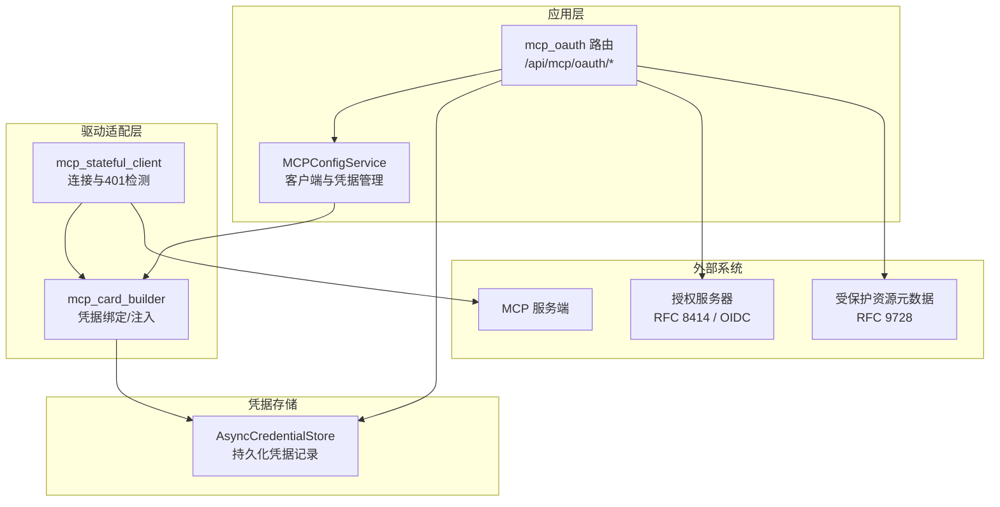
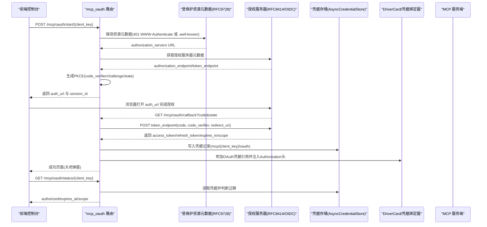
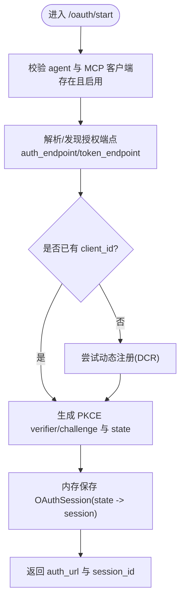
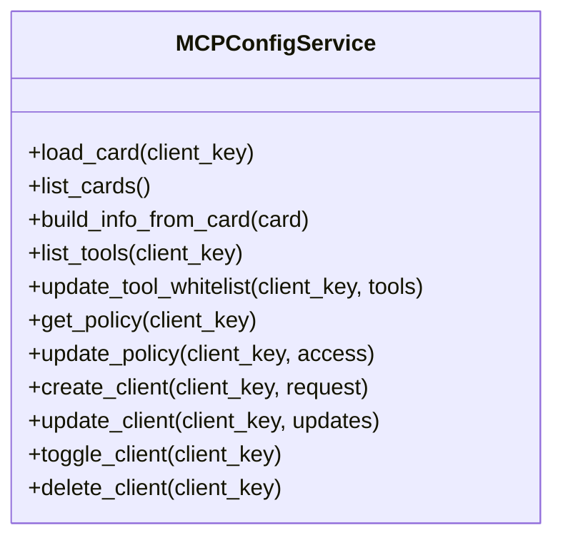
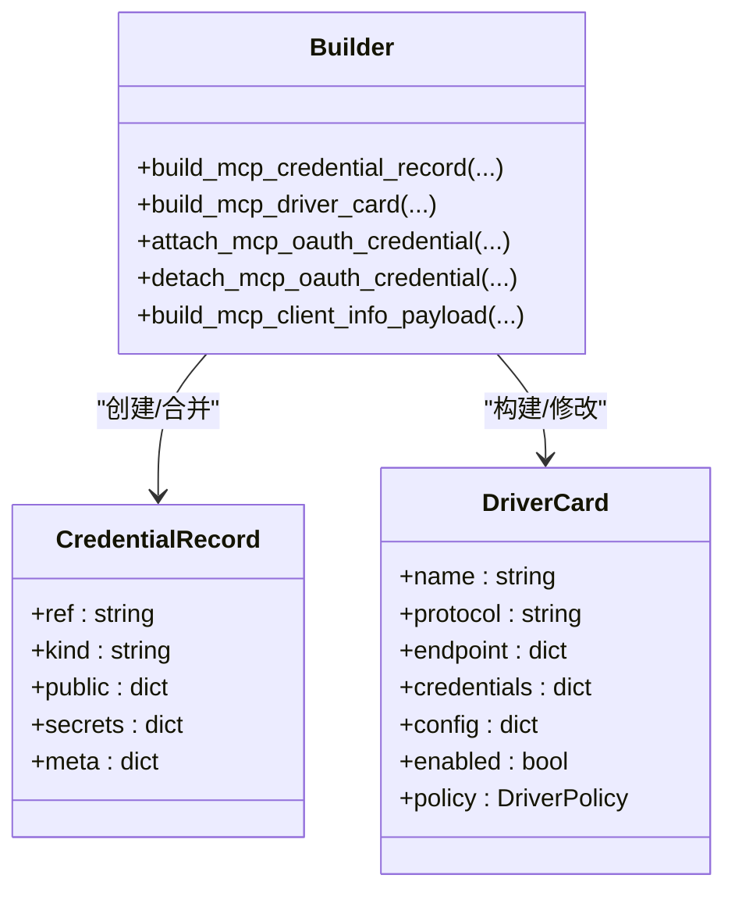
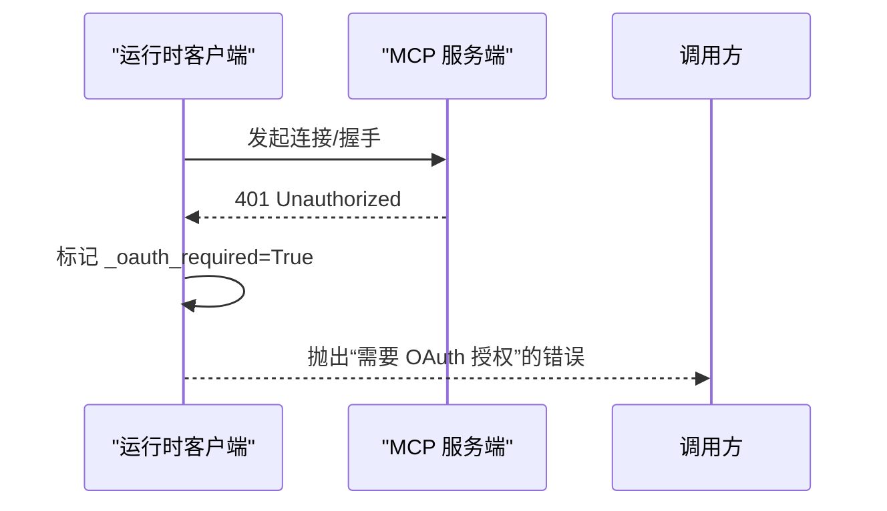
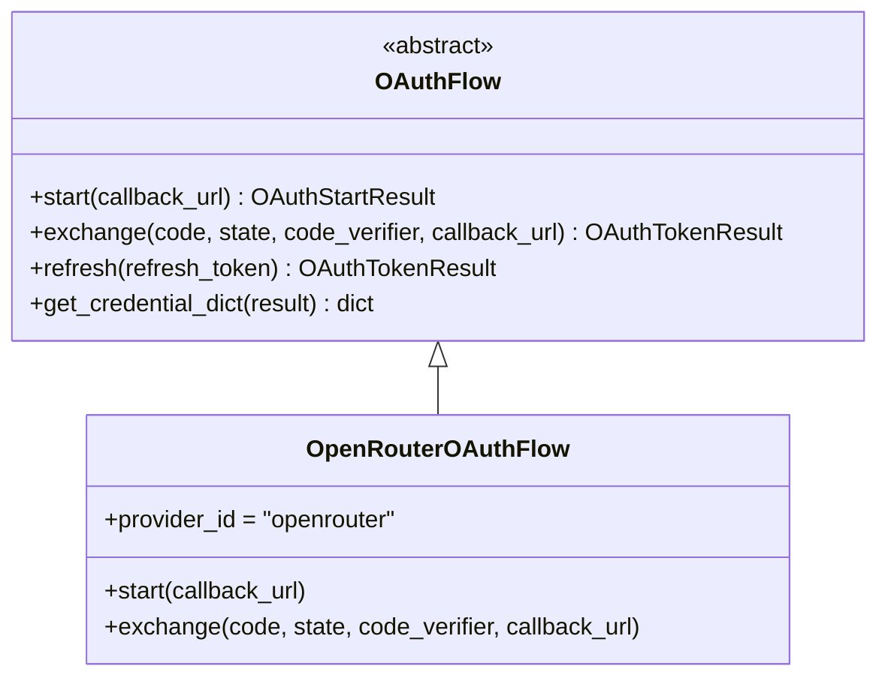
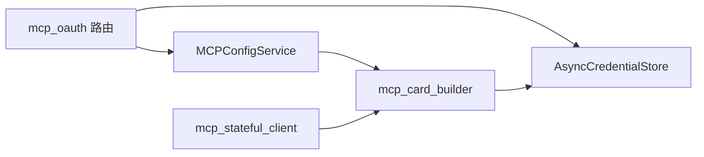

# 认证集成

<cite>
**本文引用的文件**
- [src/qwenpaw/app/mcp/config_service.py](file://src/qwenpaw/app/mcp/config_service.py)
- [src/qwenpaw/app/routers/mcp_oauth.py](file://src/qwenpaw/app/routers/mcp_oauth.py)
- [src/qwenpaw/drivers/adapters/mcp_card_builder.py](file://src/qwenpaw/drivers/adapters/mcp_card_builder.py)
- [src/qwenpaw/app/mcp/schemas.py](file://src/qwenpaw/app/mcp/schemas.py)
- [src/qwenpaw/providers/oauth/base.py](file://src/qwenpaw/providers/oauth/base.py)
- [src/qwenpaw/providers/oauth/openrouter_flow.py](file://src/qwenpaw/providers/oauth/openrouter_flow.py)
- [src/qwenpaw/providers/oauth/session_store.py](file://src/qwenpaw/providers/oauth/session_store.py)
- [src/qwenpaw/drivers/handlers/mcp_stateful_client.py](file://src/qwenpaw/drivers/handlers/mcp_stateful_client.py)
- [tests/integration/test_driver_mcp_oauth_flow.py](file://tests/integration/test_driver_mcp_oauth_flow.py)
</cite>

## 目录
1. [简介](#简介)
2. [项目结构](#项目结构)
3. [核心组件](#核心组件)
4. [架构总览](#架构总览)
5. [详细组件分析](#详细组件分析)
6. [依赖关系分析](#依赖关系分析)
7. [性能与可靠性](#性能与可靠性)
8. [故障排查指南](#故障排查指南)
9. [结论](#结论)
10. [附录：配置示例与最佳实践](#附录配置示例与最佳实践)

## 简介
本文件系统性阐述 QwenPaw 的 MCP 认证集成方案，覆盖以下能力：
- 支持的认证方式：OAuth 2.0（授权码模式 + PKCE）、API Key（静态凭据）、自定义认证头。
- OAuth 完整流程：发现授权服务器、动态客户端注册（可选）、浏览器弹窗交互、令牌交换、持久化与会话管理。
- 多客户端隔离：每个 MCP 客户端拥有独立的凭据引用与状态，避免跨会话泄漏。
- 运行时注入：将访问令牌以 Bearer 形式注入 HTTP/SSE 请求头；stdio 模式下通过环境变量注入。
- 失败处理与重试：连接超时、401 未授权提示、回调错误页、前端友好反馈。
- 面向初学者的配置指引与面向开发者的实现细节。

## 项目结构
MCP 认证相关代码主要分布在应用层路由、配置服务、驱动适配器与提供者 OAuth 基础库中：
- 应用路由：提供 OAuth 开始/回调/状态/撤销等 API。
- 配置服务：负责 MCP 客户端卡片与凭据的构建、更新、策略展示。
- 驱动适配器：将凭据绑定到 DriverCard 的端点头部或环境变量。
- 提供者 OAuth：通用抽象与 OpenRouter 特定实现（用于模型提供商，非 MCP）。
- 运行时客户端：检测 401 并引导用户完成授权。

图表来源
- [src/qwenpaw/app/routers/mcp_oauth.py:429-518](file://src/qwenpaw/app/routers/mcp_oauth.py#L429-L518)
- [src/qwenpaw/app/mcp/config_service.py:74-126](file://src/qwenpaw/app/mcp/config_service.py#L74-L126)
- [src/qwenpaw/drivers/adapters/mcp_card_builder.py:100-180](file://src/qwenpaw/drivers/adapters/mcp_card_builder.py#L100-L180)
- [src/qwenpaw/drivers/handlers/mcp_stateful_client.py:248-263](file://src/qwenpaw/drivers/handlers/mcp_stateful_client.py#L248-L263)

章节来源
- [src/qwenpaw/app/routers/mcp_oauth.py:1-798](file://src/qwenpaw/app/routers/mcp_oauth.py#L1-L798)
- [src/qwenpaw/app/mcp/config_service.py:1-728](file://src/qwenpaw/app/mcp/config_service.py#L1-L728)
- [src/qwenpaw/drivers/adapters/mcp_card_builder.py:1-379](file://src/qwenpaw/drivers/adapters/mcp_card_builder.py#L1-L379)
- [src/qwenpaw/drivers/handlers/mcp_stateful_client.py:240-439](file://src/qwenpaw/drivers/handlers/mcp_stateful_client.py#L240-L439)

## 核心组件
- OAuth 路由与流程控制：提供 /oauth/start、/oauth/callback、/oauth/status、/oauth/revoke 等接口，实现授权码+PKCE 流程、元数据发现、动态注册、令牌交换与持久化。
- MCP 配置服务：封装 MCP 客户端卡片的创建、更新、工具白名单、访问策略与凭据映射。
- 凭据绑定器：将静态凭据与 OAuth 凭据分别注入到端点的 headers/env，并在 HTTP 模式下自动附加 Authorization: Bearer {access_token}。
- 运行时客户端：在连接阶段检测 401，阻止调用并提示用户完成授权。
- 提供者 OAuth 基础库：定义通用的 OAuthFlow 抽象与 OpenRouter 实现（用于模型提供商，非 MCP）。

章节来源
- [src/qwenpaw/app/routers/mcp_oauth.py:429-518](file://src/qwenpaw/app/routers/mcp_oauth.py#L429-L518)
- [src/qwenpaw/app/mcp/config_service.py:74-126](file://src/qwenpaw/app/mcp/config_service.py#L74-L126)
- [src/qwenpaw/drivers/adapters/mcp_card_builder.py:226-267](file://src/qwenpaw/drivers/adapters/mcp_card_builder.py#L226-L267)
- [src/qwenpaw/drivers/handlers/mcp_stateful_client.py:259-263](file://src/qwenpaw/drivers/handlers/mcp_stateful_client.py#L259-L263)
- [src/qwenpaw/providers/oauth/base.py:57-95](file://src/qwenpaw/providers/oauth/base.py#L57-L95)
- [src/qwenpaw/providers/oauth/openrouter_flow.py:18-52](file://src/qwenpaw/providers/oauth/openrouter_flow.py#L18-L52)

## 架构总览
下图展示了从前端触发到后端完成 OAuth 授权并注入令牌的端到端流程。

图表来源
- [src/qwenpaw/app/routers/mcp_oauth.py:429-518](file://src/qwenpaw/app/routers/mcp_oauth.py#L429-L518)
- [src/qwenpaw/app/routers/mcp_oauth.py:690-747](file://src/qwenpaw/app/routers/mcp_oauth.py#L690-L747)
- [src/qwenpaw/app/routers/mcp_oauth.py:750-778](file://src/qwenpaw/app/routers/mcp_oauth.py#L750-L778)
- [src/qwenpaw/drivers/adapters/mcp_card_builder.py:226-267](file://src/qwenpaw/drivers/adapters/mcp_card_builder.py#L226-L267)

## 详细组件分析

### OAuth 路由与流程（/mcp/oauth）
- 功能要点
  - 支持 RFC 9728 资源元数据发现与 RFC 8414/OIDC 授权服务器元数据解析。
  - 支持动态客户端注册（DCR），若授权服务器暴露 registration_endpoint。
  - 使用 PKCE（S256）增强安全性，state 作为 CSRF 防护。
  - 回调成功后将 access_token/refresh_token/expires_at/scope/client_id 持久化到凭据存储，并将 OAuth 引用附加到 DriverCard，自动注入 Authorization: Bearer。
  - 提供状态查询与撤销接口，便于前端显示授权状态与重新授权。
- 关键路径
  - 启动流程：POST /mcp/oauth/start/{client_key}
  - 回调处理：GET /mcp/oauth/callback
  - 状态查询：GET /mcp/oauth/status/{client_key}
  - 撤销授权：DELETE /mcp/oauth/{client_key}

图表来源
- [src/qwenpaw/app/routers/mcp_oauth.py:429-518](file://src/qwenpaw/app/routers/mcp_oauth.py#L429-L518)
- [src/qwenpaw/app/routers/mcp_oauth.py:265-288](file://src/qwenpaw/app/routers/mcp_oauth.py#L265-L288)
- [src/qwenpaw/app/routers/mcp_oauth.py:119-207](file://src/qwenpaw/app/routers/mcp_oauth.py#L119-L207)

章节来源
- [src/qwenpaw/app/routers/mcp_oauth.py:1-798](file://src/qwenpaw/app/routers/mcp_oauth.py#L1-L798)

### MCP 配置服务（MCPConfigService）
- 职责
  - 加载/列举 MCP 客户端卡片。
  - 根据卡片与凭据构建 MCPClientInfo 响应（包含 oauth_status 与访问策略摘要）。
  - 维护工具白名单与访问策略（默认 ask，新增外部服务器需人工审批）。
  - 创建/更新/删除客户端，同步凭据存储与卡片。
- 关键点
  - 静态凭据与 OAuth 凭据分离：静态凭据 ref 为 mcp/{client_key}，OAuth 凭据 ref 为 mcp/{client_key}/oauth。
  - 列表工具时捕获异常并返回 502，避免上游不可用导致整体失败。

图表来源
- [src/qwenpaw/app/mcp/config_service.py:74-126](file://src/qwenpaw/app/mcp/config_service.py#L74-L126)
- [src/qwenpaw/app/mcp/config_service.py:128-182](file://src/qwenpaw/app/mcp/config_service.py#L128-L182)
- [src/qwenpaw/app/mcp/config_service.py:258-353](file://src/qwenpaw/app/mcp/config_service.py#L258-L353)

章节来源
- [src/qwenpaw/app/mcp/config_service.py:1-728](file://src/qwenpaw/app/mcp/config_service.py#L1-L728)

### 凭据绑定与注入（mcp_card_builder）
- 静态凭据
  - 将 env/headers 中的敏感字段分类为 secrets，写入 CredentialRecord（kind=static）。
  - 对 HTTP/SSE 传输，将 secret 引用注入 endpoint.headers；对 stdio 传输，注入 endpoint.env。
- OAuth 凭据
  - 通过 attach_mcp_oauth_credential 将 OAuth 引用（kind=oauth2_auth_code）附加到 credentials，并在非 stdio 模式下自动设置 Authorization 头为 Bearer {access_token}。
  - detach_mcp_oauth_credential 可移除该绑定。
- 兼容性与保留
  - 更新卡片时保留已有的 OAuth Authorization 绑定，避免被覆盖。

图表来源
- [src/qwenpaw/drivers/adapters/mcp_card_builder.py:47-97](file://src/qwenpaw/drivers/adapters/mcp_card_builder.py#L47-L97)
- [src/qwenpaw/drivers/adapters/mcp_card_builder.py:100-180](file://src/qwenpaw/drivers/adapters/mcp_card_builder.py#L100-L180)
- [src/qwenpaw/drivers/adapters/mcp_card_builder.py:226-267](file://src/qwenpaw/drivers/adapters/mcp_card_builder.py#L226-L267)
- [src/qwenpaw/drivers/adapters/mcp_card_builder.py:183-224](file://src/qwenpaw/drivers/adapters/mcp_card_builder.py#L183-L224)

章节来源
- [src/qwenpaw/drivers/adapters/mcp_card_builder.py:1-379](file://src/qwenpaw/drivers/adapters/mcp_card_builder.py#L1-L379)

### 运行时客户端与 401 处理（mcp_stateful_client）
- 行为
  - 连接建立后等待就绪事件；若在连接过程中检测到需要 OAuth（HTTP 401），则抛出明确错误，提示用户在 UI 完成授权。
  - 提供 reload 机制以在凭据变更后重建连接。
- 用户体验
  - 在未授权情况下阻止调用，避免静默失败。

图表来源
- [src/qwenpaw/drivers/handlers/mcp_stateful_client.py:259-263](file://src/qwenpaw/drivers/handlers/mcp_stateful_client.py#L259-L263)

章节来源
- [src/qwenpaw/drivers/handlers/mcp_stateful_client.py:240-439](file://src/qwenpaw/drivers/handlers/mcp_stateful_client.py#L240-L439)

### 提供者 OAuth 基础与 OpenRouter 实现（非 MCP）
- 说明
  - 该模块用于模型提供商的 OAuth（如 OpenRouter），与 MCP 的 OAuth 流程解耦。
  - 提供统一的 OAuthFlow 抽象与 OpenRouter 的具体实现（浏览器重定向换取永久 API Key）。
- 适用场景
  - 当需要通过 OAuth 获取模型提供商的长期密钥时使用。

图表来源
- [src/qwenpaw/providers/oauth/base.py:57-95](file://src/qwenpaw/providers/oauth/base.py#L57-L95)
- [src/qwenpaw/providers/oauth/openrouter_flow.py:18-52](file://src/qwenpaw/providers/oauth/openrouter_flow.py#L18-L52)

章节来源
- [src/qwenpaw/providers/oauth/base.py:1-113](file://src/qwenpaw/providers/oauth/base.py#L1-L113)
- [src/qwenpaw/providers/oauth/openrouter_flow.py:1-52](file://src/qwenpaw/providers/oauth/openrouter_flow.py#L1-L52)

### 会话存储（进程内 TTL）
- 说明
  - 提供基于内存的 OAuth 会话存储，TTL 为 10 分钟，支持按 provider 查找最近 pending 会话（用于某些不回传 state 的场景）。
- 注意
  - 该会话存储主要用于模型提供商 OAuth；MCP OAuth 使用自身的路由级内存存储。

章节来源
- [src/qwenpaw/providers/oauth/session_store.py:1-115](file://src/qwenpaw/providers/oauth/session_store.py#L1-L115)

## 依赖关系分析
- 路由层依赖配置服务与凭据存储，负责流程编排与错误页渲染。
- 配置服务依赖驱动适配器，负责凭据与卡片的映射与策略呈现。
- 适配器负责将凭据注入到 DriverCard 的端点配置，供运行时客户端使用。
- 运行时客户端在连接阶段检测 401，阻断调用并提示授权。

图表来源
- [src/qwenpaw/app/routers/mcp_oauth.py:429-518](file://src/qwenpaw/app/routers/mcp_oauth.py#L429-L518)
- [src/qwenpaw/app/mcp/config_service.py:74-126](file://src/qwenpaw/app/mcp/config_service.py#L74-L126)
- [src/qwenpaw/drivers/adapters/mcp_card_builder.py:100-180](file://src/qwenpaw/drivers/adapters/mcp_card_builder.py#L100-L180)
- [src/qwenpaw/drivers/handlers/mcp_stateful_client.py:259-263](file://src/qwenpaw/drivers/handlers/mcp_stateful_client.py#L259-L263)

章节来源
- [src/qwenpaw/app/routers/mcp_oauth.py:1-798](file://src/qwenpaw/app/routers/mcp_oauth.py#L1-L798)
- [src/qwenpaw/app/mcp/config_service.py:1-728](file://src/qwenpaw/app/mcp/config_service.py#L1-L728)
- [src/qwenpaw/drivers/adapters/mcp_card_builder.py:1-379](file://src/qwenpaw/drivers/adapters/mcp_card_builder.py#L1-L379)
- [src/qwenpaw/drivers/handlers/mcp_stateful_client.py:240-439](file://src/qwenpaw/drivers/handlers/mcp_stateful_client.py#L240-L439)

## 性能与可靠性
- 元数据发现
  - 优先从 401 的 WWW-Authenticate 头中解析 resource_metadata，其次尝试 /.well-known/oauth-protected-resource 路径，减少额外请求。
- 令牌刷新
  - 当前 MCP OAuth 流程在回调中持久化 refresh_token，但未见自动刷新逻辑；建议在调用前检查 expires_at，必要时触发刷新或重新授权。
- 连接与重试
  - list_tools 在短暂断连时会等待并重试，失败时回退缓存，提升鲁棒性。
- 并发与隔离
  - 每个 MCP 客户端凭据独立存储于 AsyncCredentialStore，避免跨客户端污染。

[本节为通用指导，无需具体文件分析]

## 故障排查指南
- 常见问题
  - 401 未授权：运行时客户端会抛出“需要 OAuth 授权”的错误，需在 UI 完成授权。
  - 元数据发现失败：若授权服务器未暴露 PRM 或 OIDC 元数据，请手动填写 auth_endpoint 与 token_endpoint。
  - 回调失败：检查 state/code 参数、redirect_uri 是否与 start 一致、网络可达性与证书。
  - 令牌过期：expires_at 小于当前时间即视为过期，需重新授权。
- 定位步骤
  - 查看 /oauth/status 返回的 authorized 与 expires_at。
  - 确认凭据存储中存在对应 ref 的记录（mcp/{client_key}/oauth）。
  - 检查 DriverCard 的 endpoint.headers 是否包含 Authorization 绑定。
  - 观察运行时客户端日志中的 401 与超时信息。

章节来源
- [src/qwenpaw/app/routers/mcp_oauth.py:750-778](file://src/qwenpaw/app/routers/mcp_oauth.py#L750-L778)
- [src/qwenpaw/drivers/handlers/mcp_stateful_client.py:259-263](file://src/qwenpaw/drivers/handlers/mcp_stateful_client.py#L259-L263)

## 结论
QwenPaw 的 MCP 认证集成以 OAuth 2.0 授权码模式为核心，结合 PKCE、PRM/OIDC 发现与动态注册，实现了安全、可扩展的多客户端认证体系。通过凭据绑定器将访问令牌注入到请求头或环境变量，配合运行时客户端的 401 检测与用户引导，形成完整的授权闭环。同时提供清晰的 API 与状态查询，便于前端展示与操作。

[本节为总结，无需具体文件分析]

## 附录：配置示例与最佳实践

### 配置不同认证方式的 MCP 服务器
- 需要 OAuth 授权的 API 服务（HTTP/SSE）
  - 在 MCP 客户端配置中指定 transport 为 streamable_http 或 sse，并填写 url。
  - 通过 /oauth/start 完成授权，系统将自动在 headers 中注入 Authorization: Bearer。
  - 参考实现路径：
    - [src/qwenpaw/app/routers/mcp_oauth.py:429-518](file://src/qwenpaw/app/routers/mcp_oauth.py#L429-L518)
    - [src/qwenpaw/drivers/adapters/mcp_card_builder.py:226-267](file://src/qwenpaw/drivers/adapters/mcp_card_builder.py#L226-L267)
- 使用 API Key 的身份验证（HTTP/SSE）
  - 在 headers 中配置需要保密的键值（例如 X-API-Key），系统将其识别为秘密并写入凭据记录。
  - 参考实现路径：
    - [src/qwenpaw/drivers/adapters/mcp_card_builder.py:47-97](file://src/qwenpaw/drivers/adapters/mcp_card_builder.py#L47-L97)
    - [src/qwenpaw/drivers/adapters/mcp_card_builder.py:100-180](file://src/qwenpaw/drivers/adapters/mcp_card_builder.py#L100-L180)
- 本地 stdio 模式的环境变量注入
  - 在 env 中配置需要保密的键值，系统将其写入凭据记录并在启动命令时注入。
  - 参考实现路径：
    - [src/qwenpaw/drivers/adapters/mcp_card_builder.py:115-130](file://src/qwenpaw/drivers/adapters/mcp_card_builder.py#L115-L130)

### OAuth 授权码模式与令牌刷新
- 授权码模式
  - 前端调用 /oauth/start 获取授权链接，用户完成授权后回调 /oauth/callback，后端交换令牌并持久化。
  - 参考实现路径：
    - [src/qwenpaw/app/routers/mcp_oauth.py:429-518](file://src/qwenpaw/app/routers/mcp_oauth.py#L429-L518)
    - [src/qwenpaw/app/routers/mcp_oauth.py:690-747](file://src/qwenpaw/app/routers/mcp_oauth.py#L690-L747)
- 令牌刷新
  - 当前流程持久化 refresh_token，但未实现自动刷新；建议在调用前检查 expires_at，必要时触发重新授权或扩展刷新逻辑。
  - 参考实现路径：
    - [src/qwenpaw/app/routers/mcp_oauth.py:567-636](file://src/qwenpaw/app/routers/mcp_oauth.py#L567-L636)

### 认证状态管理与多客户端隔离
- 状态管理
  - 通过 /oauth/status 查询授权状态与过期时间，前端据此提示用户。
  - 参考实现路径：
    - [src/qwenpaw/app/routers/mcp_oauth.py:750-778](file://src/qwenpaw/app/routers/mcp_oauth.py#L750-L778)
- 多客户端隔离
  - 每个客户端凭据独立存储，ref 形如 mcp/{client_key}/oauth，避免跨客户端泄露。
  - 参考实现路径：
    - [src/qwenpaw/drivers/adapters/mcp_card_builder.py:43-44](file://src/qwenpaw/drivers/adapters/mcp_card_builder.py#L43-L44)
    - [src/qwenpaw/app/mcp/config_service.py:102-116](file://src/qwenpaw/app/mcp/config_service.py#L102-L116)

### 认证失败的重试机制与用户反馈
- 运行时客户端
  - 连接阶段检测到 401 时抛出明确错误，提示用户完成授权。
  - 参考实现路径：
    - [src/qwenpaw/drivers/handlers/mcp_stateful_client.py:259-263](file://src/qwenpaw/drivers/handlers/mcp_stateful_client.py#L259-L263)
- 回调错误页
  - 统一 HTML 错误页，友好提示用户问题原因。
  - 参考实现路径：
    - [src/qwenpaw/app/routers/mcp_oauth.py:520-528](file://src/qwenpaw/app/routers/mcp_oauth.py#L520-L528)

### 测试与验证
- 集成测试覆盖了 OAuth 访问令牌注入与组合凭据（OAuth + 静态）场景。
- 参考实现路径：
  - [tests/integration/test_driver_mcp_oauth_flow.py:19-69](file://tests/integration/test_driver_mcp_oauth_flow.py#L19-L69)
  - [tests/integration/test_driver_mcp_oauth_flow.py:72-112](file://tests/integration/test_driver_mcp_oauth_flow.py#L72-L112)