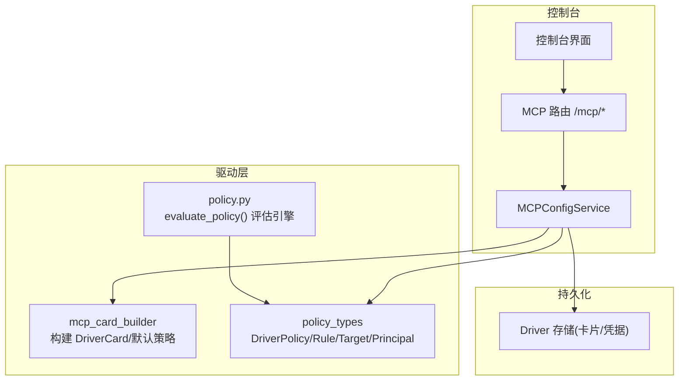
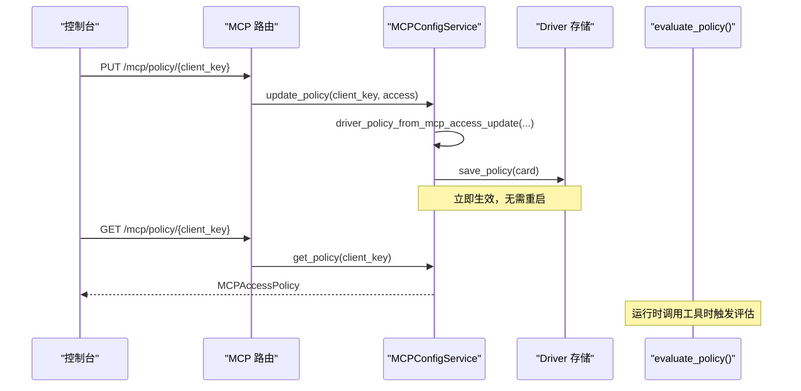
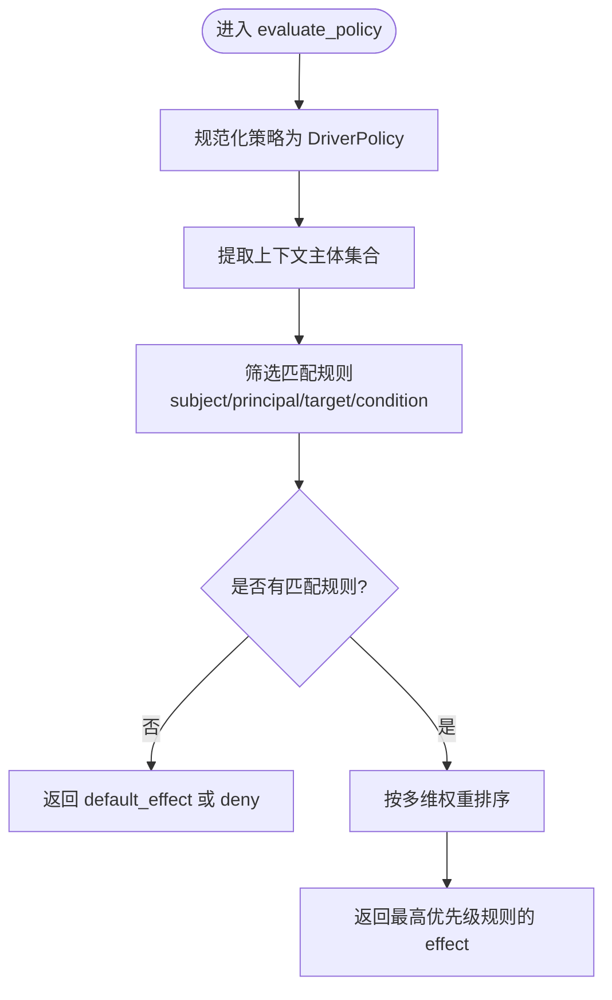
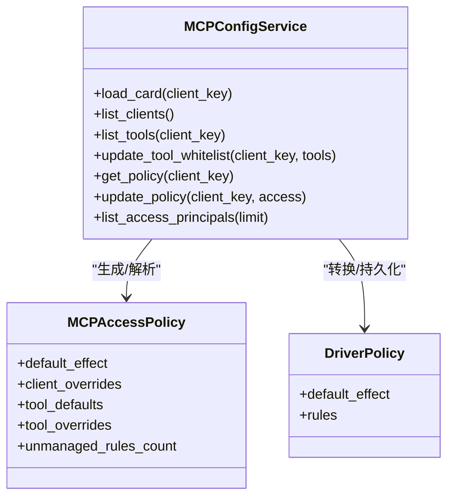
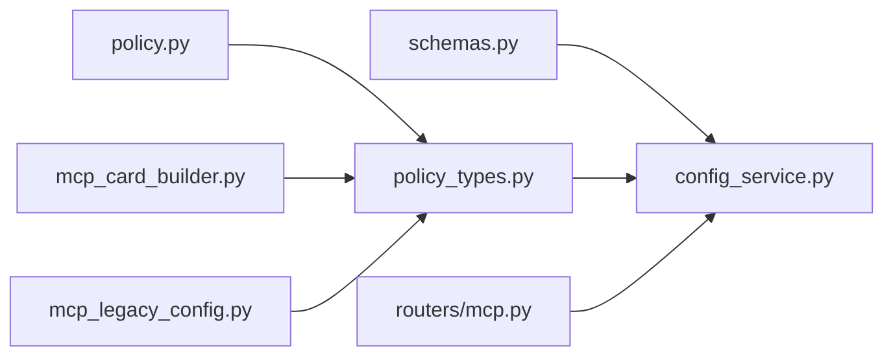

# 访问策略管理

<cite>
**本文引用的文件列表**
- [src/qwenpaw/drivers/policy.py](file://src/qwenpaw/drivers/policy.py)
- [src/qwenpaw/drivers/policy_types.py](file://src/qwenpaw/drivers/policy_types.py)
- [src/qwenpaw/app/mcp/config_service.py](file://src/qwenpaw/app/mcp/config_service.py)
- [src/qwenpaw/app/mcp/schemas.py](file://src/qwenpaw/app/mcp/schemas.py)
- [src/qwenpaw/app/routers/mcp.py](file://src/qwenpaw/app/routers/mcp.py)
- [src/qwenpaw/drivers/adapters/mcp_card_builder.py](file://src/qwenpaw/drivers/adapters/mcp_card_builder.py)
- [src/qwenpaw/drivers/adapters/mcp_legacy_config.py](file://src/qwenpaw/drivers/adapters/mcp_legacy_config.py)
- [website/public/docs/security.en.md](file://website/public/docs/security.en.md)
- [tests/integration/test_driver_mcp_approval_level_policy.py](file://tests/integration/test_driver_mcp_approval_level_policy.py)
</cite>

## 目录
1. [简介](#简介)
2. [项目结构](#项目结构)
3. [核心组件](#核心组件)
4. [架构总览](#架构总览)
5. [详细组件分析](#详细组件分析)
6. [依赖关系分析](#依赖关系分析)
7. [性能与可扩展性](#性能与可扩展性)
8. [故障排查指南](#故障排查指南)
9. [结论](#结论)
10. [附录：策略语法与示例](#附录策略语法与示例)

## 简介
本文件系统性阐述 QwenPaw 中面向 MCP（Model Context Protocol）客户端的访问策略管理系统。内容覆盖：
- 访问策略的核心概念、数据结构与评估算法
- 工具权限控制、访问规则定义与安全策略执行机制
- 策略配置的语法与规范，包括允许/拒绝/询问、通配符匹配、条件判断等
- 策略优先级与冲突处理
- 控制台（Console）可视化管理与 API 接口
- 实际代码路径与测试用例引用，便于初学者理解与高级开发者深入

## 项目结构
围绕 MCP 访问策略的关键代码分布在以下模块：
- 驱动层策略类型与评估引擎：drivers/policy_types.py、drivers/policy.py
- MCP 控制台服务与数据模型：app/mcp/config_service.py、app/mcp/schemas.py
- MCP 路由接口：app/routers/mcp.py
- MCP 卡片构建与默认策略：drivers/adapters/mcp_card_builder.py
- 历史配置迁移：drivers/adapters/mcp_legacy_config.py
- 文档与集成测试：website/public/docs/security.en.md、tests/integration/test_driver_mcp_approval_level_policy.py

图表来源
- [src/qwenpaw/app/routers/mcp.py:109-186](file://src/qwenpaw/app/routers/mcp.py#L109-L186)
- [src/qwenpaw/app/mcp/config_service.py:74-127](file://src/qwenpaw/app/mcp/config_service.py#L74-L127)
- [src/qwenpaw/drivers/adapters/mcp_card_builder.py:100-180](file://src/qwenpaw/drivers/adapters/mcp_card_builder.py#L100-L180)
- [src/qwenpaw/drivers/policy_types.py:43-93](file://src/qwenpaw/drivers/policy_types.py#L43-L93)
- [src/qwenpaw/drivers/policy.py:77-112](file://src/qwenpaw/drivers/policy.py#L77-L112)

章节来源
- [src/qwenpaw/app/routers/mcp.py:1-56](file://src/qwenpaw/app/routers/mcp.py#L1-L56)
- [src/qwenpaw/app/mcp/config_service.py:1-127](file://src/qwenpaw/app/mcp/config_service.py#L1-L127)
- [src/qwenpaw/drivers/adapters/mcp_card_builder.py:100-180](file://src/qwenpaw/drivers/adapters/mcp_card_builder.py#L100-L180)
- [src/qwenpaw/drivers/policy_types.py:1-93](file://src/qwenpaw/drivers/policy_types.py#L1-L93)
- [src/qwenpaw/drivers/policy.py:1-112](file://src/qwenpaw/drivers/policy.py#L1-L112)

## 核心组件
- 策略类型与数据模型
  - DriverPolicy：包含默认效果 default_effect 与规则列表 rules
  - PolicyRule：subject、effect、target、principal、condition
  - PolicyTarget：kind、name（支持通配符）
  - PolicyPrincipal：source_type/source_value、subject_type/subject_value（结构化主体选择器）
  - PolicyCondition：time_range（时间窗口）
- 策略评估引擎
  - evaluate_policy(policy, context)：返回 allow/deny/ask
  - 匹配函数：subject_matches、principal_matches、target_matches、condition_satisfied
  - 排序与冲突解决：按目标具体性、主体具体性、主题具体性与严格度综合排序，取最高优先级
- MCP 控制台服务
  - MCPConfigService：加载/保存卡片、列出工具、更新工具白名单、获取/更新策略、列出可选项主体
  - driver_policy_from_mcp_access_update：将控制台友好的策略对象转换为底层 DriverPolicy
  - mcp_access_policy_from_card：将底层 DriverPolicy 映射为控制台友好展示
- MCP 路由与 Schema
  - app/routers/mcp.py：提供 GET/PUT 策略接口、工具白名单接口、主体选项接口
  - schemas.py：MCPAccessPolicy、MCPAccessRule、MCPToolDefaultPolicy、MCPToolAccessOverride 等 Pydantic 模型

章节来源
- [src/qwenpaw/drivers/policy_types.py:43-93](file://src/qwenpaw/drivers/policy_types.py#L43-L93)
- [src/qwenpaw/drivers/policy.py:77-112](file://src/qwenpaw/drivers/policy.py#L77-L112)
- [src/qwenpaw/app/mcp/config_service.py:422-528](file://src/qwenpaw/app/mcp/config_service.py#L422-L528)
- [src/qwenpaw/app/mcp/schemas.py:166-258](file://src/qwenpaw/app/mcp/schemas.py#L166-L258)
- [src/qwenpaw/app/routers/mcp.py:109-186](file://src/qwenpaw/app/routers/mcp.py#L109-L186)

## 架构总览
MCP 访问策略在“控制台编辑 → 持久化 → 运行时评估”的链路中工作：
- 控制台通过 /mcp/policy/{client_key} 读取或更新策略
- 服务层将控制台策略转换为底层 DriverPolicy 并持久化到 Driver 存储
- 运行时调用能力时，使用 evaluate_policy 对请求上下文进行匹配与决策
- 新创建的 MCP 客户端默认策略为 ask，确保外部服务器首次接入需人工审批

图表来源
- [src/qwenpaw/app/routers/mcp.py:120-146](file://src/qwenpaw/app/routers/mcp.py#L120-L146)
- [src/qwenpaw/app/mcp/config_service.py:245-256](file://src/qwenpaw/app/mcp/config_service.py#L245-L256)
- [src/qwenpaw/drivers/policy.py:77-112](file://src/qwenpaw/drivers/policy.py#L77-L112)

## 详细组件分析

### 策略类型与评估引擎
- 数据结构
  - DriverPolicy：default_effect 与 rules 列表
  - PolicyRule：subject（字符串模式）、effect（allow/ask/deny）、target（kind/name）、principal（结构化选择器）、condition（时间范围）
  - PolicyTarget：kind/name 支持通配符
  - PolicyPrincipal：source_type/source_value、subject_type/subject_value
- 评估流程
  - 收集上下文主体集合（context_subjects）
  - 过滤匹配规则：subject 匹配、principal 匹配、target 匹配、条件满足
  - 若无匹配，回退到 default_effect；否则按多维权重排序取最高优先级规则 effect
- 权重维度
  - target_name_specificity、target_kind_specificity
  - principal_specificity（source/subject 的具体性）
  - subject_specificity（精确 > 类型前缀通配 > 全局）
  - _STRICTNESS[effect]（deny > ask > allow）

图表来源
- [src/qwenpaw/drivers/policy.py:77-112](file://src/qwenpaw/drivers/policy.py#L77-L112)
- [src/qwenpaw/drivers/policy.py:125-184](file://src/qwenpaw/drivers/policy.py#L125-L184)
- [src/qwenpaw/drivers/policy.py:186-210](file://src/qwenpaw/drivers/policy.py#L186-L210)
- [src/qwenpaw/drivers/policy.py:212-225](file://src/qwenpaw/drivers/policy.py#L212-L225)

章节来源
- [src/qwenpaw/drivers/policy_types.py:43-93](file://src/qwenpaw/drivers/policy_types.py#L43-L93)
- [src/qwenpaw/drivers/policy.py:77-112](file://src/qwenpaw/drivers/policy.py#L77-L112)
- [src/qwenpaw/drivers/policy.py:125-225](file://src/qwenpaw/drivers/policy.py#L125-L225)

### MCP 控制台策略服务
- 功能要点
  - list_tools/update_tool_whitelist：基于 card.config.tools 实现工具白名单
  - get_policy/update_policy：读取/保存 MCP 策略，即时生效
  - list_access_principals：从聊天记录聚合最近使用的 channel/user 组合，供策略编辑下拉选择
  - driver_policy_from_mcp_access_update：将控制台策略对象转换为底层规则，保留未管理的 YAML 规则
  - mcp_access_policy_from_card：将底层规则映射为控制台友好的 client_overrides/tool_defaults/tool_overrides
- 校验与错误
  - 空名称、空 source_value、user 类型但无 user_value 等情况抛出 HTTP 400
  - 去重逻辑避免重复规则

图表来源
- [src/qwenpaw/app/mcp/config_service.py:74-127](file://src/qwenpaw/app/mcp/config_service.py#L74-L127)
- [src/qwenpaw/app/mcp/config_service.py:422-528](file://src/qwenpaw/app/mcp/config_service.py#L422-L528)
- [src/qwenpaw/app/mcp/schemas.py:236-258](file://src/qwenpaw/app/mcp/schemas.py#L236-L258)
- [src/qwenpaw/drivers/policy_types.py:80-93](file://src/qwenpaw/drivers/policy_types.py#L80-L93)

章节来源
- [src/qwenpaw/app/mcp/config_service.py:128-182](file://src/qwenpaw/app/mcp/config_service.py#L128-L182)
- [src/qwenpaw/app/mcp/config_service.py:183-244](file://src/qwenpaw/app/mcp/config_service.py#L183-L244)
- [src/qwenpaw/app/mcp/config_service.py:452-528](file://src/qwenpaw/app/mcp/config_service.py#L452-L528)

### MCP 路由与 API
- 关键接口
  - GET /mcp/policy/{client_key}：获取已保存的策略
  - PUT /mcp/policy/{client_key}：更新策略
  - GET /mcp/access-principals：列出可选择的主体（channel/user）
  - GET /mcp/tools/{client_key}：列出工具及启用状态
  - PUT /mcp/tools/{client_key}：更新工具白名单
- 行为说明
  - 策略更新后即时生效，不重启传输层
  - 工具白名单为空表示启用全部工具，非空则仅启用列出的工具

章节来源
- [src/qwenpaw/app/routers/mcp.py:109-186](file://src/qwenpaw/app/routers/mcp.py#L109-L186)
- [tests/integration/test_driver_mcp_approval_level_policy.py:104-182](file://tests/integration/test_driver_mcp_approval_level_policy.py#L104-L182)

### MCP 卡片构建与默认策略
- 新建 MCP 客户端时，默认策略为 ask，确保外部服务器首次接入需要人工批准
- 根据 transport 类型（stdio/http/sse）组装 endpoint/env/headers，并将敏感值绑定到凭据存储
- OAuth 支持：自动注入 Authorization Bearer 头绑定

章节来源
- [src/qwenpaw/drivers/adapters/mcp_card_builder.py:100-180](file://src/qwenpaw/drivers/adapters/mcp_card_builder.py#L100-L180)
- [src/qwenpaw/drivers/adapters/mcp_card_builder.py:226-268](file://src/qwenpaw/drivers/adapters/mcp_card_builder.py#L226-L268)

### 历史配置迁移
- 将旧版 agent.json 中的 MCP 客户端迁移至新的 Driver 存储格式
- 迁移过程中检测潜在敏感参数（如 args 含 token），给出警告并跳过不安全项
- 为新迁移的客户端设置默认策略为 ask

章节来源
- [src/qwenpaw/drivers/adapters/mcp_legacy_config.py:71-143](file://src/qwenpaw/drivers/adapters/mcp_legacy_config.py#L71-L143)
- [src/qwenpaw/drivers/adapters/mcp_legacy_config.py:145-231](file://src/qwenpaw/drivers/adapters/mcp_legacy_config.py#L145-L231)

## 依赖关系分析
- 控制台服务依赖策略类型与评估引擎
- 路由层暴露策略与工具管理能力
- 卡片构建器负责创建/更新 DriverCard 并设定默认策略
- 历史迁移模块兼容旧配置，保证平滑升级

图表来源
- [src/qwenpaw/app/mcp/config_service.py:53-58](file://src/qwenpaw/app/mcp/config_service.py#L53-L58)
- [src/qwenpaw/drivers/policy_types.py:1-40](file://src/qwenpaw/drivers/policy_types.py#L1-L40)
- [src/qwenpaw/drivers/policy.py:1-47](file://src/qwenpaw/drivers/policy.py#L1-L47)
- [src/qwenpaw/app/routers/mcp.py:11-26](file://src/qwenpaw/app/routers/mcp.py#L11-L26)
- [src/qwenpaw/drivers/adapters/mcp_card_builder.py:19-33](file://src/qwenpaw/drivers/adapters/mcp_card_builder.py#L19-L33)
- [src/qwenpaw/drivers/adapters/mcp_legacy_config.py:21-37](file://src/qwenpaw/drivers/adapters/mcp_legacy_config.py#L21-L37)

章节来源
- [src/qwenpaw/app/mcp/config_service.py:1-728](file://src/qwenpaw/app/mcp/config_service.py#L1-L728)
- [src/qwenpaw/drivers/policy_types.py:1-223](file://src/qwenpaw/drivers/policy_types.py#L1-L223)
- [src/qwenpaw/drivers/policy.py:1-328](file://src/qwenpaw/drivers/policy.py#L1-L328)
- [src/qwenpaw/app/routers/mcp.py:1-186](file://src/qwenpaw/app/routers/mcp.py#L1-L186)
- [src/qwenpaw/drivers/adapters/mcp_card_builder.py:1-379](file://src/qwenpaw/drivers/adapters/mcp_card_builder.py#L1-L379)
- [src/qwenpaw/drivers/adapters/mcp_legacy_config.py:1-325](file://src/qwenpaw/drivers/adapters/mcp_legacy_config.py#L1-L325)

## 性能与可扩展性
- 策略评估复杂度
  - 规则数量 N 线性扫描，排序阶段 O(N log N)，总体 O(N log N)
  - 主体集合去重与匹配为常数级操作
- 可扩展点
  - 新增条件类型（如 IP 白名单、设备指纹）可在 condition_satisfied 扩展
  - 新增主体类型（如组织、租户）可在 principal_matches/_subject_scope_matches 扩展
  - 控制台策略映射可增加更多可视化字段（如条件编辑器）

[本节为通用指导，不涉及具体文件分析]

## 故障排查指南
- 常见问题
  - 策略未生效：确认是否通过 /mcp/policy/{client_key} 正确更新且未重启；检查 unmanaged_rules_count 提示的 YAML 规则是否被控制台忽略
  - 工具不可用：检查工具白名单 tools 是否为空或非空列表；确认 MCP 服务端可用
  - 主体选项为空：list_access_principals 依赖聊天记录，若没有近期会话则无法显示
- 调试方法
  - 查看日志：策略评估与未知 source_type 会输出警告
  - 使用集成测试：参考 test_driver_mcp_approval_level_policy.py 验证 deny/ask/allow 行为与即时生效特性

章节来源
- [src/qwenpaw/drivers/policy.py:240-246](file://src/qwenpaw/drivers/policy.py#L240-L246)
- [tests/integration/test_driver_mcp_approval_level_policy.py:76-182](file://tests/integration/test_driver_mcp_approval_level_policy.py#L76-L182)

## 结论
QwenPaw 的 MCP 访问策略系统以“控制台友好 + 底层通用引擎”的双层设计实现：
- 控制台提供直观的策略编辑与即时生效能力
- 底层引擎提供严格的匹配与排序机制，确保策略冲突可预测
- 默认 ask 策略保障安全基线，结合工具白名单与主体选择器实现细粒度控制

[本节为总结，不涉及具体文件分析]

## 附录：策略语法与示例

### 策略语法与规范
- 效果 effect：allow、ask、deny
- 目标 target：kind（如 tool）、name（支持 * 通配符）
- 主体 selector：
  - subject：字符串模式，支持 "*" 与 "type:*" 前缀通配
  - principal：结构化选择器，source_type/source_value、subject_type/subject_value
- 条件 condition：time_range（after/before/weekdays）

章节来源
- [src/qwenpaw/drivers/policy_types.py:43-93](file://src/qwenpaw/drivers/policy_types.py#L43-L93)
- [src/qwenpaw/drivers/policy.py:125-184](file://src/qwenpaw/drivers/policy.py#L125-L184)
- [src/qwenpaw/drivers/policy.py:212-225](file://src/qwenpaw/drivers/policy.py#L212-L225)

### 控制台策略对象
- MCPAccessPolicy：
  - default_effect：客户端级默认效果
  - client_overrides：客户端级主体覆盖
  - tool_defaults：按工具默认效果
  - tool_overrides：按工具+主体的覆盖
  - unmanaged_rules_count：YAML 规则计数（不可编辑）

章节来源
- [src/qwenpaw/app/mcp/schemas.py:236-258](file://src/qwenpaw/app/mcp/schemas.py#L236-L258)

### 典型场景与示例路径
- 限制特定工具的调用
  - 为某工具设置 deny，其他工具保持默认 ask
  - 参考：[website/public/docs/security.en.md:799-846](file://website/public/docs/security.en.md#L799-L846)
- 基于用户角色的权限管理
  - 使用 principal.subject_type=user 与 subject_value=用户标识
  - 参考：[src/qwenpaw/app/mcp/config_service.py:488-524](file://src/qwenpaw/app/mcp/config_service.py#L488-L524)
- 策略优先级与冲突处理
  - 更具体的 target/principal/subject 优先；相同优先级下 deny > ask > allow
  - 参考：[src/qwenpaw/drivers/policy.py:97-112](file://src/qwenpaw/drivers/policy.py#L97-L112)
- 策略即时生效与不重启
  - 参考：[tests/integration/test_driver_mcp_approval_level_policy.py:104-182](file://tests/integration/test_driver_mcp_approval_level_policy.py#L104-L182)