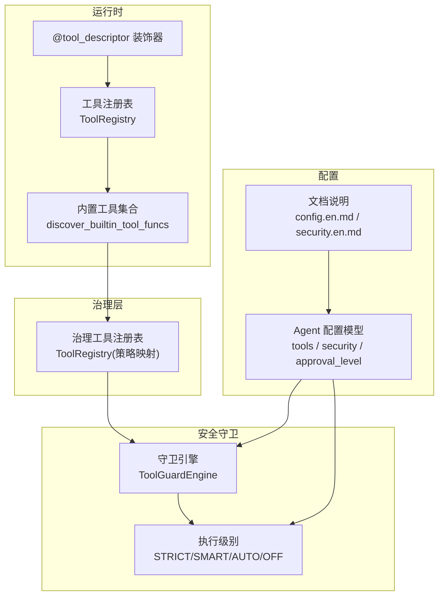
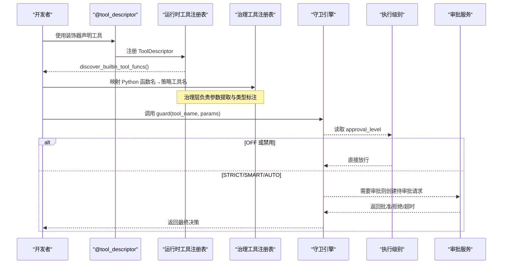
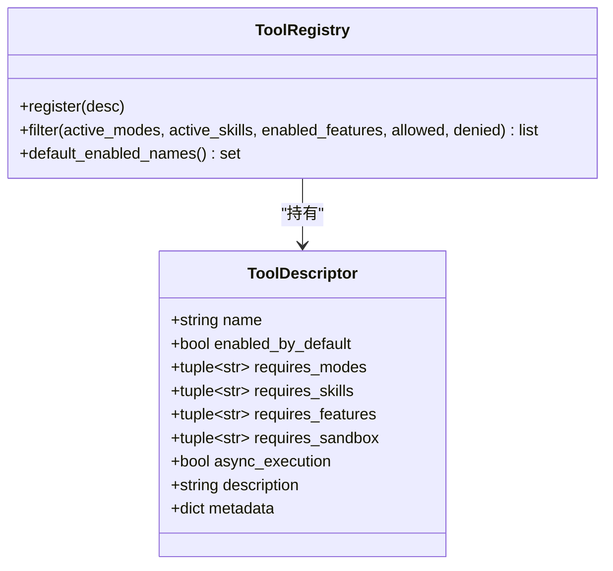
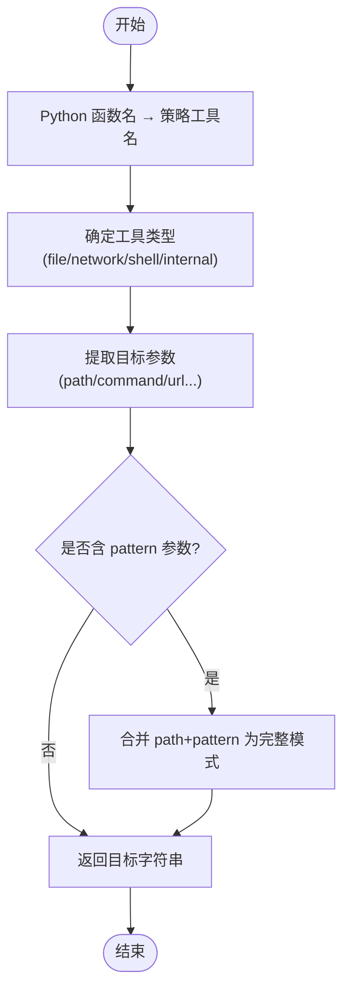
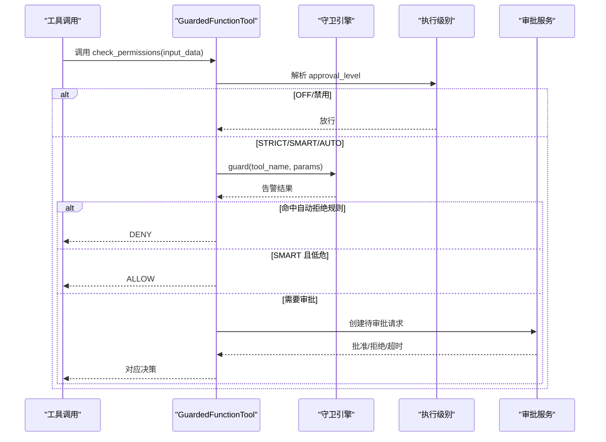
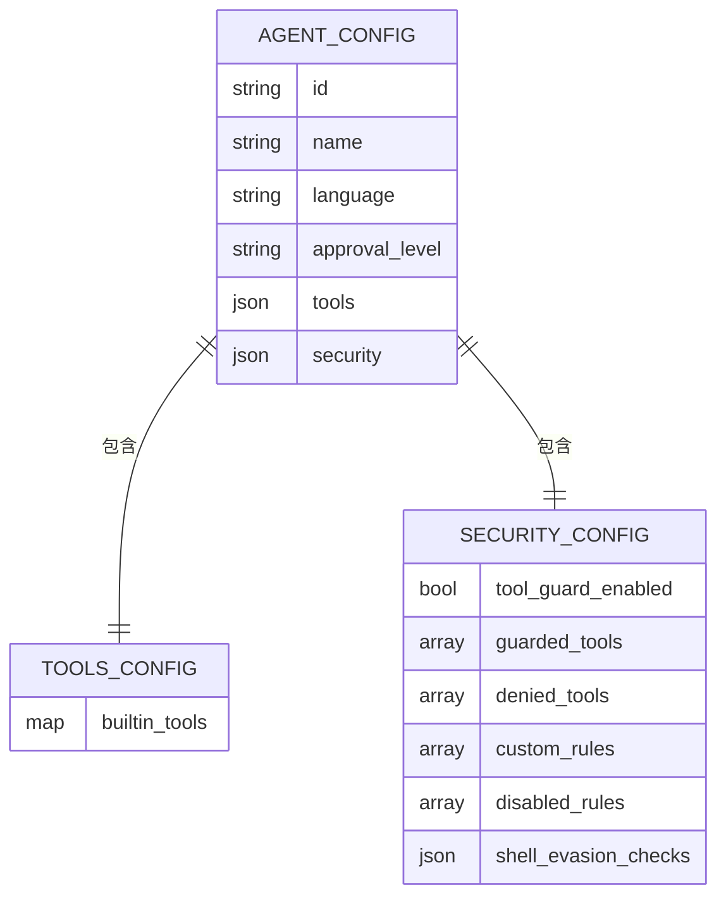
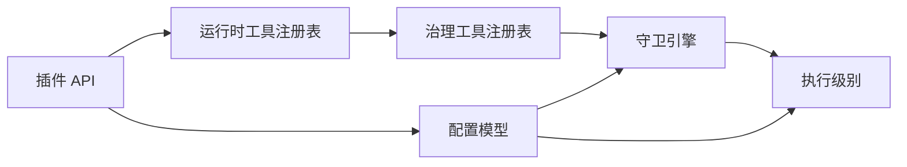

# Agent 工具配置

<cite>
**本文引用的文件**   
- [src/qwenpaw/runtime/tool_registry.py](file://src/qwenpaw/runtime/tool_registry.py)
- [src/qwenpaw/agents/tools/__init__.py](file://src/qwenpaw/agents/tools/__init__.py)
- [src/qwenpaw/governance/tool_registry.py](file://src/qwenpaw/governance/tool_registry.py)
- [src/qwenpaw/security/tool_guard/engine.py](file://src/qwenpaw/security/tool_guard/engine.py)
- [src/qwenpaw/security/tool_guard/__init__.py](file://src/qwenpaw/security/tool_guard/__init__.py)
- [src/qwenpaw/security/tool_guard/execution_level.py](file://src/qwenpaw/security/tool_guard/execution_level.py)
- [src/qwenpaw/runtime/tool_guard.py](file://src/qwenpaw/runtime/tool_guard.py)
- [src/qwenpaw/config/config.py](file://src/qwenpaw/config/config.py)
- [src/qwenpaw/plugins/api.py](file://src/qwenpaw/plugins/api.py)
- [website/public/docs/config.en.md](file://website/public/docs/config.en.md)
- [website/public/docs/security.en.md](file://website/public/docs/security.en.md)
</cite>

## 目录
1. [简介](#简介)
2. [项目结构](#项目结构)
3. [核心组件](#核心组件)
4. [架构总览](#架构总览)
5. [详细组件分析](#详细组件分析)
6. [依赖关系分析](#依赖关系分析)
7. [性能与可扩展性](#性能与可扩展性)
8. [故障排查指南](#故障排查指南)
9. [结论](#结论)
10. [附录：示例与最佳实践](#附录示例与最佳实践)

## 简介
本文件面向 QwenPaw 的 Agent 工具配置系统，系统性阐述工具的注册、发现、配置管理与执行守卫机制。内容覆盖：
- 工具元数据解析与参数校验
- 工具开关、权限与安全策略（执行级别控制）
- 工具守卫系统的集成（规则引擎、沙箱要求、审计日志）
- 前端配置界面能力（开关、调优、权限设置）
- 自定义工具注册与策略配置的实际路径指引
- 常见问题定位与优化建议

## 项目结构
围绕“工具配置”的关键代码分布在以下模块：
- 运行时工具注册与装饰器：用于声明式注册内置工具函数并自动收集
- 治理层工具元数据注册：将 Python 函数名映射到策略侧工具名，定义目标参数类型
- 安全守卫引擎：在调用前扫描参数、匹配规则、生成告警结果
- 执行级别控制：决定是否需要审批、是否放行或拒绝
- 配置模型：Agent 级 tools、security、approval_level 等字段
- 插件 API：支持向工作区注入工具并持久化到 agent.json
- 文档：Console 端配置项说明与示例

图表来源
- [src/qwenpaw/runtime/tool_registry.py:1-234](file://src/qwenpaw/runtime/tool_registry.py#L1-L234)
- [src/qwenpaw/agents/tools/__init__.py:1-89](file://src/qwenpaw/agents/tools/__init__.py#L1-L89)
- [src/qwenpaw/governance/tool_registry.py:1-243](file://src/qwenpaw/governance/tool_registry.py#L1-L243)
- [src/qwenpaw/security/tool_guard/engine.py:1-269](file://src/qwenpaw/security/tool_guard/engine.py#L1-L269)
- [src/qwenpaw/security/tool_guard/execution_level.py:1-80](file://src/qwenpaw/security/tool_guard/execution_level.py#L1-L80)
- [src/qwenpaw/config/config.py:1400-1599](file://src/qwenpaw/config/config.py#L1400-L1599)
- [website/public/docs/config.en.md:200-280](file://website/public/docs/config.en.md#L200-L280)
- [website/public/docs/security.en.md:33-283](file://website/public/docs/security.en.md#L33-L283)

章节来源
- [src/qwenpaw/runtime/tool_registry.py:1-234](file://src/qwenpaw/runtime/tool_registry.py#L1-L234)
- [src/qwenpaw/agents/tools/__init__.py:1-89](file://src/qwenpaw/agents/tools/__init__.py#L1-L89)
- [src/qwenpaw/governance/tool_registry.py:1-243](file://src/qwenpaw/governance/tool_registry.py#L1-L243)
- [src/qwenpaw/security/tool_guard/engine.py:1-269](file://src/qwenpaw/security/tool_guard/engine.py#L1-L269)
- [src/qwenpaw/security/tool_guard/execution_level.py:1-80](file://src/qwenpaw/security/tool_guard/execution_level.py#L1-L80)
- [src/qwenpaw/config/config.py:1400-1599](file://src/qwenpaw/config/config.py#L1400-L1599)
- [website/public/docs/config.en.md:200-280](file://website/public/docs/config.en.md#L200-L280)
- [website/public/docs/security.en.md:33-283](file://website/public/docs/security.en.md#L33-L283)

## 核心组件
- 工具描述符与注册表
  - ToolDescriptor：声明工具名称、默认启用、模式/技能/特性/沙箱需求、异步执行、描述与元数据
  - ToolRegistry：维护描述符集合，提供按上下文过滤（模式、技能、特性、白名单/黑名单）
- 治理层工具元数据
  - 将 Python 函数名映射为策略工具名，记录目标参数名、是否为文件/网络/Shell/内部工具、是否需要沙箱
- 安全守卫引擎
  - 组合多个 Guardian（文件路径、规则匹配、Shell 规避检测），产出告警结果，支持自动拒绝规则与范围控制
- 执行级别控制
  - STRICT/SMART/AUTO/OFF 四种策略，决定是否需要用户审批或自动放行
- 配置模型
  - Agent 级 approval_level、tools.builtin_tools、security.tool_guard 等字段
- 插件 API
  - 支持向工作区 ToolRegistry 注入工具，并将内置工具配置写入 agent.json

章节来源
- [src/qwenpaw/runtime/tool_registry.py:1-234](file://src/qwenpaw/runtime/tool_registry.py#L1-L234)
- [src/qwenpaw/governance/tool_registry.py:1-243](file://src/qwenpaw/governance/tool_registry.py#L1-L243)
- [src/qwenpaw/security/tool_guard/engine.py:1-269](file://src/qwenpaw/security/tool_guard/engine.py#L1-L269)
- [src/qwenpaw/security/tool_guard/execution_level.py:1-80](file://src/qwenpaw/security/tool_guard/execution_level.py#L1-L80)
- [src/qwenpaw/config/config.py:1400-1599](file://src/qwenpaw/config/config.py#L1400-L1599)
- [src/qwenpaw/plugins/api.py:83-185](file://src/qwenpaw/plugins/api.py#L83-L185)

## 架构总览
下图展示了从工具声明到执行守卫的完整链路：装饰器收集 → 注册表过滤 → 治理映射 → 守卫检查 → 执行级别决策 → 审批/放行。

图表来源
- [src/qwenpaw/runtime/tool_registry.py:170-234](file://src/qwenpaw/runtime/tool_registry.py#L170-L234)
- [src/qwenpaw/agents/tools/__init__.py:48-58](file://src/qwenpaw/agents/tools/__init__.py#L48-L58)
- [src/qwenpaw/governance/tool_registry.py:207-243](file://src/qwenpaw/governance/tool_registry.py#L207-L243)
- [src/qwenpaw/security/tool_guard/engine.py:200-257](file://src/qwenpaw/security/tool_guard/engine.py#L200-L257)
- [src/qwenpaw/security/tool_guard/execution_level.py:15-80](file://src/qwenpaw/security/tool_guard/execution_level.py#L15-L80)
- [src/qwenpaw/runtime/tool_guard.py:130-258](file://src/qwenpaw/runtime/tool_guard.py#L130-L258)

## 详细组件分析

### 工具注册与发现（运行时）
- 装饰器 @tool_descriptor
  - 将函数标记为工具，附带名称、默认启用、模式/技能/特性/沙箱需求、异步执行、描述与元数据
  - 自动收集到全局列表，供后续构建工具集
- 内置工具入口
  - agents/tools/__init__.py 通过导入触发装饰器，统一暴露 discover_builtin_tool_funcs
- 注册表过滤
  - ToolRegistry.filter 根据 active_modes、active_skills、enabled_features、allowed/denied 筛选可用工具

图表来源
- [src/qwenpaw/runtime/tool_registry.py:16-134](file://src/qwenpaw/runtime/tool_registry.py#L16-L134)
- [src/qwenpaw/agents/tools/__init__.py:1-89](file://src/qwenpaw/agents/tools/__init__.py#L1-L89)

章节来源
- [src/qwenpaw/runtime/tool_registry.py:16-134](file://src/qwenpaw/runtime/tool_registry.py#L16-L134)
- [src/qwenpaw/agents/tools/__init__.py:1-89](file://src/qwenpaw/agents/tools/__init__.py#L1-L89)

### 治理层工具元数据与参数提取
- 治理工具注册表
  - 记录工具类型（file/network/shell/internal）、目标参数名、是否需沙箱
  - 提供 extract_target 将输入参数解析为目标路径/命令等，便于规则匹配
  - 提供 python_to_policy_name 将 Python 函数名映射为策略工具名
- 默认注册
  - 内置大量工具（Read/Write/Bash/WebSearch 等）及映射关系

图表来源
- [src/qwenpaw/governance/tool_registry.py:106-141](file://src/qwenpaw/governance/tool_registry.py#L106-L141)
- [src/qwenpaw/governance/tool_registry.py:207-243](file://src/qwenpaw/governance/tool_registry.py#L207-L243)

章节来源
- [src/qwenpaw/governance/tool_registry.py:1-243](file://src/qwenpaw/governance/tool_registry.py#L1-L243)

### 安全守卫系统与执行级别
- 守卫引擎
  - 组合多个 Guardian：文件路径、规则匹配、Shell 规避检测
  - 支持 guarded_tools/denied_tools/auto_denied_rules 的范围控制
  - 提供 reload_rules 动态刷新规则
- 执行级别
  - STRICT：所有工具均需审批
  - SMART：低风险自动放行，中高风险需审批
  - AUTO：仅受控工具需审批（兼容旧行为）
  - OFF：完全禁用守卫
- 包装器 GuardedFunctionTool
  - 在每次工具调用前解析执行级别、调用守卫引擎、必要时发起审批流程

图表来源
- [src/qwenpaw/security/tool_guard/engine.py:200-257](file://src/qwenpaw/security/tool_guard/engine.py#L200-L257)
- [src/qwenpaw/security/tool_guard/execution_level.py:15-80](file://src/qwenpaw/security/tool_guard/execution_level.py#L15-L80)
- [src/qwenpaw/runtime/tool_guard.py:130-258](file://src/qwenpaw/runtime/tool_guard.py#L130-L258)

章节来源
- [src/qwenpaw/security/tool_guard/engine.py:1-269](file://src/qwenpaw/security/tool_guard/engine.py#L1-L269)
- [src/qwenpaw/security/tool_guard/execution_level.py:1-80](file://src/qwenpaw/security/tool_guard/execution_level.py#L1-L80)
- [src/qwenpaw/runtime/tool_guard.py:1-415](file://src/qwenpaw/runtime/tool_guard.py#L1-L415)

### 配置模型与持久化
- Agent 配置
  - approval_level：控制执行级别
  - tools.builtin_tools：内置工具开关、描述、图标、是否异步执行等
  - security.tool_guard：守卫开关、受控工具、拒绝工具、自定义规则、禁用规则、Shell 规避检查开关
- 插件 API 持久化
  - 当通过插件注入工具时，可自动写入 agent.json 的 tools.builtin_tools 条目，实现“即插即用”的配置管理

图表来源
- [src/qwenpaw/config/config.py:1400-1599](file://src/qwenpaw/config/config.py#L1400-L1599)
- [website/public/docs/config.en.md:200-280](file://website/public/docs/config.en.md#L200-L280)
- [website/public/docs/security.en.md:33-283](file://website/public/docs/security.en.md#L33-L283)
- [src/qwenpaw/plugins/api.py:114-166](file://src/qwenpaw/plugins/api.py#L114-L166)

章节来源
- [src/qwenpaw/config/config.py:1400-1599](file://src/qwenpaw/config/config.py#L1400-L1599)
- [website/public/docs/config.en.md:200-280](file://website/public/docs/config.en.md#L200-L280)
- [website/public/docs/security.en.md:33-283](file://website/public/docs/security.en.md#L33-L283)
- [src/qwenpaw/plugins/api.py:83-185](file://src/qwenpaw/plugins/api.py#L83-L185)

### 工具配置界面（Console）
- 功能概览
  - 工具开关：在 Tools 面板中启用/禁用内置工具
  - 参数调优：通过 security.tool_guard 的 shell_evasion_checks 等细粒度开关调整防护强度
  - 权限设置：在 Agents 配置中设置 approval_level，或在会话级传入 request_context.approval_level 进行覆盖
- 数据来源
  - Console 通过后端 API 读写 agent.json 中的 tools 与 security 字段；approval_level 可直接在 Agent 卡片中修改

章节来源
- [website/public/docs/security.en.md:165-184](file://website/public/docs/security.en.md#L165-L184)
- [website/public/docs/config.en.md:200-280](file://website/public/docs/config.en.md#L200-L280)

## 依赖关系分析
- 运行时注册表与治理注册表的职责分离
  - 运行时关注“哪些工具可用”，治理层关注“如何对工具参数进行策略匹配”
- 守卫引擎与执行级别的解耦
  - 守卫引擎只负责扫描与判定，执行级别决定是否需要审批或放行
- 配置驱动
  - 通过 config.py 的 Pydantic 模型约束字段，确保配置一致性
- 插件扩展点
  - 插件 API 可同时更新内存注册表与持久化配置，保证热加载与重启后一致

图表来源
- [src/qwenpaw/runtime/tool_registry.py:1-234](file://src/qwenpaw/runtime/tool_registry.py#L1-L234)
- [src/qwenpaw/governance/tool_registry.py:1-243](file://src/qwenpaw/governance/tool_registry.py#L1-L243)
- [src/qwenpaw/security/tool_guard/engine.py:1-269](file://src/qwenpaw/security/tool_guard/engine.py#L1-L269)
- [src/qwenpaw/security/tool_guard/execution_level.py:1-80](file://src/qwenpaw/security/tool_guard/execution_level.py#L1-L80)
- [src/qwenpaw/config/config.py:1400-1599](file://src/qwenpaw/config/config.py#L1400-L1599)
- [src/qwenpaw/plugins/api.py:83-185](file://src/qwenpaw/plugins/api.py#L83-L185)

章节来源
- [src/qwenpaw/runtime/tool_registry.py:1-234](file://src/qwenpaw/runtime/tool_registry.py#L1-L234)
- [src/qwenpaw/governance/tool_registry.py:1-243](file://src/qwenpaw/governance/tool_registry.py#L1-L243)
- [src/qwenpaw/security/tool_guard/engine.py:1-269](file://src/qwenpaw/security/tool_guard/engine.py#L1-L269)
- [src/qwenpaw/security/tool_guard/execution_level.py:1-80](file://src/qwenpaw/security/tool_guard/execution_level.py#L1-L80)
- [src/qwenpaw/config/config.py:1400-1599](file://src/qwenpaw/config/config.py#L1400-L1599)
- [src/qwenpaw/plugins/api.py:83-185](file://src/qwenpaw/plugins/api.py#L83-L185)

## 性能与可扩展性
- 守卫性能
  - 守卫引擎以轻量规则匹配为主，默认 Guardian 初始化失败会降级并记录警告，避免阻塞主流程
- 可扩展点
  - 新增 Guardian：实现 BaseToolGuardian 接口并通过 register_guardian 注册
  - 自定义规则：通过 security.tool_guard.custom_rules 添加 YAML 正则规则
  - 执行级别：在会话级通过 request_context.approval_level 覆盖 Agent 级配置，无需重启
- 资源隔离
  - 治理层对部分工具标记 sandbox_required=True，确保在无沙箱配置时严格失败关闭，避免误用

章节来源
- [src/qwenpaw/security/tool_guard/engine.py:85-110](file://src/qwenpaw/security/tool_guard/engine.py#L85-L110)
- [src/qwenpaw/security/tool_guard/engine.py:166-171](file://src/qwenpaw/security/tool_guard/engine.py#L166-L171)
- [src/qwenpaw/governance/tool_registry.py:37-69](file://src/qwenpaw/governance/tool_registry.py#L37-L69)

## 故障排查指南
- 工具未出现在可用列表
  - 确认工具是否被 @tool_descriptor 装饰并在 agents/tools/__init__.py 中被导入
  - 检查 ToolRegistry.filter 的 allowed/denied 与 requires_* 条件
- 守卫误报/漏报
  - 查看 security.tool_guard.disabled_rules 与 shell_evasion_checks 开关
  - 使用 console 的 Security → Tool Guard 页面调整规则与范围
- 审批卡不出现或超时
  - 检查 approval_level 是否为 STRICT/SMART/AUTO
  - 确认审批服务可用与会话上下文（session_id、user_id、channel）是否正确传递
- 沙箱相关错误
  - 对于 sandbox_required=True 的工具，确保提供有效的沙箱配置，否则会被拒绝

章节来源
- [src/qwenpaw/agents/tools/__init__.py:1-89](file://src/qwenpaw/agents/tools/__init__.py#L1-L89)
- [src/qwenpaw/security/tool_guard/engine.py:154-171](file://src/qwenpaw/security/tool_guard/engine.py#L154-L171)
- [website/public/docs/security.en.md:165-184](file://website/public/docs/security.en.md#L165-L184)
- [src/qwenpaw/governance/tool_registry.py:37-69](file://src/qwenpaw/governance/tool_registry.py#L37-L69)

## 结论
QwenPaw 的 Agent 工具配置体系通过“声明式注册 + 治理映射 + 守卫引擎 + 执行级别”的分层设计，实现了灵活、可控、可扩展的工具生命周期管理。结合 Console 配置界面与插件 API，既能满足初学者的易用性，也能为高级用户提供深度定制能力。

## 附录：示例与最佳实践
- 注册自定义工具
  - 在工具函数上使用 @tool_descriptor 装饰器，并在 agents/tools/__init__.py 中导入该模块以触发自动收集
  - 如需在策略层生效，请在治理工具注册表中补充 python_to_policy_name 映射与目标参数信息
- 配置工具执行策略
  - 在 agent.json 的 approval_level 设置为 STRICT/SMART/AUTO/OFF
  - 在 security.tool_guard 中配置 guarded_tools/denied_tools/custom_rules/disabled_rules/shell_evasion_checks
- 监控工具使用情况
  - 通过守卫引擎的日志输出与告警结果观察工具调用风险
  - 在 Console 的安全页面查看规则命中与审批历史
- 常见问题
  - 依赖缺失：确保工具所需的外部依赖已安装，并在 requirements.txt 中声明
  - 执行权限不足：在沙箱配置中授予必要的文件系统访问权限
  - 性能瓶颈：减少不必要的守卫规则数量，合理设置 guarded_tools 范围

章节来源
- [src/qwenpaw/runtime/tool_registry.py:170-234](file://src/qwenpaw/runtime/tool_registry.py#L170-L234)
- [src/qwenpaw/governance/tool_registry.py:207-243](file://src/qwenpaw/governance/tool_registry.py#L207-L243)
- [website/public/docs/security.en.md:33-283](file://website/public/docs/security.en.md#L33-L283)
- [website/public/docs/config.en.md:200-280](file://website/public/docs/config.en.md#L200-L280)