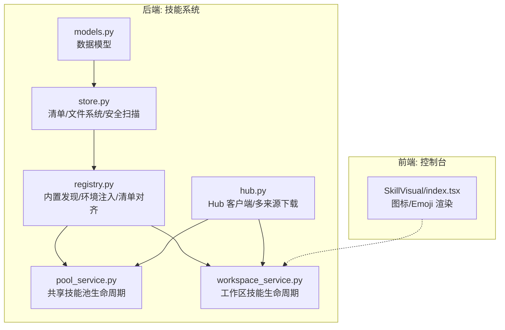
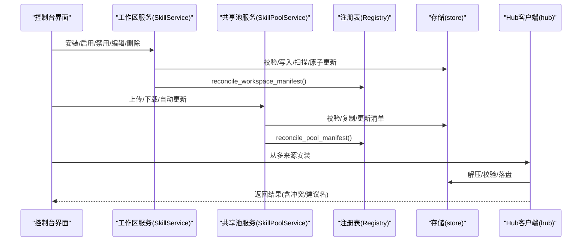
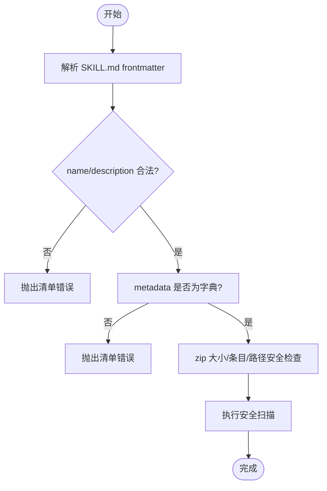
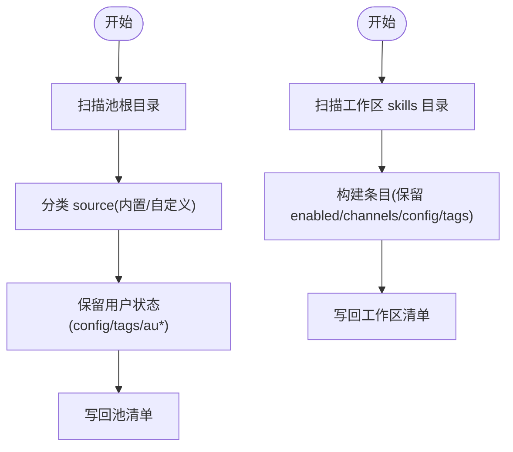
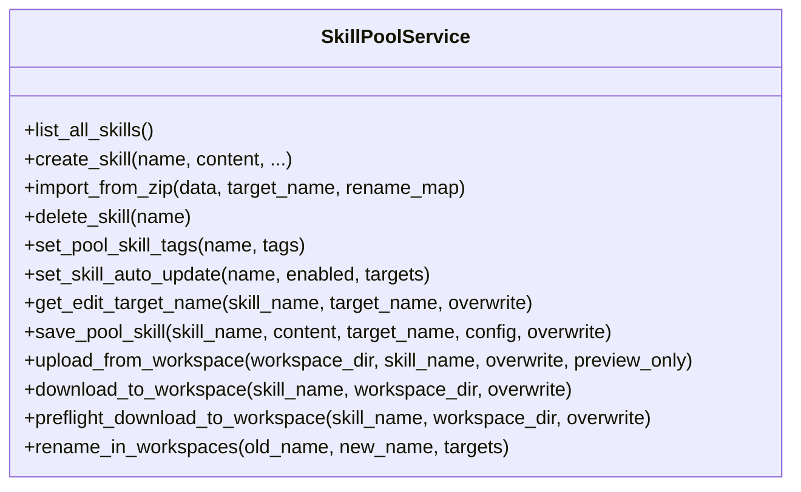
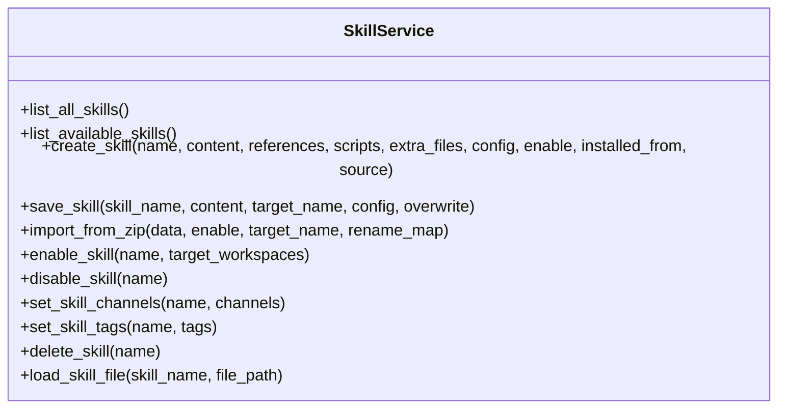
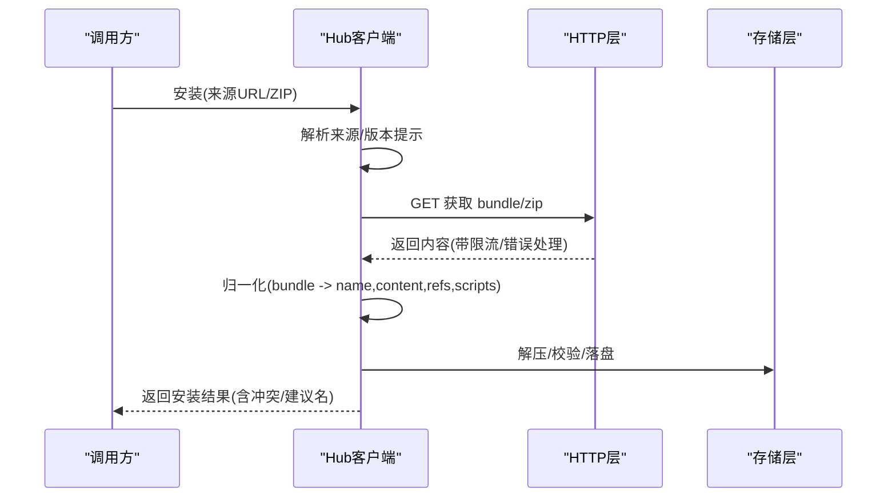
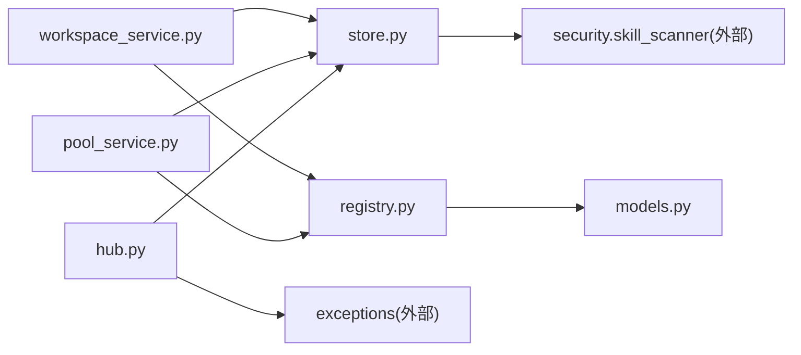

# Agent 技能管理器

<cite>
**本文引用的文件**   
- [__init__.py](file://src/qwenpaw/agents/skill_system/__init__.py)
- [hub.py](file://src/qwenpaw/agents/skill_system/hub.py)
- [models.py](file://src/qwenpaw/agents/skill_system/models.py)
- [pool_service.py](file://src/qwenpaw/agents/skill_system/pool_service.py)
- [registry.py](file://src/qwenpaw/agents/skill_system/registry.py)
- [store.py](file://src/qwenpaw/agents/skill_system/store.py)
- [workspace_service.py](file://src/qwenpaw/agents/skill_system/workspace_service.py)
- [SkillVisual/index.tsx](file://console/src/components/SkillVisual/index.tsx)
</cite>

## 目录
1. [简介](#简介)
2. [项目结构](#项目结构)
3. [核心组件](#核心组件)
4. [架构总览](#架构总览)
5. [详细组件分析](#详细组件分析)
6. [依赖关系分析](#依赖关系分析)
7. [性能与可扩展性](#性能与可扩展性)
8. [故障排查指南](#故障排查指南)
9. [结论](#结论)
10. [附录：示例与最佳实践](#附录示例与最佳实践)

## 简介
本文件系统性梳理 QwenPaw 的 Agent 技能管理器，覆盖技能的发现、加载与管理机制（清单解析、依赖检查、版本兼容）、SkillCard 前端展示与操作（安装、卸载、启用/禁用、配置编辑）、技能池概念与共享策略（全局技能与 Agent 专属技能），以及来自实际代码的实现要点。文档同时提供可视化图示与常见问题处理建议，帮助初学者快速上手，并为资深开发者提供深入的技术细节。

## 项目结构
技能系统位于后端 Python 模块 agents/skill_system，包含模型、存储、注册表、工作区服务、共享技能池服务与 Hub 客户端；前端在 console 中提供 SkillVisual 组件用于图标渲染与视觉呈现。

图表来源
- [__init__.py:1-46](file://src/qwenpaw/agents/skill_system/__init__.py#L1-L46)
- [models.py:1-81](file://src/qwenpaw/agents/skill_system/models.py#L1-L81)
- [store.py:1-200](file://src/qwenpaw/agents/skill_system/store.py#L1-L200)
- [registry.py:1-120](file://src/qwenpaw/agents/skill_system/registry.py#L1-L120)
- [pool_service.py:1-120](file://src/qwenpaw/agents/skill_system/pool_service.py#L1-L120)
- [workspace_service.py:1-120](file://src/qwenpaw/agents/skill_system/workspace_service.py#L1-L120)
- [hub.py:1-120](file://src/qwenpaw/agents/skill_system/hub.py#L1-L120)
- [SkillVisual/index.tsx:1-115](file://console/src/components/SkillVisual/index.tsx#L1-L115)

章节来源
- [__init__.py:1-46](file://src/qwenpaw/agents/skill_system/__init__.py#L1-L46)

## 核心组件
- 数据模型
  - SkillInfo：对外暴露的技能信息（名称、描述、版本、内容、来源、引用/脚本树、emoji）。
  - SkillRequirements：声明式依赖（需二进制、环境变量）。
  - 内置变体标识与语言偏好相关常量。
- 存储层 store.py
  - 清单读写（工作区 skill.json、共享池 skill_pool/skill.json）
  - 目录/路径安全校验、zip 导入、原子写入、跨进程锁
  - 元数据构建、冲突名建议、安全扫描入口
- 注册表 registry.py
  - 内置技能发现与语言选择
  - 清单对齐（reconcile）：从磁盘重建清单，保留用户状态
  - 运行时解析 resolve_effective_skills：按通道过滤已启用技能
  - 配置到环境变量注入 apply_skill_config_env_overrides
- 共享技能池 pool_service.py
  - 创建/删除/重命名/标签/自动更新/上传至池/下载至工作区
  - 预检冲突与语言回补
- 工作区服务 workspace_service.py
  - 创建/保存/重命名/启用/禁用/设置通道/标签/删除
  - zip 导入、文件读取（references/scripts）
- Hub 客户端 hub.py
  - 统一 HTTP 客户端、重试/退避/取消钩子
  - 多来源解析（GitHub、skills.sh、SkillsMP、LobeHub、ModelScope、QwenPaw、Aliyun、ClawHub、URL/ZIP）
  - Bundle 归一化、SKILL.md 提取、引用/脚本树构建

章节来源
- [models.py:1-81](file://src/qwenpaw/agents/skill_system/models.py#L1-L81)
- [store.py:1-200](file://src/qwenpaw/agents/skill_system/store.py#L1-L200)
- [registry.py:1-120](file://src/qwenpaw/agents/skill_system/registry.py#L1-L120)
- [pool_service.py:1-120](file://src/qwenpaw/agents/skill_system/pool_service.py#L1-L120)
- [workspace_service.py:1-120](file://src/qwenpaw/agents/skill_system/workspace_service.py#L1-L120)
- [hub.py:1-120](file://src/qwenpaw/agents/skill_system/hub.py#L1-L120)

## 架构总览
技能系统采用“共享池 + 工作区”的双层管理：
- 共享池（skill_pool）：存放可复用的全局技能，支持自动更新与多工作区同步。
- 工作区（workspaces/<agent>/skills）：Agent 专属的可编辑技能集合，通过 manifest 控制启用状态与通道范围。
- 注册表负责将磁盘上的真实技能与清单保持一致，并在运行时根据通道筛选有效技能。
- Hub 客户端提供多来源安装能力，最终落盘到共享池或工作区。

图表来源
- [workspace_service.py:145-227](file://src/qwenpaw/agents/skill_system/workspace_service.py#L145-L227)
- [pool_service.py:162-235](file://src/qwenpaw/agents/skill_system/pool_service.py#L162-L235)
- [registry.py:1036-1143](file://src/qwenpaw/agents/skill_system/registry.py#L1036-L1143)
- [store.py:877-900](file://src/qwenpaw/agents/skill_system/store.py#L877-L900)
- [hub.py:1343-1473](file://src/qwenpaw/agents/skill_system/hub.py#L1343-L1473)

## 详细组件分析

### 数据模型与清单结构
- SkillInfo 字段说明
  - name/description/version_text/content/source：基础信息与内容
  - references/scripts：参考/脚本目录树，供前端展示与运行期访问
  - emoji：优先使用 metadata.qwenpaw.emoji，否则由前端根据名称推断
- 清单默认结构与键约定
  - 工作区清单：schema_version、version、skills{}
  - 共享池清单：schema_version、version、skills{}、builtin_skill_names[]
  - 每个技能条目包含 enabled/channels/source/config/metadata/requirements/updated_at 等

章节来源
- [models.py:47-81](file://src/qwenpaw/agents/skill_system/models.py#L47-L81)
- [store.py:402-416](file://src/qwenpaw/agents/skill_system/store.py#L402-L416)
- [store.py:807-851](file://src/qwenpaw/agents/skill_system/store.py#L807-L851)

### 清单解析与安全校验
- SKILL.md frontmatter 解析与校验
  - 必须包含非空 name 与 description
  - metadata 必须为 dict
- 目录与路径安全
  - 禁止绝对路径、路径穿越、符号链接
  - zip 大小与条目数限制
- 安全扫描
  - 调用安全扫描器对技能目录进行扫描

图表来源
- [store.py:853-874](file://src/qwenpaw/agents/skill_system/store.py#L853-L874)
- [store.py:482-503](file://src/qwenpaw/agents/skill_system/store.py#L482-L503)
- [store.py:968-970](file://src/qwenpaw/agents/skill_system/store.py#L968-L970)

章节来源
- [store.py:853-874](file://src/qwenpaw/agents/skill_system/store.py#L853-L874)
- [store.py:482-503](file://src/qwenpaw/agents/skill_system/store.py#L482-L503)
- [store.py:968-970](file://src/qwenpaw/agents/skill_system/store.py#L968-L970)

### 内置技能发现与语言选择
- 内置技能以 <name>-<language> 形式组织，支持 en/zh
- 语言偏好来源于 settings.json 的 language/builtin_skill_language
- 当存在多个变体时，优先选择用户偏好语言，其次按字母序选择首个可用语言
- 迁移逻辑：若缺少 builtin_language，则基于哈希匹配或字符密度猜测 zh/en

章节来源
- [registry.py:50-117](file://src/qwenpaw/agents/skill_system/registry.py#L50-L117)
- [registry.py:155-214](file://src/qwenpaw/agents/skill_system/registry.py#L155-L214)
- [registry.py:399-456](file://src/qwenpaw/agents/skill_system/registry.py#L399-L456)

### 清单对齐（Reconcile）
- 共享池清单对齐
  - 扫描所有池根（主池 + 额外只读根），去重并记录外部来源
  - 分类 source（builtin/customized），保留 config/tags/installed_from/auto_update_*
- 工作区清单对齐
  - 扫描 workspaces/<agent>/skills，重建 entries，保留 enabled/channels/config/tags/installed_from
  - 新发现技能若命中内置名，source 标记为 builtin，否则 customized

图表来源
- [registry.py:968-1033](file://src/qwenpaw/agents/skill_system/registry.py#L968-L1033)
- [registry.py:1036-1143](file://src/qwenpaw/agents/skill_system/registry.py#L1036-L1143)

章节来源
- [registry.py:968-1033](file://src/qwenpaw/agents/skill_system/registry.py#L968-L1033)
- [registry.py:1036-1143](file://src/qwenpaw/agents/skill_system/registry.py#L1036-L1143)

### 运行时技能解析与环境注入
- 运行时解析 resolve_effective_skills
  - 仅返回 enabled=true 且 channels 包含当前通道的技能
- 配置到环境变量注入
  - 根据 require_envs 将配置项注入为环境变量
  - 全量配置以 QWENPAW_SKILL_CONFIG_<SKILL_NAME> 提供
  - 并发安全：互斥计数，避免覆盖已有环境变量

章节来源
- [registry.py:1186-1201](file://src/qwenpaw/agents/skill_system/registry.py#L1186-L1201)
- [registry.py:248-392](file://src/qwenpaw/agents/skill_system/registry.py#L248-L392)

### 共享技能池服务（SkillPoolService）
- 主要能力
  - list_all_skills / create_skill / import_from_zip / delete_skill
  - set_pool_skill_tags / set_skill_auto_update
  - get_edit_target_name / save_pool_skill（原地编辑/重命名）
  - rename_in_workspaces（批量迁移）
  - upload_from_workspace / download_to_workspace / preflight_download_to_workspace
  - run_pool_auto_update_sync（检测变更并推送）
- 冲突与语言回补
  - 下载前检查：内置语言切换、版本不一致、同名冲突
  - 若池为内置且工作区未显式语言，尝试回填 builtin_language

图表来源
- [pool_service.py:121-235](file://src/qwenpaw/agents/skill_system/pool_service.py#L121-L235)
- [pool_service.py:800-861](file://src/qwenpaw/agents/skill_system/pool_service.py#L800-L861)
- [pool_service.py:980-1113](file://src/qwenpaw/agents/skill_system/pool_service.py#L980-L1113)
- [pool_service.py:1218-1264](file://src/qwenpaw/agents/skill_system/pool_service.py#L1218-L1264)

章节来源
- [pool_service.py:121-235](file://src/qwenpaw/agents/skill_system/pool_service.py#L121-L235)
- [pool_service.py:800-861](file://src/qwenpaw/agents/skill_system/pool_service.py#L800-L861)
- [pool_service.py:980-1113](file://src/qwenpaw/agents/skill_system/pool_service.py#L980-L1113)
- [pool_service.py:1218-1264](file://src/qwenpaw/agents/skill_system/pool_service.py#L1218-L1264)

### 工作区技能服务（SkillService）
- 主要能力
  - list_all_skills / list_available_skills
  - create_skill / save_skill（原地编辑/重命名）
  - import_from_zip（支持 enable 标志）
  - enable_skill / disable_skill / set_skill_channels / set_skill_tags
  - delete_skill / load_skill_file（仅允许 references/scripts 下的相对路径）
- 关键行为
  - 启用前重新扫描，确保最新文件满足安全策略
  - 重命名时保留 enabled/channels/config/tags/installed_from

图表来源
- [workspace_service.py:88-144](file://src/qwenpaw/agents/skill_system/workspace_service.py#L88-L144)
- [workspace_service.py:145-227](file://src/qwenpaw/agents/skill_system/workspace_service.py#L145-L227)
- [workspace_service.py:229-442](file://src/qwenpaw/agents/skill_system/workspace_service.py#L229-L442)
- [workspace_service.py:444-553](file://src/qwenpaw/agents/skill_system/workspace_service.py#L444-L553)
- [workspace_service.py:554-782](file://src/qwenpaw/agents/skill_system/workspace_service.py#L554-L782)

章节来源
- [workspace_service.py:88-144](file://src/qwenpaw/agents/skill_system/workspace_service.py#L88-L144)
- [workspace_service.py:145-227](file://src/qwenpaw/agents/skill_system/workspace_service.py#L145-L227)
- [workspace_service.py:229-442](file://src/qwenpaw/agents/skill_system/workspace_service.py#L229-L442)
- [workspace_service.py:444-553](file://src/qwenpaw/agents/skill_system/workspace_service.py#L444-L553)
- [workspace_service.py:554-782](file://src/qwenpaw/agents/skill_system/workspace_service.py#L554-L782)

### Hub 客户端与多来源安装
- 统一 HTTP 客户端
  - 超时/重试/指数退避/取消钩子/请求追踪
  - GitHub 响应缓存（按 key 加锁防抖）
- 多来源 URL 解析
  - GitHub、skills.sh、SkillsMP、LobeHub、ModelScope、QwenPaw、Aliyun、ClawHub、URL/ZIP
- Bundle 归一化
  - 支持 files 映射与 references/scripts 树
  - 强制要求 SKILL.md 与 name

图表来源
- [hub.py:378-604](file://src/qwenpaw/agents/skill_system/hub.py#L378-L604)
- [hub.py:800-849](file://src/qwenpaw/agents/skill_system/hub.py#L800-L849)
- [hub.py:1343-1473](file://src/qwenpaw/agents/skill_system/hub.py#L1343-L1473)

章节来源
- [hub.py:378-604](file://src/qwenpaw/agents/skill_system/hub.py#L378-L604)
- [hub.py:800-849](file://src/qwenpaw/agents/skill_system/hub.py#L800-L849)
- [hub.py:1343-1473](file://src/qwenpaw/agents/skill_system/hub.py#L1343-L1473)

### 前端 SkillVisual 组件
- 功能
  - 优先显示 emoji（来自 metadata.qwenpaw.emoji）
  - 否则根据技能名/扩展名映射到 Ant Design 图标
- 使用场景
  - 技能卡片列表、详情面板、搜索结果等

章节来源
- [SkillVisual/index.tsx:1-115](file://console/src/components/SkillVisual/index.tsx#L1-L115)

## 依赖关系分析
- 组件耦合
  - workspace_service 与 pool_service 均依赖 store 与 registry
  - registry 依赖 store 与 models，并导出运行时解析与环境注入
  - hub 依赖 store 与 exceptions，并通过 http_json_get 复用统一网络栈
- 外部依赖
  - frontmatter/yaml 解析 SKILL.md
  - httpx 异步网络请求
  - 安全扫描器（security.skill_scanner）

图表来源
- [workspace_service.py:1-120](file://src/qwenpaw/agents/skill_system/workspace_service.py#L1-L120)
- [pool_service.py:1-120](file://src/qwenpaw/agents/skill_system/pool_service.py#L1-L120)
- [registry.py:1-120](file://src/qwenpaw/agents/skill_system/registry.py#L1-L120)
- [hub.py:1-120](file://src/qwenpaw/agents/skill_system/hub.py#L1-L120)
- [store.py:1-60](file://src/qwenpaw/agents/skill_system/store.py#L1-L60)
- [models.py:1-46](file://src/qwenpaw/agents/skill_system/models.py#L1-L46)

章节来源
- [workspace_service.py:1-120](file://src/qwenpaw/agents/skill_system/workspace_service.py#L1-L120)
- [pool_service.py:1-120](file://src/qwenpaw/agents/skill_system/pool_service.py#L1-L120)
- [registry.py:1-120](file://src/qwenpaw/agents/skill_system/registry.py#L1-L120)
- [hub.py:1-120](file://src/qwenpaw/agents/skill_system/hub.py#L1-L120)
- [store.py:1-60](file://src/qwenpaw/agents/skill_system/store.py#L1-L60)
- [models.py:1-46](file://src/qwenpaw/agents/skill_system/models.py#L1-L46)

## 性能与可扩展性
- 并发与一致性
  - 清单写入使用跨进程文件锁与原子替换，避免竞态
  - mtime 缓存减少频繁 IO
- 网络优化
  - 共享 httpx 连接池、重试与指数退避
  - GitHub 响应缓存（按 key 加锁）降低重复请求
- 可扩展点
  - 新增来源：实现对应 URL 解析与 bundle 归一化
  - 扩展搜索过滤：在前端聚合 list_all_skills/list_available_skills 的结果，结合 tags/name/description 过滤
  - 批量操作：利用 pool_service.rename_in_workspaces 与 auto_update_targets 实现批量迁移/同步

[本节为通用指导，不直接分析具体文件]

## 故障排查指南
- 常见错误与定位
  - 清单 YAML 非法或缺少 name/description：查看 validate_skill_content 的错误信息
  - zip 过大/不安全路径/符号链接：检查 extract_and_validate_zip 的限制
  - 安全扫描失败：确认 scan_skill_dir_or_raise 抛出的异常
  - 网络 429/5xx：查看 _http_fetch 的重试与错误包装
  - 内置语言切换冲突：检查 download_to_workspace 的 _check_download_conflict 返回 reason
- 诊断步骤
  - 核对清单是否被正确 reconcile（reconcile_pool_manifest/reconcile_workspace_manifest）
  - 检查 resolve_effective_skills 是否按通道返回期望技能
  - 验证 apply_skill_config_env_overrides 是否正确注入环境变量
  - 对于 Hub 安装失败，检查来源 URL 解析与 bundle 归一化流程

章节来源
- [store.py:853-874](file://src/qwenpaw/agents/skill_system/store.py#L853-L874)
- [store.py:482-503](file://src/qwenpaw/agents/skill_system/store.py#L482-L503)
- [store.py:968-970](file://src/qwenpaw/agents/skill_system/store.py#L968-L970)
- [hub.py:378-604](file://src/qwenpaw/agents/skill_system/hub.py#L378-L604)
- [pool_service.py:862-959](file://src/qwenpaw/agents/skill_system/pool_service.py#L862-L959)
- [registry.py:1186-1201](file://src/qwenpaw/agents/skill_system/registry.py#L1186-L1201)
- [registry.py:248-392](file://src/qwenpaw/agents/skill_system/registry.py#L248-L392)

## 结论
QwenPaw 的技能管理器通过清晰的“共享池 + 工作区”分层设计，配合严格的清单对齐、安全校验与多来源安装能力，实现了高内聚、低耦合、易扩展的技能生态。运行时解析与环境注入保证了技能在不同通道下的可控性与安全性。前端 SkillVisual 提供了直观的展示体验。整体方案兼顾了初学者的易用性与高级用户的深度定制需求。

[本节为总结，不直接分析具体文件]

## 附录：示例与最佳实践

- 添加新技能来源（以 GitHub 为例）
  - 在 hub.py 中实现 URL 解析函数（如 _extract_github_spec）
  - 实现 _fetch_bundle_from_repo_and_skill_hint 以拉取 SKILL.md 与相关文件
  - 在高层安装流程中路由到对应 provider
  - 参考现有实现：_github_repo_exists/_github_list_skill_md_roots/_github_collect_tree_files

  章节来源
  - [hub.py:1065-1088](file://src/qwenpaw/agents/skill_system/hub.py#L1065-L1088)
  - [hub.py:1367-1473](file://src/qwenpaw/agents/skill_system/hub.py#L1367-L1473)
  - [hub.py:1139-1298](file://src/qwenpaw/agents/skill_system/hub.py#L1139-L1298)

- 实现技能搜索过滤
  - 前端调用 list_all_skills 或 list_available_skills，结合 name/description/tags 进行本地过滤
  - 如需后端过滤，可在 API 层增加参数并复用上述接口

  章节来源
  - [workspace_service.py:114-143](file://src/qwenpaw/agents/skill_system/workspace_service.py#L114-L143)
  - [pool_service.py:146-160](file://src/qwenpaw/agents/skill_system/pool_service.py#L146-L160)

- 批量操作（重命名与自动更新）
  - 使用 pool_service.rename_in_workspaces 批量迁移目标工作区中的技能
  - 使用 set_skill_auto_update 开启/关闭自动更新，并指定 targets

  章节来源
  - [pool_service.py:684-789](file://src/qwenpaw/agents/skill_system/pool_service.py#L684-L789)
  - [pool_service.py:417-458](file://src/qwenpaw/agents/skill_system/pool_service.py#L417-L458)

- 解决技能冲突与依赖缺失
  - 冲突：使用 suggest_conflict_name 生成建议名，或在 UI 引导用户重命名
  - 依赖：依据 SkillRequirements.require_bins/require_envs 在安装前检查与准备

  章节来源
- [store.py:671-692](file://src/qwenpaw/agents/skill_system/store.py#L671-L692)
- [models.py:66-71](file://src/qwenpaw/agents/skill_system/models.py#L66-L71)

- 运行时错误诊断
  - 启用日志并关注 reconcile 与 scan 阶段的警告
  - 针对 Hub 安装失败，检查网络状态与速率限制（GITHUB_TOKEN）

  章节来源
  - [registry.py:968-1033](file://src/qwenpaw/agents/skill_system/registry.py#L968-L1033)
  - [hub.py:534-604](file://src/qwenpaw/agents/skill_system/hub.py#L534-L604)