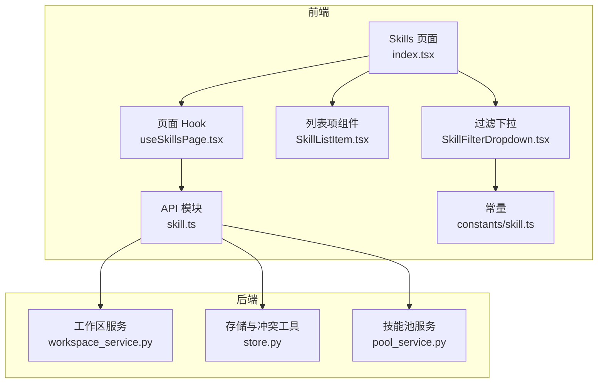
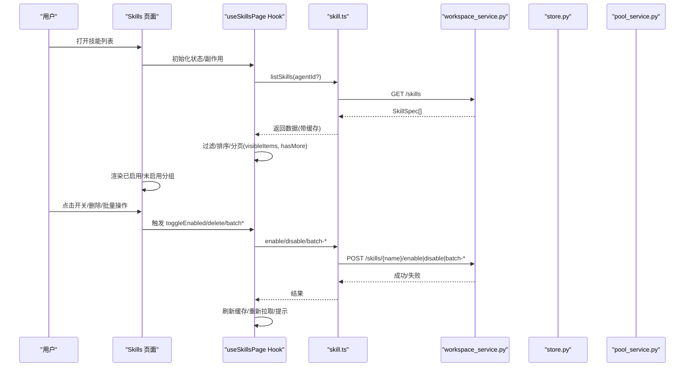
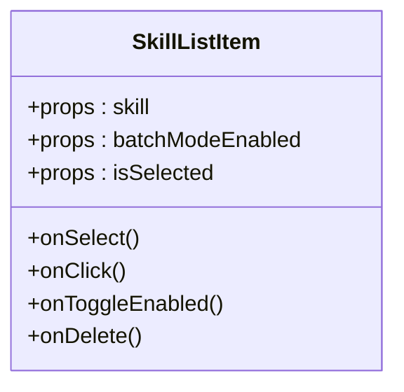
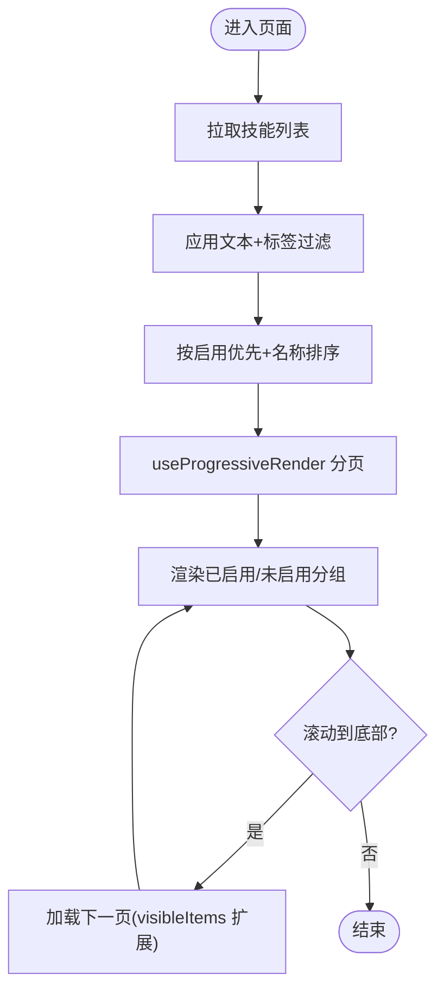
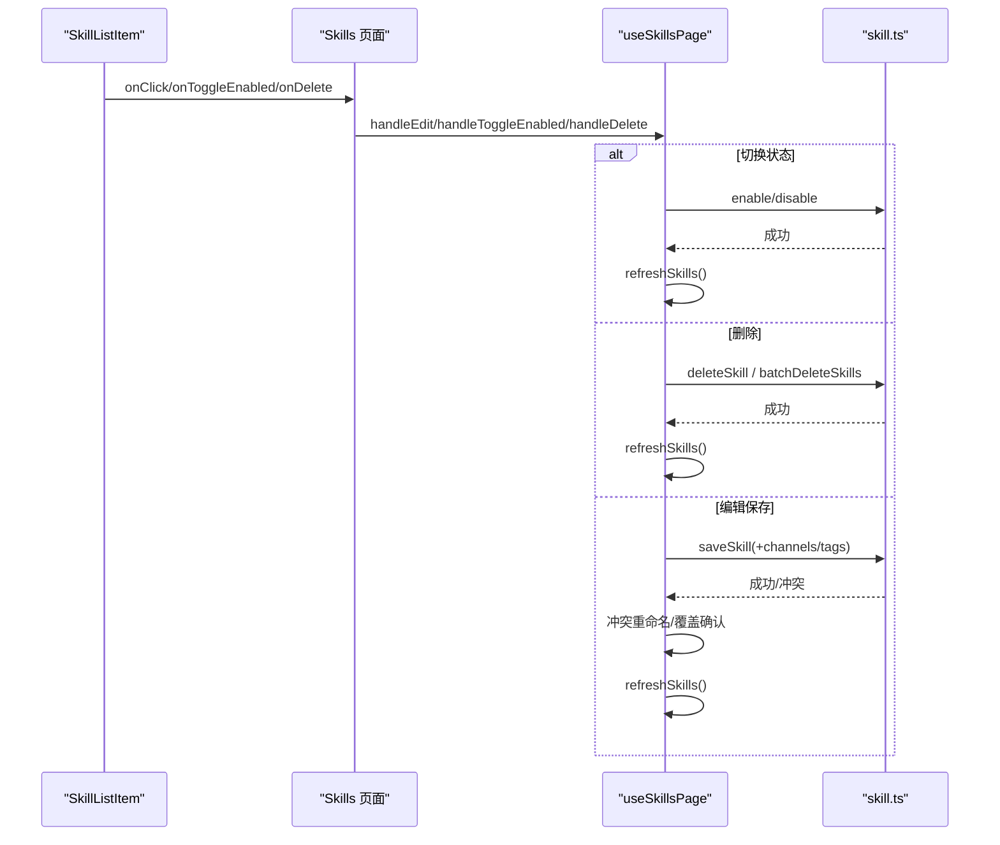
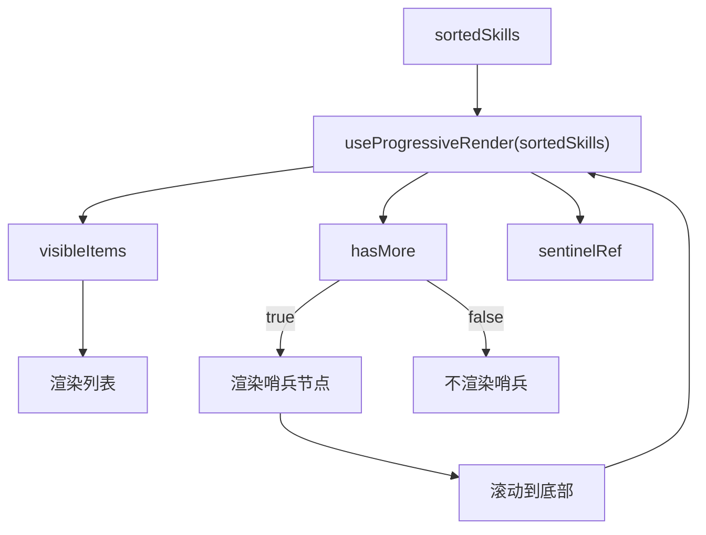
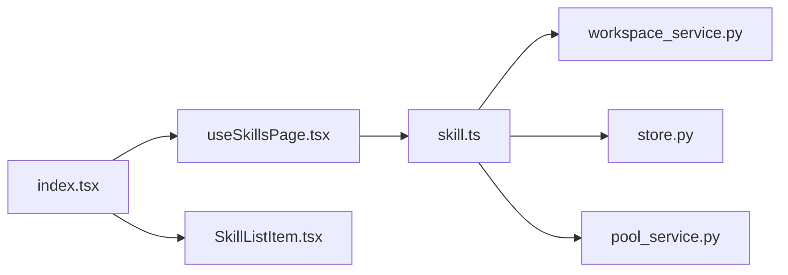

# 技能列表管理

<cite>
**本文引用的文件**   
- [console/src/pages/Agent/Skills/index.tsx](file://console/src/pages/Agent/Skills/index.tsx)
- [console/src/pages/Agent/Skills/useSkillsPage.tsx](file://console/src/pages/Agent/Skills/useSkillsPage.tsx)
- [console/src/pages/Agent/Skills/components/SkillListItem.tsx](file://console/src/pages/Agent/Skills/components/SkillListItem.tsx)
- [console/src/api/modules/skill.ts](file://console/src/api/modules/skill.ts)
- [console/src/constants/skill.ts](file://console/src/constants/skill.ts)
- [console/src/pages/Agent/Skills/components/SkillFilterDropdown.tsx](file://console/src/pages/Agent/Skills/components/SkillFilterDropdown.tsx)
- [src/qwenpaw/agents/skill_system/workspace_service.py](file://src/qwenpaw/agents/skill_system/workspace_service.py)
- [src/qwenpaw/agents/skill_system/store.py](file://src/qwenpaw/agents/skill_system/store.py)
- [src/qwenpaw/agents/skill_system/pool_service.py](file://src/qwenpaw/agents/skill_system/pool_service.py)
</cite>

## 目录
1. [简介](#简介)
2. [项目结构](#项目结构)
3. [核心组件](#核心组件)
4. [架构总览](#架构总览)
5. [详细组件分析](#详细组件分析)
6. [依赖关系分析](#依赖关系分析)
7. [性能与分页](#性能与分页)
8. [故障排查指南](#故障排查指南)
9. [结论](#结论)

## 简介
本章节面向 QwenPaw 控制台“技能列表”功能，系统性说明技能的发现、加载与展示机制；覆盖启用/禁用分组显示、搜索过滤与标签筛选、批量操作（启用/禁用/删除）支持；深入解析 SkillListItem 组件的渲染逻辑、交互事件与状态管理；解释分页加载与无限滚动实现（sentinelRef 与 hasMore 控制）；并给出冲突检测、重复名称处理、依赖验证等常见问题的解决方案。文档兼顾初学者理解与高级开发者技术深度。

## 项目结构
技能列表相关的前端页面位于 console 子工程，后端能力由 Python 服务提供。关键路径如下：
- 前端页面与 Hook：console/src/pages/Agent/Skills
- API 封装：console/src/api/modules/skill.ts
- 常量与过滤前缀：console/src/constants/skill.ts
- 后端工作区技能服务：src/qwenpaw/agents/skill_system/workspace_service.py
- 后端存储与冲突工具：src/qwenpaw/agents/skill_system/store.py
- 后端技能池服务：src/qwenpaw/agents/skill_system/pool_service.py

图表来源
- [console/src/pages/Agent/Skills/index.tsx:1-357](file://console/src/pages/Agent/Skills/index.tsx#L1-L357)
- [console/src/pages/Agent/Skills/useSkillsPage.tsx:1-736](file://console/src/pages/Agent/Skills/useSkillsPage.tsx#L1-L736)
- [console/src/pages/Agent/Skills/components/SkillListItem.tsx:1-107](file://console/src/pages/Agent/Skills/components/SkillListItem.tsx#L1-L107)
- [console/src/api/modules/skill.ts:1-622](file://console/src/api/modules/skill.ts#L1-L622)
- [console/src/pages/Agent/Skills/components/SkillFilterDropdown.tsx:1-54](file://console/src/pages/Agent/Skills/components/SkillFilterDropdown.tsx#L1-L54)
- [console/src/constants/skill.ts:1-21](file://console/src/constants/skill.ts#L1-L21)
- [src/qwenpaw/agents/skill_system/workspace_service.py:88-143](file://src/qwenpaw/agents/skill_system/workspace_service.py#L88-L143)
- [src/qwenpaw/agents/skill_system/store.py:694-743](file://src/qwenpaw/agents/skill_system/store.py#L694-L743)
- [src/qwenpaw/agents/skill_system/pool_service.py:272-306](file://src/qwenpaw/agents/skill_system/pool_service.py#L272-L306)

章节来源
- [console/src/pages/Agent/Skills/index.tsx:1-357](file://console/src/pages/Agent/Skills/index.tsx#L1-L357)
- [console/src/pages/Agent/Skills/useSkillsPage.tsx:1-736](file://console/src/pages/Agent/Skills/useSkillsPage.tsx#L1-L736)
- [console/src/pages/Agent/Skills/components/SkillListItem.tsx:1-107](file://console/src/pages/Agent/Skills/components/SkillListItem.tsx#L1-L107)
- [console/src/api/modules/skill.ts:1-622](file://console/src/api/modules/skill.ts#L1-L622)
- [console/src/constants/skill.ts:1-21](file://console/src/constants/skill.ts#L1-L21)
- [console/src/pages/Agent/Skills/components/SkillFilterDropdown.tsx:1-54](file://console/src/pages/Agent/Skills/components/SkillFilterDropdown.tsx#L1-L54)
- [src/qwenpaw/agents/skill_system/workspace_service.py:88-143](file://src/qwenpaw/agents/skill_system/workspace_service.py#L88-L143)
- [src/qwenpaw/agents/skill_system/store.py:694-743](file://src/qwenpaw/agents/skill_system/store.py#L694-L743)
- [src/qwenpaw/agents/skill_system/pool_service.py:272-306](file://src/qwenpaw/agents/skill_system/pool_service.py#L272-L306)

## 核心组件
- Skills 页面（index.tsx）：负责整体布局、分组展示（已启用/未启用）、视图切换（卡片/列表）、导入/上传/市场面板入口、以及将 useSkillsPage 暴露的状态与回调透传给子组件。
- useSkillsPage Hook：聚合数据获取、过滤、排序、分页、批量操作、冲突重命名弹窗、抽屉编辑提交、池上传下载流程、扫描告警检查等。
- SkillListItem 组件：单条技能项的渲染与交互（选中、开关、删除），在批量模式下支持多选。
- skill.ts API 模块：封装所有技能相关的 HTTP 接口，包含缓存失效策略、流式优化、批量接口、池同步等。
- 过滤与常量：SKILL_TAG_FILTER_PREFIX 用于 tag:xxx 形式的标签过滤；SkillFilterDropdown 提供标签选择 UI。
- 后端服务：workspace_service 负责工作区内技能清单读取与可用技能解析；store 提供冲突检测与建议名生成；pool_service 负责技能池导入冲突与校验。

章节来源
- [console/src/pages/Agent/Skills/index.tsx:99-136](file://console/src/pages/Agent/Skills/index.tsx#L99-L136)
- [console/src/pages/Agent/Skills/useSkillsPage.tsx:91-105](file://console/src/pages/Agent/Skills/useSkillsPage.tsx#L91-L105)
- [console/src/pages/Agent/Skills/components/SkillListItem.tsx:22-106](file://console/src/pages/Agent/Skills/components/SkillListItem.tsx#L22-L106)
- [console/src/api/modules/skill.ts:117-177](file://console/src/api/modules/skill.ts#L117-L177)
- [console/src/constants/skill.ts:17-21](file://console/src/constants/skill.ts#L17-L21)
- [console/src/pages/Agent/Skills/components/SkillFilterDropdown.tsx:14-53](file://console/src/pages/Agent/Skills/components/SkillFilterDropdown.tsx#L14-L53)
- [src/qwenpaw/agents/skill_system/workspace_service.py:114-143](file://src/qwenpaw/agents/skill_system/workspace_service.py#L114-L143)
- [src/qwenpaw/agents/skill_system/store.py:694-743](file://src/qwenpaw/agents/skill_system/store.py#L694-L743)
- [src/qwenpaw/agents/skill_system/pool_service.py:272-306](file://src/qwenpaw/agents/skill_system/pool_service.py#L272-L306)

## 架构总览
技能列表的数据流从后端到前端的关键链路如下：
- 前端通过 skill.ts 调用 /skills 系列接口，获取当前 Agent 下的技能集合与工作区技能池信息。
- 前端使用 useSkillFilter 进行文本与标签过滤，useProgressiveRender 实现分页与无限滚动。
- 用户交互（启用/禁用、删除、编辑、批量操作）通过对应 API 更新后端持久化状态，随后刷新本地缓存与列表。
- 后端 workspace_service 基于工作区 manifest 与磁盘技能目录构建 SkillInfo 列表；store 与 pool_service 提供冲突检测与导入校验。

图表来源
- [console/src/pages/Agent/Skills/index.tsx:158-210](file://console/src/pages/Agent/Skills/index.tsx#L158-L210)
- [console/src/pages/Agent/Skills/useSkillsPage.tsx:261-270](file://console/src/pages/Agent/Skills/useSkillsPage.tsx#L261-L270)
- [console/src/api/modules/skill.ts:242-281](file://console/src/api/modules/skill.ts#L242-L281)
- [src/qwenpaw/agents/skill_system/workspace_service.py:114-143](file://src/qwenpaw/agents/skill_system/workspace_service.py#L114-L143)

## 详细组件分析

### 技能项组件 SkillListItem
- 渲染逻辑
  - 根据 source 判断内置/自定义，并展示渠道信息与更新时间。
  - 支持标签展示与描述摘要。
- 交互事件
  - 批量模式：Checkbox 控制选中，点击行仅触发选中；非批量模式：点击行进入编辑。
  - 开关：直接调用 onToggleEnabled，阻止冒泡避免误触。
  - 删除：危险按钮，阻止冒泡后调用 onDelete。
- 状态管理
  - 受控于父组件传入的 isSelected、batchModeEnabled 等 props。
  - 内部不持有业务状态，保证可组合性与可测试性。

图表来源
- [console/src/pages/Agent/Skills/components/SkillListItem.tsx:22-106](file://console/src/pages/Agent/Skills/components/SkillListItem.tsx#L22-L106)

章节来源
- [console/src/pages/Agent/Skills/components/SkillListItem.tsx:1-107](file://console/src/pages/Agent/Skills/components/SkillListItem.tsx#L1-L107)

### 页面与 Hook：分组、搜索、批量与分页
- 分组显示
  - 将 visibleSkills 按 enabled 拆分为已启用/未启用两组，分别渲染。
- 搜索与标签过滤
  - 使用 useSkillFilter 对 name/description 做大小写不敏感匹配，并以 tag:xxx 形式精确匹配 tags。
  - 常量 SKILL_TAG_FILTER_PREFIX 定义标签前缀。
- 批量操作
  - 支持全选/反选/清空，批量启用/禁用/删除，并在成功后刷新与提示。
- 分页与无限滚动
  - 使用 useProgressiveRender 对 sortedSkills 进行可见项切片，暴露 visibleItems、hasMore、sentinelRef。
  - 当 hasMore 为真时，在列表底部放置 sentinelRef 占位元素，滚动到底部自动加载更多。

图表来源
- [console/src/pages/Agent/Skills/index.tsx:99-136](file://console/src/pages/Agent/Skills/index.tsx#L99-L136)
- [console/src/pages/Agent/Skills/useSkillsPage.tsx:91-105](file://console/src/pages/Agent/Skills/useSkillsPage.tsx#L91-L105)
- [console/src/constants/skill.ts:17-21](file://console/src/constants/skill.ts#L17-L21)
- [console/src/pages/Agent/Skills/components/SkillFilterDropdown.tsx:14-53](file://console/src/pages/Agent/Skills/components/SkillFilterDropdown.tsx#L14-L53)

章节来源
- [console/src/pages/Agent/Skills/index.tsx:99-136](file://console/src/pages/Agent/Skills/index.tsx#L99-L136)
- [console/src/pages/Agent/Skills/useSkillsPage.tsx:91-105](file://console/src/pages/Agent/Skills/useSkillsPage.tsx#L91-L105)
- [console/src/constants/skill.ts:17-21](file://console/src/constants/skill.ts#L17-L21)
- [console/src/pages/Agent/Skills/components/SkillFilterDropdown.tsx:14-53](file://console/src/pages/Agent/Skills/components/SkillFilterDropdown.tsx#L14-L53)

### 状态切换、删除确认与编辑操作示例
- 状态切换
  - 列表项开关触发 onToggleEnabled，Hook 中调用 toggleEnabled(skill)，随后 refreshSkills 刷新列表。
- 删除确认
  - 单个删除：onDelete 直接调用 deleteSkill(skill)。
  - 批量删除：先弹出确认框列出待删技能，再调用 batchDeleteSkills，最后刷新。
- 编辑保存
  - 新建/编辑通过 Drawer 表单提交，saveSkill 成功后，若涉及 channels/tags 变更则并行更新，必要时处理冲突重命名或覆盖确认。

图表来源
- [console/src/pages/Agent/Skills/useSkillsPage.tsx:261-270](file://console/src/pages/Agent/Skills/useSkillsPage.tsx#L261-L270)
- [console/src/pages/Agent/Skills/useSkillsPage.tsx:279-386](file://console/src/pages/Agent/Skills/useSkillsPage.tsx#L279-L386)
- [console/src/pages/Agent/Skills/useSkillsPage.tsx:633-677](file://console/src/pages/Agent/Skills/useSkillsPage.tsx#L633-L677)
- [console/src/api/modules/skill.ts:242-281](file://console/src/api/modules/skill.ts#L242-L281)

章节来源
- [console/src/pages/Agent/Skills/useSkillsPage.tsx:261-270](file://console/src/pages/Agent/Skills/useSkillsPage.tsx#L261-L270)
- [console/src/pages/Agent/Skills/useSkillsPage.tsx:279-386](file://console/src/pages/Agent/Skills/useSkillsPage.tsx#L279-L386)
- [console/src/pages/Agent/Skills/useSkillsPage.tsx:633-677](file://console/src/pages/Agent/Skills/useSkillsPage.tsx#L633-L677)
- [console/src/api/modules/skill.ts:242-281](file://console/src/api/modules/skill.ts#L242-L281)

### 分页加载与无限滚动实现
- 数据源：sortedSkills 作为输入。
- 分页器：useProgressiveRender 返回 visibleItems、hasMore、sentinelRef。
- 渲染：仅在 hasMore 为真时在末尾渲染一个高度为 1 的 sentinelRef 节点，滚动进入视口即触发下一批加载。
- 注意：该实现基于前端内存分页，适合中等规模列表；超大数据集建议结合后端分页接口。

图表来源
- [console/src/pages/Agent/Skills/useSkillsPage.tsx:91-105](file://console/src/pages/Agent/Skills/useSkillsPage.tsx#L91-L105)
- [console/src/pages/Agent/Skills/index.tsx:324-329](file://console/src/pages/Agent/Skills/index.tsx#L324-L329)

章节来源
- [console/src/pages/Agent/Skills/useSkillsPage.tsx:91-105](file://console/src/pages/Agent/Skills/useSkillsPage.tsx#L91-L105)
- [console/src/pages/Agent/Skills/index.tsx:324-329](file://console/src/pages/Agent/Skills/index.tsx#L324-L329)

### 搜索过滤与标签筛选
- 文本搜索：对 name 与 description 进行大小写不敏感匹配。
- 标签筛选：以 tag:xxx 形式加入查询，精确匹配 skills.tags。
- 组合过滤：文本与标签同时生效，交集语义。
- 标签收集：自动从全部技能中提取去重且排序后的标签集合，供下拉选择。

章节来源
- [console/src/pages/Agent/Skills/useSkillFilter.test.ts:1-132](file://console/src/pages/Agent/Skills/useSkillFilter.test.ts#L1-L132)
- [console/src/constants/skill.ts:17-21](file://console/src/constants/skill.ts#L17-L21)
- [console/src/pages/Agent/Skills/components/SkillFilterDropdown.tsx:14-53](file://console/src/pages/Agent/Skills/components/SkillFilterDropdown.tsx#L14-L53)

### 批量操作支持
- 批量启用：调用 batchEnableSkills，部分失败时展示警告并提示安全扫描失败详情。
- 批量禁用：调用 batchDisableSkills，统计成功/失败数量并提示。
- 批量删除：先弹出确认框，再调用 batchDeleteSkills，刷新列表。
- 选择状态：支持全选/反选/清空，批量模式下禁用单项开关与删除按钮。

章节来源
- [console/src/pages/Agent/Skills/useSkillsPage.tsx:563-677](file://console/src/pages/Agent/Skills/useSkillsPage.tsx#L563-L677)
- [console/src/pages/Agent/Skills/components/SkillListItem.tsx:86-103](file://console/src/pages/Agent/Skills/components/SkillListItem.tsx#L86-L103)
- [console/src/api/modules/skill.ts:252-281](file://console/src/api/modules/skill.ts#L252-L281)

## 依赖关系分析
- 前端依赖
  - index.tsx 依赖 useSkillsPage 提供的状态与回调，依赖 components 中的 SkillListItem、SkillCard、HeaderActions 等。
  - useSkillsPage 依赖 api 模块（skill.ts）与 useProgressiveRender、useSkillFilter、useAppMessage、agentStore 等。
  - SkillListItem 依赖 isSkillBuiltin、getSkillVisual、i18n 与样式。
- 后端依赖
  - workspace_service 读取工作区 manifest 与技能目录，构造 SkillInfo。
  - store 提供冲突检测与建议名生成。
  - pool_service 负责技能池导入时的内容校验与冲突处理。

图表来源
- [console/src/pages/Agent/Skills/index.tsx:1-357](file://console/src/pages/Agent/Skills/index.tsx#L1-L357)
- [console/src/pages/Agent/Skills/useSkillsPage.tsx:1-736](file://console/src/pages/Agent/Skills/useSkillsPage.tsx#L1-L736)
- [console/src/pages/Agent/Skills/components/SkillListItem.tsx:1-107](file://console/src/pages/Agent/Skills/components/SkillListItem.tsx#L1-L107)
- [console/src/api/modules/skill.ts:1-622](file://console/src/api/modules/skill.ts#L1-L622)
- [src/qwenpaw/agents/skill_system/workspace_service.py:88-143](file://src/qwenpaw/agents/skill_system/workspace_service.py#L88-L143)
- [src/qwenpaw/agents/skill_system/store.py:694-743](file://src/qwenpaw/agents/skill_system/store.py#L694-L743)
- [src/qwenpaw/agents/skill_system/pool_service.py:272-306](file://src/qwenpaw/agents/skill_system/pool_service.py#L272-L306)

章节来源
- [console/src/pages/Agent/Skills/index.tsx:1-357](file://console/src/pages/Agent/Skills/index.tsx#L1-L357)
- [console/src/pages/Agent/Skills/useSkillsPage.tsx:1-736](file://console/src/pages/Agent/Skills/useSkillsPage.tsx#L1-L736)
- [console/src/pages/Agent/Skills/components/SkillListItem.tsx:1-107](file://console/src/pages/Agent/Skills/components/SkillListItem.tsx#L1-L107)
- [console/src/api/modules/skill.ts:1-622](file://console/src/api/modules/skill.ts#L1-L622)
- [src/qwenpaw/agents/skill_system/workspace_service.py:88-143](file://src/qwenpaw/agents/skill_system/workspace_service.py#L88-L143)
- [src/qwenpaw/agents/skill_system/store.py:694-743](file://src/qwenpaw/agents/skill_system/store.py#L694-L743)
- [src/qwenpaw/agents/skill_system/pool_service.py:272-306](file://src/qwenpaw/agents/skill_system/pool_service.py#L272-L306)

## 性能与分页
- 前端内存分页：useProgressiveRender 基于数组切片，避免一次性渲染大量节点，提升首屏与滚动性能。
- 列表排序与过滤：在 useMemo 中计算 filteredSkills 与 sortedSkills，减少重复计算。
- 缓存策略：skill.ts 对 /skills 与 /skills/pool 等接口做了简单 TTL 缓存，并提供 invalidateSkillCache 精准失效。
- 建议：当技能数量极大时，可考虑后端分页接口替代前端内存分页，或在 useProgressiveRender 基础上增加虚拟滚动。

章节来源
- [console/src/pages/Agent/Skills/useSkillsPage.tsx:91-105](file://console/src/pages/Agent/Skills/useSkillsPage.tsx#L91-L105)
- [console/src/api/modules/skill.ts:17-64](file://console/src/api/modules/skill.ts#L17-L64)

## 故障排查指南
- 技能冲突检测
  - 工作区创建/导入时，若目标名称已存在，后端返回冲突信息并建议新名称；前端通过 showConflictRenameModal 引导用户重命名。
  - 参考：workspace_service 与 pool_service 在导入流程中统一使用 build_import_conflict 与 suggest_conflict_name。
- 重复名称处理
  - 保存编辑时若发生冲突，会提示是否覆盖现有技能；确认后再次提交 overwrite=true 完成覆盖。
- 依赖关系验证
  - 导入流程会对 SKILL.md 内容进行 validate_skill_content 校验，并对脚本目录执行安全扫描 scan_skill_dir_or_raise，确保无违规内容。
- 常见问题定位
  - 批量启用失败：检查返回 results 中的 reason/detail，可能因安全扫描失败导致，需查看扫描告警详情。
  - 导入/下载冲突：区分 builtin_upgrade 与 language_switch 两类冲突，按提示确认版本/语言变更后再继续。

章节来源
- [src/qwenpaw/agents/skill_system/store.py:694-743](file://src/qwenpaw/agents/skill_system/store.py#L694-L743)
- [src/qwenpaw/agents/skill_system/workspace_service.py:478-515](file://src/qwenpaw/agents/skill_system/workspace_service.py#L478-L515)
- [src/qwenpaw/agents/skill_system/pool_service.py:272-306](file://src/qwenpaw/agents/skill_system/pool_service.py#L272-L306)
- [console/src/pages/Agent/Skills/useSkillsPage.tsx:321-350](file://console/src/pages/Agent/Skills/useSkillsPage.tsx#L321-L350)
- [console/src/pages/Agent/Skills/useSkillsPage.tsx:563-601](file://console/src/pages/Agent/Skills/useSkillsPage.tsx#L563-L601)

## 结论
QwenPaw 的技能列表管理在前端采用“页面 + Hook + 组件”的分层设计，配合后端工作区服务与冲突检测工具，实现了完整的发现、加载、展示、分组、搜索过滤、批量操作与冲突处理闭环。分页与无限滚动通过 useProgressiveRender 与 sentinelRef 实现，兼顾易用性与性能。对于大规模场景，建议引入后端分页与更细粒度的缓存失效策略，进一步提升体验与稳定性。