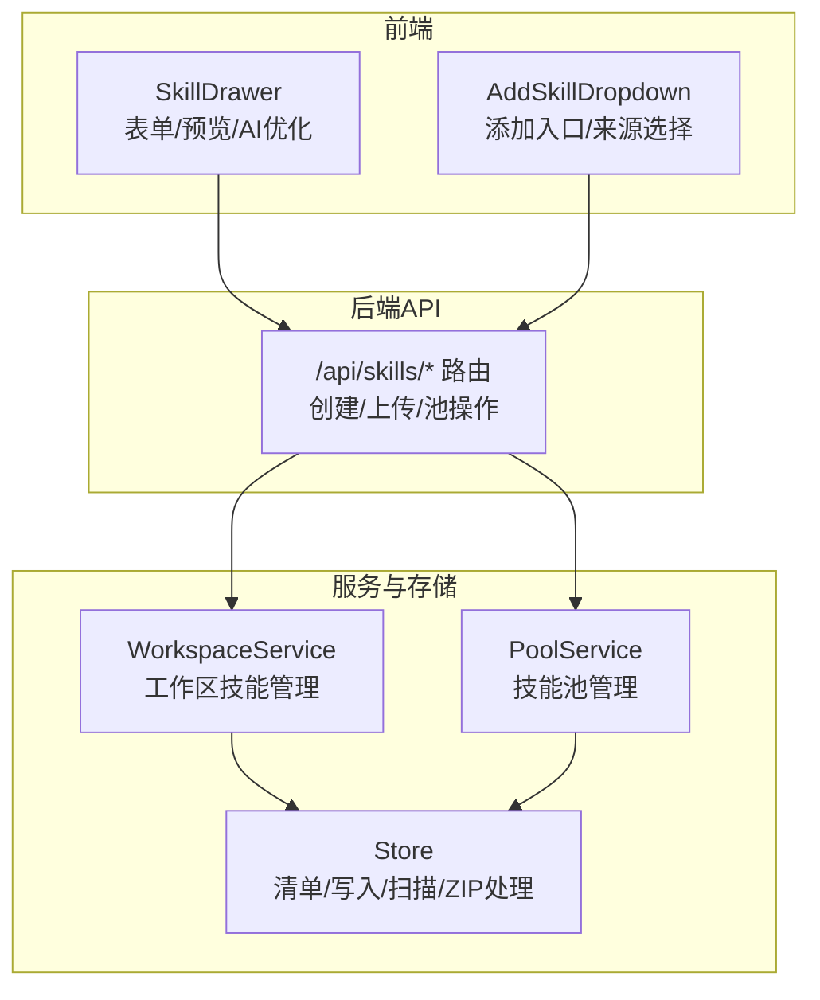
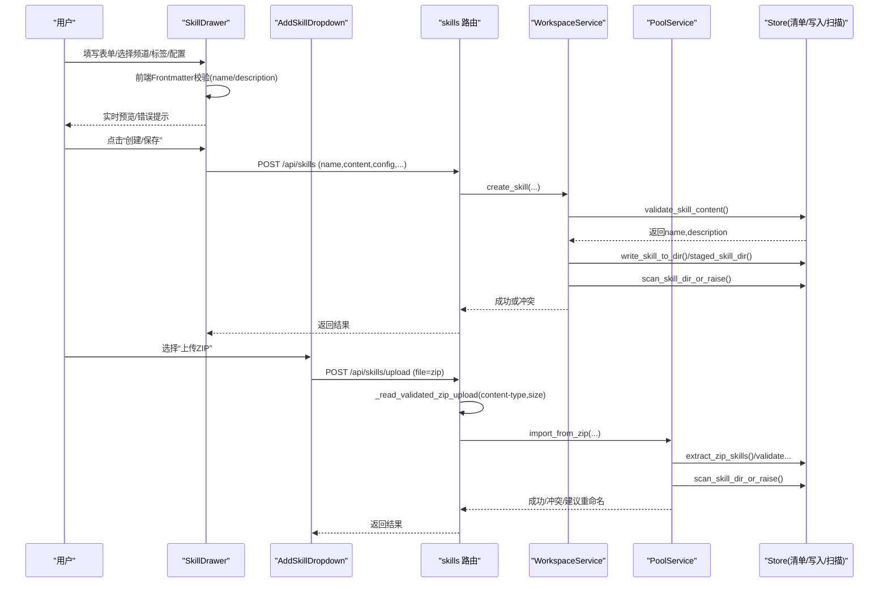
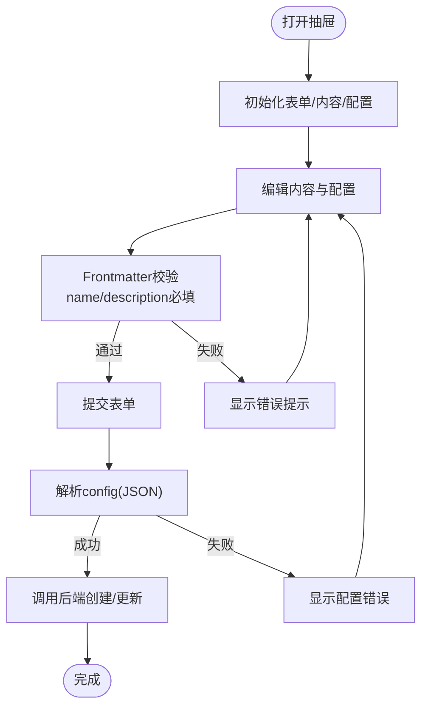
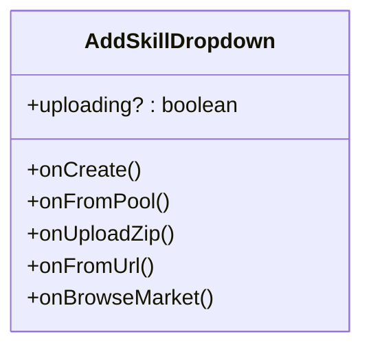
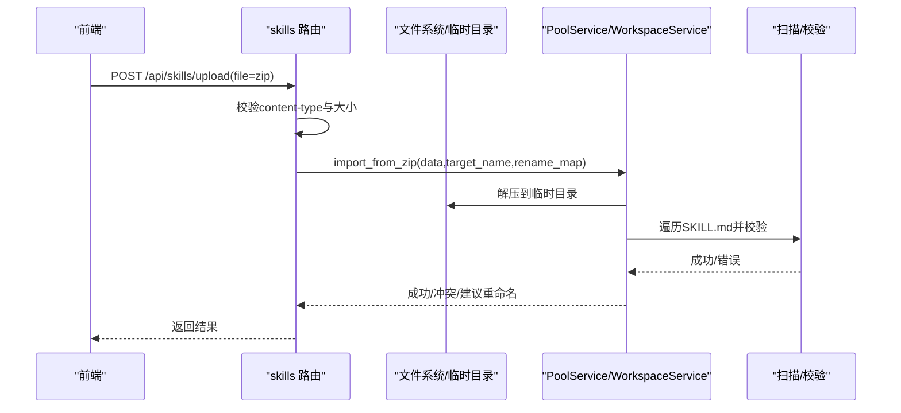
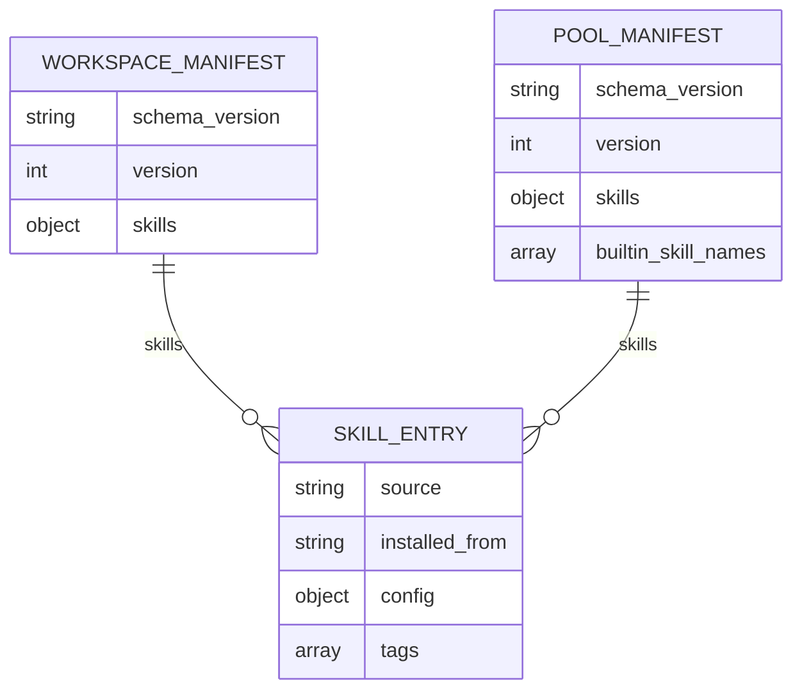
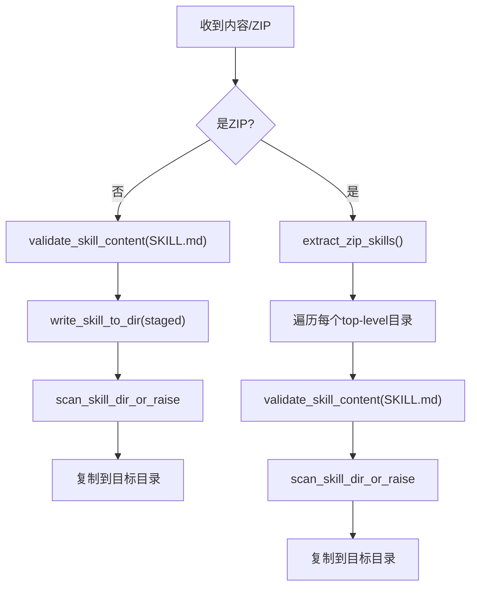
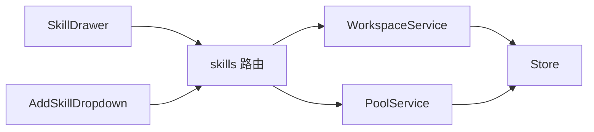

# 技能创建与编辑

<cite>
**本文引用的文件列表**
- [SkillDrawer.tsx](file://console/src/pages/Agent/Skills/components/SkillDrawer.tsx)
- [AddSkillDropdown.tsx](file://console/src/pages/Agent/Skills/components/AddSkillDropdown.tsx)
- [skills.py](file://src/qwenpaw/app/routers/skills.py)
- [store.py](file://src/qwenpaw/agents/skill_system/store.py)
- [workspace_service.py](file://src/qwenpaw/agents/skill_system/workspace_service.py)
- [pool_service.py](file://src/qwenpaw/agents/skill_system/pool_service.py)
</cite>

## 目录
1. [简介](#简介)
2. [项目结构](#项目结构)
3. [核心组件](#核心组件)
4. [架构总览](#架构总览)
5. [详细组件分析](#详细组件分析)
6. [依赖关系分析](#依赖关系分析)
7. [性能考虑](#性能考虑)
8. [故障排查指南](#故障排查指南)
9. [结论](#结论)
10. [附录](#附录)

## 简介
本章节面向 QwenPaw 的“技能”（Skill）创建与编辑能力，聚焦前端 SkillDrawer 与 AddSkillDropdown 两个关键组件的实现机制，并串联后端路由、存储与服务层对技能清单文件的解析、校验与持久化流程。文档将覆盖：
- 表单验证（含 Frontmatter 必填字段校验）、实时预览与 AI 优化流式输出
- 文件上传（ZIP 包）的类型与大小限制、冲突检测与回滚清理
- 下拉菜单逻辑（模板选择、快速创建、来源指定）
- 技能清单文件结构与字段定义、版本兼容性与来源分类
- 常见问题定位与解决方案（提交失败、解析错误、权限问题等）

## 项目结构
围绕“技能创建与编辑”的前端入口位于控制台页面中，后端通过 API 路由接收请求，最终由 skill_system 的服务与存储模块完成写入与扫描。

图表来源
- [SkillDrawer.tsx:1-392](file://console/src/pages/Agent/Skills/components/SkillDrawer.tsx#L1-L392)
- [AddSkillDropdown.tsx:1-83](file://console/src/pages/Agent/Skills/components/AddSkillDropdown.tsx#L1-L83)
- [skills.py:462-1105](file://src/qwenpaw/app/routers/skills.py#L462-L1105)
- [workspace_service.py:111-185](file://src/qwenpaw/agents/skill_system/workspace_service.py#L111-L185)
- [pool_service.py:162-201](file://src/qwenpaw/agents/skill_system/pool_service.py#L162-L201)
- [store.py:853-983](file://src/qwenpaw/agents/skill_system/store.py#L853-L983)

章节来源
- [SkillDrawer.tsx:1-392](file://console/src/pages/Agent/Skills/components/SkillDrawer.tsx#L1-L392)
- [AddSkillDropdown.tsx:1-83](file://console/src/pages/Agent/Skills/components/AddSkillDropdown.tsx#L1-L83)
- [skills.py:462-1105](file://src/qwenpaw/app/routers/skills.py#L462-L1105)
- [workspace_service.py:111-185](file://src/qwenpaw/agents/skill_system/workspace_service.py#L111-L185)
- [pool_service.py:162-201](file://src/qwenpaw/agents/skill_system/pool_service.py#L162-L201)
- [store.py:853-983](file://src/qwenpaw/agents/skill_system/store.py#L853-L983)

## 核心组件
本节深入解析 SkillDrawer 与 AddSkillDropdown 的职责边界、交互流程与实现要点。

- SkillDrawer
  - 负责技能的创建与编辑表单，包含内容编辑器（Markdown 预览/编辑）、频道多选、标签输入、配置 JSON 文本框、AI 优化按钮与流式输出。
  - 内置 Frontmatter 校验器，要求存在 name 与 description；支持在编辑模式下加载已保存的配置与来源信息。
  - 提交时合并表单值与当前内容，解析 config 为 JSON，调用上层 onSubmit 回调。

- AddSkillDropdown
  - 提供统一的“添加技能”入口，包括：新建、从技能池下载、上传 ZIP、从 Hub URL 导入、浏览市场。
  - 根据上下文动态显示“从技能池下载”项；上传过程中禁用相关菜单项以避免重复提交。

章节来源
- [SkillDrawer.tsx:76-391](file://console/src/pages/Agent/Skills/components/SkillDrawer.tsx#L76-L391)
- [AddSkillDropdown.tsx:12-83](file://console/src/pages/Agent/Skills/components/AddSkillDropdown.tsx#L12-L83)

## 架构总览
下图展示了从前端到后端的完整数据流，涵盖表单提交、ZIP 上传、清单校验、目录落盘与扫描。

图表来源
- [SkillDrawer.tsx:157-226](file://console/src/pages/Agent/Skills/components/SkillDrawer.tsx#L157-L226)
- [skills.py:869-905](file://src/qwenpaw/app/routers/skills.py#L869-L905)
- [skills.py:897-1030](file://src/qwenpaw/app/routers/skills.py#L897-L1030)
- [workspace_service.py:145-185](file://src/qwenpaw/agents/skill_system/workspace_service.py#L145-L185)
- [pool_service.py:162-201](file://src/qwenpaw/agents/skill_system/pool_service.py#L162-L201)
- [store.py:853-983](file://src/qwenpaw/agents/skill_system/store.py#L853-L983)

## 详细组件分析

### SkillDrawer 组件分析
- 表单字段与校验
  - 名称：创建模式必填，编辑模式可改但非强制。
  - 内容：必填，自定义 validator 解析 Frontmatter，要求 name 与 description 非空。
  - 频道：多选，默认包含 all/console 等选项。
  - 标签：支持输入新标签与从可用标签中选择，限制最大数量与长度。
  - 配置：JSON 文本框，提交前进行 JSON.parse 校验，错误即时提示。
- 实时预览与 AI 优化
  - 使用 MarkdownCopy 组件提供编辑与预览切换。
  - 支持流式优化：调用后端流式接口，按块追加内容至编辑器，支持中止。
- 数据来源与回写
  - 编辑模式会拉取已保存的 config 并回填；source 与 installed_from 只读展示。
- 提交行为
  - 合并 editingSkill 与表单值，确保 content 来自本地状态，source 保留原来源，config 为解析后的对象。

图表来源
- [SkillDrawer.tsx:94-115](file://console/src/pages/Agent/Skills/components/SkillDrawer.tsx#L94-L115)
- [SkillDrawer.tsx:157-178](file://console/src/pages/Agent/Skills/components/SkillDrawer.tsx#L157-L178)
- [SkillDrawer.tsx:189-226](file://console/src/pages/Agent/Skills/components/SkillDrawer.tsx#L189-L226)

章节来源
- [SkillDrawer.tsx:55-74](file://console/src/pages/Agent/Skills/components/SkillDrawer.tsx#L55-L74)
- [SkillDrawer.tsx:94-115](file://console/src/pages/Agent/Skills/components/SkillDrawer.tsx#L94-L115)
- [SkillDrawer.tsx:157-178](file://console/src/pages/Agent/Skills/components/SkillDrawer.tsx#L157-L178)
- [SkillDrawer.tsx:189-226](file://console/src/pages/Agent/Skills/components/SkillDrawer.tsx#L189-L226)
- [SkillDrawer.tsx:281-391](file://console/src/pages/Agent/Skills/components/SkillDrawer.tsx#L281-L391)

### AddSkillDropdown 组件分析
- 菜单项
  - 新建：触发创建抽屉。
  - 从技能池下载：仅在 Skills 页面出现（Pool 页面不显示）。
  - 上传 ZIP：触发上传流程，上传中禁用。
  - 从 Hub 导入：打开 URL 导入对话框。
  - 浏览市场：跳转市场页。
- 交互细节
  - 使用 Dropdown 渲染菜单，图标与文案国际化。
  - 上传进行中通过 loading/disabled 防止重复提交。

图表来源
- [AddSkillDropdown.tsx:12-83](file://console/src/pages/Agent/Skills/components/AddSkillDropdown.tsx#L12-L83)

章节来源
- [AddSkillDropdown.tsx:1-83](file://console/src/pages/Agent/Skills/components/AddSkillDropdown.tsx#L1-83)

### 后端路由与上传校验
- 创建技能
  - POST /api/skills：接收 name、content、references、scripts、config、enable 等，调用 WorkspaceService.create_skill，成功后可选择触发 agent 重载。
- 上传 ZIP
  - POST /api/skills/upload：先校验 content-type 是否为 zip，再检查大小上限，随后交由 PoolService.import_from_zip 处理。
  - 支持 rename_map 参数用于批量重命名映射。
- 冲突与清理
  - 若目标已存在且不允许覆盖，返回冲突与建议名称。
  - 导入失败时执行清理（禁用并删除已部分创建的 workspace 技能）。

图表来源
- [skills.py:477-505](file://src/qwenpaw/app/routers/skills.py#L477-L505)
- [skills.py:897-1030](file://src/qwenpaw/app/routers/skills.py#L897-L1030)
- [pool_service.py:810-840](file://src/qwenpaw/agents/skill_system/pool_service.py#L810-L840)

章节来源
- [skills.py:869-905](file://src/qwenpaw/app/routers/skills.py#L869-L905)
- [skills.py:897-1030](file://src/qwenpaw/app/routers/skills.py#L897-L1030)
- [skills.py:1062-1083](file://src/qwenpaw/app/routers/skills.py#L1062-L1083)

### 清单文件结构与字段定义
- 清单位置与格式
  - 工作区清单：schema_version 标识版本，skills 键下登记各技能条目。
  - 技能池清单：同样包含 schema_version、version、skills 以及 builtin_skill_names。
- 字段说明（节选）
  - schema_version：清单格式版本字符串，用于兼容性判断。
  - version：清单内部版本号。
  - skills：以技能名为键的对象集合，每个条目可包含 source、installed_from、config、tags 等。
  - source：来源类型，如 "builtin" 或 "customized"。
  - installed_from：安装来源描述（例如 URL、仓库名等）。
  - config：用户自定义配置对象。
  - tags：标签数组。
- 版本兼容性与来源分类
  - 读取清单时若条目非字典则归一化为空字典，避免旧格式导致异常。
  - 通过 is_pool_builtin_entry 与 classify_pool_skill_source 判定是否属于内置槽位及来源分类。

图表来源
- [store.py:402-444](file://src/qwenpaw/agents/skill_system/store.py#L402-L444)

章节来源
- [store.py:402-444](file://src/qwenpaw/agents/skill_system/store.py#L402-L444)
- [workspace_service.py:111-143](file://src/qwenpaw/agents/skill_system/workspace_service.py#L111-L143)

### 清单校验与写入流程
- 校验规则
  - 使用 frontmatter 解析 SKILL.md，要求 name 与 description 非空，metadata 若存在必须为字典。
- 写入流程
  - 使用 staged_skill_dir 创建临时目录，写入 SKILL.md 与可选 references/scripts/extra_files，完成后复制到目标目录。
  - 写入后执行扫描，确保目录结构与安全策略合规。
- ZIP 导入
  - 校验是否为合法 zip，解压后识别单技能或多技能结构，提取每个 top-level 目录中的 SKILL.md 并解析 name。
  - 若无有效技能则抛出错误。

图表来源
- [store.py:853-874](file://src/qwenpaw/agents/skill_system/store.py#L853-L874)
- [store.py:902-921](file://src/qwenpaw/agents/skill_system/store.py#L902-L921)
- [store.py:923-965](file://src/qwenpaw/agents/skill_system/store.py#L923-L965)
- [store.py:968-983](file://src/qwenpaw/agents/skill_system/store.py#L968-L983)

章节来源
- [store.py:853-874](file://src/qwenpaw/agents/skill_system/store.py#L853-L874)
- [store.py:902-921](file://src/qwenpaw/agents/skill_system/store.py#L902-L921)
- [store.py:923-965](file://src/qwenpaw/agents/skill_system/store.py#L923-L965)
- [store.py:968-983](file://src/qwenpaw/agents/skill_system/store.py#L968-L983)

## 依赖关系分析
- 前端组件依赖
  - SkillDrawer 依赖 i18n、消息提示、Markdown 编辑器与 API 客户端。
  - AddSkillDropdown 依赖 UI 库的 Dropdown 与图标。
- 后端服务依赖
  - skills 路由依赖 WorkspaceService 与 PoolService。
  - WorkspaceService/PoolService 依赖 Store 提供的清单读写、写入与扫描工具。
- 外部约束
  - 上传 ZIP 的 content-type 与大小限制由路由层统一校验。
  - 清单版本与来源分类由 store 层统一管理。

图表来源
- [SkillDrawer.tsx:1-392](file://console/src/pages/Agent/Skills/components/SkillDrawer.tsx#L1-L392)
- [AddSkillDropdown.tsx:1-83](file://console/src/pages/Agent/Skills/components/AddSkillDropdown.tsx#L1-L83)
- [skills.py:462-1105](file://src/qwenpaw/app/routers/skills.py#L462-L1105)
- [workspace_service.py:111-185](file://src/qwenpaw/agents/skill_system/workspace_service.py#L111-L185)
- [pool_service.py:162-201](file://src/qwenpaw/agents/skill_system/pool_service.py#L162-L201)
- [store.py:853-983](file://src/qwenpaw/agents/skill_system/store.py#L853-L983)

章节来源
- [skills.py:462-1105](file://src/qwenpaw/app/routers/skills.py#L462-L1105)
- [workspace_service.py:111-185](file://src/qwenpaw/agents/skill_system/workspace_service.py#L111-L185)
- [pool_service.py:162-201](file://src/qwenpaw/agents/skill_system/pool_service.py#L162-L201)
- [store.py:853-983](file://src/qwenpaw/agents/skill_system/store.py#L853-L983)

## 性能考虑
- 流式优化
  - 前端采用 AbortController 控制取消，边接收边渲染，降低首屏等待时间。
- 上传与解压
  - ZIP 解压与扫描在后台线程执行，避免阻塞主进程；临时目录自动清理。
- 清单读取
  - 清单读取与解析为轻量操作，通常不会成为瓶颈；大规模技能集时建议按需分页或缓存。

[本节为通用指导，无需具体文件引用]

## 故障排查指南
- 表单提交失败
  - 现象：提交时报错或无响应。
  - 排查：
    - 确认 Frontmatter 包含 name 与 description。
    - 检查 config 是否为合法 JSON。
    - 查看后端返回的状态码与 detail（如 409 冲突、400 参数错误）。
  - 参考路径
    - [SkillDrawer.tsx:94-115](file://console/src/pages/Agent/Skills/components/SkillDrawer.tsx#L94-L115)
    - [SkillDrawer.tsx:157-178](file://console/src/pages/Agent/Skills/components/SkillDrawer.tsx#L157-L178)
    - [skills.py:869-905](file://src/qwenpaw/app/routers/skills.py#L869-L905)

- 文件解析错误
  - 现象：上传 ZIP 后提示无效或找不到有效技能。
  - 排查：
    - 确认 content-type 为 application/zip。
    - 检查文件大小是否超过限制。
    - 确认 ZIP 内包含至少一个带 SKILL.md 的有效目录。
  - 参考路径
    - [skills.py:477-505](file://src/qwenpaw/app/routers/skills.py#L477-L505)
    - [store.py:923-965](file://src/qwenpaw/agents/skill_system/store.py#L923-L965)

- 权限验证问题
  - 现象：无法创建/修改技能或访问受限资源。
  - 排查：
    - 确认当前会话具备对应工作区/技能池的权限。
    - 检查后端鉴权中间件与路由守卫是否放行。
  - 参考路径
    - [skills.py:869-905](file://src/qwenpaw/app/routers/skills.py#L869-L905)

- 冲突与重命名
  - 现象：目标技能已存在，创建失败并返回建议名称。
  - 排查：
    - 根据返回的 suggested_name 调整目标名称或选择覆盖。
  - 参考路径
    - [skills.py:884-894](file://src/qwenpaw/app/routers/skills.py#L884-L894)
    - [pool_service.py:810-840](file://src/qwenpaw/agents/skill_system/pool_service.py#L810-L840)

章节来源
- [SkillDrawer.tsx:94-115](file://console/src/pages/Agent/Skills/components/SkillDrawer.tsx#L94-L115)
- [SkillDrawer.tsx:157-178](file://console/src/pages/Agent/Skills/components/SkillDrawer.tsx#L157-L178)
- [skills.py:477-505](file://src/qwenpaw/app/routers/skills.py#L477-L505)
- [skills.py:869-905](file://src/qwenpaw/app/routers/skills.py#L869-L905)
- [store.py:923-965](file://src/qwenpaw/agents/skill_system/store.py#L923-L965)
- [pool_service.py:810-840](file://src/qwenpaw/agents/skill_system/pool_service.py#L810-L840)

## 结论
QwenPaw 的技能创建与编辑功能在前端通过 SkillDrawer 与 AddSkillDropdown 提供了直观、可扩展的交互体验，在后端通过路由、服务与存储层实现了严格的清单校验、安全的文件处理与稳定的持久化流程。遵循本文档的结构与最佳实践，开发者可以快速扩展自定义表单字段、完善文件类型与大小校验、增强错误提示与用户体验。

[本节为总结性内容，无需具体文件引用]

## 附录
- 自定义表单字段示例思路
  - 在 SkillDrawer 中添加新的 Form.Item，并在 handleSubmit 中合并到提交对象。
  - 如需后端新增字段，请在路由与服务层同步扩展参数与持久化逻辑。
- 文件类型验证示例思路
  - 复用 _read_validated_zip_upload 的 content-type 与大小检查模式，扩展到其他类型。
- 错误提示示例思路
  - 使用 useAppMessage 的消息提示与 form.validateFields 的错误反馈结合，提升用户感知。

[本节为概念性补充，无需具体文件引用]