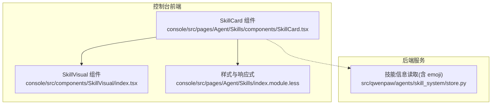
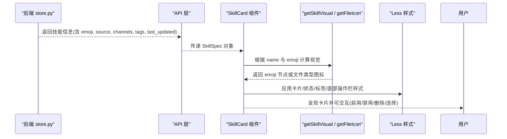
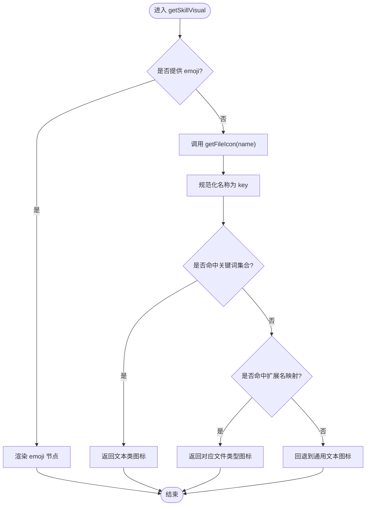
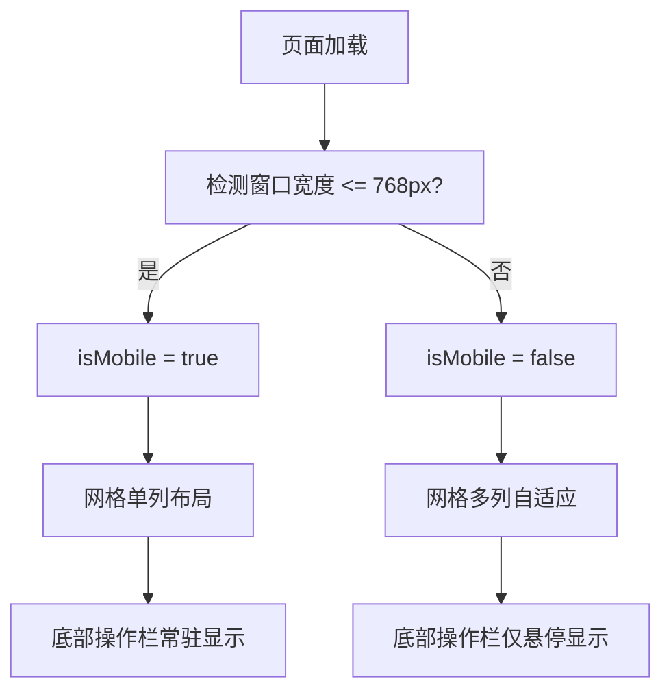
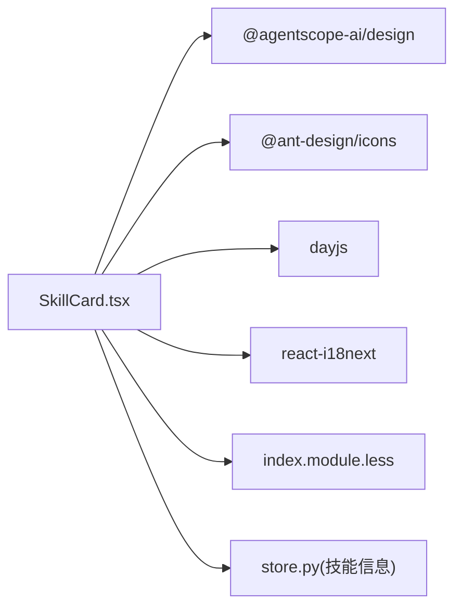

# 技能卡片组件

<cite>
**本文引用的文件**
- [SkillCard.tsx](file://console/src/pages/Agent/Skills/components/SkillCard.tsx)
- [index.module.less](file://console/src/pages/Agent/Skills/index.module.less)
- [SkillVisual/index.tsx](file://console/src/components/SkillVisual/index.tsx)
- [store.py](file://src/qwenpaw/agents/skill_system/store.py)
</cite>

## 目录
1. [简介](#简介)
2. [项目结构](#项目结构)
3. [核心组件](#核心组件)
4. [架构总览](#架构总览)
5. [详细组件分析](#详细组件分析)
6. [依赖分析](#依赖分析)
7. [性能考虑](#性能考虑)
8. [故障排查指南](#故障排查指南)
9. [结论](#结论)
10. [附录](#附录)

## 简介
本文件围绕 QwenPaw 前端的“技能卡片”组件进行系统化文档化，重点覆盖：
- 视觉设计与交互行为：图标显示、元数据展示、操作按钮布局与状态反馈。
- getSkillVisual 函数实现逻辑：默认图标生成、emoji 支持与自定义图标处理。
- 响应式设计与网格布局适配：不同屏幕尺寸下的显示效果与移动端优化。
- 扩展实践：如何添加自定义操作、接入动画效果、复用通用视觉能力。
- 常见问题与解决方案：图标加载失败、样式冲突、性能优化等。

目标读者包括初学者与有经验的开发者，既提供直观易懂的说明，也给出代码级细节与可操作的改进建议。

## 项目结构
与技能卡片相关的核心前端文件位于 console 子工程内，主要包含：
- 组件实现：SkillCard 组件及其样式
- 通用视觉能力：SkillVisual 组件（可复用的图标/emoji 渲染）
- 样式主题与响应式：Less 样式文件中的网格、卡片、暗色模式与移动端适配

图表来源
- [SkillCard.tsx:1-302](file://console/src/pages/Agent/Skills/components/SkillCard.tsx#L1-L302)
- [SkillVisual/index.tsx:1-115](file://console/src/components/SkillVisual/index.tsx#L1-L115)
- [index.module.less:103-167](file://console/src/pages/Agent/Skills/index.module.less#L103-L167)
- [store.py:829-850](file://src/qwenpaw/agents/skill_system/store.py#L829-L850)

章节来源
- [SkillCard.tsx:1-302](file://console/src/pages/Agent/Skills/components/SkillCard.tsx#L1-L302)
- [index.module.less:103-167](file://console/src/pages/Agent/Skills/index.module.less#L103-L167)

## 核心组件
- SkillCard 组件
  - 职责：以卡片形式展示单个技能的名称、状态、渠道、更新时间、标签、描述以及启用/禁用和删除等操作按钮；支持批量选择模式与移动端友好布局。
  - 关键特性：
    - 顶部行：左侧为技能图标或 emoji，右侧为状态徽章与批量选择复选框。
    - 标题行：技能名 + “内置/自定义”标签。
    - 元数据行：渠道列表、最后更新时间、标签集合。
    - 描述区：多行截断显示。
    - 底部操作栏：仅在悬停、批量模式或移动端时显示，包含启用/禁用与删除按钮。
    - 交互：点击卡片在批量模式下触发选择，否则进入详情；按钮事件通过 stopPropagation 避免冒泡。
    - 国际化：使用 i18n 文本键值。
    - 响应式：useIsMobile 钩子监听窗口宽度变化，控制底部操作栏的显隐。
- getSkillVisual 函数
  - 职责：根据 skill.name 与可选 emoji 决定渲染内容。若存在 emoji，则渲染 emoji；否则调用 getFileIcon 基于名称/扩展名映射到 Ant Design 文件类型图标。
  - 默认图标策略：
    - 特殊关键词集合优先匹配（如 news、file_reader、browser_visible、guidance、himalaya、dingtalk_channel）。
    - 按名称片段或文件扩展名映射到 Word/Excel/PPT/PDF/压缩包/图片/代码等图标。
    - 未命中时回退到通用文本文件图标。
- SkillVisual 组件
  - 职责：将 getSkillVisual 的逻辑封装为可复用组件，支持传入 emojiClassName 以便外部定制样式。
  - 适用场景：在其他页面或弹窗中复用统一的图标/emoji 渲染逻辑。

章节来源
- [SkillCard.tsx:133-138](file://console/src/pages/Agent/Skills/components/SkillCard.tsx#L133-L138)
- [SkillCard.tsx:140-301](file://console/src/pages/Agent/Skills/components/SkillCard.tsx#L140-L301)
- [SkillVisual/index.tsx:99-115](file://console/src/components/SkillVisual/index.tsx#L99-L115)

## 架构总览
从数据到视图的关键链路如下：
- 后端 store 读取技能目录并解析 frontmatter，产出包含 name、description、source、channels、tags、last_updated、emoji 等字段的技能信息。
- 前端 SkillCard 接收 SkillSpec 数据，渲染卡片 UI。
- getSkillVisual 负责图标/emoji 决策，getFileIcon 负责默认图标映射。
- Less 样式定义卡片网格、状态徽章、标签、底部操作栏及暗色模式与移动端适配。

图表来源
- [store.py:829-850](file://src/qwenpaw/agents/skill_system/store.py#L829-L850)
- [SkillCard.tsx:133-138](file://console/src/pages/Agent/Skills/components/SkillCard.tsx#L133-L138)
- [SkillCard.tsx:140-301](file://console/src/pages/Agent/Skills/components/SkillCard.tsx#L140-L301)
- [index.module.less:103-167](file://console/src/pages/Agent/Skills/index.module.less#L103-L167)

## 详细组件分析

### 视觉设计与交互行为
- 图标区域
  - 当 skill.emoji 存在时，渲染 emoji 并在固定尺寸容器内居中显示。
  - 否则根据 skill.name 推断文件类型并渲染对应图标。
- 状态徽章
  - 根据 skill.enabled 切换颜色与文案，带圆点指示器。
- 元数据展示
  - 渠道：将 "all" 翻译为“全部”，其余原样展示，逗号分隔。
  - 更新时间：使用 dayjs 相对时间格式化。
  - 标签：空时显示占位符“-”，非空则以标签芯片展示。
- 描述区
  - 单行或多行截断，保持卡片高度稳定。
- 操作按钮
  - 启用/禁用按钮：根据当前状态切换图标与文案。
  - 删除按钮：仅在提供 onDelete 回调时出现。
  - 批量模式：选中状态下隐藏单个卡片的操作按钮，改用顶部复选框。
- 交互细节
  - 卡片点击：批量模式下触发 onSelect，否则执行 onClick。
  - 按钮点击：阻止事件冒泡，避免误触卡片点击。
  - 悬停：桌面端悬停显示底部操作栏；移动端始终显示。

章节来源
- [SkillCard.tsx:140-301](file://console/src/pages/Agent/Skills/components/SkillCard.tsx#L140-L301)
- [index.module.less:169-216](file://console/src/pages/Agent/Skills/index.module.less#L169-L216)
- [index.module.less:527-552](file://console/src/pages/Agent/Skills/index.module.less#L527-L552)

### getSkillVisual 与默认图标生成
- 决策流程
  - 若 emoji 存在：直接渲染 emoji。
  - 否则：调用 getFileIcon(name) 基于名称与扩展名映射图标。
- 默认图标映射规则
  - 关键词集合优先匹配（如 news、file_reader、browser_visible、guidance、himalaya、dingtalk_channel）。
  - 名称片段匹配（docx/xlsx/pptx/pdf/cron 等）。
  - 扩展名匹配（txt/md/markdown、zip/rar/7z/tar/gz、pdf、doc/docx、xls/xlsx、ppt/pptx、jpg/jpeg/png/gif/svg/webp、py/js/ts/jsx/tsx/java/cpp/c/go/rs/rb/php 等）。
  - 未命中回退到通用文本文件图标。
- 可复用能力
  - 独立组件 SkillVisual 暴露相同逻辑，便于跨模块复用。

图表来源
- [SkillCard.tsx:133-138](file://console/src/pages/Agent/Skills/components/SkillCard.tsx#L133-L138)
- [SkillCard.tsx:47-131](file://console/src/pages/Agent/Skills/components/SkillCard.tsx#L47-L131)
- [SkillVisual/index.tsx:13-97](file://console/src/components/SkillVisual/index.tsx#L13-L97)

章节来源
- [SkillCard.tsx:47-131](file://console/src/pages/Agent/Skills/components/SkillCard.tsx#L47-L131)
- [SkillVisual/index.tsx:13-97](file://console/src/components/SkillVisual/index.tsx#L13-L97)

### 响应式设计与网格布局适配
- 网格布局
  - 使用 CSS Grid 自适应列数，最小列宽约 280px，间距 12px。
- 移动端适配
  - 小于等于 768px 时，网格变为单列，卡片最小高度自适应，底部操作栏改为静态布局。
  - useIsMobile 钩子监听窗口 resize，动态控制底部操作栏显隐。
- 暗色模式
  - 通过 :global(.dark-mode) 覆盖卡片背景、边框、文字、标签、输入框等样式，保证对比度与可读性。

图表来源
- [index.module.less:103-108](file://console/src/pages/Agent/Skills/index.module.less#L103-L108)
- [index.module.less:604-713](file://console/src/pages/Agent/Skills/index.module.less#L604-L713)
- [SkillCard.tsx:32-45](file://console/src/pages/Agent/Skills/components/SkillCard.tsx#L32-L45)
- [SkillCard.tsx:275-298](file://console/src/pages/Agent/Skills/components/SkillCard.tsx#L275-L298)

章节来源
- [index.module.less:103-108](file://console/src/pages/Agent/Skills/index.module.less#L103-L108)
- [index.module.less:604-713](file://console/src/pages/Agent/Skills/index.module.less#L604-L713)
- [SkillCard.tsx:32-45](file://console/src/pages/Agent/Skills/components/SkillCard.tsx#L32-L45)

### 扩展实践示例
- 添加自定义操作
  - 在 SkillCard 的底部操作栏新增一个 Button，绑定自定义 onClick 回调，并通过 props 透传父级处理函数。
  - 参考路径：[SkillCard.tsx:275-298](file://console/src/pages/Agent/Skills/components/SkillCard.tsx#L275-L298)
- 实现动画效果
  - 利用 CSS transition 对卡片 hover 状态增加缩放或阴影过渡，或在按钮点击时添加短暂 loading 态。
  - 参考路径：[index.module.less:140-167](file://console/src/pages/Agent/Skills/index.module.less#L140-L167)
- 复用图标/emoji 渲染
  - 在其他页面使用 SkillVisual 组件，传入 name 与 emoji，必要时通过 emojiClassName 定制样式。
  - 参考路径：[SkillVisual/index.tsx:99-115](file://console/src/components/SkillVisual/index.tsx#L99-L115)

章节来源
- [SkillCard.tsx:275-298](file://console/src/pages/Agent/Skills/components/SkillCard.tsx#L275-L298)
- [index.module.less:140-167](file://console/src/pages/Agent/Skills/index.module.less#L140-L167)
- [SkillVisual/index.tsx:99-115](file://console/src/components/SkillVisual/index.tsx#L99-L115)

## 依赖分析
- 组件内部依赖
  - UI 基础库：@agentscope-ai/design 的 Card、Button、Checkbox、Tooltip。
  - 图标库：@ant-design/icons 的文件类型与开关图标。
  - 日期格式化：dayjs。
  - 国际化：react-i18next。
  - 样式：Less 模块化样式。
- 外部数据依赖
  - 技能信息来自后端 store 解析的技能清单，包含 emoji、source、channels、tags、last_updated 等字段。

图表来源
- [SkillCard.tsx:1-19](file://console/src/pages/Agent/Skills/components/SkillCard.tsx#L1-L19)
- [store.py:829-850](file://src/qwenpaw/agents/skill_system/store.py#L829-L850)

章节来源
- [SkillCard.tsx:1-19](file://console/src/pages/Agent/Skills/components/SkillCard.tsx#L1-L19)
- [store.py:829-850](file://src/qwenpaw/agents/skill_system/store.py#L829-L850)

## 性能考虑
- 组件渲染优化
  - 使用 React.memo 包裹 SkillCard，减少不必要的重渲染。
  - 在批量模式下，避免重复计算底部操作栏，通过 isHover/batchMode/isMobile 条件渲染。
- 图标计算开销
  - getFileIcon 基于字符串匹配与 switch-case，复杂度低；大量卡片时可考虑缓存结果或使用 useMemo 在外层缓存。
- 事件冒泡控制
  - 按钮点击使用 stopPropagation，避免触发卡片点击，降低多余状态更新。
- 样式与主题
  - 合理使用 CSS transition，避免过度动画导致卡顿；暗色模式样式集中管理，减少运行时计算。

章节来源
- [SkillCard.tsx:140-153](file://console/src/pages/Agent/Skills/components/SkillCard.tsx#L140-L153)
- [SkillCard.tsx:155-176](file://console/src/pages/Agent/Skills/components/SkillCard.tsx#L155-L176)
- [index.module.less:140-167](file://console/src/pages/Agent/Skills/index.module.less#L140-L167)

## 故障排查指南
- 图标显示异常
  - 现象：某些技能名称无法匹配到预期图标。
  - 原因：名称未命中关键词集合或扩展名映射。
  - 解决：在 getFileIcon 中补充新的关键词或扩展名映射；或通过设置 skill.emoji 强制指定。
  - 参考路径：[SkillCard.tsx:47-131](file://console/src/pages/Agent/Skills/components/SkillCard.tsx#L47-L131)
- 样式冲突
  - 现象：卡片边框、背景或文字颜色不符合预期。
  - 原因：全局样式覆盖或暗色模式变量未生效。
  - 解决：检查 index.module.less 中相关类名与 :global(.dark-mode) 覆盖；确保 CSS 变量正确注入。
  - 参考路径：[index.module.less:1265-1599](file://console/src/pages/Agent/Skills/index.module.less#L1265-L1599)
- 性能问题
  - 现象：大量技能卡片滚动卡顿。
  - 原因：频繁重渲染或复杂动画。
  - 解决：确认已使用 React.memo；减少动画复杂度；必要时对外层数据进行缓存。
  - 参考路径：[SkillCard.tsx:140-153](file://console/src/pages/Agent/Skills/components/SkillCard.tsx#L140-L153)
- 移动端体验不佳
  - 现象：底部操作栏遮挡内容或布局错乱。
  - 原因：媒体查询未生效或 useIsMobile 未正确监听。
  - 解决：检查 @media (max-width: 768px) 规则与 useIsMobile 钩子；确保事件冒泡被阻止。
  - 参考路径：[index.module.less:604-713](file://console/src/pages/Agent/Skills/index.module.less#L604-L713), [SkillCard.tsx:32-45](file://console/src/pages/Agent/Skills/components/SkillCard.tsx#L32-L45)

章节来源
- [SkillCard.tsx:47-131](file://console/src/pages/Agent/Skills/components/SkillCard.tsx#L47-L131)
- [index.module.less:1265-1599](file://console/src/pages/Agent/Skills/index.module.less#L1265-L1599)
- [SkillCard.tsx:140-153](file://console/src/pages/Agent/Skills/components/SkillCard.tsx#L140-L153)
- [index.module.less:604-713](file://console/src/pages/Agent/Skills/index.module.less#L604-L713)
- [SkillCard.tsx:32-45](file://console/src/pages/Agent/Skills/components/SkillCard.tsx#L32-L45)

## 结论
SkillCard 组件通过清晰的视觉层次与完善的交互设计，提供了良好的技能管理能力。getSkillVisual 与 getFileIcon 的组合实现了灵活的图标/emoji 渲染策略，Less 样式确保了在不同屏幕尺寸与主题下的良好表现。通过合理的性能优化与可扩展的接口，该组件既能满足初学者的易用需求，也为高级开发者提供了足够的定制空间。

## 附录
- 数据来源说明
  - 技能信息（含 emoji、source、channels、tags、last_updated）由后端 store 解析技能目录与 frontmatter 后返回。
  - 参考路径：[store.py:829-850](file://src/qwenpaw/agents/skill_system/store.py#L829-L850)

章节来源
- [store.py:829-850](file://src/qwenpaw/agents/skill_system/store.py#L829-L850)