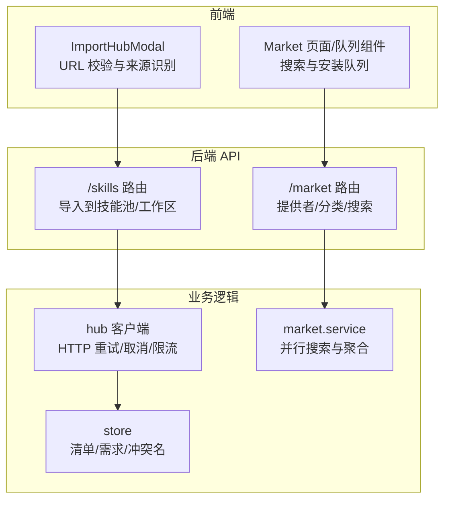
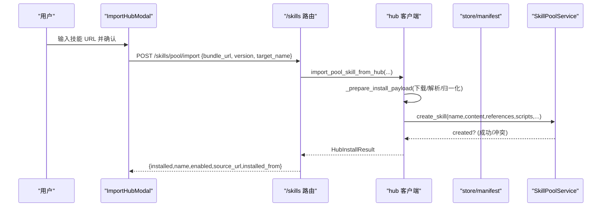
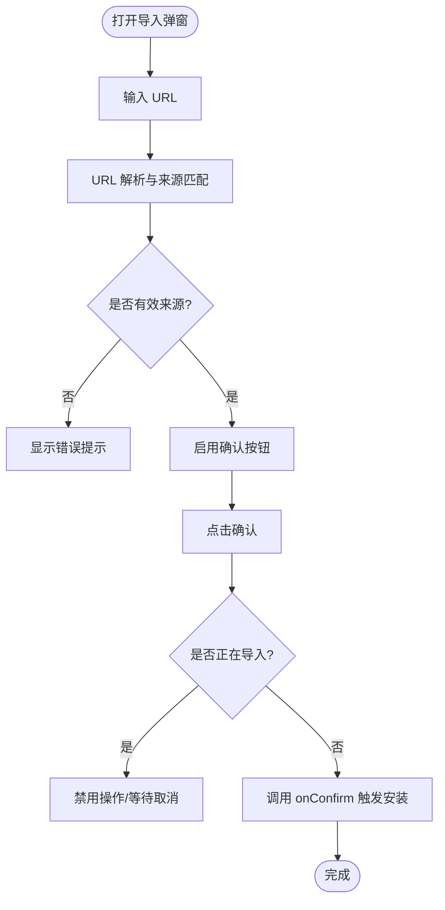
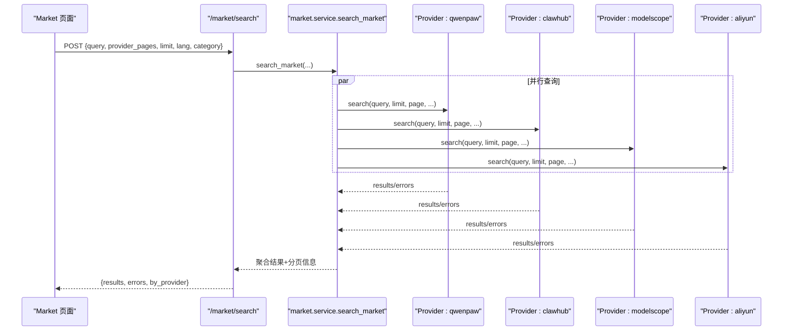
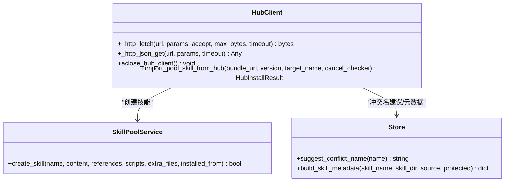
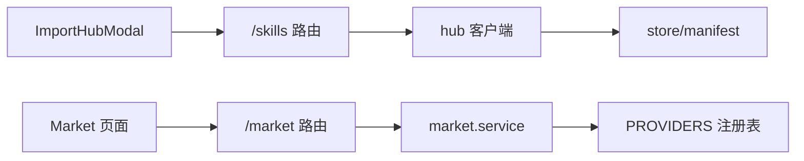

# 技能导入导出

<cite>
**本文引用的文件**
- [ImportHubModal.tsx](file://console/src/pages/Agent/Skills/components/ImportHubModal.tsx)
- [skills.py](file://src/qwenpaw/app/routers/skills.py)
- [hub.py](file://src/qwenpaw/agents/skill_system/hub.py)
- [store.py](file://src/qwenpaw/agents/skill_system/store.py)
- [market.py](file://src/qwenpaw/app/routers/market.py)
- [service.py](file://src/qwenpaw/market/service.py)
- [__init__.py（市场提供程序注册）](file://src/qwenpaw/market/providers/__init__.py)
- [clawhub.py](file://src/qwenpaw/market/providers/clawhub.py)
- [schema.py](file://src/qwenpaw/market/schema.py)
- [skills_cmd.py](file://src/qwenpaw/cli/skills_cmd.py)
- [BroadcastModal.tsx](file://console/src/pages/Settings/SkillPool/components/BroadcastModal.tsx)
- [QueueItem.tsx](file://console/src/pages/Settings/Market/components/QueueItem.tsx)
- [skills.zh.md](file://website/public/docs/skills.zh.md)
</cite>

## 目录
1. [简介](#简介)
2. [项目结构](#项目结构)
3. [核心组件](#核心组件)
4. [架构总览](#架构总览)
5. [详细组件分析](#详细组件分析)
6. [依赖关系分析](#依赖关系分析)
7. [性能与可靠性](#性能与可靠性)
8. [故障排查指南](#故障排查指南)
9. [结论](#结论)
10. [附录：示例与最佳实践](#附录示例与最佳实践)

## 简介
本文件聚焦 QwenPaw 的“技能导入导出”能力，围绕以下目标展开：
- 深入解析 ImportHubModal 的外部源导入逻辑，包括 URL 校验、来源识别、安装流程与取消机制。
- 记录 MarketPanel 的市场集成机制，涵盖多数据源并行搜索、分类映射、分页浏览与一键安装队列。
- 说明技能包的文件格式与结构规范，包括清单 frontmatter、依赖声明、版本约束与冲突处理。
- 给出来自代码库的实际路径示例，展示如何实现自定义导入源、离线安装与批量部署。
- 总结常见问题及解决方案，如网络失败、依赖冲突、签名验证错误等。

## 项目结构
与技能导入导出相关的前后端关键位置如下：
- 前端 UI 层
  - ImportHubModal：外部源导入弹窗，负责 URL 校验与来源匹配。
  - Market 页面与队列组件：市场搜索、结果展示、安装队列管理。
- 后端 API 层
  - /skills 路由：提供从 Hub 导入到技能池或工作区的接口。
  - /market 路由：提供市场提供者列表、分类与搜索接口。
- 业务逻辑层
  - hub：统一的 Hub 客户端与安装编排（重试、限流、取消、大小限制）。
  - market.service：市场搜索服务，聚合多个 provider 的结果。
  - store：技能清单与元数据构建、需求解析、冲突名建议。
  - CLI：命令行工具支持离线安装、测试与交互式配置。

图表来源
- [ImportHubModal.tsx:1-223](file://console/src/pages/Agent/Skills/components/ImportHubModal.tsx#L1-L223)
- [skills.py:1034-1059](file://src/qwenpaw/app/routers/skills.py#L1034-L1059)
- [hub.py:2187-2219](file://src/qwenpaw/agents/skill_system/hub.py#L2187-L2219)
- [market.py:89-112](file://src/qwenpaw/app/routers/market.py#L89-L112)
- [service.py:38-76](file://src/qwenpaw/market/service.py#L38-L76)
- [store.py:620-660](file://src/qwenpaw/agents/skill_system/store.py#L620-L660)

章节来源
- [ImportHubModal.tsx:1-223](file://console/src/pages/Agent/Skills/components/ImportHubModal.tsx#L1-L223)
- [skills.py:1034-1059](file://src/qwenpaw/app/routers/skills.py#L1034-L1059)
- [hub.py:2187-2219](file://src/qwenpaw/agents/skill_system/hub.py#L2187-L2219)
- [market.py:89-112](file://src/qwenpaw/app/routers/market.py#L89-L112)
- [service.py:38-76](file://src/qwenpaw/market/service.py#L38-L76)
- [store.py:620-660](file://src/qwenpaw/agents/skill_system/store.py#L620-L660)

## 核心组件
- ImportHubModal
  - 功能：接收用户输入的 URL，进行合法性与来源前缀匹配，确认后调用上层 onConfirm 触发安装。
  - 关键点：URL 规范化、来源白名单匹配、禁用态控制、可取消状态。
- 市场服务（market.service + providers）
  - 功能：按语言、分类、页码并行查询各数据源，合并结果并返回分页信息。
  - 关键点：未知 provider 拒绝、category 路由映射、异常隔离。
- Hub 客户端（hub）
  - 功能：统一 HTTP 请求封装、重试退避、取消钩子、大小限制、GitHub 缓存、下载流式读取。
  - 关键点：可配置超时/重试/退避、速率限制提示、安全扫描与冲突检测。
- 技能存储与清单（store）
  - 功能：构建技能元数据、解析依赖、生成冲突名建议、读取 references/scripts 树。
  - 关键点：frontmatter 解析、requirements 提取、目录树清洗。
- CLI 工具（skills_cmd）
  - 功能：命令行安装、卸载、测试、交互式配置；支持直接安装到工作区或技能池。
  - 关键点：异步运行、错误提示友好、自动关闭共享客户端。

章节来源
- [ImportHubModal.tsx:1-223](file://console/src/pages/Agent/Skills/components/ImportHubModal.tsx#L1-L223)
- [service.py:38-76](file://src/qwenpaw/market/service.py#L38-L76)
- [hub.py:378-603](file://src/qwenpaw/agents/skill_system/hub.py#L378-L603)
- [store.py:620-660](file://src/qwenpaw/agents/skill_system/store.py#L620-L660)
- [skills_cmd.py:417-480](file://src/qwenpaw/cli/skills_cmd.py#L417-L480)

## 架构总览
下图展示了从前端到后端的完整导入链路，以及市场搜索的安装入口。

图表来源
- [ImportHubModal.tsx:86-89](file://console/src/pages/Agent/Skills/components/ImportHubModal.tsx#L86-L89)
- [skills.py:1034-1059](file://src/qwenpaw/app/routers/skills.py#L1034-L1059)
- [hub.py:2187-2219](file://src/qwenpaw/agents/skill_system/hub.py#L2187-L2219)

## 详细组件分析

### ImportHubModal 外部源导入逻辑
- URL 校验与来源识别
  - 对输入进行 trim 与 URL 解析，若非法则提示“无效 URL”。
  - 将 host 标准化（去除 www），并与内置 skillMarkets 的 urlPrefix 进行主机与路径前缀匹配，确定来源。
  - 仅当来源匹配且未处于 importing 状态时启用确认按钮。
- 交互与状态
  - 支持清空输入、加载态禁用、可取消（通过 cancelImport 回调）。
  - 显示实时校验状态与支持的来源示例链接。
- 安装触发
  - 点击确认后调用 onConfirm(importUrl.trim())，由父组件发起后端导入。

图表来源
- [ImportHubModal.tsx:31-64](file://console/src/pages/Agent/Skills/components/ImportHubModal.tsx#L31-L64)
- [ImportHubModal.tsx:86-89](file://console/src/pages/Agent/Skills/components/ImportHubModal.tsx#L86-L89)

章节来源
- [ImportHubModal.tsx:1-223](file://console/src/pages/Agent/Skills/components/ImportHubModal.tsx#L1-L223)

### MarketPanel 市场集成机制
- 提供者发现与可用性
  - 后端通过 PROVIDERS 注册表暴露 qwenpaw、clawhub、modelscope、aliyun 四个提供者。
  - list_providers 返回每个提供者的 key、label、available 与 reason。
- 搜索与分页
  - search_market 根据 provider_pages 并发执行各提供者的搜索，聚合 results/errors/by_provider。
  - 单个提供者失败不影响其他结果；未知 provider 在路由层直接返回 400。
- 分类映射
  - resolve_category 将通用分类映射为各提供者的原生分类或搜索词。
- 浏览与安装
  - clawhub 实现 browse 分页拉取，使用游标翻页。
  - 前端安装走串行队列，支持重试与取消；重名以服务端错误展示并可改名重装。

图表来源
- [market.py:89-112](file://src/qwenpaw/app/routers/market.py#L89-L112)
- [service.py:38-76](file://src/qwenpaw/market/service.py#L38-L76)
- [__init__.py（市场提供程序注册）:17-22](file://src/qwenpaw/market/providers/__init__.py#L17-L22)
- [clawhub.py:81-118](file://src/qwenpaw/market/providers/clawhub.py#L81-L118)

章节来源
- [market.py:89-112](file://src/qwenpaw/app/routers/market.py#L89-L112)
- [service.py:38-76](file://src/qwenpaw/market/service.py#L38-L76)
- [__init__.py（市场提供程序注册）:17-22](file://src/qwenpaw/market/providers/__init__.py#L17-L22)
- [clawhub.py:81-118](file://src/qwenpaw/market/providers/clawhub.py#L81-L118)
- [skills.zh.md:339-365](file://website/public/docs/skills.zh.md#L339-L365)

### Hub 客户端与安装编排
- HTTP 基础能力
  - 统一 AsyncClient 复用、连接/读/写/池超时、最大连接数、User-Agent。
  - 重试策略：指数退避、可配置次数与上限；针对 GitHub 429/速率限制给出明确提示。
  - 流式下载：按块读取、累计大小限制、Content-Length 校验（非压缩/分块场景）。
- 取消与生命周期
  - 通过 contextvar 传播 cancel_checker，在关键节点检查并抛出取消异常。
  - aclose_hub_client 等待 in-flight 请求结束再关闭客户端。
- 安装流程
  - import_pool_skill_from_hub 准备安装载荷（下载/解析/归一化），写入技能池，冲突时返回结构化错误。
  - 路由层捕获扫描错误、冲突、参数错误等，转换为 HTTP 响应。

图表来源
- [hub.py:316-372](file://src/qwenpaw/agents/skill_system/hub.py#L316-L372)
- [hub.py:378-603](file://src/qwenpaw/agents/skill_system/hub.py#L378-L603)
- [hub.py:2187-2219](file://src/qwenpaw/agents/skill_system/hub.py#L2187-L2219)
- [store.py:620-660](file://src/qwenpaw/agents/skill_system/store.py#L620-L660)

章节来源
- [hub.py:316-372](file://src/qwenpaw/agents/skill_system/hub.py#L316-L372)
- [hub.py:378-603](file://src/qwenpaw/agents/skill_system/hub.py#L378-L603)
- [hub.py:2187-2219](file://src/qwenpaw/agents/skill_system/hub.py#L2187-L2219)
- [store.py:620-660](file://src/qwenpaw/agents/skill_system/store.py#L620-L660)
- [skills.py:1034-1059](file://src/qwenpaw/app/routers/skills.py#L1034-L1059)

### 技能包文件格式与结构规范
- 清单与元数据
  - 通过 frontmatter 解析 SKILL.md，提取 description、version_text 等字段。
  - build_skill_metadata 基于磁盘实际文件重建 manifest-facing metadata，保持描述性而非权威性。
- 依赖声明
  - requirements 包含 require_bins 与 require_envs，解析失败会回退为空并记录警告。
- 版本与更新
  - 支持 latestVersion/tags.latest 等来源侧版本提示；安装结果记录 installed_from 用于来源追踪。
- 冲突与命名
  - 冲突时提供 suggested_name，便于用户快速改名重装。

章节来源
- [store.py:620-660](file://src/qwenpaw/agents/skill_system/store.py#L620-L660)
- [store.py:829-850](file://src/qwenpaw/agents/skill_system/store.py#L829-L850)
- [hub.py:763-782](file://src/qwenpaw/agents/skill_system/hub.py#L763-L782)
- [hub.py:75-88](file://src/qwenpaw/agents/skill_system/hub.py#L75-L88)

### 批量部署与队列安装
- 广播式分发
  - BroadcastModal 支持选择多个技能与多个工作区，批量下发安装任务。
- 安装队列
  - QueueItem 展示单项安装状态，支持取消与重试；区分 pool 与工作区目标的不同行为。
- 串行队列与取消
  - 同一时刻只跑一个安装，避免资源争用；支持用户取消与失败重试。

章节来源
- [BroadcastModal.tsx:1-39](file://console/src/pages/Settings/SkillPool/components/BroadcastModal.tsx#L1-L39)
- [QueueItem.tsx:1-44](file://console/src/pages/Settings/Market/components/QueueItem.tsx#L1-L44)

## 依赖关系分析
- 模块耦合
  - ImportHubModal 仅依赖前端 skillMarkets 配置与 onConfirm 回调，低耦合。
  - /skills 路由依赖 hub 与 store，职责清晰。
  - market.service 通过 PROVIDERS 注册表解耦具体提供者实现。
- 外部依赖
  - httpx 作为唯一 HTTP 客户端，集中管理超时、重试、连接池。
  - frontmatter/yaml/json 用于清单与元数据解析。
- 潜在循环依赖
  - 当前未见循环引用；provider 与 service 通过接口契约与注册表组合。

图表来源
- [ImportHubModal.tsx:1-223](file://console/src/pages/Agent/Skills/components/ImportHubModal.tsx#L1-L223)
- [skills.py:1034-1059](file://src/qwenpaw/app/routers/skills.py#L1034-L1059)
- [hub.py:2187-2219](file://src/qwenpaw/agents/skill_system/hub.py#L2187-L2219)
- [market.py:89-112](file://src/qwenpaw/app/routers/market.py#L89-L112)
- [service.py:38-76](file://src/qwenpaw/market/service.py#L38-L76)
- [__init__.py（市场提供程序注册）:17-22](file://src/qwenpaw/market/providers/__init__.py#L17-L22)

章节来源
- [__init__.py（市场提供程序注册）:17-22](file://src/qwenpaw/market/providers/__init__.py#L17-L22)
- [service.py:38-76](file://src/qwenpaw/market/service.py#L38-L76)
- [market.py:89-112](file://src/qwenpaw/app/routers/market.py#L89-L112)
- [skills.py:1034-1059](file://src/qwenpaw/app/routers/skills.py#L1034-L1059)
- [hub.py:2187-2219](file://src/qwenpaw/agents/skill_system/hub.py#L2187-L2219)

## 性能与可靠性
- 网络与 I/O
  - 流式下载与分块读取降低内存峰值；内容长度校验保障完整性。
  - 指数退避与可配置重试提升弱网稳定性；GitHub 速率限制友好提示。
- 并发与资源
  - 共享 AsyncClient 复用连接；in-flight 计数确保优雅关闭。
  - 市场搜索并行执行，单提供者失败不阻塞整体。
- 容量与安全
  - 包条目数量与字节上限限制，防止恶意大包。
  - 安装前后安全扫描与冲突检测，阻断风险。

[本节为通用指导，无需特定文件来源]

## 故障排查指南
- 网络连接失败
  - 现象：安装或搜索超时/中断。
  - 排查：检查 QWENPAW_SKILLS_HUB_HTTP_TIMEOUT/RETRIES/BACKOFF_* 环境变量；观察日志中的重试与退避信息。
  - 参考：HTTP 重试与退避逻辑。
- 依赖冲突
  - 现象：安装时报 409 冲突，提示已存在技能。
  - 处理：使用 suggested_name 改名后重装；或通过 CLI 查看本地清单与状态。
  - 参考：冲突构造与建议名生成。
- 签名/安全验证错误
  - 现象：安全扫描失败导致安装中止。
  - 处理：修复 SKILL.md 或脚本问题；使用 CLI test 命令预检。
  - 参考：CLI 安全扫描与错误输出。
- 未知市场提供者
  - 现象：POST /market/search 返回 400，detail 列出 unknown providers。
  - 处理：修正 provider_pages 中的 key，确保在 PROVIDERS 中注册。
  - 参考：路由层校验与错误响应。

章节来源
- [hub.py:378-603](file://src/qwenpaw/agents/skill_system/hub.py#L378-L603)
- [hub.py:75-88](file://src/qwenpaw/agents/skill_system/hub.py#L75-L88)
- [skills.py:1034-1059](file://src/qwenpaw/app/routers/skills.py#L1034-L1059)
- [market.py:89-112](file://src/qwenpaw/app/routers/market.py#L89-L112)
- [skills_cmd.py:559-572](file://src/qwenpaw/cli/skills_cmd.py#L559-L572)

## 结论
QwenPaw 的技能导入导出体系以前端轻量校验与后端稳健编排为核心，结合统一 Hub 客户端与市场聚合服务，实现了跨来源、可观测、可恢复的安装体验。通过清晰的清单规范、依赖声明与冲突处理，配合 CLI 与批量部署能力，既满足初学者易用性，也为高级用户提供足够的扩展性与可控性。

[本节为总结，无需特定文件来源]

## 附录：示例与最佳实践

- 自定义导入源（前端）
  - 在 ImportHubModal 的 skillMarkets 配置中添加新的 urlPrefix 与示例链接，即可被 URL 校验识别。
  - 参考：URL 校验与来源匹配逻辑。
  - 章节来源
    - [ImportHubModal.tsx:31-64](file://console/src/pages/Agent/Skills/components/ImportHubModal.tsx#L31-L64)

- 自定义市场提供者（后端）
  - 在 market.providers 下新增 provider 模块，实现搜索接口并在 PROVIDERS 注册表中注册。
  - 参考：注册表与搜索服务。
  - 章节来源
    - [__init__.py（市场提供程序注册）:17-22](file://src/qwenpaw/market/providers/__init__.py#L17-L22)
    - [service.py:38-76](file://src/qwenpaw/market/service.py#L38-L76)

- 离线安装
  - 使用 CLI 指定 bundle_url 安装到技能池或指定 agent 工作区；支持 --enable/--no-enable。
  - 参考：CLI 安装命令。
  - 章节来源
    - [skills_cmd.py:417-480](file://src/qwenpaw/cli/skills_cmd.py#L417-L480)

- 批量部署
  - 使用 BroadcastModal 选择多个技能与多个工作区，提交批量安装任务；结合安装队列进行重试与取消。
  - 参考：广播模态与队列项。
  - 章节来源
    - [BroadcastModal.tsx:1-39](file://console/src/pages/Settings/SkillPool/components/BroadcastModal.tsx#L1-L39)
    - [QueueItem.tsx:1-44](file://console/src/pages/Settings/Market/components/QueueItem.tsx#L1-L44)

- 技能清单与依赖
  - 在 SKILL.md 的 frontmatter 中填写 description、version 等；在 requirements 中声明 bins/env。
  - 参考：清单构建与需求解析。
  - 章节来源
    - [store.py:620-660](file://src/qwenpaw/agents/skill_system/store.py#L620-L660)

- 市场使用说明
  - 文档说明了内置数据源、筛选与安装机制，以及 installed_from 的来源记录。
  - 章节来源
    - [skills.zh.md:339-365](file://website/public/docs/skills.zh.md#L339-L365)