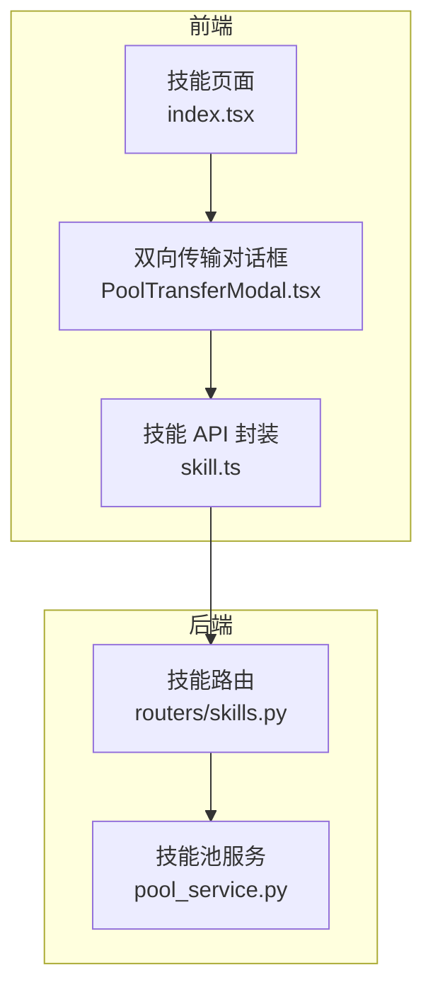
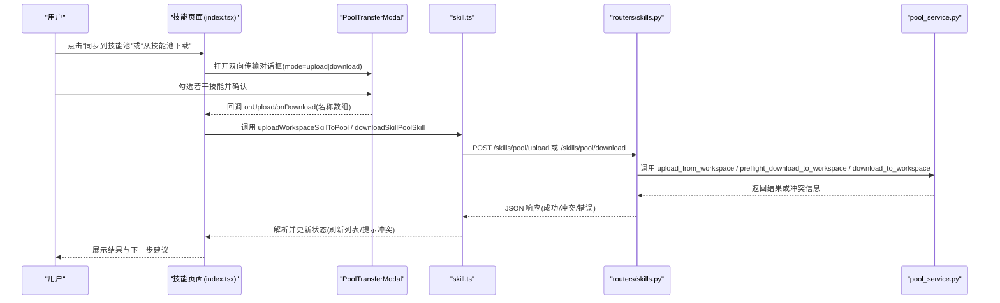
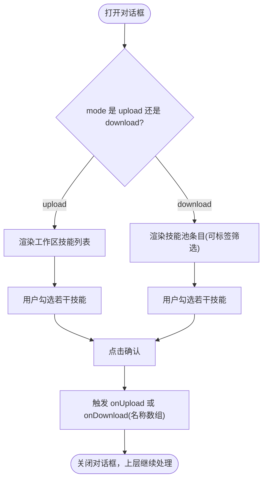
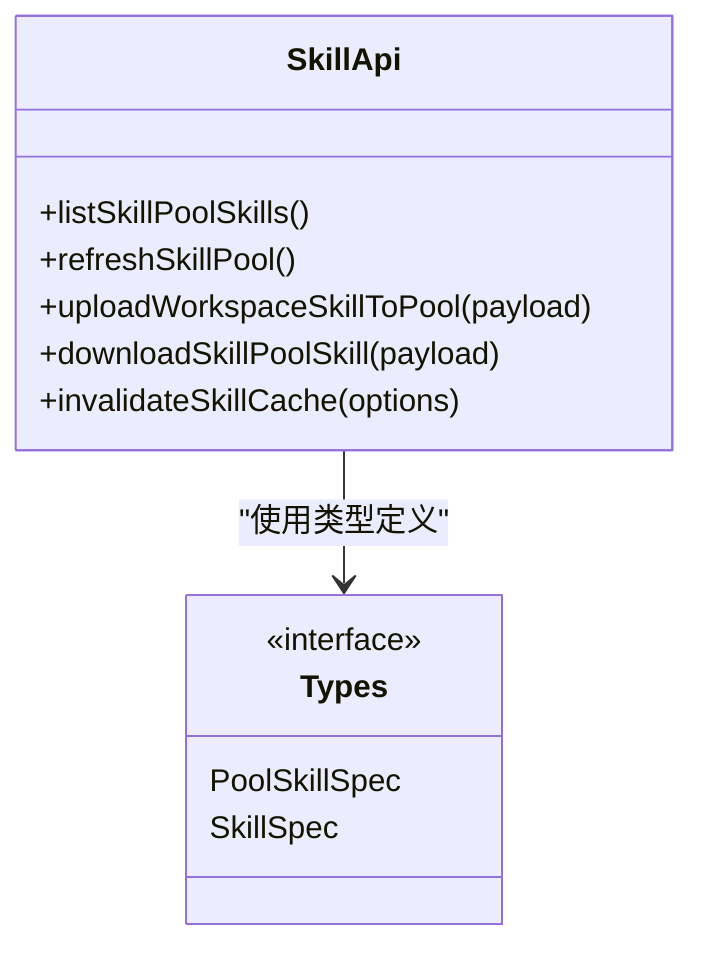
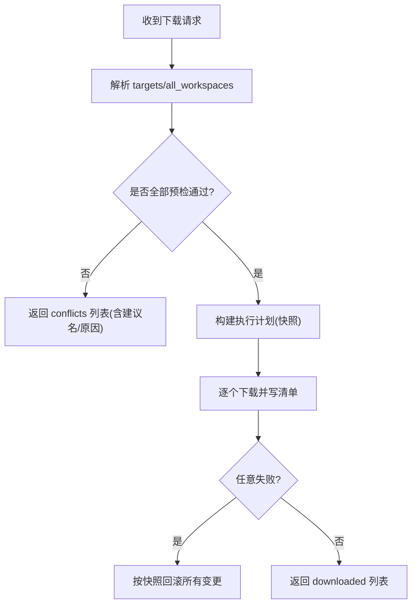

# 技能池管理

<cite>
**本文引用的文件列表**
- [PoolTransferModal.tsx](file://console/src/pages/Agent/Skills/components/PoolTransferModal.tsx)
- [Skills 页面入口 index.tsx](file://console/src/pages/Agent/Skills/index.tsx)
- [技能 API 模块 skill.ts](file://console/src/api/modules/skill.ts)
- [技能类型定义 skill.ts](file://console/src/api/types/skill.ts)
- [技能路由 skills.py](file://src/qwenpaw/app/routers/skills.py)
- [技能池服务 pool_service.py](file://src/qwenpaw/agents/skill_system/pool_service.py)
- [技能文档（中文）skills.zh.md](file://website/public/docs/skills.zh.md)
</cite>

## 目录
1. [简介](#简介)
2. [项目结构](#项目结构)
3. [核心组件](#核心组件)
4. [架构总览](#架构总览)
5. [详细组件分析](#详细组件分析)
6. [依赖关系分析](#依赖关系分析)
7. [性能与可用性考虑](#性能与可用性考虑)
8. [故障排查指南](#故障排查指南)
9. [结论](#结论)
10. [附录：API 参考](#附录api-参考)

## 简介
本章节面向 QwenPaw 的“技能池”能力，重点说明：
- 技能池的概念、作用与版本策略
- 前端双向传输组件 PoolTransferModal 的工作流程
- 后端上传/下载/同步与冲突解决机制
- 批量操作、进度显示与网络错误处理实践
- 常见问题定位与解决方案

## 项目结构
围绕“技能池管理”，涉及前后端关键位置如下：
- 前端交互层：技能页面对话框与状态管理
- 前端 API 层：统一的技能接口封装与缓存
- 后端路由层：HTTP 接口与请求校验
- 后端服务层：技能池生命周期与数据一致性保障

图表来源
- [Skills 页面入口 index.tsx:1-357](file://console/src/pages/Agent/Skills/index.tsx#L1-L357)
- [PoolTransferModal.tsx:1-193](file://console/src/pages/Agent/Skills/components/PoolTransferModal.tsx#L1-L193)
- [技能 API 模块 skill.ts:1-622](file://console/src/api/modules/skill.ts#L1-L622)
- [技能路由 skills.py:1062-1215](file://src/qwenpaw/app/routers/skills.py#L1062-L1215)
- [技能池服务 pool_service.py:790-1264](file://src/qwenpaw/agents/skill_system/pool_service.py#L790-L1264)

章节来源
- [Skills 页面入口 index.tsx:1-357](file://console/src/pages/Agent/Skills/index.tsx#L1-L357)
- [技能 API 模块 skill.ts:1-622](file://console/src/api/modules/skill.ts#L1-L622)

## 核心组件
- PoolTransferModal：提供“从工作区上传到技能池”和“从技能池下载到工作区”的双向选择与批量操作界面。
- useSkillsPage（由 Skills 页面使用）：负责打开/关闭对话框、收集选中项并调用 API。
- skill.ts：封装 /skills/pool/upload 与 /skills/pool/download 等接口，包含缓存与错误处理。
- routers/skills.py：暴露 HTTP 接口，进行参数校验、冲突预检与事务性回滚。
- pool_service.py：实现上传/下载/自动同步/冲突检测等核心逻辑。

章节来源
- [PoolTransferModal.tsx:1-193](file://console/src/pages/Agent/Skills/components/PoolTransferModal.tsx#L1-L193)
- [Skills 页面入口 index.tsx:333-340](file://console/src/pages/Agent/Skills/index.tsx#L333-L340)
- [技能 API 模块 skill.ts:405-441](file://console/src/api/modules/skill.ts#L405-L441)
- [技能路由 skills.py:1062-1215](file://src/qwenpaw/app/routers/skills.py#L1062-L1215)
- [技能池服务 pool_service.py:790-1264](file://src/qwenpaw/agents/skill_system/pool_service.py#L790-L1264)

## 架构总览
下图展示一次“从工作区上传到技能池”的端到端流程，以及“从技能池下载”的预检与执行路径。

图表来源
- [Skills 页面入口 index.tsx:160-186](file://console/src/pages/Agent/Skills/index.tsx#L160-L186)
- [PoolTransferModal.tsx:47-53](file://console/src/pages/Agent/Skills/components/PoolTransferModal.tsx#L47-L53)
- [技能 API 模块 skill.ts:405-441](file://console/src/api/modules/skill.ts#L405-L441)
- [技能路由 skills.py:1062-1215](file://src/qwenpaw/app/routers/skills.py#L1062-L1215)
- [技能池服务 pool_service.py:790-1264](file://src/qwenpaw/agents/skill_system/pool_service.py#L790-L1264)

## 详细组件分析

### 组件：PoolTransferModal 双向传输逻辑
- 模式切换
  - mode="upload"：在工作区技能列表中多选，提交后调用 onUpload(skillNames)。
  - mode="download"：在技能池条目中多选（支持按标签筛选），提交后调用 onDownload(poolSkillNames)。
- 批量操作
  - 全选/清空选择；下载模式下支持“仅内置”快速选择。
- 过滤与展示
  - 下载模式支持多标签筛选，通过 useSkillFilter 与 SkillFilterDropdown 组合。
- 提交行为
  - 根据 mode 决定调用 onUpload 或 onDownload，上层页面负责将名称数组转为 API 调用。

图表来源
- [PoolTransferModal.tsx:20-193](file://console/src/pages/Agent/Skills/components/PoolTransferModal.tsx#L20-L193)

章节来源
- [PoolTransferModal.tsx:1-193](file://console/src/pages/Agent/Skills/components/PoolTransferModal.tsx#L1-L193)
- [Skills 页面入口 index.tsx:333-340](file://console/src/pages/Agent/Skills/index.tsx#L333-L340)

### 组件：技能 API 封装（上传/下载/同步/冲突）
- 上传到技能池
  - 接口：POST /skills/pool/upload
  - 入参：workspace_id, skill_name, overwrite?, preview_only?
  - 返回：success/name 或冲突信息
- 从技能池下载
  - 接口：POST /skills/pool/download
  - 入参：skill_name, targets[], all_workspaces?, overwrite?, preview_only?
  - 返回：downloaded[] 与 conflicts[]
- 同步与自动更新
  - 上传成功后若未开启预览模式，会触发后续自动同步流程（见路由层）。
- 缓存与错误处理
  - 列表类接口采用内存缓存（TTL 30s），并提供 invalidateSkillCache 精准失效。
  - 上传 ZIP 与常规请求统一走 request 封装，错误信息标准化以便上层解析。

图表来源
- [技能 API 模块 skill.ts:140-177](file://console/src/api/modules/skill.ts#L140-L177)
- [技能 API 模块 skill.ts:405-441](file://console/src/api/modules/skill.ts#L405-L441)
- [技能类型定义 skill.ts:23-44](file://console/src/api/types/skill.ts#L23-L44)

章节来源
- [技能 API 模块 skill.ts:1-622](file://console/src/api/modules/skill.ts#L1-L622)
- [技能类型定义 skill.ts:1-122](file://console/src/api/types/skill.ts#L1-L122)

### 后端：上传/下载/同步与冲突解决
- 上传（工作区 → 技能池）
  - 路由：POST /skills/pool/upload
  - 服务：upload_from_workspace
  - 行为：校验源存在、目标是否冲突（默认不覆盖）、可选预览模式、写入池清单并保留工作区配置/标签等元信息。
- 下载（技能池 → 工作区）
  - 路由：POST /skills/pool/download
  - 预检：preflight_download_to_workspace 对所有目标逐一检查冲突
  - 执行：download_to_workspace 原子复制并更新工作区清单；任一失败则整体回滚
- 自动同步
  - 上传成功后（非预览）触发 _follow_auto_update，内部基于内容哈希差异推送至已关联或已安装的目标工作区。
- 冲突策略
  - 命名冲突：返回 suggested_name 建议新名，避免静默覆盖
  - 内置语言切换：当池与工作区均为 builtin 且语言不一致时，视为冲突
  - 版本升级：builtin 版本不同需显式升级或改名

图表来源
- [技能路由 skills.py:1086-1215](file://src/qwenpaw/app/routers/skills.py#L1086-L1215)
- [技能池服务 pool_service.py:980-1113](file://src/qwenpaw/agents/skill_system/pool_service.py#L980-L1113)

章节来源
- [技能路由 skills.py:1062-1215](file://src/qwenpaw/app/routers/skills.py#L1062-L1215)
- [技能池服务 pool_service.py:790-1264](file://src/qwenpaw/agents/skill_system/pool_service.py#L790-L1264)

### 概念：技能池的作用与版本管理
- 全局共享：技能池作为团队级共享仓库，供多个工作区复用同一份技能。
- 团队协作：支持从工作区发布到池，再从池分发到其它工作区，形成“开发→共享→分发”的闭环。
- 版本管理：
  - 以 SKILL.md 内容为标准进行变更检测
  - 内置技能支持语言与版本对比，避免误覆盖
  - 自动同步：开启后，池内容变化自动推送到目标工作区，并在收件箱通知

章节来源
- [技能文档（中文）skills.zh.md:51-143](file://website/public/docs/skills.zh.md#L51-L143)
- [技能文档（中文）skills.zh.md:311-338](file://website/public/docs/skills.zh.md#L311-L338)

## 依赖关系分析
- 前端
  - Skills 页面持有对话框开关与批量状态，并将选择结果传递给 API 层
  - PoolTransferModal 仅负责选择与批量操作，不直接访问网络
  - skill.ts 对后端接口进行统一封装，提供缓存与错误格式化
- 后端
  - routers/skills.py 负责参数校验、冲突预检、事务性执行与回滚
  - pool_service.py 实现具体业务逻辑：上传、下载、自动同步、重命名迁移等

图表来源
- [Skills 页面入口 index.tsx:160-186](file://console/src/pages/Agent/Skills/index.tsx#L160-L186)
- [PoolTransferModal.tsx:47-53](file://console/src/pages/Agent/Skills/components/PoolTransferModal.tsx#L47-L53)
- [技能 API 模块 skill.ts:405-441](file://console/src/api/modules/skill.ts#L405-L441)
- [技能路由 skills.py:1062-1215](file://src/qwenpaw/app/routers/skills.py#L1062-L1215)
- [技能池服务 pool_service.py:790-1264](file://src/qwenpaw/agents/skill_system/pool_service.py#L790-L1264)

## 性能与可用性考虑
- 列表缓存
  - 技能列表接口采用 30 秒 TTL 的内存缓存，减少重复请求
  - 提供 invalidateSkillCache 支持按 agentId/workspaces/pool 精准失效
- 批量操作
  - 前端支持全选/清空/仅内置选择，降低用户操作成本
  - 后端下载为“全有或全无”语义，任一冲突即拒绝，避免部分成功导致的不一致
- 预览模式
  - 上传/下载均支持 preview_only，便于先查看影响范围再执行
- 自动同步
  - 基于内容哈希增量检测，避免无变更时的无效推送
  - 支持指定目标智能体集合，精确控制同步范围

[本节为通用指导，无需源码引用]

## 故障排查指南
- 网络超时/连接失败
  - 现象：请求长时间无响应或抛出网络错误
  - 排查：检查 VITE_API_BASE_URL 配置、代理与防火墙；确认后端服务可用
  - 建议：在 skill.ts 的请求封装处增加重试与超时配置（当前未内置）
- 权限不足
  - 现象：401/403 或鉴权头缺失
  - 排查：确认 buildAuthHeaders 是否正确注入 token；检查后端鉴权中间件
- 数据同步冲突
  - 现象：返回 conflicts 列表，包含 reason/suggested_name/language_switch/builtin_upgrade 等
  - 处理：
    - 命名冲突：按 suggested_name 重试
    - 语言切换：确认是否需要切换语言或保持现状
    - 版本升级：选择覆盖或跳过
- 自动同步异常
  - 现象：自动同步失败但上传成功
  - 排查：查看服务端日志中 autoupdate 相关警告；确认目标工作区是否存在该技能
- 预览模式验证
  - 建议：在执行前使用 preview_only=true 验证影响面，再正式执行

章节来源
- [技能 API 模块 skill.ts:1-622](file://console/src/api/modules/skill.ts#L1-L622)
- [技能路由 skills.py:1086-1215](file://src/qwenpaw/app/routers/skills.py#L1086-L1215)
- [技能池服务 pool_service.py:980-1113](file://src/qwenpaw/agents/skill_system/pool_service.py#L980-L1113)

## 结论
QwenPaw 的技能池管理通过清晰的前后端分层与严格的冲突预检/回滚机制，实现了安全可控的全局技能共享与协作。PoolTransferModal 提供了直观的双向传输体验，配合 skill.ts 的缓存与错误处理、路由层的幂等与回滚、服务层的增量同步与版本管理，既满足初学者易用性，也为高级用户提供足够的扩展点与可观测性。

[本节为总结，无需源码引用]

## 附录：API 参考
- 上传到技能池
  - 方法：POST
  - 路径：/skills/pool/upload
  - 请求体：{ workspace_id, skill_name, overwrite?, preview_only? }
  - 响应：{ success, name } 或冲突详情
- 从技能池下载
  - 方法：POST
  - 路径：/skills/pool/download
  - 请求体：{ skill_name, targets:[{workspace_id}], all_workspaces?, overwrite?, preview_only? }
  - 响应：{ downloaded:[{workspace_id, workspace_name, name}], conflicts?:[...] }
- 其他常用接口
  - 刷新技能池：POST /skills/pool/refresh
  - 获取技能池列表：GET /skills/pool
  - 批量删除技能池技能：POST /skills/pool/batch-delete

章节来源
- [技能 API 模块 skill.ts:140-177](file://console/src/api/modules/skill.ts#L140-L177)
- [技能 API 模块 skill.ts:405-441](file://console/src/api/modules/skill.ts#L405-L441)
- [技能路由 skills.py:1062-1215](file://src/qwenpaw/app/routers/skills.py#L1062-L1215)