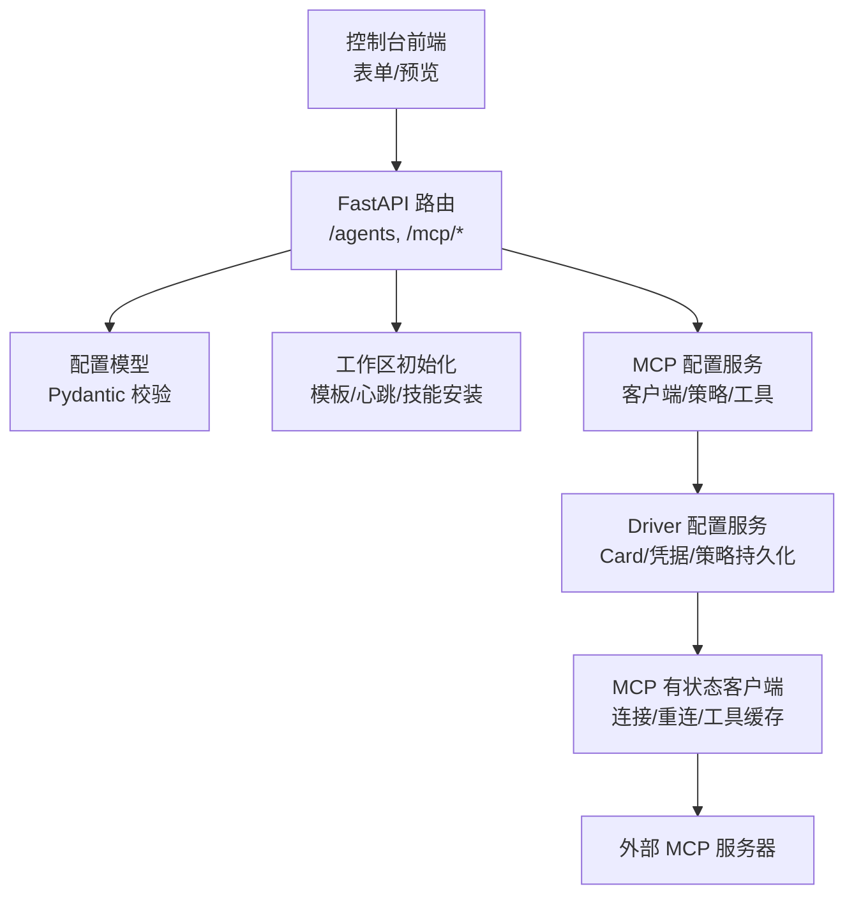
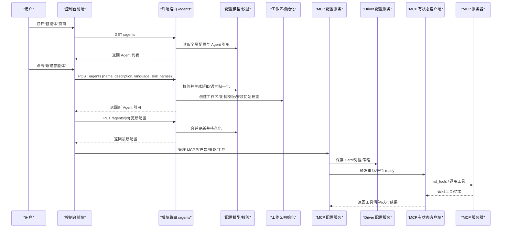
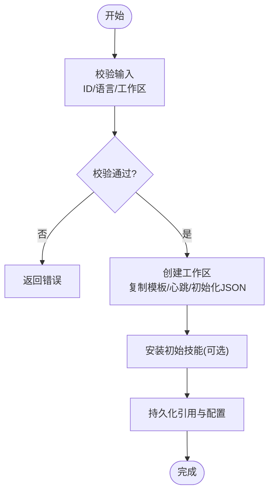
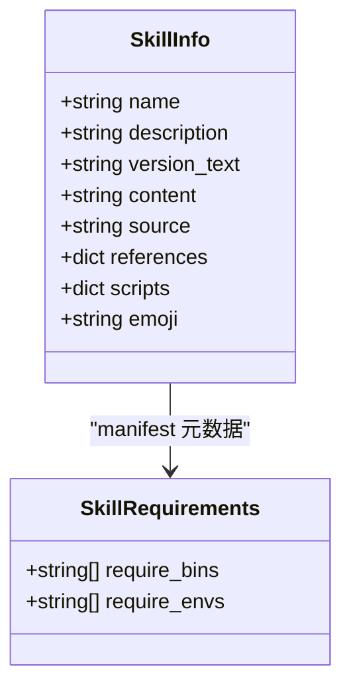
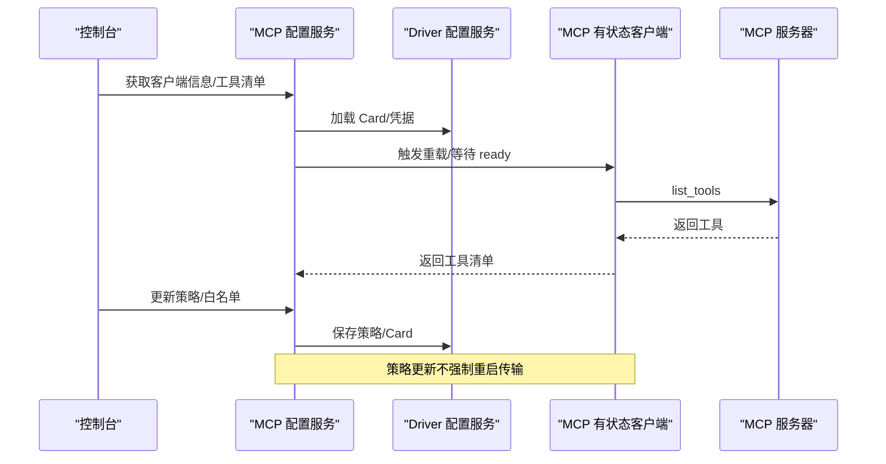
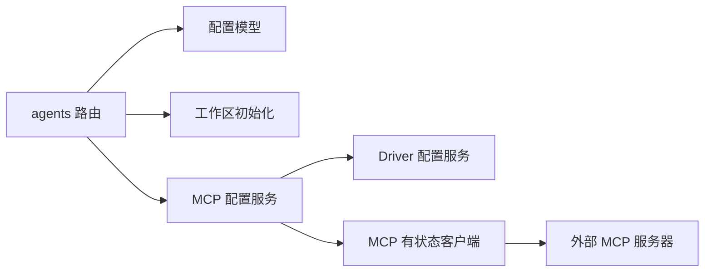

# Agent 管理

<cite>
**本文引用的文件**   
- [src/qwenpaw/app/routers/agents.py](file://src/qwenpaw/app/routers/agents.py)
- [src/qwenpaw/config/config.py](file://src/qwenpaw/config/config.py)
- [src/qwenpaw/app/mcp/config_service.py](file://src/qwenpaw/app/mcp/config_service.py)
- [src/qwenpaw/drivers/handlers/mcp_stateful_client.py](file://src/qwenpaw/drivers/handlers/mcp_stateful_client.py)
- [src/qwenpaw/agents/skill_system/models.py](file://src/qwenpaw/agents/skill_system/models.py)
- [website/public/docs/skills.zh.md](file://website/public/docs/skills.zh.md)
- [e2e/tests/test_agents.py](file://e2e/tests/test_agents.py)
- [e2e/pages/memory_page.py](file://e2e/pages/memory_page.py)
- [tests/integration/test_driver_mcp_approval_level_policy.py](file://tests/integration/test_driver_mcp_approval_level_policy.py)
</cite>

## 目录
1. [简介](#简介)
2. [项目结构](#项目结构)
3. [核心组件](#核心组件)
4. [架构总览](#架构总览)
5. [详细组件分析](#详细组件分析)
6. [依赖关系分析](#依赖关系分析)
7. [性能与可靠性](#性能与可靠性)
8. [故障排查指南](#故障排查指南)
9. [结论](#结论)
10. [附录：常用操作示例](#附录常用操作示例)

## 简介
本文件面向 QwenPaw 的 Agent 管理系统，系统性阐述 Agent 配置的完整生命周期管理，包括配置编辑、技能（Skill）管理、MCP 集成与工具权限控制。文档覆盖以下关键主题：
- 配置验证器与字段约束
- 动态表单生成与实时预览（基于后端模型与前端 Form.Item 命名约定）
- 配置版本化与工作区初始化
- Agent 与技能的关联关系及运行时注入
- MCP 客户端连接管理与工具白名单
- 工具访问策略（默认策略、按客户端/工具覆盖、来源与主体）
- 常见问题与排障建议

## 项目结构
Agent 管理涉及前后端协作与多模块协同：
- 后端 API：提供 Agent 列表、创建、更新、删除、启用/禁用等 REST 接口
- 配置模型：使用 Pydantic 定义强类型配置，内置校验与迁移逻辑
- 工作区：每个 Agent 拥有独立工作区，包含会话、记忆、技能副本、系统提示等
- 技能系统：共享池与工作区副本两层结构，支持运行时 config 注入
- MCP 服务：通过 DriverConfigService 与 MCPConfigService 管理客户端、凭据、策略与工具清单
- 状态机与重连：MCP 客户端具备生命周期任务、事件同步与自动重连

图表来源
- [src/qwenpaw/app/routers/agents.py:157-484](file://src/qwenpaw/app/routers/agents.py#L157-L484)
- [src/qwenpaw/config/config.py:1336-1468](file://src/qwenpaw/config/config.py#L1336-L1468)
- [src/qwenpaw/app/mcp/config_service.py:74-353](file://src/qwenpaw/app/mcp/config_service.py#L74-L353)
- [src/qwenpaw/drivers/handlers/mcp_stateful_client.py:219-350](file://src/qwenpaw/drivers/handlers/mcp_stateful_client.py#L219-L350)

章节来源
- [src/qwenpaw/app/routers/agents.py:157-484](file://src/qwenpaw/app/routers/agents.py#L157-L484)
- [src/qwenpaw/config/config.py:1336-1468](file://src/qwenpaw/config/config.py#L1336-L1468)

## 核心组件
- Agent 配置模型
  - 根级引用：AgentProfileRef（仅保存 ID、工作区路径、是否启用）
  - 完整配置：AgentProfileConfig（名称、描述、语言、通道、MCP、心跳、运行参数、安全级别、工具与安全等）
  - 运行参数：AgentsRunningConfig（最大迭代、重试/退避、并发、QPM、上下文压缩、记忆后端、审批级别等）
  - MCP 客户端：MCPClientConfig（传输方式、命令/URL、环境变量、工具白名单、OAuth）
- 配置校验器
  - Agent ID 校验：长度、字符集、保留字、唯一性
  - 字段范围与关系校验（如 LLM 重试退避上限不小于下限）
- 工作区初始化
  - 复制模板 Markdown、创建 HEARTBEAT.md、初始化 jobs.json/chats.json、安装初始技能
- MCP 配置服务
  - 客户端 CRUD、凭据存储、策略读写、工具清单与白名单、访问主体选项聚合
- MCP 有状态客户端
  - 生命周期任务、ready/reload 事件、连接超时、错误处理与重连、工具缓存

章节来源
- [src/qwenpaw/config/config.py:126-195](file://src/qwenpaw/config/config.py#L126-L195)
- [src/qwenpaw/config/config.py:1336-1468](file://src/qwenpaw/config/config.py#L1336-L1468)
- [src/qwenpaw/config/config.py:1571-1599](file://src/qwenpaw/config/config.py#L1571-L1599)
- [src/qwenpaw/app/routers/agents.py:568-612](file://src/qwenpaw/app/routers/agents.py#L568-L612)
- [src/qwenpaw/app/mcp/config_service.py:74-353](file://src/qwenpaw/app/mcp/config_service.py#L74-L353)
- [src/qwenpaw/drivers/handlers/mcp_stateful_client.py:219-350](file://src/qwenpaw/drivers/handlers/mcp_stateful_client.py#L219-L350)

## 架构总览
下图展示从控制台到后端再到 MCP 服务器的端到端流程，涵盖 Agent 配置、技能加载、MCP 客户端与工具调用。

图表来源
- [src/qwenpaw/app/routers/agents.py:272-398](file://src/qwenpaw/app/routers/agents.py#L272-L398)
- [src/qwenpaw/app/routers/agents.py:568-612](file://src/qwenpaw/app/routers/agents.py#L568-L612)
- [src/qwenpaw/app/mcp/config_service.py:258-353](file://src/qwenpaw/app/mcp/config_service.py#L258-L353)
- [src/qwenpaw/drivers/handlers/mcp_stateful_client.py:282-350](file://src/qwenpaw/drivers/handlers/mcp_stateful_client.py#L282-L350)

## 详细组件分析

### 组件 A：Agent 配置与生命周期
- 配置模型与校验
  - Agent ID 规则：最小/最大长度、正则匹配、保留词、唯一性
  - 运行参数：LLM 重试/退避/并发/QPM、上下文压缩、记忆后端、审批级别
  - MCP 客户端：传输、命令/URL、环境变量、工具白名单、OAuth
- 生命周期
  - 创建：生成短 ID、规范化语言、创建工作区、复制模板、安装初始技能、写入引用与配置
  - 更新：增量合并字段、持久化、调度热重载
  - 删除：停止实例、清理引用与顺序
  - 启用/禁用：停止或启动实例、持久化 enabled 标志

图表来源
- [src/qwenpaw/config/config.py:126-195](file://src/qwenpaw/config/config.py#L126-L195)
- [src/qwenpaw/app/routers/agents.py:272-398](file://src/qwenpaw/app/routers/agents.py#L272-L398)
- [src/qwenpaw/app/routers/agents.py:568-612](file://src/qwenpaw/app/routers/agents.py#L568-L612)

章节来源
- [src/qwenpaw/config/config.py:126-195](file://src/qwenpaw/config/config.py#L126-L195)
- [src/qwenpaw/config/config.py:1336-1468](file://src/qwenpaw/config/config.py#L1336-L1468)
- [src/qwenpaw/app/routers/agents.py:272-398](file://src/qwenpaw/app/routers/agents.py#L272-L398)
- [src/qwenpaw/app/routers/agents.py:568-612](file://src/qwenpaw/app/routers/agents.py#L568-L612)

### 组件 B：技能（Skill）系统与 Agent 关联
- 两层结构
  - 技能池：共享仓库，用于集中管理与分发
  - 工作区副本：Agent 实际运行的本地副本
- 运行时注入
  - manifest 中声明 requires.env；config 中与声明匹配的 key 注入为环境变量
  - 完整 JSON 以 QWENPAW_SKILL_CONFIG_<SKILL_NAME> 注入
  - 优先级：宿主环境变量 > 工作区配置 > 池配置
- 频道路由
  - 可在 SKILL.md 限制生效频道，Agent 在特定频道仅加载匹配的技能
- 安装与同步
  - 创建 Agent 时可指定初始技能列表，后台从技能池下载至工作区
  - 工作区技能可上传至技能池，再广播到其他工作区

图表来源
- [src/qwenpaw/agents/skill_system/models.py:47-80](file://src/qwenpaw/agents/skill_system/models.py#L47-L80)

章节来源
- [website/public/docs/skills.zh.md:1-154](file://website/public/docs/skills.zh.md#L1-L154)
- [website/public/docs/skills.zh.md:367-497](file://website/public/docs/skills.zh.md#L367-L497)
- [src/qwenpaw/app/routers/agents.py:535-566](file://src/qwenpaw/app/routers/agents.py#L535-L566)
- [src/qwenpaw/agents/skill_system/models.py:47-80](file://src/qwenpaw/agents/skill_system/models.py#L47-L80)

### 组件 C：MCP 客户端与工具权限
- 客户端管理
  - 创建/更新/删除/启用/禁用
  - 凭据存储（静态/OAuth），显示名唯一性校验
- 工具清单与白名单
  - 列出工具时若客户端未启用则返回空
  - tools 白名单控制加载的工具集合
- 访问策略
  - 默认效果（allow/ask/deny）
  - 客户端级覆盖（按来源/主体）
  - 工具级默认与覆盖
  - 策略变更无需重启传输层即可生效
- 连接与重连
  - 生命周期任务、ready/reload 事件
  - 连接失败标记断开并计划重连
  - list_tools 在短暂重连窗口内等待并重试，避免单次抖动导致整轮失败

图表来源
- [src/qwenpaw/app/mcp/config_service.py:128-182](file://src/qwenpaw/app/mcp/config_service.py#L128-L182)
- [src/qwenpaw/app/mcp/config_service.py:245-353](file://src/qwenpaw/app/mcp/config_service.py#L245-L353)
- [src/qwenpaw/drivers/handlers/mcp_stateful_client.py:282-350](file://src/qwenpaw/drivers/handlers/mcp_stateful_client.py#L282-L350)

章节来源
- [src/qwenpaw/app/mcp/config_service.py:74-353](file://src/qwenpaw/app/mcp/config_service.py#L74-L353)
- [src/qwenpaw/drivers/handlers/mcp_stateful_client.py:219-350](file://src/qwenpaw/drivers/handlers/mcp_stateful_client.py#L219-L350)
- [tests/integration/test_driver_mcp_approval_level_policy.py:76-181](file://tests/integration/test_driver_mcp_approval_level_policy.py#L76-L181)

### 组件 D：动态表单与实时预览
- 后端模型驱动
  - 所有配置项由 Pydantic 模型定义，含字段说明、默认值、取值范围与校验器
- 前端渲染约定
  - 使用稳定的 Form.Item name 绑定，便于自动化测试定位
  - 例如长期记忆页签下的 dream_cron、summarize_when_compact 等控件
- 实时预览
  - 前端根据模型字段与注释生成帮助文本与校验提示
  - 修改后即时提交，后端合并更新并返回最新配置

章节来源
- [src/qwenpaw/config/config.py:1336-1468](file://src/qwenpaw/config/config.py#L1336-L1468)
- [e2e/pages/memory_page.py:34-59](file://e2e/pages/memory_page.py#L34-L59)
- [e2e/pages/memory_page.py:86-126](file://e2e/pages/memory_page.py#L86-L126)

## 依赖关系分析
- 路由层依赖配置模型与工作区初始化函数
- MCP 配置服务依赖 Driver 配置服务进行 Card/凭据/策略持久化
- MCP 有状态客户端负责与外部 MCP 服务器的连接、工具发现与调用
- 技能系统提供 SkillInfo/SkillRequirements 数据结构，供工作区与技能池交互

图表来源
- [src/qwenpaw/app/routers/agents.py:157-484](file://src/qwenpaw/app/routers/agents.py#L157-L484)
- [src/qwenpaw/app/mcp/config_service.py:74-353](file://src/qwenpaw/app/mcp/config_service.py#L74-L353)
- [src/qwenpaw/drivers/handlers/mcp_stateful_client.py:219-350](file://src/qwenpaw/drivers/handlers/mcp_stateful_client.py#L219-L350)

章节来源
- [src/qwenpaw/app/routers/agents.py:157-484](file://src/qwenpaw/app/routers/agents.py#L157-L484)
- [src/qwenpaw/app/mcp/config_service.py:74-353](file://src/qwenpaw/app/mcp/config_service.py#L74-L353)
- [src/qwenpaw/drivers/handlers/mcp_stateful_client.py:219-350](file://src/qwenpaw/drivers/handlers/mcp_stateful_client.py#L219-L350)

## 性能与可靠性
- 连接与重连
  - MCP 客户端在连接失败时标记断开并计划重连，避免阻塞主流程
  - list_tools 在短暂重连窗口内等待并重试，防止单次抖动影响整轮对话
- 策略更新
  - 策略变更无需重启传输层，降低切换成本
- 并发与限流
  - AgentsRunningConfig 提供并发、QPM、退避等参数，保护上游 LLM/MCP 服务

章节来源
- [src/qwenpaw/drivers/handlers/mcp_stateful_client.py:282-350](file://src/qwenpaw/drivers/handlers/mcp_stateful_client.py#L282-L350)
- [src/qwenpaw/config/config.py:1130-1255](file://src/qwenpaw/config/config.py#L1130-L1255)
- [tests/integration/test_driver_mcp_approval_level_policy.py:104-181](file://tests/integration/test_driver_mcp_approval_level_policy.py#L104-L181)

## 故障排查指南
- 配置语法检查
  - 使用 Pydantic 校验器捕获非法字段、越界值与关系约束
  - 关注 Agent ID 规则与 MCP 客户端显示名唯一性
- 依赖解析
  - 技能 requires.env 缺失会记录警告日志；确认工作区/池配置优先级
- 运行时错误诊断
  - MCP 客户端连接超时/重连失败：查看 ready 事件与错误处理日志
  - 策略拒绝：确认默认效果与覆盖规则，必要时调整策略或审批级别
- 常见现象与定位
  - 工具清单为空：检查客户端是否启用、tools 白名单、策略是否 deny
  - 策略更新未生效：确认是否触发了保存与策略序列化

章节来源
- [src/qwenpaw/config/config.py:126-195](file://src/qwenpaw/config/config.py#L126-L195)
- [src/qwenpaw/app/mcp/config_service.py:128-182](file://src/qwenpaw/app/mcp/config_service.py#L128-L182)
- [src/qwenpaw/drivers/handlers/mcp_stateful_client.py:219-350](file://src/qwenpaw/drivers/handlers/mcp_stateful_client.py#L219-L350)
- [tests/integration/test_driver_mcp_approval_level_policy.py:76-181](file://tests/integration/test_driver_mcp_approval_level_policy.py#L76-L181)

## 结论
QwenPaw 的 Agent 管理以强类型配置为核心，结合工作区隔离、技能分层与 MCP 客户端治理，形成高可用、可扩展的智能体编排体系。通过严格的校验器、清晰的策略模型与稳健的连接管理，既满足初学者的易用性，也为高级用户提供足够的深度与可控性。

## 附录：常用操作示例
- 创建自定义 Agent 配置
  - 调用 POST /agents，传入 name、description、language、skill_names 等字段
  - 服务端将生成短 ID、初始化工作区、安装初始技能并返回引用
  - 参考：[src/qwenpaw/app/routers/agents.py:272-364](file://src/qwenpaw/app/routers/agents.py#L272-L364)
- 集成新技能
  - 在工作区 skills/ 下放置 SKILL.md，或在控制台“添加技能”导入
  - 如需环境变量，确保 manifest 中 requires.env 与 config 对应键一致
  - 参考：[website/public/docs/skills.zh.md:1-154](file://website/public/docs/skills.zh.md#L1-L154)、[website/public/docs/skills.zh.md:367-497](file://website/public/docs/skills.zh.md#L367-L497)
- 配置 MCP 服务
  - 通过 MCP 配置服务创建/更新客户端，设置传输、命令/URL、环境变量与 OAuth
  - 维护工具白名单与访问策略，必要时调整默认效果与覆盖规则
  - 参考：[src/qwenpaw/app/mcp/config_service.py:258-353](file://src/qwenpaw/app/mcp/config_service.py#L258-L353)
- 验证与测试
  - 使用 E2E 用例验证 Agent 列表、创建、启用/禁用、技能关联等流程
  - 参考：[e2e/tests/test_agents.py:44-180](file://e2e/tests/test_agents.py#L44-L180)、[e2e/tests/test_agents.py:914-947](file://e2e/tests/test_agents.py#L914-L947)