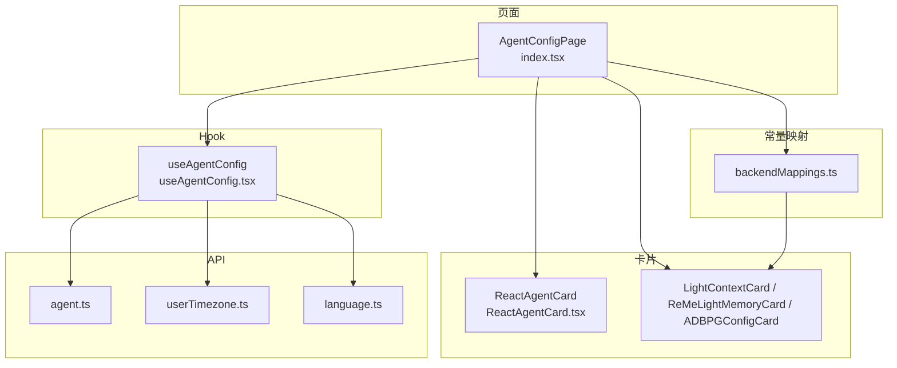
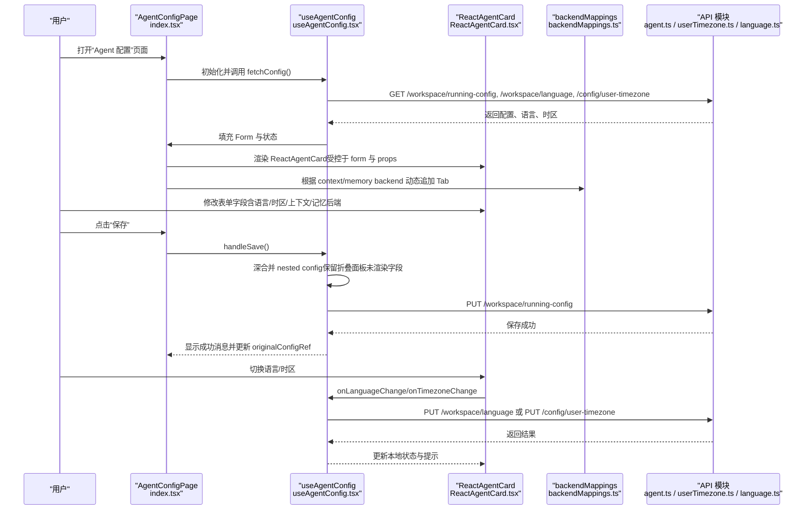
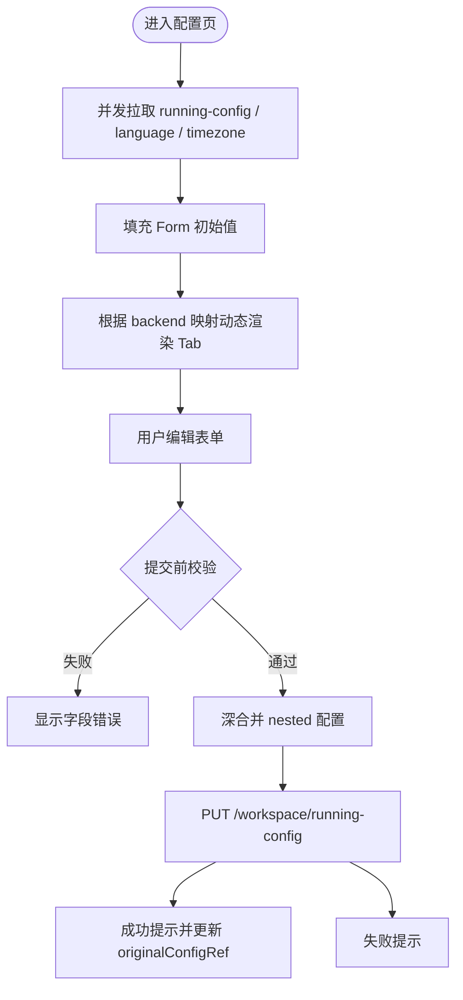
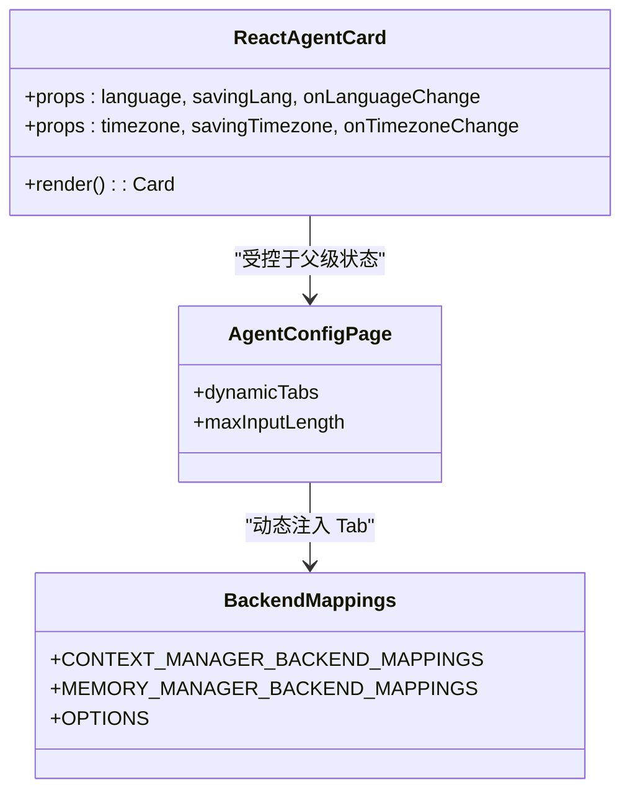
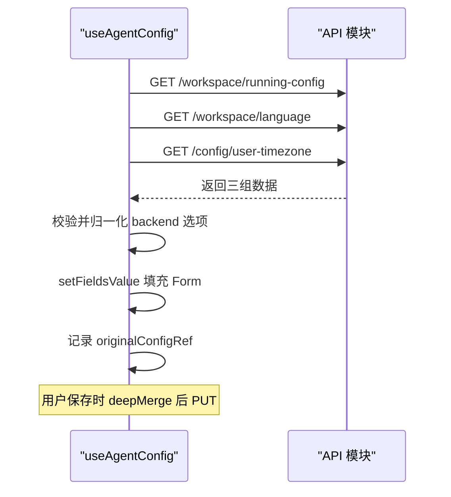
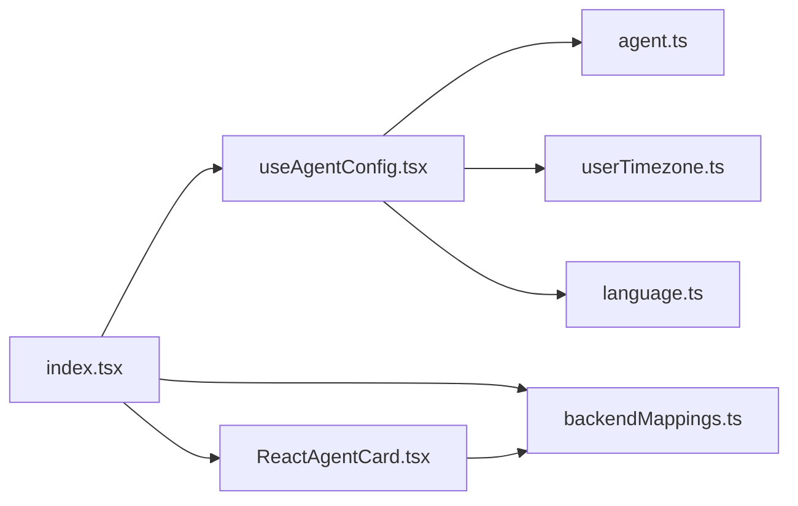

# Agent 配置编辑器

<cite>
**本文引用的文件**
- [console/src/pages/Agent/Config/index.tsx](file://console/src/pages/Agent/Config/index.tsx)
- [console/src/pages/Agent/Config/useAgentConfig.tsx](file://console/src/pages/Agent/Config/useAgentConfig.tsx)
- [console/src/pages/Agent/Config/components/ReactAgentCard.tsx](file://console/src/pages/Agent/Config/components/ReactAgentCard.tsx)
- [console/src/constants/backendMappings.ts](file://console/src/constants/backendMappings.ts)
- [console/src/api/modules/agent.ts](file://console/src/api/modules/agent.ts)
- [console/src/api/modules/userTimezone.ts](file://console/src/api/modules/userTimezone.ts)
- [console/src/api/modules/language.ts](file://console/src/api/modules/language.ts)
- [src/qwenpaw/config/config.py](file://src/qwenpaw/config/config.py)
- [e2e/tests/test_runtime_config.py](file://e2e/tests/test_runtime_config.py)
- [e2e/pages/memory_page.py](file://e2e/pages/memory_page.py)
</cite>

## 目录
1. [简介](#简介)
2. [项目结构](#项目结构)
3. [核心组件](#核心组件)
4. [架构总览](#架构总览)
5. [详细组件分析](#详细组件分析)
6. [依赖关系分析](#依赖关系分析)
7. [性能与体验优化](#性能与体验优化)
8. [故障排查指南](#故障排查指南)
9. [结论](#结论)
10. [附录：扩展与迁移实践](#附录扩展与迁移实践)

## 简介
本文件面向 QwenPaw 的“Agent 配置编辑器”，聚焦以下目标：
- 动态表单生成器的实现原理：基于配置的字段渲染、实时验证与错误处理。
- ReactAgentCard 的配置项管理：语言设置、时区配置、上下文窗口大小等核心参数。
- 配置数据的获取、缓存与持久化机制：前后端 API 交互模式与状态同步策略。
- 如何扩展新配置项、自定义验证规则与实现配置热重载。
- 常见问题及解决方案：配置冲突检测、版本兼容性与数据迁移。

文档兼顾初学者友好与资深开发者的技术深度，并提供可追溯的代码级来源与图示。

## 项目结构
Agent 配置编辑器位于前端控制台（console）中，采用“页面 + Hook + 卡片”的分层组织方式：
- 页面层：负责路由、Tab 布局、全局加载/错误态与保存/重置按钮。
- Hook 层：封装配置获取、合并、保存、语言与时区变更等逻辑。
- 卡片层：按功能域拆分表单区块（如 ReAct 基础、LLM 重试、速率限制、上下文压缩、记忆后端等）。
- 常量映射：通过后端选择器动态挂载对应卡片的 Tab。
- API 模块：统一封装工作空间运行配置、语言、时区等接口。

图表来源
- [console/src/pages/Agent/Config/index.tsx:1-275](file://console/src/pages/Agent/Config/index.tsx#L1-L275)
- [console/src/pages/Agent/Config/useAgentConfig.tsx:1-261](file://console/src/pages/Agent/Config/useAgentConfig.tsx#L1-L261)
- [console/src/pages/Agent/Config/components/ReactAgentCard.tsx:1-187](file://console/src/pages/Agent/Config/components/ReactAgentCard.tsx#L1-L187)
- [console/src/constants/backendMappings.ts:1-54](file://console/src/constants/backendMappings.ts#L1-L54)
- [console/src/api/modules/agent.ts:1-134](file://console/src/api/modules/agent.ts#L1-L134)
- [console/src/api/modules/userTimezone.ts:1-16](file://console/src/api/modules/userTimezone.ts#L1-L16)
- [console/src/api/modules/language.ts:1-18](file://console/src/api/modules/language.ts#L1-L18)

章节来源
- [console/src/pages/Agent/Config/index.tsx:1-275](file://console/src/pages/Agent/Config/index.tsx#L1-L275)
- [console/src/pages/Agent/Config/useAgentConfig.tsx:1-261](file://console/src/pages/Agent/Config/useAgentConfig.tsx#L1-L261)
- [console/src/pages/Agent/Config/components/ReactAgentCard.tsx:1-187](file://console/src/pages/Agent/Config/components/ReactAgentCard.tsx#L1-L187)
- [console/src/constants/backendMappings.ts:1-54](file://console/src/constants/backendMappings.ts#L1-L54)
- [console/src/api/modules/agent.ts:1-134](file://console/src/api/modules/agent.ts#L1-L134)
- [console/src/api/modules/userTimezone.ts:1-16](file://console/src/api/modules/userTimezone.ts#L1-L16)
- [console/src/api/modules/language.ts:1-18](file://console/src/api/modules/language.ts#L1-L18)

## 核心组件
- 页面 AgentConfigPage
  - 使用 Tabs 展示多个配置面板；根据 context_manager_backend 与 memory_manager_backend 动态追加对应卡片 Tab。
  - 提供“重置”和“保存”操作，分别触发 fetchConfig 与 handleSave。
- Hook useAgentConfig
  - 并发拉取运行配置、语言、时区，填充 Form 并维护原始配置用于深合并保存。
  - 保存时对嵌套对象进行深合并，避免折叠面板未渲染字段丢失。
  - 语言切换带确认弹窗与成功反馈；时区切换即时保存。
- 卡片 ReactAgentCard
  - 提供语言、时区、Shell 命令超时、Shell 可执行路径、自动会话标题开关、上下文管理器后端、上下文策略、记忆后端等表单项。
  - 对部分字段内置必填与数值范围校验。
- 动态映射 backendMappings
  - 将后端选择值映射到具体卡片组件与 Tab key，支持运行时注入新的上下文/记忆后端配置页。

章节来源
- [console/src/pages/Agent/Config/index.tsx:76-210](file://console/src/pages/Agent/Config/index.tsx#L76-L210)
- [console/src/pages/Agent/Config/useAgentConfig.tsx:31-99](file://console/src/pages/Agent/Config/useAgentConfig.tsx#L31-L99)
- [console/src/pages/Agent/Config/useAgentConfig.tsx:105-180](file://console/src/pages/Agent/Config/useAgentConfig.tsx#L105-L180)
- [console/src/pages/Agent/Config/components/ReactAgentCard.tsx:44-186](file://console/src/pages/Agent/Config/components/ReactAgentCard.tsx#L44-L186)
- [console/src/constants/backendMappings.ts:13-54](file://console/src/constants/backendMappings.ts#L13-L54)

## 架构总览
下图展示了从用户交互到后端持久化的完整链路，包括动态 Tab 渲染、表单校验、保存时的深合并与提示反馈。

图表来源
- [console/src/pages/Agent/Config/index.tsx:76-210](file://console/src/pages/Agent/Config/index.tsx#L76-L210)
- [console/src/pages/Agent/Config/useAgentConfig.tsx:31-99](file://console/src/pages/Agent/Config/useAgentConfig.tsx#L31-L99)
- [console/src/pages/Agent/Config/useAgentConfig.tsx:105-180](file://console/src/pages/Agent/Config/useAgentConfig.tsx#L105-L180)
- [console/src/pages/Agent/Config/components/ReactAgentCard.tsx:44-186](file://console/src/pages/Agent/Config/components/ReactAgentCard.tsx#L44-L186)
- [console/src/constants/backendMappings.ts:13-54](file://console/src/constants/backendMappings.ts#L13-L54)
- [console/src/api/modules/agent.ts:45-64](file://console/src/api/modules/agent.ts#L45-L64)
- [console/src/api/modules/userTimezone.ts:7-15](file://console/src/api/modules/userTimezone.ts#L7-L15)
- [console/src/api/modules/language.ts:3-10](file://console/src/api/modules/language.ts#L3-L10)

## 详细组件分析

### 动态表单生成器（基于配置渲染）
- 动态 Tab 注入
  - 页面监听 context_manager_backend 与 memory_manager_backend 的变化，依据 backendMappings 将对应卡片组件作为新 Tab 插入。
  - 同时根据当前激活模型的最大输入长度，向上下文卡片传递 maxInputLength，以约束相关滑块/输入范围。
- 表单字段绑定
  - 所有字段通过 Form.Item 的 name 与后端 AgentsRunningConfig 字段一一对应，支持点路径（如 ["auto_title_config","enabled"]）。
- 实时验证
  - 使用表单库内置 rules 进行必填、类型与范围校验（例如 shell_command_timeout 必须为正整数）。
- 错误处理
  - 保存失败时区分表单校验错误与网络/业务错误，仅对非校验错误弹出通用失败提示。
  - 页面级 loading/error 态由 Hook 暴露，便于统一展示与重试。

图表来源
- [console/src/pages/Agent/Config/index.tsx:76-210](file://console/src/pages/Agent/Config/index.tsx#L76-L210)
- [console/src/pages/Agent/Config/useAgentConfig.tsx:105-180](file://console/src/pages/Agent/Config/useAgentConfig.tsx#L105-L180)
- [console/src/pages/Agent/Config/components/ReactAgentCard.tsx:84-121](file://console/src/pages/Agent/Config/components/ReactAgentCard.tsx#L84-L121)

章节来源
- [console/src/pages/Agent/Config/index.tsx:76-210](file://console/src/pages/Agent/Config/index.tsx#L76-L210)
- [console/src/pages/Agent/Config/useAgentConfig.tsx:105-180](file://console/src/pages/Agent/Config/useAgentConfig.tsx#L105-L180)
- [console/src/pages/Agent/Config/components/ReactAgentCard.tsx:84-121](file://console/src/pages/Agent/Config/components/ReactAgentCard.tsx#L84-L121)

### ReactAgentCard 配置项管理
- 语言设置
  - 下拉选择，切换时触发确认弹窗，成功后更新本地语言状态并提示复制的文件数量（如有）。
- 时区配置
  - 搜索型下拉，直接保存至后端并刷新本地状态。
- Shell 命令超时与可执行路径
  - 必填与最小值校验；占位符与工具提示完善用户体验。
- 自动会话标题
  - 开关项，绑定到 auto_title_config.enabled。
- 上下文与记忆后端
  - 通过 Select 选择后端，联动动态 Tab 渲染对应配置卡片。
- 上下文窗口大小
  - 页面在初始化时查询当前激活模型的 max_input_length，并传递给上下文卡片，用于控制滑块上限。

图表来源
- [console/src/pages/Agent/Config/components/ReactAgentCard.tsx:24-41](file://console/src/pages/Agent/Config/components/ReactAgentCard.tsx#L24-L41)
- [console/src/pages/Agent/Config/components/ReactAgentCard.tsx:44-186](file://console/src/pages/Agent/Config/components/ReactAgentCard.tsx#L44-L186)
- [console/src/constants/backendMappings.ts:13-54](file://console/src/constants/backendMappings.ts#L13-L54)
- [console/src/pages/Agent/Config/index.tsx:50-74](file://console/src/pages/Agent/Config/index.tsx#L50-L74)

章节来源
- [console/src/pages/Agent/Config/components/ReactAgentCard.tsx:44-186](file://console/src/pages/Agent/Config/components/ReactAgentCard.tsx#L44-L186)
- [console/src/pages/Agent/Config/index.tsx:50-74](file://console/src/pages/Agent/Config/index.tsx#L50-L74)
- [console/src/constants/backendMappings.ts:13-54](file://console/src/constants/backendMappings.ts#L13-L54)

### 配置数据的获取、缓存与持久化
- 获取
  - 使用 Promise.all 并发请求 running-config、language、timezone，减少首屏等待时间。
  - 对 context/memory backend 做白名单校验，回退到默认值保证 UI 稳定。
- 缓存
  - 使用 ref 保存 originalConfig，作为保存时的基准对象，避免重复网络请求。
  - 页面内 Form 实例作为临时缓存，配合“重置”按钮恢复。
- 持久化
  - 保存时对 nested 对象进行深合并，确保折叠面板未渲染字段不被覆盖。
  - 成功后更新 originalConfigRef，保持后续保存一致性。
- 状态同步
  - 语言与时区变更独立保存，立即更新本地状态并给出反馈。
  - 页面级 error/loading 状态统一管理，提供重试入口。

图表来源
- [console/src/pages/Agent/Config/useAgentConfig.tsx:31-99](file://console/src/pages/Agent/Config/useAgentConfig.tsx#L31-L99)
- [console/src/pages/Agent/Config/useAgentConfig.tsx:105-180](file://console/src/pages/Agent/Config/useAgentConfig.tsx#L105-L180)
- [console/src/api/modules/agent.ts:45-64](file://console/src/api/modules/agent.ts#L45-L64)
- [console/src/api/modules/userTimezone.ts:7-15](file://console/src/api/modules/userTimezone.ts#L7-L15)
- [console/src/api/modules/language.ts:3-10](file://console/src/api/modules/language.ts#L3-L10)

章节来源
- [console/src/pages/Agent/Config/useAgentConfig.tsx:31-99](file://console/src/pages/Agent/Config/useAgentConfig.tsx#L31-L99)
- [console/src/pages/Agent/Config/useAgentConfig.tsx:105-180](file://console/src/pages/Agent/Config/useAgentConfig.tsx#L105-L180)
- [console/src/api/modules/agent.ts:45-64](file://console/src/api/modules/agent.ts#L45-L64)
- [console/src/api/modules/userTimezone.ts:7-15](file://console/src/api/modules/userTimezone.ts#L7-L15)
- [console/src/api/modules/language.ts:3-10](file://console/src/api/modules/language.ts#L3-L10)

## 依赖关系分析
- 页面依赖 Hook 提供的 form、loading、saving、error、language/timezone 状态以及保存/重置方法。
- Hook 依赖 API 模块，且依赖 agentStore 获取当前 agent 上下文（虽然当前实现未直接使用 selectedAgent 影响请求路径，但保留了扩展点）。
- 卡片通过 Form.Item 的 name 与后端数据结构强耦合，新增字段需同步后端模型。
- 动态 Tab 依赖 backendMappings 注册表，新增后端只需在此处注册即可。

图表来源
- [console/src/pages/Agent/Config/index.tsx:1-275](file://console/src/pages/Agent/Config/index.tsx#L1-L275)
- [console/src/pages/Agent/Config/useAgentConfig.tsx:1-261](file://console/src/pages/Agent/Config/useAgentConfig.tsx#L1-L261)
- [console/src/pages/Agent/Config/components/ReactAgentCard.tsx:1-187](file://console/src/pages/Agent/Config/components/ReactAgentCard.tsx#L1-L187)
- [console/src/constants/backendMappings.ts:1-54](file://console/src/constants/backendMappings.ts#L1-L54)
- [console/src/api/modules/agent.ts:1-134](file://console/src/api/modules/agent.ts#L1-L134)
- [console/src/api/modules/userTimezone.ts:1-16](file://console/src/api/modules/userTimezone.ts#L1-L16)
- [console/src/api/modules/language.ts:1-18](file://console/src/api/modules/language.ts#L1-L18)

章节来源
- [console/src/pages/Agent/Config/index.tsx:1-275](file://console/src/pages/Agent/Config/index.tsx#L1-L275)
- [console/src/pages/Agent/Config/useAgentConfig.tsx:1-261](file://console/src/pages/Agent/Config/useAgentConfig.tsx#L1-L261)
- [console/src/pages/Agent/Config/components/ReactAgentCard.tsx:1-187](file://console/src/pages/Agent/Config/components/ReactAgentCard.tsx#L1-L187)
- [console/src/constants/backendMappings.ts:1-54](file://console/src/constants/backendMappings.ts#L1-L54)
- [console/src/api/modules/agent.ts:1-134](file://console/src/api/modules/agent.ts#L1-L134)
- [console/src/api/modules/userTimezone.ts:1-16](file://console/src/api/modules/userTimezone.ts#L1-L16)
- [console/src/api/modules/language.ts:1-18](file://console/src/api/modules/language.ts#L1-L18)

## 性能与体验优化
- 并发请求：首次加载使用 Promise.all 并行获取三项数据，降低首屏延迟。
- 懒渲染：Tabs 的 destroyInactiveTabPane=false 保留已渲染状态，避免重复初始化开销。
- 深合并保存：避免折叠面板导致的数据丢失，提升保存可靠性。
- 局部保存：语言与时区变更独立保存，减少不必要的 running-config 全量写入。
- 最大输入长度自适应：根据当前激活模型能力动态调整上下文卡片滑块上限，防止越界。

[本节为通用指导，不直接分析具体文件]

## 故障排查指南
- 页面加载失败
  - 现象：顶部显示错误信息与重试按钮。
  - 排查：检查 running-config、language、timezone 三个接口是否可达；查看 Hook 的错误分支与 message 提示。
- 保存失败
  - 现象：保存按钮 loading 结束后无成功提示。
  - 排查：确认表单校验是否通过；查看 deepMerge 后的 payload 是否符合后端模型；关注网络错误与业务错误分支。
- 语言切换无效
  - 现象：切换后界面语言未变化。
  - 排查：确认 updateAgentLanguage 返回的 language 字段；检查 i18n 资源是否生效；确认 Modal 确认流程是否被取消。
- 时区未生效
  - 现象：时间显示不符合预期。
  - 排查：确认 updateUserTimezone 成功；检查其他组件读取时区的来源是否与 Hook 一致。
- 动态 Tab 未出现
  - 现象：选择某后端后未出现对应 Tab。
  - 排查：检查 backendMappings 是否正确注册；确认 context/memory backend 的值是否在映射表中。

章节来源
- [console/src/pages/Agent/Config/useAgentConfig.tsx:92-99](file://console/src/pages/Agent/Config/useAgentConfig.tsx#L92-L99)
- [console/src/pages/Agent/Config/useAgentConfig.tsx:172-180](file://console/src/pages/Agent/Config/useAgentConfig.tsx#L172-L180)
- [console/src/pages/Agent/Config/useAgentConfig.tsx:182-242](file://console/src/pages/Agent/Config/useAgentConfig.tsx#L182-L242)
- [console/src/pages/Agent/Config/index.tsx:219-240](file://console/src/pages/Agent/Config/index.tsx#L219-L240)
- [console/src/constants/backendMappings.ts:13-54](file://console/src/constants/backendMappings.ts#L13-L54)

## 结论
QwenPaw 的 Agent 配置编辑器通过“页面 + Hook + 卡片 + 映射”的清晰分层，实现了高可扩展的动态表单系统。其关键优势在于：
- 基于配置驱动的字段渲染与 Tab 动态注入，新增后端仅需注册映射。
- 深合并保存策略保障复杂嵌套配置的一致性。
- 语言与时区独立保存，提升交互效率与用户体验。
- 完善的错误处理与重试机制，增强稳定性。

[本节为总结性内容，不直接分析具体文件]

## 附录：扩展与迁移实践

### 新增一个配置项（示例：新增“上下文窗口大小”的前端控制）
- 步骤
  - 在 ReactAgentCard 或对应卡片中添加 Form.Item，name 指向后端字段。
  - 如需范围限制，添加 rules 校验。
  - 若该配置属于某个后端专属，可在 backendMappings 中注册新 Tab 与组件。
  - 在 useAgentConfig 的 fetchConfig 中设置默认值，并在 save 时参与深合并。
- 参考路径
  - [console/src/pages/Agent/Config/components/ReactAgentCard.tsx:84-121](file://console/src/pages/Agent/Config/components/ReactAgentCard.tsx#L84-L121)
  - [console/src/pages/Agent/Config/useAgentConfig.tsx:55-85](file://console/src/pages/Agent/Config/useAgentConfig.tsx#L55-L85)
  - [console/src/constants/backendMappings.ts:13-54](file://console/src/constants/backendMappings.ts#L13-L54)

### 自定义验证规则
- 使用 Form.Item 的 rules 属性定义必填、类型、范围、正则等规则。
- 对于跨字段校验，可在保存前通过 form.validateFields 捕获并提示。
- 参考路径
  - [console/src/pages/Agent/Config/components/ReactAgentCard.tsx:84-107](file://console/src/pages/Agent/Config/components/ReactAgentCard.tsx#L84-L107)

### 实现配置热重载
- 方案一：监听后端事件（如 WebSocket/SSE），收到变更后重新调用 fetchConfig 并替换 Form 值。
- 方案二：定时轮询 running-config，对比 local 与 remote 差异后提示用户应用。
- 注意：为避免闪烁，建议先计算 diff，再选择性更新受影响字段。
- 参考路径
  - [console/src/pages/Agent/Config/useAgentConfig.tsx:31-99](file://console/src/pages/Agent/Config/useAgentConfig.tsx#L31-L99)

### 配置冲突检测
- 建议在保存前增加“预检”步骤：
  - 比较当前表单值与 originalConfigRef，识别潜在冲突（如互斥的后端组合）。
  - 若检测到冲突，阻止保存并给出明确提示。
- 参考路径
  - [console/src/pages/Agent/Config/useAgentConfig.tsx:105-180](file://console/src/pages/Agent/Config/useAgentConfig.tsx#L105-L180)

### 版本兼容性与数据迁移
- 后端模型演进
  - 新增字段需提供默认值，避免旧客户端报错。
  - 对历史字段提供兼容映射，必要时在 Hook 中进行归一化处理。
- 前端兼容
  - 在 fetchConfig 中对未知字段做容错处理（忽略或回退默认值）。
  - 对可选嵌套对象设置空对象兜底，避免 undefined 访问。
- 参考路径
  - [src/qwenpaw/config/config.py:1130-1309](file://src/qwenpaw/config/config.py#L1130-L1309)
  - [console/src/pages/Agent/Config/useAgentConfig.tsx:44-54](file://console/src/pages/Agent/Config/useAgentConfig.tsx#L44-L54)

### 端到端测试要点
- 验证页面导航、默认 Tab、语言与时区下拉显示。
- 验证表单修改、保存与重置行为。
- 验证记忆后端 Tab 的渲染与字段可见性。
- 参考路径
  - [e2e/tests/test_runtime_config.py:44-73](file://e2e/tests/test_runtime_config.py#L44-L73)
  - [e2e/pages/memory_page.py:34-59](file://e2e/pages/memory_page.py#L34-L59)