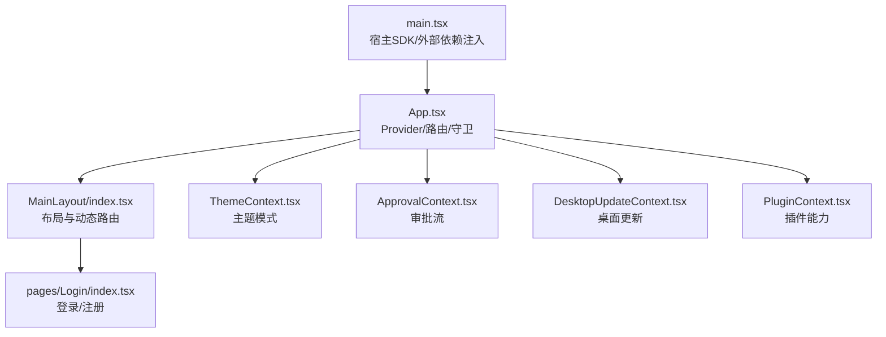
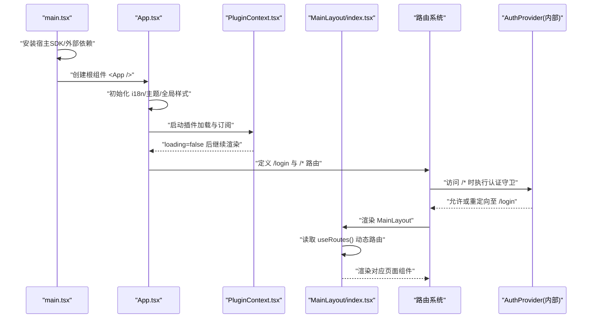
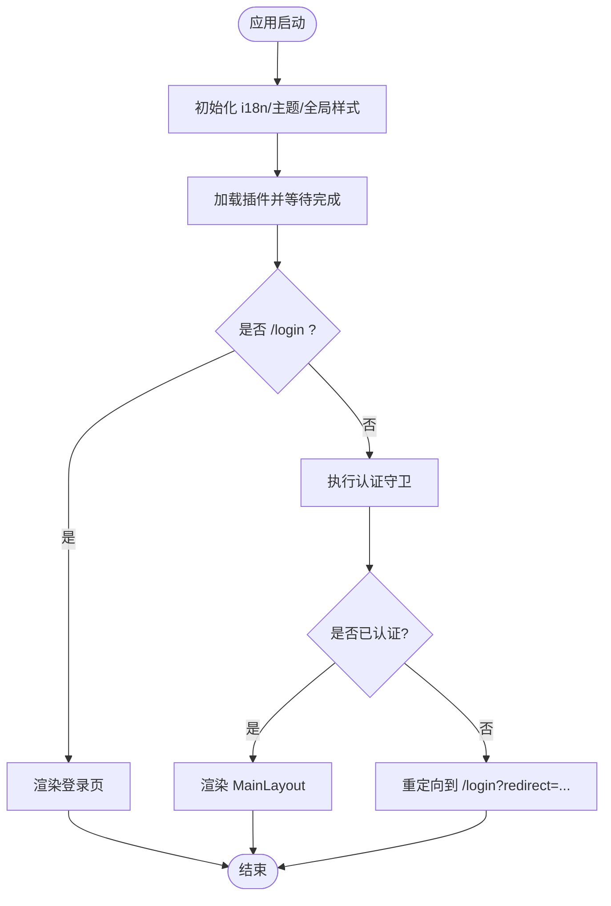
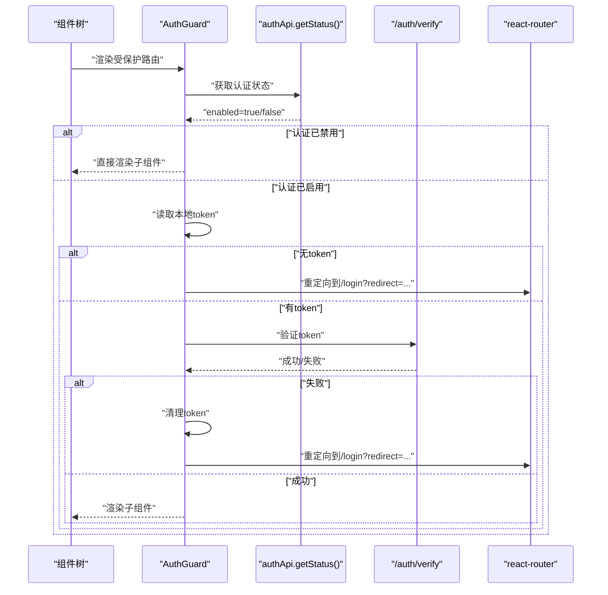
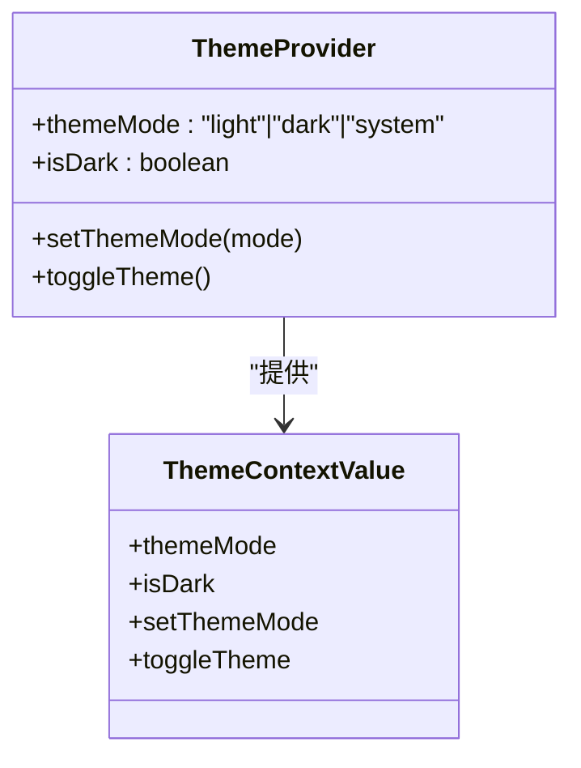
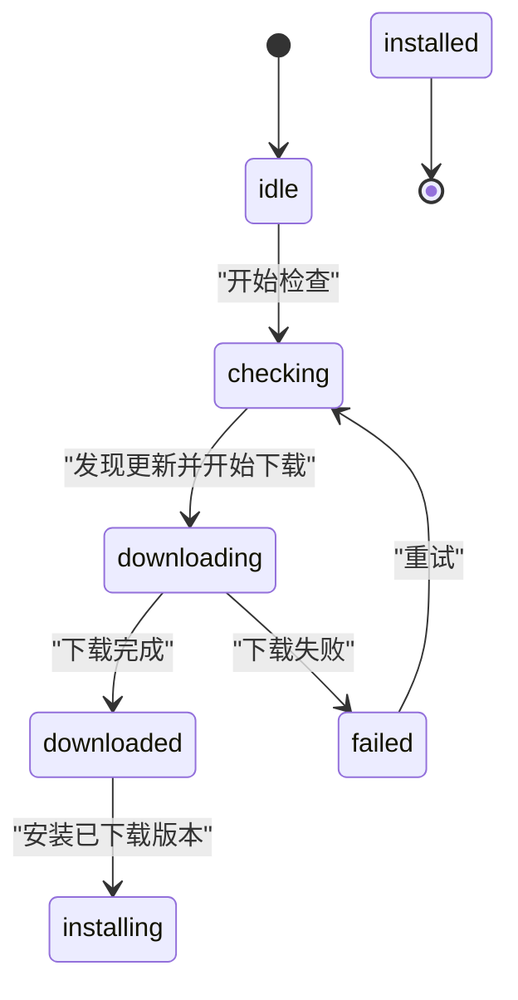
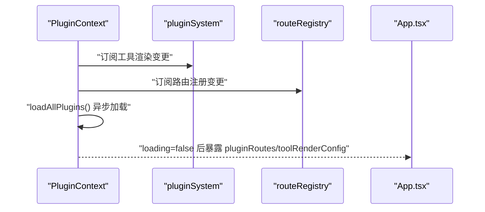
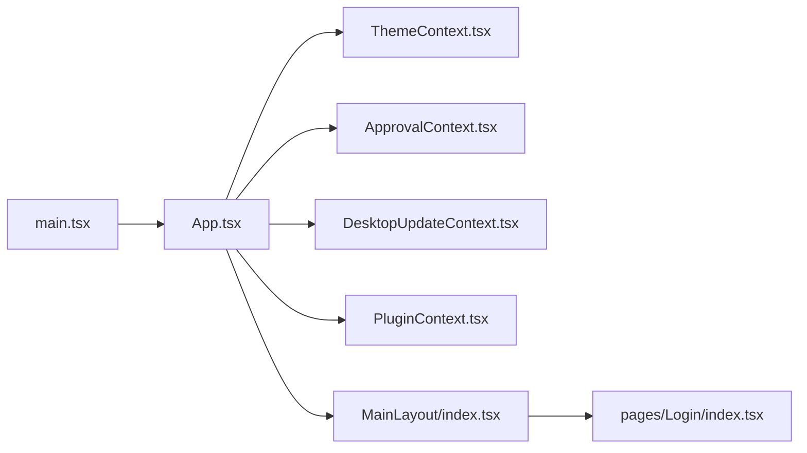

# React 应用架构

<cite>
**本文引用的文件**
- [console/src/App.tsx](file://console/src/App.tsx)
- [console/src/main.tsx](file://console/src/main.tsx)
- [console/src/i18n.ts](file://console/src/i18n.ts)
- [console/src/contexts/ThemeContext.tsx](file://console/src/contexts/ThemeContext.tsx)
- [console/src/contexts/ApprovalContext.tsx](file://console/src/contexts/ApprovalContext.tsx)
- [console/src/contexts/DesktopUpdateContext.tsx](file://console/src/contexts/DesktopUpdateContext.tsx)
- [console/src/plugins/PluginContext.tsx](file://console/src/plugins/PluginContext.tsx)
- [console/src/layouts/MainLayout/index.tsx](file://console/src/layouts/MainLayout/index.tsx)
- [console/src/pages/Login/index.tsx](file://console/src/pages/Login/index.tsx)
</cite>

## 目录
1. [简介](#简介)
2. [项目结构](#项目结构)
3. [核心组件](#核心组件)
4. [架构总览](#架构总览)
5. [详细组件分析](#详细组件分析)
6. [依赖关系分析](#依赖关系分析)
7. [性能考量](#性能考量)
8. [故障排查指南](#故障排查指南)
9. [结论](#结论)
10. [附录](#附录)

## 简介
本文件面向 QwenPaw 前端控制台（React）的架构与实现，聚焦以下目标：
- 整体架构设计、组件层次结构与路由配置
- 全局样式、主题配置、国际化设置与插件加载机制
- 认证守卫（AuthGuard）的实现原理
- Provider 模式的使用方式与懒加载策略
- 扩展方法：新增 Provider、集成第三方服务、接入插件能力
- 常见问题与解决方案，兼顾初学者与资深开发者

## 项目结构
控制台采用“入口初始化 + 根 App 装配 + 布局渲染 + 上下文/插件体系”的分层组织方式。关键路径如下：
- 入口初始化：main.tsx 负责宿主环境暴露、插件 SDK 安装、内置模块注册与根节点挂载
- 根应用：App.tsx 负责全局样式、主题、国际化、插件上下文、认证守卫、路由与 Provider 组合
- 布局：MainLayout 负责侧边栏、头部、内容区与动态路由渲染
- 上下文：ThemeContext、ApprovalContext、DesktopUpdateContext 提供跨层级共享状态
- 插件：PluginContext 订阅插件系统并暴露工具渲染与页面路由等能力
- 登录页：LoginPage 处理认证流程与首次用户引导

图表来源
- [console/src/main.tsx:1-58](file://console/src/main.tsx#L1-L58)
- [console/src/App.tsx:1-248](file://console/src/App.tsx#L1-L248)
- [console/src/layouts/MainLayout/index.tsx:1-80](file://console/src/layouts/MainLayout/index.tsx#L1-L80)
- [console/src/contexts/ThemeContext.tsx:1-105](file://console/src/contexts/ThemeContext.tsx#L1-L105)
- [console/src/contexts/ApprovalContext.tsx:1-30](file://console/src/contexts/ApprovalContext.tsx#L1-L30)
- [console/src/contexts/DesktopUpdateContext.tsx:1-258](file://console/src/contexts/DesktopUpdateContext.tsx#L1-L258)
- [console/src/plugins/PluginContext.tsx:1-122](file://console/src/plugins/PluginContext.tsx#L1-L122)
- [console/src/pages/Login/index.tsx:1-178](file://console/src/pages/Login/index.tsx#L1-L178)

章节来源
- [console/src/main.tsx:1-58](file://console/src/main.tsx#L1-L58)
- [console/src/App.tsx:1-248](file://console/src/App.tsx#L1-L248)
- [console/src/layouts/MainLayout/index.tsx:1-80](file://console/src/layouts/MainLayout/index.tsx#L1-L80)

## 核心组件
- 根应用装配（App.tsx）
  - 全局样式与 antd ConfigProvider 主题注入
  - 国际化语言包映射与 dayjs 本地化
  - 插件加载等待与路由渲染
  - 认证守卫包裹受保护路由
- 主题上下文（ThemeContext.tsx）
  - 支持 light/dark/system 三种模式，持久化到 localStorage
  - 监听系统主题变化，自动切换 isDark
- 审批上下文（ApprovalContext.tsx）
  - 集中管理待审批任务列表，供 UI 消费
- 桌面更新上下文（DesktopUpdateContext.tsx）
  - 检查远程/缓存更新、下载进度、安装与失败重试
  - 通过 Tauri 事件驱动更新状态机
- 插件上下文（PluginContext.tsx）
  - 订阅插件系统与注册表，暴露 toolRenderConfig 与 pluginRoutes
  - 在加载完成前阻止可能依赖插件的路由渲染
- 主布局（MainLayout/index.tsx）
  - 基于 useRoutes 动态渲染路由，结合 Suspense 与错误边界
  - 同步编码模式状态，计算选中菜单项

章节来源
- [console/src/App.tsx:1-248](file://console/src/App.tsx#L1-L248)
- [console/src/contexts/ThemeContext.tsx:1-105](file://console/src/contexts/ThemeContext.tsx#L1-L105)
- [console/src/contexts/ApprovalContext.tsx:1-30](file://console/src/contexts/ApprovalContext.tsx#L1-L30)
- [console/src/contexts/DesktopUpdateContext.tsx:1-258](file://console/src/contexts/DesktopUpdateContext.tsx#L1-L258)
- [console/src/plugins/PluginContext.tsx:1-122](file://console/src/plugins/PluginContext.tsx#L1-L122)
- [console/src/layouts/MainLayout/index.tsx:1-80](file://console/src/layouts/MainLayout/index.tsx#L1-L80)

## 架构总览
下图展示从入口到路由渲染的关键调用链与数据流向，包括插件与上下文的作用点。

图表来源
- [console/src/main.tsx:1-58](file://console/src/main.tsx#L1-L58)
- [console/src/App.tsx:1-248](file://console/src/App.tsx#L1-L248)
- [console/src/plugins/PluginContext.tsx:1-122](file://console/src/plugins/PluginContext.tsx#L1-L122)
- [console/src/layouts/MainLayout/index.tsx:1-80](file://console/src/layouts/MainLayout/index.tsx#L1-L80)

## 详细组件分析

### 全局装配与路由（App.tsx）
- 全局样式与主题
  - 使用 createGlobalStyle 重置基础样式
  - 通过 antd ConfigProvider 注入主题算法与品牌色
- 国际化
  - 初始化 i18n 资源，监听语言变化并联动 antd 与 dayjs 本地化
  - 首次进入时尝试从后端获取语言偏好并写入本地存储
- 插件加载
  - 使用 PluginProvider 包裹，等待插件加载完成后才渲染路由，避免补丁未就绪导致的路由缺失
- 认证守卫
  - 对非登录路由进行鉴权：若后端禁用则放行；否则校验 token 有效性，失败则跳转登录并携带 redirect
- 路由
  - /login 使用 Suspense 懒加载
  - /* 受 AuthGuard 保护，渲染 MainLayout

图表来源
- [console/src/App.tsx:1-248](file://console/src/App.tsx#L1-L248)

章节来源
- [console/src/App.tsx:1-248](file://console/src/App.tsx#L1-L248)

### 认证守卫（AuthGuard）
- 行为要点
  - 先查询后端认证开关状态，若关闭则直接放行
  - 若开启，则读取本地 token，必要时调用验证接口确认有效性
  - 失败或无 token 时清理本地令牌并重定向到登录页，附带原始路径
- 健壮性
  - 使用取消标记防止异步回调在卸载后更新状态
  - 网络异常时降级为需要认证，确保安全性

图表来源
- [console/src/App.tsx:67-122](file://console/src/App.tsx#L67-L122)

章节来源
- [console/src/App.tsx:67-122](file://console/src/App.tsx#L67-L122)

### 主题上下文（ThemeContext）
- 功能特性
  - 支持 light/dark/system 三种模式，默认 system
  - 将选择结果持久化到 localStorage
  - 监听系统主题变化，自动刷新 isDark
  - 向 DOM 根元素添加/移除 dark-mode 类，便于全局 CSS 变量覆盖
- 使用方式
  - 顶层 Provider 包裹应用
  - 任意子组件通过 useTheme 获取当前模式与切换方法

图表来源
- [console/src/contexts/ThemeContext.tsx:1-105](file://console/src/contexts/ThemeContext.tsx#L1-L105)

章节来源
- [console/src/contexts/ThemeContext.tsx:1-105](file://console/src/contexts/ThemeContext.tsx#L1-L105)

### 审批上下文（ApprovalContext）
- 职责
  - 维护 PendingApproval 列表，提供 setApprovals 更新方法
- 使用建议
  - 在需要显示审批流的页面中通过 useApprovalContext 消费
  - 注意在 Provider 之外使用会抛出错误，确保包裹正确

章节来源
- [console/src/contexts/ApprovalContext.tsx:1-30](file://console/src/contexts/ApprovalContext.tsx#L1-L30)

### 桌面更新上下文（DesktopUpdateContext）
- 能力概览
  - 启动时探测本地缓存更新与远程更新
  - 监听 Rust 端更新事件，驱动 phase 状态机（idle/checking/downloading/installing/downloaded/failed）
  - 提供立即安装、后台下载、安装已下载版本、重试与清除失败状态等方法
- 关键细节
  - 通过采样窗口计算下载吞吐率
  - 区分前台与后台更新，影响 UI 接管策略

图表来源
- [console/src/contexts/DesktopUpdateContext.tsx:1-258](file://console/src/contexts/DesktopUpdateContext.tsx#L1-L258)

章节来源
- [console/src/contexts/DesktopUpdateContext.tsx:1-258](file://console/src/contexts/DesktopUpdateContext.tsx#L1-L258)

### 插件上下文（PluginContext）
- 作用
  - 订阅插件系统与注册表变更，暴露工具渲染配置与插件路由
  - 在初始加载期间返回 loading=true，App 层据此延迟渲染受插件影响的路由
- 扩展点
  - 通过注册表新增页面路由与插槽，即可被 MainLayout 动态渲染
  - 通过工具渲染配置，扩展聊天卡片等 UI 行为

图表来源
- [console/src/plugins/PluginContext.tsx:1-122](file://console/src/plugins/PluginContext.tsx#L1-L122)
- [console/src/App.tsx:182-186](file://console/src/App.tsx#L182-L186)

章节来源
- [console/src/plugins/PluginContext.tsx:1-122](file://console/src/plugins/PluginContext.tsx#L1-L122)
- [console/src/App.tsx:182-186](file://console/src/App.tsx#L182-L186)

### 主布局与动态路由（MainLayout）
- 功能
  - 根据当前 URL 匹配选中菜单项
  - 使用 useRoutes 获取所有注册路由（含插件），动态渲染
  - 使用 Suspense 与 ChunkErrorBoundary 提升容错与用户体验
- 集成点
  - 与插件注册表协同，无需硬编码路由
  - 与编码模式同步 Hook 协作，保证状态一致性

章节来源
- [console/src/layouts/MainLayout/index.tsx:1-80](file://console/src/layouts/MainLayout/index.tsx#L1-L80)

### 登录页（LoginPage）
- 流程
  - 启动时查询认证状态，若未启用则直接跳转到聊天页
  - 若无用户则进入注册模式，否则进入登录模式
  - 成功后保存 token 并跳转到 redirect 或默认页
- 体验
  - 根据主题动态调整背景与卡片样式
  - 统一消息提示封装

章节来源
- [console/src/pages/Login/index.tsx:1-178](file://console/src/pages/Login/index.tsx#L1-L178)

## 依赖关系分析
- 入口依赖
  - main.tsx 负责宿主 SDK 与外部依赖暴露、内置卡片与模块预注册
- 根应用依赖
  - App.tsx 依赖主题、插件、国际化、路由与认证相关模块
- 布局依赖
  - MainLayout 依赖插件路由钩子与错误边界
- 上下文依赖
  - 各 Context 之间相互独立，通过 Provider 组合形成依赖树

图表来源
- [console/src/main.tsx:1-58](file://console/src/main.tsx#L1-L58)
- [console/src/App.tsx:1-248](file://console/src/App.tsx#L1-L248)
- [console/src/layouts/MainLayout/index.tsx:1-80](file://console/src/layouts/MainLayout/index.tsx#L1-L80)
- [console/src/pages/Login/index.tsx:1-178](file://console/src/pages/Login/index.tsx#L1-L178)

章节来源
- [console/src/main.tsx:1-58](file://console/src/main.tsx#L1-L58)
- [console/src/App.tsx:1-248](file://console/src/App.tsx#L1-L248)
- [console/src/layouts/MainLayout/index.tsx:1-80](file://console/src/layouts/MainLayout/index.tsx#L1-L80)
- [console/src/pages/Login/index.tsx:1-178](file://console/src/pages/Login/index.tsx#L1-L178)

## 性能考量
- 懒加载与重试
  - 登录页使用 lazyImportWithRetry 包装，降低首屏体积并具备重试能力
- 插件加载阻塞控制
  - 插件加载未完成时不渲染可能依赖插件的路由，避免二次渲染
- 国际化与时间库本地化
  - 仅在语言变化时更新 antd 与 dayjs 本地化，减少不必要的重渲染
- 主题切换
  - 通过 CSS 类切换 dark-mode，避免大范围样式重建
- 错误边界
  - 使用 ChunkErrorBoundary 隔离 chunk 加载失败，保障主流程可用

[本节为通用指导，不涉及具体文件分析]

## 故障排查指南
- 登录后仍被重定向到登录页
  - 检查本地 token 是否存在且有效，确认 /auth/verify 响应状态码
  - 关注认证开关 enabled 是否为 true
- 插件路由未生效
  - 确认 PluginProvider 已包裹应用根节点
  - 查看插件加载是否报错，检查 registry 订阅是否触发
- 主题未跟随系统变化
  - 确认 mode 设置为 system，且 matchMedia 事件未被移除
- 桌面更新无法安装
  - 检查 onUpdateEvent 回调是否收到错误阶段，确认后台下载是否成功
- 国际化未生效
  - 检查 i18n 资源是否包含目标语言，确认 languageChanged 事件是否触发

章节来源
- [console/src/App.tsx:67-122](file://console/src/App.tsx#L67-L122)
- [console/src/plugins/PluginContext.tsx:1-122](file://console/src/plugins/PluginContext.tsx#L1-L122)
- [console/src/contexts/ThemeContext.tsx:1-105](file://console/src/contexts/ThemeContext.tsx#L1-L105)
- [console/src/contexts/DesktopUpdateContext.tsx:1-258](file://console/src/contexts/DesktopUpdateContext.tsx#L1-L258)
- [console/src/i18n.ts:1-47](file://console/src/i18n.ts#L1-L47)

## 结论
QwenPaw 控制台以 Provider 模式为核心，围绕主题、插件、审批与桌面更新构建稳定的跨组件状态层；通过插件注册表与动态路由实现高度可扩展的前端架构。认证守卫与懒加载策略保障了安全与性能，配合错误边界与国际化体系，形成了可维护、易扩展的企业级控制台方案。

[本节为总结性内容，不涉及具体文件分析]

## 附录

### 如何扩展应用功能
- 新增 Provider
  - 在 contexts 目录下新建上下文文件，定义类型与 Provider
  - 在 App.tsx 中将新 Provider 包裹在根节点外层，确保子树可消费
  - 示例参考：[ThemeContext.tsx:1-105](file://console/src/contexts/ThemeContext.tsx#L1-L105)、[ApprovalContext.tsx:1-30](file://console/src/contexts/ApprovalContext.tsx#L1-L30)
- 集成第三方服务
  - 在 main.tsx 中安装宿主 SDK 与外部依赖暴露，类似 hostExternals 的安装方式
  - 示例参考：[main.tsx:13-23](file://console/src/main.tsx#L13-L23)
- 添加新路由
  - 通过插件注册表或布局中的 useRoutes 机制注册页面路由
  - 示例参考：[MainLayout/index.tsx:33-79](file://console/src/layouts/MainLayout/index.tsx#L33-L79)
- 自定义工具渲染
  - 通过插件上下文暴露的 toolRenderConfig 扩展聊天卡片渲染
  - 示例参考：[PluginContext.tsx:66-106](file://console/src/plugins/PluginContext.tsx#L66-L106)

章节来源
- [console/src/contexts/ThemeContext.tsx:1-105](file://console/src/contexts/ThemeContext.tsx#L1-L105)
- [console/src/contexts/ApprovalContext.tsx:1-30](file://console/src/contexts/ApprovalContext.tsx#L1-L30)
- [console/src/main.tsx:13-23](file://console/src/main.tsx#L13-L23)
- [console/src/layouts/MainLayout/index.tsx:33-79](file://console/src/layouts/MainLayout/index.tsx#L33-L79)
- [console/src/plugins/PluginContext.tsx:66-106](file://console/src/plugins/PluginContext.tsx#L66-L106)