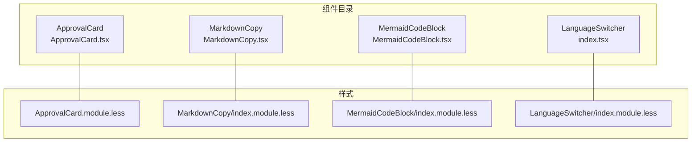
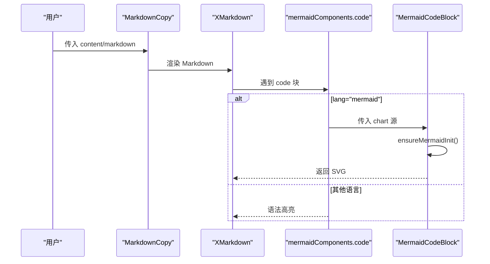
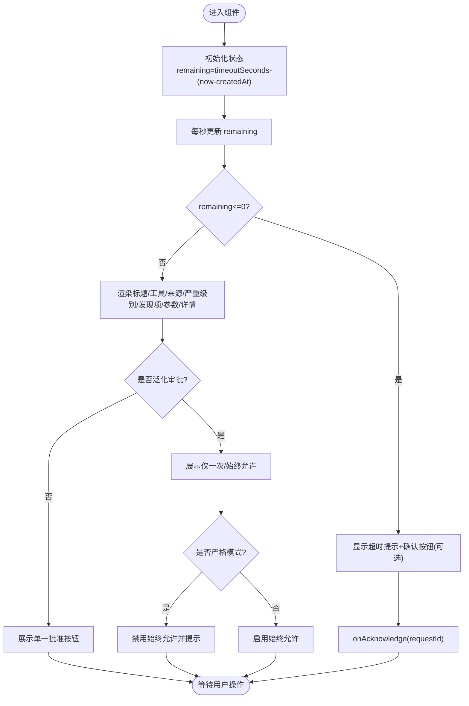
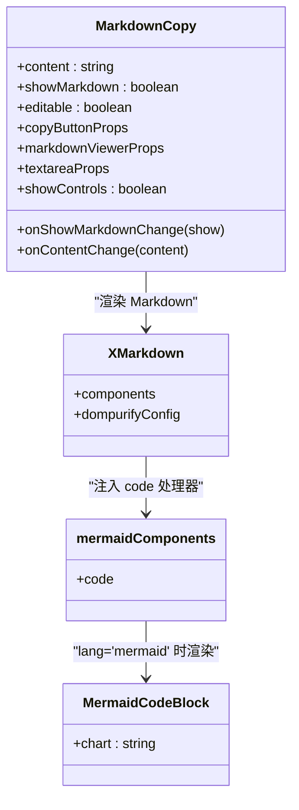
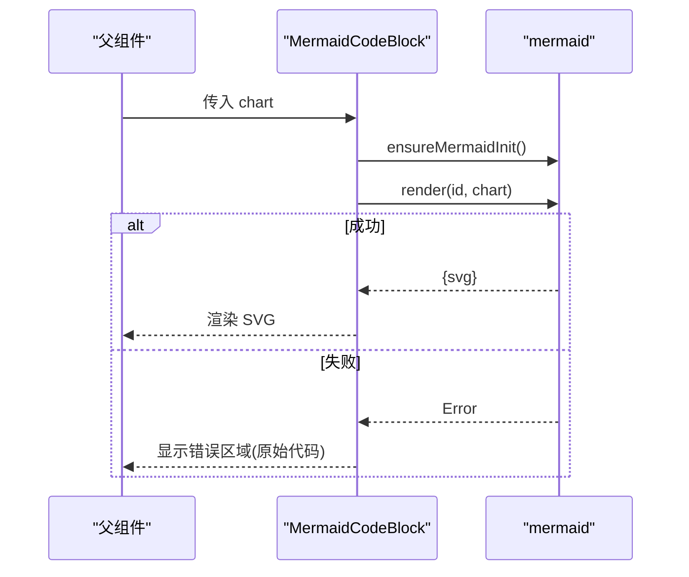
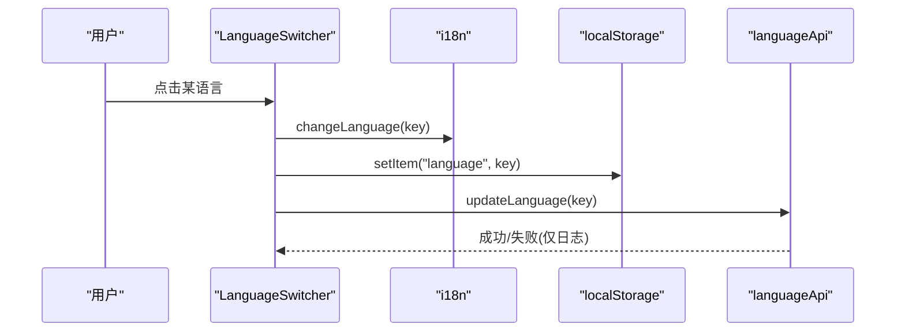
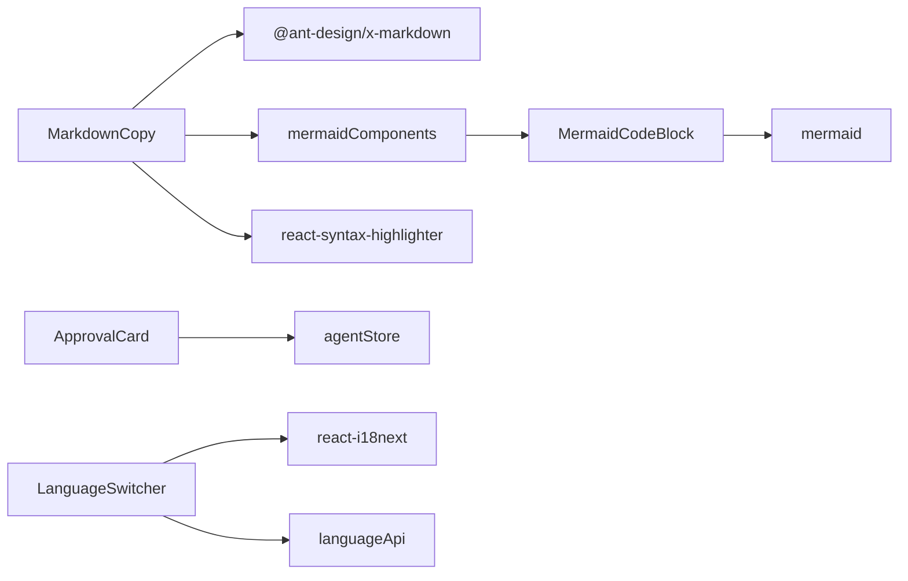

# UI 组件库

<cite>
**本文引用的文件**   
- [ApprovalCard.tsx](file://console/src/components/ApprovalCard/ApprovalCard.tsx)
- [ApprovalCard.module.less](file://console/src/components/ApprovalCard/ApprovalCard.module.less)
- [MarkdownCopy.tsx](file://console/src/components/MarkdownCopy/MarkdownCopy.tsx)
- [index.module.less（MarkdownCopy）](file://console/src/components/MarkdownCopy/index.module.less)
- [MermaidCodeBlock.tsx](file://console/src/components/MermaidCodeBlock/MermaidCodeBlock.tsx)
- [mermaidComponents.tsx](file://console/src/components/MermaidCodeBlock/mermaidComponents.tsx)
- [index.module.less（MermaidCodeBlock）](file://console/src/components/MermaidCodeBlock/index.module.less)
- [LanguageSwitcher/index.tsx](file://console/src/components/LanguageSwitcher/index.tsx)
</cite>

## 目录
1. [简介](#简介)
2. [项目结构](#项目结构)
3. [核心组件](#核心组件)
4. [架构总览](#架构总览)
5. [详细组件分析](#详细组件分析)
6. [依赖关系分析](#依赖关系分析)
7. [性能与可访问性](#性能与可访问性)
8. [主题与样式管理](#主题与样式管理)
9. [常见问题与排障](#常见问题与排障)
10. [结论](#结论)

## 简介
本文件面向 QwenPaw 前端控制台（console）中的 UI 组件库，聚焦以下四个核心自定义组件：
- ApprovalCard 审批卡片：用于安全策略审批的交互卡片，支持“仅一次”和“始终允许”两种范围、倒计时、跨会话上下文展示等。
- MarkdownCopy 代码复制：提供 Markdown 预览/源码切换、一键复制、可选编辑能力，并集成 Mermaid 图表渲染。
- MermaidCodeBlock 图表渲染：基于 mermaid 的异步渲染容器，具备错误回退与加载占位。
- LanguageSwitcher 语言切换器：下拉式多语言切换，持久化到本地存储并同步后端偏好。

文档将深入解析各组件的属性定义、事件处理、样式管理、可访问性支持、组合模式与主题定制，并提供实际代码路径以便快速定位实现细节。

## 项目结构
这些组件位于 console/src/components 下，采用“按功能分目录”的组织方式，每个组件包含：
- 组件逻辑（TSX）
- 模块级样式（Less）
- 可选导出入口（如 index.ts）

图示来源
- [ApprovalCard.tsx:1-422](file://console/src/components/ApprovalCard/ApprovalCard.tsx#L1-L422)
- [ApprovalCard.module.less:1-843](file://console/src/components/ApprovalCard/ApprovalCard.module.less#L1-L843)
- [MarkdownCopy.tsx:1-203](file://console/src/components/MarkdownCopy/MarkdownCopy.tsx#L1-L203)
- [index.module.less（MarkdownCopy）:1-131](file://console/src/components/MarkdownCopy/index.module.less#L1-L131)
- [MermaidCodeBlock.tsx:1-96](file://console/src/components/MermaidCodeBlock/MermaidCodeBlock.tsx#L1-L96)
- [index.module.less（MermaidCodeBlock）:1-51](file://console/src/components/MermaidCodeBlock/index.module.less#L1-L51)
- [LanguageSwitcher/index.tsx:1-70](file://console/src/components/LanguageSwitcher/index.tsx#L1-L70)

章节来源
- [ApprovalCard.tsx:1-422](file://console/src/components/ApprovalCard/ApprovalCard.tsx#L1-L422)
- [MarkdownCopy.tsx:1-203](file://console/src/components/MarkdownCopy/MarkdownCopy.tsx#L1-L203)
- [MermaidCodeBlock.tsx:1-96](file://console/src/components/MermaidCodeBlock/MermaidCodeBlock.tsx#L1-L96)
- [LanguageSwitcher/index.tsx:1-70](file://console/src/components/LanguageSwitcher/index.tsx#L1-L70)

## 核心组件
本节概述四大组件的职责与协作关系：
- ApprovalCard：封装审批决策流程，负责状态机（loading）、倒计时、参数与详情折叠展示、严格模式提示、跨会话信息展示。
- MarkdownCopy：统一 Markdown 内容呈现与复制体验，内置 XMarkdown 渲染与 Mermaid 扩展，支持预览/源码切换与可选编辑。
- MermaidCodeBlock：对 mermaid 进行轻量封装，保证初始化幂等、渲染失败回退为原始代码块、渲染中占位。
- LanguageSwitcher：通过 i18n 切换语言，持久化用户偏好并调用后端接口保存。

章节来源
- [ApprovalCard.tsx:1-422](file://console/src/components/ApprovalCard/ApprovalCard.tsx#L1-L422)
- [MarkdownCopy.tsx:1-203](file://console/src/components/MarkdownCopy/MarkdownCopy.tsx#L1-L203)
- [MermaidCodeBlock.tsx:1-96](file://console/src/components/MermaidCodeBlock/MermaidCodeBlock.tsx#L1-L96)
- [mermaidComponents.tsx:1-83](file://console/src/components/MermaidCodeBlock/mermaidComponents.tsx#L1-L83)
- [LanguageSwitcher/index.tsx:1-70](file://console/src/components/LanguageSwitcher/index.tsx#L1-L70)

## 架构总览
组件间的关键协作如下：
- MarkdownCopy 使用 XMarkdown 渲染 Markdown，并通过 mermaidComponents 注入自定义 code 处理器，从而在遇到 mermaid 代码块时交由 MermaidCodeBlock 渲染。
- MermaidCodeBlock 内部维护 mermaid 单例初始化与渲染生命周期，避免重复初始化与内存泄漏。
- ApprovalCard 独立于上述渲染链路，专注于审批交互与业务状态。
- LanguageSwitcher 通过 i18n 与后端 API 协同完成语言切换。

图示来源
- [MarkdownCopy.tsx:1-203](file://console/src/components/MarkdownCopy/MarkdownCopy.tsx#L1-L203)
- [mermaidComponents.tsx:1-83](file://console/src/components/MermaidCodeBlock/mermaidComponents.tsx#L1-L83)
- [MermaidCodeBlock.tsx:1-96](file://console/src/components/MermaidCodeBlock/MermaidCodeBlock.tsx#L1-L96)

## 详细组件分析

### ApprovalCard 审批卡片
- 设计要点
  - 属性契约：包含请求标识、工具名/来源、严重级别、发现项数量与摘要、超时时间、Agent 上下文、是否泛化审批、精确/相似目标、执行级别等；回调 onApprove/onDeny/onAcknowledge。
  - 状态机：loading 键值区分不同操作（approve-pattern/approve-exact/deny/acknowledge），防止重复提交。
  - 倒计时：根据 createdAt 与 timeoutSeconds 计算剩余时间，到达 0 后显示“已超时自动拒绝”，并可触发 onAcknowledge。
  - 跨会话上下文：当 sessionId 与 rootSessionId 存在且不一致时，展示“子会话”标签；若 showInboxAgentContext 开启，则额外展示“拥有者 Agent”和“执行 Agent”。
  - 泛化审批：isGeneralized 为真时，展示“仅一次”和“始终允许”两个按钮；executionLevel 为 STRICT 时禁用“始终允许”并给出 Tooltip 提示。
  - 参数与详情：toolParams 与 findingsSummary 以 details/summary 折叠面板展示，并提供一键复制。
  - 可访问性：语义化 HTML（details/summary）、Tooltip 辅助说明、键盘可操作的 Button。
- 样式与主题
  - 使用 Less 模块化样式，覆盖 antd Card 内边距、按钮尺寸与圆角、深色模式适配等。
  - 动画：入场 fadeInSlideUp、退出 fadeOutSlideDown，提升交互反馈。
- 关键实现路径
  - 属性与类型定义：[ApprovalCard.tsx:12-37](file://console/src/components/ApprovalCard/ApprovalCard.tsx#L12-L37)
  - 倒计时与超时处理：[ApprovalCard.tsx:108-124](file://console/src/components/ApprovalCard/ApprovalCard.tsx#L108-L124)
  - 审批动作与 loading 控制：[ApprovalCard.tsx:126-163](file://console/src/components/ApprovalCard/ApprovalCard.tsx#L126-L163)
  - 严格模式与泛化范围展示：[ApprovalCard.tsx:260-293](file://console/src/components/ApprovalCard/ApprovalCard.tsx#L260-L293)
  - 超时态与确认按钮：[ApprovalCard.tsx:342-357](file://console/src/components/ApprovalCard/ApprovalCard.tsx#L342-L357)
  - 样式与深色模式：[ApprovalCard.module.less:1-843](file://console/src/components/ApprovalCard/ApprovalCard.module.less#L1-L843)

图示来源
- [ApprovalCard.tsx:108-124](file://console/src/components/ApprovalCard/ApprovalCard.tsx#L108-L124)
- [ApprovalCard.tsx:260-293](file://console/src/components/ApprovalCard/ApprovalCard.tsx#L260-L293)
- [ApprovalCard.tsx:342-357](file://console/src/components/ApprovalCard/ApprovalCard.tsx#L342-L357)

章节来源
- [ApprovalCard.tsx:1-422](file://console/src/components/ApprovalCard/ApprovalCard.tsx#L1-L422)
- [ApprovalCard.module.less:1-843](file://console/src/components/ApprovalCard/ApprovalCard.module.less#L1-L843)

### MarkdownCopy 代码复制
- 设计要点
  - 双视图：预览（XMarkdown）与源码（TextArea）切换，受 showControls/editable/disabled 控制。
  - 复制逻辑：优先 navigator.clipboard，在非安全上下文降级到 textarea.execCommand("copy")，统一消息提示。
  - 内容预处理：stripFrontmatter 去除 YAML frontmatter，避免干扰渲染。
  - 可编辑模式：editable 为真时默认切换到源码视图，支持 onContentChange 回调。
  - 与 Mermaid 集成：通过 mermaidComponents 注入，使 XMarkdown 识别 mermaid 代码块并渲染为图表。
- 关键实现路径
  - 属性与默认值合并：[MarkdownCopy.tsx:12-55](file://console/src/components/MarkdownCopy/MarkdownCopy.tsx#L12-L55)
  - 复制兼容与消息提示：[MarkdownCopy.tsx:78-112](file://console/src/components/MarkdownCopy/MarkdownCopy.tsx#L78-L112)
  - 预览/源码切换与 editable 联动：[MarkdownCopy.tsx:66-76](file://console/src/components/MarkdownCopy/MarkdownCopy.tsx#L66-L76)
  - 注入 mermaid 组件：[MarkdownCopy.tsx:177-187](file://console/src/components/MarkdownCopy/MarkdownCopy.tsx#L177-L187)
  - 样式布局与表格/代码块样式：[index.module.less（MarkdownCopy）:1-131](file://console/src/components/MarkdownCopy/index.module.less#L1-L131)

图示来源
- [MarkdownCopy.tsx:1-203](file://console/src/components/MarkdownCopy/MarkdownCopy.tsx#L1-L203)
- [mermaidComponents.tsx:1-83](file://console/src/components/MermaidCodeBlock/mermaidComponents.tsx#L1-L83)
- [MermaidCodeBlock.tsx:1-96](file://console/src/components/MermaidCodeBlock/MermaidCodeBlock.tsx#L1-L96)

章节来源
- [MarkdownCopy.tsx:1-203](file://console/src/components/MarkdownCopy/MarkdownCopy.tsx#L1-L203)
- [index.module.less（MarkdownCopy）:1-131](file://console/src/components/MarkdownCopy/index.module.less#L1-L131)

### MermaidCodeBlock 图表渲染
- 设计要点
  - 单例初始化：ensureMermaidInit 保证 mermaid 只初始化一次，配置 theme/securityLevel/startOnLoad=false。
  - 渲染生命周期：每次 chart 变化生成唯一 id，render 成功后设置 svg，失败则记录 error 并清理 DOM。
  - 错误回退：error 状态下直接以 pre/code 形式展示原始 mermaid 源码，便于调试。
  - 加载占位：渲染期间显示 placeholder，避免布局抖动。
- 关键实现路径
  - 初始化与渲染：[MermaidCodeBlock.tsx:8-16](file://console/src/components/MermaidCodeBlock/MermaidCodeBlock.tsx#L8-L16)、[MermaidCodeBlock.tsx:28-66](file://console/src/components/MermaidCodeBlock/MermaidCodeBlock.tsx#L28-L66)
  - 错误与占位渲染：[MermaidCodeBlock.tsx:68-95](file://console/src/components/MermaidCodeBlock/MermaidCodeBlock.tsx#L68-L95)
  - 样式与响应式：[index.module.less（MermaidCodeBlock）:1-51](file://console/src/components/MermaidCodeBlock/index.module.less#L1-L51)

图示来源
- [MermaidCodeBlock.tsx:1-96](file://console/src/components/MermaidCodeBlock/MermaidCodeBlock.tsx#L1-L96)

章节来源
- [MermaidCodeBlock.tsx:1-96](file://console/src/components/MermaidCodeBlock/MermaidCodeBlock.tsx#L1-L96)
- [index.module.less（MermaidCodeBlock）:1-51](file://console/src/components/MermaidCodeBlock/index.module.less#L1-L51)

### LanguageSwitcher 语言切换器
- 设计要点
  - 语言列表：LANGUAGE_LIST 声明支持的 key/label/icon，当前语言从 i18n.resolvedLanguage 推导。
  - 切换流程：i18n.changeLanguage(lang) → localStorage.setItem("language", lang) → 调用 languageApi.updateLanguage(lang)。
  - 下拉菜单：使用 Dropdown 渲染选项，selectedKeys 高亮当前语言。
- 关键实现路径
  - 语言列表与选择：[LanguageSwitcher/index.tsx:20-28](file://console/src/components/LanguageSwitcher/index.tsx#L20-L28)
  - 切换与持久化：[LanguageSwitcher/index.tsx:40-48](file://console/src/components/LanguageSwitcher/index.tsx#L40-L48)
  - 下拉菜单渲染：[LanguageSwitcher/index.tsx:50-69](file://console/src/components/LanguageSwitcher/index.tsx#L50-L69)

图示来源
- [LanguageSwitcher/index.tsx:1-70](file://console/src/components/LanguageSwitcher/index.tsx#L1-L70)

章节来源
- [LanguageSwitcher/index.tsx:1-70](file://console/src/components/LanguageSwitcher/index.tsx#L1-L70)

## 依赖关系分析
- 外部依赖
  - antd / @agentscope-ai/design：UI 基础组件（Button/Card/Dropdown/Switch/Input 等）。
  - react-i18next：国际化能力。
  - @ant-design/x-markdown：Markdown 渲染。
  - react-syntax-highlighter：非 mermaid 的代码块高亮。
  - mermaid：流程图/时序图等可视化渲染。
- 内部依赖
  - MarkdownCopy 依赖 mermaidComponents 与 MermaidCodeBlock。
  - ApprovalCard 依赖 agentStore 与 i18n。
  - LanguageSwitcher 依赖 i18n 与 languageApi。

图示来源
- [MarkdownCopy.tsx:1-203](file://console/src/components/MarkdownCopy/MarkdownCopy.tsx#L1-L203)
- [mermaidComponents.tsx:1-83](file://console/src/components/MermaidCodeBlock/mermaidComponents.tsx#L1-L83)
- [MermaidCodeBlock.tsx:1-96](file://console/src/components/MermaidCodeBlock/MermaidCodeBlock.tsx#L1-L96)
- [ApprovalCard.tsx:1-422](file://console/src/components/ApprovalCard/ApprovalCard.tsx#L1-L422)
- [LanguageSwitcher/index.tsx:1-70](file://console/src/components/LanguageSwitcher/index.tsx#L1-L70)

章节来源
- [MarkdownCopy.tsx:1-203](file://console/src/components/MarkdownCopy/MarkdownCopy.tsx#L1-L203)
- [mermaidComponents.tsx:1-83](file://console/src/components/MermaidCodeBlock/mermaidComponents.tsx#L1-L83)
- [MermaidCodeBlock.tsx:1-96](file://console/src/components/MermaidCodeBlock/MermaidCodeBlock.tsx#L1-L96)
- [ApprovalCard.tsx:1-422](file://console/src/components/ApprovalCard/ApprovalCard.tsx#L1-L422)
- [LanguageSwitcher/index.tsx:1-70](file://console/src/components/LanguageSwitcher/index.tsx#L1-L70)

## 性能与可访问性
- 性能优化建议
  - Mermaid 渲染：仅在需要时初始化，避免重复 render；大量图表场景考虑懒加载或虚拟滚动。
  - 复制操作：navigator.clipboard 优先，失败时降级方案需确保及时移除临时元素，避免内存占用。
  - 倒计时：ApprovalCard 使用 setInterval 每秒更新，建议在组件卸载时清理定时器（已实现）。
- 可访问性
  - 语义化标签：details/summary 提供原生折叠交互；Tooltip 提供辅助文本。
  - 键盘可达：所有交互点均为 Button/Dropdown，天然支持键盘操作。
  - 颜色对比：深色模式下样式已做适配，注意保持足够的对比度。

章节来源
- [ApprovalCard.tsx:108-124](file://console/src/components/ApprovalCard/ApprovalCard.tsx#L108-L124)
- [MarkdownCopy.tsx:78-112](file://console/src/components/MarkdownCopy/MarkdownCopy.tsx#L78-L112)
- [MermaidCodeBlock.tsx:28-66](file://console/src/components/MermaidCodeBlock/MermaidCodeBlock.tsx#L28-L66)

## 主题与样式管理
- 模块化样式
  - 每个组件使用 .module.less 隔离样式，避免全局污染。
  - 通过 :global(.dark-mode) 覆盖深色模式下的颜色与边框，保持一致体验。
- 主题定制
  - 通过 CSS 变量与 antd 主题体系结合，必要时可在上层注入主题 Provider。
  - 组件内样式尽量使用语义化类名，减少与第三方库的直接耦合。
- 响应式设计
  - 针对小屏设备调整圆角、间距与字体大小，确保可读性与触控友好。

章节来源
- [ApprovalCard.module.less:1-843](file://console/src/components/ApprovalCard/ApprovalCard.module.less#L1-L843)
- [index.module.less（MarkdownCopy）:1-131](file://console/src/components/MarkdownCopy/index.module.less#L1-L131)
- [index.module.less（MermaidCodeBlock）:1-51](file://console/src/components/MermaidCodeBlock/index.module.less#L1-L51)

## 常见问题与排障
- 样式冲突
  - 现象：antd 组件样式被覆盖导致视觉异常。
  - 排查：检查 Less 中 :global 选择器作用域，确认未被更高层级覆盖。
  - 解决：限定作用域或使用 CSS Modules 命名空间。
- 复制失败
  - 现象：在非 HTTPS 环境复制失败。
  - 排查：确认 window.isSecureContext 与 navigator.clipboard 可用性。
  - 解决：使用 textarea.execCommand("copy") 降级方案（已实现）。
- Mermaid 渲染报错
  - 现象：图表无法渲染，显示空白或错误。
  - 排查：查看 MermaidCodeBlock 的错误分支，确认 chart 语法正确。
  - 解决：修正 mermaid 语法；必要时在错误区直接查看源码定位问题。
- 语言切换未生效
  - 现象：切换语言后界面未刷新。
  - 排查：确认 i18n.changeLanguage 是否被调用，localStorage 是否写入。
  - 解决：检查路由/页面是否监听语言变化并重新渲染。

章节来源
- [MarkdownCopy.tsx:78-112](file://console/src/components/MarkdownCopy/MarkdownCopy.tsx#L78-L112)
- [MermaidCodeBlock.tsx:68-95](file://console/src/components/MermaidCodeBlock/MermaidCodeBlock.tsx#L68-L95)
- [LanguageSwitcher/index.tsx:40-48](file://console/src/components/LanguageSwitcher/index.tsx#L40-L48)

## 结论
QwenPaw 的前端 UI 组件库围绕“可复用、可组合、可定制”的原则构建。ApprovalCard 提供了完整的审批交互闭环；MarkdownCopy 统一了 Markdown 内容与复制体验，并通过 mermaidComponents 无缝集成图表渲染；MermaidCodeBlock 保证了图表渲染的健壮性与可观测性；LanguageSwitcher 实现了跨端一致的语言切换与偏好持久化。通过模块化样式与深色模式适配，组件具备良好的主题扩展能力与可访问性支持。建议在实际项目中遵循现有模式，按需组合与扩展，以获得一致的交互与视觉体验。