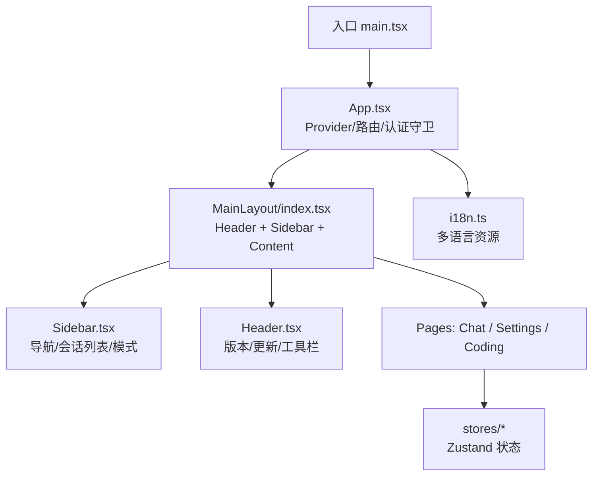
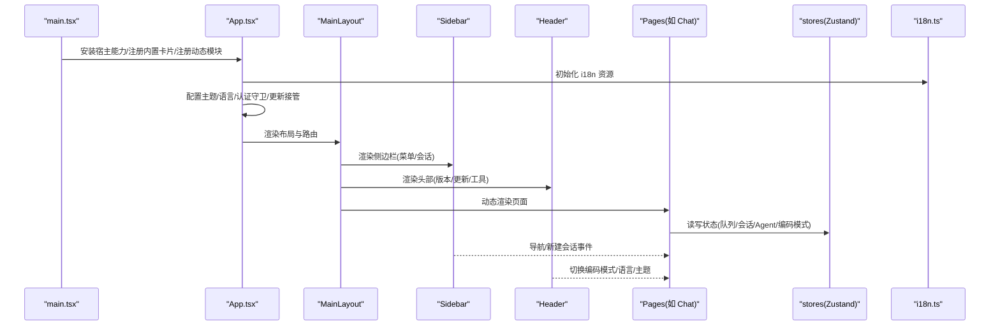
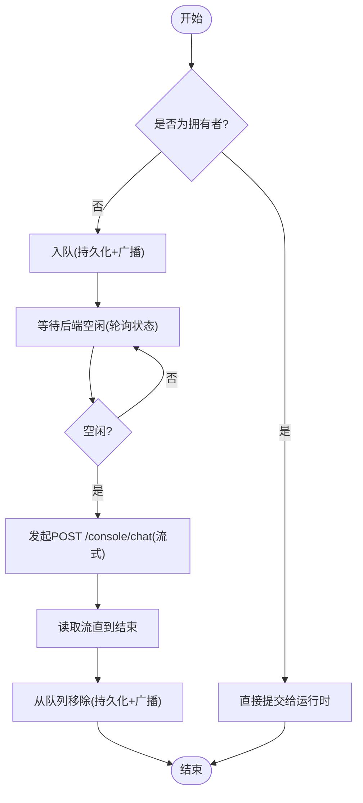
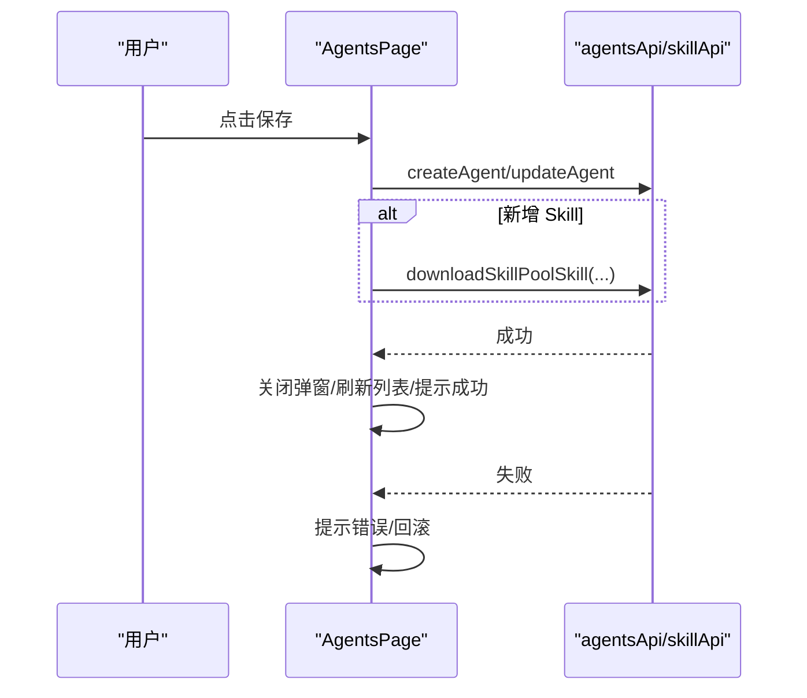
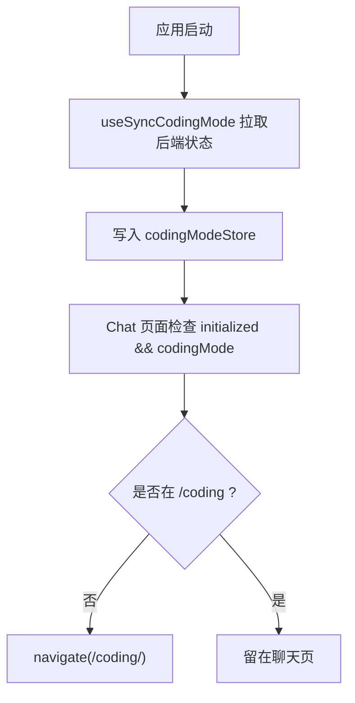
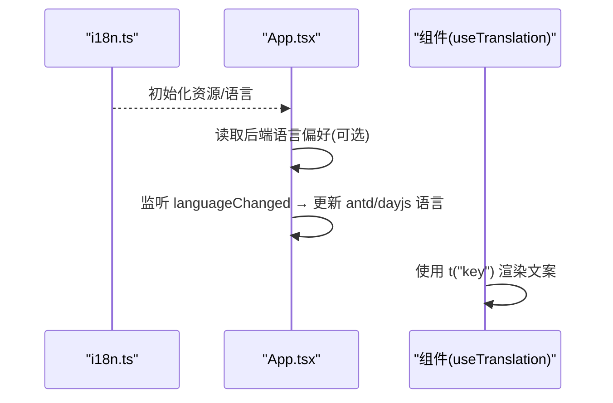
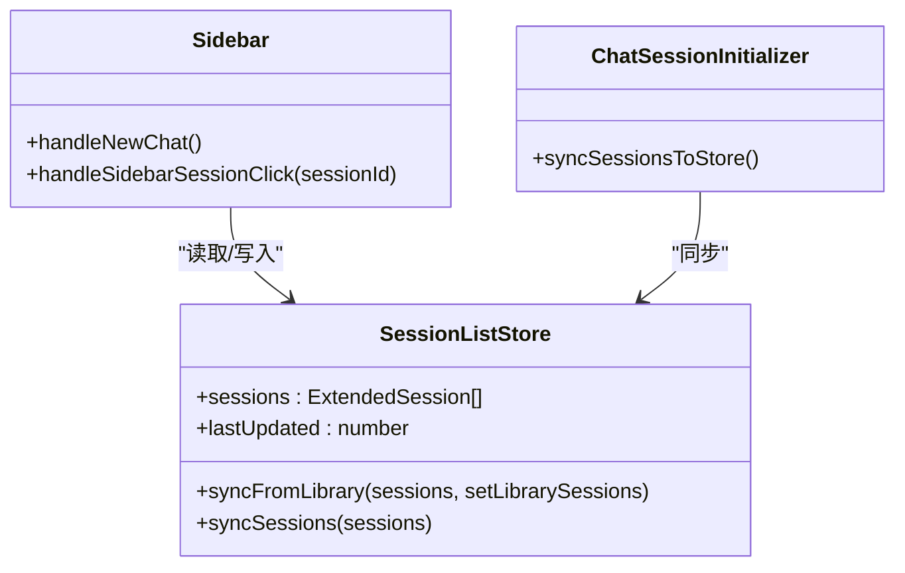
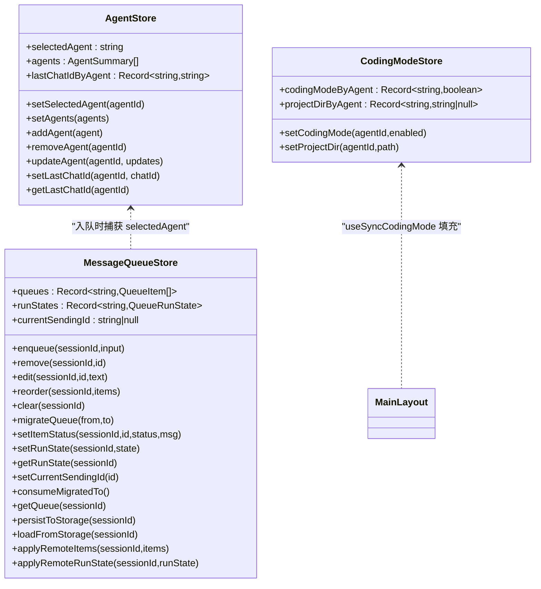
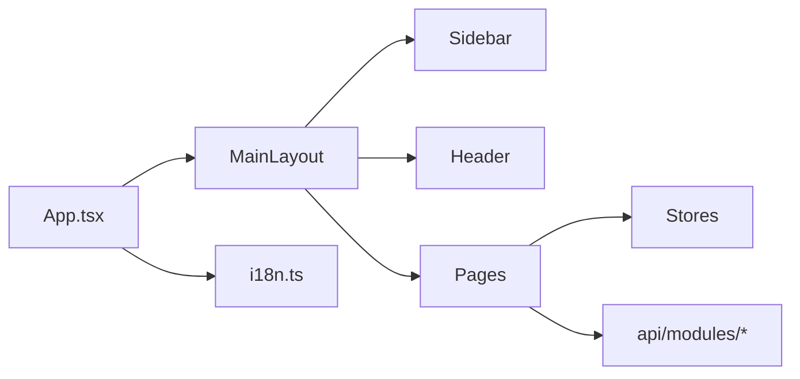

# 前端控制台

<cite>
**本文引用的文件**   
- [console/src/App.tsx](file://console/src/App.tsx)
- [console/src/main.tsx](file://console/src/main.tsx)
- [console/src/i18n.ts](file://console/src/i18n.ts)
- [console/src/layouts/MainLayout/index.tsx](file://console/src/layouts/MainLayout/index.tsx)
- [console/src/layouts/Sidebar.tsx](file://console/src/layouts/Sidebar.tsx)
- [console/src/layouts/Header.tsx](file://console/src/layouts/Header.tsx)
- [console/src/pages/Chat/index.tsx](file://console/src/pages/Chat/index.tsx)
- [console/src/stores/messageQueueStore.ts](file://console/src/stores/messageQueueStore.ts)
- [console/src/stores/sessionListStore.ts](file://console/src/stores/sessionListStore.ts)
- [console/src/stores/agentStore.ts](file://console/src/stores/agentStore.ts)
- [console/src/stores/codingModeStore.ts](file://console/src/stores/codingModeStore.ts)
- [console/src/stores/useSyncCodingMode.ts](file://console/src/stores/useSyncCodingMode.ts)
- [console/src/pages/Settings/Agents/index.tsx](file://console/src/pages/Settings/Agents/index.tsx)
</cite>

## 目录
1. [简介](#简介)
2. [项目结构](#项目结构)
3. [核心组件](#核心组件)
4. [架构总览](#架构总览)
5. [详细组件分析](#详细组件分析)
6. [依赖关系分析](#依赖关系分析)
7. [性能考量](#性能考量)
8. [故障排查指南](#故障排查指南)
9. [结论](#结论)
10. [附录](#附录)

## 简介
本文件面向 QwenPaw 前端控制台，系统性梳理 React 应用架构、组件设计模式、状态管理方案与国际化支持。重点覆盖聊天界面、设置面板、Agent 管理与编码模式等核心功能模块，提供调用关系、接口契约、领域模型和使用模式的深入说明，并给出常见问题与解决方案。文档既适合初学者快速上手，也为有经验的开发者提供足够的技术深度。

## 项目结构
控制台采用“布局 + 页面 + 组件 + 状态存储 + 插件注册”的分层组织方式：
- 入口与全局配置：main.tsx 负责宿主能力注入、内置卡片注册、路由与菜单的副作用式注册；App.tsx 负责主题、语言、认证守卫、更新接管、Provider 装配与路由根节点。
- 布局层：MainLayout 承载 Header、Sidebar 与内容区，动态渲染由插件系统注册的 Routes；Sidebar 提供导航、会话列表与简单/完整模式切换；Header 提供版本信息、更新提示、语言/主题/编码模式切换等。
- 页面层：Chat 为聊天主页面（集成 AgentScope Runtime Web UI），Settings/Agents 为 Agent 管理页，Coding 为编码模式页面。
- 状态层：Zustand 驱动的 stores（消息队列、会话列表、Agent 选择、编码模式）；useSyncCodingMode 同步后端编码模式状态。
- 国际化：i18n.ts 初始化 i18next 资源，App.tsx 将 antd/locale 与 dayjs/locale 联动到当前语言。

图示来源
- [console/src/main.tsx:1-31](file://console/src/main.tsx#L1-L31)
- [console/src/App.tsx:128-248](file://console/src/App.tsx#L128-L248)
- [console/src/layouts/MainLayout/index.tsx:33-79](file://console/src/layouts/MainLayout/index.tsx#L33-L79)
- [console/src/layouts/Sidebar.tsx:110-166](file://console/src/layouts/Sidebar.tsx#L110-L166)
- [console/src/layouts/Header.tsx:84-128](file://console/src/layouts/Header.tsx#L84-L128)
- [console/src/i18n.ts:35-46](file://console/src/i18n.ts#L35-L46)

章节来源
- [console/src/main.tsx:1-31](file://console/src/main.tsx#L1-L31)
- [console/src/App.tsx:128-248](file://console/src/App.tsx#L128-L248)
- [console/src/layouts/MainLayout/index.tsx:33-79](file://console/src/layouts/MainLayout/index.tsx#L33-L79)
- [console/src/i18n.ts:35-46](file://console/src/i18n.ts#L35-L46)

## 核心组件
- App 根组件
  - 职责：安装主题、语言、认证守卫、桌面更新接管、路由挂载；根据 basename 适配部署路径；在 Tauri 下禁用默认右键菜单。
  - 关键点：使用 ConfigProvider 注入主题与 antd locale；根据 i18n 变化同步 antd/dayjs 语言；Suspense 懒加载登录页；所有受保护路由包裹 AuthGuard。
- MainLayout
  - 职责：顶部 Header、左侧 Sidebar、右侧内容区；基于 useRoutes 动态渲染路由；错误边界与加载态；状态栏与全局覆盖层插槽。
  - 关键点：根据当前路径匹配选中菜单项；编码模式状态通过 useSyncCodingMode 同步。
- Sidebar
  - 职责：Agent 选择器、导航菜单、会话列表、账户信息与退出；支持简单/完整模式；移动端自适应；未读消息角标轮询。
  - 关键点：菜单数据来自插件注册；simple 模式下仅展示白名单项；预取会话列表以加速展开；构建 chatPath 时考虑编码模式。
- Header
  - 职责：Logo 点击隐藏手势（Tauri 打开 DevTools）、版本与更新提示、外部资源链接、编码模式开关、语言/主题切换。
  - 关键点：Web 环境从 PyPI 拉取最新版本对比；桌面端走 DesktopUpdateContext；Markdown 更新日志弹窗。
- Chat 页面
  - 职责：集成 @agentscope-ai/chat 运行时；会话创建/切换、输入历史、附件上传、技能快捷命令、审批卡片、消息队列后台发送、多模态能力检测。
  - 关键点：跨标签页发送所有权（Web Locks）；后台队列持久化与广播；IME 组合防误触；粘贴编辑器上下文格式化；Approval 流程。
- Settings/Agents
  - 职责：Agent 列表、创建/编辑/删除/启用/排序；关联 Skill 下载；表单校验与错误提示。
  - 关键点：保存时按新增 skill 逐个下载；重排后乐观更新再回滚失败；语言跟随当前 i18n。

章节来源
- [console/src/App.tsx:67-122](file://console/src/App.tsx#L67-L122)
- [console/src/App.tsx:128-248](file://console/src/App.tsx#L128-L248)
- [console/src/layouts/MainLayout/index.tsx:33-79](file://console/src/layouts/MainLayout/index.tsx#L33-L79)
- [console/src/layouts/Sidebar.tsx:110-166](file://console/src/layouts/Sidebar.tsx#L110-L166)
- [console/src/layouts/Header.tsx:84-128](file://console/src/layouts/Header.tsx#L84-L128)
- [console/src/pages/Chat/index.tsx:1079-1123](file://console/src/pages/Chat/index.tsx#L1079-L1123)
- [console/src/pages/Settings/Agents/index.tsx:16-150](file://console/src/pages/Settings/Agents/index.tsx#L16-L150)

## 架构总览
整体采用“Provider 装配 + 插件注册 + 路由驱动 + Zustand 状态 + 跨标签广播”的架构。

图示来源
- [console/src/main.tsx:1-31](file://console/src/main.tsx#L1-L31)
- [console/src/App.tsx:128-248](file://console/src/App.tsx#L128-L248)
- [console/src/layouts/MainLayout/index.tsx:33-79](file://console/src/layouts/MainLayout/index.tsx#L33-L79)
- [console/src/i18n.ts:35-46](file://console/src/i18n.ts#L35-L46)

## 详细组件分析

### 聊天界面（Chat）
- 关键能力
  - 会话生命周期：新建/切换/路径解析；编码模式激活时自动跳转到 /coding。
  - 输入体验：IME 组合键处理、上下箭头历史回溯、Tab 补全命令、草稿持久化、粘贴编辑器上下文格式转换。
  - 多模态能力：根据当前 Provider/Model 动态获取是否支持图片/视频。
  - 审批流：从 ApprovalContext 过滤当前会话请求，支持批准/拒绝并带动画。
  - 消息队列：跨标签页发送所有权（Web Locks）、后台发送循环、持久化与广播、暂停/错误状态。
- 调用关系
  - 用户输入 → 队列入队（非拥有者）或提交（拥有者）→ 等待空闲 → fetch 流式发送 → 完成移除。
  - 会话切换 → 迁移队列 → 重新加载 → 自动发送下一项。
- 数据结构
  - QueueItem：包含文本、附件、引用、@提及、截图、AgentId、后端 session_id、状态、重试计数、时间戳等。
  - 运行状态：per-session runState（idle/running/paused/error）。
- 接口与返回值
  - 队列操作：enqueue/remove/edit/reorder/clear/migrateQueue/setItemStatus/setRunState/getRunState/currentSendingId/consumeMigratedTo/getQueue/persistToStorage/loadFromStorage/applyRemoteItems/applyRemoteRunState。
  - 跨标签广播：BroadcastChannel 消息类型包括 enqueue/remove/edit/reorder/clear/setItemStatus/migrate/runState。
  - 发送锁：withSendLock 保证同一会话只有一个标签主动发送；holdOwnershipLock 决定“拥有者”。

图示来源
- [console/src/pages/Chat/index.tsx:124-396](file://console/src/pages/Chat/index.tsx#L124-L396)
- [console/src/stores/messageQueueStore.ts:340-590](file://console/src/stores/messageQueueStore.ts#L340-L590)

章节来源
- [console/src/pages/Chat/index.tsx:1079-1123](file://console/src/pages/Chat/index.tsx#L1079-L1123)
- [console/src/pages/Chat/index.tsx:124-396](file://console/src/pages/Chat/index.tsx#L124-L396)
- [console/src/stores/messageQueueStore.ts:340-590](file://console/src/stores/messageQueueStore.ts#L340-L590)

### 设置面板（Agent 管理）
- 关键能力
  - 列表展示、创建/编辑/删除/启用/排序。
  - 表单字段：workspace_dir、active_model_provider/model、skill_names 等。
  - Skill 下载：新增 skill 时逐个下载至目标 agent workspace。
  - 乐观更新：重排先本地更新，成功后确认，失败则回滚。
- 调用关系
  - 创建/更新 → agentsApi → 成功刷新列表；失败显示错误消息。
  - 删除/禁用 → 若当前选中被影响，回退到 default。
- 数据结构
  - AgentSummary：用于表格展示与表单回填。
- 接口与返回值
  - agentsApi.getAgent/updateAgent/createAgent/reorderAgents/toggleAgent/deleteAgent。
  - skillApi.downloadSkillPoolSkill(skill_name, targets)。

图示来源
- [console/src/pages/Settings/Agents/index.tsx:92-150](file://console/src/pages/Settings/Agents/index.tsx#L92-L150)

章节来源
- [console/src/pages/Settings/Agents/index.tsx:16-150](file://console/src/pages/Settings/Agents/index.tsx#L16-L150)

### 编码模式（Coding Mode）
- 关键能力
  - 状态来源：后端 agent.json，通过 useSyncCodingMode 同步到 codingModeStore。
  - 行为：当编码模式开启且不在 /coding 路径时，自动重定向到对应会话的编码页面。
  - 项目目录：projectDirByAgent 记录每个 Agent 的项目目录（undefined/null/string）。
- 调用关系
  - MainLayout 挂载 useSyncCodingMode → 读取后端状态 → 填充 store。
  - Chat 页面监听 initialized 与 codingMode → 触发导航。
- 数据结构
  - codingModeByAgent: Record<string, boolean>
  - projectDirByAgent: Record<string, string | null>

图示来源
- [console/src/stores/useSyncCodingMode.ts:15-45](file://console/src/stores/useSyncCodingMode.ts#L15-L45)
- [console/src/stores/codingModeStore.ts:26-79](file://console/src/stores/codingModeStore.ts#L26-L79)
- [console/src/pages/Chat/index.tsx:1114-1123](file://console/src/pages/Chat/index.tsx#L1114-L1123)

章节来源
- [console/src/stores/useSyncCodingMode.ts:15-45](file://console/src/stores/useSyncCodingMode.ts#L15-L45)
- [console/src/stores/codingModeStore.ts:26-79](file://console/src/stores/codingModeStore.ts#L26-L79)
- [console/src/pages/Chat/index.tsx:1114-1123](file://console/src/pages/Chat/index.tsx#L1114-L1123)

### 国际化支持（i18n）
- 初始化：i18n.ts 注册多语言资源（en/zh/ja/ru/id/vi/pt-BR），设置 fallback 与 supportedLngs。
- 联动：App.tsx 监听 i18n 语言变化，同步 antd/locale 与 dayjs/locale；首次进入尝试从后端语言偏好恢复。
- 使用：各组件通过 useTranslation() 获取 t 函数进行文案渲染。

图示来源
- [console/src/i18n.ts:35-46](file://console/src/i18n.ts#L35-L46)
- [console/src/App.tsx:139-170](file://console/src/App.tsx#L139-L170)

章节来源
- [console/src/i18n.ts:35-46](file://console/src/i18n.ts#L35-L46)
- [console/src/App.tsx:139-170](file://console/src/App.tsx#L139-L170)

### 会话列表与侧边栏
- 会话列表桥接：sessionListStore 作为 Zustand 桥，使 Chat 库内部会话列表可被侧边栏访问；双向同步（库→store，store→库）。
- 侧边栏：
  - 简单/完整模式：simple 模式仅展示白名单项；expanded 时在移动端显示会话列表。
  - 未读角标：轮询 inbox 与 pending approvals。
  - 预取会话：在 mount 时主动拉取并写入 store，提升展开速度。
  - 导航：根据编码模式构建 chatPath；点击会话直接使用有效 ID 导航。

图示来源
- [console/src/stores/sessionListStore.ts:48-76](file://console/src/stores/sessionListStore.ts#L48-L76)
- [console/src/layouts/Sidebar.tsx:235-250](file://console/src/layouts/Sidebar.tsx#L235-L250)

章节来源
- [console/src/stores/sessionListStore.ts:48-76](file://console/src/stores/sessionListStore.ts#L48-L76)
- [console/src/layouts/Sidebar.tsx:235-250](file://console/src/layouts/Sidebar.tsx#L235-L250)

### 状态管理（Zustand）
- agentStore
  - 作用：维护 selectedAgent、agents 列表、lastChatIdByAgent；持久化策略优先 sessionStorage（每标签），回退 localStorage（共享）。
  - 关键点：setSelectedAgent 会刷新 menuRegistry 并写 lastUsedAgent。
- messageQueueStore
  - 作用：会话级消息队列、运行状态、跨标签广播、持久化、发送锁、拥有者锁。
  - 关键点：MAX_QUEUE_SIZE=50；migrateQueue 合并源/目标队列；runState per-session。
- codingModeStore
  - 作用：按 Agent 维度缓存编码模式与项目目录；useCodingMode/useProjectDir 便捷钩子。
- useSyncCodingMode
  - 作用：selectedAgent 变化时拉取后端编码模式状态并填充 store。

图示来源
- [console/src/stores/agentStore.ts:73-169](file://console/src/stores/agentStore.ts#L73-L169)
- [console/src/stores/messageQueueStore.ts:340-590](file://console/src/stores/messageQueueStore.ts#L340-L590)
- [console/src/stores/codingModeStore.ts:26-79](file://console/src/stores/codingModeStore.ts#L26-L79)
- [console/src/stores/useSyncCodingMode.ts:15-45](file://console/src/stores/useSyncCodingMode.ts#L15-L45)

章节来源
- [console/src/stores/agentStore.ts:73-169](file://console/src/stores/agentStore.ts#L73-L169)
- [console/src/stores/messageQueueStore.ts:340-590](file://console/src/stores/messageQueueStore.ts#L340-L590)
- [console/src/stores/codingModeStore.ts:26-79](file://console/src/stores/codingModeStore.ts#L26-L79)
- [console/src/stores/useSyncCodingMode.ts:15-45](file://console/src/stores/useSyncCodingMode.ts#L15-L45)

## 依赖关系分析
- 组件耦合
  - App 依赖 i18n、主题、插件、认证、更新接管；MainLayout 依赖 Sidebar/Header/路由注册；Chat 依赖多个 stores 与 API 模块。
- 外部依赖
  - @agentscope-ai/chat 运行时；antd 与 design 组件；i18next；dayjs；Tauri（桌面端）。
- 潜在环依赖
  - 通过 hooks 与 stores 解耦，避免组件间直接相互引用；路由与菜单通过 registry 解耦。

图示来源
- [console/src/App.tsx:128-248](file://console/src/App.tsx#L128-L248)
- [console/src/layouts/MainLayout/index.tsx:33-79](file://console/src/layouts/MainLayout/index.tsx#L33-L79)
- [console/src/i18n.ts:35-46](file://console/src/i18n.ts#L35-L46)

章节来源
- [console/src/App.tsx:128-248](file://console/src/App.tsx#L128-L248)
- [console/src/layouts/MainLayout/index.tsx:33-79](file://console/src/layouts/MainLayout/index.tsx#L33-L79)
- [console/src/i18n.ts:35-46](file://console/src/i18n.ts#L35-L46)

## 性能考量
- 懒加载与 Suspense：登录页与路由按需加载，减少首屏体积。
- 预取与会话列表：Sidebar 在 mount 时预取会话，避免展开时的二次请求。
- 状态最小化：Zustand 精确订阅，避免不必要重渲染；approval 过滤使用稳定 key 比较。
- 队列优化：跨标签广播与 storage 事件双通道，避免重复持久化；发送锁防止并发重复发送。
- 多模态能力缓存：仅在进入聊天页或模型切换时刷新，避免频繁请求。

[本节为通用指导，不直接分析具体文件]

## 故障排查指南
- 认证问题
  - 现象：登录后仍跳转登录页或无法访问受保护路由。
  - 排查：检查 AuthGuard 中 /auth/verify 返回码与 token 清理逻辑；确认 getApiUrl 与 baseURL 配置正确。
  - 参考
    - [console/src/App.tsx:67-122](file://console/src/App.tsx#L67-L122)
- 语言不同步
  - 现象：切换语言后 antd/dayjs 未生效。
  - 排查：确认 i18n.languageChanged 事件监听与 antdLocaleMap/dayjsLocaleMap 映射；检查 localStorage 中的 language 键值。
  - 参考
    - [console/src/App.tsx:139-170](file://console/src/App.tsx#L139-L170)
    - [console/src/i18n.ts:35-46](file://console/src/i18n.ts#L35-L46)
- 编码模式闪烁
  - 现象：进入聊天页短暂显示聊天，随后跳转到编码页。
  - 排查：确保 useSyncCodingMode 已执行并填充 store；使用 useCodingMode().initialized 判断后再做路由决策。
  - 参考
    - [console/src/stores/useSyncCodingMode.ts:15-45](file://console/src/stores/useSyncCodingMode.ts#L15-L45)
    - [console/src/stores/codingModeStore.ts:47-59](file://console/src/stores/codingModeStore.ts#L47-L59)
- 消息重复发送
  - 现象：多标签同时发送导致重复。
  - 排查：确认 withSendLock 与 holdOwnershipLock 正常工作；检查 BroadcastChannel/storage 事件是否生效。
  - 参考
    - [console/src/stores/messageQueueStore.ts:215-285](file://console/src/stores/messageQueueStore.ts#L215-L285)
    - [console/src/stores/messageQueueStore.ts:597-653](file://console/src/stores/messageQueueStore.ts#L597-L653)
- Agent 重排失败
  - 现象：拖拽排序后列表回滚。
  - 排查：查看 reorderAgents 结果是否变化；确认后端 reorderAgents 返回成功；注意错误提示与回滚逻辑。
  - 参考
    - [console/src/pages/Settings/Agents/index.tsx:152-172](file://console/src/pages/Settings/Agents/index.tsx#L152-L172)

章节来源
- [console/src/App.tsx:67-122](file://console/src/App.tsx#L67-L122)
- [console/src/App.tsx:139-170](file://console/src/App.tsx#L139-L170)
- [console/src/stores/useSyncCodingMode.ts:15-45](file://console/src/stores/useSyncCodingMode.ts#L15-L45)
- [console/src/stores/codingModeStore.ts:47-59](file://console/src/stores/codingModeStore.ts#L47-L59)
- [console/src/stores/messageQueueStore.ts:215-285](file://console/src/stores/messageQueueStore.ts#L215-L285)
- [console/src/stores/messageQueueStore.ts:597-653](file://console/src/stores/messageQueueStore.ts#L597-L653)
- [console/src/pages/Settings/Agents/index.tsx:152-172](file://console/src/pages/Settings/Agents/index.tsx#L152-L172)

## 结论
QwenPaw 前端控制台通过清晰的层次划分、插件化的路由与菜单机制、Zustand 状态管理与跨标签广播，实现了可扩展、高性能且用户体验友好的控制台。聊天界面在输入体验、审批交互与后台队列方面做了大量工程化优化；Agent 管理提供了完整的 CRUD 与 Skill 集成；编码模式与后端状态保持强一致。结合国际化与主题体系，产品具备较强的可定制性与可维护性。

[本节为总结，不直接分析具体文件]

## 附录
- 常用配置与参数
  - 语言：localStorage.language；后端语言偏好；antd/locale 与 dayjs/locale 映射。
  - 队列：MAX_QUEUE_SIZE=50；per-session runState；持久化前缀 qwenpaw:message-queue:。
  - 编码模式：后端 agent.json enabled/project_dir；useSyncCodingMode 同步。
- 关键接口路径
  - 聊天发送：POST /console/chat（流式）
  - 会话状态：GET /chats/{chatId}
  - 认证：/auth/status、/auth/verify
  - Agent：agentsApi.*（create/update/delete/reorder/toggle/get）
  - Skill：skillApi.downloadSkillPoolSkill(skill_name, targets)

[本节为补充信息，不直接分析具体文件]