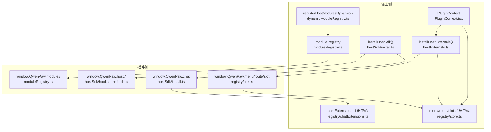
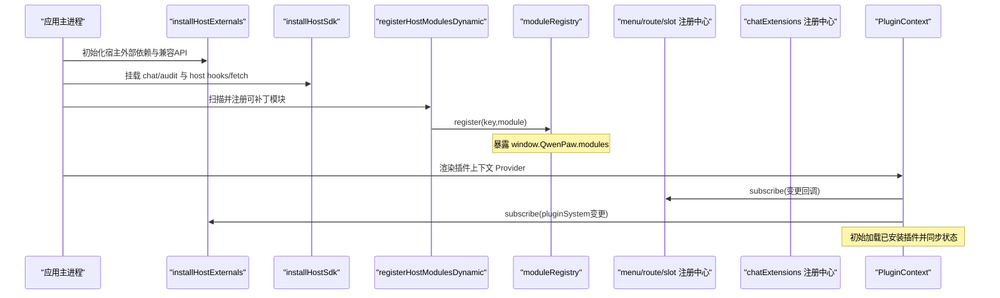
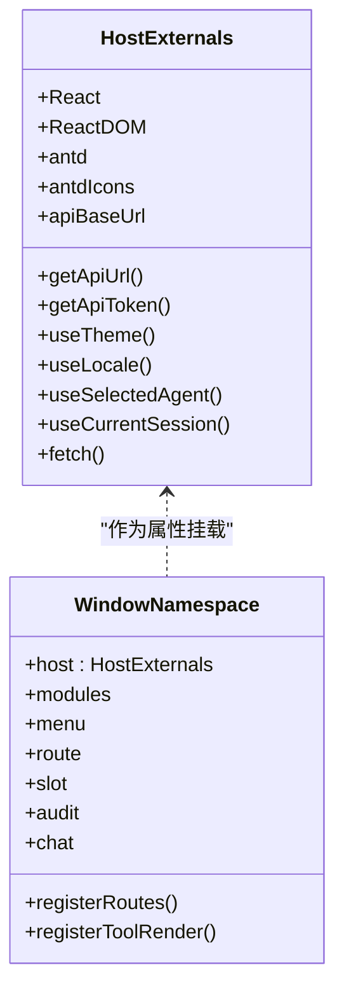
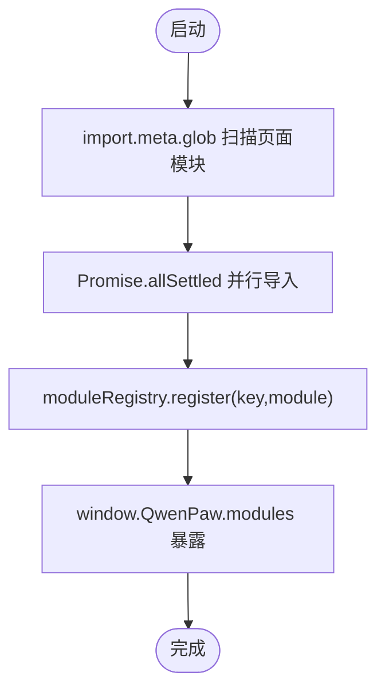
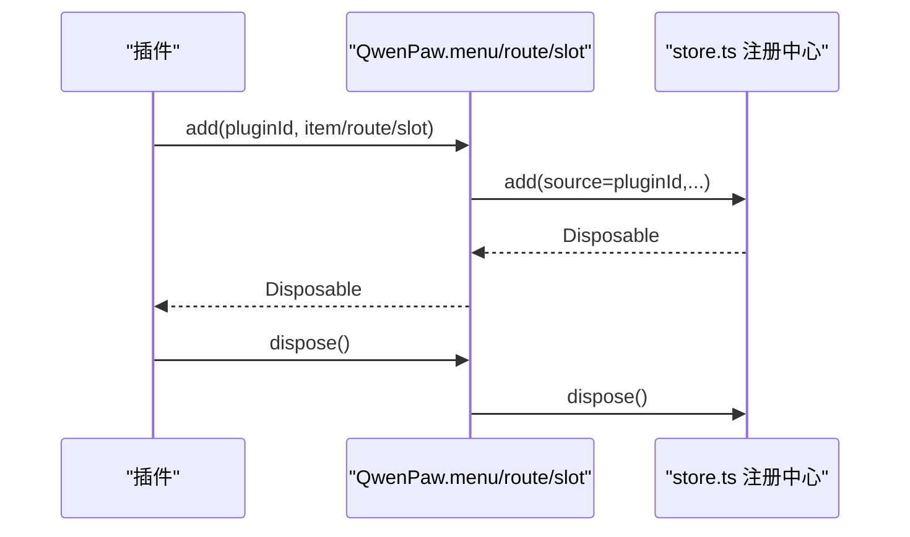
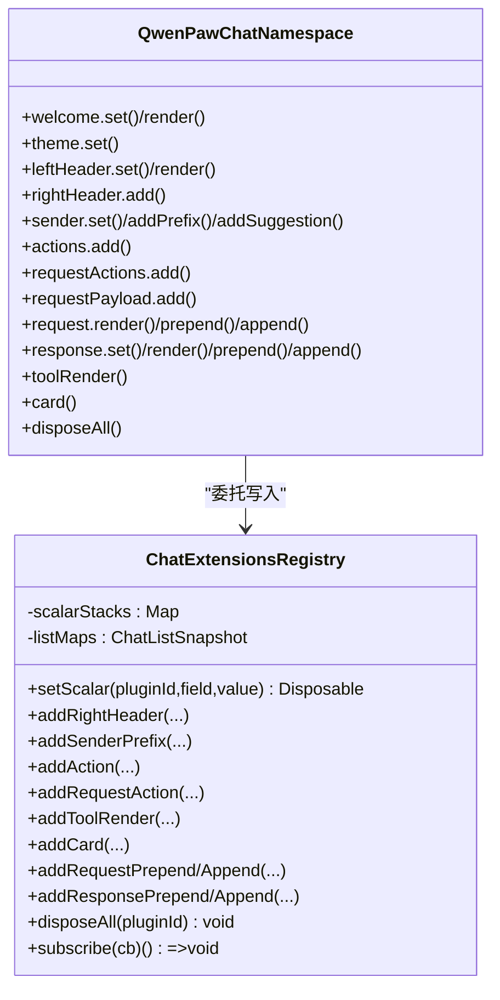
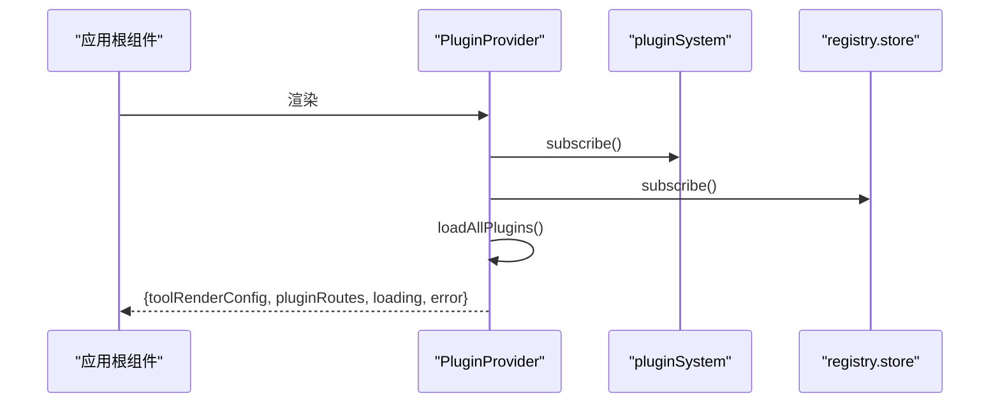
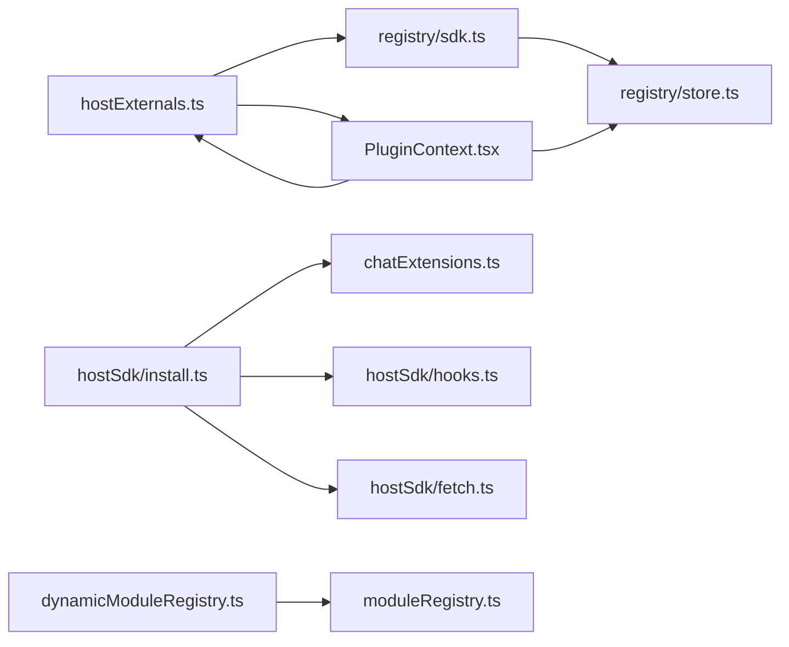

# 插件系统

<cite>
**本文引用的文件**   
- [console/src/plugins/PluginContext.tsx](file://console/src/plugins/PluginContext.tsx)
- [console/src/plugins/hostExternals.ts](file://console/src/plugins/hostExternals.ts)
- [console/src/plugins/moduleRegistry.ts](file://console/src/plugins/moduleRegistry.ts)
- [console/src/plugins/dynamicModuleRegistry.ts](file://console/src/plugins/dynamicModuleRegistry.ts)
- [console/src/plugins/registry/store.ts](file://console/src/plugins/registry/store.ts)
- [console/src/plugins/registry/sdk.ts](file://console/src/plugins/registry/sdk.ts)
- [console/src/plugins/registry/chatExtensions.ts](file://console/src/plugins/registry/chatExtensions.ts)
- [console/src/plugins/hostSdk/install.ts](file://console/src/plugins/hostSdk/install.ts)
- [console/src/plugins/hostSdk/hooks.ts](file://console/src/plugins/hostSdk/hooks.ts)
- [console/src/plugins/hostSdk/fetch.ts](file://console/src/plugins/hostSdk/fetch.ts)
- [console/src/plugins/types/qwenpaw.d.ts](file://console/src/plugins/types/qwenpaw.d.ts)
</cite>

## 目录
1. [简介](#简介)
2. [项目结构](#项目结构)
3. [核心组件](#核心组件)
4. [架构总览](#架构总览)
5. [详细组件分析](#详细组件分析)
6. [依赖关系分析](#依赖关系分析)
7. [性能与资源管理](#性能与资源管理)
8. [安全、权限与沙箱隔离](#安全权限与沙箱隔离)
9. [错误处理与调试支持](#错误处理与调试支持)
10. [常见问题与排障](#常见问题与排障)
11. [结论](#结论)
12. [附录：开发指南与示例路径](#附录开发指南与示例路径)

## 简介
本文件系统性梳理 QwenPaw 前端插件系统的架构与实现，覆盖插件发现、动态加载、宿主 SDK 暴露、注册表与冲突策略、生命周期与卸载、通信协议与类型契约、以及安全与可观测性。文档既面向初学者提供循序渐进的说明，也为有经验的开发者提供代码级细节与可视化图示。

## 项目结构
前端插件系统位于 console/src/plugins 下，围绕“全局命名空间 window.QwenPaw”构建，包含以下关键模块：
- 宿主外部依赖与全局安装：hostExternals.ts、hostSdk/*
- 运行时模块注册与动态发现：moduleRegistry.ts、dynamicModuleRegistry.ts
- 统一注册中心（菜单/路由/插槽）：registry/store.ts、registry/sdk.ts
- 聊天扩展注册中心：registry/chatExtensions.ts
- 插件上下文与消费入口：PluginContext.tsx
- 公共类型契约：types/qwenpaw.d.ts



图表来源
- [console/src/plugins/hostExternals.ts:225-301](file://console/src/plugins/hostExternals.ts#L225-L301)
- [console/src/plugins/hostSdk/install.ts:369-397](file://console/src/plugins/hostSdk/install.ts#L369-L397)
- [console/src/plugins/moduleRegistry.ts:120-138](file://console/src/plugins/moduleRegistry.ts#L120-L138)
- [console/src/plugins/dynamicModuleRegistry.ts:22-73](file://console/src/plugins/dynamicModuleRegistry.ts#L22-L73)
- [console/src/plugins/registry/store.ts:309-566](file://console/src/plugins/registry/store.ts#L309-L566)
- [console/src/plugins/registry/chatExtensions.ts:138-511](file://console/src/plugins/registry/chatExtensions.ts#L138-L511)
- [console/src/plugins/PluginContext.tsx:66-122](file://console/src/plugins/PluginContext.tsx#L66-L122)

章节来源
- [console/src/plugins/hostExternals.ts:225-301](file://console/src/plugins/hostExternals.ts#L225-L301)
- [console/src/plugins/hostSdk/install.ts:369-397](file://console/src/plugins/hostSdk/install.ts#L369-L397)
- [console/src/plugins/moduleRegistry.ts:120-138](file://console/src/plugins/moduleRegistry.ts#L120-L138)
- [console/src/plugins/dynamicModuleRegistry.ts:22-73](file://console/src/plugins/dynamicModuleRegistry.ts#L22-L73)
- [console/src/plugins/registry/store.ts:309-566](file://console/src/plugins/registry/store.ts#L309-L566)
- [console/src/plugins/registry/chatExtensions.ts:138-511](file://console/src/plugins/registry/chatExtensions.ts#L138-L511)
- [console/src/plugins/PluginContext.tsx:66-122](file://console/src/plugins/PluginContext.tsx#L66-L122)

## 核心组件
- 全局安装器
  - installHostExternals：挂载 React/antd 等宿主依赖、注册 menu/route/slot/audit 命名空间，并提供 registerRoutes/registerToolRender 兼容桥接。
  - installHostSdk：挂载 chat 命名空间、审计接口，并向 host 注入 hooks 与鉴权 fetch。
- 模块注册与动态发现
  - moduleRegistry：集中注册宿主导出，通过 window.QwenPaw.modules 暴露给插件进行 monkey-patch。
  - dynamicModuleRegistry：基于 import.meta.glob 自动发现 pages 下的可补丁模块，避免生成文件与合并冲突。
- 注册中心
  - registry/store：统一的 menu/route/slot 注册中心，提供 add/replace/wrap/remove/dispose 及快照能力，内置冲突策略与审计记录。
  - registry/sdk：对外暴露 QwenPaw.{menu,route,slot,audit} 命名空间工厂方法。
  - registry/chatExtensions：聊天界面扩展注册中心，维护标量字段 LIFO 栈与列表项追加队列，支持 disposeAll 批量清理。
- 插件上下文
  - PluginContext：订阅注册中心变化，聚合 toolRenderConfig 与 pluginRoutes，供 usePlugins() 消费。

章节来源
- [console/src/plugins/hostExternals.ts:225-301](file://console/src/plugins/hostExternals.ts#L225-L301)
- [console/src/plugins/hostSdk/install.ts:369-397](file://console/src/plugins/hostSdk/install.ts#L369-L397)
- [console/src/plugins/moduleRegistry.ts:39-138](file://console/src/plugins/moduleRegistry.ts#L39-L138)
- [console/src/plugins/dynamicModuleRegistry.ts:22-119](file://console/src/plugins/dynamicModuleRegistry.ts#L22-L119)
- [console/src/plugins/registry/store.ts:309-566](file://console/src/plugins/registry/store.ts#L309-L566)
- [console/src/plugins/registry/sdk.ts:82-126](file://console/src/plugins/registry/sdk.ts#L82-L126)
- [console/src/plugins/registry/chatExtensions.ts:138-511](file://console/src/plugins/registry/chatExtensions.ts#L138-L511)
- [console/src/plugins/PluginContext.tsx:66-122](file://console/src/plugins/PluginContext.tsx#L66-L122)

## 架构总览
下图展示从应用启动到插件注册的端到端流程，包括宿主依赖注入、模块发现、注册中心写入与 UI 响应式更新。



图表来源
- [console/src/plugins/hostExternals.ts:225-301](file://console/src/plugins/hostExternals.ts#L225-L301)
- [console/src/plugins/hostSdk/install.ts:369-397](file://console/src/plugins/hostSdk/install.ts#L369-L397)
- [console/src/plugins/dynamicModuleRegistry.ts:22-73](file://console/src/plugins/dynamicModuleRegistry.ts#L22-L73)
- [console/src/plugins/moduleRegistry.ts:120-138](file://console/src/plugins/moduleRegistry.ts#L120-L138)
- [console/src/plugins/PluginContext.tsx:76-97](file://console/src/plugins/PluginContext.tsx#L76-L97)

## 详细组件分析

### 全局安装器与宿主 SDK
- installHostExternals
  - 挂载 React/ReactDOM/antd/antdIcons、API 基础地址与工具函数。
  - 创建 menu/route/slot/audit 命名空间，并保留 registerRoutes/registerToolRender 兼容桥接，将旧 API 翻译为新的注册中心调用。
- installHostSdk
  - 创建 chat 命名空间，封装 set/render/add 三类操作，映射到 chatExtensions 内部存储。
  - 向 host 注入 useTheme/useLocale/useSelectedAgent/useCurrentSession 等 hooks 与鉴权 fetch。



图表来源
- [console/src/plugins/hostExternals.ts:40-57](file://console/src/plugins/hostExternals.ts#L40-L57)
- [console/src/plugins/hostExternals.ts:164-196](file://console/src/plugins/hostExternals.ts#L164-L196)
- [console/src/plugins/hostSdk/install.ts:369-397](file://console/src/plugins/hostSdk/install.ts#L369-L397)

章节来源
- [console/src/plugins/hostExternals.ts:225-301](file://console/src/plugins/hostExternals.ts#L225-L301)
- [console/src/plugins/hostSdk/install.ts:369-397](file://console/src/plugins/hostSdk/install.ts#L369-L397)
- [console/src/plugins/hostSdk/hooks.ts:24-52](file://console/src/plugins/hostSdk/hooks.ts#L24-L52)
- [console/src/plugins/hostSdk/fetch.ts:11-21](file://console/src/plugins/hostSdk/fetch.ts#L11-L21)

### 模块注册与动态发现
- moduleRegistry
  - 提供 register/get/call/keys/getModule/getAllModules 等方法，内部以 Map 保存模块导出副本。
  - 通过 Object.defineProperty 在 window.QwenPaw.modules 上暴露只读视图，确保插件始终获取最新状态。
- dynamicModuleRegistry
  - 使用 import.meta.glob 扫描 ../pages/**/*.ts|tsx（排除测试与声明文件），并行注册所有模块键名。
  - 提供 eager 与 lazy 两种模式，默认推荐懒加载以提升启动性能。



图表来源
- [console/src/plugins/dynamicModuleRegistry.ts:22-73](file://console/src/plugins/dynamicModuleRegistry.ts#L22-L73)
- [console/src/plugins/moduleRegistry.ts:39-138](file://console/src/plugins/moduleRegistry.ts#L39-L138)

章节来源
- [console/src/plugins/moduleRegistry.ts:39-138](file://console/src/plugins/moduleRegistry.ts#L39-L138)
- [console/src/plugins/dynamicModuleRegistry.ts:22-119](file://console/src/plugins/dynamicModuleRegistry.ts#L22-L119)

### 注册中心：菜单/路由/插槽
- 设计要点
  - 共享通知总线：三个子注册中心共用同一订阅者集合，一次变更触发所有消费者重渲染。
  - 快照稳定引用：按位置或名称缓存快照，减少下游 useMemo 抖动。
  - 冲突策略
    - menu.add 重复 id → 无操作 + 审计 "menu.conflict"。
    - route.add 重复 id 或 path → 无操作 + 审计 "route.conflict"。
    - replace/wrap → LIFO 栈；dispose 弹出至前一个获胜者。
    - slot.replace → 若存在 replace，则仅最后一个 replace 生效，fill 被跳过。
- 拓扑排序
  - 菜单与插槽均支持 before/after 约束，采用 Kahn 算法进行拓扑排序，并以 order 与注册时间为次级排序依据。

```mermaid
classDiagram
class MenuRegistryImpl {
-stacks : Map<string, MenuEntry[]>
-snapshots : Map<MenuLocation, MenuItem[]>
+add(source,item) Disposable
+replace(source,targetId,item) Disposable
+remove(targetId) void
+snapshot(location?) MenuItem[]
}
class RouteRegistryImpl {
-bases : Map<string, RouteEntry>
-overrides : Map<string, RouteOverrideEntry[]>
-wraps : Map<string, RouteWrapEntry[]>
+add(source,route) Disposable
+replace(source,targetId,component) Disposable
+wrap(source,targetId,wrapper) Disposable
+remove(targetId) void
+snapshot() ResolvedRoute[]
}
class SlotRegistryImpl {
-slots : Map<SlotName, SlotEntry[]>
-snapshots : Map<SlotName, SlotEntry[]>
+fill(source,name,render,opts) Disposable
+replace(source,name,render,opts) Disposable
+snapshot(name) SlotEntry[]
}
MenuRegistryImpl --> "共享notify"
RouteRegistryImpl --> "共享notify"
SlotRegistryImpl --> "共享notify"
```

图表来源
- [console/src/plugins/registry/store.ts:70-309](file://console/src/plugins/registry/store.ts#L70-L309)
- [console/src/plugins/registry/store.ts:342-566](file://console/src/plugins/registry/store.ts#L342-L566)
- [console/src/plugins/registry/store.ts:581-757](file://console/src/plugins/registry/store.ts#L581-L757)

章节来源
- [console/src/plugins/registry/store.ts:309-566](file://console/src/plugins/registry/store.ts#L309-L566)
- [console/src/plugins/registry/store.ts:581-757](file://console/src/plugins/registry/store.ts#L581-L757)

### 注册中心 SDK 命名空间
- buildMenuNamespace/buildRouteNamespace/buildSlotNamespace/buildAuditNamespace
  - 将底层 store 的增删改查包装为带 pluginId 参数的公开 API，返回组合 Disposable 便于一次性释放。
  - audit.overrides 暴露审计记录，用于问题定位与合规审查。



图表来源
- [console/src/plugins/registry/sdk.ts:82-126](file://console/src/plugins/registry/sdk.ts#L82-L126)
- [console/src/plugins/registry/store.ts:309-566](file://console/src/plugins/registry/store.ts#L309-L566)

章节来源
- [console/src/plugins/registry/sdk.ts:82-126](file://console/src/plugins/registry/sdk.ts#L82-L126)

### 聊天扩展注册中心与 SDK
- chatExtensions
  - 标量字段：每个字段维护 LIFO 栈，setScalar 推入新值，dispose 精确移除对应注册项，回退到上一个获胜者。
  - 列表字段：append-only 数组，由消费者稳定排序（order、注册时间）。
  - disposeAll：按 pluginId 批量清理，便于未来热卸载。
- QwenPaw.chat 命名空间
  - 提供 welcome/theme/leftHeader/rightHeader/sender/actions/request/response/toolRender/card 等分组 API。
  - 内部将 set/partial 映射到具体 ChatScalarField，并将 render/add 映射到相应列表或标量写入。



图表来源
- [console/src/plugins/registry/chatExtensions.ts:138-511](file://console/src/plugins/registry/chatExtensions.ts#L138-L511)
- [console/src/plugins/hostSdk/install.ts:218-363](file://console/src/plugins/hostSdk/install.ts#L218-L363)

章节来源
- [console/src/plugins/registry/chatExtensions.ts:138-511](file://console/src/plugins/registry/chatExtensions.ts#L138-L511)
- [console/src/plugins/hostSdk/install.ts:218-363](file://console/src/plugins/hostSdk/install.ts#L218-L363)

### 插件上下文与消费
- PluginProvider
  - 订阅 pluginSystem 与 registry 变更，初始加载已安装插件，聚合 toolRenderConfig 与 pluginRoutes。
  - 暴露 usePlugins() 供任意组件读取。
- 兼容层
  - registerRoutes 兼容桥接会将旧 API 转换为新的 route.add + menu.add，并同步到 pluginSystem 以保持向后兼容。



图表来源
- [console/src/plugins/PluginContext.tsx:66-122](file://console/src/plugins/PluginContext.tsx#L66-L122)
- [console/src/plugins/hostExternals.ts:256-288](file://console/src/plugins/hostExternals.ts#L256-L288)

章节来源
- [console/src/plugins/PluginContext.tsx:66-122](file://console/src/plugins/PluginContext.tsx#L66-L122)
- [console/src/plugins/hostExternals.ts:256-288](file://console/src/plugins/hostExternals.ts#L256-L288)

## 依赖关系分析
- 低耦合高内聚
  - 各注册中心独立维护自身数据结构，通过共享 notify 总线解耦消费者。
  - SDK 命名空间仅做薄封装，不持有业务状态，降低循环依赖风险。
- 外部依赖
  - React/ReactDOM/antd 通过 hostExternals 注入，避免插件重复打包。
  - i18n、主题、会话状态通过 hostSdk/hooks 访问，保证插件组件在宿主上下文中渲染。



图表来源
- [console/src/plugins/hostExternals.ts:225-301](file://console/src/plugins/hostExternals.ts#L225-L301)
- [console/src/plugins/registry/sdk.ts:82-126](file://console/src/plugins/registry/sdk.ts#L82-L126)
- [console/src/plugins/registry/store.ts:309-566](file://console/src/plugins/registry/store.ts#L309-L566)
- [console/src/plugins/registry/chatExtensions.ts:138-511](file://console/src/plugins/registry/chatExtensions.ts#L138-L511)
- [console/src/plugins/hostSdk/install.ts:369-397](file://console/src/plugins/hostSdk/install.ts#L369-L397)
- [console/src/plugins/hostSdk/hooks.ts:24-52](file://console/src/plugins/hostSdk/hooks.ts#L24-L52)
- [console/src/plugins/hostSdk/fetch.ts:11-21](file://console/src/plugins/hostSdk/fetch.ts#L11-L21)
- [console/src/plugins/dynamicModuleRegistry.ts:22-73](file://console/src/plugins/dynamicModuleRegistry.ts#L22-L73)
- [console/src/plugins/moduleRegistry.ts:120-138](file://console/src/plugins/moduleRegistry.ts#L120-L138)
- [console/src/plugins/PluginContext.tsx:66-122](file://console/src/plugins/PluginContext.tsx#L66-L122)

章节来源
- [同上各文件行号范围]

## 性能与资源管理
- 动态发现与懒加载
  - 使用 import.meta.glob 的懒加载模式，按需引入页面模块，减少首屏体积。
  - Promise.allSettled 并行导入，避免串行阻塞。
- 快照与稳定引用
  - 注册中心对快照进行缓存与惰性重建，避免频繁重渲染。
  - 菜单/插槽的拓扑排序仅在变更时执行，结果复用。
- 资源释放
  - 所有 add/replace/wrap 均返回 Disposable，支持显式 dispose 或批量 disposeAll。
  - 标量字段采用 LIFO 栈，dispose 精确移除当前注册项，回退至上一个值，避免内存泄漏。

[本节为通用性能建议，无需特定文件来源]

## 安全、权限与沙箱隔离
- 前端侧
  - 插件运行于宿主浏览器上下文，无法直接访问宿主私有状态，需通过 window.QwenPaw.host.* 提供的受控接口访问。
  - 网络请求通过 host.fetch 统一注入 Authorization 与 X-Agent-Id，避免插件自行拼接敏感头。
  - 模块 monkey-patch 通过 window.QwenPaw.modules 暴露，但仅限宿主预先注册的白名单模块。
- 后端侧（参考）
  - 后端存在沙箱开关与工具守卫配置，用于限制危险命令与文件系统访问。该机制主要作用于后端工具链，与前端插件无关，但整体安全模型保持一致。

章节来源
- [console/src/plugins/hostSdk/fetch.ts:11-21](file://console/src/plugins/hostSdk/fetch.ts#L11-L21)
- [console/src/plugins/moduleRegistry.ts:120-138](file://console/src/plugins/moduleRegistry.ts#L120-L138)

## 错误处理与调试支持
- 错误处理
  - 模块注册失败会打印警告，不影响其他模块注册。
  - 订阅者在 notify 中捕获异常，防止单个监听器崩溃影响整体。
- 审计日志
  - 所有注册与替换行为均记录审计事件（如 menu.add/route.replace/chat.scalar.set 等），可通过 audit.overrides 查询。
- 调试建议
  - 使用 audit.overrides 查看最近覆盖记录，快速定位冲突来源。
  - 在开发环境开启控制台日志，观察 "[patchable]" 与 "[plugin:*]" 输出。

章节来源
- [console/src/plugins/dynamicModuleRegistry.ts:66-73](file://console/src/plugins/dynamicModuleRegistry.ts#L66-L73)
- [console/src/plugins/registry/store.ts:38-46](file://console/src/plugins/registry/store.ts#L38-L46)
- [console/src/plugins/registry/sdk.ts:121-126](file://console/src/plugins/registry/sdk.ts#L121-L126)

## 常见问题与排障
- 插件冲突解决
  - 菜单/路由重复 id 或路径会被忽略并记录审计事件。建议使用 replace 明确覆盖，或在注册前检查 snapshot。
  - 插槽 replace 模式下，只有最后一个 replace 生效，fill 将被跳过。
- 内存管理与卸载
  - 务必保存 Disposable 并在组件卸载时调用 dispose，或使用 chatExtensions.disposeAll 批量清理。
  - 标量字段 dispose 不会删除尚未成为“获胜者”的历史项，避免误删。
- 第三方库集成
  - 优先通过 window.QwenPaw.host 提供的 React/antd 版本，避免多实例导致的状态不一致。
  - 需要访问宿主模块导出时，通过 window.QwenPaw.modules 读取，不要直接 require/import 宿主源码。
- 网络与安全
  - 使用 host.fetch 发起请求，确保携带鉴权头；避免在插件中硬编码 token。

章节来源
- [console/src/plugins/registry/store.ts:140-200](file://console/src/plugins/registry/store.ts#L140-L200)
- [console/src/plugins/registry/store.ts:473-535](file://console/src/plugins/registry/store.ts#L473-L535)
- [console/src/plugins/registry/chatExtensions.ts:372-401](file://console/src/plugins/registry/chatExtensions.ts#L372-L401)
- [console/src/plugins/hostSdk/fetch.ts:11-21](file://console/src/plugins/hostSdk/fetch.ts#L11-L21)

## 结论
QwenPaw 前端插件系统以“全局命名空间 + 注册中心 + 订阅驱动”为核心，实现了插件的动态发现、模块化注入、细粒度扩展点与完善的冲突/审计机制。通过 chat/menu/route/slot 四类扩展面，插件可在不侵入宿主代码的前提下灵活定制界面与交互。结合 Disposable 与快照优化，系统在可扩展性与性能之间取得良好平衡。

[本节为总结性内容，无需特定文件来源]

## 附录：开发指南与示例路径
- 定义插件 API 与类型
  - 复制 types/qwenpaw.d.ts 到你的插件工程，启用 declare global 以获得 window.QwenPaw 的类型提示。
- 注册路由与菜单
  - 使用 window.QwenPaw.route.add / window.QwenPaw.menu.add，或通过兼容 API window.QwenPaw.registerRoutes。
- 自定义聊天界面
  - 使用 window.QwenPaw.chat.welcome.set/render、sender.addPrefix、request.prepend/append 等扩展点。
- 访问宿主能力
  - 使用 window.QwenPaw.host.useTheme/useLocale/useSelectedAgent/useCurrentSession 与 host.fetch。
- 模块 monkey-patch
  - 通过 window.QwenPaw.modules 读取宿主导出，谨慎修改，注意返回 Disposable 以便清理。

章节来源
- [console/src/plugins/types/qwenpaw.d.ts:285-295](file://console/src/plugins/types/qwenpaw.d.ts#L285-L295)
- [console/src/plugins/hostExternals.ts:256-288](file://console/src/plugins/hostExternals.ts#L256-L288)
- [console/src/plugins/hostSdk/install.ts:218-363](file://console/src/plugins/hostSdk/install.ts#L218-L363)
- [console/src/plugins/hostSdk/hooks.ts:24-52](file://console/src/plugins/hostSdk/hooks.ts#L24-L52)
- [console/src/plugins/moduleRegistry.ts:120-138](file://console/src/plugins/moduleRegistry.ts#L120-L138)