# 状态管理

<cite>
**本文引用的文件**
- [sessionListStore.ts](file://console/src/stores/sessionListStore.ts)
- [agentStore.ts](file://console/src/stores/agentStore.ts)
- [messageQueueStore.ts](file://console/src/stores/messageQueueStore.ts)
- [useWorkspaceWatch.ts](file://console/src/hooks/useWorkspaceWatch.ts)
- [codingModeStore.ts](file://console/src/stores/codingModeStore.ts)
- [codingTabsStore.ts](file://console/src/stores/codingTabsStore.ts)
- [codeFileCacheStore.ts](file://console/src/stores/codeFileCacheStore.ts)
- [useSyncCodingMode.ts](file://console/src/stores/useSyncCodingMode.ts)
- [loopStore.ts](file://console/src/stores/loopStore.ts)
- [sidebarModeStore.ts](file://console/src/stores/sidebarModeStore.ts)
- [uploadLimitStore.ts](file://console/src/stores/uploadLimitStore.ts)
</cite>

## 目录
1. [简介](#简介)
2. [项目结构](#项目结构)
3. [核心组件](#核心组件)
4. [架构总览](#架构总览)
5. [详细组件分析](#详细组件分析)
6. [依赖关系分析](#依赖关系分析)
7. [性能考量](#性能考量)
8. [故障排查指南](#故障排查指南)
9. [结论](#结论)
10. [附录](#附录)

## 简介
本文件系统性梳理 QwenPaw 前端的状态管理方案，围绕 Zustand store 的使用、状态持久化、实时更新与跨标签页同步机制展开。重点覆盖以下关键实现：
- sessionListStore：会话列表的“薄桥接”模式，打通聊天库上下文与外部侧边栏
- agentStore：Agent 选择与多 Tab 共享状态的持久化策略
- messageQueueStore：消息队列的本地持久化、跨标签页广播、Web Locks 所有权控制
- useWorkspaceWatch：工作空间文件变更 SSE 单例监听与事件分发
- codingModeStore / useSyncCodingMode：编码模式的后端驱动与内存态同步
- codingTabsStore：编辑器标签页与差异的按 Agent 持久化
- codeFileCacheStore：基于 LRU 的文件内容缓存
- loopStore、sidebarModeStore、uploadLimitStore：辅助型状态模块

文档同时提供类图、时序图和流程图等可视化说明，并给出创建新 store、订阅变化、处理异步操作的实践示例与常见问题解决方案。

## 项目结构
前端状态相关代码集中在 console/src/stores 与 console/src/hooks 下，采用“功能域 + 单一职责”的组织方式：每个业务域一个 store 文件，必要时配套 hooks 或工具函数。

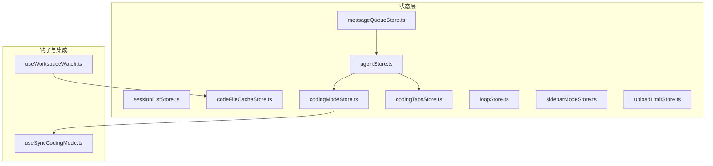

图表来源
- [agentStore.ts:1-170](file://console/src/stores/agentStore.ts#L1-L170)
- [sessionListStore.ts:1-76](file://console/src/stores/sessionListStore.ts#L1-L76)
- [messageQueueStore.ts:1-654](file://console/src/stores/messageQueueStore.ts#L1-L654)
- [codingModeStore.ts:1-79](file://console/src/stores/codingModeStore.ts#L1-L79)
- [codingTabsStore.ts:1-239](file://console/src/stores/codingTabsStore.ts#L1-L239)
- [codeFileCacheStore.ts:1-82](file://console/src/stores/codeFileCacheStore.ts#L1-L82)
- [useWorkspaceWatch.ts:1-148](file://console/src/hooks/useWorkspaceWatch.ts#L1-L148)
- [useSyncCodingMode.ts:1-46](file://console/src/stores/useSyncCodingMode.ts#L1-L46)
- [loopStore.ts:1-59](file://console/src/stores/loopStore.ts#L1-L59)
- [sidebarModeStore.ts:1-51](file://console/src/stores/sidebarModeStore.ts#L1-L51)
- [uploadLimitStore.ts:1-21](file://console/src/stores/uploadLimitStore.ts#L1-L21)

章节来源
- [agentStore.ts:1-170](file://console/src/stores/agentStore.ts#L1-L170)
- [sessionListStore.ts:1-76](file://console/src/stores/sessionListStore.ts#L1-L76)
- [messageQueueStore.ts:1-654](file://console/src/stores/messageQueueStore.ts#L1-L654)
- [useWorkspaceWatch.ts:1-148](file://console/src/hooks/useWorkspaceWatch.ts#L1-L148)
- [codingModeStore.ts:1-79](file://console/src/stores/codingModeStore.ts#L1-L79)
- [codingTabsStore.ts:1-239](file://console/src/stores/codingTabsStore.ts#L1-L239)
- [codeFileCacheStore.ts:1-82](file://console/src/stores/codeFileCacheStore.ts#L1-L82)
- [useSyncCodingMode.ts:1-46](file://console/src/stores/useSyncCodingMode.ts#L1-L46)
- [loopStore.ts:1-59](file://console/src/stores/loopStore.ts#L1-L59)
- [sidebarModeStore.ts:1-51](file://console/src/stores/sidebarModeStore.ts#L1-L51)
- [uploadLimitStore.ts:1-21](file://console/src/stores/uploadLimitStore.ts#L1-L21)

## 核心组件
本节对关键 store 的职责、数据流和交互进行概览式解读，后续章节将深入细节。

- sessionListStore：作为聊天库上下文与外部 UI（如侧边栏）之间的薄桥，支持双向同步与刷新回调注册。
- agentStore：维护当前选中的 Agent、Agent 列表与最近聊天 ID；通过自定义 storage 适配器在 sessionStorage 与 localStorage 之间分层持久化。
- messageQueueStore：为每个会话维护消息队列，具备本地持久化、跨标签页广播、Web Locks 所有权控制、迁移与运行状态管理等能力。
- useWorkspaceWatch：单例 SSE 连接，统一接收工作空间文件变更事件并分发给所有订阅者。
- codingModeStore + useSyncCodingMode：以 Agent 维度维护编码模式开关与项目目录，从后端拉取并保持内存态一致。
- codingTabsStore：按 Agent 持久化编辑器标签与差异信息，限制体积避免超出存储配额。
- codeFileCacheStore：内存级 LRU 文件内容缓存，配合 SSE 失效与 HTTP 缓存优化读取路径。
- loopStore、sidebarModeStore、uploadLimitStore：轻量状态模块，分别用于循环技能、侧边栏模式与上传大小限制。

章节来源
- [sessionListStore.ts:1-76](file://console/src/stores/sessionListStore.ts#L1-L76)
- [agentStore.ts:1-170](file://console/src/stores/agentStore.ts#L1-L170)
- [messageQueueStore.ts:1-654](file://console/src/stores/messageQueueStore.ts#L1-L654)
- [useWorkspaceWatch.ts:1-148](file://console/src/hooks/useWorkspaceWatch.ts#L1-L148)
- [codingModeStore.ts:1-79](file://console/src/stores/codingModeStore.ts#L1-L79)
- [codingTabsStore.ts:1-239](file://console/src/stores/codingTabsStore.ts#L1-L239)
- [codeFileCacheStore.ts:1-82](file://console/src/stores/codeFileCacheStore.ts#L1-L82)
- [useSyncCodingMode.ts:1-46](file://console/src/stores/useSyncCodingMode.ts#L1-L46)
- [loopStore.ts:1-59](file://console/src/stores/loopStore.ts#L1-L59)
- [sidebarModeStore.ts:1-51](file://console/src/stores/sidebarModeStore.ts#L1-L51)
- [uploadLimitStore.ts:1-21](file://console/src/stores/uploadLimitStore.ts#L1-L21)

## 架构总览
整体状态管理遵循“单一事实源 + 最小化持久化 + 跨标签页同步”的原则：
- 持久化策略分层：sessionStorage（每标签独立）、localStorage（跨标签共享）、内存（热路径）
- 跨标签页同步：BroadcastChannel 优先，storage 事件兜底
- 并发控制：Web Locks API 保证同一会话仅一个标签拥有发送所有权
- 实时性：SSE 单例监听工作空间变更，事件分发到各订阅者

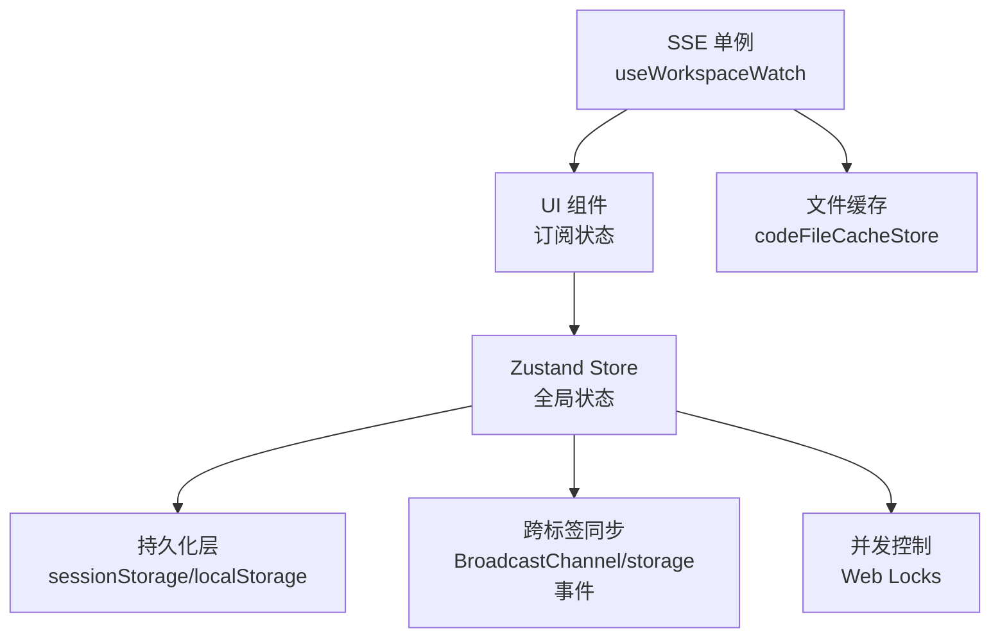

图表来源
- [messageQueueStore.ts:1-654](file://console/src/stores/messageQueueStore.ts#L1-L654)
- [agentStore.ts:1-170](file://console/src/stores/agentStore.ts#L1-L170)
- [useWorkspaceWatch.ts:1-148](file://console/src/hooks/useWorkspaceWatch.ts#L1-L148)
- [codeFileCacheStore.ts:1-82](file://console/src/stores/codeFileCacheStore.ts#L1-L82)

## 详细组件分析

### sessionListStore：会话列表薄桥
- 设计目标：让不在聊天库上下文树中的组件（如简单模式侧边栏）也能访问会话列表，并在 CRUD 后双向同步回聊天库上下文。
- 关键能力：
  - 从聊天库上下文同步到 store（syncFromLibrary）
  - 对外暴露 syncSessions 更新 store 并反向写入聊天库上下文
  - 提供便捷方法 syncSessionsGlobal 供任意位置调用
- 适用场景：侧边栏展示、抽屉面板、跨上下文的数据一致性

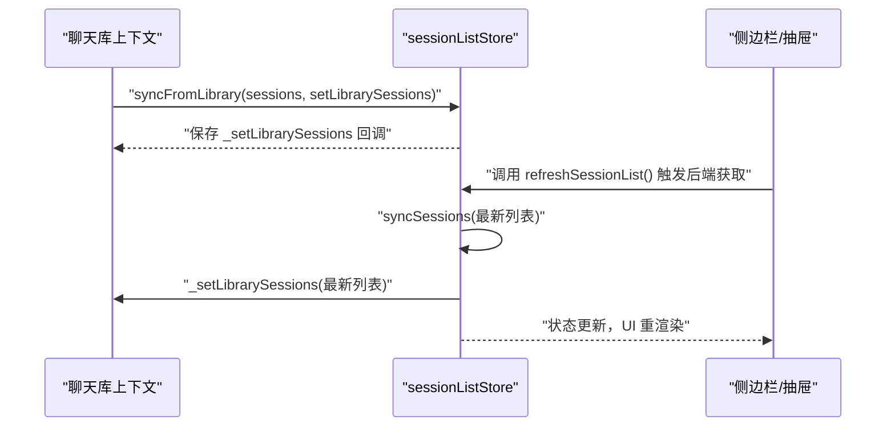

图表来源
- [sessionListStore.ts:1-76](file://console/src/stores/sessionListStore.ts#L1-L76)

章节来源
- [sessionListStore.ts:1-76](file://console/src/stores/sessionListStore.ts#L1-L76)

### agentStore：Agent 选择与多标签共享
- 设计要点：
  - 使用 persist 中间件，并通过自定义 storage 适配器实现“每标签独立 + 跨标签共享”的分层持久化
  - 初始化优先级：sessionStorage > localStorage 专用键 > 共享 localStorage
  - 切换 Agent 时刷新菜单注册表，并将最后使用的 Agent 写入 localStorage 供新标签继承
- 数据结构：selectedAgent、agents、lastChatIdByAgent
- 典型操作：setSelectedAgent、setAgents、addAgent、removeAgent、updateAgent、setLastChatId、getLastChatId

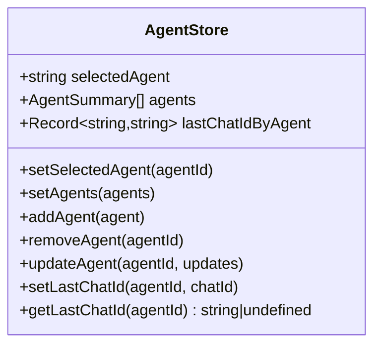

图表来源
- [agentStore.ts:1-170](file://console/src/stores/agentStore.ts#L1-L170)

章节来源
- [agentStore.ts:1-170](file://console/src/stores/agentStore.ts#L1-L170)

### messageQueueStore：消息队列与跨标签同步
- 核心特性：
  - 按会话维度维护队列项与运行状态（runStates），支持入队、删除、编辑、重排、清空、迁移、状态设置
  - 本地持久化：每个会话对应一个 localStorage key，包含 items 与 runState
  - 跨标签同步：BroadcastChannel 广播变更，storage 事件兜底
  - 并发控制：Web Locks 提供“发送锁”与“所有权锁”，确保同一会话只有一个标签主动发送
  - 向后兼容：自动迁移旧格式（数组 -> 结构化对象）
- 关键类型：QueueItem、QueueItemInput、QueueRunState、QueueAttachment、QueueImage、QueueMention、QueueQuote
- 重要常量：MAX_QUEUE_SIZE、STORAGE_PREFIX

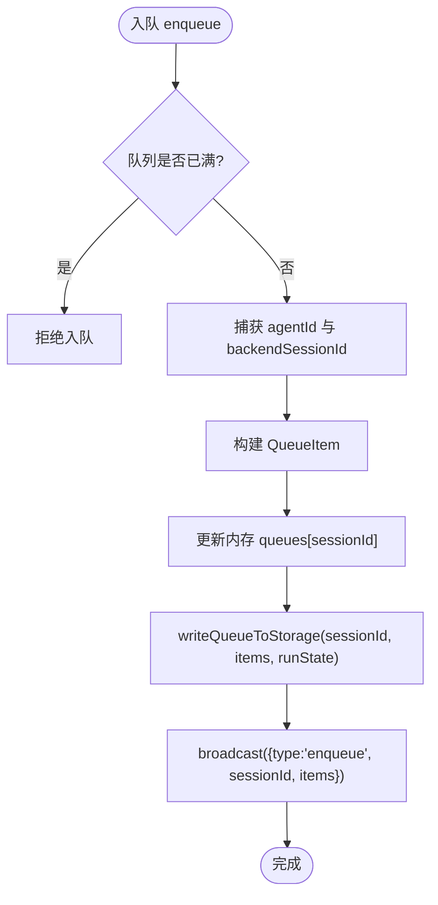

图表来源
- [messageQueueStore.ts:1-654](file://console/src/stores/messageQueueStore.ts#L1-L654)

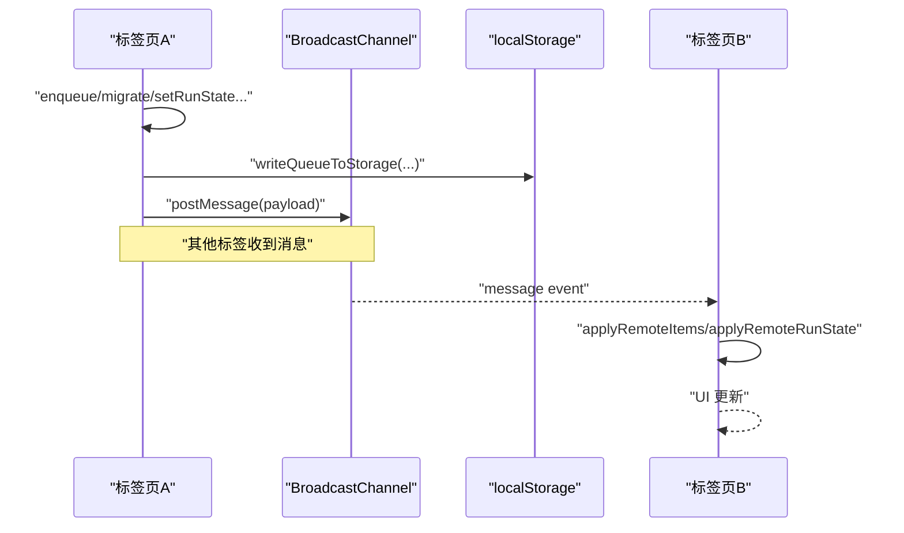

图表来源
- [messageQueueStore.ts:1-654](file://console/src/stores/messageQueueStore.ts#L1-L654)

章节来源
- [messageQueueStore.ts:1-654](file://console/src/stores/messageQueueStore.ts#L1-L654)

### useWorkspaceWatch：工作空间文件变更 SSE 单例
- 设计要点：
  - 模块级单例：多个组件可安全订阅，只维持一个 SSE 连接
  - 连接生命周期：首个订阅建立连接，无订阅时断开
  - 错误重试：指数退避，上限 30 秒
  - 事件分发：解析 data: JSON 行，过滤 file_change 事件，调用所有注册的回调
- 接口：useWorkspaceWatch(onFileChange, enabled = true)

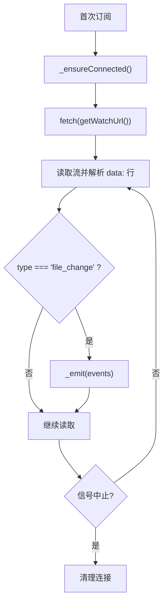

图表来源
- [useWorkspaceWatch.ts:1-148](file://console/src/hooks/useWorkspaceWatch.ts#L1-L148)

章节来源
- [useWorkspaceWatch.ts:1-148](file://console/src/hooks/useWorkspaceWatch.ts#L1-L148)

### codingModeStore 与 useSyncCodingMode：编码模式后端驱动
- codingModeStore：
  - 按 Agent 维度维护编码模式开关与项目目录
  - 纯内存态，避免浏览器缓存掩盖后端真实状态
- useSyncCodingMode：
  - 在 selectedAgent 变化时从后端拉取状态并填充 store
  - 失败时降级为默认值，防止路由与 UI 长期阻塞

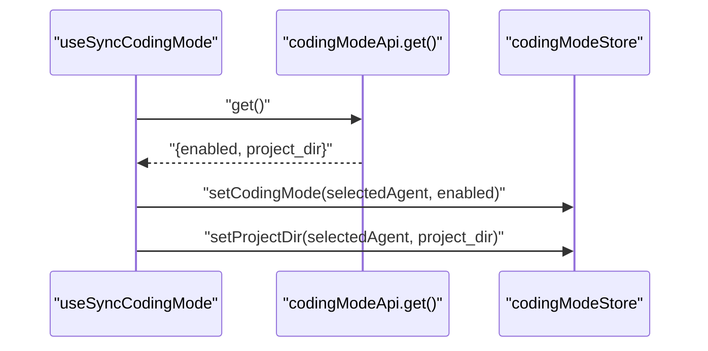

图表来源
- [codingModeStore.ts:1-79](file://console/src/stores/codingModeStore.ts#L1-L79)
- [useSyncCodingMode.ts:1-46](file://console/src/stores/useSyncCodingMode.ts#L1-L46)

章节来源
- [codingModeStore.ts:1-79](file://console/src/stores/codingModeStore.ts#L1-L79)
- [useSyncCodingMode.ts:1-46](file://console/src/stores/useSyncCodingMode.ts#L1-L46)

### codingTabsStore：编辑器标签与差异持久化
- 设计要点：
  - 按 Agent 维度持久化 tabs、activeTab、diffs
  - partialize 策略：仅持久化路径列表与 small original diff，避免超出配额
  - 提供稳定空引用以避免无限重渲染
- 常用选择器：useCurrentTabs、useCurrentActiveTabPath、useCurrentDiffs

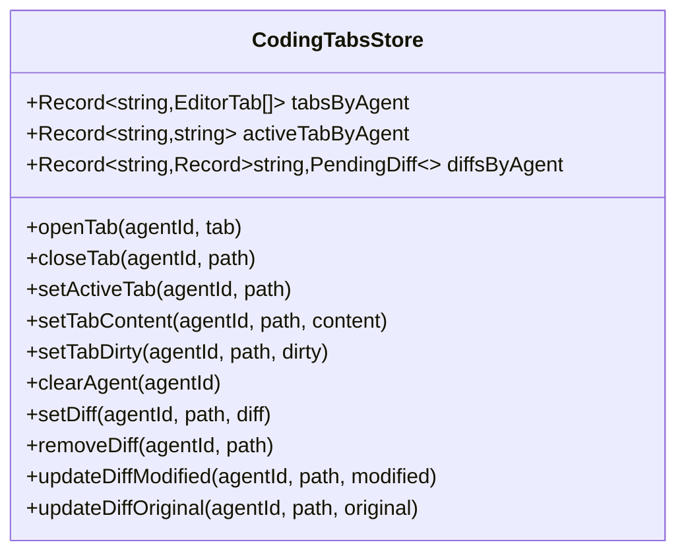

图表来源
- [codingTabsStore.ts:1-239](file://console/src/stores/codingTabsStore.ts#L1-L239)

章节来源
- [codingTabsStore.ts:1-239](file://console/src/stores/codingTabsStore.ts#L1-L239)

### codeFileCacheStore：LRU 文件内容缓存
- 设计要点：
  - Map 存储，touchedAt 单调递增计数实现 LRU
  - 最大条目数 MAX_ENTRIES，超过则淘汰最久未访问项
  - 不持久化，由 SSE 失效与 HTTP 缓存协同保障一致性

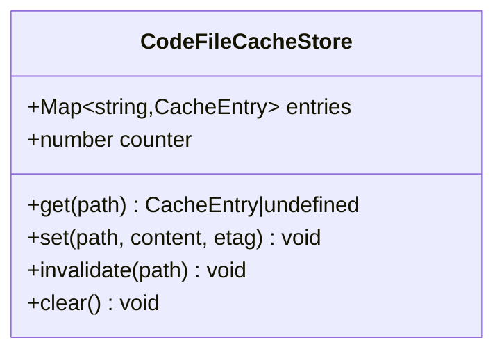

图表来源
- [codeFileCacheStore.ts:1-82](file://console/src/stores/codeFileCacheStore.ts#L1-L82)

章节来源
- [codeFileCacheStore.ts:1-82](file://console/src/stores/codeFileCacheStore.ts#L1-L82)

### 辅助 Store：loopStore、sidebarModeStore、uploadLimitStore
- loopStore：维护可用循环技能列表与选中状态，支持从后端命令集筛选出 plugin 类别的技能
- sidebarModeStore：侧边栏模式（simple/full）的本地持久化
- uploadLimitStore：从后端获取上传大小限制，失败时保持 null（无限制）

章节来源
- [loopStore.ts:1-59](file://console/src/stores/loopStore.ts#L1-L59)
- [sidebarModeStore.ts:1-51](file://console/src/stores/sidebarModeStore.ts#L1-L51)
- [uploadLimitStore.ts:1-21](file://console/src/stores/uploadLimitStore.ts#L1-L21)

## 依赖关系分析
- agentStore 被 codingModeStore、codingTabsStore 引用，作为“当前 Agent”的事实源
- useSyncCodingMode 依赖 agentStore 与 codingModeStore，负责后端状态同步
- messageQueueStore 在入队时读取 agentStore 的持久化键以捕获当前 Agent
- useWorkspaceWatch 与 codeFileCacheStore 协作：SSE 失效触发缓存清理，IDE 读取走缓存

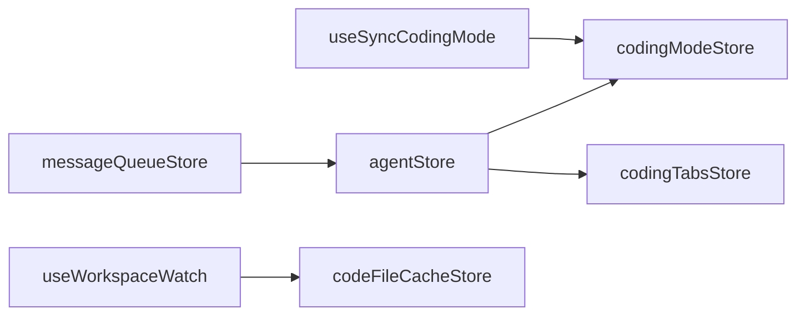

图表来源
- [agentStore.ts:1-170](file://console/src/stores/agentStore.ts#L1-L170)
- [codingModeStore.ts:1-79](file://console/src/stores/codingModeStore.ts#L1-L79)
- [codingTabsStore.ts:1-239](file://console/src/stores/codingTabsStore.ts#L1-L239)
- [useSyncCodingMode.ts:1-46](file://console/src/stores/useSyncCodingMode.ts#L1-L46)
- [messageQueueStore.ts:1-654](file://console/src/stores/messageQueueStore.ts#L1-L654)
- [useWorkspaceWatch.ts:1-148](file://console/src/hooks/useWorkspaceWatch.ts#L1-L148)
- [codeFileCacheStore.ts:1-82](file://console/src/stores/codeFileCacheStore.ts#L1-L82)

章节来源
- [agentStore.ts:1-170](file://console/src/stores/agentStore.ts#L1-L170)
- [codingModeStore.ts:1-79](file://console/src/stores/codingModeStore.ts#L1-L79)
- [codingTabsStore.ts:1-239](file://console/src/stores/codingTabsStore.ts#L1-L239)
- [useSyncCodingMode.ts:1-46](file://console/src/stores/useSyncCodingMode.ts#L1-L46)
- [messageQueueStore.ts:1-654](file://console/src/stores/messageQueueStore.ts#L1-L654)
- [useWorkspaceWatch.ts:1-148](file://console/src/hooks/useWorkspaceWatch.ts#L1-L148)
- [codeFileCacheStore.ts:1-82](file://console/src/stores/codeFileCacheStore.ts#L1-L82)

## 性能考量
- 选择器与稳定引用：
  - codingTabsStore 返回稳定空引用，避免缺失键导致的无限重渲染
  - 建议对大对象使用细粒度选择器，减少不必要的组件重渲染
- 持久化体积控制：
  - codingTabsStore 使用 partialize 仅持久化路径与小差异，避免超出配额
  - messageQueueStore 仅在非空时写入，空队列时移除 key
- 内存缓存与失效：
  - codeFileCacheStore 使用 LRU 限制内存占用，SSE 失效及时清理
- 跨标签同步开销：
  - BroadcastChannel 即时同步，storage 事件兜底；注意避免重复广播（内部 applyRemote* 不写盘也不广播）

## 故障排查指南
- 状态竞争条件
  - 现象：多标签同时发送导致冲突或重复
  - 解决：使用 holdOwnershipLock 或 withSendLock 控制发送权限；确保在页面卸载或会话切换时释放锁
  - 参考：[messageQueueStore.ts:253-285](file://console/src/stores/messageQueueStore.ts#L253-L285)、[messageQueueStore.ts:215-237](file://console/src/stores/messageQueueStore.ts#L215-L237)
- 内存泄漏
  - 现象：SSE 连接未关闭或监听器未移除
  - 解决：useWorkspaceWatch 在 useEffect 清理中移除监听器，当无订阅时断开连接；确保组件卸载时清理
  - 参考：[useWorkspaceWatch.ts:132-146](file://console/src/hooks/useWorkspaceWatch.ts#L132-L146)
- 状态不一致
  - 现象：不同标签看到不同的队列或运行状态
  - 解决：检查 BroadcastChannel 与 storage 事件监听是否正常；确认 writeQueueToStorage 与 broadcast 成对执行
  - 参考：[messageQueueStore.ts:597-653](file://console/src/stores/messageQueueStore.ts#L597-L653)
- 持久化失败或损坏
  - 现象：启动时无法恢复状态或解析异常
  - 解决：agentStore 的 storage 适配器已做 try/catch 与清理；messageQueueStore 有向后兼容迁移逻辑
  - 参考：[agentStore.ts:127-168](file://console/src/stores/agentStore.ts#L127-L168)、[messageQueueStore.ts:86-115](file://console/src/stores/messageQueueStore.ts#L86-L115)

章节来源
- [messageQueueStore.ts:215-285](file://console/src/stores/messageQueueStore.ts#L215-L285)
- [useWorkspaceWatch.ts:132-146](file://console/src/hooks/useWorkspaceWatch.ts#L132-L146)
- [messageQueueStore.ts:597-653](file://console/src/stores/messageQueueStore.ts#L597-L653)
- [agentStore.ts:127-168](file://console/src/stores/agentStore.ts#L127-L168)
- [messageQueueStore.ts:86-115](file://console/src/stores/messageQueueStore.ts#L86-L115)

## 结论
QwenPaw 的前端状态管理以 Zustand 为核心，结合分层持久化、跨标签同步与并发控制，构建了高可靠、可扩展的状态体系。通过薄桥模式、后端驱动同步与单例 SSE 监听，实现了 UI 与后端、多标签间的一致性与实时性。建议在新增功能时遵循现有模式：明确事实源、最小化持久化、谨慎处理并发与资源清理。

## 附录

### 如何创建新的 store（示例步骤）
- 定义状态与动作接口
- 使用 create 创建 store，封装原子更新逻辑
- 如需持久化，使用 persist 中间件并配置 partialize 与 storage 适配器
- 在需要的地方通过选择器订阅状态变化
- 若涉及跨标签同步，考虑引入 BroadcastChannel 与 storage 事件监听

参考实现
- [agentStore.ts:73-168](file://console/src/stores/agentStore.ts#L73-L168)
- [codingTabsStore.ts:60-215](file://console/src/stores/codingTabsStore.ts#L60-L215)
- [messageQueueStore.ts:340-590](file://console/src/stores/messageQueueStore.ts#L340-L590)

### 订阅状态变化（示例）
- 使用 store 的选择器函数订阅特定字段，避免全量订阅
- 对于需要响应 selectedAgent 变化的状态，组合 useAgentStore 与具体 store

参考实现
- [codingTabsStore.ts:223-238](file://console/src/stores/codingTabsStore.ts#L223-L238)
- [codingModeStore.ts:47-78](file://console/src/stores/codingModeStore.ts#L47-L78)

### 处理异步操作（示例）
- 在 store 内发起请求并更新状态，或在 hook 中发起请求后调用 store 动作
- 注意错误处理与降级策略，避免 UI 长时间阻塞

参考实现
- [loopStore.ts:40-58](file://console/src/stores/loopStore.ts#L40-L58)
- [useSyncCodingMode.ts:20-44](file://console/src/stores/useSyncCodingMode.ts#L20-L44)
- [uploadLimitStore.ts:12-20](file://console/src/stores/uploadLimitStore.ts#L12-L20)