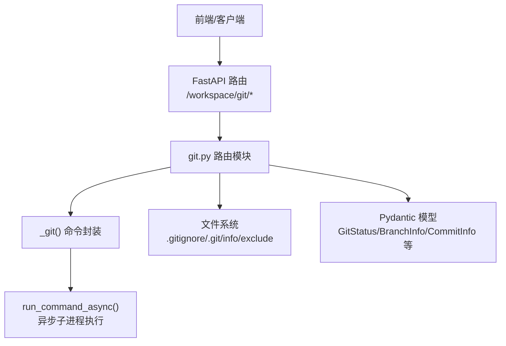
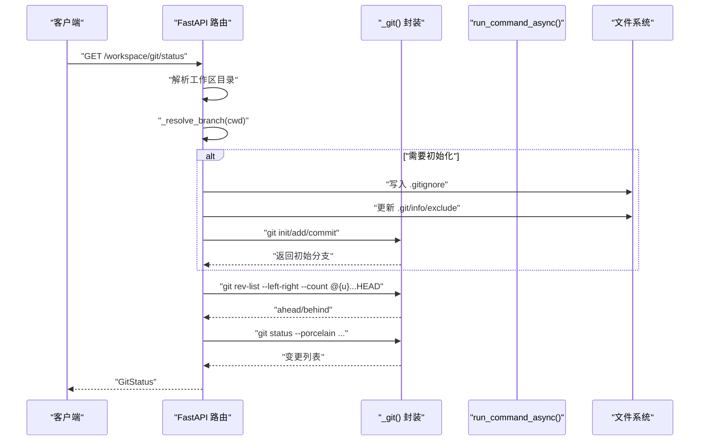
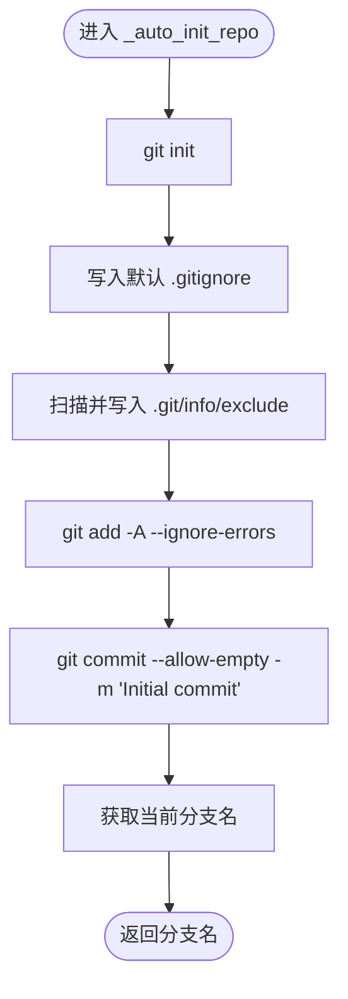
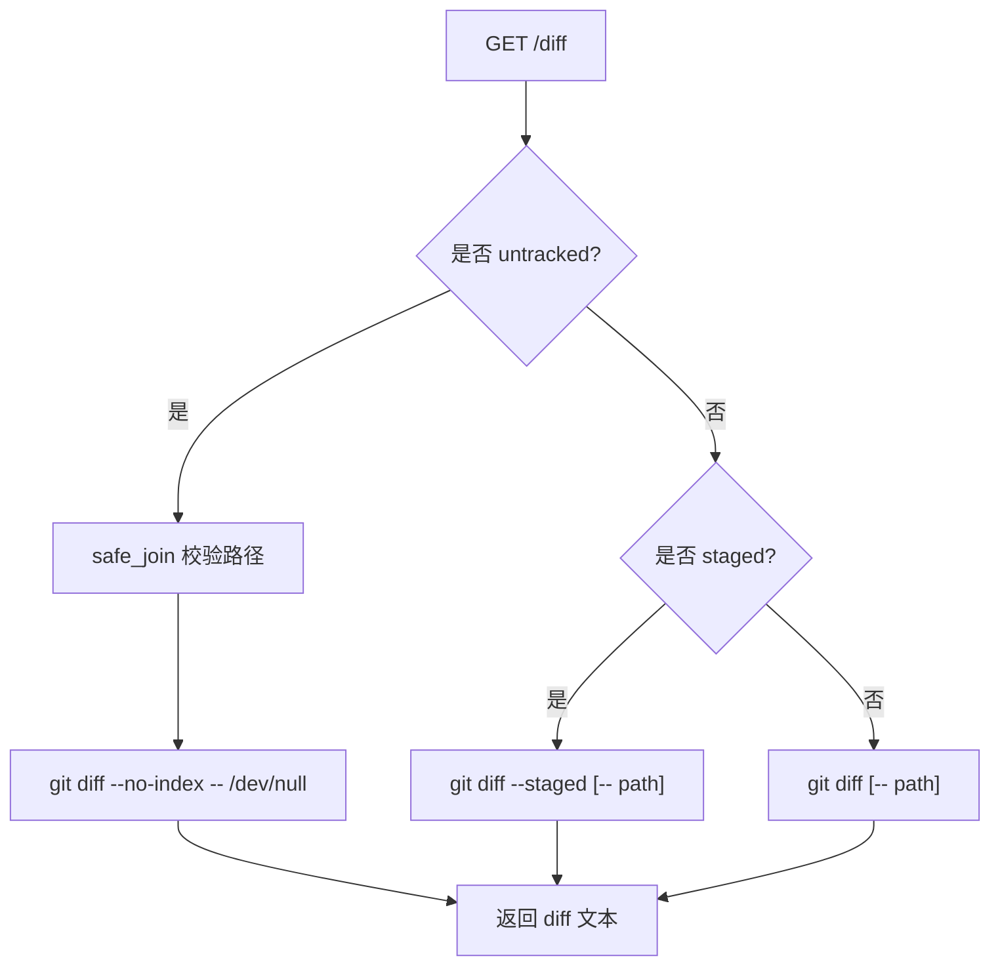
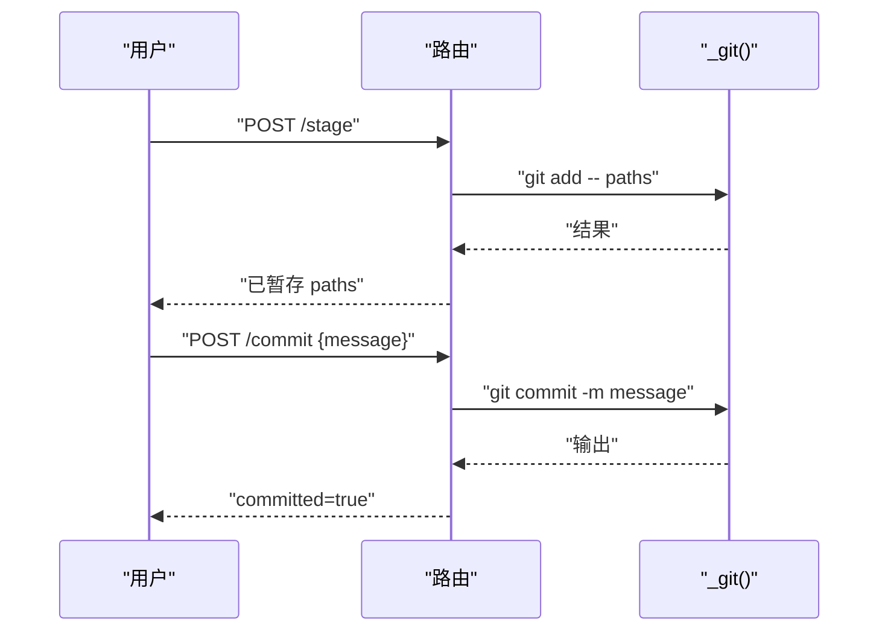
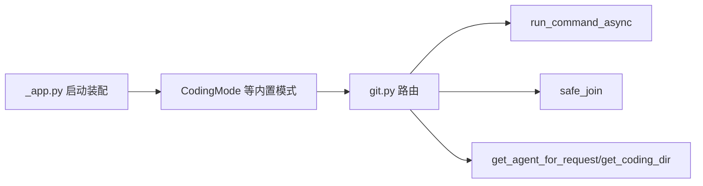

# Git 集成

<cite>
**本文引用的文件**   
- [git.py](file://src/qwenpaw/app/routers/git.py)
- [test_git.py](file://tests/unit/routers/test_git.py)
- [_app.py](file://src/qwenpaw/app/_app.py)
</cite>

## 目录
1. [简介](#简介)
2. [项目结构](#项目结构)
3. [核心组件](#核心组件)
4. [架构总览](#架构总览)
5. [详细组件分析](#详细组件分析)
6. [依赖关系分析](#依赖关系分析)
7. [性能考虑](#性能考虑)
8. [故障排查指南](#故障排查指南)
9. [结论](#结论)
10. [附录](#附录)

## 简介
本章节面向 QwenPaw 编码模式的 Git 集成功能，系统性梳理后端 Git 能力：仓库检测与自动初始化、分支管理、提交历史与差异查看、暂存/取消暂存、丢弃变更、回滚等。文档同时给出端到端调用序列、关键实现细节（命令封装、路径安全、错误处理）、以及扩展建议（自定义操作、接入第三方服务）。内容兼顾初学者友好与资深开发者所需的技术深度。

## 项目结构
Git 功能以 FastAPI 路由形式提供，统一挂载在 /workspace/git/ 下，所有接口基于当前工作区目录执行，并通过共享的命令运行器异步调用系统 git 命令。

图表来源
- [git.py:1-569](file://src/qwenpaw/app/routers/git.py#L1-L569)

章节来源
- [git.py:1-569](file://src/qwenpaw/app/routers/git.py#L1-L569)

## 核心组件
- 路由与请求模型
  - 路由前缀：/workspace/git
  - 请求/响应模型：ChangedFile、GitStatus、BranchInfo、CommitInfo、CheckoutRequest、StageRequest、UnstageRequest、CommitRequest、DiscardRequest、RevertRequest
- Git 命令封装
  - _git(cwd, *args): 通过 run_command_async 异步执行 git 命令，返回 (returncode, stdout, stderr)
  - _raise_if_not_repo(rc, stderr): 非仓库时抛出 422
- 自动初始化
  - _auto_init_repo(cwd): 若工作区无独立仓库则执行 init、写入默认 .gitignore、排除嵌套仓库、首次 add/commit，并返回初始分支名
  - _resolve_branch(cwd): 判断是否“自有仓库”或继承父仓库；必要时触发自动初始化
- 状态与差异
  - GET /status: 返回分支、ahead/behind、变更列表（porcelain 解析）
  - GET /diff: 支持 staged/unstaged、指定文件、未跟踪文件的 diff
- 分支与提交
  - GET /branches: 列出本地与远程分支
  - POST /checkout: 切换或创建分支
  - POST /stage: 暂存文件
  - POST /unstage: 取消暂存
  - POST /commit: 提交暂存变更
  - POST /discard: 丢弃工作区变更（restore + clean）
  - GET /commit-diff: 展示某次提交的 patch+stat
  - POST /revert: 对某次提交执行 revert（新建 revert 提交）
  - GET /log: 最近提交日志

章节来源
- [git.py:216-274](file://src/qwenpaw/app/routers/git.py#L216-L274)
- [git.py:85-104](file://src/qwenpaw/app/routers/git.py#L85-L104)
- [git.py:159-209](file://src/qwenpaw/app/routers/git.py#L159-L209)
- [git.py:281-350](file://src/qwenpaw/app/routers/git.py#L281-L350)
- [git.py:394-432](file://src/qwenpaw/app/routers/git.py#L394-L432)
- [git.py:353-391](file://src/qwenpaw/app/routers/git.py#L353-L391)
- [git.py:435-500](file://src/qwenpaw/app/routers/git.py#L435-L500)
- [git.py:503-568](file://src/qwenpaw/app/routers/git.py#L503-L568)

## 架构总览
下图展示了从 HTTP 请求到 Git 命令执行的完整链路，包括自动初始化与错误处理。

图表来源
- [git.py:281-350](file://src/qwenpaw/app/routers/git.py#L281-L350)
- [git.py:159-209](file://src/qwenpaw/app/routers/git.py#L159-L209)
- [git.py:111-157](file://src/qwenpaw/app/routers/git.py#L111-L157)

## 详细组件分析

### 命令封装与安全性
- 异步执行：_git 使用 run_command_async，避免阻塞事件循环
- 参数化：cwd 严格传入，path 参数在 diff 场景使用 safe_join 校验，防止路径穿越
- 错误语义：_raise_if_not_repo 将“非仓库”映射为 422，其他失败多为 400 并附带 stderr

章节来源
- [git.py:85-104](file://src/qwenpaw/app/routers/git.py#L85-L104)
- [git.py:408-432](file://src/qwenpaw/app/routers/git.py#L408-L432)

### 自动初始化流程
- 条件：当工作区不是“自有仓库”（例如位于父仓库的子目录）或不存在 .git 时触发
- 步骤：
  - git init
  - 写入默认 .gitignore（内置模板）
  - 扫描并记录嵌套 .git 目录至 .git/info/exclude
  - git add -A --ignore-errors
  - 设置 user.name/user.email 并提交一次空提交
  - 返回 HEAD 所在分支名

图表来源
- [git.py:159-190](file://src/qwenpaw/app/routers/git.py#L159-L190)
- [git.py:111-157](file://src/qwenpaw/app/routers/git.py#L111-L157)

章节来源
- [git.py:159-190](file://src/qwenpaw/app/routers/git.py#L159-L190)
- [git.py:111-157](file://src/qwenpaw/app/routers/git.py#L111-L157)

### 状态查询与差异查看
- 状态：
  - ahead/behind 通过 rev-list --left-right --count @{u}...HEAD 计算
  - 变更列表通过 status --porcelain 解析，并对未跟踪目录进行折叠，减少条目数量
- 差异：
  - 支持 staged/unstaged 模式
  - 支持指定文件
  - 未跟踪文件使用 --no-index 对比 /dev/null

图表来源
- [git.py:394-432](file://src/qwenpaw/app/routers/git.py#L394-L432)

章节来源
- [git.py:281-350](file://src/qwenpaw/app/routers/git.py#L281-L350)
- [git.py:394-432](file://src/qwenpaw/app/routers/git.py#L394-L432)

### 分支管理与提交工作流
- 分支列表：branch -a --format 解析本地与远程分支
- 切换/创建：checkout [-b] branch
- 暂存/取消暂存：add / restore --staged
- 提交：commit -m
- 丢弃：restore 与 clean -fd 组合，分别处理已跟踪与未跟踪文件
- 回滚：revert --no-edit
- 日志：log -n limit --format=...

图表来源
- [git.py:353-391](file://src/qwenpaw/app/routers/git.py#L353-L391)
- [git.py:435-500](file://src/qwenpaw/app/routers/git.py#L435-L500)
- [git.py:503-568](file://src/qwenpaw/app/routers/git.py#L503-L568)

章节来源
- [git.py:353-391](file://src/qwenpaw/app/routers/git.py#L353-L391)
- [git.py:435-500](file://src/qwenpaw/app/routers/git.py#L435-L500)
- [git.py:503-568](file://src/qwenpaw/app/routers/git.py#L503-L568)

### 数据模型与类型契约
- ChangedFile：path、status、staged
- GitStatus：branch、changes、ahead、behind
- BranchInfo：name、current、remote
- CommitInfo：hash、author、date、message
- 各类请求体：CheckoutRequest、StageRequest、UnstageRequest、CommitRequest、DiscardRequest、RevertRequest

章节来源
- [git.py:216-274](file://src/qwenpaw/app/routers/git.py#L216-L274)

## 依赖关系分析
- 运行时依赖
  - FastAPI 路由与 Pydantic 模型
  - 共享命令运行器 run_command_async（异步子进程）
  - 安全路径工具 safe_join
  - 工作区上下文 get_agent_for_request/get_coding_dir
- 应用装配
  - 内置模式注册（CodingMode 等）由应用启动阶段注入，确保编码模式可用

图表来源
- [git.py:1-25](file://src/qwenpaw/app/routers/git.py#L1-L25)
- [_app.py:418-454](file://src/qwenpaw/app/_app.py#L418-L454)

章节来源
- [git.py:1-25](file://src/qwenpaw/app/routers/git.py#L1-L25)
- [_app.py:418-454](file://src/qwenpaw/app/_app.py#L418-L454)

## 性能考虑
- 大仓库状态优化
  - status 使用 porcelain 模式并按需折叠未跟踪目录，避免一次性返回海量条目
- 异步 I/O
  - 所有 git 命令通过 run_command_async 执行，避免阻塞主线程
- 字符编码
  - 配置 core.quotepath=false 避免中文等非 ASCII 文件名被转义
- 网络与上游
  - ahead/behind 在无上游时会静默降级为 0，不影响整体可用性

[本节为通用指导，不直接分析具体文件]

## 故障排查指南
- “Not a git repository”
  - 现象：调用状态/分支/日志等接口返回 422
  - 原因：工作区不在自有仓库根目录或仓库损坏
  - 处理：确认工作区路径；或在首次访问时等待自动初始化完成
- 权限问题
  - 现象：stage/commit/revert 返回 400 并附带 stderr
  - 处理：检查目标目录的读写权限、git 用户配置、以及是否存在锁定文件
- 未跟踪文件丢弃失败
  - 现象：discard 后仍有文件残留
  - 原因：clean 可能受权限或只读属性影响
  - 处理：检查 clean 的 stderr；必要时手动清理
- 大仓库差异慢
  - 现象：diff 耗时较长
  - 处理：尽量缩小范围（指定 path），或使用缓存策略

章节来源
- [git.py:101-104](file://src/qwenpaw/app/routers/git.py#L101-L104)
- [git.py:435-500](file://src/qwenpaw/app/routers/git.py#L435-L500)
- [git.py:503-568](file://src/qwenpaw/app/routers/git.py#L503-L568)

## 结论
QwenPaw 的 Git 集成以轻量、可组合的方式暴露常用版本控制能力：自动初始化、状态与差异、分支与提交、回滚与日志。通过统一的命令封装与安全校验，既保证了易用性，也为后续扩展（如远程推送、冲突解决 UI、第三方服务集成）预留了空间。

[本节为总结性内容，不直接分析具体文件]

## 附录

### 如何自定义 Git 操作
- 新增路由
  - 在 git.py 中新增一个路由函数，复用 _git 与 _raise_if_not_repo
  - 定义 Pydantic 请求/响应模型，保持与现有风格一致
- 示例参考
  - 暂存/取消暂存/提交/回滚等实现可作为模板

章节来源
- [git.py:435-500](file://src/qwenpaw/app/routers/git.py#L435-L500)
- [git.py:503-568](file://src/qwenpaw/app/routers/git.py#L503-L568)

### 添加新的版本控制功能
- 实时状态监控
  - 前端轮询 GET /workspace/git/status，结合 ahead/behind 与 changes 列表刷新 UI
- 冲突解决
  - 在提交/合并失败时，读取 stderr 提示用户介入；可在 UI 中提供“打开外部编辑器”入口
- 工作流集成
  - 将 checkout/commit 等操作与编辑器的保存钩子联动，实现“保存即暂存/提交”的工作流

[本节为概念性说明，不直接分析具体文件]

### 集成第三方 Git 服务
- 思路
  - 在路由层增加“远端同步”类接口，内部调用 git remote/fetch/push 等命令
  - 鉴权可通过环境变量或密钥管理器注入到命令上下文中
- 注意
  - 对敏感信息（token/SSH key）做最小权限与隔离
  - 对网络异常进行重试与超时控制

[本节为概念性说明，不直接分析具体文件]

### 单元测试要点
- 验证命令封装
  - 使用 monkeypatch 替换 run_command_async，断言传入的参数与返回值
- 示例参考
  - 测试 _git 是否正确组装命令与参数

章节来源
- [test_git.py:1-48](file://tests/unit/routers/test_git.py#L1-L48)