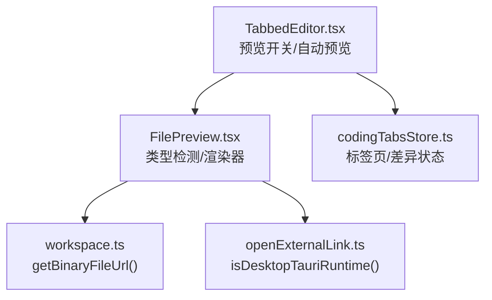
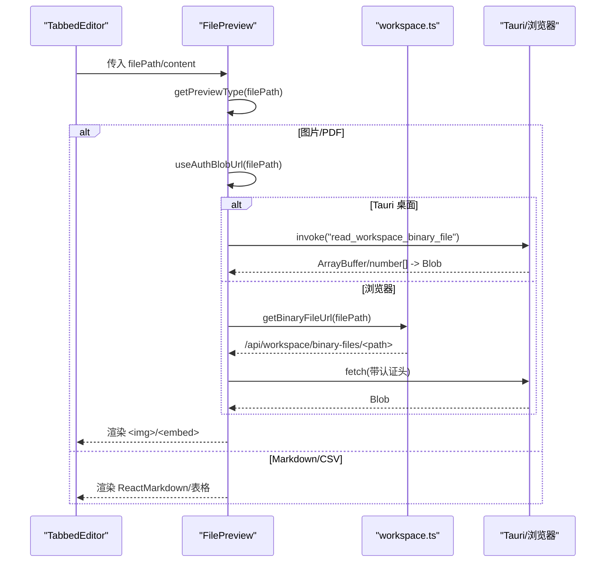
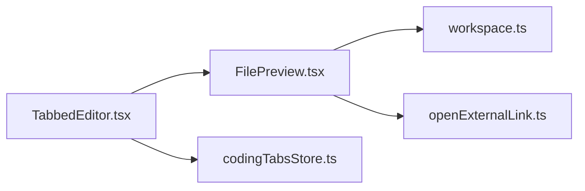

# 代码预览

<cite>
**本文引用的文件**
- [console/src/pages/Coding/FilePreview.tsx](file://console/src/pages/Coding/FilePreview.tsx)
- [console/src/pages/Coding/TabbedEditor.tsx](file://console/src/pages/Coding/TabbedEditor.tsx)
- [console/src/stores/codingTabsStore.ts](file://console/src/stores/codingTabsStore.ts)
- [console/src/api/modules/workspace.ts](file://console/src/api/modules/workspace.ts)
- [console/src/utils/openExternalLink.ts](file://console/src/utils/openExternalLink.ts)
</cite>

## 目录
1. [简介](#简介)
2. [项目结构](#项目结构)
3. [核心组件](#核心组件)
4. [架构总览](#架构总览)
5. [详细组件分析](#详细组件分析)
6. [依赖关系分析](#依赖关系分析)
7. [性能与优化](#性能与优化)
8. [故障排查指南](#故障排查指南)
9. [结论](#结论)
10. [附录：扩展指南](#附录扩展指南)

## 简介
本章节面向 QwenPaw 编码模式的“代码预览”能力，系统性梳理从文件类型检测、内容渲染、缩略图生成到预览模式切换的完整实现。重点覆盖以下方面：
- 支持的文件类型与渲染策略（图片、PDF、Markdown、CSV）
- 二进制文件的安全加载（认证头、Tauri 直读磁盘）
- 预览模式自动启用与用户手动切换
- 缓存机制与懒加载优化
- 安全沙箱隔离与跨域资源访问注意事项
- 常见问题定位与解决方案（大文件性能、内存占用、跨域限制等）

## 项目结构
与“代码预览”直接相关的前端模块主要位于 console 前端工程内，关键文件如下：
- FilePreview.tsx：预览渲染器与类型检测
- TabbedEditor.tsx：编辑器容器，负责预览开关、自动预览逻辑与 UI 交互
- codingTabsStore.ts：标签页状态持久化（仅路径与少量差异信息）
- workspace.ts：工作区 API（文本文件读写、二进制文件 URL、SSE 监听）
- openExternalLink.ts：运行时环境判断（用于 Tauri 直读本地文件）



图示来源
- [console/src/pages/Coding/TabbedEditor.tsx:263-336](file://console/src/pages/Coding/TabbedEditor.tsx#L263-L336)
- [console/src/pages/Coding/FilePreview.tsx:40-51](file://console/src/pages/Coding/FilePreview.tsx#L40-L51)
- [console/src/api/modules/workspace.ts:211-217](file://console/src/api/modules/workspace.ts#L211-L217)
- [console/src/utils/openExternalLink.ts:87-108](file://console/src/utils/openExternalLink.ts#L87-L108)
- [console/src/stores/codingTabsStore.ts:1-51](file://console/src/stores/codingTabsStore.ts#L1-L51)

章节来源
- [console/src/pages/Coding/FilePreview.tsx:40-51](file://console/src/pages/Coding/FilePreview.tsx#L40-L51)
- [console/src/pages/Coding/TabbedEditor.tsx:263-336](file://console/src/pages/Coding/TabbedEditor.tsx#L263-L336)
- [console/src/api/modules/workspace.ts:211-217](file://console/src/api/modules/workspace.ts#L211-L217)
- [console/src/utils/openExternalLink.ts:87-108](file://console/src/utils/openExternalLink.ts#L87-L108)
- [console/src/stores/codingTabsStore.ts:1-51](file://console/src/stores/codingTabsStore.ts#L1-L51)

## 核心组件
- 类型检测与可预览判定
  - getPreviewType(filePath): 根据扩展名返回 image/pdf/markdown/csv/none
  - isPreviewable(filePath): 是否为可预览文件
- 子渲染器
  - ImagePreview：通过 useAuthBlobUrl 获取 Blob URL 后以  展示
  - PdfPreview：使用 <embed> 嵌入 PDF
  - MarkdownPreview：基于 react-markdown + GFM，并集成语法高亮
  - CsvPreview：内置 CSV 解析器，限制最大行列数避免卡顿
- 认证与离线读取
  - useAuthBlobUrl：在 Tauri 环境下调用原生命令直接读取二进制；浏览器环境则通过后端 API 带认证头下载
  - guessMimeType：按扩展名推断 MIME 类型，确保 Blob 正确渲染

章节来源
- [console/src/pages/Coding/FilePreview.tsx:40-51](file://console/src/pages/Coding/FilePreview.tsx#L40-L51)
- [console/src/pages/Coding/FilePreview.tsx:92-166](file://console/src/pages/Coding/FilePreview.tsx#L92-L166)
- [console/src/pages/Coding/FilePreview.tsx:172-288](file://console/src/pages/Coding/FilePreview.tsx#L172-L288)

## 架构总览
下图展示了“代码预览”的整体数据流与控制流：
- 编辑器容器根据当前活动标签决定渲染“代码编辑器”还是“预览组件”
- 预览组件依据文件扩展名选择具体渲染器
- 二进制文件通过认证后的 Blob URL 或 Tauri 直读方式加载
- Markdown/CSV 使用文本内容渲染，受限于行数/列数以控制性能



图示来源
- [console/src/pages/Coding/TabbedEditor.tsx:964-968](file://console/src/pages/Coding/TabbedEditor.tsx#L964-L968)
- [console/src/pages/Coding/FilePreview.tsx:40-51](file://console/src/pages/Coding/FilePreview.tsx#L40-L51)
- [console/src/pages/Coding/FilePreview.tsx:92-166](file://console/src/pages/Coding/FilePreview.tsx#L92-L166)
- [console/src/api/modules/workspace.ts:211-217](file://console/src/api/modules/workspace.ts#L211-L217)

## 详细组件分析

### 类型检测与渲染策略
- 支持的扩展名
  - 图片：png/jpg/jpeg/gif/webp/svg/ico/bmp
  - PDF：pdf
  - Markdown：md/mdx
  - CSV：csv
- 渲染策略
  - 图片：构造 Blob URL 后用  渲染
  - PDF：使用 <embed> 内嵌
  - Markdown：react-markdown + remark-gfm，代码块使用 SyntaxHighlighter
  - CSV：自实现解析器，限制最大行/列，提供滚动容器

章节来源
- [console/src/pages/Coding/FilePreview.tsx:27-47](file://console/src/pages/Coding/FilePreview.tsx#L27-L47)
- [console/src/pages/Coding/FilePreview.tsx:172-288](file://console/src/pages/Coding/FilePreview.tsx#L172-L288)

#### 类图（渲染器与工具函数）
```mermaid
classDiagram
class FilePreview {
+props : {filePath, content}
+render() : JSX
}
class ImagePreview {
+props : {filePath}
+render() : JSX
}
class PdfPreview {
+props : {filePath}
+render() : JSX
}
class MarkdownPreview {
+props : {content}
+render() : JSX
}
class CsvPreview {
+props : {content}
+render() : JSX
}
class AuthBlobLoader {
+useAuthBlobUrl(filePath) : string|null
+guessMimeType(filePath) : string
}
FilePreview --> ImagePreview : "image"
FilePreview --> PdfPreview : "pdf"
FilePreview --> MarkdownPreview : "markdown"
FilePreview --> CsvPreview : "csv"
ImagePreview --> AuthBlobLoader : "uses"
PdfPreview --> AuthBlobLoader : "uses"
```

图示来源
- [console/src/pages/Coding/FilePreview.tsx:172-288](file://console/src/pages/Coding/FilePreview.tsx#L172-L288)
- [console/src/pages/Coding/FilePreview.tsx:92-166](file://console/src/pages/Coding/FilePreview.tsx#L92-L166)

### 预览模式切换与自动预览
- 自动预览：当打开新标签时，若文件属于可预览类型且用户未手动切换过，则自动进入预览模式
- 手动切换：通过“眼睛/代码”按钮切换预览与代码视图，并记录用户操作以避免被自动逻辑覆盖
- 清理策略：关闭标签时清理用户切换标记，防止内存泄漏并确保再次打开时恢复自动预览


图示来源
- [console/src/pages/Coding/TabbedEditor.tsx:263-336](file://console/src/pages/Coding/TabbedEditor.tsx#L263-L336)

章节来源
- [console/src/pages/Coding/TabbedEditor.tsx:263-336](file://console/src/pages/Coding/TabbedEditor.tsx#L263-L336)

### 二进制文件加载与安全
- 认证与跨域
  - 浏览器模式：通过 workspaceApi.getBinaryFileUrl 拼接后端地址，fetch 时附加认证头
  - Tauri 桌面模式：调用原生命令 read_workspace_binary_file 直接读取磁盘，无需 HTTP
- 类型推断
  - 根据扩展名映射 MIME 类型，确保 /<embed> 正确识别
- 兼容性处理
  - macOS Tauri 2.11.1 可能将 Vec<u8> 序列化为 number[]，统一转换为 Uint8Array 再构建 Blob

章节来源
- [console/src/pages/Coding/FilePreview.tsx:92-166](file://console/src/pages/Coding/FilePreview.tsx#L92-L166)
- [console/src/api/modules/workspace.ts:211-217](file://console/src/api/modules/workspace.ts#L211-L217)
- [console/src/utils/openExternalLink.ts:87-108](file://console/src/utils/openExternalLink.ts#L87-L108)

### Markdown 与 CSV 渲染细节
- Markdown
  - 启用 GFM 插件
  - 代码块使用 SyntaxHighlighter，主题 oneDark，字号与行高适配预览区域
- CSV
  - 自定义解析器，支持引号转义
  - 限制最大行/列，超出部分显示提示，并提供滚动容器

章节来源
- [console/src/pages/Coding/FilePreview.tsx:199-288](file://console/src/pages/Coding/FilePreview.tsx#L199-L288)

### 预览缓存与懒加载
- 文本文件缓存
  - loadCodeFile 优先返回内存缓存；否则发起请求并将响应写入缓存（含 ETag）
  - 保存后失效对应缓存项，下次读取重新拉取
- 二进制文件
  - 每次预览都会创建新的 Blob URL，并在组件卸载时释放，避免内存泄漏
- 懒加载
  - 仅在需要时触发 useAuthBlobUrl 或 Markdown/CSV 解析，减少不必要的计算

章节来源
- [console/src/api/modules/workspace.ts:151-202](file://console/src/api/modules/workspace.ts#L151-L202)
- [console/src/pages/Coding/FilePreview.tsx:92-149](file://console/src/pages/Coding/FilePreview.tsx#L92-L149)

### 标签页与差异状态（与预览联动）
- 标签页持久化
  - 仅持久化路径列表与少量差异信息（original 大小受限），内容不持久化，避免 localStorage 配额问题
- 差异状态
  - 当外部修改打开的文件时，会触发差异对比；保留 original/modified 以便用户“保留/撤销”

章节来源
- [console/src/stores/codingTabsStore.ts:1-216](file://console/src/stores/codingTabsStore.ts#L1-L216)

## 依赖关系分析
- 组件耦合
  - TabbedEditor 依赖 FilePreview 进行预览渲染，并通过 isPreviewable 控制自动预览
  - FilePreview 依赖 workspace.ts 获取二进制 URL，依赖 openExternalLink.ts 判断运行环境
- 外部依赖
  - react-markdown、remark-gfm、react-syntax-highlighter 用于 Markdown 渲染
  - @monaco-editor/react 用于代码编辑与差异对比（非预览渲染）
  - zustand 用于状态管理（标签页与差异）



图示来源
- [console/src/pages/Coding/TabbedEditor.tsx:263-336](file://console/src/pages/Coding/TabbedEditor.tsx#L263-L336)
- [console/src/pages/Coding/FilePreview.tsx:40-51](file://console/src/pages/Coding/FilePreview.tsx#L40-L51)
- [console/src/api/modules/workspace.ts:211-217](file://console/src/api/modules/workspace.ts#L211-L217)
- [console/src/utils/openExternalLink.ts:87-108](file://console/src/utils/openExternalLink.ts#L87-L108)
- [console/src/stores/codingTabsStore.ts:1-51](file://console/src/stores/codingTabsStore.ts#L1-L51)

章节来源
- [console/src/pages/Coding/TabbedEditor.tsx:263-336](file://console/src/pages/Coding/TabbedEditor.tsx#L263-L336)
- [console/src/pages/Coding/FilePreview.tsx:40-51](file://console/src/pages/Coding/FilePreview.tsx#L40-L51)
- [console/src/api/modules/workspace.ts:211-217](file://console/src/api/modules/workspace.ts#L211-L217)
- [console/src/utils/openExternalLink.ts:87-108](file://console/src/utils/openExternalLink.ts#L87-L108)
- [console/src/stores/codingTabsStore.ts:1-51](file://console/src/stores/codingTabsStore.ts#L1-L51)

## 性能与优化
- 大文件预览
  - CSV 限制最大行/列，避免 DOM 节点过多导致卡顿
  - 图片/PDF 采用 Blob URL 渲染，避免将大文件转为 base64 字符串
- 内存占用控制
  - 组件卸载时释放 Blob URL，防止内存泄漏
  - 标签页持久化不包含文件内容，降低存储压力
- 懒加载
  - 仅在需要时触发二进制加载与文本解析
- 网络优化
  - 文本文件读取利用 ETag 与浏览器 HTTP 缓存，减少重复传输

[本节为通用指导，不直接分析具体文件]

## 故障排查指南
- 图片/PDF 无法显示
  - 检查后端二进制接口是否可达，以及认证头是否正确传递
  - 在 Tauri 模式下确认原生命令可用
- 跨域资源访问失败
  - 浏览器模式下需确保后端允许同源或配置 CORS
  - 使用 getBinaryFileUrl 拼接的地址应包含认证头
- 大 CSV 卡顿
  - 确认已启用行列限制，必要时进一步降低阈值
- Markdown 代码块样式异常
  - 检查 SyntaxHighlighter 主题与语言匹配

章节来源
- [console/src/pages/Coding/FilePreview.tsx:92-166](file://console/src/pages/Coding/FilePreview.tsx#L92-L166)
- [console/src/api/modules/workspace.ts:211-217](file://console/src/api/modules/workspace.ts#L211-L217)

## 结论
QwenPaw 的代码预览功能通过清晰的类型检测、安全的二进制加载与高效的渲染策略，实现了多格式文件的无缝预览。结合自动预览与用户手动切换，既保证了易用性，也兼顾了性能与安全性。通过缓存与懒加载优化，系统在大规模文件场景下仍保持良好体验。

[本节为总结，不直接分析具体文件]

## 附录：扩展指南

### 添加新的文件类型支持
步骤概览：
- 在类型检测中新增扩展名映射
- 新增对应的子渲染器（如 VideoPreview）
- 在主组件中分支渲染新类型
- 如需二进制加载，复用 useAuthBlobUrl 与 guessMimeType

参考位置
- 类型检测与可预览判定：[console/src/pages/Coding/FilePreview.tsx:40-51](file://console/src/pages/Coding/FilePreview.tsx#L40-L51)
- 子渲染器示例（图片/PDF/Markdown/CSV）：[console/src/pages/Coding/FilePreview.tsx:172-288](file://console/src/pages/Coding/FilePreview.tsx#L172-L288)
- 二进制加载与 MIME 推断：[console/src/pages/Coding/FilePreview.tsx:92-166](file://console/src/pages/Coding/FilePreview.tsx#L92-L166)

### 自定义预览样式
- 调整 Markdown 代码块样式（字体、行高、圆角等）
- 为 CSV 表格增加排序/筛选等交互（注意性能影响）
- 为图片增加缩放/平移控件（建议使用轻量库，避免阻塞主线程）

参考位置
- Markdown 组件与样式：[console/src/pages/Coding/FilePreview.tsx:199-241](file://console/src/pages/Coding/FilePreview.tsx#L199-L241)
- CSV 组件与限制：[console/src/pages/Coding/FilePreview.tsx:243-288](file://console/src/pages/Coding/FilePreview.tsx#L243-L288)

### 扩展预览功能
- 视频播放器集成
  - 新增 VideoPreview 渲染器，使用 HTML5 <video> 或第三方播放器
  - 复用 useAuthBlobUrl 获取媒体 Blob URL
  - 考虑字幕、封面图与播放进度缓存
- 缩略图生成
  - 对于大图片或长文档，可在后端生成缩略图，前端按需加载
  - 或使用 Canvas/WebAssembly 在前端生成小尺寸预览图

参考位置
- 二进制加载与 MIME 推断：[console/src/pages/Coding/FilePreview.tsx:92-166](file://console/src/pages/Coding/FilePreview.tsx#L92-L166)
- 二进制文件 URL 生成：[console/src/api/modules/workspace.ts:211-217](file://console/src/api/modules/workspace.ts#L211-L217)