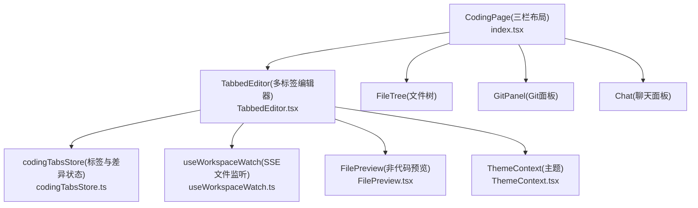
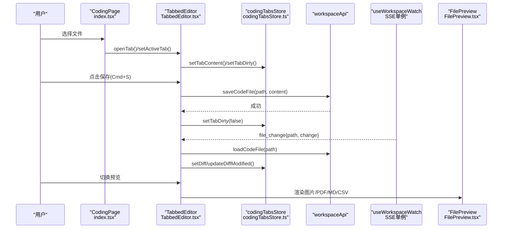
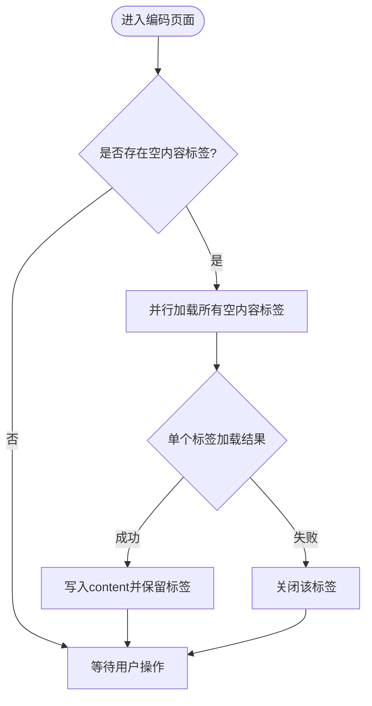
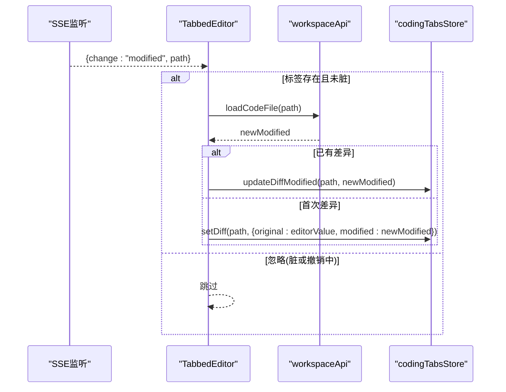
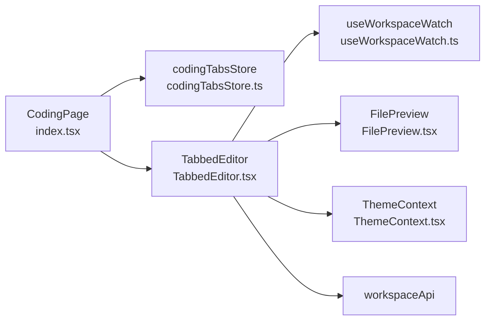

# 多标签编辑器

<cite>
**本文引用的文件**   
- [index.tsx](file://console/src/pages/Coding/index.tsx)
- [TabbedEditor.tsx](file://console/src/pages/Coding/TabbedEditor.tsx)
- [codingTabsStore.ts](file://console/src/stores/codingTabsStore.ts)
- [codingModeStore.ts](file://console/src/stores/codingModeStore.ts)
- [FilePreview.tsx](file://console/src/pages/Coding/FilePreview.tsx)
- [useWorkspaceWatch.ts](file://console/src/hooks/useWorkspaceWatch.ts)
- [ThemeContext.tsx](file://console/src/contexts/ThemeContext.tsx)
</cite>

## 目录
1. [简介](#简介)
2. [项目结构](#项目结构)
3. [核心组件](#核心组件)
4. [架构总览](#架构总览)
5. [详细组件分析](#详细组件分析)
6. [依赖关系分析](#依赖关系分析)
7. [性能与内存管理](#性能与内存管理)
8. [故障排查指南](#故障排查指南)
9. [结论](#结论)
10. [附录：扩展与自定义](#附录扩展与自定义)

## 简介
本文件面向 QwenPaw 编码模式下的“多标签编辑器”，系统性阐述其实现细节与最佳实践，覆盖以下关键能力：
- 标签页管理：打开、关闭、切换、脏标记、差异提示
- 内容同步：基于 SSE 的文件变更监听与内联 Diff 展示
- 撤销重做：Monaco 模型级撤销栈（按路径隔离）
- 语法高亮：基于扩展名的语言映射与 TS/JSX 诊断配置
- Monaco Editor 集成：普通编辑与内联 Diff 双模式
- 状态持久化：按 Agent 维度持久化标签列表与待处理差异
- 键盘快捷键：保存快捷键、复制增强到聊天输入框
- 预览模式：图片、PDF、Markdown、CSV 的渲染
- 生命周期与内存管理：实例创建/销毁、视图区清理、对象 URL 释放
- 性能优化：SSE 单例连接、增量更新、大文件限制、懒加载策略
- 常见问题：大文件加载、崩溃恢复、协作冲突处理思路

## 项目结构
编码模式页面采用三栏布局：左侧资源管理器/Git面板、中间多标签编辑器、右侧聊天面板。编辑器内部以标签条 + 工具栏 + 编辑器区域组织，支持预览与内联差异对比。

图表来源
- [index.tsx:1-266](file://console/src/pages/Coding/index.tsx#L1-L266)
- [TabbedEditor.tsx:1-1061](file://console/src/pages/Coding/TabbedEditor.tsx#L1-L1061)
- [codingTabsStore.ts:1-239](file://console/src/stores/codingTabsStore.ts#L1-L239)
- [useWorkspaceWatch.ts:1-148](file://console/src/hooks/useWorkspaceWatch.ts#L1-L148)
- [FilePreview.tsx:1-309](file://console/src/pages/Coding/FilePreview.tsx#L1-L309)
- [ThemeContext.tsx:1-105](file://console/src/contexts/ThemeContext.tsx#L1-L105)

章节来源
- [index.tsx:1-266](file://console/src/pages/Coding/index.tsx#L1-L266)

## 核心组件
- CodingPage：负责三栏布局、左右面板显隐、Agent 切换时的标签水合（从磁盘重新加载已打开但内容为空的标签）。
- TabbedEditor：核心编辑器容器，维护标签、预览模式、内联差异、保存、复制增强、快捷键等。
- codingTabsStore：Zustand 存储，按 Agent 维度持久化标签路径、活跃标签、待处理差异（original/modified），并控制持久化体积。
- useWorkspaceWatch：模块级单例 SSE 订阅，统一分发文件变更事件。
- FilePreview：非代码文件预览（图片/PDF/Markdown/CSV），含认证二进制读取与 Tauri 直读。
- ThemeContext：提供 light/dark/system 主题解析，驱动 Monaco 主题切换。

章节来源
- [index.tsx:1-266](file://console/src/pages/Coding/index.tsx#L1-L266)
- [TabbedEditor.tsx:1-1061](file://console/src/pages/Coding/TabbedEditor.tsx#L1-L1061)
- [codingTabsStore.ts:1-239](file://console/src/stores/codingTabsStore.ts#L1-L239)
- [useWorkspaceWatch.ts:1-148](file://console/src/hooks/useWorkspaceWatch.ts#L1-L148)
- [FilePreview.tsx:1-309](file://console/src/pages/Coding/FilePreview.tsx#L1-L309)
- [ThemeContext.tsx:1-105](file://console/src/contexts/ThemeContext.tsx#L1-L105)

## 架构总览
下图展示了从用户操作到后端数据流的关键路径，包括标签切换、保存、差异合并、SSE 监听与预览渲染。

图表来源
- [index.tsx:62-144](file://console/src/pages/Coding/index.tsx#L62-L144)
- [TabbedEditor.tsx:590-815](file://console/src/pages/Coding/TabbedEditor.tsx#L590-L815)
- [codingTabsStore.ts:60-216](file://console/src/stores/codingTabsStore.ts#L60-L216)
- [useWorkspaceWatch.ts:124-148](file://console/src/hooks/useWorkspaceWatch.ts#L124-L148)
- [FilePreview.tsx:92-149](file://console/src/pages/Coding/FilePreview.tsx#L92-L149)

## 详细组件分析

### 标签页管理与状态持久化
- 标签数据结构：每个标签包含 path、content、dirty；按 Agent 维度隔离。
- 持久化策略：仅持久化路径列表与较小 original 差异（大小上限），不持久化 content 与 dirty，避免 localStorage 超限。
- 水合流程：应用启动或 Agent 切换时，对 content 为空的标签调用 workspaceApi.loadCodeFile 回填内容；若文件不存在则关闭该标签。
- 活跃标签：记录当前 Agent 的 activeTabPath，用于渲染与命令绑定。

图表来源
- [index.tsx:69-103](file://console/src/pages/Coding/index.tsx#L69-L103)
- [codingTabsStore.ts:190-216](file://console/src/stores/codingTabsStore.ts#L190-L216)

章节来源
- [index.tsx:62-144](file://console/src/pages/Coding/index.tsx#L62-L144)
- [codingTabsStore.ts:1-239](file://console/src/stores/codingTabsStore.ts#L1-L239)

### 内容同步与内联差异
- 文件变更监听：通过 useWorkspaceWatch 的单例 SSE 连接接收 file_change 事件，去重与指数退避重试。
- 差异计算：当未处于脏状态且非“正在撤销”时，拉取最新文件内容并与当前编辑器内容比较，生成 pending diff（original/modified）。
- 内联 Diff 展示：使用 DiffEditor 的 renderSideBySide=false 呈现 VS Code 风格内联差异，并在每段变更处叠加 Keep/Undo 按钮。
- 局部操作：
  - Keep all：接受全部修改，清除差异。
  - Undo all：回滚至 original 并写回磁盘。
  - Keep hunk / Undo hunk：逐块合并或回滚，必要时更新 original/modified 并持久化。

图表来源
- [useWorkspaceWatch.ts:124-148](file://console/src/hooks/useWorkspaceWatch.ts#L124-L148)
- [TabbedEditor.tsx:768-815](file://console/src/pages/Coding/TabbedEditor.tsx#L768-L815)
- [codingTabsStore.ts:135-188](file://console/src/stores/codingTabsStore.ts#L135-L188)

章节来源
- [TabbedEditor.tsx:768-815](file://console/src/pages/Coding/TabbedEditor.tsx#L768-L815)
- [useWorkspaceWatch.ts:1-148](file://console/src/hooks/useWorkspaceWatch.ts#L1-L148)

### 撤销重做与光标历史
- 撤销重做：由 Monaco 模型维护，每个 path 对应独立模型，切换标签时自动保持光标位置与撤销栈。
- 光标与选择：监听 onDidChangeCursorSelection 以判断是否有选区，影响“复制到聊天”的行为。

章节来源
- [TabbedEditor.tsx:441-455](file://console/src/pages/Coding/TabbedEditor.tsx#L441-L455)

### 语法高亮与语言支持
- 语言映射：根据扩展名映射到 Monaco 内置语言（如 py→python、ts/tsx→typescript、json→json、yaml/yml→yaml、md→markdown、sh/bash→shell、html/css/less/scss、sql、toml→ini、rs→rust、go→go、java→java、cpp/c/h→c、kt→kotlin、rb→ruby）。
- TS/JSX 诊断：在 beforeMount 中设置编译器选项与诊断开关，启用 JSX 与 Node 模块解析。

章节来源
- [TabbedEditor.tsx:67-97](file://console/src/pages/Coding/TabbedEditor.tsx#L67-L97)
- [TabbedEditor.tsx:428-439](file://console/src/pages/Coding/TabbedEditor.tsx#L428-L439)

### 预览模式与非代码文件渲染
- 支持类型：图片（png/jpg/jpeg/gif/webp/svg/ico/bmp）、PDF、Markdown（GFM+代码高亮）、CSV（带行列截断提示）。
- 认证与离线：浏览器端通过带鉴权头的 fetch 获取二进制；Tauri 桌面端直接读取工作区文件，无需网络。
- 对象 URL 管理：组件卸载时释放 URL，防止内存泄漏。

章节来源
- [FilePreview.tsx:27-51](file://console/src/pages/Coding/FilePreview.tsx#L27-L51)
- [FilePreview.tsx:92-149](file://console/src/pages/Coding/FilePreview.tsx#L92-L149)
- [FilePreview.tsx:172-197](file://console/src/pages/Coding/FilePreview.tsx#L172-L197)
- [FilePreview.tsx:230-241](file://console/src/pages/Coding/FilePreview.tsx#L230-L241)
- [FilePreview.tsx:246-288](file://console/src/pages/Coding/FilePreview.tsx#L246-L288)

### 键盘快捷键与复制增强
- 保存快捷键：Cmd/Ctrl+S 触发保存，禁用态与 loading 态保护。
- 复制增强：捕获编辑器内的 copy 事件，识别整文件/整行/部分选区，将路径与行号范围注入聊天输入框；原生 Cmd/Ctrl+C 仍复制纯文本。

章节来源
- [TabbedEditor.tsx:607-615](file://console/src/pages/Coding/TabbedEditor.tsx#L607-L615)
- [TabbedEditor.tsx:468-503](file://console/src/pages/Coding/TabbedEditor.tsx#L468-L503)

### 主题与 Monaco 集成
- 主题来源：ThemeContext 提供 isDark，驱动 HTML 类名与全局样式。
- Monaco 主题：根据 isDark 切换 vs-dark/light；TS/JSX 诊断在 beforeMount 中配置。

章节来源
- [ThemeContext.tsx:51-105](file://console/src/contexts/ThemeContext.tsx#L51-L105)
- [TabbedEditor.tsx:428-439](file://console/src/pages/Coding/TabbedEditor.tsx#L428-L439)
- [TabbedEditor.tsx:979-992](file://console/src/pages/Coding/TabbedEditor.tsx#L979-L992)

## 依赖关系分析
- 组件耦合：
  - CodingPage 依赖 codingTabsStore 与 agentStore，负责路由与面板显隐。
  - TabbedEditor 依赖 codingTabsStore、useWorkspaceWatch、workspaceApi、ThemeContext、FilePreview。
  - FilePreview 依赖 workspaceApi 与 Tauri invoke（可选）。
- 外部依赖：
  - @monaco-editor/react 与 monaco-editor：编辑器与差异对比。
  - zustand + persist：状态持久化。
  - react-markdown、remark-gfm、react-syntax-highlighter：Markdown 渲染与代码高亮。
  - antd Tooltip/Badge：UI 交互提示。
  - lucide-react：图标。

图表来源
- [index.tsx:1-266](file://console/src/pages/Coding/index.tsx#L1-L266)
- [TabbedEditor.tsx:1-1061](file://console/src/pages/Coding/TabbedEditor.tsx#L1-L1061)
- [codingTabsStore.ts:1-239](file://console/src/stores/codingTabsStore.ts#L1-L239)
- [useWorkspaceWatch.ts:1-148](file://console/src/hooks/useWorkspaceWatch.ts#L1-L148)
- [FilePreview.tsx:1-309](file://console/src/pages/Coding/FilePreview.tsx#L1-L309)
- [ThemeContext.tsx:1-105](file://console/src/contexts/ThemeContext.tsx#L1-L105)

章节来源
- [index.tsx:1-266](file://console/src/pages/Coding/index.tsx#L1-L266)
- [TabbedEditor.tsx:1-1061](file://console/src/pages/Coding/TabbedEditor.tsx#L1-L1061)

## 性能与内存管理
- SSE 单例连接：模块级 _listeners 集合与 _controller 保证全局唯一连接，无监听者时自动断开，降低连接开销。
- 增量更新：差异仅在 modified 变化时更新，避免重复渲染。
- 视图区与 DOM：
  - 使用 Monaco view zones 为差异区块预留空间，React 层绝对定位叠加按钮，避免 Monaco 内部 DOM 事件拦截问题。
  - 差异消失时清理 zoneIds 与 diffEditor 引用，防止悬挂引用。
- 对象 URL 释放：FilePreview 在卸载时 revokeObjectURL，避免内存泄漏。
- 持久化体积控制：
  - 仅持久化路径与 small original 差异（ORIGINAL_DIFF_SIZE_LIMIT=256KB），modified 侧在重连后按需拉取。
- 预览裁剪：
  - CSV 最大行数与列数限制，避免超大表格导致 UI 卡顿。
- 大文件建议：
  - 开启 minimap 关闭、滚动 beyondLastLine 关闭、wordWrap 关闭以减少渲染压力。
  - 对超大文件可考虑分页加载或虚拟滚动（需后端配合）。

章节来源
- [useWorkspaceWatch.ts:28-118](file://console/src/hooks/useWorkspaceWatch.ts#L28-L118)
- [TabbedEditor.tsx:515-588](file://console/src/pages/Coding/TabbedEditor.tsx#L515-L588)
- [TabbedEditor.tsx:760-766](file://console/src/pages/Coding/TabbedEditor.tsx#L760-L766)
- [FilePreview.tsx:139-146](file://console/src/pages/Coding/FilePreview.tsx#L139-L146)
- [codingTabsStore.ts:20-21](file://console/src/stores/codingTabsStore.ts#L20-L21)
- [codingTabsStore.ts:201-213](file://console/src/stores/codingTabsStore.ts#L201-L213)
- [FilePreview.tsx:243-245](file://console/src/pages/Coding/FilePreview.tsx#L243-L245)
- [TabbedEditor.tsx:982-992](file://console/src/pages/Coding/TabbedEditor.tsx#L982-L992)

## 故障排查指南
- 标签内容丢失
  - 现象：刷新后标签仍在但内容为空。
  - 原因：持久化不包含 content，需要水合。
  - 解决：确保 index.tsx 的水合逻辑执行；检查 workspaceApi.loadCodeFile 返回与错误分支。
  - 参考路径
    - [index.tsx:69-103](file://console/src/pages/Coding/index.tsx#L69-L103)
- 差异未显示或反复出现
  - 现象：文件被外部修改但未显示差异，或撤销后立即再次出现差异。
  - 原因：脏标记未清除、撤销写入期间未屏蔽 watcher。
  - 解决：确认 handleSave 与 handleUndoHunk 中的 undoInProgressRef 与 setTabDirty 调用顺序。
  - 参考路径
    - [TabbedEditor.tsx:592-605](file://console/src/pages/Coding/TabbedEditor.tsx#L592-L605)
    - [TabbedEditor.tsx:723-755](file://console/src/pages/Coding/TabbedEditor.tsx#L723-L755)
- 复制增强无效
  - 现象：粘贴到聊天框不是路径+行号格式。
  - 原因：copy 事件未来自编辑器或未聚焦。
  - 解决：确认 document-level capture 监听与 hasTextFocus 判断。
  - 参考路径
    - [TabbedEditor.tsx:468-503](file://console/src/pages/Coding/TabbedEditor.tsx#L468-L503)
- 预览无法加载
  - 现象：图片或 PDF 空白。
  - 原因：Tauri 直读失败或 HTTP 鉴权头缺失。
  - 解决：检查 isDesktopTauriRuntime 分支与 buildAuthHeaders；确认 MIME 猜测正确。
  - 参考路径
    - [FilePreview.tsx:92-149](file://console/src/pages/Coding/FilePreview.tsx#L92-L149)
    - [FilePreview.tsx:152-166](file://console/src/pages/Coding/FilePreview.tsx#L152-L166)
- 主题不生效
  - 现象：编辑器主题未随系统或用户设置切换。
  - 原因：isDark 未更新或 theme 参数未传入。
  - 解决：确认 ThemeContext 的 isDark 与 TabbedEditor 的 theme 绑定。
  - 参考路径
    - [ThemeContext.tsx:51-105](file://console/src/contexts/ThemeContext.tsx#L51-L105)
    - [TabbedEditor.tsx:979-992](file://console/src/pages/Coding/TabbedEditor.tsx#L979-L992)

章节来源
- [index.tsx:69-103](file://console/src/pages/Coding/index.tsx#L69-L103)
- [TabbedEditor.tsx:592-605](file://console/src/pages/Coding/TabbedEditor.tsx#L592-L605)
- [TabbedEditor.tsx:723-755](file://console/src/pages/Coding/TabbedEditor.tsx#L723-L755)
- [TabbedEditor.tsx:468-503](file://console/src/pages/Coding/TabbedEditor.tsx#L468-L503)
- [FilePreview.tsx:92-149](file://console/src/pages/Coding/FilePreview.tsx#L92-L149)
- [ThemeContext.tsx:51-105](file://console/src/contexts/ThemeContext.tsx#L51-L105)

## 结论
QwenPaw 的多标签编辑器以 Zustand 为中心状态源，结合 Monaco 的强大能力与 SSE 实时同步，实现了接近 IDE 的体验。通过严格的持久化策略、视图区叠加方案与对象 URL 管理，兼顾了功能完整性与性能稳定性。对于更大规模的使用场景，可在后端配合下引入分页与增量传输，进一步提升大文件体验。

## 附录：扩展与自定义
- 自定义编辑器主题
  - 在 ThemeContext 中新增主题模式，并将 isDark 映射到 Monaco 主题名称；在 TabbedEditor 的 Editor/DiffEditor 上动态传入 theme。
  - 参考路径
    - [ThemeContext.tsx:51-105](file://console/src/contexts/ThemeContext.tsx#L51-L105)
    - [TabbedEditor.tsx:979-992](file://console/src/pages/Coding/TabbedEditor.tsx#L979-L992)
- 添加新的语言支持
  - 在 getLanguage 中增加扩展名到语言的映射；如需额外语言包，在 beforeMount 中注册语言定义或加载语言资源。
  - 参考路径
    - [TabbedEditor.tsx:67-97](file://console/src/pages/Coding/TabbedEditor.tsx#L67-L97)
    - [TabbedEditor.tsx:428-439](file://console/src/pages/Coding/TabbedEditor.tsx#L428-L439)
- 扩展编辑器功能
  - 在 TabbedEditor 的工具栏中添加新按钮，复用 detectCopyMode/formatSelectionForChat 将上下文注入聊天输入框。
  - 参考路径
    - [TabbedEditor.tsx:114-173](file://console/src/pages/Coding/TabbedEditor.tsx#L114-L173)
    - [TabbedEditor.tsx:619-637](file://console/src/pages/Coding/TabbedEditor.tsx#L619-L637)
- 协作编辑冲突解决思路
  - 利用 SSE 事件与 pending diff 机制，对同一文件的并发修改进行累积合并；Keep/Undo hunk 提供细粒度决策。
  - 参考路径
    - [TabbedEditor.tsx:694-755](file://console/src/pages/Coding/TabbedEditor.tsx#L694-L755)
    - [useWorkspaceWatch.ts:124-148](file://console/src/hooks/useWorkspaceWatch.ts#L124-L148)