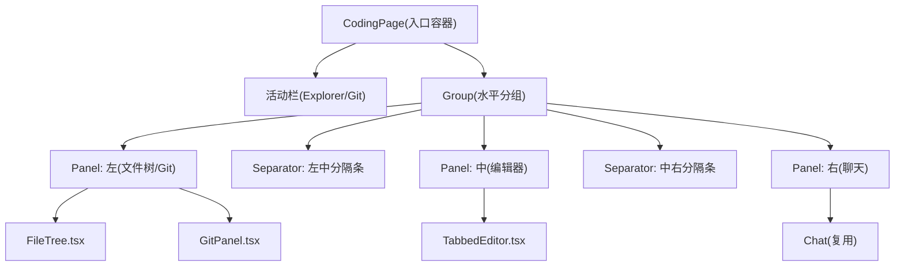
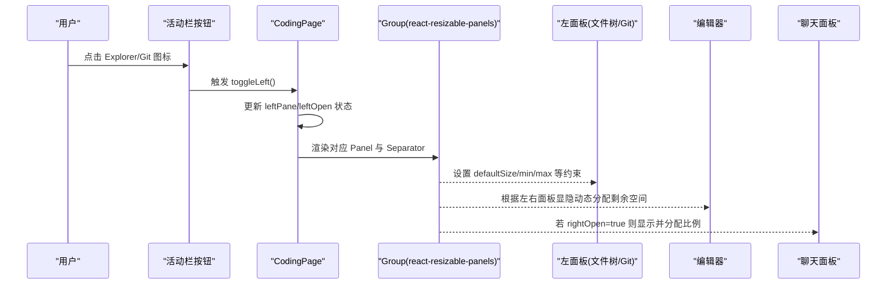
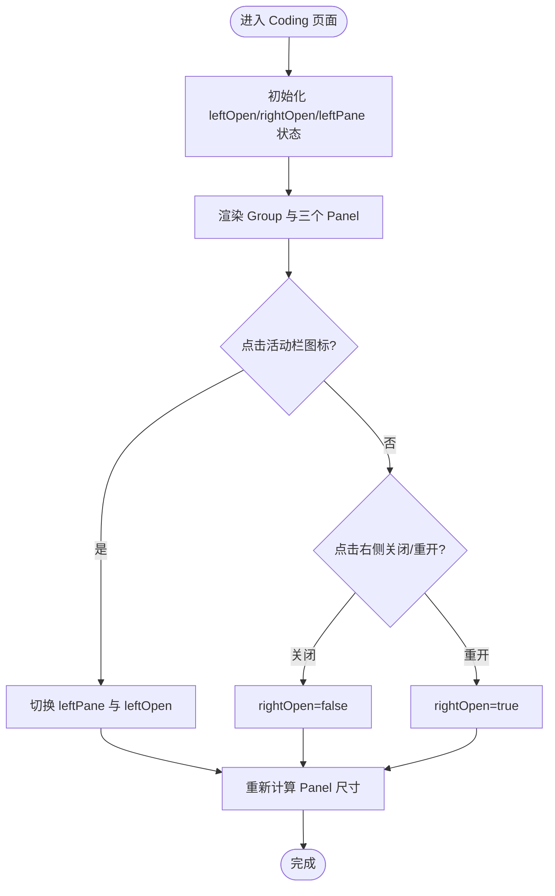
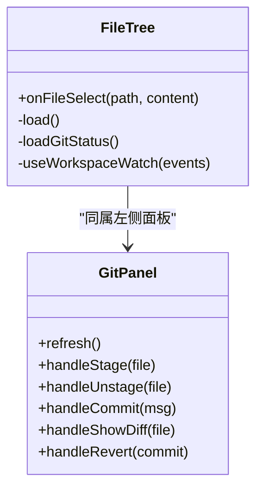
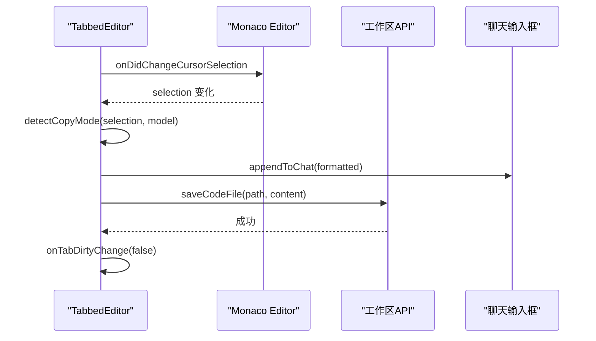
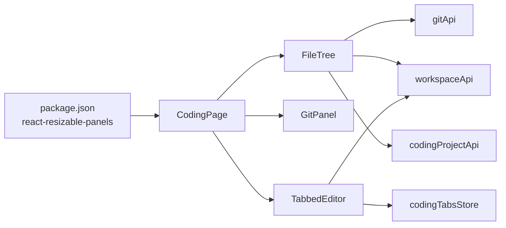

# 布局系统

<cite>
**本文引用的文件列表**
- [console/src/pages/Coding/index.tsx](file://console/src/pages/Coding/index.tsx)
- [console/src/pages/Coding/index.module.less](file://console/src/pages/Coding/index.module.less)
- [console/src/pages/Coding/FileTree.tsx](file://console/src/pages/Coding/FileTree.tsx)
- [console/src/pages/Coding/GitPanel.tsx](file://console/src/pages/Coding/GitPanel.tsx)
- [console/src/pages/Coding/TabbedEditor.tsx](file://console/src/pages/Coding/TabbedEditor.tsx)
- [console/src/hooks/useIsMobile.ts](file://console/src/hooks/useIsMobile.ts)
- [console/package.json](file://console/package.json)
</cite>

## 目录
1. [简介](#简介)
2. [项目结构](#项目结构)
3. [核心组件](#核心组件)
4. [架构总览](#架构总览)
5. [详细组件分析](#详细组件分析)
6. [依赖关系分析](#依赖关系分析)
7. [性能与体验优化](#性能与体验优化)
8. [常见问题与排障](#常见问题与排障)
9. [结论](#结论)
10. [附录：扩展指南](#附录扩展指南)

## 简介
本章节面向 QwenPaw 编码模式的“三栏可调整布局”系统，系统性说明左侧文件树/Git面板、中间编辑器区域和右侧聊天面板的响应式实现。重点覆盖：
- 使用 react-resizable-panels 构建可拖拽分隔条与面板尺寸管理
- 活动栏图标切换（Explorer / Source Control）与左右面板显隐控制
- 工作区容器的自适应计算与分隔条交互细节
- 移动端适配策略与断点处理
- 布局状态持久化方案与最佳实践
- 自定义面板行为、新增侧边栏组件、调整布局比例的实操方法
- 常见问题定位与优化建议

## 项目结构
编码模式页面位于 console/src/pages/Coding 下，核心由一个入口容器组织三栏布局，并组合多个子组件：
- 入口容器：负责整体布局、活动栏、面板显隐、默认比例等
- 左侧面板：文件树与 Git 面板通过活动栏切换
- 中间区域：多标签编辑器（Monaco），支持保存、预览、差异对比等
- 右侧面板：聊天面板，可隐藏并通过浮动按钮重新打开

图表来源
- [console/src/pages/Coding/index.tsx:1-266](file://console/src/pages/Coding/index.tsx#L1-L266)
- [console/src/pages/Coding/FileTree.tsx:1-475](file://console/src/pages/Coding/FileTree.tsx#L1-L475)
- [console/src/pages/Coding/GitPanel.tsx:1-649](file://console/src/pages/Coding/GitPanel.tsx#L1-L649)
- [console/src/pages/Coding/TabbedEditor.tsx:1-800](file://console/src/pages/Coding/TabbedEditor.tsx#L1-L800)

章节来源
- [console/src/pages/Coding/index.tsx:1-266](file://console/src/pages/Coding/index.tsx#L1-L266)
- [console/src/pages/Coding/index.module.less:1-249](file://console/src/pages/Coding/index.module.less#L1-L249)

## 核心组件
- CodingPage：三栏布局编排、活动栏切换、默认尺寸计算、右侧聊天面板显隐与重开按钮
- FileTree：文件树展示、Git 状态装饰、SSE 增量刷新、大文件提示
- GitPanel：分支切换、变更列表、暂存/反暂存、提交、历史日志、diff 查看
- TabbedEditor：多标签编辑、保存、预览模式、差异对比（行级 Keep/Undo）、复制上下文到聊天
- useIsMobile：移动端断点判断 Hook（当前未直接用于布局，但可作为响应式扩展基础）

章节来源
- [console/src/pages/Coding/index.tsx:1-266](file://console/src/pages/Coding/index.tsx#L1-L266)
- [console/src/pages/Coding/FileTree.tsx:1-475](file://console/src/pages/Coding/FileTree.tsx#L1-L475)
- [console/src/pages/Coding/GitPanel.tsx:1-649](file://console/src/pages/Coding/GitPanel.tsx#L1-L649)
- [console/src/pages/Coding/TabbedEditor.tsx:1-800](file://console/src/pages/Coding/TabbedEditor.tsx#L1-L800)
- [console/src/hooks/useIsMobile.ts:1-26](file://console/src/hooks/useIsMobile.ts#L1-L26)

## 架构总览
编码模式采用“活动栏 + 可调整三栏”的 VS Code 风格布局。左侧面板可在“文件树”和“Git”之间切换；中间为编辑器；右侧为聊天面板，可隐藏后通过浮动按钮恢复。

图表来源
- [console/src/pages/Coding/index.tsx:148-246](file://console/src/pages/Coding/index.tsx#L148-L246)

## 详细组件分析

### 入口容器：CodingPage
- 功能要点
  - 使用 Group 定义水平方向的可调整布局
  - 左侧 Panel 在“文件树”和“Git”间切换，通过活动栏图标控制
  - 中间 Panel 根据左右面板是否展开，动态计算 defaultSize
  - 右侧 Panel 可关闭，提供浮动按钮重新打开，并在 Badge 上显示脏标签数量
- 关键实现
  - 活动栏按钮：Explorer 与 Source Control 两个图标，分别控制 leftPane 与 leftOpen
  - 默认尺寸：当左右都展开时，中间占约 35%；仅一侧展开时约 70%；两侧均收起时为 100%
  - 右侧面板：header 包含标题与关闭按钮；body 内嵌 Chat 组件
  - 浮动重开按钮：当右侧面板隐藏时显示，点击恢复显示

图表来源
- [console/src/pages/Coding/index.tsx:45-147](file://console/src/pages/Coding/index.tsx#L45-L147)
- [console/src/pages/Coding/index.tsx:148-266](file://console/src/pages/Coding/index.tsx#L148-L266)

章节来源
- [console/src/pages/Coding/index.tsx:1-266](file://console/src/pages/Coding/index.tsx#L1-L266)
- [console/src/pages/Coding/index.module.less:1-249](file://console/src/pages/Coding/index.module.less#L1-L249)

### 左侧面板：FileTree 与 GitPanel
- FileTree
  - 从后端拉取文件列表，构建层级树，按类型排序
  - 结合 Git 状态对节点进行装饰（M/A/D/U），目录状态向上冒泡
  - 监听 SSE 事件，结构性变化全量刷新，修改类变化仅刷新 Git 装饰
  - 选择文件时加载内容并打开新标签页，大文件返回占位提示
- GitPanel
  - 展示当前分支、分支切换、ahead/behind 计数
  - Changes 列表支持单文件/全部暂存与反暂存、丢弃更改、查看 diff
  - History 列表支持查看 commit diff 与 revert
  - 底部固定提交框，支持快捷键提交

图表来源
- [console/src/pages/Coding/FileTree.tsx:1-475](file://console/src/pages/Coding/FileTree.tsx#L1-L475)
- [console/src/pages/Coding/GitPanel.tsx:1-649](file://console/src/pages/Coding/GitPanel.tsx#L1-L649)

章节来源
- [console/src/pages/Coding/FileTree.tsx:1-475](file://console/src/pages/Coding/FileTree.tsx#L1-L475)
- [console/src/pages/Coding/GitPanel.tsx:1-649](file://console/src/pages/Coding/GitPanel.tsx#L1-L649)

### 中间区域：TabbedEditor
- 功能要点
  - 多标签管理，每个路径对应独立 Monaco model，切换保留光标与撤销历史
  - Agent 修改已打开文件时，自动切换到 DiffEditor（inline 风格），并提供 per-hunk 的 Keep/Undo 控件
  - 支持图片/Markdown/PDF/CSV 预览模式，自动识别并允许手动切换
  - “复制到聊天”按钮将选中范围或整文件以 path:line[-line] 格式注入聊天输入框
  - Cmd/Ctrl+S 保存，保存后清除脏标记
- 关键实现
  - 使用 view zones 在 diff 行上方插入空占位，使 React 悬浮控件不与 Monaco DOM 冲突
  - 监听 copy 事件，记录最后一次选区信息，以便粘贴到聊天时转换为结构化引用
  - 监听工作区 watch，避免覆盖用户未保存的改动，同时抑制回滚写入引发的重复 diff

图表来源
- [console/src/pages/Coding/TabbedEditor.tsx:426-504](file://console/src/pages/Coding/TabbedEditor.tsx#L426-L504)
- [console/src/pages/Coding/TabbedEditor.tsx:590-615](file://console/src/pages/Coding/TabbedEditor.tsx#L590-L615)
- [console/src/pages/Coding/TabbedEditor.tsx:617-637](file://console/src/pages/Coding/TabbedEditor.tsx#L617-L637)

章节来源
- [console/src/pages/Coding/TabbedEditor.tsx:1-800](file://console/src/pages/Coding/TabbedEditor.tsx#L1-L800)

### 右侧面板：Chat
- 在 Coding 模式下复用现有 Chat 组件，顶部有标题与关闭按钮
- 当右侧面板隐藏时，右下角出现浮动按钮，带脏标签计数，点击恢复显示

章节来源
- [console/src/pages/Coding/index.tsx:220-266](file://console/src/pages/Coding/index.tsx#L220-L266)
- [console/src/pages/Coding/index.module.less:98-174](file://console/src/pages/Coding/index.module.less#L98-L174)

### 样式与主题
- 使用 CSS Modules 定义根容器、活动栏、分隔条、左右面板、聊天头部与浮动按钮
- 支持暗色主题，通过全局 dark-mode 覆盖变量
- 针对窄面板场景微调聊天头部内边距，确保操作按钮可见

章节来源
- [console/src/pages/Coding/index.module.less:1-249](file://console/src/pages/Coding/index.module.less#L1-L249)

## 依赖关系分析
- 第三方库
  - react-resizable-panels：提供 Group、Panel、Separator 组件，实现可拖拽分隔条与尺寸约束
  - @monaco-editor/react：提供代码编辑器与差异编辑器能力
  - antd/lucide-react：UI 组件与图标
- 内部模块
  - stores/codingTabsStore：管理标签页、差异、脏标记等
  - stores/agentStore：当前 agent 上下文
  - api/modules/workspace/git/codingProject：工作区与 Git API
  - hooks/useWorkspaceWatch：SSE 工作区事件订阅

图表来源
- [console/package.json:1-200](file://console/package.json#L1-L200)
- [console/src/pages/Coding/index.tsx:1-266](file://console/src/pages/Coding/index.tsx#L1-L266)

章节来源
- [console/package.json:1-200](file://console/package.json#L1-L200)
- [console/src/pages/Coding/index.tsx:1-266](file://console/src/pages/Coding/index.tsx#L1-L266)

## 性能与体验优化
- 分隔条与面板
  - 合理设置 min/max/defaultSize，避免极端比例导致内容不可用
  - 利用 react-resizable-panels 的 groupResizeBehavior 控制组缩放时的相对/像素保持行为
- 文件树与 Git
  - 结构性变更才全量刷新树，修改类变更仅刷新 Git 装饰，减少重绘
  - 大文件打开时给出占位提示，避免编辑器卡顿
- 编辑器
  - 使用 view zones 避免与 Monaco DOM 冲突，提升交互稳定性
  - 监听 copy 事件缓存格式化文本，提升“复制到聊天”的体验一致性
- 主题与响应式
  - 暗色主题变量统一，保证视觉一致性
  - 可使用 useIsMobile Hook 作为响应式扩展的基础（当前布局未直接使用）

[本节为通用指导，不直接分析具体文件]

## 常见问题与排障
- 面板状态不同步
  - 现象：切换活动栏或关闭右侧面板后，尺寸异常或无法恢复
  - 排查：检查 leftOpen/rightOpen 与 leftPane 的状态更新逻辑，确认 Group 与 Panel 的 key/id 稳定
  - 参考位置：活动栏切换与右侧面板显隐控制
- 分隔条拖拽无响应
  - 现象：鼠标悬停或拖拽无效
  - 排查：确认 Separator 的 data-separator 属性与样式是否正确；检查 pointer events 是否被上层元素拦截
  - 参考位置：分隔条样式与 Group 配置
- 移动端适配不佳
  - 现象：小屏下面板拥挤或操作困难
  - 建议：基于 useIsMobile 断点，在小屏隐藏非必要面板或改为抽屉式布局
  - 参考位置：移动端断点 Hook
- 布局状态持久化
  - 现状：当前入口容器未实现面板尺寸与显隐状态的持久化
  - 建议：使用 react-resizable-panels 提供的 useDefaultLayout 与 localStorage 存储布局快照，或在 zustand store 中持久化 leftOpen/rightOpen/leftPane 与各 Panel 的 defaultSize
  - 参考位置：入口容器状态管理与 react-resizable-panels 文档

章节来源
- [console/src/pages/Coding/index.tsx:45-147](file://console/src/pages/Coding/index.tsx#L45-L147)
- [console/src/pages/Coding/index.tsx:148-266](file://console/src/pages/Coding/index.tsx#L148-L266)
- [console/src/hooks/useIsMobile.ts:1-26](file://console/src/hooks/useIsMobile.ts#L1-L26)

## 结论
QwenPaw 编码模式布局以 react-resizable-panels 为核心，实现了类似 VS Code 的三栏可调整布局。通过活动栏切换左侧面板、动态计算中间编辑器占比、以及右侧聊天面板的显隐控制，提供了良好的桌面端开发体验。后续可通过引入布局持久化与移动端适配增强，进一步提升一致性与可用性。

[本节为总结性内容，不直接分析具体文件]

## 附录：扩展指南

### 如何自定义面板行为
- 在左侧 Panel 中新增条件渲染分支，例如新增“终端”面板
- 在活动栏增加对应图标按钮，调用 toggleLeft("terminal") 并更新 leftOpen
- 参考位置：活动栏与左侧面板渲染逻辑

章节来源
- [console/src/pages/Coding/index.tsx:148-197](file://console/src/pages/Coding/index.tsx#L148-L197)

### 添加新的侧边栏组件
- 新建组件文件（如 TerminalPanel.tsx），实现必要的数据获取与交互
- 在左侧 Panel 的条件渲染中加入该组件
- 在活动栏增加图标与 Tooltip，绑定点击事件

章节来源
- [console/src/pages/Coding/index.tsx:186-197](file://console/src/pages/Coding/index.tsx#L186-L197)

### 调整布局比例
- 为各 Panel 设置合适的 defaultSize/minSize/maxSize
- 根据左右面板显隐动态计算中间 Panel 的 defaultSize
- 参考位置：中间 Panel 的 defaultSize 计算逻辑

章节来源
- [console/src/pages/Coding/index.tsx:200-218](file://console/src/pages/Coding/index.tsx#L200-L218)

### 布局状态持久化示例思路
- 使用 react-resizable-panels 的 useDefaultLayout 与 localStorage 存储 layout 快照
- 或在 zustand store 中持久化 leftOpen/rightOpen/leftPane 与各 Panel 的 defaultSize
- 在组件挂载时读取并应用，在 onLayoutChanged 回调中异步保存

[本节为概念性指导，不直接分析具体文件]