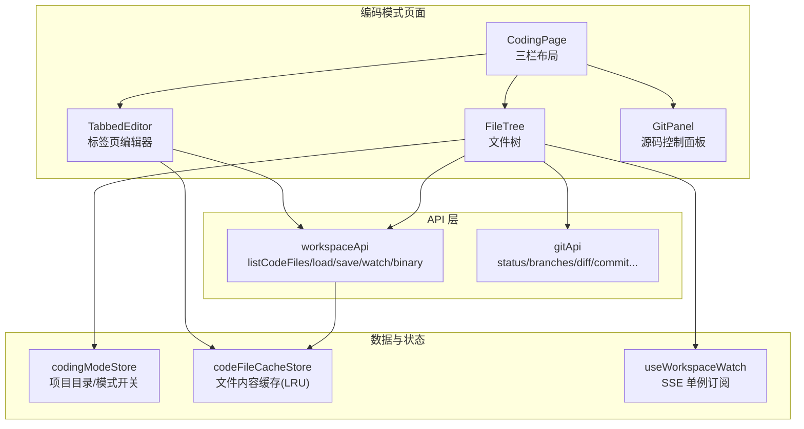
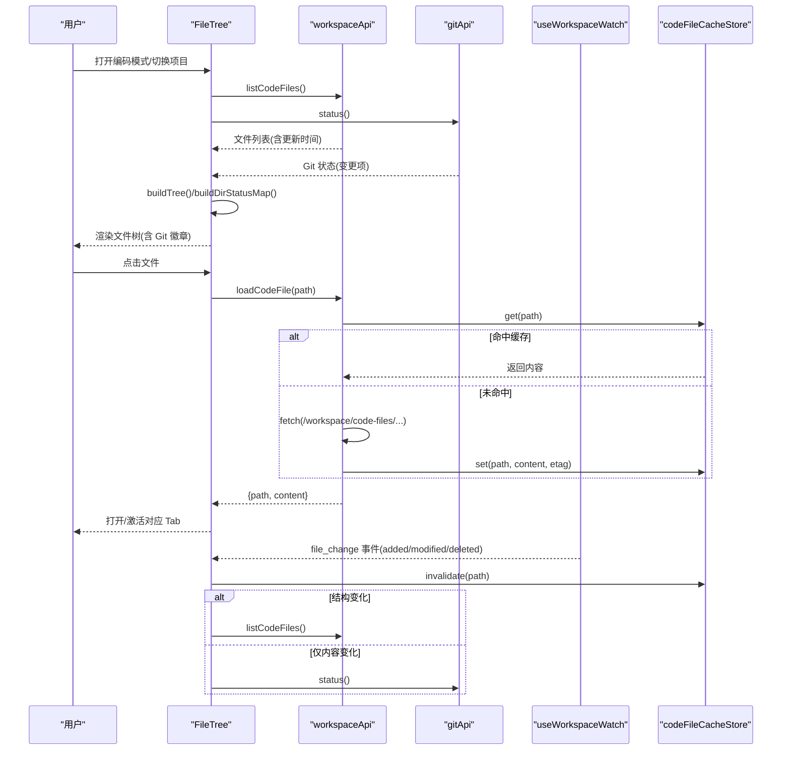
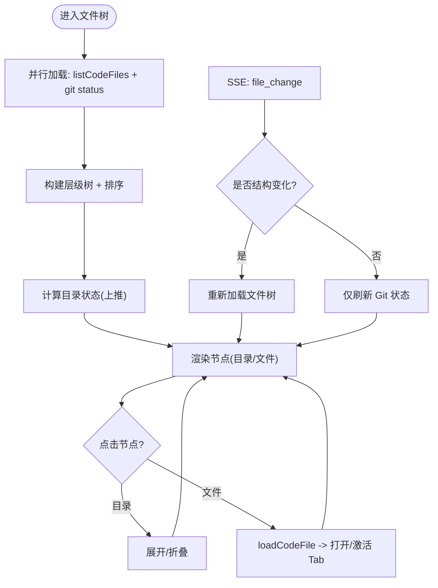
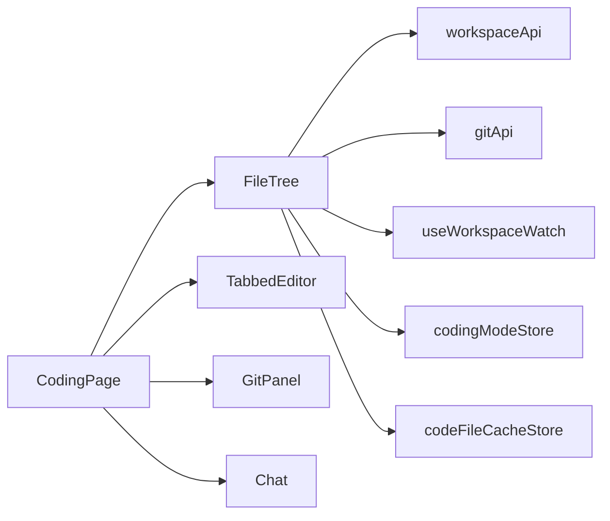

# 文件树导航

<cite>
**本文引用的文件**   
- [FileTree.tsx](file://console/src/pages/Coding/FileTree.tsx)
- [index.tsx](file://console/src/pages/Coding/index.tsx)
- [codingModeStore.ts](file://console/src/stores/codingModeStore.ts)
- [codeFileCacheStore.ts](file://console/src/stores/codeFileCacheStore.ts)
- [useWorkspaceWatch.ts](file://console/src/hooks/useWorkspaceWatch.ts)
- [workspace.ts](file://console/src/api/modules/workspace.ts)
- [git.ts](file://console/src/api/modules/git.ts)
- [ContextMenu/index.tsx](file://console/src/components/ContextMenu/index.tsx)
- [FileTree.module.less](file://console/src/pages/Coding/FileTree.module.less)
</cite>

## 目录
1. [简介](#简介)
2. [项目结构](#项目结构)
3. [核心组件](#核心组件)
4. [架构总览](#架构总览)
5. [详细组件分析](#详细组件分析)
6. [依赖关系分析](#依赖关系分析)
7. [性能与优化](#性能与优化)
8. [故障排查指南](#故障排查指南)
9. [结论](#结论)
10. [附录：扩展与自定义](#附录扩展与自定义)

## 简介
本章节面向 QwenPaw 编码模式的“文件树导航”功能，系统性梳理其实现与使用方式。内容覆盖：
- 文件系统遍历与树构建
- 目录展开/折叠、选中状态管理
- Git 状态装饰（修改、新增、删除、未跟踪）
- 文件搜索过滤（概念性说明）
- 右键菜单集成（通用能力）
- 文件监听机制（SSE）
- 虚拟滚动优化（现状与建议）
- 图标渲染与路径解析逻辑
- 文件选择事件处理、多文件操作支持（现状与建议）
- 常见问题与解决方案（大目录性能、内存泄漏防护、权限处理等）

## 项目结构
文件树导航位于编码模式页面中，采用三栏布局（资源管理器/编辑器/聊天），其中左侧为“文件树”。关键文件与职责如下：
- 页面容器：负责三栏布局、面板切换、Tab 联动
- 文件树组件：加载文件列表、构建树、展示节点、处理选择
- 工作区 API：提供代码文件列表、读取/保存、二进制预览、SSE 监听 URL
- Git API：提供仓库状态、分支、提交、暂存/取消暂存、丢弃变更等
- 缓存 Store：按路径缓存文件内容与 ETag，LRU 淘汰
- SSE Hook：单例连接，分发文件变更事件
- 上下文菜单：通用右键菜单组件（可被文件树集成）
- 样式：主题化、Git 状态徽章、深色模式适配

图示来源
- [index.tsx:1-266](file://console/src/pages/Coding/index.tsx#L1-L266)
- [FileTree.tsx:1-475](file://console/src/pages/Coding/FileTree.tsx#L1-L475)
- [codingModeStore.ts:1-79](file://console/src/stores/codingModeStore.ts#L1-L79)
- [codeFileCacheStore.ts:1-82](file://console/src/stores/codeFileCacheStore.ts#L1-L82)
- [useWorkspaceWatch.ts:1-148](file://console/src/hooks/useWorkspaceWatch.ts#L1-L148)
- [workspace.ts:1-219](file://console/src/api/modules/workspace.ts#L1-L219)
- [git.ts:1-91](file://console/src/api/modules/git.ts#L1-L91)

章节来源
- [index.tsx:1-266](file://console/src/pages/Coding/index.tsx#L1-L266)
- [FileTree.tsx:1-475](file://console/src/pages/Coding/FileTree.tsx#L1-L475)

## 核心组件
- FileTree：负责加载文件树、构建层级、渲染节点、处理选择、刷新、项目切换、Git 状态装饰、SSE 增量更新。
- CodingPage：编排三栏布局，将文件树选择事件映射到 Tab 打开/激活。
- workspaceApi：封装后端接口，包含 listCodeFiles、loadCodeFile、saveCodeFile、watch URL、二进制文件 URL。
- gitApi：封装 Git 相关接口，用于获取状态、分支、diff、提交、暂存/取消暂存、丢弃变更等。
- codeFileCacheStore：内存 LRU 缓存，键为相对路径，值为内容与 ETag，受 SSE 失效驱动。
- useWorkspaceWatch：单例 SSE 连接，维护监听器集合，自动重连与退避。
- ContextMenu：通用右键菜单组件，支持定位校正、点击外部关闭、键盘 ESC 关闭等。

章节来源
- [FileTree.tsx:1-475](file://console/src/pages/Coding/FileTree.tsx#L1-L475)
- [index.tsx:1-266](file://console/src/pages/Coding/index.tsx#L1-L266)
- [workspace.ts:1-219](file://console/src/api/modules/workspace.ts#L1-L219)
- [git.ts:1-91](file://console/src/api/modules/git.ts#L1-L91)
- [codeFileCacheStore.ts:1-82](file://console/src/stores/codeFileCacheStore.ts#L1-L82)
- [useWorkspaceWatch.ts:1-148](file://console/src/hooks/useWorkspaceWatch.ts#L1-L148)
- [ContextMenu/index.tsx:1-138](file://console/src/components/ContextMenu/index.tsx#L1-L138)

## 架构总览
下图展示了从用户交互到数据更新的端到端流程，包括文件树加载、Git 状态装饰、SSE 增量更新与缓存失效。

图示来源
- [FileTree.tsx:317-375](file://console/src/pages/Coding/FileTree.tsx#L317-L375)
- [workspace.ts:134-205](file://console/src/api/modules/workspace.ts#L134-L205)
- [git.ts:29-31](file://console/src/api/modules/git.ts#L29-L31)
- [useWorkspaceWatch.ts:124-147](file://console/src/hooks/useWorkspaceWatch.ts#L124-L147)
- [codeFileCacheStore.ts:36-81](file://console/src/stores/codeFileCacheStore.ts#L36-L81)

## 详细组件分析

### 文件树组件（FileTree）
- 数据加载
  - 并行拉取文件列表与 Git 状态，提升首屏速度。
  - 根据 projectDir 变化清理缓存并重新加载，避免跨项目内容污染。
- 树构建与排序
  - 基于扁平文件列表构建层级树，目录优先于文件，同级按名称本地化排序。
- Git 状态装饰
  - 将文件级状态上推到目录，目录显示最高优先级状态（删除 > 修改 > 新增 > 未跟踪）。
  - 文件/目录行附加颜色与单字母徽章（M/A/D/U）。
- 文件选择
  - 通过 workspaceApi.loadCodeFile 读取内容；若服务端返回过大（如 413），以占位提示替代空白。
  - 选择后调用父级回调打开/激活对应 Tab。
- SSE 增量更新
  - 监听 added/modified/deleted 事件：结构变化触发全量刷新；仅修改则只刷新 Git 装饰。
  - 对变更路径执行缓存失效，保证下次读取走网络或浏览器缓存。
- 项目切换
  - 顶部工具栏可切换项目，切换时清空缓存与编辑器 Tab，再重新加载。

图示来源
- [FileTree.tsx:45-85](file://console/src/pages/Coding/FileTree.tsx#L45-L85)
- [FileTree.tsx:88-112](file://console/src/pages/Coding/FileTree.tsx#L88-L112)
- [FileTree.tsx:317-375](file://console/src/pages/Coding/FileTree.tsx#L317-L375)
- [FileTree.tsx:382-402](file://console/src/pages/Coding/FileTree.tsx#L382-L402)

章节来源
- [FileTree.tsx:1-475](file://console/src/pages/Coding/FileTree.tsx#L1-L475)
- [FileTree.module.less:1-291](file://console/src/pages/Coding/FileTree.module.less#L1-L291)

### 编码模式页面（CodingPage）
- 三栏布局：左侧（文件树/Git）、中间（编辑器）、右侧（聊天），支持拖拽调整大小。
- 活动栏切换：Explorer 与 Source Control 两个视图在左侧面板内切换。
- 文件选择联动：将 FileTree 的 onFileSelect 映射为 openTab + setActiveTab。
- 持久化恢复：页面初始化时，对空内容的已持久化 Tab 进行懒加载恢复。

章节来源
- [index.tsx:1-266](file://console/src/pages/Coding/index.tsx#L1-L266)

### 工作区 API（workspaceApi）
- listCodeFiles：获取所有代码文件列表（非 Markdown 限制），统一时间字段。
- loadCodeFile：带缓存策略的读取。命中内存缓存直接返回；否则发起请求，并将响应内容与 ETag 写入缓存。
- saveCodeFile：保存后主动失效该路径缓存，确保下次读取拿到最新 ETag。
- getWatchUrl：返回 SSE 监听地址。
- getBinaryFileUrl：返回二进制文件预览直链。

章节来源
- [workspace.ts:134-219](file://console/src/api/modules/workspace.ts#L134-L219)

### Git API（gitApi）
- status：返回当前分支、变更列表、ahead/behind。
- branches/checkout：列出与切换分支。
- diff：查看工作区/暂存区差异。
- stage/unstage：暂存/取消暂存。
- commit/log：提交与日志。
- discard/revert：丢弃未暂存变更、还原某次提交。

章节来源
- [git.ts:1-91](file://console/src/api/modules/git.ts#L1-L91)

### 文件内容缓存（codeFileCacheStore）
- 键：相对路径（与后端一致）。
- 值：内容字符串 + ETag + touchedAt（单调递增计数器）。
- 容量：最大条目数（LRU 淘汰）。
- 失效：由 SSE 事件或保存操作触发。

章节来源
- [codeFileCacheStore.ts:1-82](file://console/src/stores/codeFileCacheStore.ts#L1-L82)

### SSE 监听（useWorkspaceWatch）
- 单例连接：模块级 Set 维护监听器，首个订阅者建立连接，无订阅者时断开。
- 断线重连：指数退避，上限 30s。
- 事件分发：解析 data: JSON 行，筛选 type=file_change，批量回调。
- 生命周期：组件卸载时移除监听，避免内存泄漏。

章节来源
- [useWorkspaceWatch.ts:1-148](file://console/src/hooks/useWorkspaceWatch.ts#L1-L148)

### 右键菜单（ContextMenu）
- 位置自适应：根据视口尺寸修正坐标，防止溢出。
- 关闭策略：点击外部、滚动、窗口缩放、ESC 键均关闭。
- 数据结构：支持 key、label、icon、danger、disabled、divider、onClick。

章节来源
- [ContextMenu/index.tsx:1-138](file://console/src/components/ContextMenu/index.tsx#L1-L138)

## 依赖关系分析
- FileTree 依赖：
  - workspaceApi：文件列表、文件内容、SSE URL
  - gitApi：Git 状态
  - useWorkspaceWatch：SSE 事件订阅
  - codingModeStore：当前项目目录
  - codeFileCacheStore：文件内容缓存
- CodingPage 依赖：
  - FileTree、TabbedEditor、GitPanel、Chat
  - codingTabsStore：Tab 状态管理
  - agentStore：当前 Agent 标识

图示来源
- [FileTree.tsx:1-475](file://console/src/pages/Coding/FileTree.tsx#L1-L475)
- [index.tsx:1-266](file://console/src/pages/Coding/index.tsx#L1-L266)
- [workspace.ts:1-219](file://console/src/api/modules/workspace.ts#L1-L219)
- [git.ts:1-91](file://console/src/api/modules/git.ts#L1-L91)
- [useWorkspaceWatch.ts:1-148](file://console/src/hooks/useWorkspaceWatch.ts#L1-L148)
- [codingModeStore.ts:1-79](file://console/src/stores/codingModeStore.ts#L1-L79)
- [codeFileCacheStore.ts:1-82](file://console/src/stores/codeFileCacheStore.ts#L1-L82)

## 性能与优化
- 大目录性能
  - 现状：文件树采用递归渲染，未启用虚拟滚动。对于超大目录可能出现卡顿。
  - 建议：引入虚拟滚动（例如 react-window/react-virtualized），仅渲染可视区域节点；结合懒加载子目录（按需展开后再请求子目录列表）。
- 内存占用
  - 现状：文件内容缓存使用 LRU，默认最大条目有限，避免无限增长。
  - 建议：根据设备内存与使用习惯调优 MAX_ENTRIES；对超大文件跳过缓存或限制体积阈值。
- 网络与缓存
  - 现状：loadCodeFile 使用 If-None-Match 配合 ETag，减少重复传输。
  - 建议：对频繁切换的文件保持缓存；对不活跃文件及时失效。
- SSE 连接
  - 现状：单例连接+指数退避，健壮性好。
  - 建议：在页面不可见时降低事件处理频率；必要时暂停连接并在可见时恢复。
- 图标渲染
  - 现状：基于扩展名匹配三类图标（代码/文本/默认）。
  - 建议：可扩展为更细粒度图标集（语言/框架），并可异步加载图标资源。

[本节为通用指导，无需具体文件引用]

## 故障排查指南
- 无法加载文件树
  - 检查 /workspace/code-files 接口是否可达；确认认证头是否正确传递。
  - 确认后端返回的 filename 是否为相对路径且使用正斜杠分隔。
- Git 状态不更新
  - 确认 /workspace/git/status 返回 changes 列表；检查 parseGitStatus 是否能识别后端状态码。
- 文件内容不刷新
  - 确认 SSE 事件是否到达；检查 cache.invalidate 是否被执行；观察浏览器 HTTP 缓存与 ETag。
- 大文件打开失败
  - 当服务端返回 413 时，前端会显示占位提示；可在后端调整上传/读取大小限制或改用流式下载。
- 右键菜单异常
  - 检查 ContextMenu 的 visible/x/y 状态是否正确设置；确认 document.body 挂载点可用。

章节来源
- [FileTree.tsx:317-402](file://console/src/pages/Coding/FileTree.tsx#L317-L402)
- [useWorkspaceWatch.ts:42-99](file://console/src/hooks/useWorkspaceWatch.ts#L42-L99)
- [workspace.ts:151-185](file://console/src/api/modules/workspace.ts#L151-L185)
- [ContextMenu/index.tsx:32-81](file://console/src/components/ContextMenu/index.tsx#L32-L81)

## 结论
QwenPaw 编码模式的文件树导航实现了完整的文件浏览、Git 状态装饰、SSE 增量更新与内容缓存策略，具备较好的用户体验与工程实践。针对超大目录与复杂交互场景，可通过虚拟滚动、懒加载与缓存策略进一步优化。右键菜单作为通用能力，便于后续扩展更多文件操作。

[本节为总结性内容，无需具体文件引用]

## 附录：扩展与自定义

### 如何添加新的文件类型支持与图标
- 在文件图标判断处扩展扩展名集合，为新类型分配专属图标。
- 如需更精细区分，可按语言/框架维度增加规则。

章节来源
- [FileTree.tsx:131-167](file://console/src/pages/Coding/FileTree.tsx#L131-L167)

### 如何在文件树上集成右键菜单
- 在 NodeItem 的 onClick/onContextMenu 中调用 useContextMenu.show，传入 items 配置（如“复制路径”、“在终端打开”、“删除”等）。
- 根据文件/目录类型与权限动态禁用某些菜单项。

章节来源
- [ContextMenu/index.tsx:118-137](file://console/src/components/ContextMenu/index.tsx#L118-L137)
- [FileTree.tsx:202-278](file://console/src/pages/Coding/FileTree.tsx#L202-L278)

### 如何实现文件搜索过滤
- 在文件树顶部增加输入框，监听输入变化对 nodes 进行前缀/模糊匹配过滤。
- 过滤时可保留祖先路径以保证层级可见性。
- 注意：过滤应作用于已构建的树节点，而非再次请求后端。

[本节为概念性说明，无需具体文件引用]

### 如何实现多文件操作支持
- 在 NodeItem 中支持 Shift/Ctrl 多选，维护 selectedPaths 集合。
- 在右键菜单中提供“批量复制路径”、“批量添加到 Git 暂存区”等操作。
- 对批量写操作需考虑并发与错误聚合。

[本节为概念性说明，无需具体文件引用]

### 如何处理文件权限问题
- 读取失败时捕获错误并给出友好提示（如“无权限访问”）。
- 保存前校验目标路径可写；必要时提示用户授权或切换到有权限的工作区。

[本节为概念性说明，无需具体文件引用]