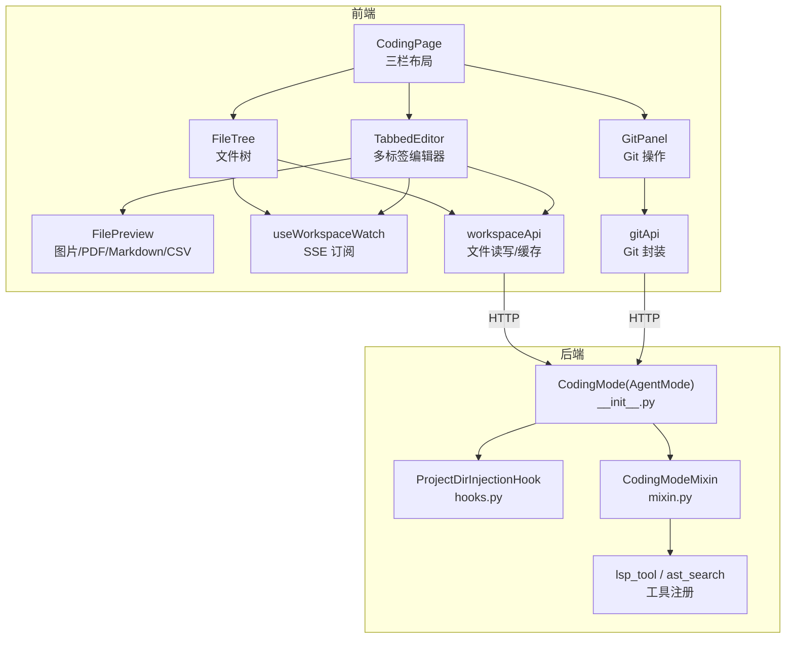
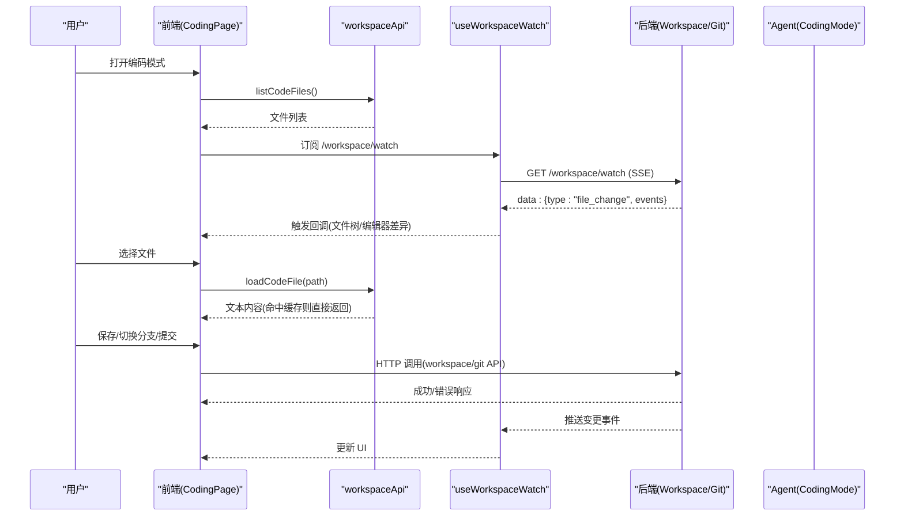
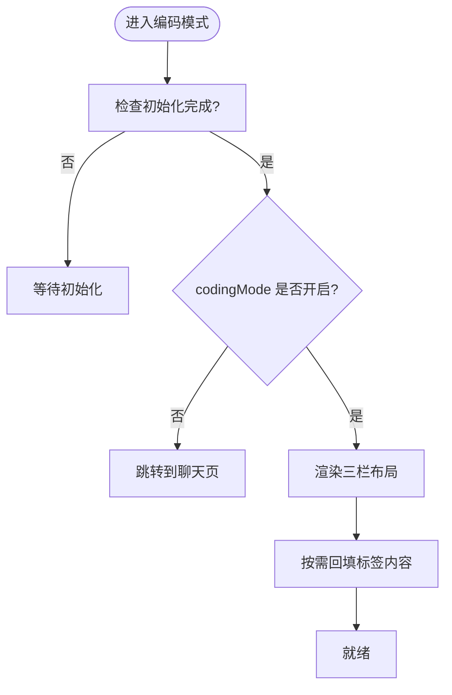
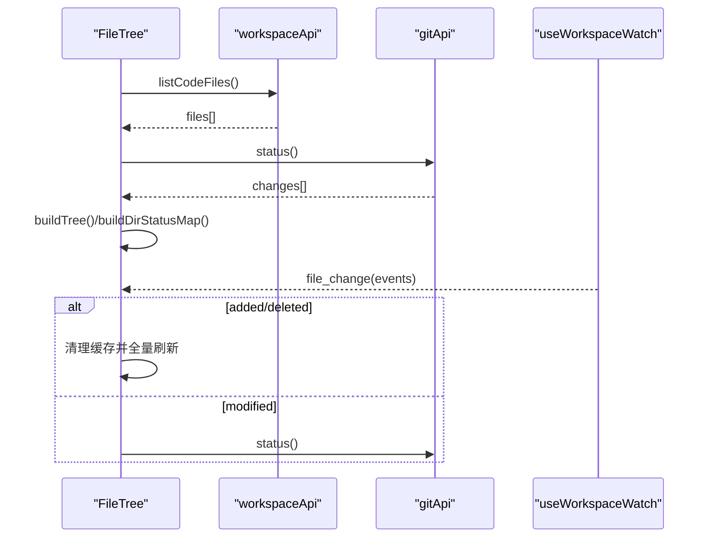
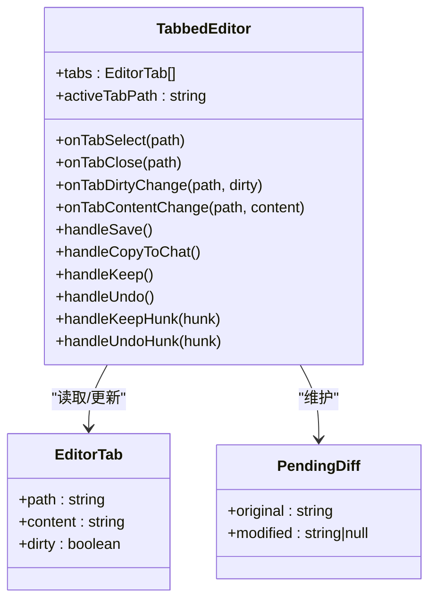
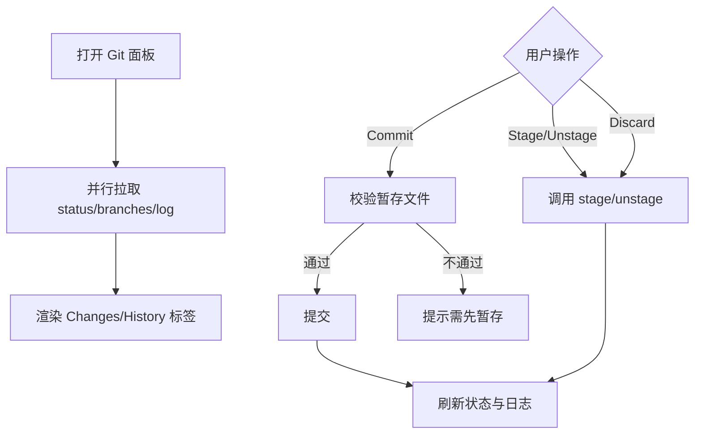
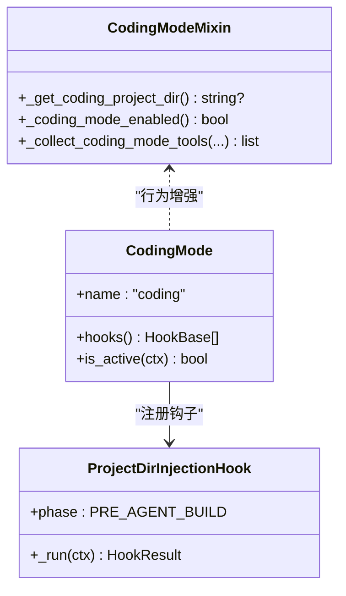
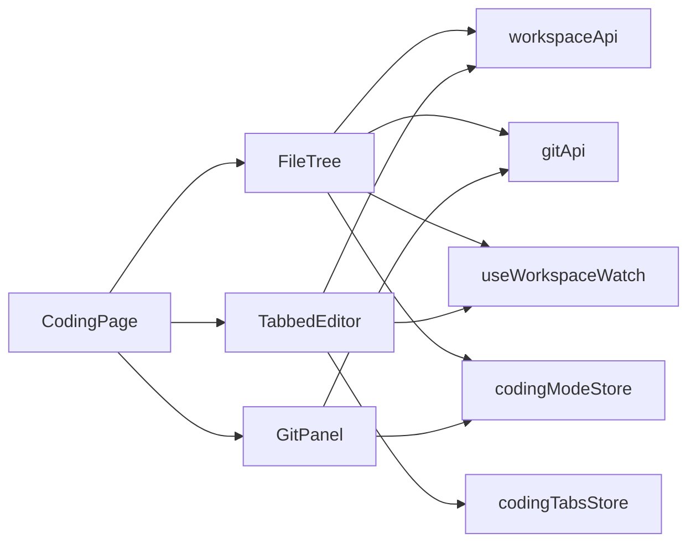

# 编码模式

<cite>
**本文引用的文件**   
- [index.tsx](file://console/src/pages/Coding/index.tsx)
- [FileTree.tsx](file://console/src/pages/Coding/FileTree.tsx)
- [TabbedEditor.tsx](file://console/src/pages/Coding/TabbedEditor.tsx)
- [GitPanel.tsx](file://console/src/pages/Coding/GitPanel.tsx)
- [FilePreview.tsx](file://console/src/pages/Coding/FilePreview.tsx)
- [codingModeStore.ts](file://console/src/stores/codingModeStore.ts)
- [codingTabsStore.ts](file://console/src/stores/codingTabsStore.ts)
- [useWorkspaceWatch.ts](file://console/src/hooks/useWorkspaceWatch.ts)
- [workspace.ts](file://console/src/api/modules/workspace.ts)
- [git.ts](file://console/src/api/modules/git.ts)
- [__init__.py](file://src/qwenpaw/modes/coding/__init__.py)
- [hooks.py](file://src/qwenpaw/modes/coding/hooks.py)
- [mixin.py](file://src/qwenpaw/modes/coding/mixin.py)
</cite>

## 目录
1. [简介](#简介)
2. [项目结构](#项目结构)
3. [核心组件](#核心组件)
4. [架构总览](#架构总览)
5. [详细组件分析](#详细组件分析)
6. [依赖关系分析](#依赖关系分析)
7. [性能与可扩展性](#性能与可扩展性)
8. [故障排查指南](#故障排查指南)
9. [结论](#结论)
10. [附录：扩展与自定义示例](#附录扩展与自定义示例)

## 简介
本章节面向 QwenPaw 的“编码模式”，系统性说明其前端工作区、编辑器、Git 集成与代码预览的实现，以及后端 Agent 侧的工具注入与系统提示词策略。内容覆盖：
- 文件树导航与工作空间管理
- 多标签编辑器（含撤销重做、差异对比、预览）
- Git 集成（分支、暂存、提交、回滚、日志）
- 文件监听机制（SSE）与状态同步
- 协作编辑支持（基于 SSE 的事件分发）
- 大文件处理、内存泄漏防护与崩溃恢复
- 如何扩展工具链与格式化器

## 项目结构
编码模式由前后端共同实现：
- 前端页面与交互集中在 console/src/pages/Coding 下，包含三栏布局、文件树、多标签编辑器、Git 面板与文件预览。
- 状态管理使用 Zustand，按 agent 维度持久化标签页与待处理差异。
- 文件变更通过 SSE 单例订阅，避免重复连接。
- 后端以 AgentMode 插件形式提供 Coding Mode，注入 LSP/AST 工具与系统提示词模板。

图表来源
- [index.tsx:1-266](file://console/src/pages/Coding/index.tsx#L1-L266)
- [FileTree.tsx:1-475](file://console/src/pages/Coding/FileTree.tsx#L1-L475)
- [TabbedEditor.tsx:1-800](file://console/src/pages/Coding/TabbedEditor.tsx#L1-L800)
- [GitPanel.tsx:1-649](file://console/src/pages/Coding/GitPanel.tsx#L1-L649)
- [FilePreview.tsx:1-309](file://console/src/pages/Coding/FilePreview.tsx#L1-L309)
- [useWorkspaceWatch.ts:1-148](file://console/src/hooks/useWorkspaceWatch.ts#L1-L148)
- [workspace.ts:1-219](file://console/src/api/modules/workspace.ts#L1-L219)
- [git.ts:1-91](file://console/src/api/modules/git.ts#L1-L91)
- [__init__.py:1-54](file://src/qwenpaw/modes/coding/__init__.py#L1-L54)
- [hooks.py:1-36](file://src/qwenpaw/modes/coding/hooks.py#L1-L36)
- [mixin.py:1-332](file://src/qwenpaw/modes/coding/mixin.py#L1-L332)

章节来源
- [index.tsx:1-266](file://console/src/pages/Coding/index.tsx#L1-L266)
- [codingModeStore.ts:1-79](file://console/src/stores/codingModeStore.ts#L1-L79)
- [codingTabsStore.ts:1-239](file://console/src/stores/codingTabsStore.ts#L1-L239)
- [useWorkspaceWatch.ts:1-148](file://console/src/hooks/useWorkspaceWatch.ts#L1-L148)
- [workspace.ts:1-219](file://console/src/api/modules/workspace.ts#L1-L219)
- [git.ts:1-91](file://console/src/api/modules/git.ts#L1-L91)
- [__init__.py:1-54](file://src/qwenpaw/modes/coding/__init__.py#L1-L54)
- [hooks.py:1-36](file://src/qwenpaw/modes/coding/hooks.py#L1-L36)
- [mixin.py:1-332](file://src/qwenpaw/modes/coding/mixin.py#L1-L332)

## 核心组件
- 三栏布局与路由控制：根据当前 Agent 的编码模式开关决定进入或跳转聊天页；左侧可切换“资源管理器/Git”，中间为编辑器，右侧为聊天面板。
- 文件树：列出所有文件类型，支持 Git 状态徽标、项目切换、增量刷新与 SSE 事件驱动更新。
- 多标签编辑器：基于 Monaco/DiffEditor，支持保存、复制上下文到聊天、差异查看与逐块保留/撤销、预览模式（图片/PDF/Markdown/CSV）。
- Git 面板：分支切换、暂存/取消暂存、丢弃更改、查看 diff、提交、历史日志、回滚。
- 文件预览：自动识别并渲染非代码文件，Tauri 模式下直读磁盘，浏览器模式带认证头请求二进制接口。
- 状态管理：按 Agent 维度持久化标签路径与差异基线，重启后按需回填内容。
- 文件监听：SSE 单例连接，统一分发 file_change 事件，驱动文件树与编辑器差异展示。
- 后端工具注入：在 Agent 构建前注入 project_dir，并在启用时注册 lsp/ast_search 工具与系统提示词模板。

章节来源
- [index.tsx:1-266](file://console/src/pages/Coding/index.tsx#L1-L266)
- [FileTree.tsx:1-475](file://console/src/pages/Coding/FileTree.tsx#L1-L475)
- [TabbedEditor.tsx:1-800](file://console/src/pages/Coding/TabbedEditor.tsx#L1-L800)
- [GitPanel.tsx:1-649](file://console/src/pages/Coding/GitPanel.tsx#L1-L649)
- [FilePreview.tsx:1-309](file://console/src/pages/Coding/FilePreview.tsx#L1-L309)
- [codingModeStore.ts:1-79](file://console/src/stores/codingModeStore.ts#L1-L79)
- [codingTabsStore.ts:1-239](file://console/src/stores/codingTabsStore.ts#L1-L239)
- [useWorkspaceWatch.ts:1-148](file://console/src/hooks/useWorkspaceWatch.ts#L1-L148)
- [workspace.ts:1-219](file://console/src/api/modules/workspace.ts#L1-L219)
- [git.ts:1-91](file://console/src/api/modules/git.ts#L1-L91)
- [__init__.py:1-54](file://src/qwenpaw/modes/coding/__init__.py#L1-L54)
- [hooks.py:1-36](file://src/qwenpaw/modes/coding/hooks.py#L1-L36)
- [mixin.py:1-332](file://src/qwenpaw/modes/coding/mixin.py#L1-L332)

## 架构总览
编码模式采用“前端 IDE Shell + 后端 Agent 工具”的双层架构：
- 前端负责 UI、状态、SSE 监听与 API 调用。
- 后端通过 AgentMode 插件将 Coding Mode 能力注入到 ReActAgent，提供 LSP/AST 工具与强约束的系统提示词，确保 Agent 对“活动项目目录”和“工作区目录”有清晰边界。

图表来源
- [index.tsx:1-266](file://console/src/pages/Coding/index.tsx#L1-L266)
- [FileTree.tsx:1-475](file://console/src/pages/Coding/FileTree.tsx#L1-L475)
- [TabbedEditor.tsx:1-800](file://console/src/pages/Coding/TabbedEditor.tsx#L1-L800)
- [useWorkspaceWatch.ts:1-148](file://console/src/hooks/useWorkspaceWatch.ts#L1-L148)
- [workspace.ts:1-219](file://console/src/api/modules/workspace.ts#L1-L219)
- [git.ts:1-91](file://console/src/api/modules/git.ts#L1-L91)
- [__init__.py:1-54](file://src/qwenpaw/modes/coding/__init__.py#L1-L54)
- [mixin.py:1-332](file://src/qwenpaw/modes/coding/mixin.py#L1-L332)

## 详细组件分析

### 三栏布局与路由控制（CodingPage）
- 功能要点
  - 根据 useCodingMode 的 initialized 与 codingMode 决定是否渲染编码模式或跳转到聊天页。
  - 左侧面板可在“文件树/Git”间切换，右侧聊天面板可隐藏/显示，未显示时右下角按钮带脏标记计数。
  - 编辑器标签页按 Agent 隔离，切换 Agent 时仅影响对应标签集。
- 关键流程
  - 首次挂载时，若存在已持久化的标签但无内容，会批量拉取内容并回填；不存在则关闭该标签。
  - 文件选择时打开新标签并设为活跃。

图表来源
- [index.tsx:1-266](file://console/src/pages/Coding/index.tsx#L1-L266)
- [codingTabsStore.ts:1-239](file://console/src/stores/codingTabsStore.ts#L1-L239)
- [codingModeStore.ts:1-79](file://console/src/stores/codingModeStore.ts#L1-L79)

章节来源
- [index.tsx:1-266](file://console/src/pages/Coding/index.tsx#L1-L266)
- [codingTabsStore.ts:1-239](file://console/src/stores/codingTabsStore.ts#L1-L239)
- [codingModeStore.ts:1-79](file://console/src/stores/codingModeStore.ts#L1-L79)

### 文件树（FileTree）
- 功能要点
  - 加载全量文件列表，构建层级树并按类型排序。
  - 并行拉取 Git 状态，计算目录级状态气泡（优先级：删除 > 修改 > 新增 > 未跟踪）。
  - 项目切换时清空文件内容缓存并重新扫描。
  - 监听 SSE 事件：结构性变更（增删）触发全量刷新；仅修改则只刷新 Git 装饰。
  - 点击文件时优先走缓存，失败时根据 HTTP 状态码（如 413）给出占位提示。
- 数据流
  - workspaceApi.listCodeFiles → buildTree → 渲染节点
  - gitApi.status → parseGitStatus → Map[path→status] → 目录级聚合
  - useWorkspaceWatch → invalidate 缓存 → 条件刷新

图表来源
- [FileTree.tsx:1-475](file://console/src/pages/Coding/FileTree.tsx#L1-L475)
- [workspace.ts:1-219](file://console/src/api/modules/workspace.ts#L1-L219)
- [git.ts:1-91](file://console/src/api/modules/git.ts#L1-L91)
- [useWorkspaceWatch.ts:1-148](file://console/src/hooks/useWorkspaceWatch.ts#L1-L148)

章节来源
- [FileTree.tsx:1-475](file://console/src/pages/Coding/FileTree.tsx#L1-L475)
- [workspace.ts:1-219](file://console/src/api/modules/workspace.ts#L1-L219)
- [git.ts:1-91](file://console/src/api/modules/git.ts#L1-L91)
- [useWorkspaceWatch.ts:1-148](file://console/src/hooks/useWorkspaceWatch.ts#L1-L148)

### 多标签编辑器（TabbedEditor）
- 功能要点
  - 每个路径一个 Monaco 模型，切换标签保持光标与撤销栈。
  - 当外部写入导致文件变化且当前标签未脏时，自动进入 Diff 视图（行级差异），支持“全部保留/全部撤销”与“逐块保留/撤销”。
  - 支持 Cmd/Ctrl+S 保存；“复制到聊天”按钮智能生成 path:line[-line] 或代码块。
  - 预览模式：图片/PDF/Markdown/CSV 自动预览，用户可手动切换回代码视图。
  - 防抖与抑制：在“撤销中”期间屏蔽 SSE 导致的二次差异。
- 关键算法
  - 复制模式检测：整文件/整行/部分列三种模式，输出不同格式。
  - 差异合并：按 hunk 范围切片替换，逐步收敛至无差异。
  - 视图区域对齐：通过 Monaco view zones 获取像素 top，驱动 React 悬浮控件定位。

图表来源
- [TabbedEditor.tsx:1-800](file://console/src/pages/Coding/TabbedEditor.tsx#L1-L800)
- [codingTabsStore.ts:1-239](file://console/src/stores/codingTabsStore.ts#L1-L239)

章节来源
- [TabbedEditor.tsx:1-800](file://console/src/pages/Coding/TabbedEditor.tsx#L1-L800)
- [codingTabsStore.ts:1-239](file://console/src/stores/codingTabsStore.ts#L1-L239)

### Git 面板（GitPanel）
- 功能要点
  - 分支下拉框切换，支持新建并切换。
  - 暂存/取消暂存、丢弃更改、查看 diff、提交、历史日志、回滚。
  - 变更列表分页展示（默认 50 条），支持展开全部。
  - 每 10 秒轮询一次状态，降低后端压力。
- 交互流程
  - 打开面板即拉取 status 与 branches；提交前校验是否有暂存文件。
  - 查看 diff 时区分 staged/untracked 参数组合。

图表来源
- [GitPanel.tsx:1-649](file://console/src/pages/Coding/GitPanel.tsx#L1-L649)
- [git.ts:1-91](file://console/src/api/modules/git.ts#L1-L91)

章节来源
- [GitPanel.tsx:1-649](file://console/src/pages/Coding/GitPanel.tsx#L1-L649)
- [git.ts:1-91](file://console/src/api/modules/git.ts#L1-L91)

### 文件预览（FilePreview）
- 功能要点
  - 自动识别图片/PDF/Markdown/CSV，分别渲染。
  - Tauri 环境下通过原生命令直读磁盘，无需后端；浏览器环境通过带认证头的二进制接口获取 Blob。
  - Markdown 内嵌语法高亮；CSV 限制行列数以避免卡顿。
- 安全与健壮性
  - 对象 URL 创建与释放严格配对，防止内存泄漏。
  - 网络异常时降级为空态。

章节来源
- [FilePreview.tsx:1-309](file://console/src/pages/Coding/FilePreview.tsx#L1-L309)
- [workspace.ts:1-219](file://console/src/api/modules/workspace.ts#L1-L219)

### 文件监听与状态同步（useWorkspaceWatch）
- 设计要点
  - 模块级单例连接，多个组件共享同一 SSE 连接，避免重复建立。
  - 事件解析容错，忽略无效 JSON 行。
  - 指数退避重试，最大延迟 30s。
- 使用方式
  - 组件调用 useWorkspaceWatch(callback)，内部用 ref 持有最新回调，避免闭包过期问题。

章节来源
- [useWorkspaceWatch.ts:1-148](file://console/src/hooks/useWorkspaceWatch.ts#L1-L148)

### 工作空间与 Git API 封装
- workspaceApi
  - 文件树、文本文件读写、二进制文件 URL、SSE watch 地址。
  - 文件内容缓存：内存缓存 + ETag 协商，写后主动失效。
- gitApi
  - 状态、分支、diff、暂存/取消暂存、提交、日志、丢弃、回滚等。

章节来源
- [workspace.ts:1-219](file://console/src/api/modules/workspace.ts#L1-L219)
- [git.ts:1-91](file://console/src/api/modules/git.ts#L1-L91)

### 后端编码模式（AgentMode 插件）
- 入口与钩子
  - CodingMode 作为 AgentMode 插件，is_active 判断配置项。
  - ProjectDirInjectionHook 在 PRE_AGENT_BUILD 阶段将 project_dir 注入 mode_state。
- 工具注入与系统提示词
  - CodingModeMixin 在启用时探测可用 LSP 语言并注册 lsp 工具；检测 ast-grep 可用性并注册 ast_search。
  - 系统提示词模板强调“活动项目目录”与“工作区目录”的边界，规范路径与 cwd 用法，指导工具选择（LSP/AST/grep）。

图表来源
- [__init__.py:1-54](file://src/qwenpaw/modes/coding/__init__.py#L1-L54)
- [hooks.py:1-36](file://src/qwenpaw/modes/coding/hooks.py#L1-L36)
- [mixin.py:1-332](file://src/qwenpaw/modes/coding/mixin.py#L1-L332)

章节来源
- [__init__.py:1-54](file://src/qwenpaw/modes/coding/__init__.py#L1-L54)
- [hooks.py:1-36](file://src/qwenpaw/modes/coding/hooks.py#L1-L36)
- [mixin.py:1-332](file://src/qwenpaw/modes/coding/mixin.py#L1-L332)

## 依赖关系分析
- 组件耦合
  - CodingPage 依赖 stores 与 API 模块，协调 FileTree/TabbedEditor/GitPanel。
  - FileTree 与 TabbedEditor 均依赖 useWorkspaceWatch 与 workspaceApi。
  - GitPanel 独立于编辑器，仅依赖 gitApi。
- 外部依赖
  - Tauri 运行时用于二进制直读。
  - Monaco/DiffEditor 提供编辑器与差异能力。
  - Ant Design 提供基础 UI 组件。
- 潜在循环
  - 通过 hooks 与 store 解耦，未见直接循环引用。

图表来源
- [index.tsx:1-266](file://console/src/pages/Coding/index.tsx#L1-L266)
- [FileTree.tsx:1-475](file://console/src/pages/Coding/FileTree.tsx#L1-L475)
- [TabbedEditor.tsx:1-800](file://console/src/pages/Coding/TabbedEditor.tsx#L1-L800)
- [GitPanel.tsx:1-649](file://console/src/pages/Coding/GitPanel.tsx#L1-L649)
- [codingModeStore.ts:1-79](file://console/src/stores/codingModeStore.ts#L1-L79)
- [codingTabsStore.ts:1-239](file://console/src/stores/codingTabsStore.ts#L1-L239)
- [useWorkspaceWatch.ts:1-148](file://console/src/hooks/useWorkspaceWatch.ts#L1-L148)
- [workspace.ts:1-219](file://console/src/api/modules/workspace.ts#L1-L219)
- [git.ts:1-91](file://console/src/api/modules/git.ts#L1-L91)

## 性能与可扩展性
- 大文件优化
  - 文件树打开大文件时，若后端返回 413，前端以占位文本提示，避免编辑器崩溃。
  - CSV 预览限制行列上限，防止表格过大导致渲染卡顿。
- 内存泄漏防护
  - 预览组件在卸载时释放对象 URL。
  - 编辑器关闭标签时清理用户切换标记集合，避免长期驻留。
- 崩溃恢复
  - 标签页与差异基线持久化到 localStorage，重启后按需回填内容；差异 modified 侧为空时再拉取磁盘内容。
- 并发与节流
  - SSE 单例连接，避免重复建立。
  - Git 面板轮询间隔 10s，减少后端压力。
- 可扩展点
  - 新增预览类型：在 getPreviewType/isPreviewable 中添加扩展名映射，并实现对应渲染器。
  - 新增编辑器快捷键：在键盘事件中追加逻辑。
  - 扩展 Git 操作：在 gitApi 增加方法，并在 GitPanel 中绑定 UI。

[本节为通用建议，不直接分析具体文件]

## 故障排查指南
- 无法打开编码模式
  - 确认 useCodingMode.initialized 为 true 且 codingMode 为 true；否则会被重定向到聊天页。
- 文件树不更新
  - 检查 SSE 连接是否正常；确认 useWorkspaceWatch 已注册；观察后端是否推送 file_change 事件。
- 编辑器差异不出现
  - 确认当前标签未处于 dirty 状态；若在“撤销中”，会短暂抑制差异。
- 预览图片/PDF 空白
  - Tauri 环境检查原生命令是否可用；浏览器环境检查认证头是否正确传递。
- 提交失败
  - 确认存在暂存文件；查看后端返回的错误信息（如 nothing to commit）。

章节来源
- [index.tsx:1-266](file://console/src/pages/Coding/index.tsx#L1-L266)
- [useWorkspaceWatch.ts:1-148](file://console/src/hooks/useWorkspaceWatch.ts#L1-L148)
- [TabbedEditor.tsx:1-800](file://console/src/pages/Coding/TabbedEditor.tsx#L1-L800)
- [FilePreview.tsx:1-309](file://console/src/pages/Coding/FilePreview.tsx#L1-L309)
- [GitPanel.tsx:1-649](file://console/src/pages/Coding/GitPanel.tsx#L1-L649)

## 结论
QwenPaw 编码模式以前端 IDE Shell 与后端 Agent 工具协同的方式，提供了完整的文件导航、多标签编辑、Git 集成与代码预览能力。通过 SSE 事件驱动的实时同步、按 Agent 维度的状态持久化、以及对大文件与内存使用的细致处理，既保证了易用性，也兼顾了稳定性与可扩展性。

[本节为总结，不直接分析具体文件]

## 附录：扩展与自定义示例
- 自定义文件处理器
  - 在 FileTree 的文件选择流程中，针对特定后缀进行特殊处理（例如导出为其他格式），参考文件选择与内容加载路径。
  - 参考路径：[FileTree.tsx:382-402](file://console/src/pages/Coding/FileTree.tsx#L382-L402)、[workspace.ts:151-185](file://console/src/api/modules/workspace.ts#L151-L185)
- 集成新的代码格式化工具
  - 在编辑器保存前插入格式化步骤，或在“复制到聊天”前对内容进行格式化，参考保存与复制逻辑。
  - 参考路径：[TabbedEditor.tsx:592-615](file://console/src/pages/Coding/TabbedEditor.tsx#L592-L615)、[TabbedEditor.tsx:619-637](file://console/src/pages/Coding/TabbedEditor.tsx#L619-L637)
- 扩展编辑器功能
  - 新增快捷键、新增工具栏按钮、新增预览类型，参考现有实现位置。
  - 参考路径：[TabbedEditor.tsx:428-439](file://console/src/pages/Coding/TabbedEditor.tsx#L428-L439)、[FilePreview.tsx:40-51](file://console/src/pages/Coding/FilePreview.tsx#L40-L51)
- 扩展 Git 操作
  - 在 gitApi 中新增方法，并在 GitPanel 中绑定 UI 动作。
  - 参考路径：[git.ts:29-90](file://console/src/api/modules/git.ts#L29-L90)、[GitPanel.tsx:122-268](file://console/src/pages/Coding/GitPanel.tsx#L122-L268)
- 扩展后端工具链
  - 在 CodingModeMixin 中注册新的工具（如新的 LSP 语言或 AST 查询），并确保系统提示词模板引导正确使用。
  - 参考路径：[mixin.py:210-268](file://src/qwenpaw/modes/coding/mixin.py#L210-L268)、[mixin.py:271-324](file://src/qwenpaw/modes/coding/mixin.py#L271-L324)

章节来源
- [FileTree.tsx:382-402](file://console/src/pages/Coding/FileTree.tsx#L382-L402)
- [workspace.ts:151-185](file://console/src/api/modules/workspace.ts#L151-L185)
- [TabbedEditor.tsx:428-439](file://console/src/pages/Coding/TabbedEditor.tsx#L428-L439)
- [TabbedEditor.tsx:592-615](file://console/src/pages/Coding/TabbedEditor.tsx#L592-L615)
- [TabbedEditor.tsx:619-637](file://console/src/pages/Coding/TabbedEditor.tsx#L619-L637)
- [FilePreview.tsx:40-51](file://console/src/pages/Coding/FilePreview.tsx#L40-L51)
- [git.ts:29-90](file://console/src/api/modules/git.ts#L29-L90)
- [GitPanel.tsx:122-268](file://console/src/pages/Coding/GitPanel.tsx#L122-L268)
- [mixin.py:210-268](file://src/qwenpaw/modes/coding/mixin.py#L210-L268)
- [mixin.py:271-324](file://src/qwenpaw/modes/coding/mixin.py#L271-L324)