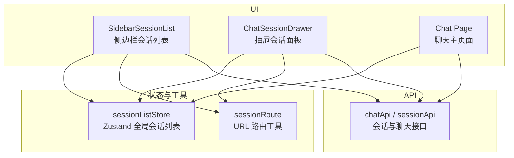
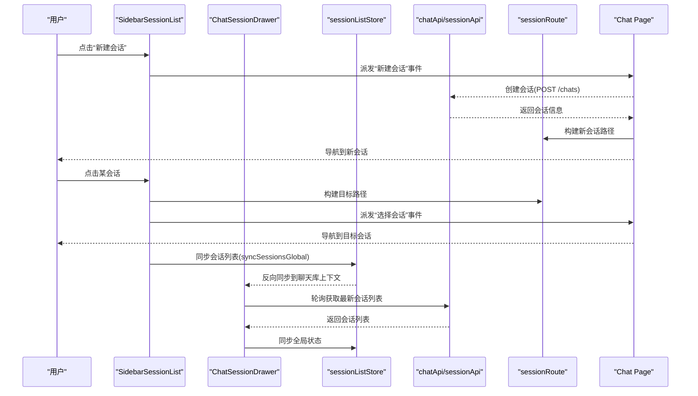
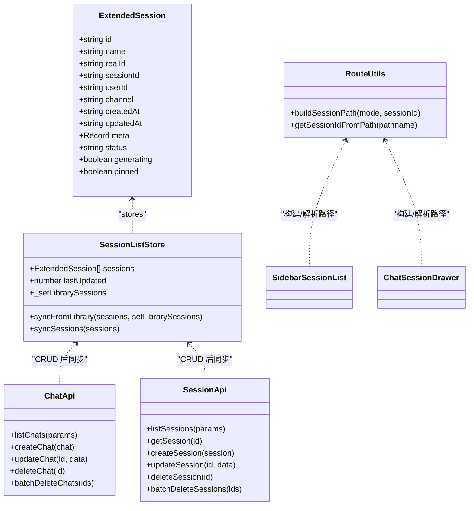
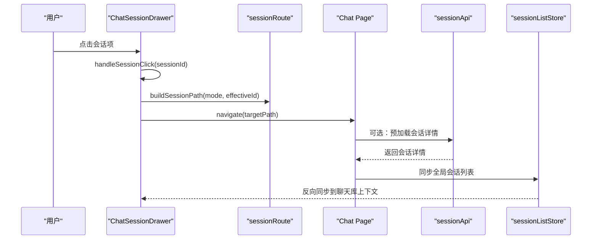
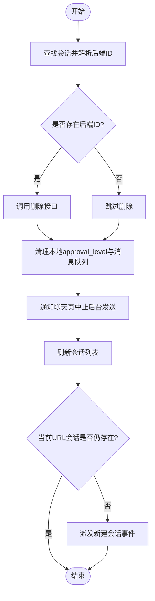
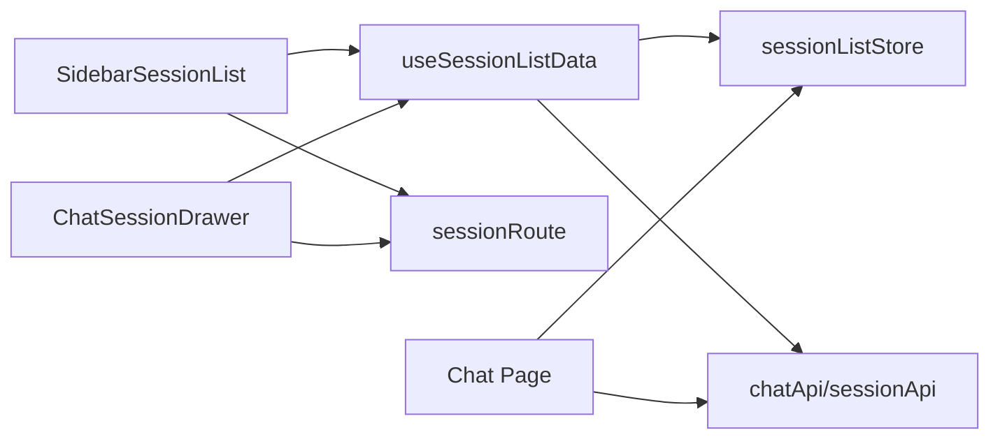

# 会话管理

<cite>
**本文引用的文件**
- [console/src/stores/sessionListStore.ts](file://console/src/stores/sessionListStore.ts)
- [console/src/utils/sessionRoute.ts](file://console/src/utils/sessionRoute.ts)
- [console/src/api/modules/chat.ts](file://console/src/api/modules/chat.ts)
- [console/src/layouts/SidebarSessionList.tsx](file://console/src/layouts/SidebarSessionList.tsx)
- [console/src/pages/Chat/components/ChatSessionDrawer/index.tsx](file://console/src/pages/Chat/components/ChatSessionDrawer/index.tsx)
- [console/src/pages/Chat/components/ChatSessionDrawer/useSessionListData.ts](file://console/src/pages/Chat/components/ChatSessionDrawer/useSessionListData.ts)
- [console/src/pages/Chat/index.tsx](file://console/src/pages/Chat/index.tsx)
</cite>

## 目录
1. [简介](#简介)
2. [项目结构](#项目结构)
3. [核心组件](#核心组件)
4. [架构总览](#架构总览)
5. [详细组件分析](#详细组件分析)
6. [依赖关系分析](#依赖关系分析)
7. [性能考虑](#性能考虑)
8. [故障排查指南](#故障排查指南)
9. [结论](#结论)
10. [附录](#附录)

## 简介
本文件聚焦 QwenPaw 聊天界面的“会话管理”子系统，系统性阐述以下能力：
- 会话列表管理：侧边栏与抽屉中的会话展示、分组、搜索、排序、置顶等。
- 会话路由控制：基于 URL 的会话切换、模式（chat/coding）路由构建与解析。
- 状态持久化：Zustand store 与聊天库上下文的双向同步、后台轮询刷新、删除后导航回退。
- 生命周期与数据同步：创建、切换、删除、重命名、置顶等操作对后端 API 的调用与前端状态更新策略。
- 冲突解决与一致性：本地临时 ID 与后端真实 ID 的映射、去抖/防抖、轮询节流、队列发送顺序保证。
- 常见问题与优化：大数据量渲染、离线处理、多标签并发、网络异常恢复。

## 项目结构
围绕会话管理的核心文件组织如下：
- 状态层：Zustand 全局会话列表 store，用于跨上下文共享会话数据。
- 工具层：URL 路由工具，负责会话路径构建与解析。
- API 层：会话与聊天相关的 HTTP 接口封装。
- UI 层：侧边栏会话列表与抽屉式会话面板，均复用同一套数据逻辑 Hook。
- 页面层：聊天主页面集成会话初始化、消息队列、后台发送等。

图表来源
- [console/src/layouts/SidebarSessionList.tsx:1-120](file://console/src/layouts/SidebarSessionList.tsx#L1-L120)
- [console/src/pages/Chat/components/ChatSessionDrawer/index.tsx:1-120](file://console/src/pages/Chat/components/ChatSessionDrawer/index.tsx#L1-L120)
- [console/src/stores/sessionListStore.ts:1-76](file://console/src/stores/sessionListStore.ts#L1-L76)
- [console/src/utils/sessionRoute.ts:1-19](file://console/src/utils/sessionRoute.ts#L1-L19)
- [console/src/api/modules/chat.ts:1-140](file://console/src/api/modules/chat.ts#L1-L140)

章节来源
- [console/src/stores/sessionListStore.ts:1-76](file://console/src/stores/sessionListStore.ts#L1-L76)
- [console/src/utils/sessionRoute.ts:1-19](file://console/src/utils/sessionRoute.ts#L1-L19)
- [console/src/api/modules/chat.ts:1-140](file://console/src/api/modules/chat.ts#L1-L140)
- [console/src/layouts/SidebarSessionList.tsx:1-120](file://console/src/layouts/SidebarSessionList.tsx#L1-L120)
- [console/src/pages/Chat/components/ChatSessionDrawer/index.tsx:1-120](file://console/src/pages/Chat/components/ChatSessionDrawer/index.tsx#L1-L120)

## 核心组件
本节深入剖析与会话管理直接相关的关键实现点。

### Zustand 会话列表存储（sessionListStore）
- 职责：提供跨上下文的会话列表状态；在“写入路径”中接收来自聊天库上下文的变化，并在“读取路径”中被侧边栏等外部组件订阅。
- 关键状态与方法：
  - sessions：当前会话列表。
  - lastUpdated：最后更新时间戳，用于检测陈旧性。
  - _setLibrarySessions：由聊天库初始化时注册的回调，用于将变更反向写回聊天库上下文。
  - syncFromLibrary：当聊天库内部会话变化时，同步到 Zustand 并记录回调。
  - syncSessions：更新 Zustand 并反向通知聊天库上下文。
  - syncSessionsGlobal：便捷方法，供任意组件在 CRUD 后触发全局同步。
- 设计要点：
  - 双向桥接：避免重复渲染，确保聊天库上下文与外部列表一致。
  - 时间戳标记：便于上层判断是否需要刷新或合并。

章节来源
- [console/src/stores/sessionListStore.ts:1-76](file://console/src/stores/sessionListStore.ts#L1-L76)

### 路由工具（sessionRoute）
- 职责：统一会话路由的构建与解析，支持 chat 与 coding 两种模式。
- 关键函数：
  - getSessionIdFromPath：从 pathname 提取会话 ID。
  - buildBasePath：根据模式生成基础路径。
  - buildSessionPath：组合模式与会话 ID 生成完整路径。
- 使用场景：
  - 侧边栏点击会话时，根据当前模式与目标 ID 构造新 URL。
  - 聊天页面监听 URL 变化，驱动会话切换。

章节来源
- [console/src/utils/sessionRoute.ts:1-19](file://console/src/utils/sessionRoute.ts#L1-L19)

### 会话 API 封装（chat.ts）
- 职责：封装与后端会话/聊天相关的 HTTP 请求。
- 主要接口：
  - listChats / createChat / getChat / updateChat / deleteChat / batchDeleteChats / stopChat
  - sessionApi.listSessions / getSession / deleteSession / createSession / updateSession / batchDeleteSessions
- 特点：
  - 统一的 request 封装，自动附加认证头与基础 URL。
  - 支持查询参数拼接（如 user_id、channel）。
  - 上传与预览辅助方法（文件上传、预览 URL 拼接）。

章节来源
- [console/src/api/modules/chat.ts:1-140](file://console/src/api/modules/chat.ts#L1-L140)

### 侧边栏会话列表（SidebarSessionList）
- 职责：展示会话列表，支持新建、搜索、分组折叠、虚拟滚动、右键菜单操作。
- 关键逻辑：
  - 通过 useSessionListStore 获取全局会话列表。
  - 使用 useSessionListData Hook 提供排序、删除、重命名、置顶、刷新等能力。
  - 搜索过滤按名称匹配；未搜索时按日期分组。
  - 点击会话优先走父级注入的 onSessionClick，否则派发 DOM 事件。
  - 使用 VariableSizeList 进行高性能渲染。
- 与 store 的交互：
  - setSessions 调用 syncSessionsGlobal，保持全局状态一致。

章节来源
- [console/src/layouts/SidebarSessionList.tsx:1-409](file://console/src/layouts/SidebarSessionList.tsx#L1-L409)
- [console/src/pages/Chat/components/ChatSessionDrawer/useSessionListData.ts:1-403](file://console/src/pages/Chat/components/ChatSessionDrawer/useSessionListData.ts#L1-L403)

### 抽屉会话面板（ChatSessionDrawer）
- 职责：以抽屉形式展示会话列表，支持内嵌模式与独立模式。
- 关键逻辑：
  - 内嵌模式下直接从 API 拉取本地 localSessions，不依赖 SDK 上下文。
  - 非内嵌模式下仍优先使用 URL 派生的 currentSessionId 作为激活态匹配。
  - 会话点击时计算有效 ID（getEffectiveSessionId），构建目标路径并 navigate。
  - 删除/重命名/置顶后刷新列表并同步全局 store。
  - 搜索输入带 300ms 防抖，减少频繁渲染。
  - 分组折叠与虚拟滚动同侧边栏。

章节来源
- [console/src/pages/Chat/components/ChatSessionDrawer/index.tsx:1-800](file://console/src/pages/Chat/components/ChatSessionDrawer/index.tsx#L1-L800)

### 会话列表数据 Hook（useSessionListData）
- 职责：抽取侧边栏与抽屉共用的会话列表逻辑，包括加载、轮询、排序、CRUD、上下文菜单。
- 关键特性：
  - 首次加载与每 3 秒轮询刷新，会话切换期间暂停轮询。
  - 使用 sessionsEqual 浅比较跳过无意义更新。
  - 排序规则：置顶优先，其次按 updatedAt/createdAt 降序。
  - 删除流程：清理本地 approval_level 与消息队列，通知聊天页中止后台发送，刷新列表并检查当前会话是否仍存在。
  - 重命名/置顶：调用后端更新后刷新列表。
  - 右键菜单：打开、重命名、置顶/取消置顶、删除。

章节来源
- [console/src/pages/Chat/components/ChatSessionDrawer/useSessionListData.ts:1-403](file://console/src/pages/Chat/components/ChatSessionDrawer/useSessionListData.ts#L1-L403)

### 聊天主页面（Chat Page）
- 职责：集成会话初始化、消息队列、后台发送、流式响应处理等。
- 与会话管理的关系：
  - 监听 URL 变化，驱动会话切换。
  - 维护后台消息队列，保证任务顺序与幂等。
  - 在会话删除后，若当前会话不存在则触发新建会话事件。

章节来源
- [console/src/pages/Chat/index.tsx:1-800](file://console/src/pages/Chat/index.tsx#L1-L800)

## 架构总览
下图展示了会话管理在 UI、状态、API 之间的交互关系与数据流向。

图表来源
- [console/src/layouts/SidebarSessionList.tsx:150-210](file://console/src/layouts/SidebarSessionList.tsx#L150-L210)
- [console/src/pages/Chat/components/ChatSessionDrawer/index.tsx:405-444](file://console/src/pages/Chat/components/ChatSessionDrawer/index.tsx#L405-L444)
- [console/src/stores/sessionListStore.ts:48-76](file://console/src/stores/sessionListStore.ts#L48-L76)
- [console/src/utils/sessionRoute.ts:8-18](file://console/src/utils/sessionRoute.ts#L8-L18)
- [console/src/api/modules/chat.ts:102-139](file://console/src/api/modules/chat.ts#L102-L139)

## 详细组件分析

### 对象模型与关系
会话实体在前端存在扩展字段，用于兼容后端额外信息与本地临时 ID。

图表来源
- [console/src/stores/sessionListStore.ts:15-46](file://console/src/stores/sessionListStore.ts#L15-L46)
- [console/src/api/modules/chat.ts:21-139](file://console/src/api/modules/chat.ts#L21-L139)
- [console/src/utils/sessionRoute.ts:1-19](file://console/src/utils/sessionRoute.ts#L1-L19)

章节来源
- [console/src/stores/sessionListStore.ts:15-46](file://console/src/stores/sessionListStore.ts#L15-L46)
- [console/src/api/modules/chat.ts:21-139](file://console/src/api/modules/chat.ts#L21-L139)
- [console/src/utils/sessionRoute.ts:1-19](file://console/src/utils/sessionRoute.ts#L1-L19)

### 会话切换序列图

图表来源
- [console/src/pages/Chat/components/ChatSessionDrawer/index.tsx:405-444](file://console/src/pages/Chat/components/ChatSessionDrawer/index.tsx#L405-L444)
- [console/src/utils/sessionRoute.ts:12-18](file://console/src/utils/sessionRoute.ts#L12-L18)
- [console/src/stores/sessionListStore.ts:61-67](file://console/src/stores/sessionListStore.ts#L61-L67)

### 删除与会话一致性流程

图表来源
- [console/src/pages/Chat/components/ChatSessionDrawer/useSessionListData.ts:248-287](file://console/src/pages/Chat/components/ChatSessionDrawer/useSessionListData.ts#L248-L287)
- [console/src/pages/Chat/components/ChatSessionDrawer/index.tsx:446-491](file://console/src/pages/Chat/components/ChatSessionDrawer/index.tsx#L446-L491)

## 依赖关系分析
- 组件耦合：
  - SidebarSessionList 与 ChatSessionDrawer 共用 useSessionListData，降低重复逻辑。
  - 两者都依赖 sessionListStore 进行全局状态同步。
  - 路由工具被两侧共同使用，保证路径构建一致性。
- 外部依赖：
  - chatApi/sessionApi 与后端 REST 接口通信。
  - react-window 提供高性能虚拟列表。
  - antd 提供 UI 组件。
- 潜在循环依赖：
  - 通过回调注入（onSessionClick）与事件机制解耦，避免直接引用导致的循环。

图表来源
- [console/src/layouts/SidebarSessionList.tsx:150-210](file://console/src/layouts/SidebarSessionList.tsx#L150-L210)
- [console/src/pages/Chat/components/ChatSessionDrawer/index.tsx:340-398](file://console/src/pages/Chat/components/ChatSessionDrawer/index.tsx#L340-L398)
- [console/src/pages/Chat/components/ChatSessionDrawer/useSessionListData.ts:121-202](file://console/src/pages/Chat/components/ChatSessionDrawer/useSessionListData.ts#L121-L202)
- [console/src/stores/sessionListStore.ts:48-76](file://console/src/stores/sessionListStore.ts#L48-L76)
- [console/src/utils/sessionRoute.ts:1-19](file://console/src/utils/sessionRoute.ts#L1-L19)
- [console/src/api/modules/chat.ts:102-139](file://console/src/api/modules/chat.ts#L102-L139)

章节来源
- [console/src/layouts/SidebarSessionList.tsx:150-210](file://console/src/layouts/SidebarSessionList.tsx#L150-L210)
- [console/src/pages/Chat/components/ChatSessionDrawer/index.tsx:340-398](file://console/src/pages/Chat/components/ChatSessionDrawer/index.tsx#L340-L398)
- [console/src/pages/Chat/components/ChatSessionDrawer/useSessionListData.ts:121-202](file://console/src/pages/Chat/components/ChatSessionDrawer/useSessionListData.ts#L121-L202)
- [console/src/stores/sessionListStore.ts:48-76](file://console/src/stores/sessionListStore.ts#L48-L76)
- [console/src/utils/sessionRoute.ts:1-19](file://console/src/utils/sessionRoute.ts#L1-L19)
- [console/src/api/modules/chat.ts:102-139](file://console/src/api/modules/chat.ts#L102-L139)

## 性能考虑
- 大数据量渲染：
  - 使用 VariableSizeList 虚拟滚动，仅渲染可视区域行，显著降低内存与 CPU 占用。
  - 分组折叠减少可见行数，进一步优化。
- 轮询与节流：
  - 会话列表每 3 秒轮询一次，会话切换期间暂停轮询，避免带宽竞争。
  - 使用 sessionsEqual 浅比较避免无意义更新。
- 搜索防抖：
  - 抽屉搜索输入 300ms 防抖，减少高频输入导致的重渲染。
- 时间格式化缓存：
  - formatCreatedAtCached 使用 Map 缓存最近 200 条时间字符串，避免重复解析。
- 后台发送顺序：
  - 聊天主页面维护后台队列，等待后端空闲后再发送下一条，保证顺序与幂等。

[本节为通用性能建议，无需具体文件分析]

## 故障排查指南
- 问题：会话切换后出现闪烁或短暂回到新建会话
  - 原因：切换过程中 URL 与 SDK 上下文不一致。
  - 解决：优先使用 URL 派生的 currentSessionId 匹配激活态；切换完成后清除 switchingSessionId。
- 问题：删除会话后仍在显示旧内容
  - 原因：当前 URL 的 chatId 不再存在于刷新后的列表。
  - 解决：删除后检查当前会话是否存在，不存在则派发新建会话事件。
- 问题：后台发送中断导致消息丢失
  - 原因：AbortController 提前终止请求。
  - 解决：对已开始的流式请求不传入 AbortSignal，确保服务端完成生成与持久化；失败时保留队列项以便重试。
- 问题：多标签并发导致重复发送
  - 原因：多个标签同时 draining 队列。
  - 解决：使用 per-session 发送锁，确保只有一个标签负责后台发送。

章节来源
- [console/src/pages/Chat/components/ChatSessionDrawer/index.tsx:405-444](file://console/src/pages/Chat/components/ChatSessionDrawer/index.tsx#L405-L444)
- [console/src/pages/Chat/components/ChatSessionDrawer/useSessionListData.ts:248-287](file://console/src/pages/Chat/components/ChatSessionDrawer/useSessionListData.ts#L248-L287)
- [console/src/pages/Chat/index.tsx:239-396](file://console/src/pages/Chat/index.tsx#L239-L396)

## 结论
QwenPaw 的会话管理系统通过清晰的层次划分与良好的解耦设计，实现了高效的会话列表管理、可靠的路由控制与一致的状态持久化。Zustand 全局 store 与聊天库上下文的双向同步确保了跨组件的数据一致性；虚拟滚动、轮询节流与搜索防抖保障了大数据量下的性能表现；完善的删除与后台发送流程保证了用户体验与数据可靠性。对于初学者，建议从路由工具与 API 封装入手，逐步理解状态管理与 UI 交互；对于经验丰富的开发者，可关注并发队列、冲突解决与一致性策略的实现细节。

[本节为总结性内容，无需具体文件分析]

## 附录
- 常用操作示例（以代码片段路径代替具体代码）：
  - 创建新会话：参考 [console/src/api/modules/chat.ts:65-69](file://console/src/api/modules/chat.ts#L65-L69)
  - 切换会话：参考 [console/src/pages/Chat/components/ChatSessionDrawer/index.tsx:405-444](file://console/src/pages/Chat/components/ChatSessionDrawer/index.tsx#L405-L444)
  - 管理会话历史（删除/重命名/置顶）：参考 [console/src/pages/Chat/components/ChatSessionDrawer/useSessionListData.ts:248-333](file://console/src/pages/Chat/components/ChatSessionDrawer/useSessionListData.ts#L248-L333)
  - 实现会话搜索：参考 [console/src/layouts/SidebarSessionList.tsx:204-216](file://console/src/layouts/SidebarSessionList.tsx#L204-L216)
- 最佳实践：
  - 始终通过 sessionListStore 的全局同步方法更新状态，避免局部状态不一致。
  - 使用路由工具统一构建与解析路径，避免硬编码。
  - 在删除会话后检查当前会话是否存在，必要时触发新建会话。
  - 后台发送遵循顺序与幂等原则，失败时保留队列项以便重试。

[本节为补充说明，无需具体文件分析]