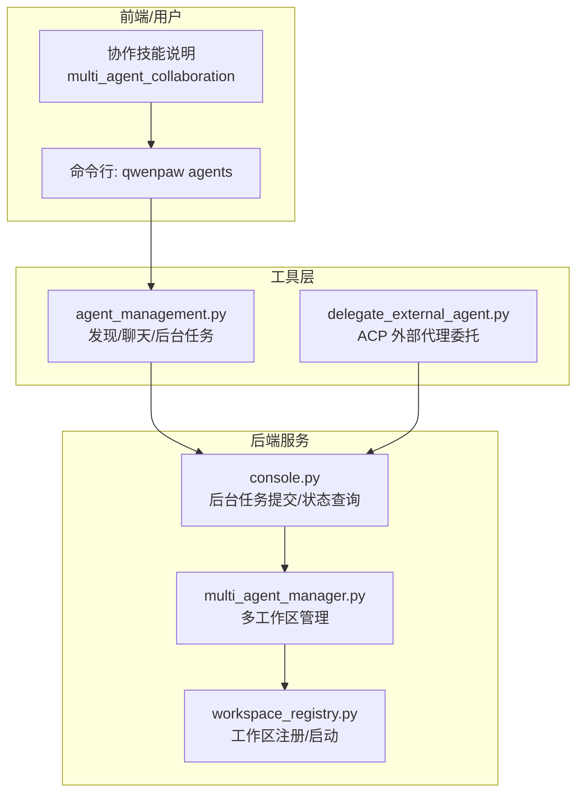
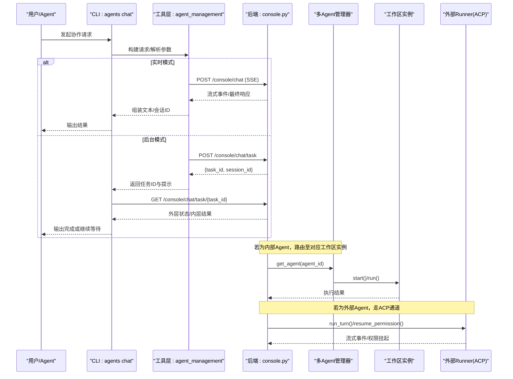
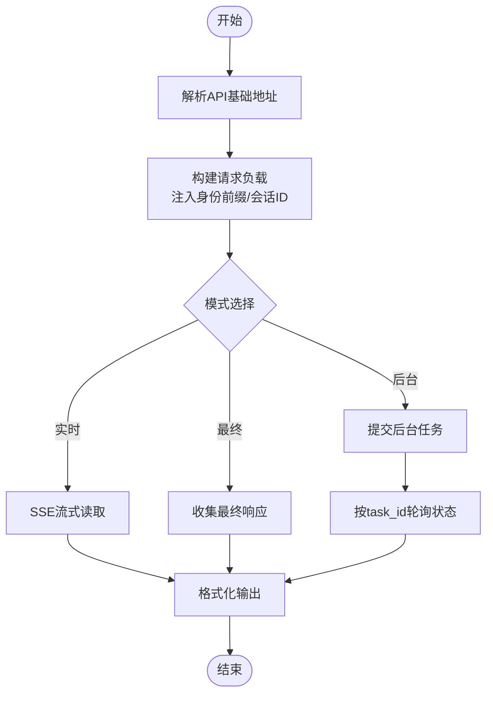
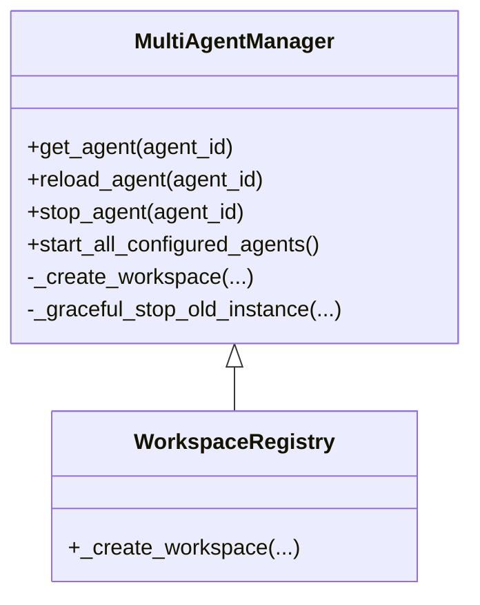
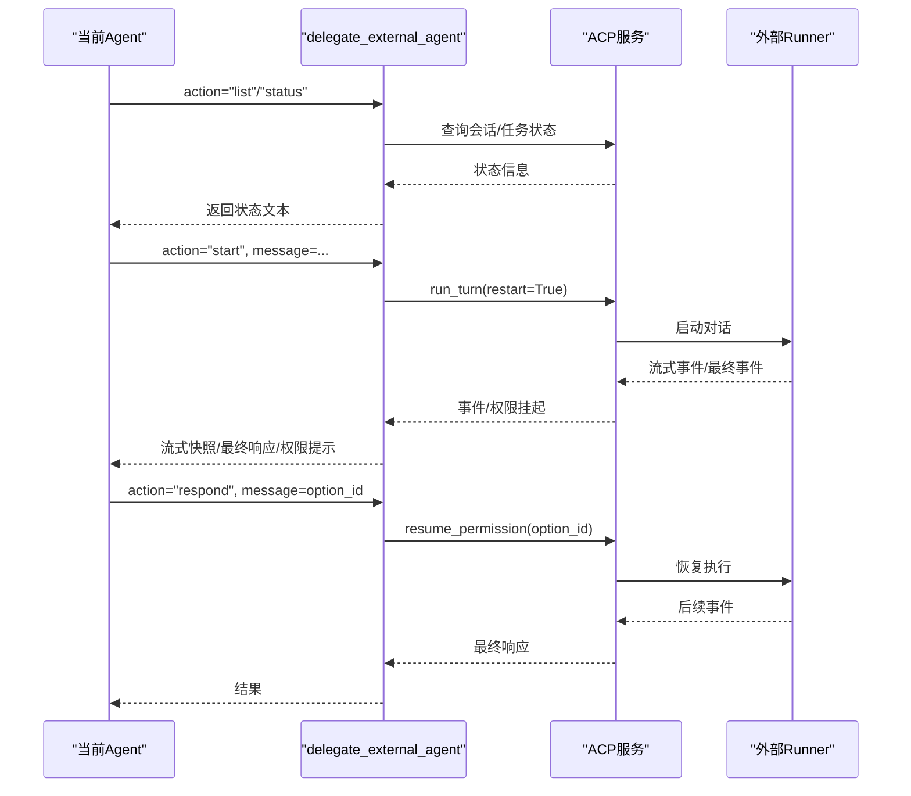
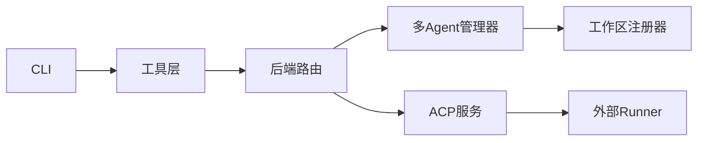

# Agent 协作卡片

<cite>
**本文引用的文件**   
- [src/qwenpaw/agents/skills/multi_agent_collaboration-zh/SKILL.md](file://src/qwenpaw/agents/skills/multi_agent_collaboration-zh/SKILL.md)
- [src/qwenpaw/agents/tools/agent_management.py](file://src/qwenpaw/agents/tools/agent_management.py)
- [src/qwenpaw/cli/agents_cmd.py](file://src/qwenpaw/cli/agents_cmd.py)
- [src/qwenpaw/app/routers/console.py](file://src/qwenpaw/app/routers/console.py)
- [src/qwenpaw/app/multi_agent_manager.py](file://src/qwenpaw/app/multi_agent_manager.py)
- [src/qwenpaw/app/workspace_registry.py](file://src/qwenpaw/app/workspace_registry.py)
- [src/qwenpaw/agents/tools/delegate_external_agent.py](file://src/qwenpaw/agents/tools/delegate_external_agent.py)
</cite>

## 目录
1. [简介](#简介)
2. [项目结构](#项目结构)
3. [核心组件](#核心组件)
4. [架构总览](#架构总览)
5. [详细组件分析](#详细组件分析)
6. [依赖关系分析](#依赖关系分析)
7. [性能与并发特性](#性能与并发特性)
8. [故障排查指南](#故障排查指南)
9. [结论](#结论)
10. [附录：最佳实践与使用示例](#附录最佳实践与使用示例)

## 简介
本文件围绕 QwenPaw 的“多智能体协作”能力，系统化梳理并解释以下方面：
- 协作卡片的职责边界、通信协议与状态同步机制
- Agent 发现、路由选择与负载均衡策略
- 异步任务处理、进度跟踪与错误恢复
- 外部 Agent 集成（ACP）与内部 Agent 间协作（HTTP SSE）
- 实际使用场景与最佳实践

## 项目结构
与“Agent 协作卡片”直接相关的代码分布在技能说明、工具层、CLI 与后端路由中：
- 技能说明：定义何时使用、命令规范与交互流程
- 工具层：提供 agent 发现、会话管理、前后端通信封装
- CLI：对外暴露 agents list/chat 等命令
- 后端路由：实现后台任务提交与状态查询
- 多 Agent 管理器：负责工作区实例的懒加载、热重载与生命周期管理
- 外部 Agent 集成：通过 ACP 协议与外部 runner 对话、权限审批与流式输出

图表来源
- [src/qwenpaw/agents/tools/agent_management.py:1-120](file://src/qwenpaw/agents/tools/agent_management.py#L1-L120)
- [src/qwenpaw/cli/agents_cmd.py:447-503](file://src/qwenpaw/cli/agents_cmd.py#L447-L503)
- [src/qwenpaw/app/routers/console.py:588-640](file://src/qwenpaw/app/routers/console.py#L588-L640)
- [src/qwenpaw/app/multi_agent_manager.py:23-159](file://src/qwenpaw/app/multi_agent_manager.py#L23-L159)
- [src/qwenpaw/app/workspace_registry.py:24-46](file://src/qwenpaw/app/workspace_registry.py#L24-L46)

章节来源
- [src/qwenpaw/agents/skills/multi_agent_collaboration-zh/SKILL.md:1-120](file://src/qwenpaw/agents/skills/multi_agent_collaboration-zh/SKILL.md#L1-L120)
- [src/qwenpaw/agents/tools/agent_management.py:1-120](file://src/qwenpaw/agents/tools/agent_management.py#L1-L120)
- [src/qwenpaw/cli/agents_cmd.py:447-503](file://src/qwenpaw/cli/agents_cmd.py#L447-L503)
- [src/qwenpaw/app/routers/console.py:588-640](file://src/qwenpaw/app/routers/console.py#L588-L640)
- [src/qwenpaw/app/multi_agent_manager.py:23-159](file://src/qwenpaw/app/multi_agent_manager.py#L23-L159)
- [src/qwenpaw/app/workspace_registry.py:24-46](file://src/qwenpaw/app/workspace_registry.py#L24-L46)

## 核心组件
- 协作技能说明（multi_agent_collaboration）
  - 明确何时调用其他 Agent、如何列出可用 Agent、实时模式与后台模式的差异、续聊与会话复用规则、常见错误与避免循环。
- 工具层（agent_management.py）
  - 提供 Agent 列表获取、目标存在性校验、会话 ID 生成与复用、身份前缀注入、SSE 流式读取、后台任务提交与状态查询、结果格式化。
- CLI（agents_cmd.py）
  - 暴露 agents list/chat 命令，支持实时/最终/流式/后台模式，参数校验与输出展示。
- 后端路由（console.py）
  - 后台任务提交接口 /console/chat/task，返回 task_id；状态查询接口 /console/chat/task/{task_id}，返回外层状态与内层结果。
- 多 Agent 管理器（multi_agent_manager.py）
  - 懒加载、并行启动、原子替换与零停机热重载、延迟清理旧实例。
- 工作区注册器（workspace_registry.py）
  - 在创建 Workspace 时注入 bootstrap 插件与应用服务。
- 外部 Agent 委托（delegate_external_agent.py）
  - 基于 ACP 协议的外部 runner 管理：list/status/start/message/respond/close，流式输出、超时中断、权限挂起与恢复。

章节来源
- [src/qwenpaw/agents/skills/multi_agent_collaboration-zh/SKILL.md:1-120](file://src/qwenpaw/agents/skills/multi_agent_collaboration-zh/SKILL.md#L1-L120)
- [src/qwenpaw/agents/tools/agent_management.py:1-120](file://src/qwenpaw/agents/tools/agent_management.py#L1-L120)
- [src/qwenpaw/cli/agents_cmd.py:447-503](file://src/qwenpaw/cli/agents_cmd.py#L447-L503)
- [src/qwenpaw/app/routers/console.py:588-640](file://src/qwenpaw/app/routers/console.py#L588-L640)
- [src/qwenpaw/app/multi_agent_manager.py:23-159](file://src/qwenpaw/app/multi_agent_manager.py#L23-L159)
- [src/qwenpaw/app/workspace_registry.py:24-46](file://src/qwenpaw/app/workspace_registry.py#L24-L46)
- [src/qwenpaw/agents/tools/delegate_external_agent.py:1-120](file://src/qwenpaw/agents/tools/delegate_external_agent.py#L1-L120)

## 架构总览
下图展示了从 CLI 到后端的完整协作链路，包括实时与后台两种模式，以及外部 Agent 的 ACP 集成路径。

图表来源
- [src/qwenpaw/cli/agents_cmd.py:806-820](file://src/qwenpaw/cli/agents_cmd.py#L806-L820)
- [src/qwenpaw/agents/tools/agent_management.py:262-314](file://src/qwenpaw/agents/tools/agent_management.py#L262-L314)
- [src/qwenpaw/app/routers/console.py:588-640](file://src/qwenpaw/app/routers/console.py#L588-L640)
- [src/qwenpaw/app/multi_agent_manager.py:54-159](file://src/qwenpaw/app/multi_agent_manager.py#L54-L159)
- [src/qwenpaw/agents/tools/delegate_external_agent.py:432-488](file://src/qwenpaw/agents/tools/delegate_external_agent.py#L432-L488)

## 详细组件分析

### 协作技能说明（multi_agent_collaboration）
- 决策规则
  - 优先遵循用户明确要求；能自做则不调用；调用前先查 Agent；需要上下文续聊必须传 session-id；不要回调消息来源 Agent。
- 常用命令
  - 列出可用 Agent；发起新对话（实时模式）；提交复杂任务（后台模式）；查询后台任务状态；继续已有对话。
- 关键规则
  - 必填 from-agent/to-agent/text；消息建议以身份前缀开头；首次调用返回 SESSION，后续续聊需携带 session-id。
- 后台任务模式
  - 外层状态：submitted → pending → running → finished；内层状态：completed 或 failed；建议合理间隔轮询，避免频繁查询。

章节来源
- [src/qwenpaw/agents/skills/multi_agent_collaboration-zh/SKILL.md:1-120](file://src/qwenpaw/agents/skills/multi_agent_collaboration-zh/SKILL.md#L1-L120)
- [src/qwenpaw/agents/skills/multi_agent_collaboration-zh/SKILL.md:293-466](file://src/qwenpaw/agents/skills/multi_agent_collaboration-zh/SKILL.md#L293-L466)

### 工具层：Agent 发现与协作（agent_management.py）
- 功能要点
  - 解析 base_url（显式 > 上次记录 > 默认 localhost）
  - 生成唯一会话 ID（from:to:timestamp:uuid）
  - 自动注入身份前缀，确保目标知道来源
  - 支持实时/最终/流式三种响应模式
  - 后台任务提交与状态查询，统一格式化输出
- 关键函数
  - resolve_agent_api_base_url/_normalize_api_base_url
  - generate_unique_session_id/resolve_agent_session_id
  - ensure_agent_identity_prefix
  - stream_agent_chat/collect_final_agent_chat_response
  - submit_agent_chat_task/get_agent_chat_task_status
  - format_background_submission_text/format_background_status_text

图表来源
- [src/qwenpaw/agents/tools/agent_management.py:25-48](file://src/qwenpaw/agents/tools/agent_management.py#L25-L48)
- [src/qwenpaw/agents/tools/agent_management.py:83-131](file://src/qwenpaw/agents/tools/agent_management.py#L83-L131)
- [src/qwenpaw/agents/tools/agent_management.py:262-314](file://src/qwenpaw/agents/tools/agent_management.py#L262-L314)
- [src/qwenpaw/agents/tools/agent_management.py:317-354](file://src/qwenpaw/agents/tools/agent_management.py#L317-L354)
- [src/qwenpaw/agents/tools/agent_management.py:370-430](file://src/qwenpaw/agents/tools/agent_management.py#L370-L430)

章节来源
- [src/qwenpaw/agents/tools/agent_management.py:1-120](file://src/qwenpaw/agents/tools/agent_management.py#L1-L120)
- [src/qwenpaw/agents/tools/agent_management.py:262-314](file://src/qwenpaw/agents/tools/agent_management.py#L262-L314)
- [src/qwenpaw/agents/tools/agent_management.py:317-354](file://src/qwenpaw/agents/tools/agent_management.py#L317-L354)
- [src/qwenpaw/agents/tools/agent_management.py:370-430](file://src/qwenpaw/agents/tools/agent_management.py#L370-L430)

### CLI：agents 子命令（agents_cmd.py）
- 主要命令
  - agents list：列出所有已配置 Agent
  - agents chat：支持实时/最终/流式/后台模式，参数校验严格，输出友好提示
- 后台任务交互
  - 提交任务后立即返回 task_id 与 session_id，并给出轮询建议
  - 查询任务状态时区分 finished/running/pending/submitted，并在完成时输出最终内容

章节来源
- [src/qwenpaw/cli/agents_cmd.py:447-503](file://src/qwenpaw/cli/agents_cmd.py#L447-L503)
- [src/qwenpaw/cli/agents_cmd.py:806-820](file://src/qwenpaw/cli/agents_cmd.py#L806-L820)
- [src/qwenpaw/cli/agents_cmd.py:105-139](file://src/qwenpaw/cli/agents_cmd.py#L105-L139)
- [src/qwenpaw/cli/agents_cmd.py:192-291](file://src/qwenpaw/cli/agents_cmd.py#L192-L291)

### 后端路由：后台任务（console.py）
- 接口
  - POST /console/chat/task：提交后台任务，返回 task_id
  - GET /console/chat/task/{task_id}：查询任务状态，包含外层状态与内层结果
- 状态流转
  - 外层：submitted → pending → running → finished
  - 内层（finished 时）：completed 或 failed
- 超时保护
  - 可设置 task_timeout，超时将取消任务并标记完成

章节来源
- [src/qwenpaw/app/routers/console.py:588-640](file://src/qwenpaw/app/routers/console.py#L588-L640)

### 多 Agent 管理器与工作区注册（multi_agent_manager.py, workspace_registry.py）
- 懒加载与去重
  - 首次访问才创建并启动工作区；并发访问同一 Agent 时，首个创建者负责初始化，其余等待
- 零停机热重载
  - 先创建并启动新实例，再原子替换旧实例，随后后台优雅停止旧实例（有活跃任务则延迟清理）
- 并行启动
  - 仅对字典操作持有细粒度锁，慢速初始化阶段释放锁，允许真正并行启动多个 Agent
- 工作区注册器
  - 在创建 Workspace 时注入 bootstrap 插件与应用服务

图表来源
- [src/qwenpaw/app/multi_agent_manager.py:23-159](file://src/qwenpaw/app/multi_agent_manager.py#L23-L159)
- [src/qwenpaw/app/multi_agent_manager.py:321-448](file://src/qwenpaw/app/multi_agent_manager.py#L321-L448)
- [src/qwenpaw/app/workspace_registry.py:24-46](file://src/qwenpaw/app/workspace_registry.py#L24-L46)

章节来源
- [src/qwenpaw/app/multi_agent_manager.py:23-159](file://src/qwenpaw/app/multi_agent_manager.py#L23-L159)
- [src/qwenpaw/app/multi_agent_manager.py:321-448](file://src/qwenpaw/app/multi_agent_manager.py#L321-L448)
- [src/qwenpaw/app/workspace_registry.py:24-46](file://src/qwenpaw/app/workspace_registry.py#L24-L46)

### 外部 Agent 集成（ACP）：delegate_external_agent.py
- 能力
  - list：列出可用的外部 ACP runners 及其状态
  - status：查看指定 runner 的任务状态、会话状态与待审批权限
  - start/message/respond/close：开启对话、继续对话、回复权限、关闭会话
- 流式输出与超时控制
  - 周期性快照刷新，支持最大运行时间限制，到达上限会中断并提示继续方式
- 权限挂起与恢复
  - 当外部 runner 请求权限时，返回挂起信息；调用 respond 传入选项 id 恢复执行

图表来源
- [src/qwenpaw/agents/tools/delegate_external_agent.py:282-322](file://src/qwenpaw/agents/tools/delegate_external_agent.py#L282-L322)
- [src/qwenpaw/agents/tools/delegate_external_agent.py:432-488](file://src/qwenpaw/agents/tools/delegate_external_agent.py#L432-L488)
- [src/qwenpaw/agents/tools/delegate_external_agent.py:491-691](file://src/qwenpaw/agents/tools/delegate_external_agent.py#L491-L691)

章节来源
- [src/qwenpaw/agents/tools/delegate_external_agent.py:1-120](file://src/qwenpaw/agents/tools/delegate_external_agent.py#L1-L120)
- [src/qwenpaw/agents/tools/delegate_external_agent.py:432-488](file://src/qwenpaw/agents/tools/delegate_external_agent.py#L432-L488)
- [src/qwenpaw/agents/tools/delegate_external_agent.py:491-691](file://src/qwenpaw/agents/tools/delegate_external_agent.py#L491-L691)

## 依赖关系分析
- 组件耦合
  - CLI 依赖工具层进行参数校验与网络调用
  - 工具层依赖后端路由提供的 REST/SSE 接口
  - 后端路由在多 Agent 模式下通过管理器获取具体工作区实例
  - 外部 Agent 通过 ACP 服务与外部 runner 通信
- 潜在环路与解耦
  - 工具层与后端路由通过 HTTP 解耦；ACP 通过服务抽象隔离外部实现
  - 多 Agent 管理器通过工厂方法扩展工作区创建逻辑，降低耦合

图表来源
- [src/qwenpaw/cli/agents_cmd.py:447-503](file://src/qwenpaw/cli/agents_cmd.py#L447-L503)
- [src/qwenpaw/agents/tools/agent_management.py:262-314](file://src/qwenpaw/agents/tools/agent_management.py#L262-L314)
- [src/qwenpaw/app/routers/console.py:588-640](file://src/qwenpaw/app/routers/console.py#L588-L640)
- [src/qwenpaw/app/multi_agent_manager.py:23-159](file://src/qwenpaw/app/multi_agent_manager.py#L23-L159)
- [src/qwenpaw/app/workspace_registry.py:24-46](file://src/qwenpaw/app/workspace_registry.py#L24-L46)
- [src/qwenpaw/agents/tools/delegate_external_agent.py:70-107](file://src/qwenpaw/agents/tools/delegate_external_agent.py#L70-L107)

章节来源
- [src/qwenpaw/cli/agents_cmd.py:447-503](file://src/qwenpaw/cli/agents_cmd.py#L447-L503)
- [src/qwenpaw/agents/tools/agent_management.py:262-314](file://src/qwenpaw/agents/tools/agent_management.py#L262-L314)
- [src/qwenpaw/app/routers/console.py:588-640](file://src/qwenpaw/app/routers/console.py#L588-L640)
- [src/qwenpaw/app/multi_agent_manager.py:23-159](file://src/qwenpaw/app/multi_agent_manager.py#L23-L159)
- [src/qwenpaw/app/workspace_registry.py:24-46](file://src/qwenpaw/app/workspace_registry.py#L24-L46)
- [src/qwenpaw/agents/tools/delegate_external_agent.py:70-107](file://src/qwenpaw/agents/tools/delegate_external_agent.py#L70-L107)

## 性能与并发特性
- 多 Agent 并行启动
  - 仅在字典检查与替换时持有锁，慢速初始化阶段释放锁，允许多个 Agent 真正并行启动
- 零停机热重载
  - 新实例完全就绪后再原子替换，旧实例根据活跃任务情况延迟清理，保证服务连续性
- 后台任务与轮询
  - 提交后立即返回，客户端按需轮询；建议递增间隔，避免频繁查询造成压力
- 流式输出与超时
  - 定期快照刷新，结合最大运行时间控制，防止长时间占用资源

章节来源
- [src/qwenpaw/app/multi_agent_manager.py:321-448](file://src/qwenpaw/app/multi_agent_manager.py#L321-L448)
- [src/qwenpaw/app/routers/console.py:588-640](file://src/qwenpaw/app/routers/console.py#L588-L640)
- [src/qwenpaw/agents/tools/delegate_external_agent.py:491-691](file://src/qwenpaw/agents/tools/delegate_external_agent.py#L491-L691)

## 故障排查指南
- 常见问题
  - 未先查询可用 Agent 导致 to_agent 不存在
  - 续聊未传 session-id 导致上下文丢失
  - 回调消息来源 Agent 导致循环
  - 后台任务频繁查询导致阻塞
- 定位步骤
  - 使用 agents list 确认目标 Agent 是否存在
  - 检查会话 ID 是否正确传递与复用
  - 查看后台任务状态，关注外层与内层状态
  - 对于 ACP 外部 Agent，检查 status 中的会话状态与待审批权限
- 恢复策略
  - 重新发起对话或续聊，确保 session-id 正确
  - 调整轮询间隔，避免高频查询
  - 针对 ACP 权限挂起，使用 respond 传入正确的 option_id

章节来源
- [src/qwenpaw/agents/skills/multi_agent_collaboration-zh/SKILL.md:213-231](file://src/qwenpaw/agents/skills/multi_agent_collaboration-zh/SKILL.md#L213-L231)
- [src/qwenpaw/agents/skills/multi_agent_collaboration-zh/SKILL.md:417-466](file://src/qwenpaw/agents/skills/multi_agent_collaboration-zh/SKILL.md#L417-L466)
- [src/qwenpaw/agents/tools/delegate_external_agent.py:325-366](file://src/qwenpaw/agents/tools/delegate_external_agent.py#L325-L366)

## 结论
QwenPaw 的多 Agent 协作体系通过清晰的技能说明、健壮的通信工具层、友好的 CLI 与稳定的后端路由，实现了高效、可扩展的跨 Agent 协作。配合多 Agent 管理器的懒加载与热重载，以及 ACP 外部集成能力，系统既满足实时交互需求，也支持复杂任务的异步处理与进度跟踪。

## 附录：最佳实践与使用示例
- 协作模式最佳实践
  - 先列后调：始终先执行 agents list，再选择目标 Agent
  - 会话复用：续聊务必携带 session-id，避免上下文丢失
  - 模式选择：简单查询用实时模式，复杂任务用后台模式
  - 轮询策略：提交后继续处理其他工作，合理间隔查询状态
  - 避免循环：刚收到某 Agent 的消息，不要再回调该 Agent
- 使用示例（命令级）
  - 列出可用 Agent：qwenpaw agents list
  - 实时对话：qwenpaw agents chat --from-agent A --to-agent B --text "..."
  - 后台任务：qwenpaw agents chat --background --from-agent A --to-agent B --text "..."
  - 查询状态：qwenpaw agents chat --background --task-id <id>
- 代码片段路径（不直接展示代码）
  - 工具层：[src/qwenpaw/agents/tools/agent_management.py:262-314](file://src/qwenpaw/agents/tools/agent_management.py#L262-L314)
  - CLI：[src/qwenpaw/cli/agents_cmd.py:806-820](file://src/qwenpaw/cli/agents_cmd.py#L806-L820)
  - 后端路由：[src/qwenpaw/app/routers/console.py:588-640](file://src/qwenpaw/app/routers/console.py#L588-L640)
  - 外部集成：[src/qwenpaw/agents/tools/delegate_external_agent.py:432-488](file://src/qwenpaw/agents/tools/delegate_external_agent.py#L432-L488)