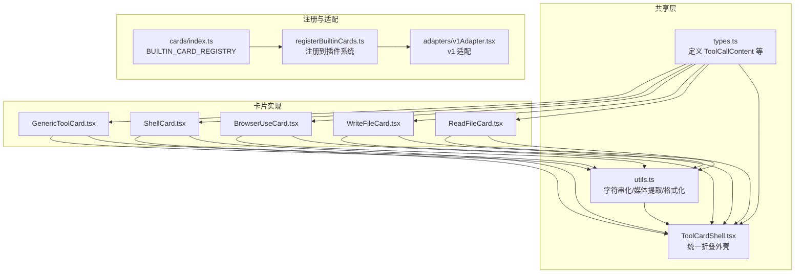
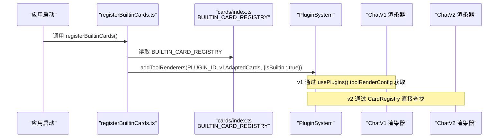
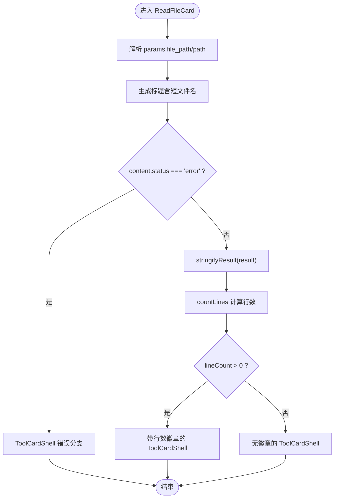
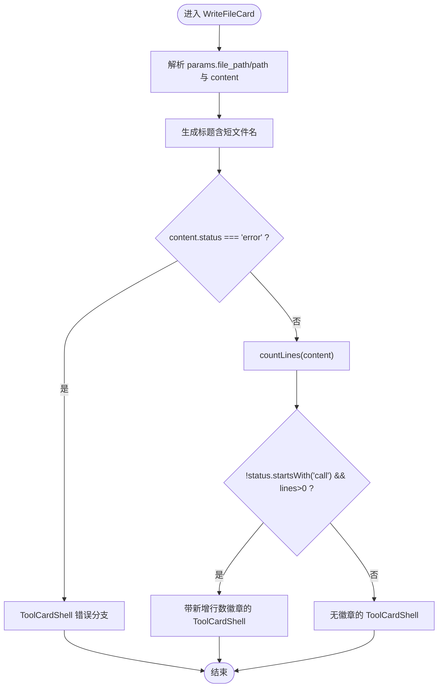
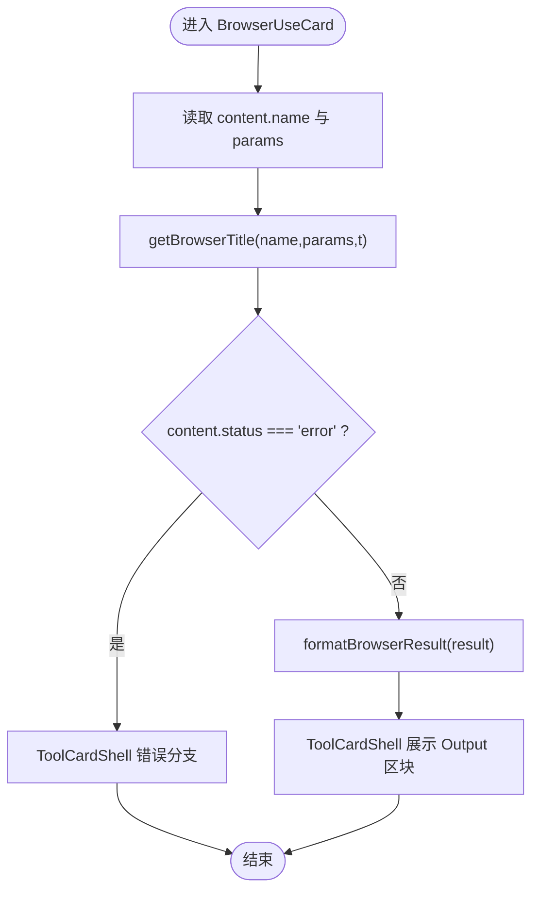
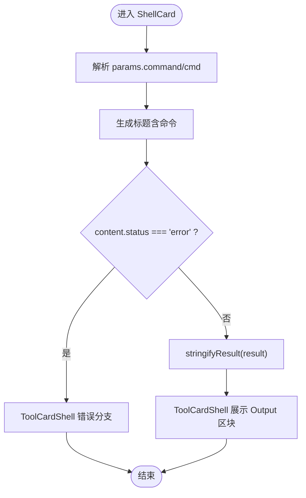
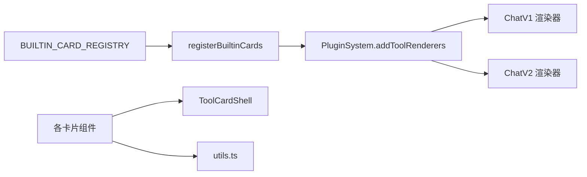

# 内置卡片实现

<cite>
**本文引用的文件**   
- [console/src/components/Chat/ToolCards/cards/GenericToolCard.tsx](file://console/src/components/Chat/ToolCards/cards/GenericToolCard.tsx)
- [console/src/components/Chat/ToolCards/cards/ReadFileCard.tsx](file://console/src/components/Chat/ToolCards/cards/ReadFileCard.tsx)
- [console/src/components/Chat/ToolCards/cards/WriteFileCard.tsx](file://console/src/components/Chat/ToolCards/cards/WriteFileCard.tsx)
- [console/src/components/Chat/ToolCards/cards/BrowserUseCard.tsx](file://console/src/components/Chat/ToolCards/cards/BrowserUseCard.tsx)
- [console/src/components/Chat/ToolCards/cards/ShellCard.tsx](file://console/src/components/Chat/ToolCards/cards/ShellCard.tsx)
- [console/src/components/Chat/ToolCards/shared/types.ts](file://console/src/components/Chat/ToolCards/shared/types.ts)
- [console/src/components/Chat/ToolCards/shared/ToolCardShell.tsx](file://console/src/components/Chat/ToolCards/shared/ToolCardShell.tsx)
- [console/src/components/Chat/ToolCards/shared/utils.ts](file://console/src/components/Chat/ToolCards/shared/utils.ts)
- [console/src/components/Chat/ToolCards/registerBuiltinCards.ts](file://console/src/components/Chat/ToolCards/registerBuiltinCards.ts)
- [console/src/components/Chat/ToolCards/cards/index.ts](file://console/src/components/Chat/ToolCards/cards/index.ts)
</cite>

## 目录
1. [简介](#简介)
2. [项目结构](#项目结构)
3. [核心组件](#核心组件)
4. [架构总览](#架构总览)
5. [详细组件分析](#详细组件分析)
6. [依赖关系分析](#依赖关系分析)
7. [性能与体验优化建议](#性能与体验优化建议)
8. [故障排查指南](#故障排查指南)
9. [结论](#结论)
10. [附录：扩展机制与最佳实践](#附录扩展机制与最佳实践)

## 简介
本文件面向 QwenPaw 前端控制台中的“内置工具卡片”子系统，系统性梳理并解释以下内置卡片的实现与使用方式：
- 文件操作卡片：ReadFileCard、WriteFileCard
- 浏览器控制卡片：BrowserUseCard
- Shell 执行卡片：ShellCard
- 通用卡片：GenericToolCard（抽象兜底）

文档将覆盖每个卡片的核心功能、用户交互流程、数据处理逻辑、状态管理、事件处理、样式定制点，以及通用卡片 GenericToolCard 的抽象设计与扩展机制。同时提供实际使用场景的代码示例路径与最佳实践指导。

## 项目结构
内置卡片位于 console 前端的 ToolCards 模块中，采用“共享壳 + 具体卡片 + 注册表 + 适配器”的分层组织方式：
- shared：通用类型、外壳组件、工具函数
- cards：各具体卡片组件及统一导出与注册表
- adapters：为 ChatV1 兼容层做适配
- registerBuiltinCards：应用启动时一次性注册所有内置卡片到插件系统



图表来源
- [console/src/components/Chat/ToolCards/shared/types.ts:1-29](file://console/src/components/Chat/ToolCards/shared/types.ts#L1-L29)
- [console/src/components/Chat/ToolCards/shared/ToolCardShell.tsx:1-93](file://console/src/components/Chat/ToolCards/shared/ToolCardShell.tsx#L1-L93)
- [console/src/components/Chat/ToolCards/shared/utils.ts:1-581](file://console/src/components/Chat/ToolCards/shared/utils.ts#L1-L581)
- [console/src/components/Chat/ToolCards/cards/index.ts:1-135](file://console/src/components/Chat/ToolCards/cards/index.ts#L1-L135)
- [console/src/components/Chat/ToolCards/registerBuiltinCards.ts:1-39](file://console/src/components/Chat/ToolCards/registerBuiltinCards.ts#L1-L39)

章节来源
- [console/src/components/Chat/ToolCards/cards/index.ts:1-135](file://console/src/components/Chat/ToolCards/cards/index.ts#L1-L135)
- [console/src/components/Chat/ToolCards/registerBuiltinCards.ts:1-39](file://console/src/components/Chat/ToolCards/registerBuiltinCards.ts#L1-L39)

## 核心组件
本节聚焦通用能力与关键数据结构，帮助理解各卡片如何复用公共逻辑。

- 数据类型
  - ToolCallContent：描述一次工具调用的完整上下文，包括 id、name、serverLabel、params、result、status 等字段。
  - ToolCallStatus：调用状态枚举，包含 calling、done、error。
  - ToolCardProps / ToolCardComponent：用于插件系统的统一卡片接口。

- 通用外壳 ToolCardShell
  - 负责统一的折叠展示布局：图标 + 标题行 + 可选徽章 + 展开体内容。
  - 根据 content.status 和 isStreaming 渲染加载态、错误态或成功态。
  - 错误态下自动展示 Input 与 Error 两个区块；成功态下渲染 children。

- 通用工具 utils
  - stringifyResult：安全地将 result 转换为可显示文本，支持 MCP 内容块数组格式。
  - shortFileName、countLines：文件名截断与行数统计，用于 Read/Write 卡片徽章。
  - getMediaInfo、toDisplayUrl：媒体链接解析与预览地址转换。
  - formatMemorySearch、formatAgentList：结构化结果转 Markdown 表格/列表。
  - looksLikeMarkdown：简单判断是否像 Markdown。

章节来源
- [console/src/components/Chat/ToolCards/shared/types.ts:1-29](file://console/src/components/Chat/ToolCards/shared/types.ts#L1-L29)
- [console/src/components/Chat/ToolCards/shared/ToolCardShell.tsx:1-93](file://console/src/components/Chat/ToolCards/shared/ToolCardShell.tsx#L1-L93)
- [console/src/components/Chat/ToolCards/shared/utils.ts:1-581](file://console/src/components/Chat/ToolCards/shared/utils.ts#L1-L581)

## 架构总览
内置卡片通过“注册表 + 插件系统”的方式被全局发现与渲染。整体流程如下：



图表来源
- [console/src/components/Chat/ToolCards/registerBuiltinCards.ts:1-39](file://console/src/components/Chat/ToolCards/registerBuiltinCards.ts#L1-L39)
- [console/src/components/Chat/ToolCards/cards/index.ts:1-135](file://console/src/components/Chat/ToolCards/cards/index.ts#L1-L135)

## 详细组件分析

### 文件操作卡片：ReadFileCard
- 核心功能
  - 以可读形式展示 read_file 工具的输出，并在完成时显示读取的行数徽章。
- 参数与数据流
  - 从 content.params 中取 file_path 或 path，短名作为标题的一部分。
  - 使用 stringifyResult 将 result 转为文本，计算行数并生成徽章。
- 状态与交互
  - error 状态：仅展示输入与错误信息。
  - done/calling 状态：展示输出内容区块。
- 样式与国际化
  - 使用 ToolCardShell 统一外壳，结合 toolCards.module.less 中的 lineReadBadge 样式类。
  - 标题与徽章文案来自 i18n。



图表来源
- [console/src/components/Chat/ToolCards/cards/ReadFileCard.tsx:1-58](file://console/src/components/Chat/ToolCards/cards/ReadFileCard.tsx#L1-L58)
- [console/src/components/Chat/ToolCards/shared/utils.ts:27-37](file://console/src/components/Chat/ToolCards/shared/utils.ts#L27-L37)
- [console/src/components/Chat/ToolCards/shared/utils.ts:558-581](file://console/src/components/Chat/ToolCards/shared/utils.ts#L558-L581)

章节来源
- [console/src/components/Chat/ToolCards/cards/ReadFileCard.tsx:1-58](file://console/src/components/Chat/ToolCards/cards/ReadFileCard.tsx#L1-L58)
- [console/src/components/Chat/ToolCards/shared/utils.ts:27-37](file://console/src/components/Chat/ToolCards/shared/utils.ts#L27-L37)
- [console/src/components/Chat/ToolCards/shared/utils.ts:558-581](file://console/src/components/Chat/ToolCards/shared/utils.ts#L558-L581)

### 文件操作卡片：WriteFileCard
- 核心功能
  - 展示 write_file 写入的内容摘要，并在非调用中状态下显示新增行数徽章。
- 参数与数据流
  - 从 params 中取 file_path/path 与 content 字段，前者用于标题，后者用于内容展示与行数统计。
- 状态与交互
  - error 状态：仅展示输入与错误信息。
  - done/calling 状态：展示写入内容与行数徽章。
- 样式与国际化
  - 使用 diffAddBadge 样式类表示“新增行数”。



图表来源
- [console/src/components/Chat/ToolCards/cards/WriteFileCard.tsx:1-62](file://console/src/components/Chat/ToolCards/cards/WriteFileCard.tsx#L1-L62)
- [console/src/components/Chat/ToolCards/shared/utils.ts:27-37](file://console/src/components/Chat/ToolCards/shared/utils.ts#L27-L37)

章节来源
- [console/src/components/Chat/ToolCards/cards/WriteFileCard.tsx:1-62](file://console/src/components/Chat/ToolCards/cards/WriteFileCard.tsx#L1-L62)
- [console/src/components/Chat/ToolCards/shared/utils.ts:27-37](file://console/src/components/Chat/ToolCards/shared/utils.ts#L27-L37)

### 浏览器控制卡片：BrowserUseCard
- 核心功能
  - 聚合多种浏览器相关工具（如 browser_use、browser_navigate、click、type、snapshot、scroll 等），统一渲染标题与结果。
- 标题生成策略
  - 针对 browser_use 动作（start/stop/open/navigate/click/type/snapshot/screenshot/eval/run_code/close/tabs/fill_form/file_upload/file_download/press_key/hover/drag/select_option/wait_for/resize/pdf/install/batch）动态生成人类可读标题。
  - 其他独立工具名（如 navigate、click、type、snapshot、scroll）也有对应标题映射。
- 结果格式化
  - formatBrowserResult 优先尝试从对象中提取 snapshot/message/url 字段；若结果为字符串则尝试 JSON 解析；若为 MCP 内容块数组则提取 text 子项；最终回退到 stringifyResult。
- 状态与交互
  - error 状态：仅展示输入与错误信息。
  - done/calling 状态：展示格式化后的输出文本。



图表来源
- [console/src/components/Chat/ToolCards/cards/BrowserUseCard.tsx:1-288](file://console/src/components/Chat/ToolCards/cards/BrowserUseCard.tsx#L1-L288)
- [console/src/components/Chat/ToolCards/shared/utils.ts:558-581](file://console/src/components/Chat/ToolCards/shared/utils.ts#L558-L581)

章节来源
- [console/src/components/Chat/ToolCards/cards/BrowserUseCard.tsx:1-288](file://console/src/components/Chat/ToolCards/cards/BrowserUseCard.tsx#L1-L288)
- [console/src/components/Chat/ToolCards/shared/utils.ts:558-581](file://console/src/components/Chat/ToolCards/shared/utils.ts#L558-L581)

### Shell 执行卡片：ShellCard
- 核心功能
  - 以命令+输出的形式展示 shell 工具调用结果。
- 参数与数据流
  - 从 params.command 或 params.cmd 取命令文本，构建标题。
  - 使用 stringifyResult 将 result 转为文本展示。
- 状态与交互
  - error 状态：仅展示输入与错误信息。
  - done/calling 状态：展示输出文本。



图表来源
- [console/src/components/Chat/ToolCards/cards/ShellCard.tsx:1-53](file://console/src/components/Chat/ToolCards/cards/ShellCard.tsx#L1-L53)
- [console/src/components/Chat/ToolCards/shared/utils.ts:558-581](file://console/src/components/Chat/ToolCards/shared/utils.ts#L558-L581)

章节来源
- [console/src/components/Chat/ToolCards/cards/ShellCard.tsx:1-53](file://console/src/components/Chat/ToolCards/cards/ShellCard.tsx#L1-L53)
- [console/src/components/Chat/ToolCards/shared/utils.ts:558-581](file://console/src/components/Chat/ToolCards/shared/utils.ts#L558-L581)

### 通用卡片：GenericToolCard
- 设计目标
  - 作为未注册到内置卡片的工具调用的兜底渲染器，确保任何工具都能以一致的形式呈现。
- 行为说明
  - 标题：优先使用 serverLabel/name 组合，否则仅用 name。
  - 输出：当存在 result 时，使用 stringifyResult 生成“Output”区块。
  - 状态：由 ToolCardShell 统一处理 loading/error/done。
- 扩展意义
  - 新工具无需立即实现专用卡片，即可在 UI 上获得基础展示能力。

```mermaid
classDiagram
class GenericToolCard {
+props : { content, isStreaming }
+render() : JSX
}
class ToolCardShell {
+props : { content, isStreaming, icon, title, badges, inlineResult, children }
+render() : JSX
}
class Utils {
+stringifyResult(result) : string
}
GenericToolCard --> ToolCardShell : "使用"
GenericToolCard --> Utils : "调用"
```

图表来源
- [console/src/components/Chat/ToolCards/cards/GenericToolCard.tsx:1-44](file://console/src/components/Chat/ToolCards/cards/GenericToolCard.tsx#L1-L44)
- [console/src/components/Chat/ToolCards/shared/ToolCardShell.tsx:1-93](file://console/src/components/Chat/ToolCards/shared/ToolCardShell.tsx#L1-L93)
- [console/src/components/Chat/ToolCards/shared/utils.ts:558-581](file://console/src/components/Chat/ToolCards/shared/utils.ts#L558-L581)

章节来源
- [console/src/components/Chat/ToolCards/cards/GenericToolCard.tsx:1-44](file://console/src/components/Chat/ToolCards/cards/GenericToolCard.tsx#L1-L44)
- [console/src/components/Chat/ToolCards/shared/ToolCardShell.tsx:1-93](file://console/src/components/Chat/ToolCards/shared/ToolCardShell.tsx#L1-L93)
- [console/src/components/Chat/ToolCards/shared/utils.ts:558-581](file://console/src/components/Chat/ToolCards/shared/utils.ts#L558-L581)

## 依赖关系分析
- 组件耦合
  - 各具体卡片均依赖 ToolCardShell 与 utils，保持高内聚低耦合。
  - 浏览器卡片对结果格式有较强假设，但通过多分支解析保证鲁棒性。
- 注册与发现
  - cards/index.ts 维护 BUILTIN_CARD_REGISTRY，将工具名映射到组件。
  - registerBuiltinCards 在应用启动时一次性注册，避免重复注册。
- 外部依赖
  - i18n：react-i18next 的 useTranslation。
  - 图标：@ant-design/icons。
  - API：部分工具函数内部引用 chatApi（例如 toDisplayUrl）。



图表来源
- [console/src/components/Chat/ToolCards/cards/index.ts:1-135](file://console/src/components/Chat/ToolCards/cards/index.ts#L1-L135)
- [console/src/components/Chat/ToolCards/registerBuiltinCards.ts:1-39](file://console/src/components/Chat/ToolCards/registerBuiltinCards.ts#L1-L39)
- [console/src/components/Chat/ToolCards/shared/ToolCardShell.tsx:1-93](file://console/src/components/Chat/ToolCards/shared/ToolCardShell.tsx#L1-L93)
- [console/src/components/Chat/ToolCards/shared/utils.ts:1-581](file://console/src/components/Chat/ToolCards/shared/utils.ts#L1-L581)

章节来源
- [console/src/components/Chat/ToolCards/cards/index.ts:1-135](file://console/src/components/Chat/ToolCards/cards/index.ts#L1-L135)
- [console/src/components/Chat/ToolCards/registerBuiltinCards.ts:1-39](file://console/src/components/Chat/ToolCards/registerBuiltinCards.ts#L1-L39)

## 性能与体验优化建议
- 大文本渲染
  - 对于超长输出，建议在 DefaultBlock 中启用虚拟滚动或分页加载，避免首屏卡顿。
- 结果预处理
  - 在 stringifyResult 之前进行轻量级裁剪（如限制最大长度），减少 DOM 压力。
- 媒体资源
  - 使用 toDisplayUrl 统一处理预览地址，避免跨域与安全策略问题。
- 国际化与无障碍
  - 所有用户可见文案应走 i18n，并为图标与标题添加合适的 aria 属性。
- 错误边界
  - 在卡片外层包裹错误边界，防止单个卡片异常导致整条消息崩溃。

[本节为通用建议，不直接分析具体文件]

## 故障排查指南
- 标题未正确显示
  - 检查 content.params 中关键字段是否存在（如 file_path/path、command/cmd、action/url 等）。
  - 参考：
    - [ReadFileCard 参数解析:19-22](file://console/src/components/Chat/ToolCards/cards/ReadFileCard.tsx#L19-L22)
    - [ShellCard 参数解析:21-25](file://console/src/components/Chat/ToolCards/cards/ShellCard.tsx#L21-L25)
    - [BrowserUseCard 标题生成:105-248](file://console/src/components/Chat/ToolCards/cards/BrowserUseCard.tsx#L105-L248)
- 结果未显示或为空
  - 确认 result 是否为空或不可序列化；查看 stringifyResult 的处理分支。
  - 参考：
    - [stringifyResult 实现:558-581](file://console/src/components/Chat/ToolCards/shared/utils.ts#L558-L581)
- 浏览器卡片结果格式异常
  - 检查后端返回是否为对象、字符串 JSON 或 MCP 内容块数组；必要时增加日志打印原始 result。
  - 参考：
    - [formatBrowserResult 分支逻辑:36-88](file://console/src/components/Chat/ToolCards/cards/BrowserUseCard.tsx#L36-L88)
- 徽章不显示
  - 确认 status 不为 call 开头且行数大于 0。
  - 参考：
    - [WriteFileCard 徽章条件:39-44](file://console/src/components/Chat/ToolCards/cards/WriteFileCard.tsx#L39-L44)
    - [ReadFileCard 徽章条件:37-42](file://console/src/components/Chat/ToolCards/cards/ReadFileCard.tsx#L37-L42)

章节来源
- [console/src/components/Chat/ToolCards/cards/ReadFileCard.tsx:19-42](file://console/src/components/Chat/ToolCards/cards/ReadFileCard.tsx#L19-L42)
- [console/src/components/Chat/ToolCards/cards/WriteFileCard.tsx:39-44](file://console/src/components/Chat/ToolCards/cards/WriteFileCard.tsx#L39-L44)
- [console/src/components/Chat/ToolCards/cards/ShellCard.tsx:21-25](file://console/src/components/Chat/ToolCards/cards/ShellCard.tsx#L21-L25)
- [console/src/components/Chat/ToolCards/cards/BrowserUseCard.tsx:36-88](file://console/src/components/Chat/ToolCards/cards/BrowserUseCard.tsx#L36-L88)
- [console/src/components/Chat/ToolCards/shared/utils.ts:558-581](file://console/src/components/Chat/ToolCards/shared/utils.ts#L558-L581)

## 结论
QwenPaw 的内置卡片体系通过“共享外壳 + 工具函数 + 注册表 + 插件系统”的组合，实现了高内聚、可扩展、易维护的前端工具展示方案。各卡片遵循统一的状态与交互模型，既能快速落地常见工具（文件、浏览器、Shell），也能通过 GenericToolCard 兜底未知工具，保障用户体验的一致性。

[本节为总结性内容，不直接分析具体文件]

## 附录：扩展机制与最佳实践

### 扩展新卡片步骤
- 新建卡片组件
  - 在 cards 目录下创建 XxxCard.tsx，接收 content 与 isStreaming，基于 ToolCardShell 与 utils 渲染。
- 加入注册表
  - 在 cards/index.ts 的 BUILTIN_CARD_REGISTRY 中添加工具名到组件的映射。
- 注册到插件系统
  - 确保 registerBuiltinCards 在应用启动时被调用一次。
- 验证
  - 触发对应工具调用，观察卡片是否正确渲染标题、徽章与输出。

章节来源
- [console/src/components/Chat/ToolCards/cards/index.ts:78-135](file://console/src/components/Chat/ToolCards/cards/index.ts#L78-L135)
- [console/src/components/Chat/ToolCards/registerBuiltinCards.ts:26-38](file://console/src/components/Chat/ToolCards/registerBuiltinCards.ts#L26-L38)

### 代码示例路径（不含具体代码）
- 文件读取卡片
  - [ReadFileCard.tsx:14-54](file://console/src/components/Chat/ToolCards/cards/ReadFileCard.tsx#L14-L54)
- 文件写入卡片
  - [WriteFileCard.tsx:14-58](file://console/src/components/Chat/ToolCards/cards/WriteFileCard.tsx#L14-L58)
- 浏览器控制卡片
  - [BrowserUseCard.tsx:255-285](file://console/src/components/Chat/ToolCards/cards/BrowserUseCard.tsx#L255-L285)
- Shell 执行卡片
  - [ShellCard.tsx:19-49](file://console/src/components/Chat/ToolCards/cards/ShellCard.tsx#L19-L49)
- 通用卡片
  - [GenericToolCard.tsx:21-41](file://console/src/components/Chat/ToolCards/cards/GenericToolCard.tsx#L21-L41)
- 通用外壳
  - [ToolCardShell.tsx:32-90](file://console/src/components/Chat/ToolCards/shared/ToolCardShell.tsx#L32-L90)
- 工具函数
  - [utils.ts:558-581](file://console/src/components/Chat/ToolCards/shared/utils.ts#L558-L581)

### 最佳实践
- 始终使用 ToolCardShell 保持一致的交互模式与视觉风格。
- 使用 i18n 键值，避免硬编码文案。
- 对 result 进行健壮解析，优先结构化提取，再回退到 stringifyResult。
- 对长文本与媒体资源进行懒加载与尺寸控制，提升性能。
- 在注册表中明确工具名映射，避免遗漏导致回落到 GenericToolCard。

[本节为概念性与指导性内容，不直接分析具体文件]