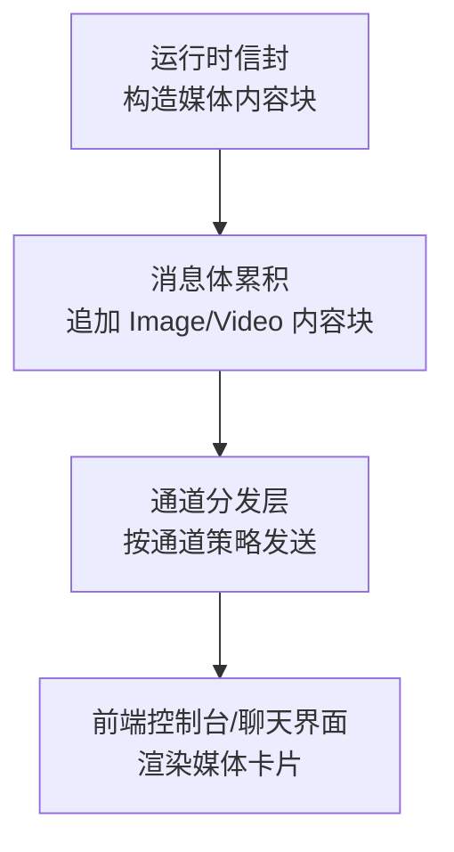
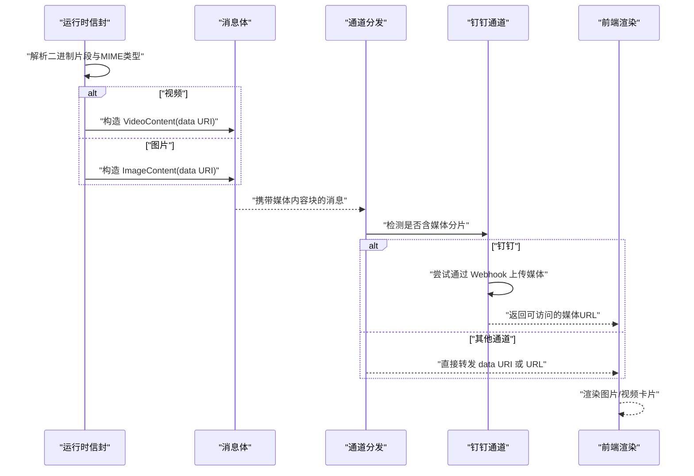
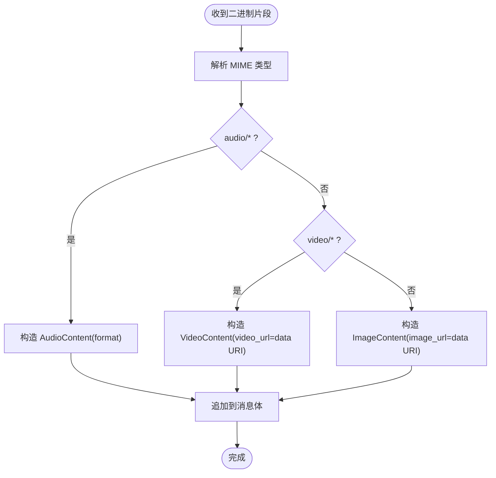
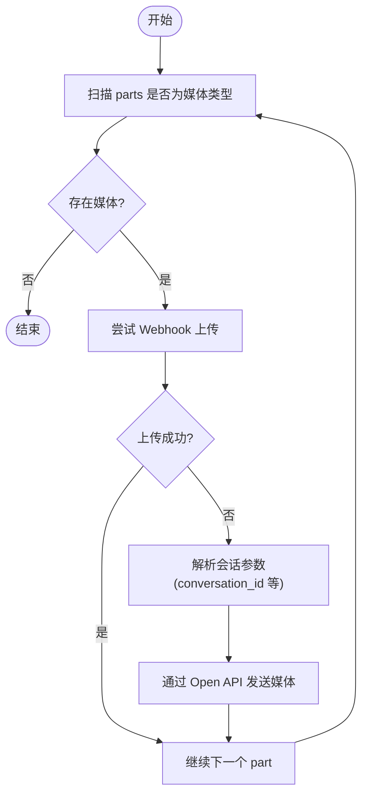
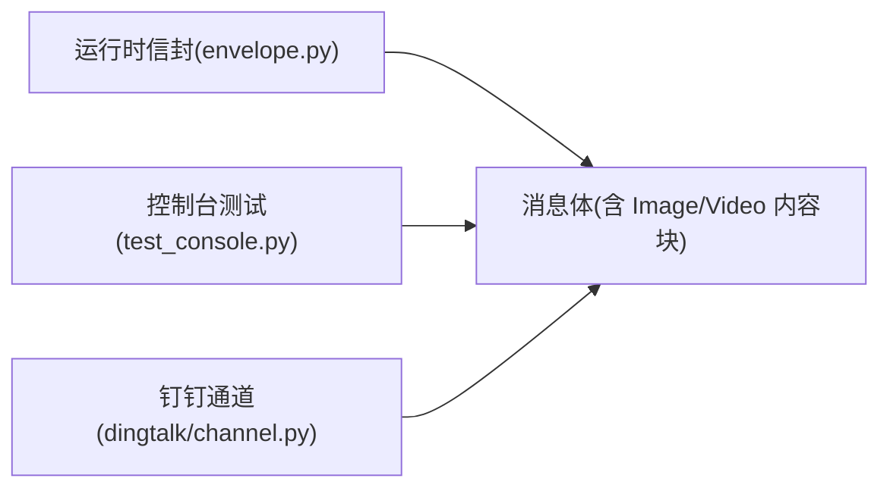

# 媒体展示卡片

<cite>
**本文引用的文件**   
- [envelope.py](file://src/qwenpaw/runtime/envelope.py)
- [test_console.py](file://tests/unit/channels/test_console.py)
- [dingtalk/channel.py](file://src/qwenpaw/app/channels/dingtalk/channel.py)
</cite>

## 目录
1. [简介](#简介)
2. [项目结构](#项目结构)
3. [核心组件](#核心组件)
4. [架构总览](#架构总览)
5. [详细组件分析](#详细组件分析)
6. [依赖关系分析](#依赖关系分析)
7. [性能考量](#性能考量)
8. [故障排查指南](#故障排查指南)
9. [结论](#结论)
10. [附录](#附录)

## 简介
本文件聚焦于 QwenPaw 的“媒体展示卡片”能力，围绕图片与视频在消息流中的加载、格式支持、渲染优化策略进行系统化说明。内容涵盖：
- 媒体数据从运行时到前端卡片的流转路径
- 图片/视频的格式支持与内联 data URI 策略
- 响应式适配与内存管理建议
- 懒加载、缩略图生成与错误降级处理思路
- 实际使用场景与性能优化建议

## 项目结构
QwenPaw 的媒体展示涉及后端运行时封装、通道分发与前端渲染三个层面。本次文档重点覆盖以下源码位置：
- 运行时信封（Envelope）负责将二进制媒体片段转换为结构化内容块并追加至消息体
- 控制台单元测试验证了图片与视频内容的打印格式化行为
- 特定通道（如钉钉）对媒体分片采用独立发送策略（Webhook/Open API），以适配平台限制

[无图表来源；该图为概念性流程示意]

## 核心组件
- 运行时信封（Envelope）
  - 职责：接收音频/视频/图像的二进制片段，依据 MIME 类型构建对应的内容块（AudioContent/VideoContent/ImageContent），并以 data URI 形式嵌入或传递 URL，最终追加到当前消息的内容列表。
  - 关键点：统一为不同媒体类型提供一致的 delta=False 标记与 index 索引，便于前端稳定渲染。
- 控制台测试用例
  - 职责：验证 _print_parts 对图片与视频内容的格式化输出，确保控制台能识别并正确显示媒体信息。
- 钉钉通道
  - 职责：当消息包含图片/视频等媒体时，优先通过 Webhook 上传，否则回退到 Open API 方式单独发送媒体分片，避免 AI Card 仅承载文本的限制。

章节来源
- [envelope.py:552-580](file://src/qwenpaw/runtime/envelope.py#L552-L580)
- [test_console.py:315-352](file://tests/unit/channels/test_console.py#L315-L352)
- [dingtalk/channel.py:2133-2178](file://src/qwenpaw/app/channels/dingtalk/channel.py#L2133-L2178)

## 架构总览
下图展示了媒体从二进制片段到前端展示的端到端路径，以及在不同通道下的差异化处理。

图表来源
- [envelope.py:552-580](file://src/qwenpaw/runtime/envelope.py#L552-L580)
- [dingtalk/channel.py:2133-2178](file://src/qwenpaw/app/channels/dingtalk/channel.py#L2133-L2178)

## 详细组件分析

### 运行时信封：媒体内容块构建
- 输入：二进制数据与 MIME 类型
- 处理逻辑：
  - 若主类型为 audio：构造 AudioContent，附带 format 字段
  - 若主类型为 video：构造 VideoContent，video_url 为 data URI
  - 其他情况（如 image）：构造 ImageContent，image_url 为 data URI
  - 设置 msg_id、delta=False、index，并追加到当前消息 content 列表
- 复杂度：O(1) 每次片段处理；整体线性于片段数量
- 内存影响：data URI 会放大体积（base64 编码约 +33%），需结合通道策略与前端缓存控制

图表来源
- [envelope.py:552-580](file://src/qwenpaw/runtime/envelope.py#L552-L580)

章节来源
- [envelope.py:552-580](file://src/qwenpaw/runtime/envelope.py#L552-L580)

### 控制台测试：媒体内容格式化
- 目标：验证 _print_parts 对图片与视频内容的格式化输出
- 断言要点：
  - 图片内容应包含 “Image” 标签与对应 URL
  - 视频内容应包含 “Video” 标签与对应 URL
- 意义：确保控制台侧能识别并正确呈现媒体信息，作为媒体链路的基础保障

章节来源
- [test_console.py:315-352](file://tests/unit/channels/test_console.py#L315-L352)

### 钉钉通道：媒体分片独立发送
- 背景：AI Card 仅承载文本，图片/视频/音频需通过 Webhook 或 Open API 单独发送
- 流程：
  - 遍历消息 parts，筛选出 IMAGE/FILE/VIDEO/AUDIO 类型
  - 优先尝试通过 Webhook 上传媒体
  - 若失败，则解析会话参数并通过 Open API 发送媒体分片
- 影响：保证在受限平台下仍可稳定展示媒体卡片

图表来源
- [dingtalk/channel.py:2133-2178](file://src/qwenpaw/app/channels/dingtalk/channel.py#L2133-L2178)

章节来源
- [dingtalk/channel.py:2133-2178](file://src/qwenpaw/app/channels/dingtalk/channel.py#L2133-L2178)

## 依赖关系分析
- 运行时信封依赖 MIME 类型判断与 base64 编码，产出标准内容块
- 控制台测试依赖消息体的内容块结构，用于断言格式化输出
- 钉钉通道依赖上层消息体中的媒体分片，并根据平台能力选择发送路径

图表来源
- [envelope.py:552-580](file://src/qwenpaw/runtime/envelope.py#L552-L580)
- [test_console.py:315-352](file://tests/unit/channels/test_console.py#L315-L352)
- [dingtalk/channel.py:2133-2178](file://src/qwenpaw/app/channels/dingtalk/channel.py#L2133-L2178)

章节来源
- [envelope.py:552-580](file://src/qwenpaw/runtime/envelope.py#L552-L580)
- [test_console.py:315-352](file://tests/unit/channels/test_console.py#L315-L352)
- [dingtalk/channel.py:2133-2178](file://src/qwenpaw/app/channels/dingtalk/channel.py#L2133-L2178)

## 性能考量
- 数据体积与传输
  - data URI 会引入 base64 开销，适合小图或短片段；大图/长视频建议使用外部 URL 以降低带宽与内存占用
- 渲染与内存
  - 前端应避免一次性加载大量媒体，采用懒加载与视口检测
  - 对视频启用 preload="metadata"，按需加载完整资源
- 缓存策略
  - 利用浏览器缓存与 CDN 缓存减少重复请求
  - 对相同媒体使用稳定的 URL 或缓存键
- 通道差异
  - 对于受限平台（如钉钉），优先走 Webhook 上传，失败再回退 Open API，避免阻塞主消息流

[本节为通用指导，不直接分析具体文件]

## 故障排查指南
- 控制台未显示媒体
  - 检查 _print_parts 是否正确识别 IMAGE/VIDEO 类型，参考测试断言
- 媒体无法加载
  - 确认 data URI 是否有效，或外部 URL 是否可达
  - 在受限平台检查 Webhook/Open API 发送是否成功
- 内存过高
  - 评估是否使用了过大的 data URI，考虑改用外部 URL 或压缩/转码

章节来源
- [test_console.py:315-352](file://tests/unit/channels/test_console.py#L315-L352)
- [dingtalk/channel.py:2133-2178](file://src/qwenpaw/app/channels/dingtalk/channel.py#L2133-L2178)

## 结论
QwenPaw 的媒体展示卡片通过运行时信封统一构建媒体内容块，并在不同通道中采取适配策略，确保图片与视频的稳定展示。结合懒加载、缩略图与错误降级等前端优化手段，可在多平台环境下获得良好的用户体验与性能表现。

[本节为总结，不直接分析具体文件]

## 附录

### 使用场景示例（路径指引）
- 图片展示
  - 运行时构造 ImageContent（data URI）→ 消息体 → 控制台/聊天界面渲染
  - 参考路径：[envelope.py:552-580](file://src/qwenpaw/runtime/envelope.py#L552-L580)
- 视频展示
  - 运行时构造 VideoContent（data URI）→ 消息体 → 控制台/聊天界面渲染
  - 参考路径：[envelope.py:552-580](file://src/qwenpaw/runtime/envelope.py#L552-L580)
- 受限平台（钉钉）媒体发送
  - 优先 Webhook 上传，失败回退 Open API
  - 参考路径：[dingtalk/channel.py:2133-2178](file://src/qwenpaw/app/channels/dingtalk/channel.py#L2133-L2178)

### 响应式图片适配建议
- 使用 srcset/picture 元素根据设备像素比与屏幕宽度选择合适尺寸
- 设置合理的 width/height 占位，避免布局抖动
- 对移动端优先加载较小尺寸图片，提升首屏速度

### 视频播放控制建议
- 使用 controls 属性暴露基础控件
- 设置 muted/autoplay 策略以符合浏览器自动播放策略
- 使用 playsinline 提升移动端体验

### 内存管理机制建议
- 及时释放不再使用的 Blob/ArrayBuffer 引用
- 对大媒体采用分片加载与对象池复用
- 监控页面内存峰值，必要时主动清理缓存

[本节为通用指导，不直接分析具体文件]