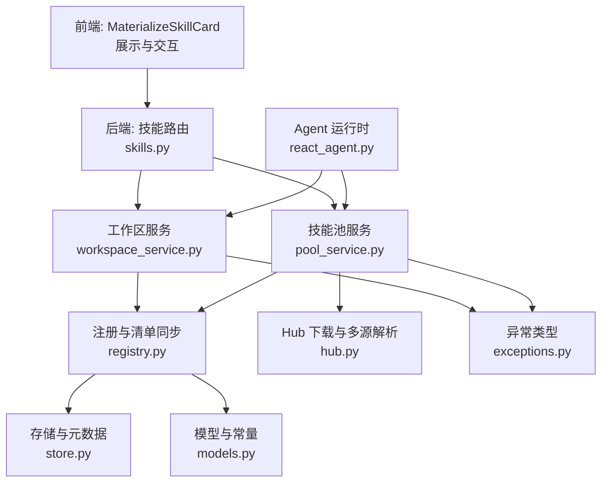
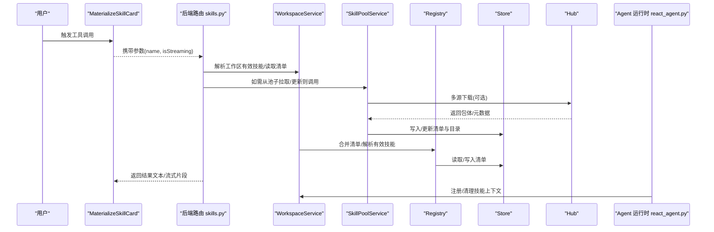
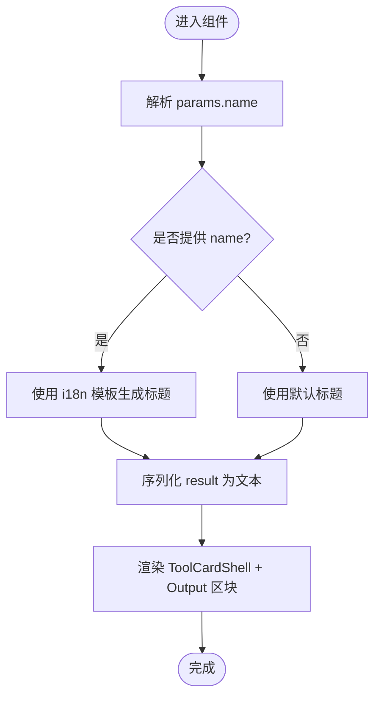
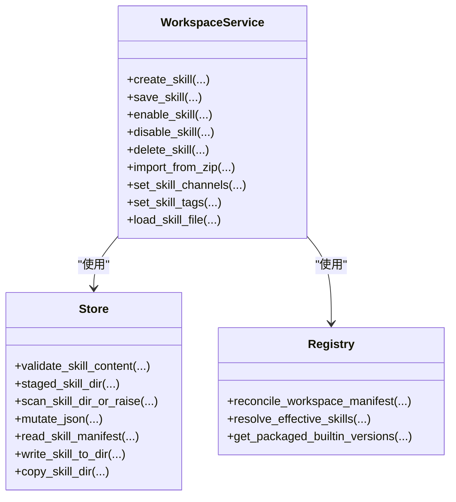
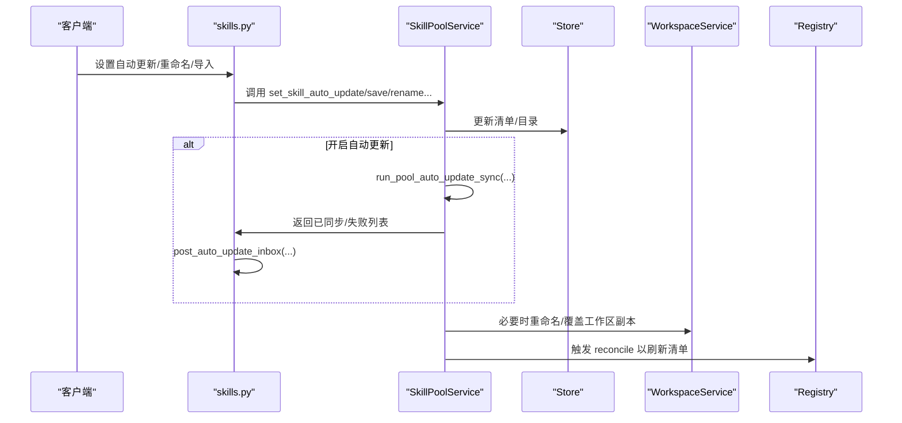
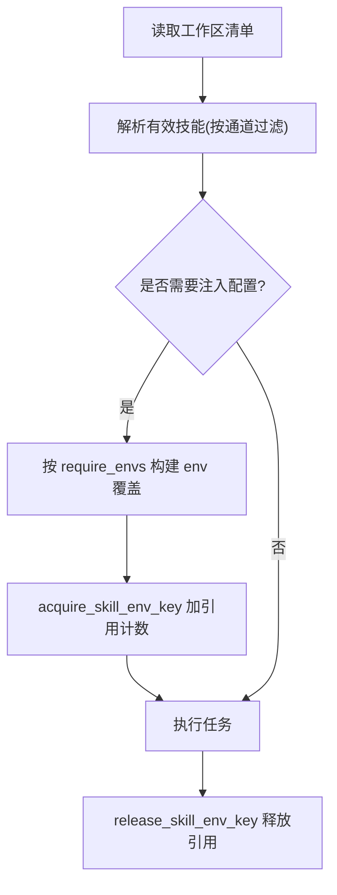
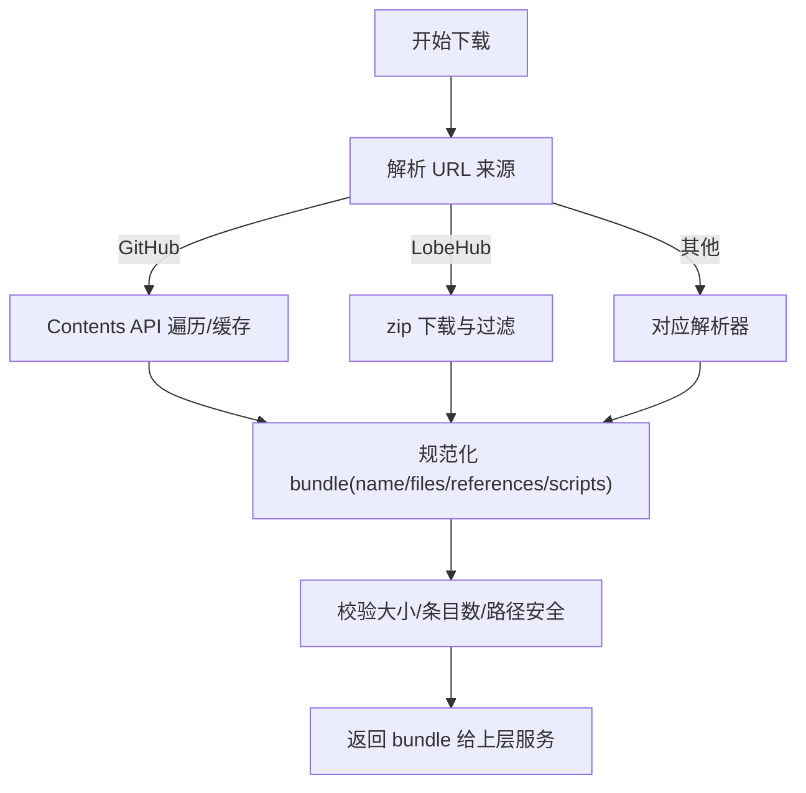
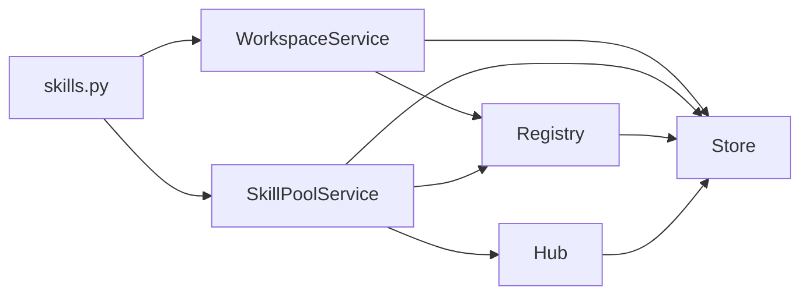

# 技能管理卡片

<cite>
**本文引用的文件**   
- [MaterializeSkillCard.tsx](file://console/src/components/Chat/ToolCards/cards/MaterializeSkillCard.tsx)
- [index.ts](file://console/src/components/Chat/ToolCards/cards/index.ts)
- [hub.py](file://src/qwenpaw/agents/skill_system/hub.py)
- [registry.py](file://src/qwenpaw/agents/skill_system/registry.py)
- [store.py](file://src/qwenpaw/agents/skill_system/store.py)
- [workspace_service.py](file://src/qwenpaw/agents/skill_system/workspace_service.py)
- [pool_service.py](file://src/qwenpaw/agents/skill_system/pool_service.py)
- [models.py](file://src/qwenpaw/agents/skill_system/models.py)
- [skills.py](file://src/qwenpaw/app/routers/skills.py)
- [react_agent.py](file://src/qwenpaw/agents/react_agent.py)
- [exceptions.py](file://src/qwenpaw/exceptions.py)
</cite>

## 目录
1. [简介](#简介)
2. [项目结构](#项目结构)
3. [核心组件](#核心组件)
4. [架构总览](#架构总览)
5. [详细组件分析](#详细组件分析)
6. [依赖关系分析](#依赖关系分析)
7. [性能与稳定性](#性能与稳定性)
8. [故障排查指南](#故障排查指南)
9. [结论](#结论)
10. [附录：使用示例与最佳实践](#附录使用示例与最佳实践)

## 简介
本文件围绕 QwenPaw 的“技能管理卡片”展开，重点解释前端 MaterializeSkillCard 的技能实例化与展示机制，以及后端技能加载、依赖解析、执行环境配置、生命周期管理与资源清理策略。文档同时覆盖状态监控、错误处理、版本兼容性检查，并提供实际使用场景的代码路径与最佳实践建议。

## 项目结构
- 前端展示层
  - 工具卡片渲染入口与导出：[index.ts](file://console/src/components/Chat/ToolCards/cards/index.ts)
  - 具体卡片实现（MaterializeSkillCard）：[MaterializeSkillCard.tsx](file://console/src/components/Chat/ToolCards/cards/MaterializeSkillCard.tsx)
- 后端技能系统
  - 技能注册、内置语言选择、工作区/池子清单同步：[registry.py](file://src/qwenpaw/agents/skill_system/registry.py)
  - 本地存储、清单读写、安全扫描、元数据构建：[store.py](file://src/qwenpaw/agents/skill_system/store.py)
  - 工作区范围的生命周期服务（创建/保存/启用/禁用/删除/导入等）：[workspace_service.py](file://src/qwenpaw/agents/skill_system/workspace_service.py)
  - 共享技能池服务（创建/导入/自动更新/重命名迁移等）：[pool_service.py](file://src/qwenpaw/agents/skill_system/pool_service.py)
  - Hub 下载与多源解析（GitHub/LobeHub/ModelScope/QwenPaw Plaza 等）：[hub.py](file://src/qwenpaw/agents/skill_system/hub.py)
  - 模型与常量定义（SkillInfo、SkillRequirements 等）：[models.py](file://src/qwenpaw/agents/skill_system/models.py)
  - 路由与自动更新通知：[skills.py](file://src/qwenpaw/app/routers/skills.py)
  - Agent 侧注册与清理：[react_agent.py](file://src/qwenpaw/agents/react_agent.py)
  - 异常类型（冲突、取消、扫描失败等）：[exceptions.py](file://src/qwenpaw/exceptions.py)

**图表来源** 
- [MaterializeSkillCard.tsx](file://console/src/components/Chat/ToolCards/cards/MaterializeSkillCard.tsx)
- [index.ts](file://console/src/components/Chat/ToolCards/cards/index.ts)
- [skills.py](file://src/qwenpaw/app/routers/skills.py)
- [workspace_service.py](file://src/qwenpaw/agents/skill_system/workspace_service.py)
- [pool_service.py](file://src/qwenpaw/agents/skill_system/pool_service.py)
- [registry.py](file://src/qwenpaw/agents/skill_system/registry.py)
- [store.py](file://src/qwenpaw/agents/skill_system/store.py)
- [hub.py](file://src/qwenpaw/agents/skill_system/hub.py)
- [models.py](file://src/qwenpaw/agents/skill_system/models.py)
- [react_agent.py](file://src/qwenpaw/agents/react_agent.py)
- [exceptions.py](file://src/qwenpaw/exceptions.py)

**章节来源**
- [MaterializeSkillCard.tsx](file://console/src/components/Chat/ToolCards/cards/MaterializeSkillCard.tsx)
- [index.ts](file://console/src/components/Chat/ToolCards/cards/index.ts)
- [skills.py](file://src/qwenpaw/app/routers/skills.py)
- [workspace_service.py](file://src/qwenpaw/agents/skill_system/workspace_service.py)
- [pool_service.py](file://src/qwenpaw/agents/skill_system/pool_service.py)
- [registry.py](file://src/qwenpaw/agents/skill_system/registry.py)
- [store.py](file://src/qwenpaw/agents/skill_system/store.py)
- [hub.py](file://src/qwenpaw/agents/skill_system/hub.py)
- [models.py](file://src/qwenpaw/agents/skill_system/models.py)
- [react_agent.py](file://src/qwenpaw/agents/react_agent.py)
- [exceptions.py](file://src/qwenpaw/exceptions.py)

## 核心组件
- 前端卡片
  - MaterializeSkillCard：接收工具调用内容并渲染标题与输出块，支持流式显示与国际化。
  - 卡片导出索引：统一暴露 MaterializeSkillCard 供上层注册。
- 后端服务
  - WorkspaceService：工作区维度的技能 CRUD、启用/禁用、通道路由、配置持久化、ZIP 导入、安全扫描、冲突检测。
  - SkillPoolService：共享技能池的创建、导入、标签、自动更新、重命名迁移、跨工作区同步。
  - Registry：内置技能发现与语言偏好、清单 reconcile、有效技能解析、环境变量注入。
  - Store：清单读写、原子写入、目录复制、安全扫描、元数据构建、冲突名建议。
  - Hub：多源下载（GitHub/LobeHub/ModelScope/QwenPaw Plaza 等）、重试与退避、取消钩子、包体校验。
  - Models：SkillInfo、SkillRequirements 等数据结构。
  - Exceptions：SkillsError 及其子类（冲突、取消、扫描失败）。

**章节来源**
- [MaterializeSkillCard.tsx](file://console/src/components/Chat/ToolCards/cards/MaterializeSkillCard.tsx)
- [index.ts](file://console/src/components/Chat/ToolCards/cards/index.ts)
- [workspace_service.py](file://src/qwenpaw/agents/skill_system/workspace_service.py)
- [pool_service.py](file://src/qwenpaw/agents/skill_system/pool_service.py)
- [registry.py](file://src/qwenpaw/agents/skill_system/registry.py)
- [store.py](file://src/qwenpaw/agents/skill_system/store.py)
- [hub.py](file://src/qwenpaw/agents/skill_system/hub.py)
- [models.py](file://src/qwenpaw/agents/skill_system/models.py)
- [exceptions.py](file://src/qwenpaw/exceptions.py)

## 架构总览
从用户点击“实例化技能”到结果展示的端到端流程如下：

**图表来源** 
- [MaterializeSkillCard.tsx](file://console/src/components/Chat/ToolCards/cards/MaterializeSkillCard.tsx)
- [skills.py](file://src/qwenpaw/app/routers/skills.py)
- [workspace_service.py](file://src/qwenpaw/agents/skill_system/workspace_service.py)
- [pool_service.py](file://src/qwenpaw/agents/skill_system/pool_service.py)
- [registry.py](file://src/qwenpaw/agents/skill_system/registry.py)
- [store.py](file://src/qwenpaw/agents/skill_system/store.py)
- [hub.py](file://src/qwenpaw/agents/skill_system/hub.py)
- [react_agent.py](file://src/qwenpaw/agents/react_agent.py)

## 详细组件分析

### 前端：MaterializeSkillCard 组件
- 功能要点
  - 从 content.params 中解析 skill 名称，生成标题；若为空则使用默认文案。
  - 将 result 序列化为文本并在“Output”区块展示。
  - 支持 isStreaming 标志，配合 ToolCardShell 进行流式渲染。
- 关键路径
  - 组件实现：[MaterializeSkillCard.tsx](file://console/src/components/Chat/ToolCards/cards/MaterializeSkillCard.tsx)
  - 导出索引：[index.ts](file://console/src/components/Chat/ToolCards/cards/index.ts)

**图表来源** 
- [MaterializeSkillCard.tsx](file://console/src/components/Chat/ToolCards/cards/MaterializeSkillCard.tsx)

**章节来源**
- [MaterializeSkillCard.tsx](file://console/src/components/Chat/ToolCards/cards/MaterializeSkillCard.tsx)
- [index.ts](file://console/src/components/Chat/ToolCards/cards/index.ts)

### 后端：工作区技能生命周期（WorkspaceService）
- 能力概览
  - 创建/保存/重命名/删除技能；支持 ZIP 批量导入；启用/禁用与通道路由；配置持久化；安全扫描；冲突检测与建议名。
- 关键流程
  - 创建：校验 frontmatter → 临时目录写入 → 安全扫描 → 复制到目标目录 → 原子写入清单。
  - 保存：原地编辑或重命名保存；变更时重新扫描并重建元数据。
  - 启用：先扫描再写 enabled=true，确保当前磁盘状态可信。
  - 删除：仅允许删除未启用的技能，并回滚清单失败时的文件。
  - ZIP 导入：解压→校验→冲突检测→批量导入→reconcile→标记 installed_from。

**图表来源** 
- [workspace_service.py](file://src/qwenpaw/agents/skill_system/workspace_service.py)
- [store.py](file://src/qwenpaw/agents/skill_system/store.py)
- [registry.py](file://src/qwenpaw/agents/skill_system/registry.py)

**章节来源**
- [workspace_service.py](file://src/qwenpaw/agents/skill_system/workspace_service.py)
- [store.py](file://src/qwenpaw/agents/skill_system/store.py)
- [registry.py](file://src/qwenpaw/agents/skill_system/registry.py)

### 后端：共享技能池（SkillPoolService）
- 能力概览
  - 在 WORKING_DIR/skill_pool 下维护可复用技能；支持创建、ZIP 导入、标签、自动更新、重命名迁移、跨工作区同步。
- 自动更新与通知
  - 设置 auto_update 后，立即触发一次同步；后续通过路由层 post_auto_update_inbox 推送通知。

**图表来源** 
- [pool_service.py](file://src/qwenpaw/agents/skill_system/pool_service.py)
- [skills.py](file://src/qwenpaw/app/routers/skills.py)
- [store.py](file://src/qwenpaw/agents/skill_system/store.py)
- [workspace_service.py](file://src/qwenpaw/agents/skill_system/workspace_service.py)
- [registry.py](file://src/qwenpaw/agents/skill_system/registry.py)

**章节来源**
- [pool_service.py](file://src/qwenpaw/agents/skill_system/pool_service.py)
- [skills.py](file://src/qwenpaw/app/routers/skills.py)

### 后端：注册与清单同步（Registry）
- 内置技能语言偏好与变体选择
  - 根据 settings.json 或 UI 语言决定 en/zh 偏好；按目录名解析变体并选择最优语言。
- 清单 reconcile
  - 扫描 skill_pool 与工作区 skills 目录，重建 metadata，保留用户态（enabled/channels/config/tags）。
- 环境变量注入
  - 基于 require_envs 将配置项注入进程环境变量，并以 JSON 形式提供完整配置键。

**图表来源** 
- [registry.py](file://src/qwenpaw/agents/skill_system/registry.py)

**章节来源**
- [registry.py](file://src/qwenpaw/agents/skill_system/registry.py)

### 后端：Hub 下载与多源解析（Hub）
- 多源支持
  - GitHub（Contents API）、LobeHub（zip 下载）、ModelScope、QwenPaw Plaza、ClawHub、skills.sh、skillsmp 等。
- 健壮性
  - 指数退避重试、可配置超时/最大字节、取消钩子、速率限制提示、流式读取与完整性校验。
- 包体规范化
  - 提取 SKILL.md、references/scripts 树、额外文件；名称与目录安全校验。

**图表来源** 
- [hub.py](file://src/qwenpaw/agents/skill_system/hub.py)

**章节来源**
- [hub.py](file://src/qwenpaw/agents/skill_system/hub.py)

### 后端：存储与安全（Store）
- 清单与元数据
  - 原子写入、mtime 缓存、冲突名建议、目录树构建、SKILL.md frontmatter 解析。
- 安全扫描
  - 导入/保存前对 staged 目录执行扫描，失败则阻断并返回结构化错误。
- 路径安全
  - 严格校验相对路径、拒绝绝对路径与越界访问。

**章节来源**
- [store.py](file://src/qwenpaw/agents/skill_system/store.py)

### 模型与异常（Models & Exceptions）
- 模型
  - SkillInfo：包含 name/description/version_text/content/source/references/scripts/emoji。
  - SkillRequirements：require_bins / require_envs。
- 异常
  - SkillsError 基类；SkillConflictError（冲突详情）、SkillImportCancelled（用户取消）、SkillScanError（扫描失败，含严重级别与定位信息）。

**章节来源**
- [models.py](file://src/qwenpaw/agents/skill_system/models.py)
- [exceptions.py](file://src/qwenpaw/exceptions.py)

## 依赖关系分析
- 组件耦合
  - WorkspaceService/PoolService 强依赖 Store（I/O 与校验）与 Registry（清单 reconcile）。
  - PoolService 依赖 Hub 进行外部资源获取。
  - Router 聚合服务层并负责通知与事件投递。
- 外部依赖
  - httpx（异步 HTTP）、frontmatter/yaml（frontmatter 解析）、zipfile/shutil（归档与目录操作）、平台锁（fcntl/msvcrt）。
- 潜在循环
  - 各模块通过函数级导入避免硬循环；Registry 内部按需导入配置与常量。

**图表来源** 
- [workspace_service.py](file://src/qwenpaw/agents/skill_system/workspace_service.py)
- [pool_service.py](file://src/qwenpaw/agents/skill_system/pool_service.py)
- [registry.py](file://src/qwenpaw/agents/skill_system/registry.py)
- [store.py](file://src/qwenpaw/agents/skill_system/store.py)
- [hub.py](file://src/qwenpaw/agents/skill_system/hub.py)
- [skills.py](file://src/qwenpaw/app/routers/skills.py)

**章节来源**
- [workspace_service.py](file://src/qwenpaw/agents/skill_system/workspace_service.py)
- [pool_service.py](file://src/qwenpaw/agents/skill_system/pool_service.py)
- [registry.py](file://src/qwenpaw/agents/skill_system/registry.py)
- [store.py](file://src/qwenpaw/agents/skill_system/store.py)
- [hub.py](file://src/qwenpaw/agents/skill_system/hub.py)
- [skills.py](file://src/qwenpaw/app/routers/skills.py)

## 性能与稳定性
- 并发与缓存
  - Hub 层对 GitHub 响应做 per-key 锁与 TTL 缓存，降低重复请求与限频风险。
  - Store 层对清单 JSON 使用 mtime 缓存与跨进程文件锁，保证一致性与并发安全。
- 网络健壮性
  - 指数退避重试、可配置超时/最大字节、流式读取与长度校验，避免大响应导致内存溢出。
- 资源清理
  - 创建/保存流程采用临时目录 staging，成功后才落盘；失败时回滚文件与清单。
  - Agent 运行时会定期清理过期 offload 数据，防止上下文膨胀。

**章节来源**
- [hub.py](file://src/qwenpaw/agents/skill_system/hub.py)
- [store.py](file://src/qwenpaw/agents/skill_system/store.py)
- [react_agent.py](file://src/qwenpaw/agents/react_agent.py)

## 故障排查指南
- 常见错误与定位
  - 冲突：SkillConflictError 包含冲突详情与建议改名，优先查看 suggested_name。
  - 取消：SkillImportCancelled 表示用户主动取消导入，检查前端取消逻辑与后端取消钩子。
  - 扫描失败：SkillScanError 提供 findings、max_severity、文件与行号，用于快速定位不安全代码。
- 典型问题
  - 清单损坏：Store 会重置为默认清单并记录警告，建议检查权限与磁盘空间。
  - 网络失败：Hub 层会给出 429/5xx 提示与重试次数，必要时设置 GITHUB_TOKEN 提升配额。
- 日志与通知
  - 自动更新结果通过 inbox 事件推送，可在控制台查看成功/失败明细。

**章节来源**
- [exceptions.py](file://src/qwenpaw/exceptions.py)
- [store.py](file://src/qwenpaw/agents/skill_system/store.py)
- [hub.py](file://src/qwenpaw/agents/skill_system/hub.py)
- [skills.py](file://src/qwenpaw/app/routers/skills.py)

## 结论
MaterializeSkillCard 作为前端展示入口，配合后端工作区/池子服务与注册中心，实现了从“实例化技能”到“结果渲染”的完整链路。系统在健壮性（重试/缓存/锁）、安全性（扫描/路径校验）、一致性（原子写入/reconcile）方面具备完善保障。结合自动更新与通知机制，可有效支撑多工作区、多渠道下的技能治理与运维。

## 附录：使用示例与最佳实践
- 前端使用
  - 在工具卡片集合中引入 MaterializeSkillCard，并将 content 与 isStreaming 透传至组件。
  - 参考路径：[index.ts](file://console/src/components/Chat/ToolCards/cards/index.ts)、[MaterializeSkillCard.tsx](file://console/src/components/Chat/ToolCards/cards/MaterializeSkillCard.tsx)
- 后端操作
  - 创建工作区技能：调用 WorkspaceService.create_skill，注意 validate_skill_content 与 staged 目录扫描。
  - 启用/禁用技能：调用 enable_skill/disable_skill，确保当前磁盘状态可信后再写清单。
  - 导入 ZIP：调用 import_from_zip，关注 conflicts 与建议名，必要时让用户确认。
  - 池子自动更新：调用 set_skill_auto_update，随后通过路由层 post_auto_update_inbox 推送通知。
  - 参考路径：
    - [workspace_service.py](file://src/qwenpaw/agents/skill_system/workspace_service.py)
    - [pool_service.py](file://src/qwenpaw/agents/skill_system/pool_service.py)
    - [skills.py](file://src/qwenpaw/app/routers/skills.py)
- 最佳实践
  - 始终在 staging 目录完成写入与扫描，成功后再替换目标目录。
  - 使用 mutate_json 原子更新清单，避免并发竞争。
  - 对 require_envs 敏感的配置，通过 apply_skill_config_env_overrides 注入，避免污染全局环境。
  - 对 Hub 下载设置合理超时与最大字节，避免资源耗尽。
  - 对自动更新目标进行白名单控制，避免误覆盖。