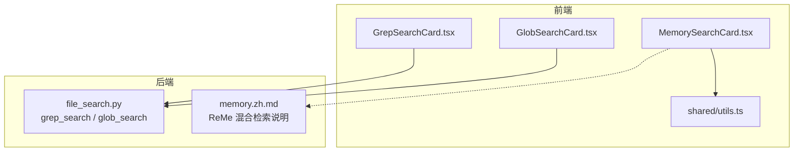
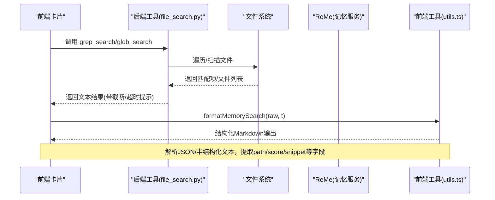
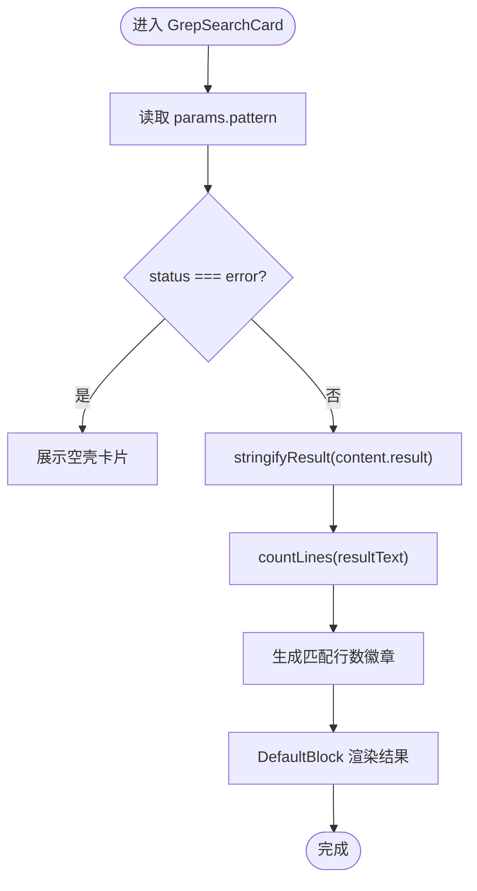
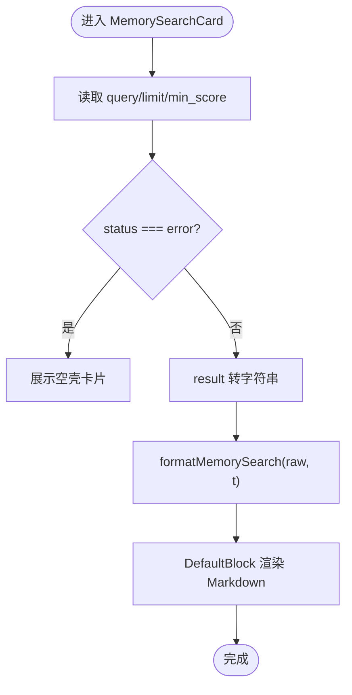
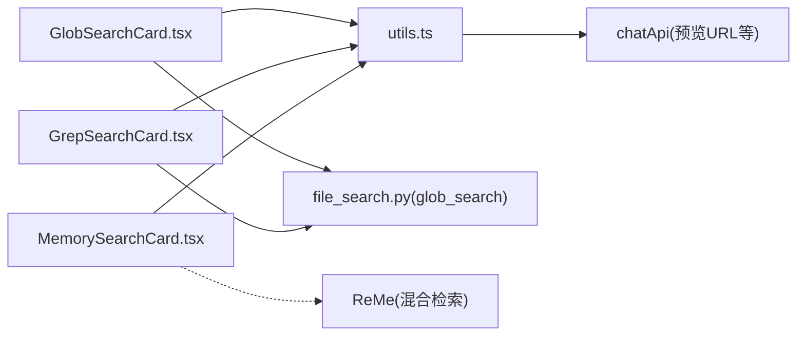

# 搜索与记忆卡片

<cite>
**本文引用的文件**
- [file_search.py](file://src/qwenpaw/agents/tools/file_search.py)
- [GlobSearchCard.tsx](file://console/src/components/Chat/ToolCards/cards/GlobSearchCard.tsx)
- [GrepSearchCard.tsx](file://console/src/components/Chat/ToolCards/cards/GrepSearchCard.tsx)
- [MemorySearchCard.tsx](file://console/src/components/Chat/ToolCards/cards/MemorySearchCard.tsx)
- [utils.ts](file://console/src/components/Chat/ToolCards/shared/utils.ts)
- [memory.zh.md](file://website/public/docs/memory.zh.md)
</cite>

## 目录
1. [简介](#简介)
2. [项目结构](#项目结构)
3. [核心组件](#核心组件)
4. [架构总览](#架构总览)
5. [详细组件分析](#详细组件分析)
6. [依赖关系分析](#依赖关系分析)
7. [性能考量](#性能考量)
8. [故障排查指南](#故障排查指南)
9. [结论](#结论)
10. [附录：使用示例与优化技巧](#附录使用示例与优化技巧)

## 简介
本文件聚焦 QwenPaw 的“搜索与记忆卡片”能力，覆盖三类前端卡片及其后端实现：
- 文件发现（GlobSearchCard）：基于 Glob 模式快速定位文件。
- 文本搜索（GrepSearchCard）：在代码库中按正则或字面量进行内容检索，支持上下文行、包含过滤、大小写控制等。
- 记忆检索（MemorySearchCard）：通过 ReMe 混合检索（BM25 + 向量语义 + RRF 融合）召回相关记忆片段，并在前端以结构化 Markdown 展示。

文档将深入解析搜索算法、结果展示、分页与高亮策略、缓存机制，并给出实际使用场景与优化建议。

## 项目结构
与搜索和记忆相关的核心位置如下：
- 后端工具实现：src/qwenpaw/agents/tools/file_search.py
- 前端卡片组件：console/src/components/Chat/ToolCards/cards/*.tsx
- 共享格式化与解析工具：console/src/components/Chat/ToolCards/shared/utils.ts
- 记忆系统说明：website/public/docs/memory.zh.md

图表来源
- [file_search.py:596-761](file://src/qwenpaw/agents/tools/file_search.py#L596-L761)
- [GlobSearchCard.tsx:1-60](file://console/src/components/Chat/ToolCards/cards/GlobSearchCard.tsx#L1-L60)
- [GrepSearchCard.tsx:1-60](file://console/src/components/Chat/ToolCards/cards/GrepSearchCard.tsx#L1-L60)
- [MemorySearchCard.tsx:1-70](file://console/src/components/Chat/ToolCards/cards/MemorySearchCard.tsx#L1-L70)
- [utils.ts:418-437](file://console/src/components/Chat/ToolCards/shared/utils.ts#L418-L437)
- [memory.zh.md:107-131](file://website/public/docs/memory.zh.md#L107-L131)

章节来源
- [file_search.py:1-761](file://src/qwenpaw/agents/tools/file_search.py#L1-L761)
- [GlobSearchCard.tsx:1-60](file://console/src/components/Chat/ToolCards/cards/GlobSearchCard.tsx#L1-L60)
- [GrepSearchCard.tsx:1-60](file://console/src/components/Chat/ToolCards/cards/GrepSearchCard.tsx#L1-L60)
- [MemorySearchCard.tsx:1-70](file://console/src/components/Chat/ToolCards/cards/MemorySearchCard.tsx#L1-L70)
- [utils.ts:1-581](file://console/src/components/Chat/ToolCards/shared/utils.ts#L1-L581)
- [memory.zh.md:107-131](file://website/public/docs/memory.zh.md#L107-L131)

## 核心组件
- GlobSearchCard：负责渲染 glob 搜索结果，显示匹配文件列表与数量徽章。
- GrepSearchCard：负责渲染 grep 搜索结果，显示匹配行数与命中行内容。
- MemorySearchCard：负责渲染 memory_search 结果，解析结构化数据并以 Markdown 表格形式展示路径、行号范围、分数与摘要片段。

章节来源
- [GlobSearchCard.tsx:1-60](file://console/src/components/Chat/ToolCards/cards/GlobSearchCard.tsx#L1-L60)
- [GrepSearchCard.tsx:1-60](file://console/src/components/Chat/ToolCards/cards/GrepSearchCard.tsx#L1-L60)
- [MemorySearchCard.tsx:1-70](file://console/src/components/Chat/ToolCards/cards/MemorySearchCard.tsx#L1-L70)

## 架构总览
从调用到展示的端到端流程如下：

图表来源
- [file_search.py:596-761](file://src/qwenpaw/agents/tools/file_search.py#L596-L761)
- [utils.ts:418-437](file://console/src/components/Chat/ToolCards/shared/utils.ts#L418-L437)
- [memory.zh.md:107-131](file://website/public/docs/memory.zh.md#L107-L131)

## 详细组件分析

### GlobSearchCard（文件发现）
- 功能要点
  - 读取 params.pattern，构造标题；错误状态直接展示空壳卡片。
  - 使用 stringifyResult 将后端返回结果转为字符串，计算行数作为徽章显示。
  - 结果通过 DefaultBlock 展示。
- 关键交互
  - 后端 glob_search 返回按路径排序的文件列表，可能附带“结果被截断”的提示。
- 展示特性
  - 无内置分页；当结果较多时，可通过限制 pattern 或缩小 path 减少结果集。
  - 无内置高亮；如需高亮可结合外部库对路径关键字进行标记。

图表来源
- [GlobSearchCard.tsx:1-60](file://console/src/components/Chat/ToolCards/cards/GlobSearchCard.tsx#L1-L60)
- [utils.ts:558-580](file://console/src/components/Chat/ToolCards/shared/utils.ts#L558-L580)

章节来源
- [GlobSearchCard.tsx:1-60](file://console/src/components/Chat/ToolCards/cards/GlobSearchCard.tsx#L1-L60)
- [file_search.py:708-761](file://src/qwenpaw/agents/tools/file_search.py#L708-L761)
- [utils.ts:558-580](file://console/src/components/Chat/ToolCards/shared/utils.ts#L558-L580)

### GrepSearchCard（文本搜索）
- 功能要点
  - 读取 params.pattern，构造标题；错误状态直接展示空壳卡片。
  - 使用 stringifyResult 将结果转为字符串，统计行数作为“匹配行数”徽章。
  - 结果通过 DefaultBlock 展示。
- 后端算法要点
  - 支持正则与字面量匹配，支持管道分隔的多模式 OR 匹配。
  - 支持上下文行（最多固定上限），滑动窗口输出命中行及前后上下文。
  - 支持 include_pattern 仅匹配文件名，show_file 控制是否每行都显示路径。
  - 安全与性能保护：跳过二进制扩展名与大文件、跳过常见缓存目录、限制最大匹配数与输出字符数、超时与取消。
- 展示特性
  - 无内置分页；当结果过多时会提示“结果被截断”。
  - 无内置高亮；可在前端对匹配关键词进行高亮处理。

图表来源
- [GrepSearchCard.tsx:1-60](file://console/src/components/Chat/ToolCards/cards/GrepSearchCard.tsx#L1-L60)
- [utils.ts:558-580](file://console/src/components/Chat/ToolCards/shared/utils.ts#L558-L580)

章节来源
- [GrepSearchCard.tsx:1-60](file://console/src/components/Chat/ToolCards/cards/GrepSearchCard.tsx#L1-L60)
- [file_search.py:140-161](file://src/qwenpaw/agents/tools/file_search.py#L140-L161)
- [file_search.py:381-553](file://src/qwenpaw/agents/tools/file_search.py#L381-L553)
- [file_search.py:596-705](file://src/qwenpaw/agents/tools/file_search.py#L596-L705)
- [utils.ts:558-580](file://console/src/components/Chat/ToolCards/shared/utils.ts#L558-L580)

### MemorySearchCard（记忆检索）
- 功能要点
  - 读取 params.query/text、limit/max_results、min_score，动态生成标题与元信息。
  - 错误状态直接展示空壳卡片。
  - 非错误状态：将 result 转为字符串后，调用 formatMemorySearch 进行结构化解析与格式化。
- 解析与格式化
  - 优先尝试 JSON 解析；若失败则回退为半结构化文本解析（支持多条目与单条截断）。
  - 提取 path、start_line/end_line、score、snippet 等字段，输出为可读 Markdown。
- 记忆系统能力
  - 混合检索：始终 BM25，可选向量语义；两者均命中时使用 RRF 融合排序。
  - 语义搜索能捕捉意义相近但措辞不同的内容，但对精确 token 的匹配较弱。

图表来源
- [MemorySearchCard.tsx:1-70](file://console/src/components/Chat/ToolCards/cards/MemorySearchCard.tsx#L1-L70)
- [utils.ts:418-437](file://console/src/components/Chat/ToolCards/shared/utils.ts#L418-L437)
- [memory.zh.md:107-131](file://website/public/docs/memory.zh.md#L107-L131)

章节来源
- [MemorySearchCard.tsx:1-70](file://console/src/components/Chat/ToolCards/cards/MemorySearchCard.tsx#L1-L70)
- [utils.ts:244-437](file://console/src/components/Chat/ToolCards/shared/utils.ts#L244-L437)
- [memory.zh.md:107-131](file://website/public/docs/memory.zh.md#L107-L131)

## 依赖关系分析
- 前端卡片依赖
  - shared/utils.ts：提供 stringifyResult、countLines、formatMemorySearch 等通用方法。
  - i18n：用于标题与表格列名的国际化。
- 后端工具依赖
  - file_search.py：对外暴露 grep_search 与 glob_search，内部使用线程池执行 IO 密集任务，并通过取消事件与超时控制保障响应性。
- 记忆系统依赖
  - ReMe：提供混合检索（BM25 + 向量 + RRF），QwenPaw 通过 memory_search 工具触发。

图表来源
- [GlobSearchCard.tsx:1-60](file://console/src/components/Chat/ToolCards/cards/GlobSearchCard.tsx#L1-L60)
- [GrepSearchCard.tsx:1-60](file://console/src/components/Chat/ToolCards/cards/GrepSearchCard.tsx#L1-L60)
- [MemorySearchCard.tsx:1-70](file://console/src/components/Chat/ToolCards/cards/MemorySearchCard.tsx#L1-L70)
- [utils.ts:1-581](file://console/src/components/Chat/ToolCards/shared/utils.ts#L1-L581)
- [file_search.py:596-761](file://src/qwenpaw/agents/tools/file_search.py#L596-L761)
- [memory.zh.md:107-131](file://website/public/docs/memory.zh.md#L107-L131)

章节来源
- [utils.ts:1-581](file://console/src/components/Chat/ToolCards/shared/utils.ts#L1-L581)
- [file_search.py:1-761](file://src/qwenpaw/agents/tools/file_search.py#L1-L761)
- [memory.zh.md:107-131](file://website/public/docs/memory.zh.md#L107-L131)

## 性能考量
- 后端保护与限流
  - 跳过二进制扩展名与大文件（默认 2MB），避免 I/O 与内存压力。
  - 跳过常见缓存目录（如 node_modules、__pycache__、.git 等）。
  - 限制最大匹配数与输出字符数，防止结果过大导致前端卡顿。
  - 支持超时与取消：grep 默认 30s，glob 默认 15s，超时返回部分结果与提示。
- 前端渲染优化
  - 使用 countLines 与 stringifyResult 做轻量预处理，避免重复解析。
  - 对于 memory_search，formatMemorySearch 会尽量解析结构化数据，减少前端渲染负担。
- 建议
  - 在前端增加分页与虚拟滚动，尤其针对 grep 大量结果。
  - 对长文本结果采用懒加载与按需展开。
  - 对 memory_search 结果进行本地缓存（按查询参数哈希），避免重复请求。

章节来源
- [file_search.py:99-105](file://src/qwenpaw/agents/tools/file_search.py#L99-L105)
- [file_search.py:112-121](file://src/qwenpaw/agents/tools/file_search.py#L112-L121)
- [file_search.py:381-553](file://src/qwenpaw/agents/tools/file_search.py#L381-L553)
- [file_search.py:596-705](file://src/qwenpaw/agents/tools/file_search.py#L596-L705)
- [file_search.py:708-761](file://src/qwenpaw/agents/tools/file_search.py#L708-L761)
- [utils.ts:558-580](file://console/src/components/Chat/ToolCards/shared/utils.ts#L558-L580)

## 故障排查指南
- 搜索结果为空
  - 检查 pattern 是否正确，确认 is_regex 与 case_sensitive 设置。
  - 缩小 path 或使用 include_pattern 限定范围。
- 结果被截断
  - 后端会在达到 _MAX_MATCHES 或 _MAX_OUTPUT_CHARS 时停止追加，并附加截断原因提示。
  - 建议调整搜索范围或降低 context_lines。
- 搜索超时
  - 超时后会返回部分结果并提示“Partial results”，建议缩小搜索范围或提高具体性。
- 记忆检索不命中
  - 向量检索对精确 token 不敏感，建议使用更自然的自然语言查询。
  - 适当调低 min_score 或增大 limit。

章节来源
- [file_search.py:678-705](file://src/qwenpaw/agents/tools/file_search.py#L678-L705)
- [file_search.py:753-761](file://src/qwenpaw/agents/tools/file_search.py#L753-L761)
- [memory.zh.md:107-131](file://website/public/docs/memory.zh.md#L107-L131)

## 结论
- GlobSearchCard 与 GrepSearchCard 在后端具备完善的保护与限流机制，在前端以简洁方式呈现结果与计数徽章。
- MemorySearchCard 通过 formatMemorySearch 将复杂结果结构化展示，配合 ReMe 的混合检索能力，提升语义召回质量。
- 建议在现有基础上引入分页、高亮与缓存，进一步提升大规模结果下的用户体验与性能。

## 附录：使用示例与优化技巧
- 文件发现（Glob）
  - 示例：查找所有 Python 文件
    - 前端：pattern="*.py"
    - 后端：glob_search(pattern="*.py")
    - 参考路径：[file_search.py:708-761](file://src/qwenpaw/agents/tools/file_search.py#L708-L761)
- 文本搜索（Grep）
  - 示例：递归搜索包含特定标识符的代码行，并显示上下 2 行
    - 前端：pattern="TODO", context_lines=2
    - 后端：grep_search(pattern="TODO", context_lines=2)
    - 参考路径：[file_search.py:596-705](file://src/qwenpaw/agents/tools/file_search.py#L596-L705)
- 记忆检索（Memory）
  - 示例：模糊检索关于部署流程的讨论
    - 前端：query="之前关于部署流程的讨论", limit=10, min_score=0.3
    - 后端：memory_search(query=..., limit=..., min_score=...)
    - 参考路径：[memory.zh.md:107-131](file://website/public/docs/memory.zh.md#L107-L131)
- 优化技巧
  - 缩小搜索范围：指定 path 或使用 include_pattern 仅匹配目标文件类型。
  - 合理设置 context_lines：避免过大导致输出膨胀。
  - 前端分页与高亮：对 grep 结果按页展示，并对匹配关键词进行高亮。
  - 记忆检索调参：根据业务需求调整 limit 与 min_score，必要时启用更多 embedding 模型以提升语义召回。

章节来源
- [file_search.py:596-761](file://src/qwenpaw/agents/tools/file_search.py#L596-L761)
- [memory.zh.md:107-131](file://website/public/docs/memory.zh.md#L107-L131)