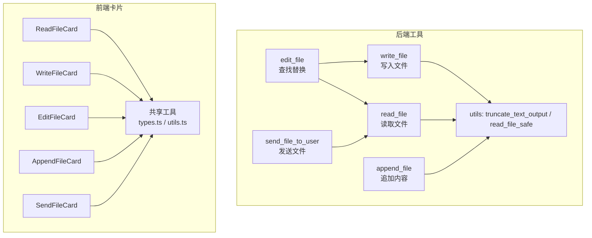
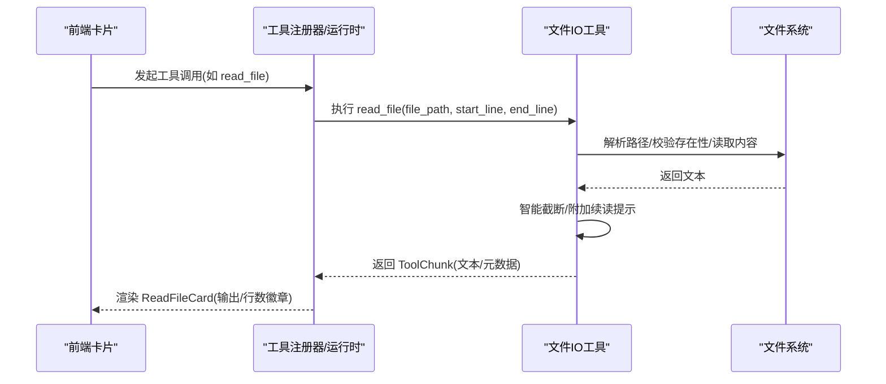
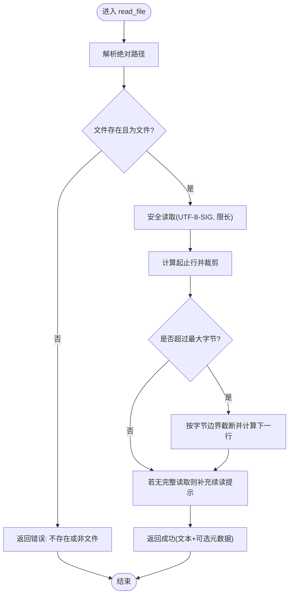
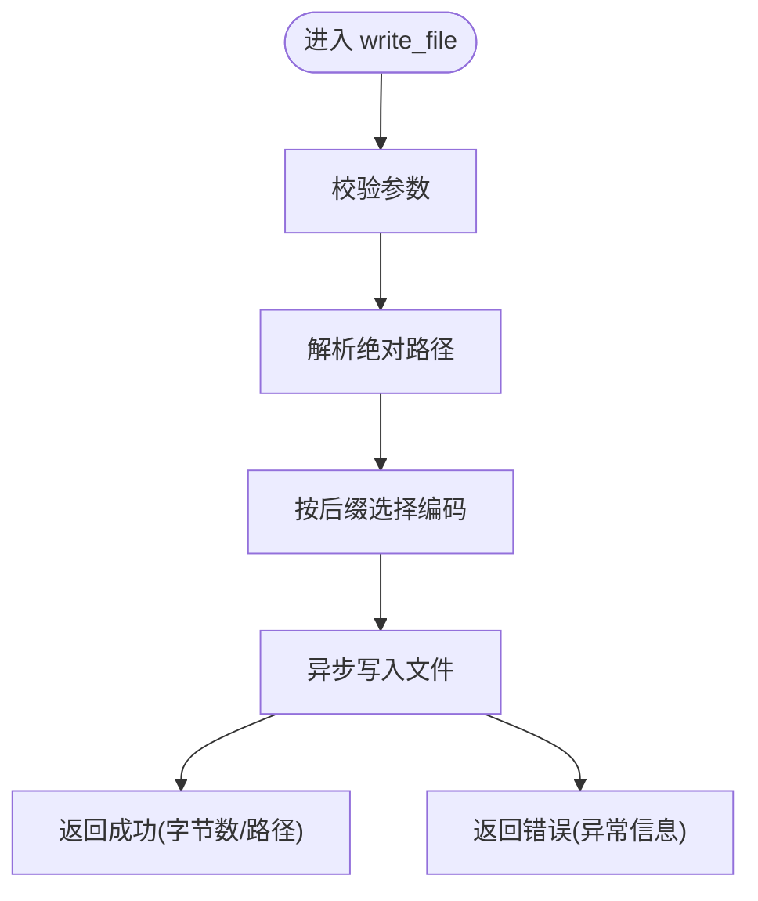
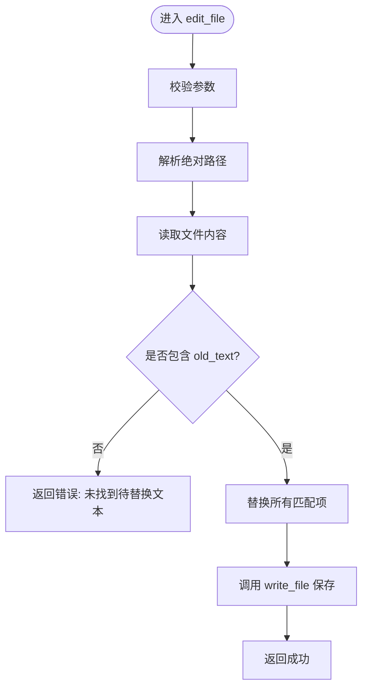
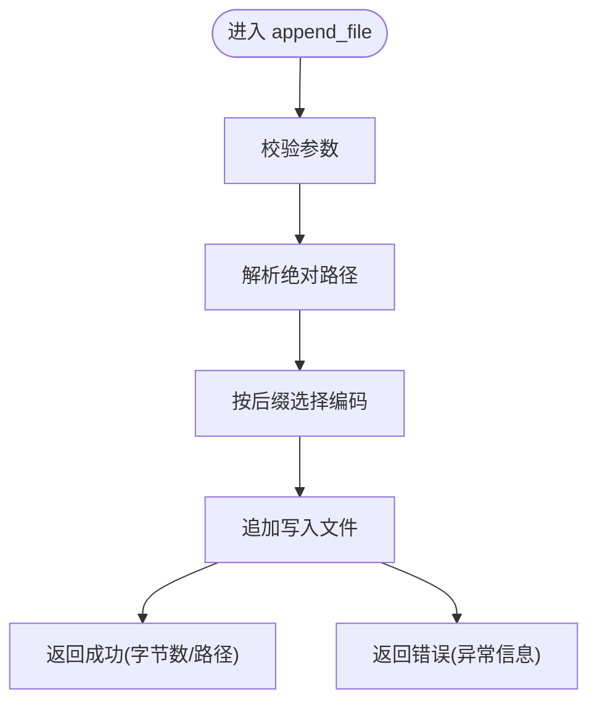
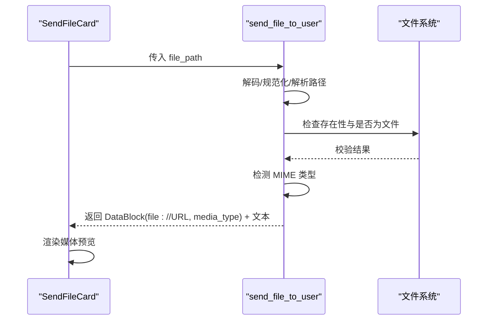
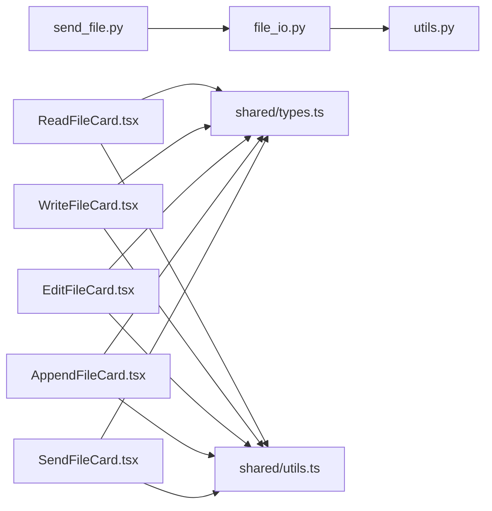

# 文件操作卡片

<cite>
**本文引用的文件**   
- [file_io.py](file://src/qwenpaw/agents/tools/file_io.py)
- [send_file.py](file://src/qwenpaw/agents/tools/send_file.py)
- [utils.py](file://src/qwenpaw/agents/tools/utils.py)
- [ReadFileCard.tsx](file://console/src/components/Chat/ToolCards/cards/ReadFileCard.tsx)
- [WriteFileCard.tsx](file://console/src/components/Chat/ToolCards/cards/WriteFileCard.tsx)
- [EditFileCard.tsx](file://console/src/components/Chat/ToolCards/cards/EditFileCard.tsx)
- [AppendFileCard.tsx](file://console/src/components/Chat/ToolCards/cards/AppendFileCard.tsx)
- [SendFileCard.tsx](file://console/src/components/Chat/ToolCards/cards/SendFileCard.tsx)
- [types.ts](file://console/src/components/Chat/ToolCards/shared/types.ts)
- [utils.ts](file://console/src/components/Chat/ToolCards/shared/utils.ts)
</cite>

## 目录
1. [简介](#简介)
2. [项目结构](#项目结构)
3. [核心组件](#核心组件)
4. [架构总览](#架构总览)
5. [详细组件分析](#详细组件分析)
6. [依赖关系分析](#依赖关系分析)
7. [性能与限制](#性能与限制)
8. [故障排查指南](#故障排查指南)
9. [结论](#结论)
10. [附录：使用示例与最佳实践](#附录使用示例与最佳实践)

## 简介
本文件面向 QwenPaw 的“文件操作卡片”能力，系统性梳理后端工具（读取、写入、编辑、追加、发送）与前端的展示卡片之间的协作方式。文档覆盖功能特性、用户交互流程、数据处理逻辑、编码策略、大小限制、错误处理机制，并提供实际使用场景与最佳实践建议，帮助开发者快速理解并扩展文件类工具卡片的实现。

## 项目结构
围绕文件操作的核心由两部分组成：
- 后端工具层：提供 read_file、write_file、edit_file、append_file、send_file_to_user 等工具函数，负责路径解析、编码选择、安全读取、截断提示、MIME 类型检测与 URL 生成。
- 前端卡片层：为每个工具提供对应的 Tool Card 组件，用于渲染参数、结果、差异对比、媒体预览与状态指示。

图表来源
- [file_io.py:89-468](file://src/qwenpaw/agents/tools/file_io.py#L89-L468)
- [send_file.py:17-96](file://src/qwenpaw/agents/tools/send_file.py#L17-L96)
- [utils.py:263-363](file://src/qwenpaw/agents/tools/utils.py#L263-L363)
- [ReadFileCard.tsx:14-58](file://console/src/components/Chat/ToolCards/cards/ReadFileCard.tsx#L14-L58)
- [WriteFileCard.tsx:14-62](file://console/src/components/Chat/ToolCards/cards/WriteFileCard.tsx#L14-L62)
- [EditFileCard.tsx:14-80](file://console/src/components/Chat/ToolCards/cards/EditFileCard.tsx#L14-L80)
- [AppendFileCard.tsx:14-62](file://console/src/components/Chat/ToolCards/cards/AppendFileCard.tsx#L14-L62)
- [SendFileCard.tsx:13-54](file://console/src/components/Chat/ToolCards/cards/SendFileCard.tsx#L13-L54)
- [types.ts:1-29](file://console/src/components/Chat/ToolCards/shared/types.ts#L1-L29)
- [utils.ts:1-581](file://console/src/components/Chat/ToolCards/shared/utils.ts#L1-L581)

章节来源
- [file_io.py:89-468](file://src/qwenpaw/agents/tools/file_io.py#L89-L468)
- [send_file.py:17-96](file://src/qwenpaw/agents/tools/send_file.py#L17-L96)
- [utils.py:263-363](file://src/qwenpaw/agents/tools/utils.py#L263-L363)
- [ReadFileCard.tsx:14-58](file://console/src/components/Chat/ToolCards/cards/ReadFileCard.tsx#L14-L58)
- [WriteFileCard.tsx:14-62](file://console/src/components/Chat/ToolCards/cards/WriteFileCard.tsx#L14-L62)
- [EditFileCard.tsx:14-80](file://console/src/components/Chat/ToolCards/cards/EditFileCard.tsx#L14-L80)
- [AppendFileCard.tsx:14-62](file://console/src/components/Chat/ToolCards/cards/AppendFileCard.tsx#L14-L62)
- [SendFileCard.tsx:13-54](file://console/src/components/Chat/ToolCards/cards/SendFileCard.tsx#L13-L54)
- [types.ts:1-29](file://console/src/components/Chat/ToolCards/shared/types.ts#L1-L29)
- [utils.ts:1-581](file://console/src/components/Chat/ToolCards/shared/utils.ts#L1-L581)

## 核心组件
本节聚焦五个文件操作卡片及其对应后端工具的实现要点。

- 读取文件（ReadFileCard + read_file）
  - 支持按行范围读取；自动进行字节级智能截断并附带续读提示；返回文本块或错误信息。
  - 关键细节：相对路径基于工作区解析；统一使用 utf-8-sig 读取以兼容 BOM；超大文件受内存上限保护。
- 写入文件（WriteFileCard + write_file）
  - 创建或覆盖目标文件；根据后缀选择编码（CSV/TSV/TXT 等使用 utf-8-sig）。
- 编辑文件（EditFileCard + edit_file）
  - 全文查找 old_text 并替换为 new_text；若未找到则返回错误；内部复用读取与写入。
- 追加文件（AppendFileCard + append_file）
  - 在文件末尾追加内容；同样遵循编码策略。
- 发送文件（SendFileCard + send_file_to_user）
  - 将本地文件以 file:// URL 形式返回给前端；前端通过 MediaPreview 进行图片/视频/音频预览或下载。

章节来源
- [file_io.py:89-468](file://src/qwenpaw/agents/tools/file_io.py#L89-L468)
- [send_file.py:17-96](file://src/qwenpaw/agents/tools/send_file.py#L17-L96)
- [utils.py:263-363](file://src/qwenpaw/agents/tools/utils.py#L263-L363)
- [ReadFileCard.tsx:14-58](file://console/src/components/Chat/ToolCards/cards/ReadFileCard.tsx#L14-L58)
- [WriteFileCard.tsx:14-62](file://console/src/components/Chat/ToolCards/cards/WriteFileCard.tsx#L14-L62)
- [EditFileCard.tsx:14-80](file://console/src/components/Chat/ToolCards/cards/EditFileCard.tsx#L14-L80)
- [AppendFileCard.tsx:14-62](file://console/src/components/Chat/ToolCards/cards/AppendFileCard.tsx#L14-L62)
- [SendFileCard.tsx:13-54](file://console/src/components/Chat/ToolCards/cards/SendFileCard.tsx#L13-L54)

## 架构总览
下图展示了从前端卡片到后端工具的调用链路与数据流转。

图表来源
- [file_io.py:89-246](file://src/qwenpaw/agents/tools/file_io.py#L89-L246)
- [utils.py:263-328](file://src/qwenpaw/agents/tools/utils.py#L263-L328)
- [ReadFileCard.tsx:14-58](file://console/src/components/Chat/ToolCards/cards/ReadFileCard.tsx#L14-L58)

## 详细组件分析

### 读取文件（ReadFileCard + read_file）
- 功能特性
  - 支持全量或按行范围读取；对超长输出进行字节级截断，并附带续读提示（包含下一段起始行号）。
  - 相对路径自动解析至工作区；跨平台兼容 Windows 非 ASCII 文件名。
- 用户交互流程
  - 卡片显示标题（文件名）、输出区块、行数徽章；当被截断时，提示继续读取的行号。
- 数据处理逻辑
  - 路径解析 → 存在性与类型校验 → 安全读取（utf-8-sig，忽略解码错误）→ 行范围裁剪 → 智能截断与元数据构建 → 返回成功或错误。
- 技术细节
  - 编码：读取统一使用 utf-8-sig；写入/追加按后缀选择编码（CSV/TSV/TXT 等用 utf-8-sig，其他用 utf-8）。
  - 大小限制：单次读取最大 200MB；输出默认截断阈值约 50KB，可通过上下文配置调整。
  - 截断元数据：包含 total_lines、start_line、excerpt_bytes、read_from 等字段，便于后续重截断与续读。

图表来源
- [file_io.py:89-246](file://src/qwenpaw/agents/tools/file_io.py#L89-L246)
- [utils.py:263-328](file://src/qwenpaw/agents/tools/utils.py#L263-L328)

章节来源
- [file_io.py:89-246](file://src/qwenpaw/agents/tools/file_io.py#L89-L246)
- [utils.py:263-328](file://src/qwenpaw/agents/tools/utils.py#L263-L328)
- [ReadFileCard.tsx:14-58](file://console/src/components/Chat/ToolCards/cards/ReadFileCard.tsx#L14-L58)

### 写入文件（WriteFileCard + write_file）
- 功能特性
  - 创建或覆盖目标文件；根据后缀选择合适编码；返回写入字节数与路径。
- 用户交互流程
  - 卡片显示标题（文件名）、写入内容预览、新增行数徽章。
- 数据处理逻辑
  - 参数校验 → 路径解析 → 编码选择 → 异步写入 → 返回成功或错误。
- 技术细节
  - 编码策略：CSV/TSV/TXT 等使用 utf-8-sig，其余使用 utf-8。
  - 错误处理：捕获异常并返回结构化错误信息。

图表来源
- [file_io.py:249-301](file://src/qwenpaw/agents/tools/file_io.py#L249-L301)

章节来源
- [file_io.py:249-301](file://src/qwenpaw/agents/tools/file_io.py#L249-L301)
- [WriteFileCard.tsx:14-62](file://console/src/components/Chat/ToolCards/cards/WriteFileCard.tsx#L14-L62)

### 编辑文件（EditFileCard + edit_file）
- 功能特性
  - 全文查找 old_text 并替换为 new_text；若未找到则返回错误；内部复用读取与写入。
- 用户交互流程
  - 卡片展示旧文本与新文本的差异视图（删除/新增行），以及增删行数徽章。
- 数据处理逻辑
  - 参数校验 → 路径解析 → 读取文件 → 匹配 old_text → 替换 → 调用 write_file → 返回结果。
- 技术细节
  - 错误处理：找不到待替换文本、读取失败、写入失败均返回明确错误。

图表来源
- [file_io.py:305-407](file://src/qwenpaw/agents/tools/file_io.py#L305-L407)

章节来源
- [file_io.py:305-407](file://src/qwenpaw/agents/tools/file_io.py#L305-L407)
- [EditFileCard.tsx:14-80](file://console/src/components/Chat/ToolCards/cards/EditFileCard.tsx#L14-L80)

### 追加文件（AppendFileCard + append_file）
- 功能特性
  - 在文件末尾追加内容；遵循编码策略；返回追加字节数与路径。
- 用户交互流程
  - 卡片显示标题（文件名）、追加内容预览、新增行数徽章。
- 数据处理逻辑
  - 参数校验 → 路径解析 → 编码选择 → 追加写入 → 返回成功或错误。
- 技术细节
  - 编码策略与 write_file 一致；错误处理完善。

图表来源
- [file_io.py:410-468](file://src/qwenpaw/agents/tools/file_io.py#L410-L468)

章节来源
- [file_io.py:410-468](file://src/qwenpaw/agents/tools/file_io.py#L410-L468)
- [AppendFileCard.tsx:14-62](file://console/src/components/Chat/ToolCards/cards/AppendFileCard.tsx#L14-L62)

### 发送文件（SendFileCard + send_file_to_user）
- 功能特性
  - 将本地文件以 file:// URL 返回给前端；前端根据 MIME 类型进行媒体预览或下载。
- 用户交互流程
  - 卡片显示标题（文件名），并根据结果中的 DataBlock 渲染媒体预览。
- 数据处理逻辑
  - 路径标准化与解析 → 存在性与类型校验 → MIME 类型检测 → 构造 file:// URL → 返回 DataBlock + 文本提示。
- 技术细节
  - 路径兼容：支持百分号编码与 Unicode 规范化；Windows 下 file:// 前缀特殊处理。
  - 未知 MIME 类型回退为 application/octet-stream。

图表来源
- [send_file.py:17-96](file://src/qwenpaw/agents/tools/send_file.py#L17-L96)
- [file_io.py:27-43](file://src/qwenpaw/agents/tools/file_io.py#L27-L43)
- [SendFileCard.tsx:13-54](file://console/src/components/Chat/ToolCards/cards/SendFileCard.tsx#L13-L54)

章节来源
- [send_file.py:17-96](file://src/qwenpaw/agents/tools/send_file.py#L17-L96)
- [file_io.py:27-43](file://src/qwenpaw/agents/tools/file_io.py#L27-L43)
- [SendFileCard.tsx:13-54](file://console/src/components/Chat/ToolCards/cards/SendFileCard.tsx#L13-L54)

## 依赖关系分析
- 后端工具依赖
  - file_io.py 依赖 utils.py 的 truncate_text_output、read_file_safe 与常量；同时依赖运行时工具描述符与上下文配置。
  - send_file.py 复用 file_io.py 的路径解析与 URL 转换工具。
- 前端卡片依赖
  - 各卡片组件依赖 shared/types.ts 的 ToolCallContent 数据结构，以及 shared/utils.ts 的通用工具（短文件名、行数统计、媒体信息提取、URL 转换等）。

图表来源
- [file_io.py:89-468](file://src/qwenpaw/agents/tools/file_io.py#L89-L468)
- [send_file.py:17-96](file://src/qwenpaw/agents/tools/send_file.py#L17-L96)
- [utils.py:263-363](file://src/qwenpaw/agents/tools/utils.py#L263-L363)
- [types.ts:1-29](file://console/src/components/Chat/ToolCards/shared/types.ts#L1-L29)
- [utils.ts:1-581](file://console/src/components/Chat/ToolCards/shared/utils.ts#L1-L581)

章节来源
- [file_io.py:89-468](file://src/qwenpaw/agents/tools/file_io.py#L89-L468)
- [send_file.py:17-96](file://src/qwenpaw/agents/tools/send_file.py#L17-L96)
- [utils.py:263-363](file://src/qwenpaw/agents/tools/utils.py#L263-L363)
- [types.ts:1-29](file://console/src/components/Chat/ToolCards/shared/types.ts#L1-L29)
- [utils.ts:1-581](file://console/src/components/Chat/ToolCards/shared/utils.ts#L1-L581)

## 性能与限制
- 读取性能
  - 大文件读取受 MAX_FILE_READ_BYTES 限制（默认 200MB），避免内存溢出。
  - 输出截断默认约 50KB，可按上下文配置调整；截断算法保证行完整性，并给出续读提示。
- 编码与兼容性
  - 读取统一使用 utf-8-sig，兼容带 BOM 的 UTF-8 文件；写入/追加按后缀选择编码，确保 Excel/Notepad 等应用正确识别。
- 路径与平台
  - 相对路径基于工作区解析；Windows 下 file:// URL 前缀特殊处理，避免中文路径问题。
- 媒体预览
  - 前端根据扩展名分类媒体类型（图片/视频/音频/文件），并通过 toDisplayUrl 转换为可访问的预览地址。

[本节为通用性能讨论，不直接分析具体文件]

## 故障排查指南
- 常见错误与定位
  - 文件不存在或非文件：read_file/edit_file 会返回明确的错误信息；检查路径是否正确、是否已在工作区内。
  - 未找到待替换文本：edit_file 返回错误；确认 old_text 是否与文件内容完全一致（包括换行与空格）。
  - 编码问题：若出现乱码，优先检查文件是否含 BOM；读取端已做兼容，但写入/追加需按后缀选择编码。
  - 截断导致内容不完整：查看输出末尾的续读提示，使用 read_file 指定 start_line 继续读取。
- 调试建议
  - 在前端卡片中观察 status 字段（calling/done/error）与 result 结构；必要时打印 stringifyResult 的结果。
  - 对于媒体预览失败，检查返回的 DataBlock 中 URL 与 media_type 是否正确。

章节来源
- [file_io.py:89-468](file://src/qwenpaw/agents/tools/file_io.py#L89-L468)
- [send_file.py:17-96](file://src/qwenpaw/agents/tools/send_file.py#L17-L96)
- [utils.ts:1-581](file://console/src/components/Chat/ToolCards/shared/utils.ts#L1-L581)

## 结论
QwenPaw 的文件操作卡片在后端提供了稳健的工具实现（路径解析、编码策略、安全读取、智能截断、续读提示、MIME 检测与 URL 生成），在前端则以一致的卡片形态呈现参数、结果与差异对比，并对媒体内容进行预览。整体设计兼顾安全性、可用性与可扩展性，适合在多种工作流中作为基础能力支撑。

[本节为总结性内容，不直接分析具体文件]

## 附录：使用示例与最佳实践
- 读取大文件
  - 先使用 read_file 不带行范围获取概览；若输出被截断，根据续读提示使用 start_line 继续读取。
  - 参考实现路径：[file_io.py:89-246](file://src/qwenpaw/agents/tools/file_io.py#L89-L246)、[utils.py:263-328](file://src/qwenpaw/agents/tools/utils.py#L263-L328)。
- 批量编辑
  - 使用 edit_file 进行精确替换；若不确定匹配情况，先用 read_file 查看相关片段。
  - 参考实现路径：[file_io.py:305-407](file://src/qwenpaw/agents/tools/file_io.py#L305-L407)。
- 日志追加
  - 使用 append_file 追加运行日志或中间结果；注意编码策略与文件大小增长。
  - 参考实现路径：[file_io.py:410-468](file://src/qwenpaw/agents/tools/file_io.py#L410-L468)。
- 发送媒体文件
  - 使用 send_file_to_user 发送图片/视频/音频；前端会自动进行媒体预览。
  - 参考实现路径：[send_file.py:17-96](file://src/qwenpaw/agents/tools/send_file.py#L17-L96)、[utils.ts:196-221](file://console/src/components/Chat/ToolCards/shared/utils.ts#L196-L221)。
- 最佳实践
  - 始终使用相对路径并确保文件位于工作区内。
  - 对 CSV/TSV/TXT 等文件，写入/追加时使用 utf-8-sig 编码以保证兼容性。
  - 对大文件输出，结合截断提示进行分页读取，避免一次性加载过多内容。
  - 在发送文件前，确认文件存在且为普通文件，避免无效请求。

章节来源
- [file_io.py:89-468](file://src/qwenpaw/agents/tools/file_io.py#L89-L468)
- [send_file.py:17-96](file://src/qwenpaw/agents/tools/send_file.py#L17-L96)
- [utils.ts:196-221](file://console/src/components/Chat/ToolCards/shared/utils.ts#L196-L221)