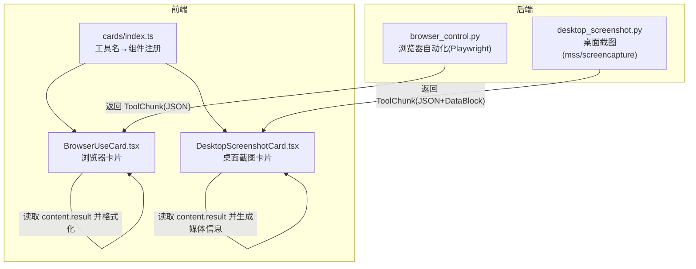
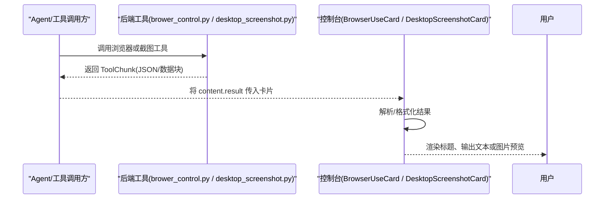
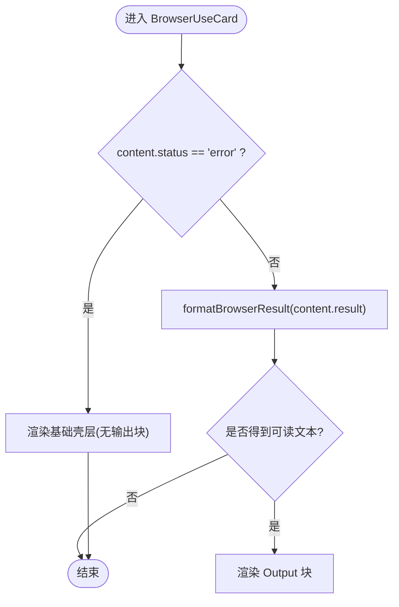
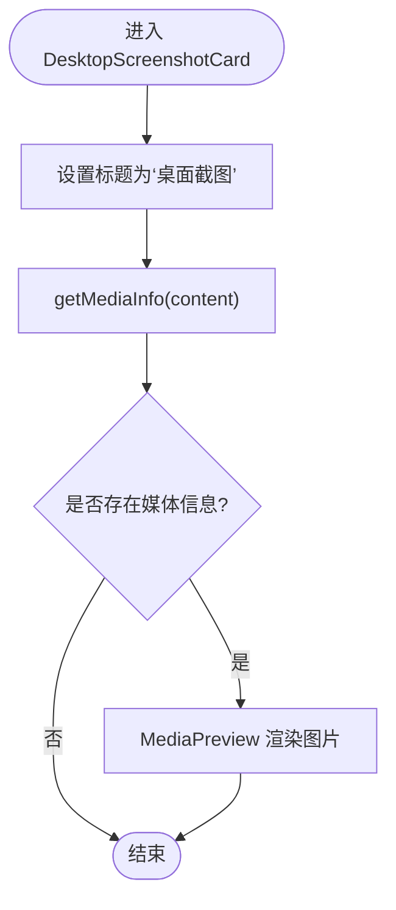
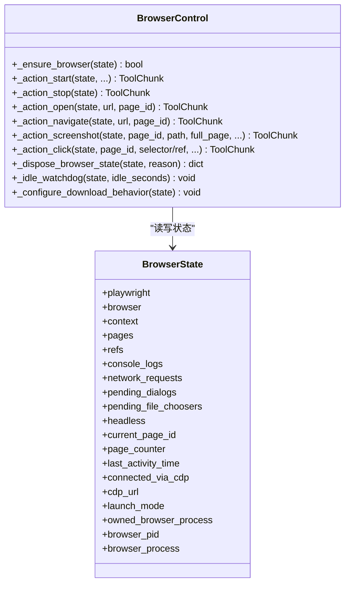
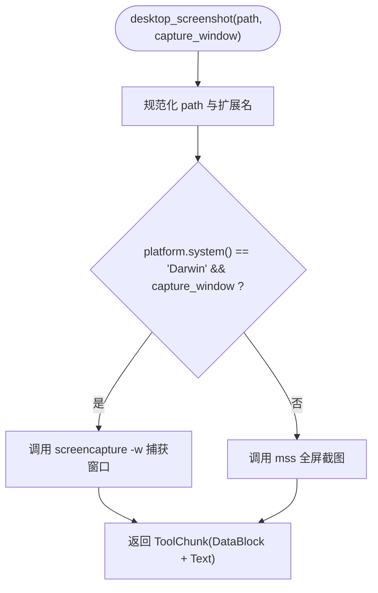
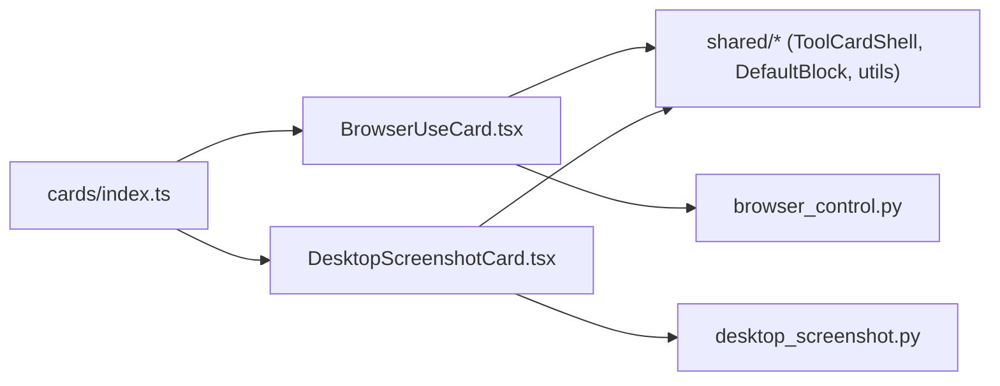

# 浏览器控制卡片

<cite>
**本文引用的文件列表**
- [BrowserUseCard.tsx](file://console/src/components/Chat/ToolCards/cards/BrowserUseCard.tsx)
- [DesktopScreenshotCard.tsx](file://console/src/components/Chat/ToolCards/cards/DesktopScreenshotCard.tsx)
- [cards/index.ts](file://console/src/components/Chat/ToolCards/cards/index.ts)
- [browser_control.py](file://src/qwenpaw/agents/tools/browser_control.py)
- [desktop_screenshot.py](file://src/qwenpaw/agents/tools/desktop_screenshot.py)
</cite>

## 目录
1. [简介](#简介)
2. [项目结构](#项目结构)
3. [核心组件](#核心组件)
4. [架构总览](#架构总览)
5. [详细组件分析](#详细组件分析)
6. [依赖关系分析](#依赖关系分析)
7. [性能考虑](#性能考虑)
8. [故障排查指南](#故障排查指南)
9. [结论](#结论)
10. [附录：使用示例与最佳实践](#附录使用示例与最佳实践)

## 简介
本文件围绕 QwenPaw 控制台中的“浏览器控制卡片”展开，重点解释以下能力：
- BrowserUseCard：用于展示浏览器自动化操作（导航、点击、输入、截图、表单填写等）的调用结果与状态。
- DesktopScreenshotCard：用于展示桌面截图工具的输出（图片预览）。
- 后端实现：浏览器自动化基于 Playwright，支持多模式启动（CDP 托管、Playwright 直接启动、同步兼容模式），具备会话持久化、页面管理、下载行为配置、空闲回收等机制；桌面截图跨平台实现，macOS 支持窗口选择。

## 项目结构
前端通过内置卡片注册表将工具名映射到具体 React 组件，统一渲染在聊天消息中。后端提供浏览器与桌面截图的工具实现，返回结构化结果供前端解析与展示。

图表来源
- [cards/index.ts:78-134](file://console/src/components/Chat/ToolCards/cards/index.ts#L78-L134)
- [BrowserUseCard.tsx:90-103](file://console/src/components/Chat/ToolCards/cards/BrowserUseCard.tsx#L90-L103)
- [DesktopScreenshotCard.tsx:1-34](file://console/src/components/Chat/ToolCards/cards/DesktopScreenshotCard.tsx#L1-L34)
- [browser_control.py:1-120](file://src/qwenpaw/agents/tools/browser_control.py#L1-L120)
- [desktop_screenshot.py:1-66](file://src/qwenpaw/agents/tools/desktop_screenshot.py#L1-L66)

章节来源
- [cards/index.ts:78-134](file://console/src/components/Chat/ToolCards/cards/index.ts#L78-L134)

## 核心组件
- BrowserUseCard
  - 负责解析浏览器相关工具的结果，提取 snapshot/message/url 等字段，并以可读文本输出。
  - 支持多种工具名（如 browser_use、navigate、click、type、snapshot、scroll 等），根据 action 参数动态生成标题。
- DesktopScreenshotCard
  - 负责解析桌面截图工具的结果，提取媒体信息并渲染图片预览。

章节来源
- [BrowserUseCard.tsx:1-88](file://console/src/components/Chat/ToolCards/cards/BrowserUseCard.tsx#L1-L88)
- [BrowserUseCard.tsx:105-248](file://console/src/components/Chat/ToolCards/cards/BrowserUseCard.tsx#L105-L248)
- [DesktopScreenshotCard.tsx:1-34](file://console/src/components/Chat/ToolCards/cards/DesktopScreenshotCard.tsx#L1-L34)

## 架构总览
从调用到展示的端到端流程如下：

图表来源
- [browser_control.py:1675-1911](file://src/qwenpaw/agents/tools/browser_control.py#L1675-L1911)
- [desktop_screenshot.py:126-168](file://src/qwenpaw/agents/tools/desktop_screenshot.py#L126-L168)
- [BrowserUseCard.tsx:255-287](file://console/src/components/Chat/ToolCards/cards/BrowserUseCard.tsx#L255-L287)
- [DesktopScreenshotCard.tsx:13-31](file://console/src/components/Chat/ToolCards/cards/DesktopScreenshotCard.tsx#L13-L31)

## 详细组件分析

### BrowserUseCard 组件
- 功能要点
  - 工具名集合：覆盖浏览器启动、导航、点击、输入、快照、滚动等。
  - 标题生成：根据 tool name 与 params.action 等参数，生成人类可读的操作描述。
  - 结果格式化：优先从 result 对象中提取 snapshot/message/url；若为字符串则尝试 JSON 解析；若为 MCP 内容块包裹的 JSON，也做内层解析；最终回退通用序列化。
  - 错误态处理：当 content.status 为 error 时，仅显示基础壳层，不渲染输出块。
- 关键路径
  - 工具名映射：见 cards/index.ts 的注册表。
  - 标题生成逻辑：按 action 分支构造文案。
  - 结果解析：extractBrowserFields/formatBrowserResult。

图表来源
- [BrowserUseCard.tsx:255-287](file://console/src/components/Chat/ToolCards/cards/BrowserUseCard.tsx#L255-L287)
- [BrowserUseCard.tsx:18-88](file://console/src/components/Chat/ToolCards/cards/BrowserUseCard.tsx#L18-L88)
- [BrowserUseCard.tsx:105-248](file://console/src/components/Chat/ToolCards/cards/BrowserUseCard.tsx#L105-L248)
- [cards/index.ts:95-106](file://console/src/components/Chat/ToolCards/cards/index.ts#L95-L106)

章节来源
- [BrowserUseCard.tsx:1-88](file://console/src/components/Chat/ToolCards/cards/BrowserUseCard.tsx#L1-L88)
- [BrowserUseCard.tsx:105-248](file://console/src/components/Chat/ToolCards/cards/BrowserUseCard.tsx#L105-L248)
- [BrowserUseCard.tsx:255-287](file://console/src/components/Chat/ToolCards/cards/BrowserUseCard.tsx#L255-L287)
- [cards/index.ts:95-106](file://console/src/components/Chat/ToolCards/cards/index.ts#L95-L106)

### DesktopScreenshotCard 组件
- 功能要点
  - 标题固定为“桌面截图”。
  - 通过 getMediaInfo 从 content.result 提取媒体信息，并使用 MediaPreview 进行图片预览。
- 关键路径
  - 工具名映射：desktop_screenshot → DesktopScreenshotCard。
  - 媒体解析：getMediaInfo 返回可被 MediaPreview 消费的结构。

图表来源
- [DesktopScreenshotCard.tsx:13-31](file://console/src/components/Chat/ToolCards/cards/DesktopScreenshotCard.tsx#L13-L31)
- [cards/index.ts:92](file://console/src/components/Chat/ToolCards/cards/index.ts#L92)

章节来源
- [DesktopScreenshotCard.tsx:1-34](file://console/src/components/Chat/ToolCards/cards/DesktopScreenshotCard.tsx#L1-L34)
- [cards/index.ts:92](file://console/src/components/Chat/ToolCards/cards/index.ts#L92)

### 后端：浏览器自动化（browser_control.py）
- 设计要点
  - 工作区级状态：每个 workspace_id 维护一个 state dict，包含 Playwright 实例、上下文、页面、引用、日志、网络请求、对话框、文件选择器等。
  - 多模式启动：
    - CDP 托管模式：启动外部 Chromium 进程并通过 CDP 连接，便于复用系统浏览器或调试。
    - Playwright 直接模式：由 Playwright 管理浏览器生命周期。
    - 同步兼容模式：Windows + Uvicorn reload 场景下使用 sync Playwright 以避免事件循环问题。
  - 资源清理：统一的 _dispose_browser_state 负责关闭 context/browser/playwright 及可选的外部进程，带超时与失败记录。
  - 空闲回收：后台任务在浏览器空闲超过阈值后自动停止，释放渲染进程。
  - 下载行为：通过 CDP 配置下载路径，避免弹窗干扰。
  - 页面管理：新标签页自动注册并切换当前页；支持 ref-based 定位。
- 关键函数与职责
  - _ensure_browser：确保浏览器可用，必要时启动或重连。
  - _action_start/_action_stop：启动/停止浏览器，支持 headed/headless、private_mode、cdp_port、executable_path 等。
  - _action_open/_action_navigate：打开/导航页面。
  - _action_screenshot：页面或元素截图，支持 full_page、ref/frame_selector。
  - _action_click：点击（支持 ref/selector/坐标、双击、修饰键）。
  - _attach_context_listeners/_register_page：监听新标签页、注册页面与事件。
  - _idle_watchdog：空闲回收。
  - _configure_download_behavior：配置下载路径。

图表来源
- [browser_control.py:247-301](file://src/qwenpaw/agents/tools/browser_control.py#L247-L301)
- [browser_control.py:1531-1649](file://src/qwenpaw/agents/tools/browser_control.py#L1531-L1649)
- [browser_control.py:1675-1911](file://src/qwenpaw/agents/tools/browser_control.py#L1675-L1911)
- [browser_control.py:1914-1986](file://src/qwenpaw/agents/tools/browser_control.py#L1914-L1986)
- [browser_control.py:1989-2054](file://src/qwenpaw/agents/tools/browser_control.py#L1989-L2054)
- [browser_control.py:2057-2108](file://src/qwenpaw/agents/tools/browser_control.py#L2057-L2108)
- [browser_control.py:2111-2230](file://src/qwenpaw/agents/tools/browser_control.py#L2111-L2230)
- [browser_control.py:2233-2399](file://src/qwenpaw/agents/tools/browser_control.py#L2233-L2399)
- [browser_control.py:1263-1346](file://src/qwenpaw/agents/tools/browser_control.py#L1263-L1346)
- [browser_control.py:364-390](file://src/qwenpaw/agents/tools/browser_control.py#L364-L390)
- [browser_control.py:180-211](file://src/qwenpaw/agents/tools/browser_control.py#L180-L211)

章节来源
- [browser_control.py:247-301](file://src/qwenpaw/agents/tools/browser_control.py#L247-L301)
- [browser_control.py:1531-1649](file://src/qwenpaw/agents/tools/browser_control.py#L1531-L1649)
- [browser_control.py:1675-1911](file://src/qwenpaw/agents/tools/browser_control.py#L1675-L1911)
- [browser_control.py:1914-1986](file://src/qwenpaw/agents/tools/browser_control.py#L1914-L1986)
- [browser_control.py:1989-2054](file://src/qwenpaw/agents/tools/browser_control.py#L1989-L2054)
- [browser_control.py:2057-2108](file://src/qwenpaw/agents/tools/browser_control.py#L2057-L2108)
- [browser_control.py:2111-2230](file://src/qwenpaw/agents/tools/browser_control.py#L2111-L2230)
- [browser_control.py:2233-2399](file://src/qwenpaw/agents/tools/browser_control.py#L2233-L2399)
- [browser_control.py:1263-1346](file://src/qwenpaw/agents/tools/browser_control.py#L1263-L1346)
- [browser_control.py:364-390](file://src/qwenpaw/agents/tools/browser_control.py#L364-L390)
- [browser_control.py:180-211](file://src/qwenpaw/agents/tools/browser_control.py#L180-L211)

### 后端：桌面截图（desktop_screenshot.py）
- 设计要点
  - 全平台全屏截图：使用 mss 库。
  - macOS 窗口选择：通过系统 screencapture -w 交互选择窗口。
  - 返回值：包含 DataBlock（URLSource 指向保存的图片）和文本说明，便于前端 MediaPreview 渲染。
- 关键函数与职责
  - desktop_screenshot：入口，决定平台策略与保存路径。
  - _capture_mss：mss 全屏截图。
  - _capture_macos_screencapture：macOS 窗口选择截图。

图表来源
- [desktop_screenshot.py:126-168](file://src/qwenpaw/agents/tools/desktop_screenshot.py#L126-L168)
- [desktop_screenshot.py:68-86](file://src/qwenpaw/agents/tools/desktop_screenshot.py#L68-L86)
- [desktop_screenshot.py:88-124](file://src/qwenpaw/agents/tools/desktop_screenshot.py#L88-L124)

章节来源
- [desktop_screenshot.py:1-66](file://src/qwenpaw/agents/tools/desktop_screenshot.py#L1-L66)
- [desktop_screenshot.py:68-86](file://src/qwenpaw/agents/tools/desktop_screenshot.py#L68-L86)
- [desktop_screenshot.py:88-124](file://src/qwenpaw/agents/tools/desktop_screenshot.py#L88-L124)
- [desktop_screenshot.py:126-168](file://src/qwenpaw/agents/tools/desktop_screenshot.py#L126-L168)

## 依赖关系分析
- 前端
  - cards/index.ts 将工具名映射到具体卡片组件，BrowserUseCard 与 DesktopScreenshotCard 均在此注册。
  - BrowserUseCard 依赖 shared 模块的 ToolCardShell、DefaultBlock、stringifyResult 等。
  - DesktopScreenshotCard 依赖 shared 模块的 MediaPreview、getMediaInfo。
- 后端
  - browser_control.py 依赖 Playwright（async/sync）、psutil、subprocess、socket、urllib 等。
  - desktop_screenshot.py 依赖 mss（全平台）与 macOS 系统命令 screencapture。

图表来源
- [cards/index.ts:78-134](file://console/src/components/Chat/ToolCards/cards/index.ts#L78-L134)
- [BrowserUseCard.tsx:1-8](file://console/src/components/Chat/ToolCards/cards/BrowserUseCard.tsx#L1-L8)
- [DesktopScreenshotCard.tsx:1-6](file://console/src/components/Chat/ToolCards/cards/DesktopScreenshotCard.tsx#L1-L6)
- [browser_control.py:1-48](file://src/qwenpaw/agents/tools/browser_control.py#L1-L48)
- [desktop_screenshot.py:1-16](file://src/qwenpaw/agents/tools/desktop_screenshot.py#L1-L16)

章节来源
- [cards/index.ts:78-134](file://console/src/components/Chat/ToolCards/cards/index.ts#L78-L134)

## 性能考虑
- 浏览器自动化
  - 空闲回收：默认空闲超时后自动停止浏览器，减少渲染进程占用。
  - 下载行为：通过 CDP 配置下载路径，避免弹窗阻塞。
  - 同步兼容模式：在 Windows + Uvicorn reload 场景下使用线程池执行同步 API，避免事件循环冲突。
  - 页面与引用：使用 ref 定位可减少复杂选择器带来的不稳定与开销。
- 桌面截图
  - 全平台使用 mss，避免系统差异导致的额外开销；macOS 窗口选择仅在需要时启用。
- 前端渲染
  - BrowserUseCard 对结果进行轻量解析与截断显示，避免大文本渲染影响 UI。
  - DesktopScreenshotCard 使用 MediaPreview 按需加载图片，降低内存占用。

[本节为通用建议，无需特定文件来源]

## 故障排查指南
- 浏览器无法启动
  - 检查 Playwright 安装与浏览器二进制可用性；容器环境需附加参数；Windows 需 --disable-gpu。
  - 查看 _ensure_browser 与 _action_start 的错误信息，确认 launch_mode 与 owned_browser_process。
- CDP 连接丢失
  - 若 connected_via_cdp 为真且连接断开，会提示重新 connect_cdp；此时需先 stop 再 reconnect。
- 页面未找到
  - navigate/click/screenshot 等操作前需确保 page_id 存在；新开标签页会自动注册并设为当前页。
- 下载失败
  - 确认 _configure_download_behavior 成功配置了下载路径；检查目标目录权限。
- 桌面截图失败
  - 确认已安装 mss；macOS 窗口选择可能因用户取消而超时。

章节来源
- [browser_control.py:1531-1649](file://src/qwenpaw/agents/tools/browser_control.py#L1531-L1649)
- [browser_control.py:1675-1911](file://src/qwenpaw/agents/tools/browser_control.py#L1675-L1911)
- [browser_control.py:1914-1986](file://src/qwenpaw/agents/tools/browser_control.py#L1914-L1986)
- [browser_control.py:180-211](file://src/qwenpaw/agents/tools/browser_control.py#L180-L211)
- [desktop_screenshot.py:68-86](file://src/qwenpaw/agents/tools/desktop_screenshot.py#L68-L86)
- [desktop_screenshot.py:88-124](file://src/qwenpaw/agents/tools/desktop_screenshot.py#L88-L124)

## 结论
BrowserUseCard 与 DesktopScreenshotCard 在前端以统一卡片形式呈现工具调用结果，分别聚焦于浏览器自动化与桌面截图。后端通过 robust 的状态管理与多模式启动策略，提供了稳定、可扩展的浏览器控制能力；桌面截图则以跨平台方式满足常见需求。结合空闲回收、下载行为配置与 ref 定位等优化，整体具备良好的性能与可维护性。

[本节为总结性内容，无需特定文件来源]

## 附录：使用示例与最佳实践
- 浏览器自动化
  - 启动浏览器：调用 start 动作，可选择 headed/headless、private_mode、cdp_port、executable_path。
  - 打开/导航：open/navigate 指定 URL，后续操作基于返回的 page_id。
  - 点击/输入：click/type 支持 ref/selector/坐标，配合 wait 与 modifiers 提升稳定性。
  - 截图：screenshot 支持 full_page、ref/frame_selector，输出路径默认保存在 workspace/browser。
  - 表单填写：fill_form 动作批量填充字段；file_upload/file_download 支持上传与下载。
  - 标签页：tabs 列出所有标签页，支持 tab_action 切换/关闭。
  - 等待与评估：wait_for 等待条件；eval/run_code 执行 JS。
- 桌面截图
  - 全屏截图：path 为空时自动保存到工作区，文件名含时间戳。
  - 窗口选择：macOS 上 capture_window=True 可交互式选择窗口。
- 最佳实践
  - 优先使用 ref 定位，减少选择器脆弱性。
  - 合理设置 wait 与重试，应对动态加载。
  - 使用 private_mode 隔离会话，避免 Cookie 污染。
  - 利用空闲回收，避免长时间占用资源。
  - 截图路径尽量使用相对路径，便于归档与分享。

章节来源
- [browser_control.py:1675-1911](file://src/qwenpaw/agents/tools/browser_control.py#L1675-L1911)
- [browser_control.py:1989-2054](file://src/qwenpaw/agents/tools/browser_control.py#L1989-L2054)
- [browser_control.py:2057-2108](file://src/qwenpaw/agents/tools/browser_control.py#L2057-L2108)
- [browser_control.py:2111-2230](file://src/qwenpaw/agents/tools/browser_control.py#L2111-L2230)
- [browser_control.py:2233-2399](file://src/qwenpaw/agents/tools/browser_control.py#L2233-L2399)
- [desktop_screenshot.py:126-168](file://src/qwenpaw/agents/tools/desktop_screenshot.py#L126-L168)