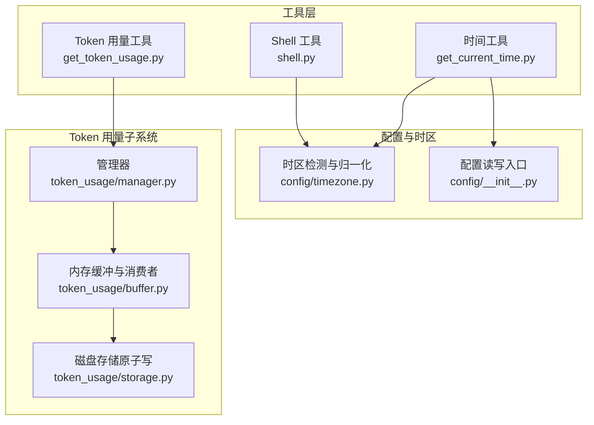
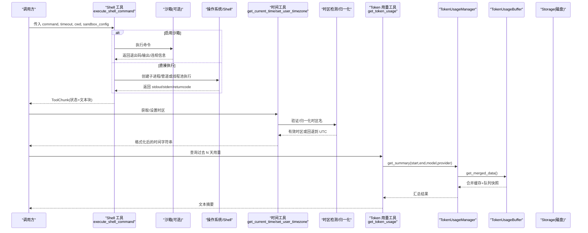
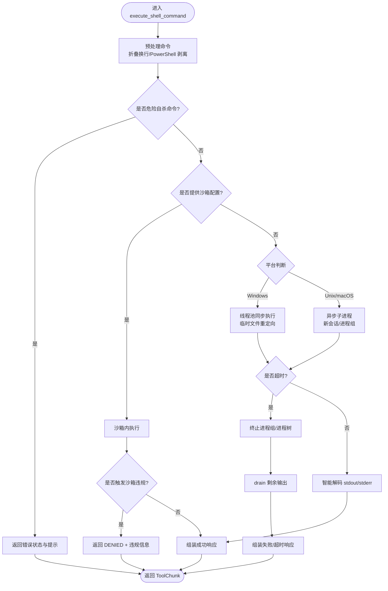
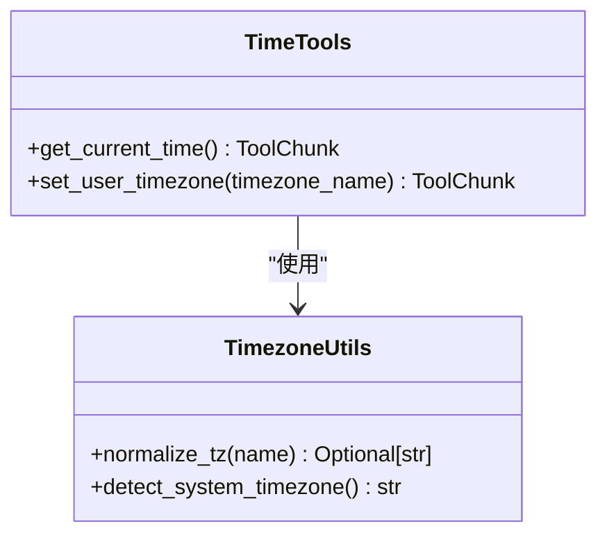
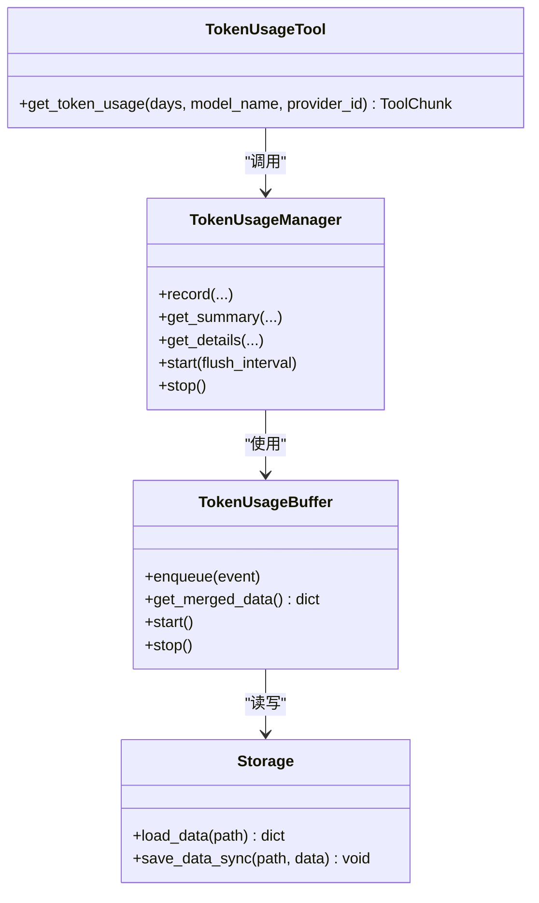
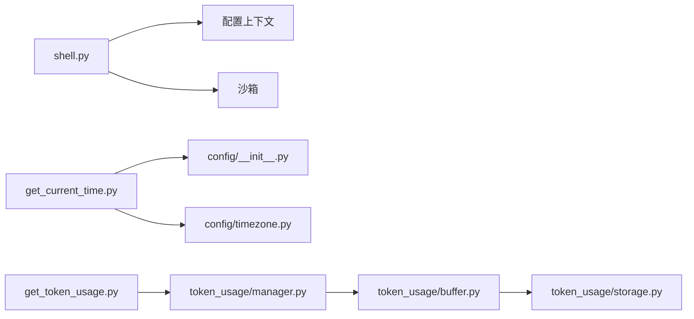

# 系统工具卡片

<cite>
**本文引用的文件**   
- [shell.py](file://src/qwenpaw/agents/tools/shell.py)
- [get_current_time.py](file://src/qwenpaw/agents/tools/get_current_time.py)
- [get_token_usage.py](file://src/qwenpaw/agents/tools/get_token_usage.py)
- [timezone.py](file://src/qwenpaw/config/timezone.py)
- [manager.py](file://src/qwenpaw/token_usage/manager.py)
- [buffer.py](file://src/qwenpaw/token_usage/buffer.py)
- [storage.py](file://src/qwenpaw/token_usage/storage.py)
- [config/__init__.py](file://src/qwenpaw/config/__init__.py)
</cite>

## 目录
1. [简介](#简介)
2. [项目结构](#项目结构)
3. [核心组件](#核心组件)
4. [架构总览](#架构总览)
5. [详细组件分析](#详细组件分析)
6. [依赖关系分析](#依赖关系分析)
7. [性能考量](#性能考量)
8. [故障排查指南](#故障排查指南)
9. [结论](#结论)
10. [附录：使用示例与安全最佳实践](#附录使用示例与安全最佳实践)

## 简介
本文件聚焦 QwenPaw 系统中的“系统级工具卡片”，围绕以下能力进行深入解析：
- Shell 执行：命令预处理、跨平台执行路径、超时与进程组管理、输出流处理、沙箱隔离与安全检查。
- 时间获取与时区设置：基于 IANA 时区的本地化显示与持久化配置。
- Token 使用统计：异步缓冲写入、聚合查询、磁盘持久化与原子写入。

目标读者包括开发者与使用者，既提供代码级实现细节，也给出可操作的使用场景与安全建议。

## 项目结构
与系统工具卡片直接相关的源码位于 agents/tools 与 token_usage、config 等模块中。下图展示了关键文件之间的组织关系与职责边界。

图表来源
- [shell.py:1-718](file://src/qwenpaw/agents/tools/shell.py#L1-L718)
- [get_current_time.py:1-106](file://src/qwenpaw/agents/tools/get_current_time.py#L1-L106)
- [get_token_usage.py:1-91](file://src/qwenpaw/agents/tools/get_token_usage.py#L1-L91)
- [timezone.py:1-257](file://src/qwenpaw/config/timezone.py#L1-L257)
- [manager.py:1-313](file://src/qwenpaw/token_usage/manager.py#L1-L313)
- [buffer.py:1-210](file://src/qwenpaw/token_usage/buffer.py#L1-L210)
- [storage.py:1-66](file://src/qwenpaw/token_usage/storage.py#L1-L66)
- [config/__init__.py:1-59](file://src/qwenpaw/config/__init__.py#L1-L59)

章节来源
- [shell.py:1-718](file://src/qwenpaw/agents/tools/shell.py#L1-L718)
- [get_current_time.py:1-106](file://src/qwenpaw/agents/tools/get_current_time.py#L1-L106)
- [get_token_usage.py:1-91](file://src/qwenpaw/agents/tools/get_token_usage.py#L1-L91)
- [timezone.py:1-257](file://src/qwenpaw/config/timezone.py#L1-L257)
- [manager.py:1-313](file://src/qwenpaw/token_usage/manager.py#L1-L313)
- [buffer.py:1-210](file://src/qwenpaw/token_usage/buffer.py#L1-L210)
- [storage.py:1-66](file://src/qwenpaw/token_usage/storage.py#L1-L66)
- [config/__init__.py:1-59](file://src/qwenpaw/config/__init__.py#L1-L59)

## 核心组件
- Shell 工具：负责命令预处理、安全校验、跨平台执行、超时控制、输出解码与返回结构化结果。支持可选沙箱执行。
- 时间工具：读取用户时区配置，格式化当前时间；支持设置用户时区并持久化。
- Token 用量工具：按日期范围聚合调用量与 token 数，支持按模型或提供方过滤。

章节来源
- [shell.py:450-718](file://src/qwenpaw/agents/tools/shell.py#L450-L718)
- [get_current_time.py:18-106](file://src/qwenpaw/agents/tools/get_current_time.py#L18-L106)
- [get_token_usage.py:14-91](file://src/qwenpaw/agents/tools/get_token_usage.py#L14-L91)

## 架构总览
下图展示三个工具卡片的调用链路与数据流向。

图表来源
- [shell.py:450-718](file://src/qwenpaw/agents/tools/shell.py#L450-L718)
- [get_current_time.py:18-106](file://src/qwenpaw/agents/tools/get_current_time.py#L18-L106)
- [timezone.py:42-108](file://src/qwenpaw/config/timezone.py#L42-L108)
- [get_token_usage.py:14-91](file://src/qwenpaw/agents/tools/get_token_usage.py#L14-L91)
- [manager.py:177-263](file://src/qwenpaw/token_usage/manager.py#L177-L263)
- [buffer.py:102-122](file://src/qwenpaw/token_usage/buffer.py#L102-L122)

## 详细组件分析

### Shell 工具（ShellCard）
- 命令预处理
  - 折叠嵌入换行：在 Windows 下全部替换为空格；在 Unix/macOS 下保留引号内的换行，仅折叠引号外的换行，避免被 shell 误判为命令分隔。
  - PowerShell/cmd 特殊处理：自动剥离多余的 powershell/pwsh -Command 包装；对 cmd.exe 的常见转义进行修复。
- 安全控制
  - 危险自杀命令检测：通过正则匹配 kill/taskkill/stop-process 及 PID 变量，阻止终止自身或父进程的行为。
  - 沙箱策略：当提供 sandbox_config 时，进入沙箱执行；若触发沙箱违规，返回 DENIED 状态并附带违规原因。
- 执行路径
  - Windows：为避免 asyncio 子进程限制，将同步执行放入线程池；stdout/stderr 重定向至临时文件，避免子进程持有管道导致阻塞。
  - Unix/macOS：使用 create_subprocess_shell 启动新会话，结合可取消等待与进程组信号，确保超时后能彻底清理进程树。
- 输出流处理
  - 统一智能解码：优先 UTF-8，失败则回退到系统首选编码并替换非法字符；去除尾部多余换行。
  - 结果组装：根据 returncode 拼接 stdout/stderr，封装为 ToolChunk 返回。
- 超时与资源
  - 默认超时可从运行时上下文覆盖；Windows 下使用 taskkill /F /T 终止进程树；Unix/macOS 下先 SIGTERM，再 SIGKILL，最后 drain 剩余输出。

图表来源
- [shell.py:55-151](file://src/qwenpaw/agents/tools/shell.py#L55-L151)
- [shell.py:195-221](file://src/qwenpaw/agents/tools/shell.py#L195-L221)
- [shell.py:383-446](file://src/qwenpaw/agents/tools/shell.py#L383-L446)
- [shell.py:450-718](file://src/qwenpaw/agents/tools/shell.py#L450-L718)

章节来源
- [shell.py:55-151](file://src/qwenpaw/agents/tools/shell.py#L55-L151)
- [shell.py:195-221](file://src/qwenpaw/agents/tools/shell.py#L195-L221)
- [shell.py:383-446](file://src/qwenpaw/agents/tools/shell.py#L383-L446)
- [shell.py:450-718](file://src/qwenpaw/agents/tools/shell.py#L450-L718)

### 时间相关工具（TimeCard）
- 获取当前时间
  - 从配置读取 user_timezone，若无效则回退到 UTC。
  - 使用 ZoneInfo 构造带时区的 datetime，格式化为“年-月-日 时:分:秒 时区 (星期)”。
- 设置用户时区
  - 校验 IANA 时区名有效性，无效则返回错误提示。
  - 保存配置后返回确认信息与当前时间。
- 时区检测与归一化
  - 支持多种探测源（Python 运行时、环境变量、系统文件、timedatectl、Windows 注册表）。
  - 内置非标准别名映射，保证返回标准 IANA 名称。

图表来源
- [get_current_time.py:18-106](file://src/qwenpaw/agents/tools/get_current_time.py#L18-L106)
- [timezone.py:42-108](file://src/qwenpaw/config/timezone.py#L42-L108)

章节来源
- [get_current_time.py:18-106](file://src/qwenpaw/agents/tools/get_current_time.py#L18-L106)
- [timezone.py:42-108](file://src/qwenpaw/config/timezone.py#L42-L108)

### Token 使用统计（TokenUsageCard）
- 查询接口
  - 接收 days、model_name、provider_id 参数，计算起止日期，调用管理器获取汇总。
  - 返回包含总量、按模型、按日期（限 14 天内展开）的结构化文本。
- 管理器与缓冲
  - Manager 提供记录与查询 API，内部维护一个单例实例。
  - Buffer 采用异步生产者-消费者模式：事件入队，后台消费者更新内存缓存，定时任务落盘。
  - Storage 提供加载与原子写入（tmp→replace），避免并发损坏。
- 数据模型
  - 聚合维度：按 provider:model 组合键、按日期聚合。
  - 字段：prompt_tokens、completion_tokens、call_count。

图表来源
- [get_token_usage.py:14-91](file://src/qwenpaw/agents/tools/get_token_usage.py#L14-L91)
- [manager.py:65-313](file://src/qwenpaw/token_usage/manager.py#L65-L313)
- [buffer.py:29-210](file://src/qwenpaw/token_usage/buffer.py#L29-L210)
- [storage.py:15-66](file://src/qwenpaw/token_usage/storage.py#L15-L66)

章节来源
- [get_token_usage.py:14-91](file://src/qwenpaw/agents/tools/get_token_usage.py#L14-L91)
- [manager.py:65-313](file://src/qwenpaw/token_usage/manager.py#L65-L313)
- [buffer.py:29-210](file://src/qwenpaw/token_usage/buffer.py#L29-L210)
- [storage.py:15-66](file://src/qwenpaw/token_usage/storage.py#L15-L66)

## 依赖关系分析
- Shell 工具依赖
  - 配置上下文：工作目录、默认 shell、超时等。
  - 沙箱：可选执行环境，用于内核级隔离。
  - 平台差异：Windows 线程池执行与 Unix/macOS 异步子进程。
- 时间工具依赖
  - 配置读写：user_timezone 的持久化。
  - 时区检测：多源探测与别名归一化。
- Token 用量工具依赖
  - 管理器：单例访问、聚合查询。
  - 缓冲：异步队列、后台消费与定时 flush。
  - 存储：JSON 文件，原子写入。

图表来源
- [shell.py:1-718](file://src/qwenpaw/agents/tools/shell.py#L1-L718)
- [get_current_time.py:1-106](file://src/qwenpaw/agents/tools/get_current_time.py#L1-L106)
- [timezone.py:1-257](file://src/qwenpaw/config/timezone.py#L1-L257)
- [get_token_usage.py:1-91](file://src/qwenpaw/agents/tools/get_token_usage.py#L1-L91)
- [manager.py:1-313](file://src/qwenpaw/token_usage/manager.py#L1-L313)
- [buffer.py:1-210](file://src/qwenpaw/token_usage/buffer.py#L1-L210)
- [storage.py:1-66](file://src/qwenpaw/token_usage/storage.py#L1-L66)
- [config/__init__.py:1-59](file://src/qwenpaw/config/__init__.py#L1-L59)

章节来源
- [shell.py:1-718](file://src/qwenpaw/agents/tools/shell.py#L1-L718)
- [get_current_time.py:1-106](file://src/qwenpaw/agents/tools/get_current_time.py#L1-L106)
- [timezone.py:1-257](file://src/qwenpaw/config/timezone.py#L1-L257)
- [get_token_usage.py:1-91](file://src/qwenpaw/agents/tools/get_token_usage.py#L1-L91)
- [manager.py:1-313](file://src/qwenpaw/token_usage/manager.py#L1-L313)
- [buffer.py:1-210](file://src/qwenpaw/token_usage/buffer.py#L1-L210)
- [storage.py:1-66](file://src/qwenpaw/token_usage/storage.py#L1-L66)
- [config/__init__.py:1-59](file://src/qwenpaw/config/__init__.py#L1-L59)

## 性能考量
- Shell 执行
  - Windows 使用线程池避免 asyncio 子进程死锁风险；临时文件重定向减少管道持有导致的阻塞。
  - Unix/macOS 使用新会话与进程组，配合可取消等待，降低长时间运行对事件循环的影响。
- Token 用量
  - 异步缓冲与后台 flush，避免热路径阻塞；磁盘写入采用原子替换，提升一致性。
  - 查询时合并内存缓存与队列快照，无需额外磁盘 I/O。

[本节为通用指导，不直接分析具体文件]

## 故障排查指南
- Shell 执行
  - 超时：检查 timeout 参数与命令复杂度；Windows 下注意 taskkill 终止进程树；Unix/macOS 下确认进程组信号发送与 drain 输出。
  - 权限与路径：确认 cwd 与工作空间权限；PATH 中包含 venv Python 以避免找不到解释器。
  - 沙箱违规：关注返回的 DENIED 状态与违规原因，调整沙箱挂载与网络策略。
- 时间工具
  - 时区无效：检查 IANA 名称是否正确；系统未安装对应 zoneinfo 时会回退到 UTC。
- Token 用量
  - 数据缺失：确认 manager.start() 已调用且 flush 周期合理；检查磁盘文件是否存在与可读。
  - 写入异常：查看日志中的 IO 警告，确认磁盘空间与权限。

章节来源
- [shell.py:450-718](file://src/qwenpaw/agents/tools/shell.py#L450-L718)
- [get_current_time.py:18-106](file://src/qwenpaw/agents/tools/get_current_time.py#L18-L106)
- [manager.py:76-94](file://src/qwenpaw/token_usage/manager.py#L76-L94)
- [buffer.py:148-170](file://src/qwenpaw/token_usage/buffer.py#L148-L170)
- [storage.py:35-66](file://src/qwenpaw/token_usage/storage.py#L35-L66)

## 结论
QwenPaw 的系统工具卡片在安全性、跨平台兼容性与性能方面做了充分设计：
- Shell 工具具备完善的命令预处理、安全校验、超时与进程管理，并提供可选沙箱隔离。
- 时间工具以 IANA 时区为核心，兼顾本地化与配置持久化。
- Token 用量子系统采用异步缓冲与原子写入，提供高效稳定的统计能力。

这些特性共同保障了工具卡片在生产环境中的可靠性与可观测性。

[本节为总结，不直接分析具体文件]

## 附录：使用示例与安全最佳实践

- Shell 工具
  - 基本用法：传入 command 与可选 timeout/cwd；如需隔离，提供 sandbox_config。
  - 实时输出：当前实现以一次性返回为主；如需流式更新，可在上层封装回调或使用控制台推送机制。
  - 安全建议：
    - 始终设置合理的 timeout，避免长任务阻塞。
    - 在受控环境中启用沙箱，限制文件系统与网络访问。
    - 避免传递不可信的用户输入作为命令主体；必要时做白名单校验。
- 时间工具
  - 获取时间：直接调用即可，自动应用用户时区。
  - 设置时区：仅在用户明确要求时调用；确保传入合法 IANA 名称。
- Token 用量
  - 查询范围：days 最大 365，超出会被裁剪；可按模型或提供方过滤。
  - 数据准确性：确保 manager.start() 在应用生命周期开始时调用，并在关闭前 stop()。

章节来源
- [shell.py:450-718](file://src/qwenpaw/agents/tools/shell.py#L450-L718)
- [get_current_time.py:18-106](file://src/qwenpaw/agents/tools/get_current_time.py#L18-L106)
- [get_token_usage.py:14-91](file://src/qwenpaw/agents/tools/get_token_usage.py#L14-L91)
- [manager.py:76-94](file://src/qwenpaw/token_usage/manager.py#L76-L94)