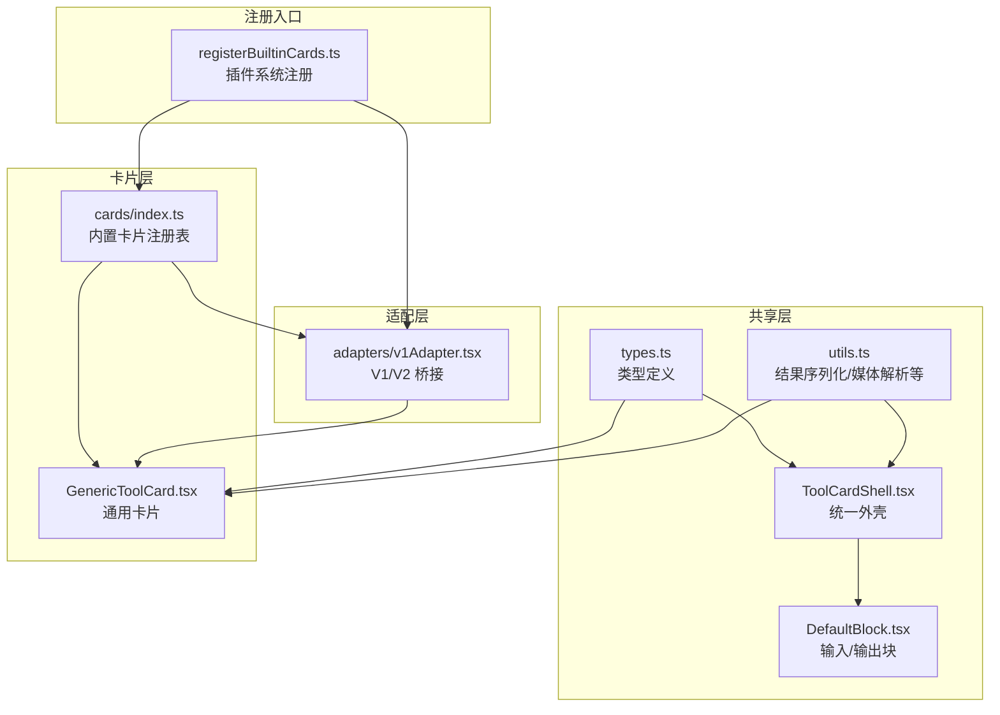
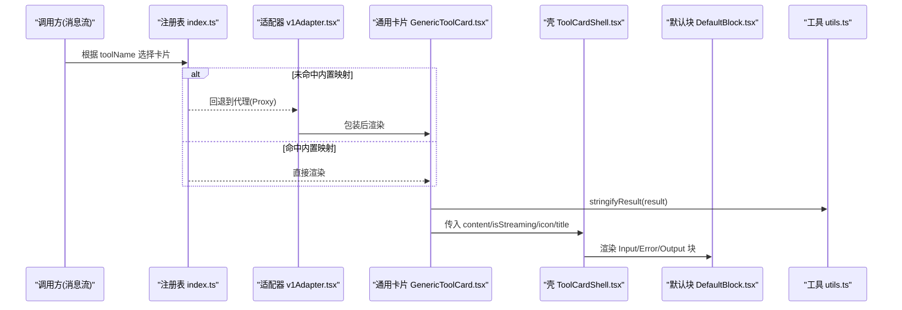
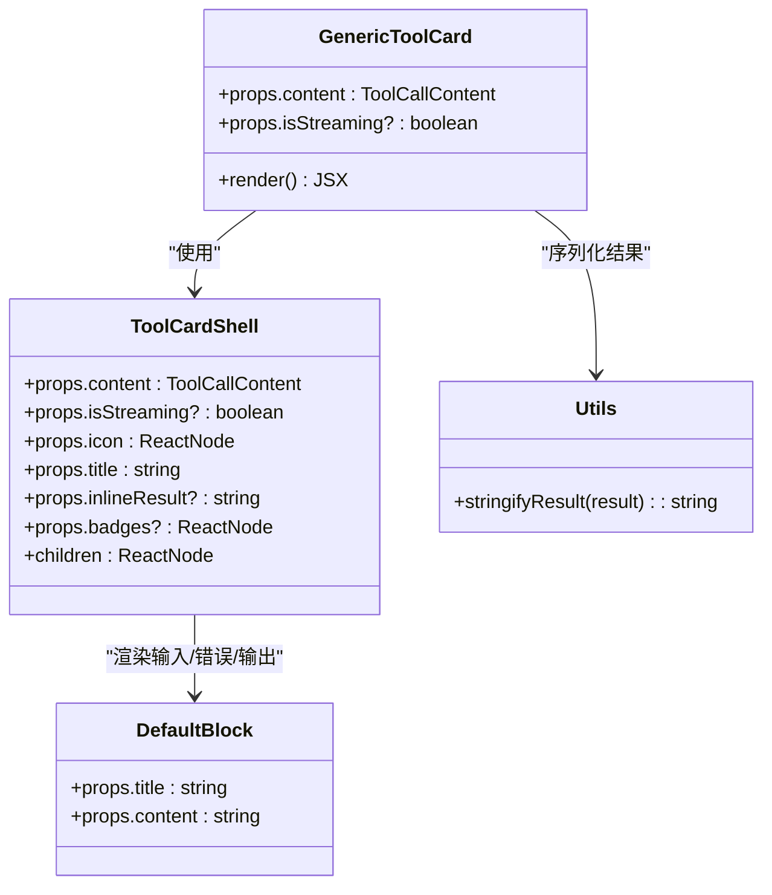
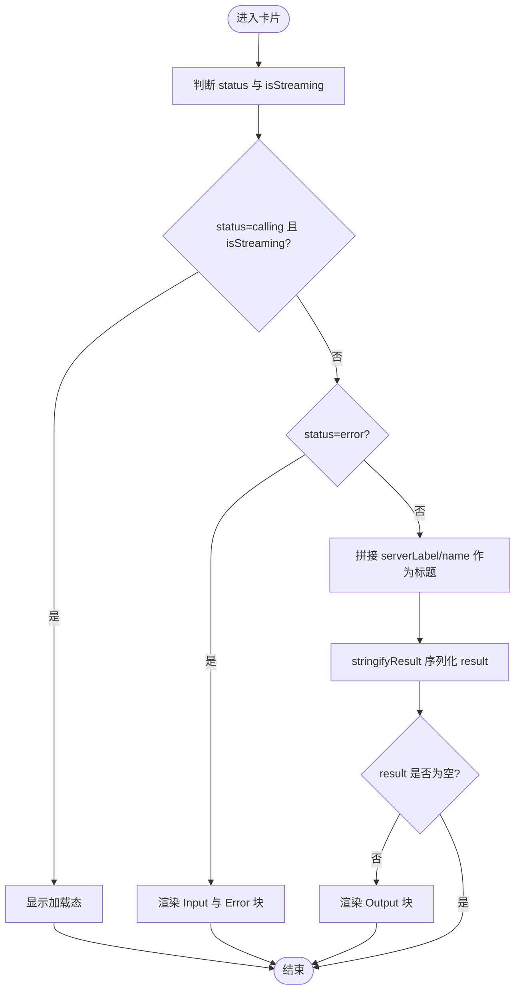
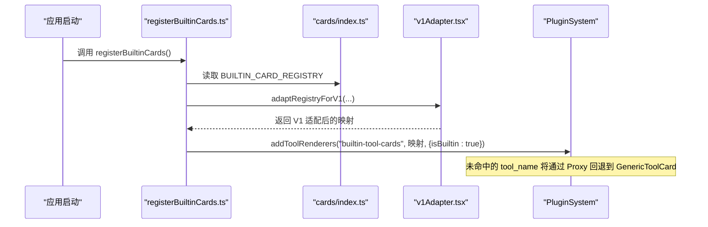
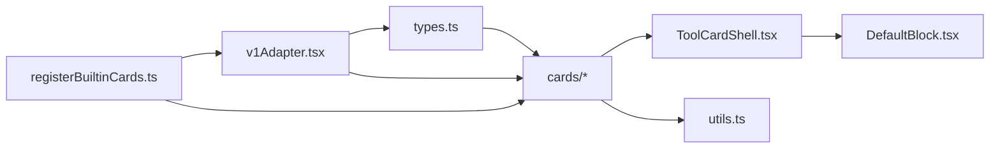

# 通用工具卡片

<cite>
**本文引用的文件列表**
- [GenericToolCard.tsx](file://console/src/components/Chat/ToolCards/cards/GenericToolCard.tsx)
- [index.ts（内置卡片注册表）](file://console/src/components/Chat/ToolCards/cards/index.ts)
- [registerBuiltinCards.ts](file://console/src/components/Chat/ToolCards/registerBuiltinCards.ts)
- [v1Adapter.tsx](file://console/src/components/Chat/ToolCards/adapters/v1Adapter.tsx)
- [types.ts](file://console/src/components/Chat/ToolCards/shared/types.ts)
- [ToolCardShell.tsx](file://console/src/components/Chat/ToolCards/shared/ToolCardShell.tsx)
- [DefaultBlock.tsx](file://console/src/components/Chat/ToolCards/shared/DefaultBlock.tsx)
- [utils.ts](file://console/src/components/Chat/ToolCards/shared/utils.ts)
</cite>

## 目录
1. [简介](#简介)
2. [项目结构](#项目结构)
3. [核心组件](#核心组件)
4. [架构总览](#架构总览)
5. [详细组件分析](#详细组件分析)
6. [依赖关系分析](#依赖关系分析)
7. [性能与渲染策略](#性能与渲染策略)
8. [故障排查指南](#故障排查指南)
9. [结论](#结论)
10. [附录：扩展开发指南](#附录扩展开发指南)

## 简介
本文件围绕 QwenPaw 前端“通用工具卡片”展开，聚焦 GenericToolCard 的抽象设计与扩展机制。文档将解释通用卡片的组件架构、参数映射与渲染策略，并给出基于通用卡片快速开发自定义工具卡片的实践路径，包括属性定义、事件绑定与样式定制示例。读者无需深入源码即可理解如何复用现有能力构建新的工具卡片。

## 项目结构
通用工具卡片位于聊天模块的 ToolCards 子系统中，采用“共享类型 + 壳组件 + 具体卡片 + 适配器 + 注册中心”的分层组织方式：
- shared：共享类型、通用 UI 壳、格式化与工具函数
- cards：具体卡片实现与统一导出/注册表
- adapters：适配 ChatV1 与 ChatV2 的差异
- registerBuiltinCards：应用启动时一次性注册所有内置卡片

图表来源
- [types.ts:1-29](file://console/src/components/Chat/ToolCards/shared/types.ts#L1-L29)
- [ToolCardShell.tsx:1-93](file://console/src/components/Chat/ToolCards/shared/ToolCardShell.tsx#L1-L93)
- [DefaultBlock.tsx:1-125](file://console/src/components/Chat/ToolCards/shared/DefaultBlock.tsx#L1-L125)
- [utils.ts:1-581](file://console/src/components/Chat/ToolCards/shared/utils.ts#L1-L581)
- [GenericToolCard.tsx:1-44](file://console/src/components/Chat/ToolCards/cards/GenericToolCard.tsx#L1-L44)
- [index.ts（内置卡片注册表）:1-134](file://console/src/components/Chat/ToolCards/cards/index.ts#L1-L134)
- [v1Adapter.tsx:1-209](file://console/src/components/Chat/ToolCards/adapters/v1Adapter.tsx#L1-L209)
- [registerBuiltinCards.ts:1-39](file://console/src/components/Chat/ToolCards/registerBuiltinCards.ts#L1-L39)

章节来源
- [GenericToolCard.tsx:1-44](file://console/src/components/Chat/ToolCards/cards/GenericToolCard.tsx#L1-L44)
- [index.ts（内置卡片注册表）:1-134](file://console/src/components/Chat/ToolCards/cards/index.ts#L1-L134)
- [registerBuiltinCards.ts:1-39](file://console/src/components/Chat/ToolCards/registerBuiltinCards.ts#L1-L39)
- [v1Adapter.tsx:1-209](file://console/src/components/Chat/ToolCards/adapters/v1Adapter.tsx#L1-L209)
- [types.ts:1-29](file://console/src/components/Chat/ToolCards/shared/types.ts#L1-L29)
- [ToolCardShell.tsx:1-93](file://console/src/components/Chat/ToolCards/shared/ToolCardShell.tsx#L1-L93)
- [DefaultBlock.tsx:1-125](file://console/src/components/Chat/ToolCards/shared/DefaultBlock.tsx#L1-L125)
- [utils.ts:1-581](file://console/src/components/Chat/ToolCards/shared/utils.ts#L1-L581)

## 核心组件
- 通用卡片 GenericToolCard
  - 职责：为未在内置注册表中显式注册的 tool_call 提供兜底展示；在调用中显示加载态，完成后以可折叠区块展示结果文本。
  - 关键行为：
    - 标题拼接 serverLabel/name，便于区分多服务同名工具
    - 使用 stringifyResult 安全地将 result 序列化为可读文本
    - 通过 ToolCardShell 统一外壳渲染，支持错误态、加载态、内联结果与徽章
    - 使用 DefaultBlock 展示 Output 内容，具备 Markdown/JSON/纯文本自动识别与复制功能

- 统一外壳 ToolCardShell
  - 职责：封装 details/summary 布局，处理 loading/error/done 状态，渲染图标、标签、内联结果与子区域
  - 错误态：自动展示 Input 与 Error 两个 DefaultBlock

- 通用数据块 DefaultBlock
  - 职责：带标题的可复制文本块，自动检测 Markdown/JSON/普通文本并分别渲染

- 工具函数 utils
  - stringifyResult：对 MCP content-blocks 数组或字符串进行智能提取与序列化
  - getMediaInfo/toDisplayUrl：媒体 URL 归一化与类型推断
  - formatMemorySearch/formatAgentList：结构化结果的 Markdown 格式化

章节来源
- [GenericToolCard.tsx:1-44](file://console/src/components/Chat/ToolCards/cards/GenericToolCard.tsx#L1-L44)
- [ToolCardShell.tsx:1-93](file://console/src/components/Chat/ToolCards/shared/ToolCardShell.tsx#L1-L93)
- [DefaultBlock.tsx:1-125](file://console/src/components/Chat/ToolCards/shared/DefaultBlock.tsx#L1-L125)
- [utils.ts:532-581](file://console/src/components/Chat/ToolCards/shared/utils.ts#L532-L581)

## 架构总览
通用卡片体系由“类型契约 → 壳组件 → 具体卡片 → 适配器 → 注册中心”构成，既服务于 ChatV2 的直接注册表查找，也兼容 ChatV1 的 customToolRenderConfig 模式。

图表来源
- [index.ts（内置卡片注册表）:76-134](file://console/src/components/Chat/ToolCards/cards/index.ts#L76-L134)
- [v1Adapter.tsx:169-209](file://console/src/components/Chat/ToolCards/adapters/v1Adapter.tsx#L169-L209)
- [GenericToolCard.tsx:21-41](file://console/src/components/Chat/ToolCards/cards/GenericToolCard.tsx#L21-L41)
- [ToolCardShell.tsx:32-90](file://console/src/components/Chat/ToolCards/shared/ToolCardShell.tsx#L32-L90)
- [DefaultBlock.tsx:51-122](file://console/src/components/Chat/ToolCards/shared/DefaultBlock.tsx#L51-L122)
- [utils.ts:558-580](file://console/src/components/Chat/ToolCards/shared/utils.ts#L558-L580)

## 详细组件分析

### 通用卡片 GenericToolCard
- 设计要点
  - 作为兜底卡片，确保任意 tool_name 都能被渲染，避免空白或崩溃
  - 标题优先使用 serverLabel/name，提升多后端场景下的可读性
  - 仅当存在 result 时才渲染 Output 块，减少无意义空白
- 交互与状态
  - isStreaming=true 且 status=calling 时，由 Shell 显示加载动画
  - status=error 时，Shell 自动展示 Input 与 Error 块
- 可扩展点
  - 可通过覆盖 title 生成逻辑、增加 badges、或在 children 中插入更多区块来增强展示

图表来源
- [GenericToolCard.tsx:16-41](file://console/src/components/Chat/ToolCards/cards/GenericToolCard.tsx#L16-L41)
- [ToolCardShell.tsx:15-30](file://console/src/components/Chat/ToolCards/shared/ToolCardShell.tsx#L15-L30)
- [DefaultBlock.tsx:19-23](file://console/src/components/Chat/ToolCards/shared/DefaultBlock.tsx#L19-L23)
- [utils.ts:558-580](file://console/src/components/Chat/ToolCards/shared/utils.ts#L558-L580)

章节来源
- [GenericToolCard.tsx:1-44](file://console/src/components/Chat/ToolCards/cards/GenericToolCard.tsx#L1-L44)
- [ToolCardShell.tsx:1-93](file://console/src/components/Chat/ToolCards/shared/ToolCardShell.tsx#L1-L93)
- [DefaultBlock.tsx:1-125](file://console/src/components/Chat/ToolCards/shared/DefaultBlock.tsx#L1-L125)
- [utils.ts:532-581](file://console/src/components/Chat/ToolCards/shared/utils.ts#L532-L581)

### 参数映射与渲染策略
- 参数来源
  - ChatV2：直接传递 content: ToolCallContent
  - ChatV1：通过 v1Adapter.parseV1Props 将 @agentscope-ai/chat 的数据结构转换为 ToolCallContent
- 状态推导
  - 优先读取工具执行层 state（如 error/interrupted/denied），否则回退到消息级 status
  - completed → done；failed/rejected/canceled → error；其余 → calling
- 渲染策略
  - 加载中：显示 spinner 与“加载中”文案
  - 成功：显示 icon 成功态、可选 badges 与 inlineResult
  - 失败：显示 Input 与 Error 两个 DefaultBlock

图表来源
- [v1Adapter.tsx:35-52](file://console/src/components/Chat/ToolCards/adapters/v1Adapter.tsx#L35-L52)
- [ToolCardShell.tsx:42-88](file://console/src/components/Chat/ToolCards/shared/ToolCardShell.tsx#L42-L88)
- [GenericToolCard.tsx:26-39](file://console/src/components/Chat/ToolCards/cards/GenericToolCard.tsx#L26-L39)
- [utils.ts:558-580](file://console/src/components/Chat/ToolCards/shared/utils.ts#L558-L580)

章节来源
- [v1Adapter.tsx:1-209](file://console/src/components/Chat/ToolCards/adapters/v1Adapter.tsx#L1-L209)
- [ToolCardShell.tsx:1-93](file://console/src/components/Chat/ToolCards/shared/ToolCardShell.tsx#L1-L93)
- [GenericToolCard.tsx:1-44](file://console/src/components/Chat/ToolCards/cards/GenericToolCard.tsx#L1-L44)
- [utils.ts:532-581](file://console/src/components/Chat/ToolCards/shared/utils.ts#L532-L581)

### 注册与回退机制
- 注册表 BUILTIN_CARD_REGISTRY
  - 将 tool_name 映射到具体卡片组件
  - 包含文件 I/O、搜索、媒体、浏览器、时间、Token 用量、记忆检索、Agent 管理、技能、Shell 等类别
- 注册入口 registerBuiltinCards
  - 将内置卡片适配为 V1 格式并通过 pluginSystem.addToolRenderers 注入
- 回退代理 withGenericFallback
  - 对未显式注册的 tool_name 返回 GenericToolCard 的 V1 包装版本，保证任何未知工具均可渲染

图表来源
- [registerBuiltinCards.ts:26-38](file://console/src/components/Chat/ToolCards/registerBuiltinCards.ts#L26-L38)
- [index.ts（内置卡片注册表）:76-134](file://console/src/components/Chat/ToolCards/cards/index.ts#L76-L134)
- [v1Adapter.tsx:169-209](file://console/src/components/Chat/ToolCards/adapters/v1Adapter.tsx#L169-L209)

章节来源
- [registerBuiltinCards.ts:1-39](file://console/src/components/Chat/ToolCards/registerBuiltinCards.ts#L1-L39)
- [index.ts（内置卡片注册表）:1-134](file://console/src/components/Chat/ToolCards/cards/index.ts#L1-L134)
- [v1Adapter.tsx:169-209](file://console/src/components/Chat/ToolCards/adapters/v1Adapter.tsx#L169-L209)

## 依赖关系分析
- 类型契约
  - ToolCallContent 定义了 type/id/name/serverLabel/params/result/status 字段，是所有卡片与适配器的共同契约
- 组件耦合
  - GenericToolCard 强依赖 ToolCardShell 与 DefaultBlock，弱依赖 utils.stringifyResult
  - ToolCardShell 依赖 DefaultBlock 与样式模块
  - v1Adapter 依赖 types 与 GenericToolCard，负责将 V1 数据结构转为 ToolCallContent
- 外部集成
  - registerBuiltinCards 通过 pluginSystem 暴露给 ChatV1/V2 生态

图表来源
- [types.ts:1-29](file://console/src/components/Chat/ToolCards/shared/types.ts#L1-L29)
- [ToolCardShell.tsx:1-93](file://console/src/components/Chat/ToolCards/shared/ToolCardShell.tsx#L1-L93)
- [DefaultBlock.tsx:1-125](file://console/src/components/Chat/ToolCards/shared/DefaultBlock.tsx#L1-L125)
- [utils.ts:1-581](file://console/src/components/Chat/ToolCards/shared/utils.ts#L1-L581)
- [v1Adapter.tsx:1-209](file://console/src/components/Chat/ToolCards/adapters/v1Adapter.tsx#L1-L209)
- [registerBuiltinCards.ts:1-39](file://console/src/components/Chat/ToolCards/registerBuiltinCards.ts#L1-L39)

章节来源
- [types.ts:1-29](file://console/src/components/Chat/ToolCards/shared/types.ts#L1-L29)
- [v1Adapter.tsx:1-209](file://console/src/components/Chat/ToolCards/adapters/v1Adapter.tsx#L1-L209)
- [registerBuiltinCards.ts:1-39](file://console/src/components/Chat/ToolCards/registerBuiltinCards.ts#L1-L39)

## 性能与渲染策略
- 渲染优化
  - 仅在 result 非空时渲染 Output 块，避免不必要的 DOM 节点
  - 使用统一的 Shell 控制 loading/error 状态，减少重复条件分支
- 序列化成本
  - stringifyResult 会尝试解析 JSON/MCP 数组，建议后端尽量返回结构化结果以减少前端解析开销
- 媒体资源
  - toDisplayUrl 会将相对路径转换为预览地址，注意网络请求与缓存策略

[本节为通用指导，不直接分析具体文件]

## 故障排查指南
- 现象：未知工具名无法渲染
  - 检查是否已调用 registerBuiltinCards 完成注册
  - 确认 v1Adapter.withGenericFallback 是否生效（用于 ChatV1 的 Proxy 回退）
- 现象：结果内容为空
  - 检查 ToolCallContent.result 是否存在
  - 若结果为 MCP content-blocks 数组，确认 stringifyResult 能正确提取 text
- 现象：错误信息未展示
  - 确认 status 是否为 error，或 V1 的 tool-execution-layer state 是否落入 error 集合
- 现象：链接不可用
  - 检查 toDisplayUrl 转换是否正确，尤其是 file:// 前缀与相对路径

章节来源
- [v1Adapter.tsx:35-52](file://console/src/components/Chat/ToolCards/adapters/v1Adapter.tsx#L35-L52)
- [utils.ts:14-21](file://console/src/components/Chat/ToolCards/shared/utils.ts#L14-L21)
- [GenericToolCard.tsx:26-39](file://console/src/components/Chat/ToolCards/cards/GenericToolCard.tsx#L26-L39)
- [ToolCardShell.tsx:74-87](file://console/src/components/Chat/ToolCards/shared/ToolCardShell.tsx#L74-L87)

## 结论
GenericToolCard 提供了稳定可靠的兜底渲染能力，配合 ToolCardShell 的统一外壳与 DefaultBlock 的内容呈现，形成一套高内聚、低耦合的工具卡片体系。借助 v1Adapter 的桥接与注册中心的集中管理，开发者可以以最小成本扩展新的工具卡片，并在 ChatV1/V2 双环境中保持一致体验。

[本节为总结性内容，不直接分析具体文件]

## 附录：扩展开发指南

### 快速上手：新增一个自定义工具卡片
- 步骤概览
  1) 新建卡片组件，遵循 ToolCardShell 的使用约定
  2) 在 cards/index.ts 中将 tool_name 映射到新组件
  3) 如需兼容 ChatV1，确保 registerBuiltinCards 已被调用（内部已完成适配）
- 参考路径
  - 新卡片模板位置：console/src/components/Chat/ToolCards/cards/YourCard.tsx
  - 注册表位置：console/src/components/Chat/ToolCards/cards/index.ts
  - 注册入口：console/src/components/Chat/ToolCards/registerBuiltinCards.ts

章节来源
- [index.ts（内置卡片注册表）:76-134](file://console/src/components/Chat/ToolCards/cards/index.ts#L76-L134)
- [registerBuiltinCards.ts:26-38](file://console/src/components/Chat/ToolCards/registerBuiltinCards.ts#L26-L38)

### 属性定义与数据契约
- 输入 props
  - content: ToolCallContent（name、serverLabel、params、result、status）
  - isStreaming?: boolean
- 推荐做法
  - 从 content.params 读取业务参数
  - 从 content.result 读取执行结果，必要时使用 stringifyResult 或专用格式化函数
  - 根据 content.status 与 isStreaming 决定加载/错误/成功态

章节来源
- [types.ts:9-17](file://console/src/components/Chat/ToolCards/shared/types.ts#L9-L17)
- [GenericToolCard.tsx:16-24](file://console/src/components/Chat/ToolCards/cards/GenericToolCard.tsx#L16-L24)
- [utils.ts:558-580](file://console/src/components/Chat/ToolCards/shared/utils.ts#L558-L580)

### 事件绑定与交互
- 建议在 children 中使用 DefaultBlock 或自定义按钮
- 如需触发外部动作（打开链接、下载文件），可在按钮 onClick 中调用宿主 API 或 window.open
- 参考路径
  - 默认块与复制：console/src/components/Chat/ToolCards/shared/DefaultBlock.tsx
  - 媒体预览与 URL 转换：console/src/components/Chat/ToolCards/shared/utils.ts

章节来源
- [DefaultBlock.tsx:64-73](file://console/src/components/Chat/ToolCards/shared/DefaultBlock.tsx#L64-L73)
- [utils.ts:14-21](file://console/src/components/Chat/ToolCards/shared/utils.ts#L14-L21)

### 样式定制
- 使用 ToolCardShell 提供的 CSS 类名进行主题覆盖
- 需要更细粒度控制时，可在卡片组件内引入独立样式文件或 CSS Modules
- 参考路径
  - 壳组件样式类：console/src/components/Chat/ToolCards/shared/toolCards.module.less
  - 默认块样式类：同上

章节来源
- [ToolCardShell.tsx:46-73](file://console/src/components/Chat/ToolCards/shared/ToolCardShell.tsx#L46-L73)

### 实际使用场景示例（代码片段路径）
- 通用卡片基础用法（兜底渲染）
  - 路径：[GenericToolCard.tsx:21-41](file://console/src/components/Chat/ToolCards/cards/GenericToolCard.tsx#L21-L41)
- 使用 ToolCardShell 包裹自定义卡片
  - 参考同类卡片：[MemorySearchCard.tsx:56-66](file://console/src/components/Chat/ToolCards/cards/MemorySearchCard.tsx#L56-L66)
- 注册新卡片到内置注册表
  - 路径：[index.ts（内置卡片注册表）:76-134](file://console/src/components/Chat/ToolCards/cards/index.ts#L76-L134)
- 在 ChatV1 环境下自动回退到通用卡片
  - 路径：[v1Adapter.tsx:196-209](file://console/src/components/Chat/ToolCards/adapters/v1Adapter.tsx#L196-L209)

[本节为示例指引，不直接粘贴代码]