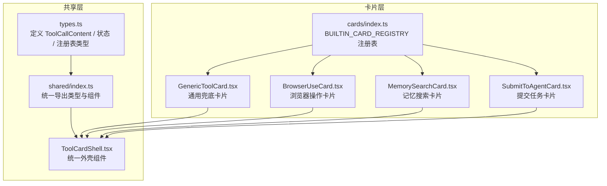
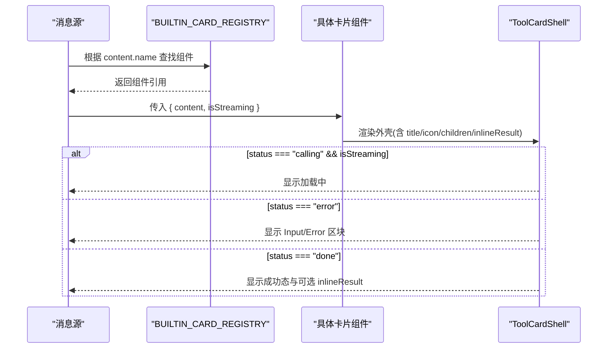
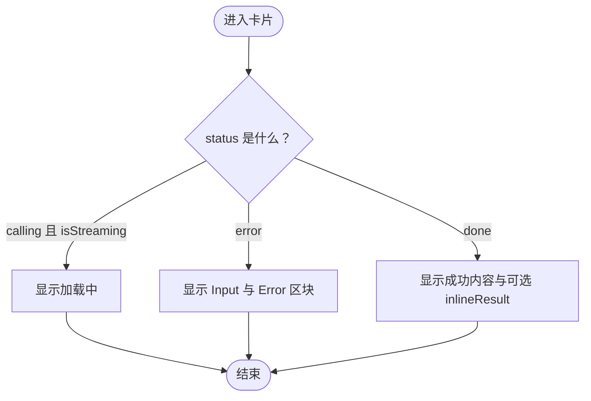
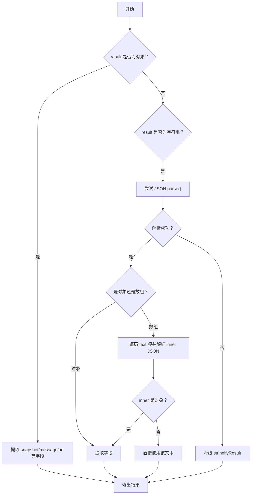
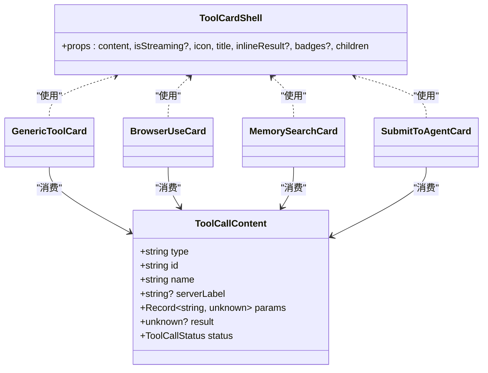

# 卡片类型定义

<cite>
**本文引用的文件**   
- [console/src/components/Chat/ToolCards/shared/types.ts](file://console/src/components/Chat/ToolCards/shared/types.ts)
- [console/src/components/Chat/ToolCards/shared/index.ts](file://console/src/components/Chat/ToolCards/shared/index.ts)
- [console/src/components/Chat/ToolCards/shared/ToolCardShell.tsx](file://console/src/components/Chat/ToolCards/shared/ToolCardShell.tsx)
- [console/src/components/Chat/ToolCards/cards/index.ts](file://console/src/components/Chat/ToolCards/cards/index.ts)
- [console/src/components/Chat/ToolCards/cards/GenericToolCard.tsx](file://console/src/components/Chat/ToolCards/cards/GenericToolCard.tsx)
- [console/src/components/Chat/ToolCards/cards/BrowserUseCard.tsx](file://console/src/components/Chat/ToolCards/cards/BrowserUseCard.tsx)
- [console/src/components/Chat/ToolCards/cards/MemorySearchCard.tsx](file://console/src/components/Chat/ToolCards/cards/MemorySearchCard.tsx)
- [console/src/components/Chat/ToolCards/cards/SubmitToAgentCard.tsx](file://console/src/components/Chat/ToolCards/cards/SubmitToAgentCard.tsx)
</cite>

## 目录
1. [简介](#简介)
2. [项目结构](#项目结构)
3. [核心组件](#核心组件)
4. [架构总览](#架构总览)
5. [详细组件分析](#详细组件分析)
6. [依赖关系分析](#依赖关系分析)
7. [性能考虑](#性能考虑)
8. [故障排查指南](#故障排查指南)
9. [结论](#结论)
10. [附录](#附录)

## 简介
本文件聚焦于 QwenPaw 工具卡片的类型定义系统，围绕 ToolCallContent 接口、卡片属性与数据结构规范展开。文档将解释：
- 统一的数据契约：ToolCallContent 字段含义、状态机与约束
- 卡片注册机制：内置卡片映射与扩展方式
- 渲染外壳：ToolCardShell 的状态展示与错误处理
- 流式数据与结果展示：isStreaming 语义与 inlineResult 用法
- 复杂数据处理：以浏览器卡片为例的解析策略
- 新增卡片类型的最佳实践与类型安全使用模式

## 项目结构
工具卡片相关代码位于 console 前端工程内，采用“共享类型 + 通用外壳 + 具体卡片 + 注册表”的分层组织方式：
- shared/types.ts：定义 ToolCallContent、ToolCallStatus、卡片 Props 与注册表类型
- shared/index.ts：统一导出类型与通用组件（如 ToolCardShell）
- cards/index.ts：内置卡片组件的集中注册表 BUILTIN_CARD_REGISTRY
- cards/*.tsx：各业务卡片的具体实现（例如 BrowserUseCard、MemorySearchCard、GenericToolCard 等）
- shared/ToolCardShell.tsx：统一的卡片外壳，负责加载态、成功态、错误态与可折叠内容区

图表来源
- [console/src/components/Chat/ToolCards/shared/types.ts:1-29](file://console/src/components/Chat/ToolCards/shared/types.ts#L1-L29)
- [console/src/components/Chat/ToolCards/shared/index.ts:1-28](file://console/src/components/Chat/ToolCards/shared/index.ts#L1-L28)
- [console/src/components/Chat/ToolCards/shared/ToolCardShell.tsx:1-93](file://console/src/components/Chat/ToolCards/shared/ToolCardShell.tsx#L1-L93)
- [console/src/components/Chat/ToolCards/cards/index.ts:1-135](file://console/src/components/Chat/ToolCards/cards/index.ts#L1-L135)
- [console/src/components/Chat/ToolCards/cards/GenericToolCard.tsx:1-44](file://console/src/components/Chat/ToolCards/cards/GenericToolCard.tsx#L1-L44)
- [console/src/components/Chat/ToolCards/cards/BrowserUseCard.tsx:1-288](file://console/src/components/Chat/ToolCards/cards/BrowserUseCard.tsx#L1-L288)
- [console/src/components/Chat/ToolCards/cards/MemorySearchCard.tsx:1-69](file://console/src/components/Chat/ToolCards/cards/MemorySearchCard.tsx#L1-L69)
- [console/src/components/Chat/ToolCards/cards/SubmitToAgentCard.tsx:1-49](file://console/src/components/Chat/ToolCards/cards/SubmitToAgentCard.tsx#L1-L49)

章节来源
- [console/src/components/Chat/ToolCards/shared/types.ts:1-29](file://console/src/components/Chat/ToolCards/shared/types.ts#L1-L29)
- [console/src/components/Chat/ToolCards/shared/index.ts:1-28](file://console/src/components/Chat/ToolCards/shared/index.ts#L1-L28)
- [console/src/components/Chat/ToolCards/cards/index.ts:1-135](file://console/src/components/Chat/ToolCards/cards/index.ts#L1-L135)

## 核心组件
本节对关键类型与组件进行说明，帮助读者理解卡片系统的契约与职责边界。

- ToolCallContent
  - type: 固定为 "tool_call"，用于区分消息块类型
  - id: 调用唯一标识
  - name: 工具名称（字符串），用于路由到对应卡片
  - serverLabel: 可选的服务端标签，便于在通用卡片中显示更友好的名称
  - params: 参数对象，键值均为 unknown；卡片内部按业务约定访问字段
  - result: 可选的结果对象或字符串；完成时填充
  - status: 枚举状态 "calling" | "done" | "error"，驱动外壳组件的 UI 分支

- ToolCallStatus
  - 三种状态分别表示：调用中、已完成、出错

- 卡片 Props 与注册表类型
  - ToolCardProps<T>: 插件体系使用的通用卡片属性（data/status/toolName）
  - ToolCardComponent: React.FC<ToolCardProps<any>>
  - ToolCardRegistry: Record<string, ToolCardComponent>
  - BuiltinCardProps: 内置卡片统一 props（content/isStreaming）
  - BUILTIN_CARD_REGISTRY: 工具名到组件的映射表

- ToolCardShell
  - 统一外壳组件，根据 content.status 与 isStreaming 决定：
    - 加载中：显示 spinner 与“加载中”文案
    - 成功：显示图标、标题、可选 badges 与 inlineResult
    - 错误：显示 Input 与 Error 两个默认区块
  - 支持 children 作为可折叠区域的内容

章节来源
- [console/src/components/Chat/ToolCards/shared/types.ts:1-29](file://console/src/components/Chat/ToolCards/shared/types.ts#L1-L29)
- [console/src/components/Chat/ToolCards/shared/ToolCardShell.tsx:1-93](file://console/src/components/Chat/ToolCards/shared/ToolCardShell.tsx#L1-L93)

## 架构总览
下图展示了从“工具名”到“具体卡片渲染”的完整链路，以及状态流转与错误处理路径。

图表来源
- [console/src/components/Chat/ToolCards/cards/index.ts:76-135](file://console/src/components/Chat/ToolCards/cards/index.ts#L76-L135)
- [console/src/components/Chat/ToolCards/shared/ToolCardShell.tsx:32-93](file://console/src/components/Chat/ToolCards/shared/ToolCardShell.tsx#L32-L93)

## 详细组件分析

### ToolCallContent 接口设计
- 字段语义
  - type: 固定为 "tool_call"，用于消息块类型判别
  - id/name: 唯一标识与工具名，name 用于路由到具体卡片
  - serverLabel: 服务端侧的友好标签，可在通用卡片中优先展示
  - params: 参数集合，卡片内部按业务约定读取字段（注意 unknown 类型需做断言/校验）
  - result: 执行结果，可能为字符串或结构化对象
  - status: 驱动 UI 的关键状态

- 验证规则与类型约束
  - type 必须为 "tool_call"
  - status 必须为 "calling" | "done" | "error"
  - name 非空字符串
  - params/result 可为任意 JSON 可序列化结构，但建议遵循卡片约定的字段命名

- 复杂度与性能
  - 该结构为轻量消息载体，时间/空间复杂度近似 O(1)
  - 大结果建议在 result 中仅保留摘要，详情通过链接或分页获取

章节来源
- [console/src/components/Chat/ToolCards/shared/types.ts:9-17](file://console/src/components/Chat/ToolCards/shared/types.ts#L9-L17)

### 卡片属性定义与数据结构规范
- 内置卡片统一 Props
  - content: ToolCallContent
  - isStreaming?: boolean，指示父消息是否仍在流式推送

- 注册表规范
  - BUILTIN_CARD_REGISTRY: 键为工具名，值为接收 BuiltinCardProps 的 React 组件
  - 新增卡片需在注册表中添加映射，确保 name 与后端一致

- 插件体系兼容
  - ToolCardProps/ToolCardComponent/ToolCardRegistry 用于插件生态，保持向后兼容

章节来源
- [console/src/components/Chat/ToolCards/cards/index.ts:67-75](file://console/src/components/Chat/ToolCards/cards/index.ts#L67-L75)
- [console/src/components/Chat/ToolCards/shared/types.ts:19-29](file://console/src/components/Chat/ToolCards/shared/types.ts#L19-L29)

### 状态管理、流式数据处理与错误处理
- 状态机
  - calling → done：正常完成
  - calling → error：异常中断
  - done/error 不再回退到 calling

- 流式处理
  - isStreaming 为 true 且 status 为 calling 时，外壳显示加载动画
  - 当收到最终结果后，status 切换为 done，并展示 inlineResult 或 children

- 错误处理
  - 错误状态下，外壳自动展示 Input 与 Error 区块，便于调试
  - 卡片内部可对 result 做二次格式化（如正则提取、JSON 解析）

图表来源
- [console/src/components/Chat/ToolCards/shared/ToolCardShell.tsx:32-93](file://console/src/components/Chat/ToolCards/shared/ToolCardShell.tsx#L32-L93)

章节来源
- [console/src/components/Chat/ToolCards/shared/ToolCardShell.tsx:32-93](file://console/src/components/Chat/ToolCards/shared/ToolCardShell.tsx#L32-L93)

### 具体卡片示例与最佳实践

#### 通用兜底卡片 GenericToolCard
- 用途：未注册到内置映射的工具名，仍能以通用形式展示
- 行为：
  - 优先使用 serverLabel/name 组合显示标题
  - 若存在 result，则以 DefaultBlock 输出
- 适用场景：快速接入新工具，无需定制卡片

章节来源
- [console/src/components/Chat/ToolCards/cards/GenericToolCard.tsx:1-44](file://console/src/components/Chat/ToolCards/cards/GenericToolCard.tsx#L1-L44)

#### 浏览器操作卡片 BrowserUseCard
- 特点：
  - 针对多种浏览器工具名复用同一卡片
  - 智能解析 result：支持对象、字符串 JSON、MCP 文本块包裹 JSON 等多种形态
  - 标题生成：根据 action 与参数动态构造人类可读描述
- 复杂数据处理流程（简化版）：
  - 若 result 是对象：尝试提取 snapshot/message/url 等字段
  - 若 result 是字符串：尝试 JSON 解析，再走对象提取逻辑
  - 若 result 是数组：遍历 text 项，尝试解析 inner JSON 再提取
  - 否则降级为 stringifyResult

图表来源
- [console/src/components/Chat/ToolCards/cards/BrowserUseCard.tsx:18-88](file://console/src/components/Chat/ToolCards/cards/BrowserUseCard.tsx#L18-L88)

章节来源
- [console/src/components/Chat/ToolCards/cards/BrowserUseCard.tsx:1-288](file://console/src/components/Chat/ToolCards/cards/BrowserUseCard.tsx#L1-288)

#### 记忆搜索卡片 MemorySearchCard
- 行为：
  - 从 params 中提取 query/limit/min_score 等字段，构建标题元信息
  - 错误态直接显示外壳
  - 成功态对 result 进行格式化输出

章节来源
- [console/src/components/Chat/ToolCards/cards/MemorySearchCard.tsx:1-69](file://console/src/components/Chat/ToolCards/cards/MemorySearchCard.tsx#L1-L69)

#### 提交任务卡片 SubmitToAgentCard
- 行为：
  - 从 params 提取 to_agent/text，截短显示
  - 成功态下尝试从 result 匹配 TASK_ID，并在 inlineResult 中展示

章节来源
- [console/src/components/Chat/ToolCards/cards/SubmitToAgentCard.tsx:1-49](file://console/src/components/Chat/ToolCards/cards/SubmitToAgentCard.tsx#L1-L49)

### 如何定义新的卡片类型
步骤建议：
1. 新建卡片组件，接收 content: ToolCallContent 与 isStreaming?: boolean
2. 在 cards/index.ts 的 BUILTIN_CARD_REGISTRY 中添加 name → 组件映射
3. 如需对外暴露类型，可在 shared/types.ts 中补充专用 Props 类型（可选）
4. 在卡片内部对 params/result 做必要的安全断言与格式化
5. 使用 ToolCardShell 统一外壳，保证状态一致性

章节来源
- [console/src/components/Chat/ToolCards/cards/index.ts:76-135](file://console/src/components/Chat/ToolCards/cards/index.ts#L76-L135)
- [console/src/components/Chat/ToolCards/shared/types.ts:19-29](file://console/src/components/Chat/ToolCards/shared/types.ts#L19-L29)

### 扩展现有类型与处理复杂数据结构
- 扩展点
  - ToolCallContent.params/result 使用 unknown，允许承载任意 JSON 结构
  - 卡片内部可按业务约定进行类型收窄与校验
- 复杂数据建议
  - 尽量在 result 中只携带摘要，详情通过 URL 或分页拉取
  - 对大对象进行压缩/裁剪，避免 UI 卡顿
  - 对字符串型 JSON 进行 try/catch 解析，失败则降级为纯文本

章节来源
- [console/src/components/Chat/ToolCards/shared/types.ts:9-17](file://console/src/components/Chat/ToolCards/shared/types.ts#L9-L17)
- [console/src/components/Chat/ToolCards/cards/BrowserUseCard.tsx:36-88](file://console/src/components/Chat/ToolCards/cards/BrowserUseCard.tsx#L36-L88)

## 依赖关系分析
- 类型依赖
  - 所有卡片均依赖 shared/types.ts 中的 ToolCallContent 与状态类型
  - 卡片统一通过 shared/index.ts 导出类型与组件，降低耦合
- 组件依赖
  - 具体卡片依赖 ToolCardShell 提供统一外壳
  - 注册表集中维护 name → 组件映射，解耦消息分发与渲染

图表来源
- [console/src/components/Chat/ToolCards/shared/types.ts:9-17](file://console/src/components/Chat/ToolCards/shared/types.ts#L9-L17)
- [console/src/components/Chat/ToolCards/shared/ToolCardShell.tsx:15-30](file://console/src/components/Chat/ToolCards/shared/ToolCardShell.tsx#L15-L30)
- [console/src/components/Chat/ToolCards/cards/GenericToolCard.tsx:16-19](file://console/src/components/Chat/ToolCards/cards/GenericToolCard.tsx#L16-L19)
- [console/src/components/Chat/ToolCards/cards/BrowserUseCard.tsx:250-253](file://console/src/components/Chat/ToolCards/cards/BrowserUseCard.tsx#L250-L253)
- [console/src/components/Chat/ToolCards/cards/MemorySearchCard.tsx:8-11](file://console/src/components/Chat/ToolCards/cards/MemorySearchCard.tsx#L8-L11)
- [console/src/components/Chat/ToolCards/cards/SubmitToAgentCard.tsx:7-10](file://console/src/components/Chat/ToolCards/cards/SubmitToAgentCard.tsx#L7-L10)

章节来源
- [console/src/components/Chat/ToolCards/shared/types.ts:1-29](file://console/src/components/Chat/ToolCards/shared/types.ts#L1-L29)
- [console/src/components/Chat/ToolCards/shared/index.ts:1-28](file://console/src/components/Chat/ToolCards/shared/index.ts#L1-L28)
- [console/src/components/Chat/ToolCards/cards/index.ts:1-135](file://console/src/components/Chat/ToolCards/cards/index.ts#L1-L135)

## 性能考虑
- 避免在 result 中传递超大对象，必要时拆分或延迟加载
- 对字符串 JSON 的解析应包裹 try/catch，防止阻塞渲染
- 列表/长文本展示建议使用虚拟滚动或分页
- 流式更新时，尽量减少重渲染范围，利用 React 的 key 与 memo 优化

[本节为通用指导，不直接分析具体文件]

## 故障排查指南
- 常见问题
  - 卡片未渲染：检查 BUILTIN_CARD_REGISTRY 是否包含对应 name
  - 参数缺失：确认 params 字段命名与卡片期望一致
  - 结果格式异常：查看 result 是否为字符串 JSON，必要时增加解析与降级逻辑
  - 错误态无提示：确认 status 是否正确设置为 "error"，外壳会自动展示 Input/Error 区块

- 定位方法
  - 打开浏览器控制台，查看 ToolCallContent 的完整快照
  - 在卡片内部打印 params/result 的原始值，辅助判断格式问题
  - 对比其他已实现的卡片（如 MemorySearchCard、BrowserUseCard）的处理逻辑

章节来源
- [console/src/components/Chat/ToolCards/shared/ToolCardShell.tsx:74-87](file://console/src/components/Chat/ToolCards/shared/ToolCardShell.tsx#L74-L87)
- [console/src/components/Chat/ToolCards/cards/BrowserUseCard.tsx:36-88](file://console/src/components/Chat/ToolCards/cards/BrowserUseCard.tsx#L36-L88)

## 结论
QwenPaw 的工具卡片类型系统以 ToolCallContent 为核心契约，配合统一外壳与集中注册表，实现了高内聚、低耦合的可插拔渲染方案。通过明确的状态机与错误处理路径，结合对复杂数据的健壮解析策略，开发者可以快速扩展新的卡片类型并保持类型安全与用户体验的一致性。

[本节为总结性内容，不直接分析具体文件]

## 附录
- 新增卡片清单模板
  - 在 cards/index.ts 中新增 name → 组件映射
  - 在卡片组件中严格使用 ToolCallContent 字段，并对 params/result 做断言
  - 使用 ToolCardShell 统一外壳，确保状态与错误展示一致
  - 如有需要，在 shared/types.ts 中补充专用 Props 类型

章节来源
- [console/src/components/Chat/ToolCards/cards/index.ts:76-135](file://console/src/components/Chat/ToolCards/cards/index.ts#L76-L135)
- [console/src/components/Chat/ToolCards/shared/types.ts:19-29](file://console/src/components/Chat/ToolCards/shared/types.ts#L19-L29)