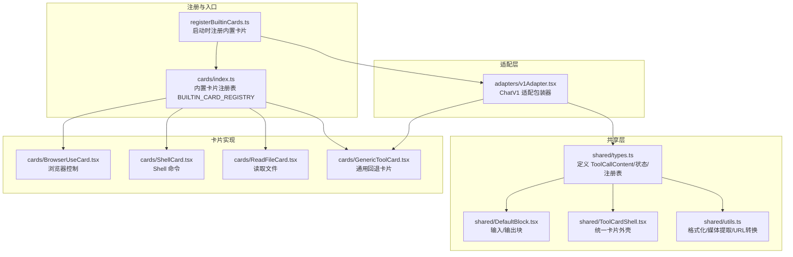
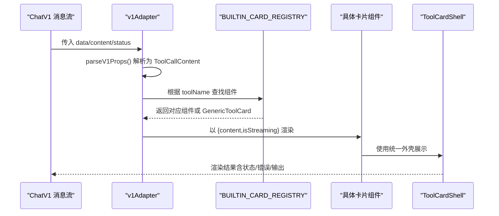
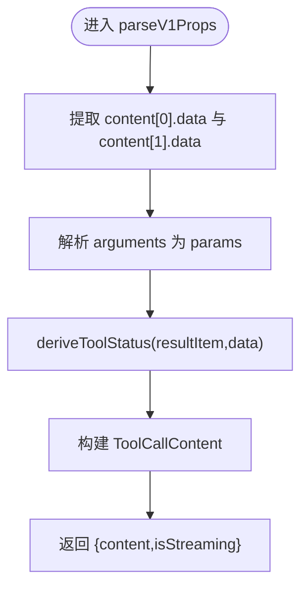
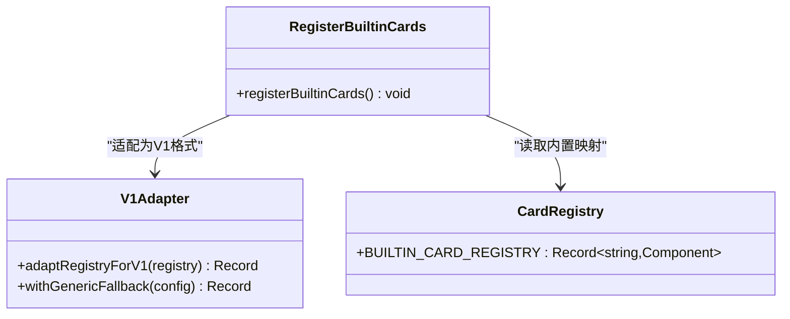
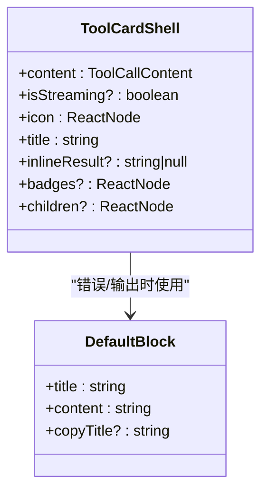
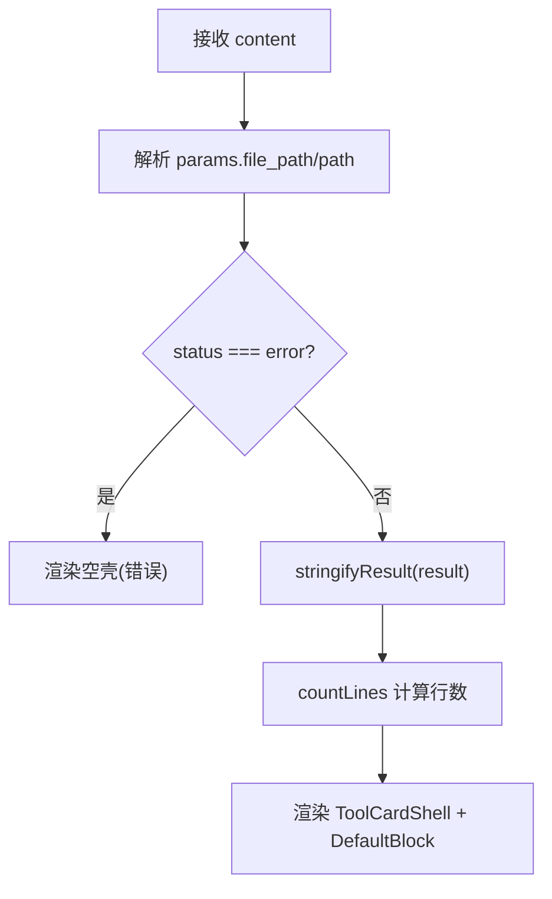
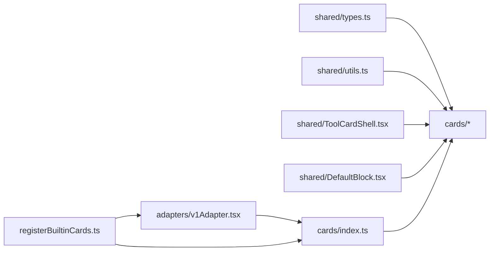

# 工具卡片系统

<cite>
**本文引用的文件**
- [registerBuiltinCards.ts](file://console/src/components/Chat/ToolCards/registerBuiltinCards.ts)
- [v1Adapter.tsx](file://console/src/components/Chat/ToolCards/adapters/v1Adapter.tsx)
- [cards/index.ts](file://console/src/components/Chat/ToolCards/cards/index.ts)
- [GenericToolCard.tsx](file://console/src/components/Chat/ToolCards/cards/GenericToolCard.tsx)
- [ReadFileCard.tsx](file://console/src/components/Chat/ToolCards/cards/ReadFileCard.tsx)
- [ShellCard.tsx](file://console/src/components/Chat/ToolCards/cards/ShellCard.tsx)
- [BrowserUseCard.tsx](file://console/src/components/Chat/ToolCards/cards/BrowserUseCard.tsx)
- [shared/types.ts](file://console/src/components/Chat/ToolCards/shared/types.ts)
- [shared/utils.ts](file://console/src/components/Chat/ToolCards/shared/utils.ts)
- [shared/ToolCardShell.tsx](file://console/src/components/Chat/ToolCards/shared/ToolCardShell.tsx)
- [shared/DefaultBlock.tsx](file://console/src/components/Chat/ToolCards/shared/DefaultBlock.tsx)
</cite>

## 目录
1. [简介](#简介)
2. [项目结构](#项目结构)
3. [核心组件](#核心组件)
4. [架构总览](#架构总览)
5. [详细组件分析](#详细组件分析)
6. [依赖关系分析](#依赖关系分析)
7. [性能考量](#性能考量)
8. [故障排查指南](#故障排查指南)
9. [结论](#结论)
10. [附录](#附录)

## 简介
本文件系统性梳理 QwenPaw 聊天界面“工具卡片”系统的架构与实现，覆盖以下关键主题：
- 卡片注册系统与适配器模式（兼容 ChatV1 与 ChatV2）
- 动态加载机制与通用回退渲染
- 内置卡片类型（文件操作、浏览器控制、Shell 执行等）
- 卡片状态管理、数据绑定与事件通信
- 生命周期管理与错误处理
- 自定义卡片开发指南与扩展实践
- 常见问题与优化建议

## 项目结构
工具卡片系统位于前端控制台模块中，采用“共享类型 + 适配器 + 注册表 + 具体卡片 + 通用外壳”的分层组织方式。

图表来源
- [registerBuiltinCards.ts:1-39](file://console/src/components/Chat/ToolCards/registerBuiltinCards.ts#L1-L39)
- [v1Adapter.tsx:1-209](file://console/src/components/Chat/ToolCards/adapters/v1Adapter.tsx#L1-L209)
- [cards/index.ts:1-135](file://console/src/components/Chat/ToolCards/cards/index.ts#L1-L135)
- [GenericToolCard.tsx:1-44](file://console/src/components/Chat/ToolCards/cards/GenericToolCard.tsx#L1-L44)
- [ReadFileCard.tsx:1-58](file://console/src/components/Chat/ToolCards/cards/ReadFileCard.tsx#L1-L58)
- [ShellCard.tsx:1-53](file://console/src/components/Chat/ToolCards/cards/ShellCard.tsx#L1-L53)
- [BrowserUseCard.tsx:1-288](file://console/src/components/Chat/ToolCards/cards/BrowserUseCard.tsx#L1-L288)
- [shared/types.ts:1-29](file://console/src/components/Chat/ToolCards/shared/types.ts#L1-L29)
- [shared/utils.ts:1-581](file://console/src/components/Chat/ToolCards/shared/utils.ts#L1-L581)
- [shared/ToolCardShell.tsx:1-93](file://console/src/components/Chat/ToolCards/shared/ToolCardShell.tsx#L1-L93)
- [shared/DefaultBlock.tsx:1-125](file://console/src/components/Chat/ToolCards/shared/DefaultBlock.tsx#L1-L125)

章节来源
- [registerBuiltinCards.ts:1-39](file://console/src/components/Chat/ToolCards/registerBuiltinCards.ts#L1-L39)
- [cards/index.ts:1-135](file://console/src/components/Chat/ToolCards/cards/index.ts#L1-L135)

## 核心组件
- 共享类型与数据结构
  - ToolCallContent：描述一次工具调用的名称、参数、结果、状态与标识。
  - ToolCallStatus：调用状态枚举（调用中/完成/错误）。
  - 注册表类型：工具名到 React 组件的映射。
- 适配器（v1Adapter）
  - 将 ChatV1 的消息结构与内部 props 转换为 ChatV2 卡片期望的 content 与 isStreaming。
  - 提供 withGenericFallback 代理，未显式注册的 toolName 自动回退到通用卡片。
- 注册与入口（registerBuiltinCards）
  - 应用启动时一次性注册所有内置卡片，同时兼容 ChatV1 与 ChatV2。
- 通用外壳与展示块
  - ToolCardShell：统一的折叠式卡片外壳，承载图标、标题、状态指示与内容区。
  - DefaultBlock：可复制的文本/JSON/Markdown 展示块。
- 内置卡片
  - 文件类：read_file、write_file、edit_file、append_file、send_file_to_user 等。
  - 搜索类：grep_search、glob_search。
  - 媒体类：view_image、view_video、desktop_screenshot。
  - 浏览器类：browser_use 及其别名（navigate/click/type/snapshot/scroll 等）。
  - 时间/令牌/记忆/Agent/Skill/Shell 等。

章节来源
- [shared/types.ts:1-29](file://console/src/components/Chat/ToolCards/shared/types.ts#L1-L29)
- [v1Adapter.tsx:1-209](file://console/src/components/Chat/ToolCards/adapters/v1Adapter.tsx#L1-L209)
- [registerBuiltinCards.ts:1-39](file://console/src/components/Chat/ToolCards/registerBuiltinCards.ts#L1-L39)
- [shared/ToolCardShell.tsx:1-93](file://console/src/components/Chat/ToolCards/shared/ToolCardShell.tsx#L1-L93)
- [shared/DefaultBlock.tsx:1-125](file://console/src/components/Chat/ToolCards/shared/DefaultBlock.tsx#L1-L125)
- [cards/index.ts:1-135](file://console/src/components/Chat/ToolCards/cards/index.ts#L1-L135)

## 架构总览
整体采用“适配器 + 注册表 + 组件化卡片”的模式，兼顾多版本前端与可扩展性。

图表来源
- [v1Adapter.tsx:75-136](file://console/src/components/Chat/ToolCards/adapters/v1Adapter.tsx#L75-L136)
- [cards/index.ts:78-134](file://console/src/components/Chat/ToolCards/cards/index.ts#L78-L134)
- [shared/ToolCardShell.tsx:32-90](file://console/src/components/Chat/ToolCards/shared/ToolCardShell.tsx#L32-L90)

## 详细组件分析

### 适配器与兼容性（v1Adapter）
- 职责
  - 从 ChatV1 的 data.content 数组中提取工具调用信息与结果。
  - 推导真实执行状态（优先 resultItem.data.state，其次 message-level status）。
  - 生成 ToolCallContent 并注入 isStreaming 标志。
  - 通过 Proxy 为未注册的 toolName 提供 GenericToolCard 回退。
- 关键点
  - 错误状态集合包含 failed/rejected/canceled 与 error/interrupted/denied。
  - 当无输出内容时视为“调用中”，避免误判为完成。
  - 支持 arguments 为字符串 JSON 或对象两种形态。

图表来源
- [v1Adapter.tsx:35-52](file://console/src/components/Chat/ToolCards/adapters/v1Adapter.tsx#L35-L52)
- [v1Adapter.tsx:75-136](file://console/src/components/Chat/ToolCards/adapters/v1Adapter.tsx#L75-L136)
- [v1Adapter.tsx:196-208](file://console/src/components/Chat/ToolCards/adapters/v1Adapter.tsx#L196-L208)

章节来源
- [v1Adapter.tsx:1-209](file://console/src/components/Chat/ToolCards/adapters/v1Adapter.tsx#L1-L209)

### 注册与动态加载（registerBuiltinCards 与 cards/index）
- 注册流程
  - 应用启动时调用 registerBuiltinCards，仅注册一次。
  - 将 BUILTIN_CARD_REGISTRY 经 adaptRegistryForV1 转为 ChatV1 所需格式。
  - 通过 pluginSystem.addToolRenderers 注入到宿主插件系统。
- 注册表
  - cards/index.ts 集中维护 toolName → Component 的映射。
  - 同一功能可能映射多个 toolName（如浏览器相关命令）。
- 动态加载
  - 未显式注册的 toolName 在运行时由 Proxy 自动回退到 GenericToolCard。

图表来源
- [registerBuiltinCards.ts:26-38](file://console/src/components/Chat/ToolCards/registerBuiltinCards.ts#L26-L38)
- [v1Adapter.tsx:169-177](file://console/src/components/Chat/ToolCards/adapters/v1Adapter.tsx#L169-L177)
- [cards/index.ts:78-134](file://console/src/components/Chat/ToolCards/cards/index.ts#L78-L134)

章节来源
- [registerBuiltinCards.ts:1-39](file://console/src/components/Chat/ToolCards/registerBuiltinCards.ts#L1-L39)
- [cards/index.ts:1-135](file://console/src/components/Chat/ToolCards/cards/index.ts#L1-L135)

### 通用外壳与展示块（ToolCardShell 与 DefaultBlock）
- ToolCardShell
  - 基于 details/summary 的紧凑布局，显示图标、标题、状态与可选徽章。
  - 错误态下展示 Input 与 Error 两个区块；正常态渲染 children。
- DefaultBlock
  - 自动识别 Markdown/JSON/纯文本，分别渲染为 Markdown、语法高亮 JSON 或文本。
  - 提供一键复制能力。

图表来源
- [shared/ToolCardShell.tsx:15-90](file://console/src/components/Chat/ToolCards/shared/ToolCardShell.tsx#L15-L90)
- [shared/DefaultBlock.tsx:19-125](file://console/src/components/Chat/ToolCards/shared/DefaultBlock.tsx#L19-L125)

章节来源
- [shared/ToolCardShell.tsx:1-93](file://console/src/components/Chat/ToolCards/shared/ToolCardShell.tsx#L1-L93)
- [shared/DefaultBlock.tsx:1-125](file://console/src/components/Chat/ToolCards/shared/DefaultBlock.tsx#L1-L125)

### 内置卡片示例

#### 文件读取卡片（ReadFileCard）
- 行为
  - 从 params 中取路径字段，生成标题与行数字段。
  - 错误态直接展示空内容；成功态拼接输出并显示行数徽章。
- 数据绑定
  - 使用 stringifyResult 将结果安全序列化为文本。
  - 使用 shortFileName 与 countLines 进行展示优化。

图表来源
- [ReadFileCard.tsx:14-55](file://console/src/components/Chat/ToolCards/cards/ReadFileCard.tsx#L14-L55)
- [shared/utils.ts:28-37](file://console/src/components/Chat/ToolCards/shared/utils.ts#L28-L37)
- [shared/utils.ts:558-580](file://console/src/components/Chat/ToolCards/shared/utils.ts#L558-L580)

章节来源
- [ReadFileCard.tsx:1-58](file://console/src/components/Chat/ToolCards/cards/ReadFileCard.tsx#L1-L58)

#### Shell 执行卡片（ShellCard）
- 行为
  - 从 params.command/cmd 提取命令文本作为标题。
  - 错误态展示空壳；成功态渲染输出块。
- 交互
  - 通过 DefaultBlock 提供复制与语法高亮。

章节来源
- [ShellCard.tsx:1-53](file://console/src/components/Chat/ToolCards/cards/ShellCard.tsx#L1-L53)

#### 浏览器控制卡片（BrowserUseCard）
- 行为
  - 根据 name 与 params 生成人类可读标题（支持多种 action 分支）。
  - formatBrowserResult 对结果进行结构化抽取（snapshot/message/url），兼容 MCP 内容块与双重转义。
- 扩展点
  - BROWSER_TOOL_NAMES 集中声明支持的 toolName 集合。

章节来源
- [BrowserUseCard.tsx:1-288](file://console/src/components/Chat/ToolCards/cards/BrowserUseCard.tsx#L1-L288)

#### 通用回退卡片（GenericToolCard）
- 行为
  - 当未找到具体卡片时，显示工具名与加载态，完成后以可折叠形式展示输出。
- 用途
  - 保证未知工具仍可被稳定渲染，提升鲁棒性。

章节来源
- [GenericToolCard.tsx:1-44](file://console/src/components/Chat/ToolCards/cards/GenericToolCard.tsx#L1-L44)

### 数据与工具函数（shared/utils）
- URL 与文件
  - toDisplayUrl：将后端相对路径转换为可预览的完整 URL。
  - shortFileName/countLines：文件名截断与行数统计。
- 媒体检测
  - getMediaInfo：从 params/result 中提取媒体 URL、文件名与类型，支持 MCP 内容块与正则提取。
- 格式化
  - formatMemorySearch/formatAgentList：将复杂嵌套结果格式化为易读 Markdown。
  - looksLikeMarkdown/stringifyResult：智能判断与序列化。

章节来源
- [shared/utils.ts:1-581](file://console/src/components/Chat/ToolCards/shared/utils.ts#L1-L581)

## 依赖关系分析
- 耦合与内聚
  - 各卡片组件高度内聚，仅依赖 shared/types、shared/utils 与 ToolCardShell/DefaultBlock。
  - 适配器与注册表解耦，便于替换与扩展。
- 外部依赖
  - i18n 国际化、Ant Design 图标、Markdown 渲染与语法高亮库。
- 潜在循环
  - 当前结构无循环依赖风险。

图表来源
- [cards/index.ts:1-135](file://console/src/components/Chat/ToolCards/cards/index.ts#L1-L135)
- [v1Adapter.tsx:1-209](file://console/src/components/Chat/ToolCards/adapters/v1Adapter.tsx#L1-L209)
- [registerBuiltinCards.ts:1-39](file://console/src/components/Chat/ToolCards/registerBuiltinCards.ts#L1-L39)

章节来源
- [cards/index.ts:1-135](file://console/src/components/Chat/ToolCards/cards/index.ts#L1-L135)
- [v1Adapter.tsx:1-209](file://console/src/components/Chat/ToolCards/adapters/v1Adapter.tsx#L1-L209)
- [registerBuiltinCards.ts:1-39](file://console/src/components/Chat/ToolCards/registerBuiltinCards.ts#L1-L39)

## 性能考量
- 渲染优化
  - 使用 compact 外壳减少首屏渲染开销；仅在需要时展开详情。
  - DefaultBlock 对长文本设置最大高度与滚动，避免重排抖动。
- 解析与序列化
  - stringifyResult 对 MCP 内容块做快速匹配，避免不必要的深度遍历。
  - formatMemorySearch/formatAgentList 限制递归深度，防止超大结果导致卡顿。
- 资源加载
  - 媒体 URL 统一走 toDisplayUrl，确保缓存命中与跨域策略一致。
- 建议
  - 对大结果集采用分页/懒加载。
  - 对频繁更新的卡片（如浏览器快照）考虑增量更新与去抖。

## 故障排查指南
- 常见症状
  - 卡片不显示或显示为“未知工具”：检查 toolName 是否在注册表中，或是否被 Proxy 回退到通用卡片。
  - 状态始终为“调用中”：确认 deriveToolStatus 是否能正确解析 resultItem.data.state 或 message-level status。
  - 输出为空：检查 stringifyResult 是否能从 MCP 内容块或字符串结果中提取文本。
  - 媒体无法预览：确认 toDisplayUrl 生成的 URL 是否有效且可访问。
- 定位步骤
  - 在 v1Adapter.parseV1Props 处打印 content 与 isStreaming，验证数据形状。
  - 在 cards/index.ts 确认 toolName 映射是否存在。
  - 在 ToolCardShell 中观察 isLoading/isError 分支是否正确触发。
- 修复建议
  - 为缺失的 toolName 添加映射或依赖 GenericToolCard 回退。
  - 修正后端返回的状态字段或结果结构，使其符合预期。
  - 调整 extractUrlFromText/getMediaInfo 的正则与解析逻辑以适配新格式。

章节来源
- [v1Adapter.tsx:35-52](file://console/src/components/Chat/ToolCards/adapters/v1Adapter.tsx#L35-L52)
- [v1Adapter.tsx:75-136](file://console/src/components/Chat/ToolCards/adapters/v1Adapter.tsx#L75-L136)
- [shared/utils.ts:14-21](file://console/src/components/Chat/ToolCards/shared/utils.ts#L14-L21)
- [shared/utils.ts:196-221](file://console/src/components/Chat/ToolCards/shared/utils.ts#L196-L221)
- [shared/ToolCardShell.tsx:42-90](file://console/src/components/Chat/ToolCards/shared/ToolCardShell.tsx#L42-L90)

## 结论
工具卡片系统通过清晰的类型定义、适配器桥接与集中注册表，实现了前后端协议差异的平滑过渡与卡片能力的可扩展。借助通用外壳与丰富的工具函数，开发者可以快速构建高质量的工具卡片，并在 ChatV1/V2 环境中保持一致体验。

## 附录

### 如何开发自定义工具卡片
- 步骤
  1. 新建卡片组件，接收 content 与 isStreaming，使用 ToolCardShell 包裹。
  2. 在 cards/index.ts 的 BUILTIN_CARD_REGISTRY 中添加 toolName 映射。
  3. 如需兼容 ChatV1，无需额外改动（v1Adapter 会自动适配）。
  4. 复用 shared/utils 中的工具函数进行数据格式化与媒体处理。
- 参考路径
  - 组件模板：[GenericToolCard.tsx:1-44](file://console/src/components/Chat/ToolCards/cards/GenericToolCard.tsx#L1-L44)
  - 注册位置：[cards/index.ts:78-134](file://console/src/components/Chat/ToolCards/cards/index.ts#L78-L134)
  - 通用外壳：[ToolCardShell.tsx:15-90](file://console/src/components/Chat/ToolCards/shared/ToolCardShell.tsx#L15-L90)
  - 工具函数：[utils.ts:1-581](file://console/src/components/Chat/ToolCards/shared/utils.ts#L1-L581)

### 扩展现有卡片功能
- 在现有卡片中增加新的参数解析与展示分支。
- 利用 formatMemorySearch/formatAgentList 等函数增强结果可读性。
- 若需新增媒体类型，扩展 getFileExtFromPath/classifyMediaType 与样式。

### 实现复杂卡片交互
- 结合 isStreaming 实现渐进式渲染与占位提示。
- 使用 DefaultBlock 的复制与高亮能力提升用户体验。
- 对于长时间任务，可在 ToolCardShell 中增加进度条或重试按钮（需自行扩展）。