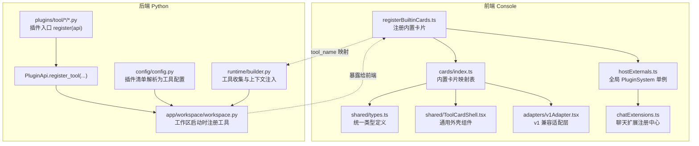
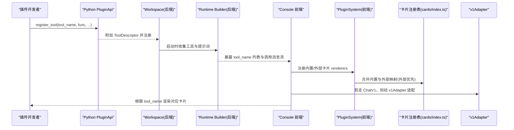
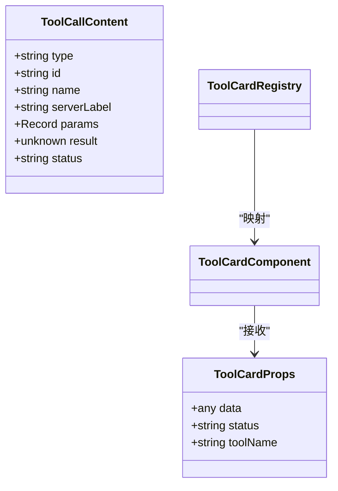
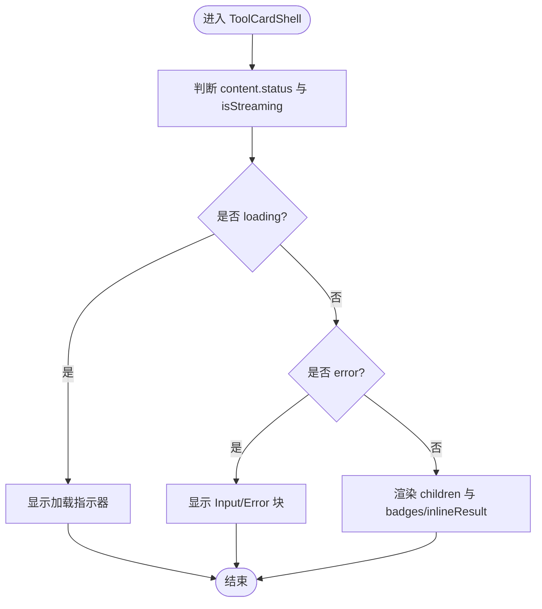
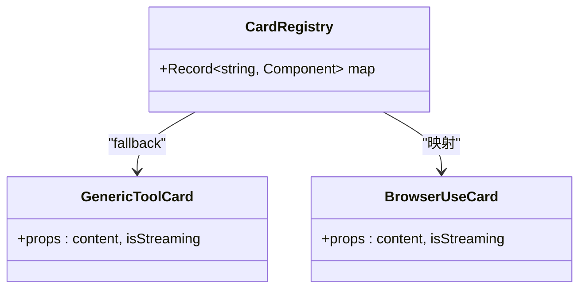
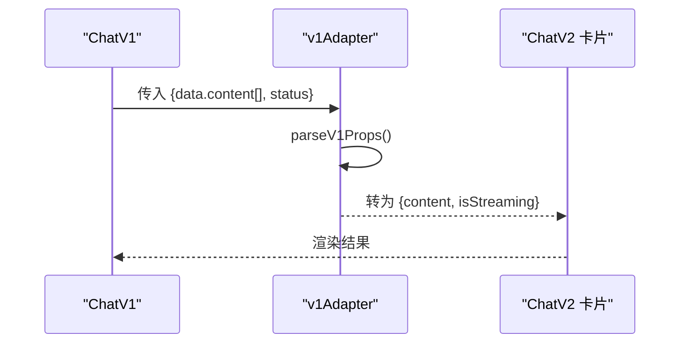
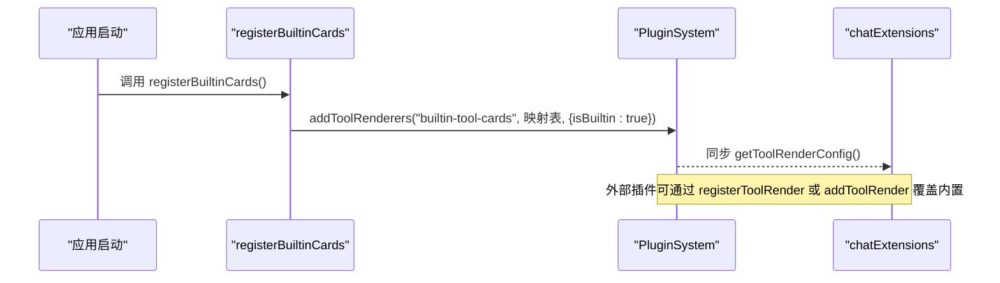
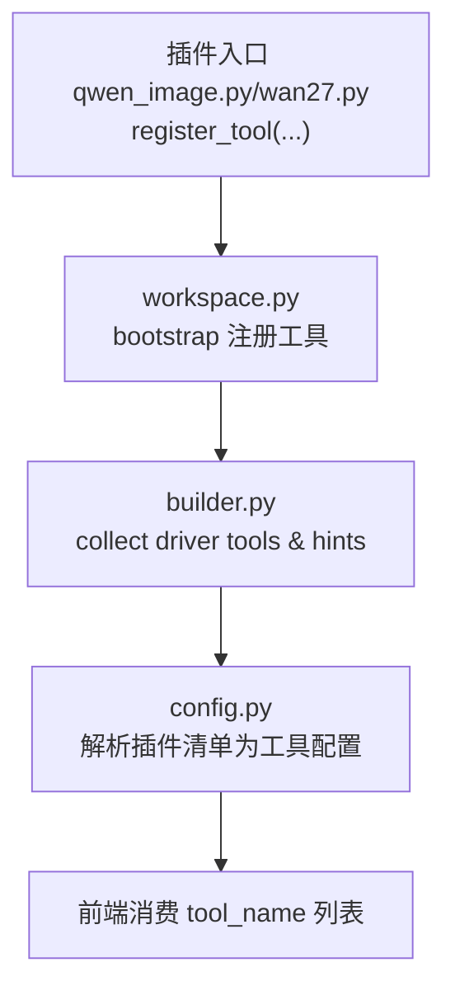
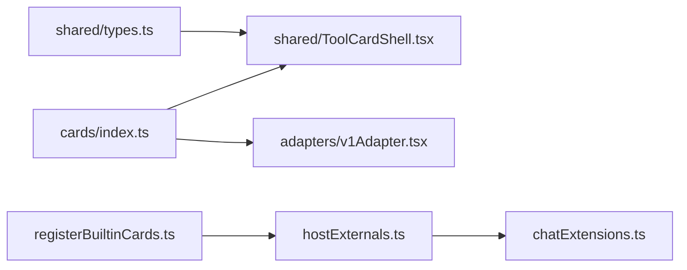

# 自定义卡片开发

<cite>
**本文引用的文件**   
- [console/src/components/Chat/ToolCards/registerBuiltinCards.ts](file://console/src/components/Chat/ToolCards/registerBuiltinCards.ts)
- [console/src/components/Chat/ToolCards/cards/index.ts](file://console/src/components/Chat/ToolCards/cards/index.ts)
- [console/src/components/Chat/ToolCards/shared/types.ts](file://console/src/components/Chat/ToolCards/shared/types.ts)
- [console/src/components/Chat/ToolCards/shared/ToolCardShell.tsx](file://console/src/components/Chat/ToolCards/shared/ToolCardShell.tsx)
- [console/src/components/Chat/ToolCards/shared/utils.ts](file://console/src/components/Chat/ToolCards/shared/utils.ts)
- [console/src/components/Chat/ToolCards/adapters/v1Adapter.tsx](file://console/src/components/Chat/ToolCards/adapters/v1Adapter.tsx)
- [console/src/plugins/hostExternals.ts](file://console/src/plugins/hostExternals.ts)
- [console/src/plugins/registry/chatExtensions.ts](file://console/src/plugins/registry/chatExtensions.ts)
- [console/src/components/Chat/ToolCards/cards/GenericToolCard.tsx](file://console/src/components/Chat/ToolCards/cards/GenericToolCard.tsx)
- [console/src/components/Chat/ToolCards/cards/BrowserUseCard.tsx](file://console/src/components/Chat/ToolCards/cards/BrowserUseCard.tsx)
- [src/qwenpaw/runtime/builder.py](file://src/qwenpaw/runtime/builder.py)
- [src/qwenpaw/app/workspace/workspace.py](file://src/qwenpaw/app/workspace/workspace.py)
- [src/qwenpaw/config/config.py](file://src/qwenpaw/config/config.py)
- [plugins/tool/qwen-image/qwen_image.py](file://plugins/tool/qwen-image/qwen_image.py)
- [plugins/tool/wan27/wan27.py](file://plugins/tool/wan27/wan27.py)
</cite>

## 目录
1. [简介](#简介)
2. [项目结构](#项目结构)
3. [核心组件](#核心组件)
4. [架构总览](#架构总览)
5. [详细组件分析](#详细组件分析)
6. [依赖关系分析](#依赖关系分析)
7. [性能考虑](#性能考虑)
8. [故障排查指南](#故障排查指南)
9. [结论](#结论)
10. [附录：开发示例与最佳实践](#附录开发示例与最佳实践)

## 简介
本指南面向希望在 QwenPaw 中开发“自定义工具卡片”的开发者，系统讲解从组件结构设计、Props 接口定义、事件处理机制到注册流程、动态加载与插件集成的完整路径。文档同时覆盖样式定制、主题适配、响应式设计、测试与调试技巧、性能优化建议，并给出从基础到高级功能的实现步骤与企业级集成方案。

## 项目结构
QwenPaw 的前端工具卡片体系位于 console 前端工程内，围绕“内置卡片注册 + 插件系统 + v1 兼容适配器”构建，后端通过插件 API 注册工具，前后端以统一的 tool_name 进行映射渲染。

图表来源
- [console/src/components/Chat/ToolCards/registerBuiltinCards.ts:1-39](file://console/src/components/Chat/ToolCards/registerBuiltinCards.ts#L1-L39)
- [console/src/components/Chat/ToolCards/cards/index.ts:1-134](file://console/src/components/Chat/ToolCards/cards/index.ts#L1-L134)
- [console/src/components/Chat/ToolCards/shared/types.ts:1-29](file://console/src/components/Chat/ToolCards/shared/types.ts#L1-L29)
- [console/src/components/Chat/ToolCards/shared/ToolCardShell.tsx:1-93](file://console/src/components/Chat/ToolCards/shared/ToolCardShell.tsx#L1-L93)
- [console/src/components/Chat/ToolCards/adapters/v1Adapter.tsx:1-209](file://console/src/components/Chat/ToolCards/adapters/v1Adapter.tsx#L1-L209)
- [console/src/plugins/hostExternals.ts:85-158](file://console/src/plugins/hostExternals.ts#L85-L158)
- [console/src/plugins/registry/chatExtensions.ts:138-307](file://console/src/plugins/registry/chatExtensions.ts#L138-L307)
- [src/qwenpaw/runtime/builder.py:201-227](file://src/qwenpaw/runtime/builder.py#L201-L227)
- [src/qwenpaw/app/workspace/workspace.py:151-181](file://src/qwenpaw/app/workspace/workspace.py#L151-L181)
- [src/qwenpaw/config/config.py:1855-1883](file://src/qwenpaw/config/config.py#L1855-L1883)
- [plugins/tool/qwen-image/qwen_image.py:27-62](file://plugins/tool/qwen-image/qwen_image.py#L27-L62)

章节来源
- [console/src/components/Chat/ToolCards/registerBuiltinCards.ts:1-39](file://console/src/components/Chat/ToolCards/registerBuiltinCards.ts#L1-L39)
- [console/src/components/Chat/ToolCards/cards/index.ts:1-134](file://console/src/components/Chat/ToolCards/cards/index.ts#L1-L134)
- [console/src/components/Chat/ToolCards/shared/types.ts:1-29](file://console/src/components/Chat/ToolCards/shared/types.ts#L1-L29)
- [console/src/components/Chat/ToolCards/shared/ToolCardShell.tsx:1-93](file://console/src/components/Chat/ToolCards/shared/ToolCardShell.tsx#L1-L93)
- [console/src/components/Chat/ToolCards/adapters/v1Adapter.tsx:1-209](file://console/src/components/Chat/ToolCards/adapters/v1Adapter.tsx#L1-L209)
- [console/src/plugins/hostExternals.ts:85-158](file://console/src/plugins/hostExternals.ts#L85-L158)
- [console/src/plugins/registry/chatExtensions.ts:138-307](file://console/src/plugins/registry/chatExtensions.ts#L138-L307)
- [src/qwenpaw/runtime/builder.py:201-227](file://src/qwenpaw/runtime/builder.py#L201-L227)
- [src/qwenpaw/app/workspace/workspace.py:151-181](file://src/qwenpaw/app/workspace/workspace.py#L151-L181)
- [src/qwenpaw/config/config.py:1855-1883](file://src/qwenpaw/config/config.py#L1855-L1883)
- [plugins/tool/qwen-image/qwen_image.py:27-62](file://plugins/tool/qwen-image/qwen_image.py#L27-L62)

## 核心组件
- 统一类型与数据契约
  - ToolCallContent：描述一次工具调用的元信息（名称、参数、结果、状态等）。
  - ToolCardProps：卡片组件接收的统一 Props 形状。
  - ToolCardComponent / ToolCardRegistry：卡片组件类型与注册表类型。
- 通用外壳组件
  - ToolCardShell：提供统一的折叠式布局、加载态、错误态、徽章与内联结果展示。
- 内置卡片注册表
  - cards/index.ts：维护 tool_name → React 组件的映射，供 ChatV2 与 ChatV1 使用。
- 注册与插件系统
  - registerBuiltinCards.ts：在应用启动时将内置卡片注册到全局 PluginSystem。
  - hostExternals.ts：提供全局 pluginSystem 单例与 window.QwenPaw 宿主能力。
  - chatExtensions.ts：聊天扩展注册中心，支持 addToolRender/addCard 等扩展点。
- v1 兼容适配层
  - adapters/v1Adapter.tsx：将 ChatV2 卡片适配为 ChatV1 的 customToolRenderConfig 格式，并提供 withGenericFallback 兜底。

章节来源
- [console/src/components/Chat/ToolCards/shared/types.ts:1-29](file://console/src/components/Chat/ToolCards/shared/types.ts#L1-L29)
- [console/src/components/Chat/ToolCards/shared/ToolCardShell.tsx:1-93](file://console/src/components/Chat/ToolCards/shared/ToolCardShell.tsx#L1-L93)
- [console/src/components/Chat/ToolCards/cards/index.ts:1-134](file://console/src/components/Chat/ToolCards/cards/index.ts#L1-L134)
- [console/src/components/Chat/ToolCards/registerBuiltinCards.ts:1-39](file://console/src/components/Chat/ToolCards/registerBuiltinCards.ts#L1-L39)
- [console/src/plugins/hostExternals.ts:85-158](file://console/src/plugins/hostExternals.ts#L85-L158)
- [console/src/plugins/registry/chatExtensions.ts:264-307](file://console/src/plugins/registry/chatExtensions.ts#L264-L307)
- [console/src/components/Chat/ToolCards/adapters/v1Adapter.tsx:149-209](file://console/src/components/Chat/ToolCards/adapters/v1Adapter.tsx#L149-L209)

## 架构总览
下图展示了“后端工具注册 → 运行时装配 → 前端卡片渲染”的端到端链路，以及插件系统的介入点。

图表来源
- [plugins/tool/qwen-image/qwen_image.py:27-62](file://plugins/tool/qwen-image/qwen_image.py#L27-L62)
- [src/qwenpaw/app/workspace/workspace.py:151-181](file://src/qwenpaw/app/workspace/workspace.py#L151-L181)
- [src/qwenpaw/runtime/builder.py:201-227](file://src/qwenpaw/runtime/builder.py#L201-L227)
- [console/src/components/Chat/ToolCards/registerBuiltinCards.ts:1-39](file://console/src/components/Chat/ToolCards/registerBuiltinCards.ts#L1-L39)
- [console/src/components/Chat/ToolCards/cards/index.ts:1-134](file://console/src/components/Chat/ToolCards/cards/index.ts#L1-L134)
- [console/src/components/Chat/ToolCards/adapters/v1Adapter.tsx:149-209](file://console/src/components/Chat/ToolCards/adapters/v1Adapter.tsx#L149-L209)

## 详细组件分析

### 类型与数据模型
- ToolCallContent
  - 字段：type、id、name、serverLabel、params、result、status
  - 用途：作为所有卡片的输入数据契约，贯穿 ChatV1/V2 与插件系统。
- ToolCardProps
  - 字段：data、status、toolName
  - 用途：插件侧渲染器统一入参。
- ToolCardComponent / ToolCardRegistry
  - 用途：定义卡片组件类型与注册表类型，便于集中管理与按需渲染。

图表来源
- [console/src/components/Chat/ToolCards/shared/types.ts:1-29](file://console/src/components/Chat/ToolCards/shared/types.ts#L1-L29)

章节来源
- [console/src/components/Chat/ToolCards/shared/types.ts:1-29](file://console/src/components/Chat/ToolCards/shared/types.ts#L1-L29)

### 通用外壳组件 ToolCardShell
- 职责
  - 统一呈现：图标 + 标题行 + 可展开内容区域。
  - 状态表现：loading、error、success 三种状态的视觉差异。
  - 辅助展示：内联结果、徽章、错误详情（输入与错误信息）。
- 关键 Props
  - content、isStreaming、icon、title、inlineResult、badges、children

图表来源
- [console/src/components/Chat/ToolCards/shared/ToolCardShell.tsx:1-93](file://console/src/components/Chat/ToolCards/shared/ToolCardShell.tsx#L1-L93)

章节来源
- [console/src/components/Chat/ToolCards/shared/ToolCardShell.tsx:1-93](file://console/src/components/Chat/ToolCards/shared/ToolCardShell.tsx#L1-L93)

### 内置卡片注册表与通用兜底
- 注册表 cards/index.ts
  - 维护 tool_name → 具体卡片组件的映射，如 read_file、browser_use、execute_shell_command 等。
  - 被 ChatV2 直接消费；同时经 v1Adapter 适配后供 ChatV1 使用。
- 通用兜底 GenericToolCard
  - 当 tool_name 未命中任何特定卡片时，使用通用卡片展示工具名与输出摘要。

图表来源
- [console/src/components/Chat/ToolCards/cards/index.ts:1-134](file://console/src/components/Chat/ToolCards/cards/index.ts#L1-L134)
- [console/src/components/Chat/ToolCards/cards/GenericToolCard.tsx:1-44](file://console/src/components/Chat/ToolCards/cards/GenericToolCard.tsx#L1-L44)
- [console/src/components/Chat/ToolCards/cards/BrowserUseCard.tsx:1-288](file://console/src/components/Chat/ToolCards/cards/BrowserUseCard.tsx#L1-L288)

章节来源
- [console/src/components/Chat/ToolCards/cards/index.ts:1-134](file://console/src/components/Chat/ToolCards/cards/index.ts#L1-L134)
- [console/src/components/Chat/ToolCards/cards/GenericToolCard.tsx:1-44](file://console/src/components/Chat/ToolCards/cards/GenericToolCard.tsx#L1-L44)
- [console/src/components/Chat/ToolCards/cards/BrowserUseCard.tsx:1-288](file://console/src/components/Chat/ToolCards/cards/BrowserUseCard.tsx#L1-L288)

### v1 兼容适配层
- 目标
  - 将 ChatV2 的 {content, isStreaming} 协议转换为 ChatV1 的 customToolRenderConfig 协议。
- 关键点
  - parseV1Props：解析 @agentscope-ai/chat 传入的数据结构，推导 ToolCallContent 与 isStreaming。
  - adaptCardForV1：包装单个卡片组件。
  - adaptRegistryForV1：批量转换注册表。
  - withGenericFallback：对未显式注册的 tool_name 返回通用卡片，确保健壮性。

图表来源
- [console/src/components/Chat/ToolCards/adapters/v1Adapter.tsx:75-136](file://console/src/components/Chat/ToolCards/adapters/v1Adapter.tsx#L75-L136)
- [console/src/components/Chat/ToolCards/adapters/v1Adapter.tsx:149-209](file://console/src/components/Chat/ToolCards/adapters/v1Adapter.tsx#L149-L209)

章节来源
- [console/src/components/Chat/ToolCards/adapters/v1Adapter.tsx:1-209](file://console/src/components/Chat/ToolCards/adapters/v1Adapter.tsx#L1-L209)

### 插件系统与动态加载
- 全局 PluginSystem（hostExternals.ts）
  - 提供 addToolRenderers/getToolRenderConfig 等方法，按“外部插件覆盖内置”的策略合并渲染器。
  - 暴露 window.QwenPaw.registerToolRender 以便插件注册。
- 聊天扩展注册中心（chatExtensions.ts）
  - 提供 addToolRender/addCard 等扩展点，支持作用域与生命周期管理。
- 内置卡片注册（registerBuiltinCards.ts）
  - 在应用启动时一次性将内置卡片注册到 PluginSystem，供 ChatV1/V2 共同消费。

图表来源
- [console/src/components/Chat/ToolCards/registerBuiltinCards.ts:1-39](file://console/src/components/Chat/ToolCards/registerBuiltinCards.ts#L1-L39)
- [console/src/plugins/hostExternals.ts:97-121](file://console/src/plugins/hostExternals.ts#L97-L121)
- [console/src/plugins/registry/chatExtensions.ts:264-307](file://console/src/plugins/registry/chatExtensions.ts#L264-L307)

章节来源
- [console/src/components/Chat/ToolCards/registerBuiltinCards.ts:1-39](file://console/src/components/Chat/ToolCards/registerBuiltinCards.ts#L1-L39)
- [console/src/plugins/hostExternals.ts:85-158](file://console/src/plugins/hostExternals.ts#L85-L158)
- [console/src/plugins/registry/chatExtensions.ts:138-307](file://console/src/plugins/registry/chatExtensions.ts#L138-L307)

### 后端工具注册与运行时装配
- 插件入口（示例：qwen-image、wan27）
  - 通过 PluginApi.register_tool 注册工具名与函数，附带描述与图标。
- 工作区启动
  - workspace.py 在创建后扫描已注册的工具描述符并写入运行时工具注册表。
- 运行时装配
  - builder.py 在构建 Agent 上下文时收集驱动工具与提示词，注入 extras 等上下文。
- 配置解析
  - config.py 读取插件清单，将 meta.tools 或旧版 meta.tool_name 解析为工具配置项。

图表来源
- [plugins/tool/qwen-image/qwen_image.py:27-62](file://plugins/tool/qwen-image/qwen_image.py#L27-L62)
- [plugins/tool/wan27/wan27.py:56-69](file://plugins/tool/wan27/wan27.py#L56-L69)
- [src/qwenpaw/app/workspace/workspace.py:151-181](file://src/qwenpaw/app/workspace/workspace.py#L151-L181)
- [src/qwenpaw/runtime/builder.py:201-227](file://src/qwenpaw/runtime/builder.py#L201-L227)
- [src/qwenpaw/config/config.py:1855-1883](file://src/qwenpaw/config/config.py#L1855-L1883)

章节来源
- [plugins/tool/qwen-image/qwen_image.py:27-62](file://plugins/tool/qwen-image/qwen_image.py#L27-L62)
- [plugins/tool/wan27/wan27.py:56-69](file://plugins/tool/wan27/wan27.py#L56-L69)
- [src/qwenpaw/app/workspace/workspace.py:151-181](file://src/qwenpaw/app/workspace/workspace.py#L151-L181)
- [src/qwenpaw/runtime/builder.py:201-227](file://src/qwenpaw/runtime/builder.py#L201-L227)
- [src/qwenpaw/config/config.py:1855-1883](file://src/qwenpaw/config/config.py#L1855-L1883)

## 依赖关系分析
- 组件耦合
  - 卡片组件仅依赖 shared/types 与 ToolCardShell，保持低耦合与高内聚。
  - v1Adapter 独立于具体卡片，负责协议转换，避免业务逻辑侵入。
- 注册优先级
  - 外部插件的 tool renderer 会覆盖内置同名 renderer，保证企业级定制优先。
- 外部依赖
  - 宿主能力（React、antd、i18n、API 访问）通过 hostExternals 注入，插件无需重复打包。

图表来源
- [console/src/components/Chat/ToolCards/shared/types.ts:1-29](file://console/src/components/Chat/ToolCards/shared/types.ts#L1-L29)
- [console/src/components/Chat/ToolCards/shared/ToolCardShell.tsx:1-93](file://console/src/components/Chat/ToolCards/shared/ToolCardShell.tsx#L1-L93)
- [console/src/components/Chat/ToolCards/cards/index.ts:1-134](file://console/src/components/Chat/ToolCards/cards/index.ts#L1-L134)
- [console/src/components/Chat/ToolCards/adapters/v1Adapter.tsx:1-209](file://console/src/components/Chat/ToolCards/adapters/v1Adapter.tsx#L1-L209)
- [console/src/components/Chat/ToolCards/registerBuiltinCards.ts:1-39](file://console/src/components/Chat/ToolCards/registerBuiltinCards.ts#L1-L39)
- [console/src/plugins/hostExternals.ts:85-158](file://console/src/plugins/hostExternals.ts#L85-L158)
- [console/src/plugins/registry/chatExtensions.ts:138-307](file://console/src/plugins/registry/chatExtensions.ts#L138-L307)

章节来源
- [console/src/components/Chat/ToolCards/shared/types.ts:1-29](file://console/src/components/Chat/ToolCards/shared/types.ts#L1-L29)
- [console/src/components/Chat/ToolCards/shared/ToolCardShell.tsx:1-93](file://console/src/components/Chat/ToolCards/shared/ToolCardShell.tsx#L1-L93)
- [console/src/components/Chat/ToolCards/cards/index.ts:1-134](file://console/src/components/Chat/ToolCards/cards/index.ts#L1-L134)
- [console/src/components/Chat/ToolCards/adapters/v1Adapter.tsx:1-209](file://console/src/components/Chat/ToolCards/adapters/v1Adapter.tsx#L1-L209)
- [console/src/components/Chat/ToolCards/registerBuiltinCards.ts:1-39](file://console/src/components/Chat/ToolCards/registerBuiltinCards.ts#L1-L39)
- [console/src/plugins/hostExternals.ts:85-158](file://console/src/plugins/hostExternals.ts#L85-L158)
- [console/src/plugins/registry/chatExtensions.ts:138-307](file://console/src/plugins/registry/chatExtensions.ts#L138-L307)

## 性能考虑
- 懒加载与缓存
  - 对复杂卡片（如浏览器操作、大文本输出）采用按需导入与 memo 化，减少首屏开销。
- 渲染降级
  - 使用 withGenericFallback 确保未知 tool_name 不阻断 UI；对超大结果进行截断与分页。
- 状态更新频率
  - streaming 场景下节流更新，避免频繁重渲染导致卡顿。
- 资源复用
  - 共享 ToolCardShell 与 utils，减少重复计算与 DOM 节点。

[本节为通用指导，不涉及具体文件分析]

## 故障排查指南
- 常见问题
  - 卡片未渲染：检查 tool_name 是否在注册表中存在；确认外部插件是否覆盖了内置映射。
  - v1 渲染异常：确认 v1Adapter 是否正确解析 content 与 status；必要时启用日志打印。
  - 插件未生效：确认 registerToolRender 或 addToolRender 是否被调用；检查 isBuiltin 标记与优先级。
- 调试技巧
  - 在 registerBuiltinCards 与 PluginSystem.addToolRenderers 处添加日志，观察注册数量与 key 列表。
  - 使用 chatExtensions 审计记录定位覆盖关系与生命周期。
- 错误边界
  - v1Adapter 已包含错误边界包装，防止单个卡片崩溃影响整体聊天界面。

章节来源
- [console/src/components/Chat/ToolCards/registerBuiltinCards.ts:1-39](file://console/src/components/Chat/ToolCards/registerBuiltinCards.ts#L1-L39)
- [console/src/plugins/hostExternals.ts:97-121](file://console/src/plugins/hostExternals.ts#L97-L121)
- [console/src/plugins/registry/chatExtensions.ts:476-484](file://console/src/plugins/registry/chatExtensions.ts#L476-L484)
- [console/src/components/Chat/ToolCards/adapters/v1Adapter.tsx:149-161](file://console/src/components/Chat/ToolCards/adapters/v1Adapter.tsx#L149-L161)

## 结论
通过统一的类型契约、通用外壳组件、注册表与插件系统，QwenPaw 实现了高度可扩展的工具卡片生态。开发者可以基于现有模式快速实现从简单到复杂的自定义卡片，并通过插件机制在企业环境中灵活覆盖与增强默认行为。

[本节为总结性内容，不涉及具体文件分析]

## 附录：开发示例与最佳实践

### 从零开始：创建一个自定义卡片
- 步骤概览
  1. 定义卡片组件：遵循 ToolCardProps 接口，使用 ToolCardShell 包裹布局。
  2. 加入注册表：在 cards/index.ts 中添加 tool_name → 组件映射。
  3. 注册到插件系统：在应用启动时调用 registerBuiltinCards（内置）或通过插件 API 注册（外部）。
  4. 后端对接：在 Python 插件中使用 PluginApi.register_tool 注册同名工具。
  5. 验证与调试：运行应用，触发工具调用，观察卡片渲染与日志。

- 参考路径
  - 通用外壳与类型：[shared/ToolCardShell.tsx:1-93](file://console/src/components/Chat/ToolCards/shared/ToolCardShell.tsx#L1-L93)、[shared/types.ts:1-29](file://console/src/components/Chat/ToolCards/shared/types.ts#L1-L29)
  - 注册表与内置示例：[cards/index.ts:1-134](file://console/src/components/Chat/ToolCards/cards/index.ts#L1-L134)
  - 插件注册入口（前端）：[registerBuiltinCards.ts:1-39](file://console/src/components/Chat/ToolCards/registerBuiltinCards.ts#L1-L39)
  - 插件注册入口（后端）：[qwen_image.py:27-62](file://plugins/tool/qwen-image/qwen_image.py#L27-L62)、[wan27.py:56-69](file://plugins/tool/wan27/wan27.py#L56-L69)

章节来源
- [console/src/components/Chat/ToolCards/shared/ToolCardShell.tsx:1-93](file://console/src/components/Chat/ToolCards/shared/ToolCardShell.tsx#L1-L93)
- [console/src/components/Chat/ToolCards/shared/types.ts:1-29](file://console/src/components/Chat/ToolCards/shared/types.ts#L1-L29)
- [console/src/components/Chat/ToolCards/cards/index.ts:1-134](file://console/src/components/Chat/ToolCards/cards/index.ts#L1-L134)
- [console/src/components/Chat/ToolCards/registerBuiltinCards.ts:1-39](file://console/src/components/Chat/ToolCards/registerBuiltinCards.ts#L1-L39)
- [plugins/tool/qwen-image/qwen_image.py:27-62](file://plugins/tool/qwen-image/qwen_image.py#L27-L62)
- [plugins/tool/wan27/wan27.py:56-69](file://plugins/tool/wan27/wan27.py#L56-L69)

### 高级功能：浏览器操作卡片
- 特点
  - 多工具名聚合：browser_use、navigate、click、type、snapshot、scroll 等统一由 BrowserUseCard 处理。
  - 结果格式化：自动提取 snapshot/message/url 等关键字段，兼容 MCP 内容块与字符串 JSON。
- 参考路径
  - 浏览器卡片实现：[BrowserUseCard.tsx:1-288](file://console/src/components/Chat/ToolCards/cards/BrowserUseCard.tsx#L1-L288)

章节来源
- [console/src/components/Chat/ToolCards/cards/BrowserUseCard.tsx:1-288](file://console/src/components/Chat/ToolCards/cards/BrowserUseCard.tsx#L1-L288)

### 样式定制、主题适配与响应式设计
- 样式策略
  - 使用 Less/CSS Modules 隔离样式，结合 ToolCardShell 提供的类名进行差异化渲染。
- 主题适配
  - 借助宿主提供的 antd 主题变量与 useTheme hook，使卡片颜色、字号跟随系统主题。
- 响应式
  - 在小屏设备上隐藏次要信息（如内联结果），保留关键标题与状态指示。

[本节为通用指导，不涉及具体文件分析]

### 测试方法与调试技巧
- 单元测试
  - 针对工具结果解析函数（如 stringifyResult、formatMemorySearch、getMediaInfo）编写用例，覆盖正常、异常与边界情况。
- 集成测试
  - 模拟后端工具调用消息，验证前端卡片渲染与交互是否符合预期。
- 调试技巧
  - 在 v1Adapter.parseV1Props 与 PluginSystem.getToolRenderConfig 处增加日志，追踪数据流转与覆盖关系。

章节来源
- [console/src/components/Chat/ToolCards/shared/utils.ts:1-581](file://console/src/components/Chat/ToolCards/shared/utils.ts#L1-L581)
- [console/src/components/Chat/ToolCards/adapters/v1Adapter.tsx:75-136](file://console/src/components/Chat/ToolCards/adapters/v1Adapter.tsx#L75-L136)
- [console/src/plugins/hostExternals.ts:113-121](file://console/src/plugins/hostExternals.ts#L113-L121)

### 企业级集成要点
- 插件覆盖策略
  - 外部插件的 tool renderer 优先于内置，满足企业定制化需求。
- 安全与治理
  - 结合后端工具守卫与权限控制，限制敏感工具的可见性与执行范围。
- 版本兼容
  - 使用 v1Adapter 保障与旧版聊天界面的兼容，平滑迁移。

章节来源
- [console/src/plugins/hostExternals.ts:113-121](file://console/src/plugins/hostExternals.ts#L113-L121)
- [console/src/components/Chat/ToolCards/adapters/v1Adapter.tsx:1-209](file://console/src/components/Chat/ToolCards/adapters/v1Adapter.tsx#L1-L209)