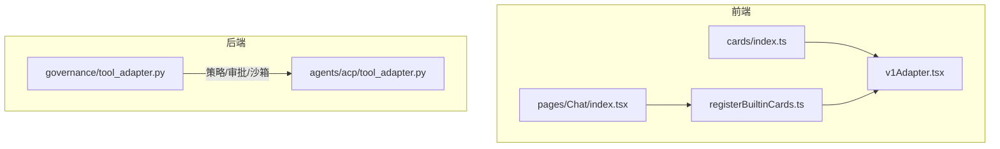
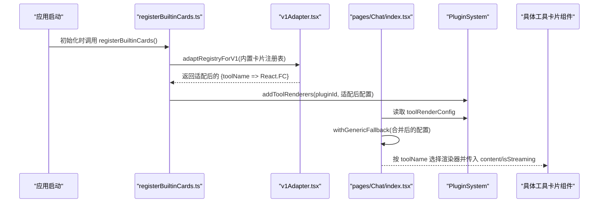
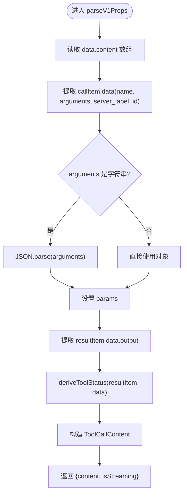
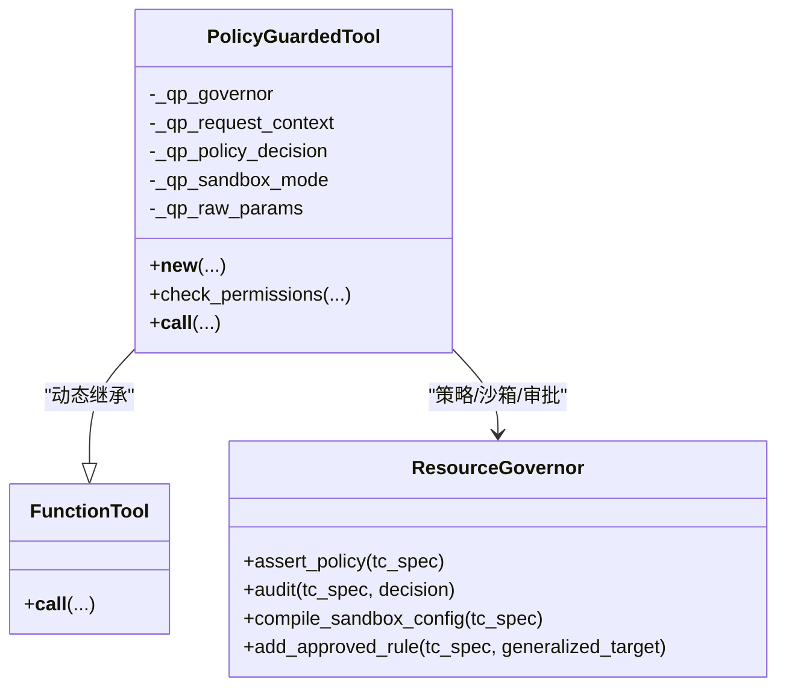
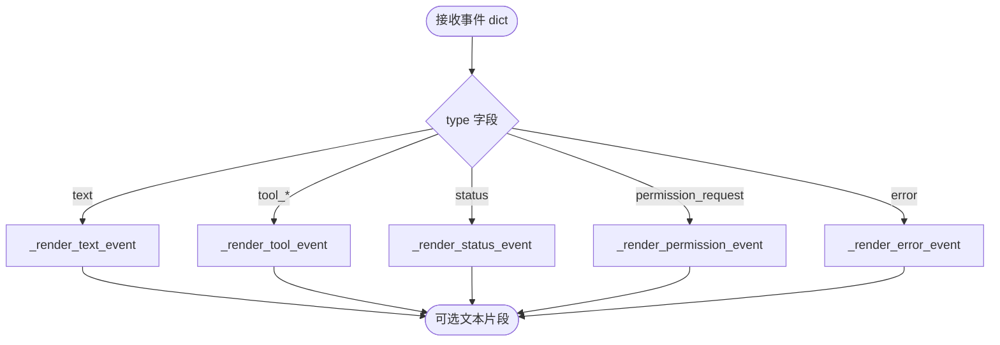
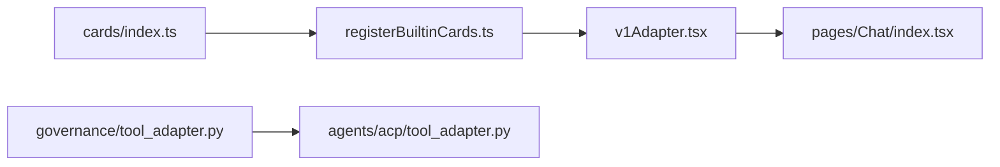

# 适配器模式实现

<cite>
**本文引用的文件列表**
- [v1Adapter.tsx](file://console/src/components/Chat/ToolCards/adapters/v1Adapter.tsx)
- [registerBuiltinCards.ts](file://console/src/components/Chat/ToolCards/registerBuiltinCards.ts)
- [index.ts（聊天页面）](file://console/src/pages/Chat/index.tsx)
- [cards/index.ts](file://console/src/components/Chat/ToolCards/cards/index.ts)
- [tool_adapter.py（治理层工具包装器）](file://src/qwenpaw/governance/tool_adapter.py)
- [tool_adapter.py（ACP 到 ToolChunk 适配辅助）](file://src/qwenpaw/agents/acp/tool_adapter.py)
</cite>

## 目录
1. [引言](#引言)
2. [项目结构](#项目结构)
3. [核心组件](#核心组件)
4. [架构总览](#架构总览)
5. [详细组件分析](#详细组件分析)
6. [依赖关系分析](#依赖关系分析)
7. [性能考虑](#性能考虑)
8. [故障排查指南](#故障排查指南)
9. [结论](#结论)
10. [附录：开发示例与最佳实践](#附录开发示例与最佳实践)

## 引言
本文件聚焦 QwenPaw 工具卡片在前后端两端的“适配器模式”实现，重点包括：
- 前端 v1Adapter：将 ChatV2 的工具卡片统一适配为 ChatV1 的渲染协议，完成数据映射、状态推导与降级兜底。
- 后端治理层 PolicyGuardedTool：以动态类方式对工具执行进行策略校验、沙箱回退与用户审批桥接。
- ACP 到 ToolChunk 的轻量适配：将外部代理事件流转换为统一的 ToolChunk 输出，便于上层消费。

文档同时给出注册与使用方式、生命周期管理、错误处理策略与性能优化建议，并提供可操作的自定义适配器开发指引。

## 项目结构
围绕“适配器模式”，关键代码分布在以下位置：
- 前端适配器与注册：
  - console/src/components/Chat/ToolCards/adapters/v1Adapter.tsx
  - console/src/components/Chat/ToolCards/registerBuiltinCards.ts
  - console/src/pages/Chat/index.tsx
  - console/src/components/Chat/ToolCards/cards/index.ts
- 后端治理与适配：
  - src/qwenpaw/governance/tool_adapter.py
  - src/qwenpaw/agents/acp/tool_adapter.py

图表来源
- [v1Adapter.tsx:1-209](file://console/src/components/Chat/ToolCards/adapters/v1Adapter.tsx#L1-L209)
- [registerBuiltinCards.ts:1-39](file://console/src/components/Chat/ToolCards/registerBuiltinCards.ts#L1-L39)
- [index.ts（聊天页面）:2910-2930](file://console/src/pages/Chat/index.tsx#L2910-L2930)
- [cards/index.ts:1-37](file://console/src/components/Chat/ToolCards/cards/index.ts#L1-L37)
- [tool_adapter.py（治理层）:1-720](file://src/qwenpaw/governance/tool_adapter.py#L1-L720)
- [tool_adapter.py（ACP 适配）:1-249](file://src/qwenpaw/agents/acp/tool_adapter.py#L1-L249)

章节来源
- [v1Adapter.tsx:1-209](file://console/src/components/Chat/ToolCards/adapters/v1Adapter.tsx#L1-L209)
- [registerBuiltinCards.ts:1-39](file://console/src/components/Chat/ToolCards/registerBuiltinCards.ts#L1-L39)
- [index.ts（聊天页面）:2910-2930](file://console/src/pages/Chat/index.tsx#L2910-L2930)
- [cards/index.ts:1-37](file://console/src/components/Chat/ToolCards/cards/index.ts#L1-L37)
- [tool_adapter.py（治理层）:1-720](file://src/qwenpaw/governance/tool_adapter.py#L1-L720)
- [tool_adapter.py（ACP 适配）:1-249](file://src/qwenpaw/agents/acp/tool_adapter.py#L1-L249)

## 核心组件
- 前端 v1Adapter
  - 职责：将 ChatV1 传入的 props 解析为 ChatV2 卡片期望的 content 与 isStreaming；提供批量注册适配与通用降级组件。
  - 关键点：状态推导、参数 JSON 兼容、ID 生成、Proxy 兜底。
- 后端治理层 PolicyGuardedTool
  - 职责：动态继承 FunctionTool，注入策略评估、审计、沙箱回退与用户审批流程。
  - 关键点：OFF 模式安全回退、权限决策映射、异步审批等待、审计记录。
- ACP 到 ToolChunk 适配
  - 职责：将外部代理事件流（文本、工具调用、状态、权限请求、错误等）标准化为 ToolChunk，供上层统一消费。
  - 关键点：事件类型分发、选项规范化、最终响应组装。

章节来源
- [v1Adapter.tsx:1-209](file://console/src/components/Chat/ToolCards/adapters/v1Adapter.tsx#L1-L209)
- [tool_adapter.py（治理层）:1-720](file://src/qwenpaw/governance/tool_adapter.py#L1-L720)
- [tool_adapter.py（ACP 适配）:1-249](file://src/qwenpaw/agents/acp/tool_adapter.py#L1-L249)

## 架构总览
下图展示从“内置卡片注册”到“ChatV1 渲染”的前端链路，以及后端“策略校验—审批—执行”的主流程。

图表来源
- [registerBuiltinCards.ts:1-39](file://console/src/components/Chat/ToolCards/registerBuiltinCards.ts#L1-L39)
- [v1Adapter.tsx:168-209](file://console/src/components/Chat/ToolCards/adapters/v1Adapter.tsx#L168-L209)
- [index.ts（聊天页面）:2910-2930](file://console/src/pages/Chat/index.tsx#L2910-L2930)

## 详细组件分析

### 前端 v1Adapter 设计与实现
- 设计目标
  - 屏蔽 ChatV1 与 ChatV2 的数据协议差异，使同一套卡片可同时服务于两套运行时。
  - 保证未知工具名也能稳定渲染（通用降级）。
- 数据映射与状态推导
  - 解析 V1 props 中的 content[0].data（调用信息：name、arguments、server_label、id 等）与 content[1].data（结果 output）。
  - 根据 resultItem.data.state 或 message-level status 推导 ToolCallStatus（calling/done/error）。
  - arguments 支持字符串 JSON 与对象两种形态，自动解析。
- 适配工厂与批量转换
  - adaptCardForV1：将单个 ChatV2 卡片包装为 V1 渲染函数。
  - adaptRegistryForV1：遍历内置注册表，批量生成 V1 渲染函数映射。
- 通用降级与 Proxy 兜底
  - withGenericFallback：通过 Proxy 拦截未显式注册的 toolName，返回 GenericToolCard 的 V1 包装版本，避免 UI 崩溃。
  - 懒缓存 GenericToolCard 的 V1 包装实例，减少重复创建开销。
- 错误边界与健壮性
  - 解析失败时回退默认值（如 toolName=unknown、params={}、status=calling），确保渲染不中断。

图表来源
- [v1Adapter.tsx:75-136](file://console/src/components/Chat/ToolCards/adapters/v1Adapter.tsx#L75-L136)

章节来源
- [v1Adapter.tsx:1-209](file://console/src/components/Chat/ToolCards/adapters/v1Adapter.tsx#L1-L209)
- [registerBuiltinCards.ts:1-39](file://console/src/components/Chat/ToolCards/registerBuiltinCards.ts#L1-L39)
- [index.ts（聊天页面）:2910-2930](file://console/src/pages/Chat/index.tsx#L2910-L2930)
- [cards/index.ts:1-37](file://console/src/components/Chat/ToolCards/cards/index.ts#L1-L37)

### 后端治理层 PolicyGuardedTool（策略/沙箱/审批）
- 设计目标
  - 在不侵入业务工具的前提下，统一接入策略评估、审计、沙箱隔离与用户审批。
- 动态类注入
  - 通过 __new__ 动态生成继承自 FunctionTool 的子类，注入 _build_tc_spec、check_permissions、__call__ 等方法。
- 策略评估与决策映射
  - check_permissions：构建 ToolCallSpec，调用 ResourceGovernor.assert_policy 得到 GovernanceDecision，映射为 PermissionDecision（ALLOW/DENY/SANDBOX_FALLBACK/ASK）。
  - OFF 模式：跳过“询问用户”，但仍为需要沙箱的工具编译 sandbox_config，确保安全隔离。
- 执行与重试
  - __call__：优先在沙箱中执行；若触发 ToolChunk.DENIED（沙箱违规），则发起用户审批；批准后重试无沙箱执行。
- 审批流程
  - _ask_user_approval：构造 ToolGuardResult，持久化待审批项，阻塞等待用户决定；记录审计日志；批准时写入“已批准规则”。

图表来源
- [tool_adapter.py（治理层）:108-141](file://src/qwenpaw/governance/tool_adapter.py#L108-L141)
- [tool_adapter.py（治理层）:222-336](file://src/qwenpaw/governance/tool_adapter.py#L222-L336)
- [tool_adapter.py（治理层）:338-472](file://src/qwenpaw/governance/tool_adapter.py#L338-L472)
- [tool_adapter.py（治理层）:479-720](file://src/qwenpaw/governance/tool_adapter.py#L479-L720)

章节来源
- [tool_adapter.py（治理层）:1-720](file://src/qwenpaw/governance/tool_adapter.py#L1-L720)

### ACP 到 ToolChunk 的适配辅助
- 设计目标
  - 将外部代理的事件流（文本、工具调用、状态、权限请求、错误等）标准化为 ToolChunk，便于上层统一渲染与处理。
- 主要能力
  - render_event_text：按事件类型分派渲染逻辑。
  - format_stream_snapshot_response：将快照片段转为非最后的 ToolChunk。
  - format_final_assistant_response：组装最终助手回复（包含运行头信息与主体内容）。
  - format_permission_suspended_response：将挂起的权限请求格式化为用户可读的提示与选项。
  - format_close_response：关闭会话时的收尾消息。

图表来源
- [tool_adapter.py（ACP 适配）:115-128](file://src/qwenpaw/agents/acp/tool_adapter.py#L115-L128)
- [tool_adapter.py（ACP 适配）:130-176](file://src/qwenpaw/agents/acp/tool_adapter.py#L130-L176)
- [tool_adapter.py（ACP 适配）:178-237](file://src/qwenpaw/agents/acp/tool_adapter.py#L178-L237)
- [tool_adapter.py（ACP 适配）:240-249](file://src/qwenpaw/agents/acp/tool_adapter.py#L240-L249)

章节来源
- [tool_adapter.py（ACP 适配）:1-249](file://src/qwenpaw/agents/acp/tool_adapter.py#L1-L249)

## 依赖关系分析
- 前端
  - cards/index.ts 导出所有内置卡片组件，作为 BUILTIN_CARD_REGISTRY 的来源。
  - registerBuiltinCards.ts 调用 adaptRegistryForV1 将内置卡片适配为 V1 渲染函数，并通过 pluginSystem.addToolRenderers 注册。
  - pages/Chat/index.tsx 在构造 AgentScopeRuntimeWebUI 选项时，使用 withGenericFallback 包裹合并后的 customToolRenderConfig，确保未知工具名有兜底渲染。
- 后端
  - governance/tool_adapter.PolicyGuardedTool 依赖 ResourceGovernor 进行策略评估与审计，并在必要时触发 ApprovalService 的用户审批流程。
  - agents/acp/tool_adapter 提供事件到 ToolChunk 的转换，被上层用于统一输出。

图表来源
- [cards/index.ts:1-37](file://console/src/components/Chat/ToolCards/cards/index.ts#L1-L37)
- [registerBuiltinCards.ts:1-39](file://console/src/components/Chat/ToolCards/registerBuiltinCards.ts#L1-L39)
- [v1Adapter.tsx:168-209](file://console/src/components/Chat/ToolCards/adapters/v1Adapter.tsx#L168-L209)
- [index.ts（聊天页面）:2910-2930](file://console/src/pages/Chat/index.tsx#L2910-L2930)
- [tool_adapter.py（治理层）:1-720](file://src/qwenpaw/governance/tool_adapter.py#L1-L720)
- [tool_adapter.py（ACP 适配）:1-249](file://src/qwenpaw/agents/acp/tool_adapter.py#L1-L249)

章节来源
- [cards/index.ts:1-37](file://console/src/components/Chat/ToolCards/cards/index.ts#L1-L37)
- [registerBuiltinCards.ts:1-39](file://console/src/components/Chat/ToolCards/registerBuiltinCards.ts#L1-L39)
- [v1Adapter.tsx:168-209](file://console/src/components/Chat/ToolCards/adapters/v1Adapter.tsx#L168-L209)
- [index.ts（聊天页面）:2910-2930](file://console/src/pages/Chat/index.tsx#L2910-L2930)
- [tool_adapter.py（治理层）:1-720](file://src/qwenpaw/governance/tool_adapter.py#L1-L720)
- [tool_adapter.py（ACP 适配）:1-249](file://src/qwenpaw/agents/acp/tool_adapter.py#L1-L249)

## 性能考虑
- 前端
  - 懒加载与缓存：GenericToolCard 的 V1 包装仅首次创建并缓存，避免重复分配。
  - Proxy 访问：仅在未命中属性时触发 fallback，常规路径零额外开销。
  - 状态推导：基于内存对象快速判断，避免重算。
- 后端
  - 策略评估：在 check_permissions 阶段一次性计算并缓存决策与 tc_spec，__call__ 直接复用。
  - OFF 模式：短路审批但保留沙箱配置编译，兼顾性能与安全。
  - 审批等待：超时与异常均走 DENY 分支，避免长时间阻塞。

## 故障排查指南
- 前端
  - 现象：某些工具卡片未显示或报错。
    - 检查是否已通过 registerBuiltinCards 注册；确认 customToolRenderConfig 是否经 withGenericFallback 包裹。
    - 查看 parseV1Props 的参数解析是否因 JSON 格式异常而回退。
  - 现象：未知工具名导致空白或崩溃。
    - 确认 withGenericFallback 生效，fallback 指向 GenericToolCard 的 V1 包装。
- 后端
  - 现象：工具调用被拒绝且无法恢复。
    - 检查 governance 层是否初始化成功；若 governor 为 None，会 fail-closed 拒绝所有调用。
    - 若处于 OFF 模式，确认 requires_sandbox 的工具仍编译了 sandbox_config。
  - 现象：审批弹窗不出现或超时。
    - 检查 ApprovalService 的 pending 创建与 wait_for_approval 是否抛出异常；超时将记为 DENY。

章节来源
- [v1Adapter.tsx:149-209](file://console/src/components/Chat/ToolCards/adapters/v1Adapter.tsx#L149-L209)
- [registerBuiltinCards.ts:26-39](file://console/src/components/Chat/ToolCards/registerBuiltinCards.ts#L26-L39)
- [index.ts（聊天页面）:2910-2930](file://console/src/pages/Chat/index.tsx#L2910-L2930)
- [tool_adapter.py（治理层）:266-288](file://src/qwenpaw/governance/tool_adapter.py#L266-L288)
- [tool_adapter.py（治理层）:182-219](file://src/qwenpaw/governance/tool_adapter.py#L182-L219)
- [tool_adapter.py（治理层）:666-678](file://src/qwenpaw/governance/tool_adapter.py#L666-L678)

## 结论
QwenPaw 在前端与后端分别实现了面向“协议差异”和“安全策略”的适配器模式：
- 前端 v1Adapter 通过数据映射、状态推导与 Proxy 兜底，让 ChatV2 卡片无缝服务于 ChatV1。
- 后端 PolicyGuardedTool 以动态类注入的方式，将策略评估、沙箱隔离与用户审批整合进工具执行链路，保障安全与可控。
- ACP 到 ToolChunk 的适配进一步统一了外部代理事件的消费模型。

这些设计共同提升了系统的兼容性、安全性与可维护性。

## 附录：开发示例与最佳实践

### 如何新增一个自定义工具卡片（前端）
- 步骤
  - 在 cards 目录下新建卡片组件，遵循 ChatV2 接口：{ content: ToolCallContent, isStreaming?: boolean }。
  - 在 cards/index.ts 中导出该组件，使其进入内置注册表。
  - 应用启动时调用 registerBuiltinCards，完成 V1/V2 双端注册。
- 注意事项
  - 若需兼容 ChatV1，无需单独编写 V1 渲染器，v1Adapter 会自动包装。
  - 若存在未注册的工具名，withGenericFallback 会返回通用卡片，避免 UI 崩溃。

章节来源
- [cards/index.ts:1-37](file://console/src/components/Chat/ToolCards/cards/index.ts#L1-L37)
- [registerBuiltinCards.ts:26-39](file://console/src/components/Chat/ToolCards/registerBuiltinCards.ts#L26-L39)
- [v1Adapter.tsx:149-177](file://console/src/components/Chat/ToolCards/adapters/v1Adapter.tsx#L149-L177)

### 如何将现有 ChatV2 卡片用于 ChatV1（手动适配）
- 使用 adaptCardForV1 将单个卡片包装为 V1 渲染函数。
- 使用 adaptRegistryForV1 批量转换注册表。
- 使用 withGenericFallback 包裹最终配置，确保未知工具名有兜底。

章节来源
- [v1Adapter.tsx:149-209](file://console/src/components/Chat/ToolCards/adapters/v1Adapter.tsx#L149-L209)

### 后端：为工具启用治理策略与审批
- 使用 PolicyGuardedTool 包装工具函数，传入 ResourceGovernor 与 request_context。
- 在 check_permissions 中完成策略评估与审计；在 __call__ 中处理沙箱违规与用户审批。
- 建议在 OFF 模式下仍为 requires_sandbox 的工具编译 sandbox_config，确保最小安全基线。

章节来源
- [tool_adapter.py（治理层）:108-141](file://src/qwenpaw/governance/tool_adapter.py#L108-L141)
- [tool_adapter.py（治理层）:222-336](file://src/qwenpaw/governance/tool_adapter.py#L222-L336)
- [tool_adapter.py（治理层）:338-472](file://src/qwenpaw/governance/tool_adapter.py#L338-L472)
- [tool_adapter.py（治理层）:479-720](file://src/qwenpaw/governance/tool_adapter.py#L479-L720)

### 后端：将外部代理事件转换为 ToolChunk
- 使用 render_event_text 对事件进行分类渲染。
- 使用 format_stream_snapshot_response 输出中间态。
- 使用 format_final_assistant_response 输出最终结果。
- 使用 format_permission_suspended_response 呈现权限请求与选项。

章节来源
- [tool_adapter.py（ACP 适配）:115-176](file://src/qwenpaw/agents/acp/tool_adapter.py#L115-L176)
- [tool_adapter.py（ACP 适配）:178-237](file://src/qwenpaw/agents/acp/tool_adapter.py#L178-L237)
- [tool_adapter.py（ACP 适配）:240-249](file://src/qwenpaw/agents/acp/tool_adapter.py#L240-L249)