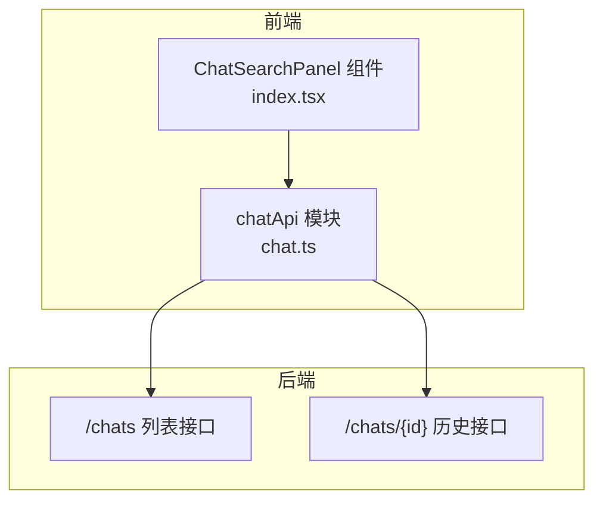
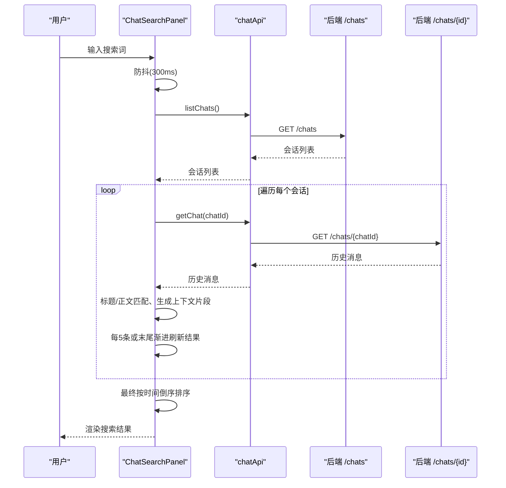
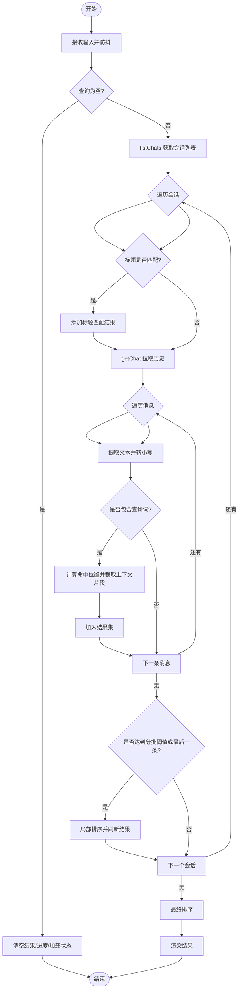
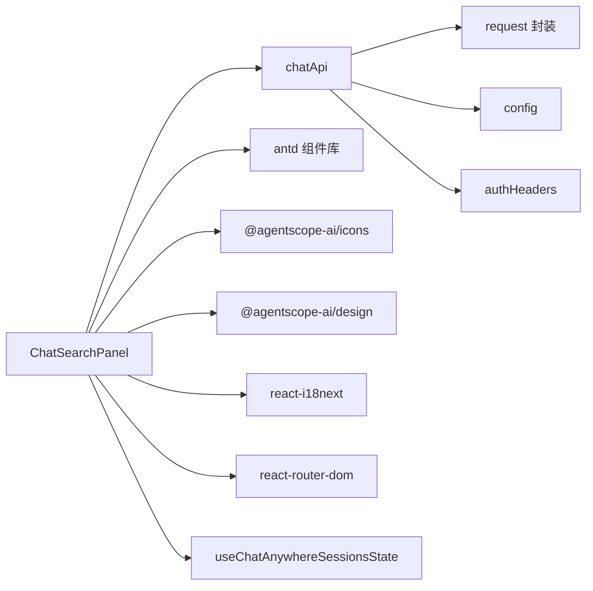

# 搜索功能

<cite>
**本文引用的文件**
- [console/src/pages/Chat/components/ChatSearchPanel/index.tsx](file://console/src/pages/Chat/components/ChatSearchPanel/index.tsx)
- [console/src/api/modules/chat.ts](file://console/src/api/modules/chat.ts)
- [console/src/pages/Chat/components/ChatSearchPanel/ChatSearchPanel.test.tsx](file://console/src/pages/Chat/components/ChatSearchPanel/ChatSearchPanel.test.tsx)
</cite>

## 目录
1. [简介](#简介)
2. [项目结构](#项目结构)
3. [核心组件](#核心组件)
4. [架构总览](#架构总览)
5. [详细组件分析](#详细组件分析)
6. [依赖关系分析](#依赖关系分析)
7. [性能考量](#性能考量)
8. [故障排查指南](#故障排查指南)
9. [结论](#结论)
10. [附录](#附录)

## 简介
本章节面向 QwenPaw 聊天界面的“搜索功能”，聚焦于 ChatSearchPanel 组件的实现机制与使用方式。内容覆盖：
- 实时搜索与防抖策略
- 过滤算法（标题匹配、消息正文匹配）
- 结果高亮显示（上下文片段）
- 搜索范围控制（会话列表 + 逐条历史）
- 排序机制（按时间倒序）
- 内存与性能优化（串行加载、进度刷新、竞态保护）
- 扩展点与高级用法建议（自定义规则、语法扩展）

## 项目结构
搜索功能位于前端控制台（Console）的聊天页面中，核心由一个抽屉式面板组件与聊天 API 模块组成：
- 组件层：ChatSearchPanel（右侧抽屉，包含输入框、结果列表、导航跳转）
- 数据层：chatApi（列出会话、获取会话历史）
- 测试层：单元测试覆盖纯函数逻辑（文本提取、角色标签、时间格式化）

图表来源
- [console/src/pages/Chat/components/ChatSearchPanel/index.tsx:1-375](file://console/src/pages/Chat/components/ChatSearchPanel/index.tsx#L1-L375)
- [console/src/api/modules/chat.ts:1-140](file://console/src/api/modules/chat.ts#L1-L140)

章节来源
- [console/src/pages/Chat/components/ChatSearchPanel/index.tsx:1-375](file://console/src/pages/Chat/components/ChatSearchPanel/index.tsx#L1-L375)
- [console/src/api/modules/chat.ts:1-140](file://console/src/api/modules/chat.ts#L1-L140)

## 核心组件
- ChatSearchPanel
  - 职责：提供搜索入口、执行搜索、展示结果、点击跳转到对应会话
  - 关键状态：searchQuery、loading、searchResults、searchProgress、searchSeqRef
  - 交互：打开时自动聚焦输入；清空查询时重置结果与进度
  - 行为：防抖触发搜索；串行遍历会话并拉取历史；每 N 条渐进刷新结果；最终统一排序

- chatApi
  - listChats：获取会话列表（支持 user_id/channel 筛选）
  - getChat：获取指定会话的历史消息
  - 其他：创建、更新、删除、批量删除等（搜索未直接使用）

章节来源
- [console/src/pages/Chat/components/ChatSearchPanel/index.tsx:58-232](file://console/src/pages/Chat/components/ChatSearchPanel/index.tsx#L58-L232)
- [console/src/api/modules/chat.ts:57-74](file://console/src/api/modules/chat.ts#L57-L74)

## 架构总览
搜索流程从用户输入开始，经防抖后发起请求，逐步拉取会话与历史，进行本地匹配与排序，再渲染到界面。

图表来源
- [console/src/pages/Chat/components/ChatSearchPanel/index.tsx:96-232](file://console/src/pages/Chat/components/ChatSearchPanel/index.tsx#L96-L232)
- [console/src/api/modules/chat.ts:57-74](file://console/src/api/modules/chat.ts#L57-L74)

## 详细组件分析

### 组件设计：ChatSearchPanel
- 输入与焦点管理
  - 打开抽屉时延迟聚焦输入框，提升可访问性与体验
  - 关闭时清理输入、结果与进度
- 搜索触发与防抖
  - 监听 searchQuery 变化，使用 setTimeout 实现 300ms 防抖
  - 每次新搜索递增 searchSeqRef，用于丢弃旧请求的结果（竞态保护）
- 搜索范围与索引构建
  - 先调用 listChats 获取所有会话元信息（id、name、created_at）
  - 对每个会话：
    - 标题匹配：若会话名称包含查询词，直接作为一条结果
    - 历史匹配：调用 getChat 拉取该会话历史，遍历消息，提取文本并匹配
- 过滤算法
  - 大小写不敏感匹配（toLowerCase）
  - 文本提取：兼容字符串与数组型 content，仅聚合 type=text 的 text 字段
  - 上下文片段：以命中位置为中心，前后截取固定长度，形成 matchedText
- 结果高亮显示
  - 当前实现为“上下文片段”展示，非 HTML 高亮标记
  - 如需精确高亮，可在 matchedText 基础上包裹标记并在渲染层处理
- 排序机制
  - 基于会话 created_at 时间戳降序排列
  - 中间结果每 5 条进行一次稳定排序，最终再次排序确保一致性
- 内存与性能优化
  - 串行遍历会话，避免并发过多导致内存峰值
  - 每批结果渐进刷新，提升感知性能
  - history 与 messages 在循环内作用域结束后可被 GC 回收
  - 通过 searchSeqRef 防止慢请求覆盖快请求
- 导航跳转
  - 优先根据本地 sessions 映射真实 session id 并切换
  - 若不在本地列表，则直接按 chatId 路由跳转

图表来源
- [console/src/pages/Chat/components/ChatSearchPanel/index.tsx:96-232](file://console/src/pages/Chat/components/ChatSearchPanel/index.tsx#L96-L232)

章节来源
- [console/src/pages/Chat/components/ChatSearchPanel/index.tsx:18-56](file://console/src/pages/Chat/components/ChatSearchPanel/index.tsx#L18-L56)
- [console/src/pages/Chat/components/ChatSearchPanel/index.tsx:58-232](file://console/src/pages/Chat/components/ChatSearchPanel/index.tsx#L58-L232)
- [console/src/pages/Chat/components/ChatSearchPanel/index.tsx:234-256](file://console/src/pages/Chat/components/ChatSearchPanel/index.tsx#L234-L256)

### 数据与工具函数
- extractTextFromContent
  - 将 content 规范化为纯文本，便于后续匹配
- getRoleLabel
  - 根据 role 返回用户/助手标签，用于结果展示
- formatTimestamp
  - 将 ISO 时间格式化为本地可读时间

章节来源
- [console/src/pages/Chat/components/ChatSearchPanel/index.tsx:18-56](file://console/src/pages/Chat/components/ChatSearchPanel/index.tsx#L18-L56)
- [console/src/pages/Chat/components/ChatSearchPanel/ChatSearchPanel.test.tsx:17-42](file://console/src/pages/Chat/components/ChatSearchPanel/ChatSearchPanel.test.tsx#L17-L42)

### API 集成：chatApi
- listChats
  - 支持 user_id、channel 参数拼接查询字符串
- getChat
  - 支持 AbortSignal 取消（可用于未来扩展）
- 其他方法（create/update/delete/batch-delete/stop）
  - 搜索未直接使用，但可作为扩展能力（如搜索后快速重命名或删除）

章节来源
- [console/src/api/modules/chat.ts:57-100](file://console/src/api/modules/chat.ts#L57-L100)

## 依赖关系分析
- ChatSearchPanel 依赖
  - antd Drawer/Input/List/Typography/Spin
  - @agentscope-ai/design IconButton
  - @agentscope-ai/icons SparkOperateRightLine, SparkSearchLine
  - useChatAnywhereSessionsState（本地会话状态）
  - react-i18next useTranslation
  - react-router-dom useNavigate
  - chatApi（会话列表与历史）
- chatApi 依赖
  - request（封装 fetch）
  - config（getApiUrl/getApiToken）
  - authHeaders（buildAuthHeaders）

图表来源
- [console/src/pages/Chat/components/ChatSearchPanel/index.tsx:1-11](file://console/src/pages/Chat/components/ChatSearchPanel/index.tsx#L1-L11)
- [console/src/api/modules/chat.ts:1-10](file://console/src/api/modules/chat.ts#L1-L10)

章节来源
- [console/src/pages/Chat/components/ChatSearchPanel/index.tsx:1-11](file://console/src/pages/Chat/components/ChatSearchPanel/index.tsx#L1-L11)
- [console/src/api/modules/chat.ts:1-10](file://console/src/api/modules/chat.ts#L1-L10)

## 性能考量
- 防抖与节流
  - 300ms 防抖减少频繁搜索开销
- 串行遍历与渐进刷新
  - 逐个会话拉取历史，避免一次性加载全部数据
  - 每 5 条结果刷新一次，改善长列表场景下的首屏反馈
- 内存控制
  - 历史数据在循环内释放，利于垃圾回收
- 竞态保护
  - 使用单调递增的 searchSeqRef 丢弃过期结果，避免慢请求覆盖快请求
- 排序成本
  - 中间结果与最终结果均排序，复杂度 O(n log n)，n 为匹配结果数
- 网络 I/O
  - 可通过 AbortController 在未来扩展中取消长时间挂起的请求

[本节为通用性能建议，无需特定文件引用]

## 故障排查指南
- 搜索无结果
  - 检查输入是否为空或仅空白字符
  - 确认 listChats 与 getChat 是否正常返回数据
  - 验证消息 content 结构是否符合预期（字符串或含 type=text 的数组）
- 结果错乱或覆盖
  - 检查是否存在多次并发搜索且未正确丢弃旧结果（应依赖 searchSeqRef）
- 性能卡顿
  - 会话数量极大时，考虑增加分批阈值或引入虚拟滚动
  - 评估是否需要服务端侧关键词索引以减少客户端遍历
- 导航跳转异常
  - 本地 sessions 未包含目标会话时，会直接按 chatId 跳转，需确认路由配置

章节来源
- [console/src/pages/Chat/components/ChatSearchPanel/index.tsx:96-232](file://console/src/pages/Chat/components/ChatSearchPanel/index.tsx#L96-L232)
- [console/src/pages/Chat/components/ChatSearchPanel/index.tsx:234-256](file://console/src/pages/Chat/components/ChatSearchPanel/index.tsx#L234-L256)

## 结论
ChatSearchPanel 实现了轻量、可扩展的前端搜索方案：通过会话列表与逐条历史拉取，结合本地匹配与渐进渲染，兼顾了用户体验与资源占用。其设计易于扩展，例如引入更复杂的搜索语法、多条件组合与更精细的高亮策略。对于大规模数据场景，建议配合服务端索引与分页/增量加载进一步优化。

[本节为总结性内容，无需特定文件引用]

## 附录

### 搜索范围与控制
- 范围定义
  - 会话标题：直接匹配会话 name
  - 消息正文：遍历每条消息的 content，提取文本后匹配
- 控制点
  - 输入防抖时长（300ms）
  - 分批刷新阈值（每 5 条）
  - 排序键（会话 created_at）

章节来源
- [console/src/pages/Chat/components/ChatSearchPanel/index.tsx:115-212](file://console/src/pages/Chat/components/ChatSearchPanel/index.tsx#L115-L212)

### 模糊匹配与高亮
- 模糊匹配
  - 当前为子串匹配（includes），大小写不敏感
- 高亮显示
  - 当前为上下文片段展示（matchedText），如需精确高亮，可在渲染层对 matchedText 进行标记与样式化

章节来源
- [console/src/pages/Chat/components/ChatSearchPanel/index.tsx:156-179](file://console/src/pages/Chat/components/ChatSearchPanel/index.tsx#L156-L179)

### 高级搜索语法与自定义规则（扩展建议）
- 语法扩展
  - 支持字段限定：如 title:xxx、user:alice
  - 布尔操作：AND/OR/NOT
  - 正则表达式：regex:pattern
- 自定义规则
  - 将 extractTextFromContent 替换为更丰富的抽取器（如解析 JSON 块、表格等）
  - 在匹配阶段注入自定义评分权重（如标题命中 > 正文命中）
- 多条件组合查询
  - 解析查询词为结构化条件树，分别对标题与正文应用不同匹配策略
- 服务端协同
  - 将部分匹配下沉至后端，前端仅负责展示与交互

[本节为概念性扩展建议，无需特定文件引用]

### 测试结果参考
- 单元测试覆盖了以下纯函数：
  - extractTextFromContent：字符串/数组/空值/无效类型处理
  - getRoleLabel：角色标签映射
  - formatTimestamp：ISO 时间格式化与异常处理

章节来源
- [console/src/pages/Chat/components/ChatSearchPanel/ChatSearchPanel.test.tsx:46-105](file://console/src/pages/Chat/components/ChatSearchPanel/ChatSearchPanel.test.tsx#L46-L105)