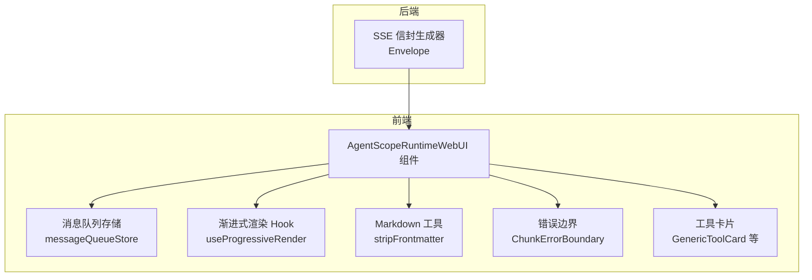
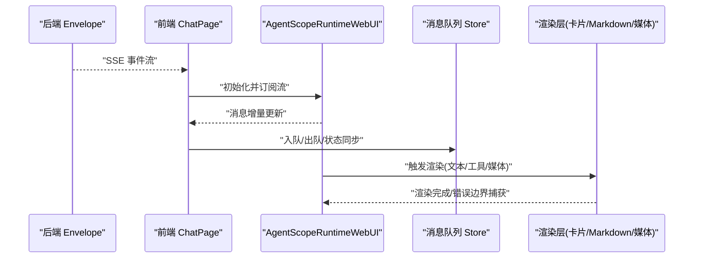
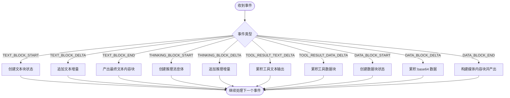
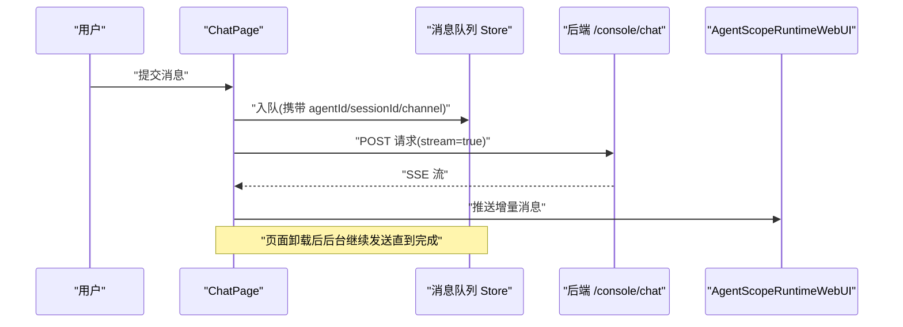
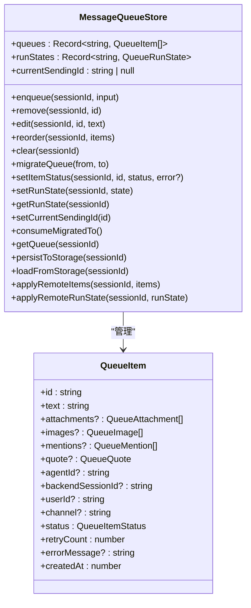
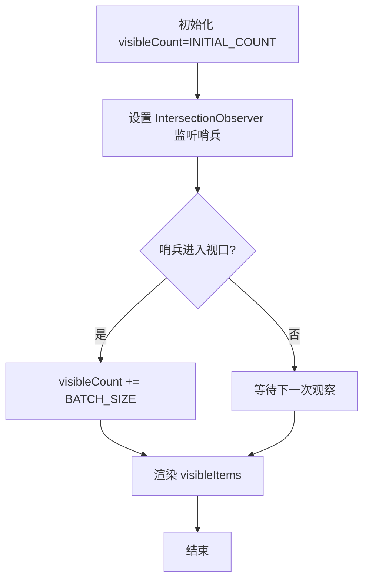
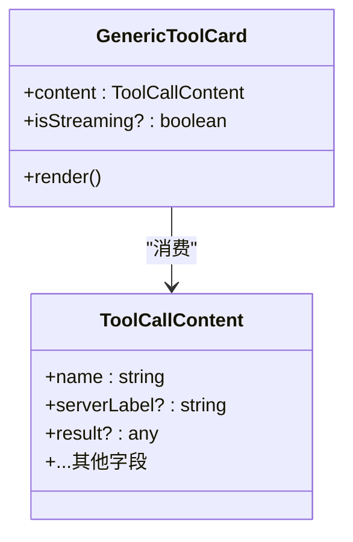
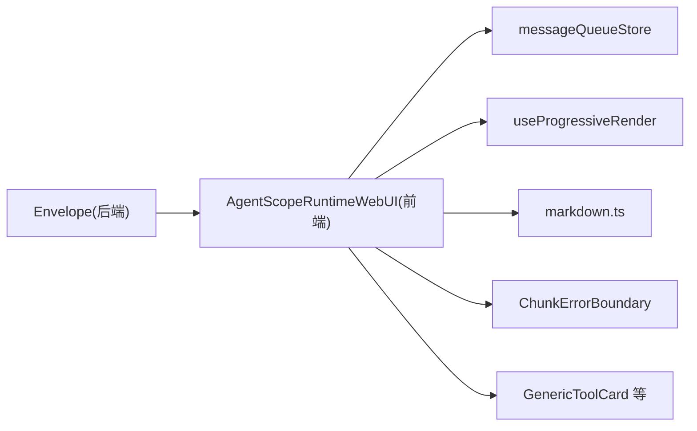

# 消息渲染系统

<cite>
**本文引用的文件**
- [console/src/pages/Chat/index.tsx](file://console/src/pages/Chat/index.tsx)
- [src/qwenpaw/runtime/envelope.py](file://src/qwenpaw/runtime/envelope.py)
- [console/src/hooks/useProgressiveRender.ts](file://console/src/hooks/useProgressiveRender.ts)
- [console/src/stores/messageQueueStore.ts](file://console/src/stores/messageQueueStore.ts)
- [console/src/utils/markdown.ts](file://console/src/utils/markdown.ts)
- [console/src/components/ChunkErrorBoundary.tsx](file://console/src/components/ChunkErrorBoundary.tsx)
- [console/src/components/Chat/ToolCards/cards/GenericToolCard.tsx](file://console/src/components/Chat/ToolCards/cards/GenericToolCard.tsx)
</cite>

## 目录
1. [简介](#简介)
2. [项目结构](#项目结构)
3. [核心组件](#核心组件)
4. [架构总览](#架构总览)
5. [详细组件分析](#详细组件分析)
6. [依赖关系分析](#依赖关系分析)
7. [性能考虑](#性能考虑)
8. [故障排查指南](#故障排查指南)
9. [结论](#结论)
10. [附录](#附录)

## 简介
本文件聚焦 QwenPaw 聊天界面的“消息渲染系统”，系统性阐述从后端流式事件到前端渲染的完整链路，包括：
- 流式响应处理与 SSE 信封协议
- Markdown 渲染与代码高亮（含前导元数据清理）
- 工具调用卡片、文件附件与媒体预览
- AgentScopeRuntimeWebUI 集成方式
- 消息队列管理（跨标签页、持久化、后台发送）
- 错误边界与健壮性策略
- 大消息与长列表的性能优化方案
- 常见问题与解决方案（内存泄漏防护、跨浏览器兼容等）

## 项目结构
围绕消息渲染的关键路径涉及前后端协作：
- 后端：将 AgentScope 的事件转换为前端可消费的 SSE 信封对象（文本块、推理块、工具调用、数据块等）。
- 前端：通过 SDK 组件消费流式数据，结合本地状态与 UI 组件完成渲染；同时提供渐进式渲染、错误边界与消息队列能力。

图表来源
- [src/qwenpaw/runtime/envelope.py:117-159](file://src/qwenpaw/runtime/envelope.py#L117-L159)
- [console/src/pages/Chat/index.tsx:1-120](file://console/src/pages/Chat/index.tsx#L1-L120)
- [console/src/hooks/useProgressiveRender.ts:1-52](file://console/src/hooks/useProgressiveRender.ts#L1-L52)
- [console/src/utils/markdown.ts:1-10](file://console/src/utils/markdown.ts#L1-L10)
- [console/src/components/ChunkErrorBoundary.tsx](file://console/src/components/ChunkErrorBoundary.tsx)
- [console/src/components/Chat/ToolCards/cards/GenericToolCard.tsx:1-44](file://console/src/components/Chat/ToolCards/cards/GenericToolCard.tsx#L1-L44)

章节来源
- [console/src/pages/Chat/index.tsx:1-120](file://console/src/pages/Chat/index.tsx#L1-L120)
- [src/qwenpaw/runtime/envelope.py:117-159](file://src/qwenpaw/runtime/envelope.py#L117-L159)

## 核心组件
- 后端 SSE 信封生成器：负责将 AgentScope 内部事件（文本块、推理块、工具结果、数据块等）翻译为前端期望的消息体与内容块，并维护会话级状态。
- 前端聊天页面：集成 AgentScopeRuntimeWebUI，编排会话初始化、模型选择、审批交互、消息历史导航、多模态能力探测、以及后台消息队列发送。
- 消息队列存储：基于 Zustand 实现，支持跨标签页同步、持久化、发送锁、运行状态控制与迁移。
- 渐进式渲染 Hook：使用 IntersectionObserver 对长列表进行分批加载，避免一次性渲染导致卡顿。
- Markdown 工具：在渲染前剥离 YAML frontmatter，避免被当作水平线或纯文本渲染。
- 错误边界：捕获组件树中的异常，防止整页崩溃。
- 工具卡片：通用与专用卡片组合，展示工具执行过程与结果。

章节来源
- [console/src/pages/Chat/index.tsx:1-120](file://console/src/pages/Chat/index.tsx#L1-L120)
- [console/src/stores/messageQueueStore.ts:287-336](file://console/src/stores/messageQueueStore.ts#L287-L336)
- [console/src/hooks/useProgressiveRender.ts:1-52](file://console/src/hooks/useProgressiveRender.ts#L1-L52)
- [console/src/utils/markdown.ts:1-10](file://console/src/utils/markdown.ts#L1-L10)
- [console/src/components/ChunkErrorBoundary.tsx](file://console/src/components/ChunkErrorBoundary.tsx)
- [console/src/components/Chat/ToolCards/cards/GenericToolCard.tsx:1-44](file://console/src/components/Chat/ToolCards/cards/GenericToolCard.tsx#L1-L44)

## 架构总览
下图展示了从后端事件到前端渲染的主流程，包含流式信封、SDK 消费、队列与渲染增强。

图表来源
- [src/qwenpaw/runtime/envelope.py:117-159](file://src/qwenpaw/runtime/envelope.py#L117-L159)
- [console/src/pages/Chat/index.tsx:1-120](file://console/src/pages/Chat/index.tsx#L1-L120)
- [console/src/stores/messageQueueStore.ts:287-336](file://console/src/stores/messageQueueStore.ts#L287-L336)

## 详细组件分析

### 后端 SSE 信封生成器（Envelope）
- 职责
  - 维护每个请求的状态机：当前消息、文本块、推理块、工具调用、数据块等。
  - 将 AgentScope 事件类型映射为前端消息体与内容块（文本、图片、音频、视频、函数调用输出等）。
  - 按协议顺序产出增量更新与最终完成信号。
- 关键流程
  - 文本块：开始→增量→结束，分别产出对应内容块。
  - 推理块：独立消息体承载 reasoning 内容，增量追加。
  - 工具调用：跟踪 tool_call_id，聚合文本与数据增量，完成后产出 FunctionCallOutput。
  - 数据块：累积 base64 数据，结束时根据 media_type 构造 Image/Audio/Video 内容块。
- 复杂度与性能
  - 增量拼接 O(n)，大数据块仅在结束时组装，减少前端解码压力。
  - 状态字典查找 O(1)，整体线性于事件数量。

图表来源
- [src/qwenpaw/runtime/envelope.py:117-159](file://src/qwenpaw/runtime/envelope.py#L117-L159)
- [src/qwenpaw/runtime/envelope.py:194-215](file://src/qwenpaw/runtime/envelope.py#L194-L215)
- [src/qwenpaw/runtime/envelope.py:216-266](file://src/qwenpaw/runtime/envelope.py#L216-L266)
- [src/qwenpaw/runtime/envelope.py:414-516](file://src/qwenpaw/runtime/envelope.py#L414-L516)
- [src/qwenpaw/runtime/envelope.py:517-580](file://src/qwenpaw/runtime/envelope.py#L517-L580)

章节来源
- [src/qwenpaw/runtime/envelope.py:117-159](file://src/qwenpaw/runtime/envelope.py#L117-L159)
- [src/qwenpaw/runtime/envelope.py:194-215](file://src/qwenpaw/runtime/envelope.py#L194-L215)
- [src/qwenpaw/runtime/envelope.py:216-266](file://src/qwenpaw/runtime/envelope.py#L216-L266)
- [src/qwenpaw/runtime/envelope.py:414-516](file://src/qwenpaw/runtime/envelope.py#L414-L516)
- [src/qwenpaw/runtime/envelope.py:517-580](file://src/qwenpaw/runtime/envelope.py#L517-L580)

### 前端聊天页面与 SDK 集成（ChatPage + AgentScopeRuntimeWebUI）
- 集成要点
  - 引入并挂载 AgentScopeRuntimeWebUI 组件，作为消息渲染与交互的核心容器。
  - 处理 IME 输入、历史消息上下翻、会话初始化、模型与技能选择、审批交互、用量统计等。
  - 多模态能力探测：根据当前模型动态启用图片/视频上传与预览。
- 背景队列发送
  - 当页面卸载时，后台循环仍可按序发送队列项，确保不丢消息。
  - 通过轮询后端状态等待空闲，保证任务顺序与幂等。
  - 使用 AbortController 控制生命周期，并在 fetch 中不传入 signal，使服务端连接不受前台取消影响。
- 用户消息补丁
  - 在后台发送期间缓存最新用户消息，以便重连后正确回填历史。

图表来源
- [console/src/pages/Chat/index.tsx:120-458](file://console/src/pages/Chat/index.tsx#L120-L458)
- [console/src/pages/Chat/index.tsx:1-120](file://console/src/pages/Chat/index.tsx#L1-L120)

章节来源
- [console/src/pages/Chat/index.tsx:120-458](file://console/src/pages/Chat/index.tsx#L120-L458)
- [console/src/pages/Chat/index.tsx:1-120](file://console/src/pages/Chat/index.tsx#L1-L120)

### 消息队列管理（messageQueueStore）
- 功能特性
  - 每会话独立队列与运行状态，支持暂停/恢复/错误标记。
  - 跨标签页同步：BroadcastChannel + storage 事件双通道。
  - 发送锁：Web Locks API 保证单标签页活跃发送，避免重复。
  - 持久化：localStorage 保存队列与 runState，刷新后可恢复。
  - 迁移：会话切换时合并队列并保留顺序。
- 数据结构
  - QueueItem：包含文本、附件、引用、agentId、backendSessionId、状态、重试计数等。
  - PersistedQueue：items + runState。
- 复杂度
  - 入队/编辑/删除均为数组操作，O(n)。
  - 跨标签广播与存储读写为 I/O 操作，注意容量限制与异常容错。

图表来源
- [console/src/stores/messageQueueStore.ts:287-336](file://console/src/stores/messageQueueStore.ts#L287-L336)
- [console/src/stores/messageQueueStore.ts:37-67](file://console/src/stores/messageQueueStore.ts#L37-L67)

章节来源
- [console/src/stores/messageQueueStore.ts:287-336](file://console/src/stores/messageQueueStore.ts#L287-L336)
- [console/src/stores/messageQueueStore.ts:37-67](file://console/src/stores/messageQueueStore.ts#L37-L67)

### 渐进式渲染（useProgressiveRender）
- 目标：对超长列表采用初始可见 + 滚动触发的分批加载，降低首屏渲染成本。
- 机制：IntersectionObserver 监听哨兵元素，进入视口则增加可见数量。
- 适用场景：消息列表、工具调用历史、会话列表等。

图表来源
- [console/src/hooks/useProgressiveRender.ts:1-52](file://console/src/hooks/useProgressiveRender.ts#L1-L52)

章节来源
- [console/src/hooks/useProgressiveRender.ts:1-52](file://console/src/hooks/useProgressiveRender.ts#L1-L52)

### Markdown 渲染与代码高亮
- 前处理：stripFrontmatter 移除 YAML frontmatter，避免被渲染为水平线或纯文本。
- 代码高亮：由上层渲染器（如 XMarkdown/marked 生态）负责，此处仅做必要清洗。
- 建议：对超大文档分片渲染，配合懒加载与虚拟列表。

章节来源
- [console/src/utils/markdown.ts:1-10](file://console/src/utils/markdown.ts#L1-L10)

### 错误边界（ChunkErrorBoundary）
- 作用：捕获组件树内异常，显示降级 UI，避免整页崩溃。
- 建议：记录错误上下文（时间、消息 ID、组件栈），便于定位问题。

章节来源
- [console/src/components/ChunkErrorBoundary.tsx](file://console/src/components/ChunkErrorBoundary.tsx)

### 工具调用卡片（GenericToolCard 及扩展）
- 通用卡片：无内置适配器的工具调用会落入 GenericToolCard，展示名称、执行中状态与结果摘要。
- 扩展点：新增专用卡片需注册到适配器/注册表，遵循统一 ToolCallContent 接口。
- 交互：支持折叠/展开、复制结果、跳转详情等。

图表来源
- [console/src/components/Chat/ToolCards/cards/GenericToolCard.tsx:1-44](file://console/src/components/Chat/ToolCards/cards/GenericToolCard.tsx#L1-L44)

章节来源
- [console/src/components/Chat/ToolCards/cards/GenericToolCard.tsx:1-44](file://console/src/components/Chat/ToolCards/cards/GenericToolCard.tsx#L1-L44)

## 依赖关系分析
- 后端 Envelope 依赖 AgentScope 事件体系与内部 Schema（Message、ContentType、FunctionCallOutput 等）。
- 前端 ChatPage 依赖：
  - AgentScopeRuntimeWebUI SDK（消息渲染与交互）
  - messageQueueStore（队列与跨标签同步）
  - useProgressiveRender（长列表优化）
  - markdown 工具（前处理）
  - 错误边界（健壮性）
  - 工具卡片（工具结果展示）

图表来源
- [src/qwenpaw/runtime/envelope.py:117-159](file://src/qwenpaw/runtime/envelope.py#L117-L159)
- [console/src/pages/Chat/index.tsx:1-120](file://console/src/pages/Chat/index.tsx#L1-L120)
- [console/src/stores/messageQueueStore.ts:287-336](file://console/src/stores/messageQueueStore.ts#L287-L336)
- [console/src/hooks/useProgressiveRender.ts:1-52](file://console/src/hooks/useProgressiveRender.ts#L1-L52)
- [console/src/utils/markdown.ts:1-10](file://console/src/utils/markdown.ts#L1-L10)
- [console/src/components/ChunkErrorBoundary.tsx](file://console/src/components/ChunkErrorBoundary.tsx)
- [console/src/components/Chat/ToolCards/cards/GenericToolCard.tsx:1-44](file://console/src/components/Chat/ToolCards/cards/GenericToolCard.tsx#L1-L44)

章节来源
- [src/qwenpaw/runtime/envelope.py:117-159](file://src/qwenpaw/runtime/envelope.py#L117-L159)
- [console/src/pages/Chat/index.tsx:1-120](file://console/src/pages/Chat/index.tsx#L1-L120)
- [console/src/stores/messageQueueStore.ts:287-336](file://console/src/stores/messageQueueStore.ts#L287-L336)
- [console/src/hooks/useProgressiveRender.ts:1-52](file://console/src/hooks/useProgressiveRender.ts#L1-L52)
- [console/src/utils/markdown.ts:1-10](file://console/src/utils/markdown.ts#L1-L10)
- [console/src/components/ChunkErrorBoundary.tsx](file://console/src/components/ChunkErrorBoundary.tsx)
- [console/src/components/Chat/ToolCards/cards/GenericToolCard.tsx:1-44](file://console/src/components/Chat/ToolCards/cards/GenericToolCard.tsx#L1-L44)

## 性能考虑
- 流式增量渲染
  - 后端仅在必要时产出增量，数据块延迟至结束再组装，减少前端解码与布局抖动。
- 长列表优化
  - 使用 IntersectionObserver 分批加载，避免一次性渲染大量节点。
- 网络与并发
  - 后台发送使用轮询等待空闲，避免并发抢占；fetch 不绑定 AbortSignal，保证服务端完成。
- 内存与资源
  - 及时断开 Observer、移除事件监听；错误边界捕获异常，防止泄漏。
- 兼容性
  - BroadcastChannel 不可用时回退到 storage 事件；Web Locks 不可用时降级为直接执行。

[本节为通用指导，无需具体文件分析]

## 故障排查指南
- 现象：消息未显示或中断
  - 检查后端 SSE 是否持续产出；确认前端 SDK 是否正确订阅与解析。
  - 查看消息队列状态是否为 failed/paused，必要时手动重试。
- 现象：大消息卡顿
  - 启用渐进式渲染；对超长 Markdown 分片渲染；避免在主线程进行重型计算。
- 现象：跨标签页不同步
  - 确认 BroadcastChannel 可用；若不可用，storage 事件应能兜底。
- 现象：内存泄漏
  - 检查 Observer 与事件监听是否在组件卸载时清理；错误边界是否生效。
- 现象：跨浏览器兼容问题
  - Web Locks/BroadcastChannel 可用性差异导致的降级行为是否符合预期。

章节来源
- [console/src/stores/messageQueueStore.ts:597-654](file://console/src/stores/messageQueueStore.ts#L597-L654)
- [console/src/hooks/useProgressiveRender.ts:30-45](file://console/src/hooks/useProgressiveRender.ts#L30-L45)
- [console/src/components/ChunkErrorBoundary.tsx](file://console/src/components/ChunkErrorBoundary.tsx)

## 结论
QwenPaw 的消息渲染系统以后端 SSE 信封为核心，结合前端 SDK 与多种增强能力（队列、渐进渲染、错误边界、工具卡片），实现了稳定、可扩展且高性能的聊天体验。通过清晰的职责划分与完善的容错策略，既满足初学者快速上手，也为高级开发者提供了足够的扩展空间。

[本节为总结，无需具体文件分析]

## 附录
- 自定义消息类型
  - 在后端 Envelope 中新增事件分支，产出新的 Content 类型；在前端注册对应的渲染组件。
- 扩展渲染器
  - 在工具卡片注册表中添加新卡片，遵循 ToolCallContent 接口；必要时在适配器中映射旧版本格式。
- 复杂交互
  - 利用审批上下文与工具卡片的回调能力，实现“批准/拒绝”、“查看详情”、“跳转编辑器”等交互。

[本节为概念性说明，无需具体文件分析]