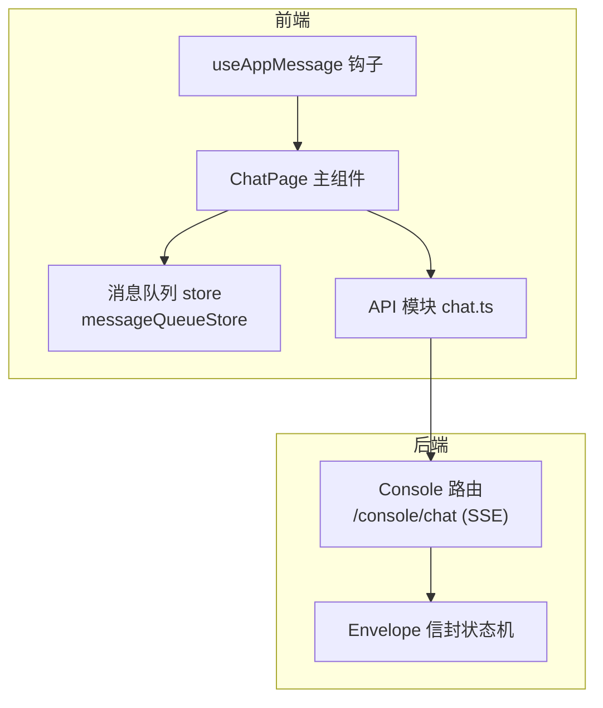
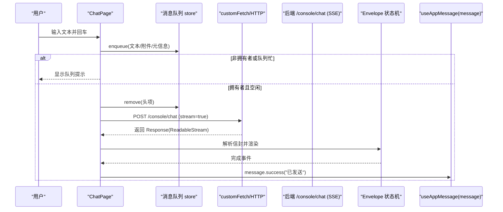
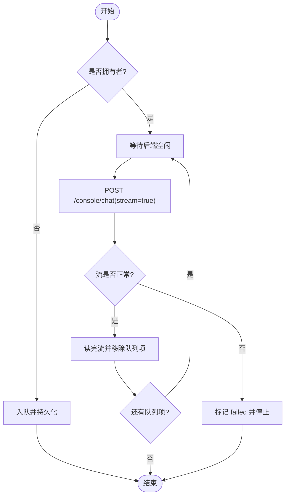
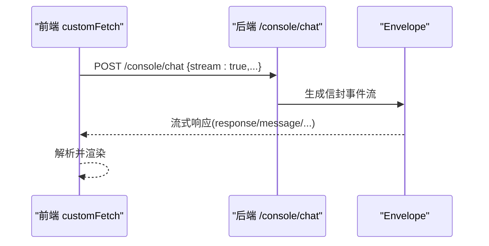
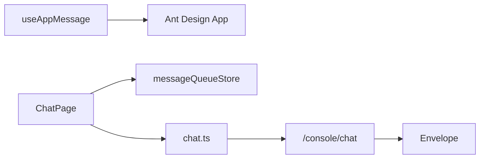

# 应用消息钩子

<cite>
**本文引用的文件**   
- [console/src/hooks/useAppMessage.ts](file://console/src/hooks/useAppMessage.ts)
- [console/src/hooks/useAppMessage.test.ts](file://console/src/hooks/useAppMessage.test.ts)
- [console/src/pages/Chat/index.tsx](file://console/src/pages/Chat/index.tsx)
- [console/src/stores/messageQueueStore.ts](file://console/src/stores/messageQueueStore.ts)
- [console/src/api/modules/chat.ts](file://console/src/api/modules/chat.ts)
- [src/qwenpaw/app/routers/console.py](file://src/qwenpaw/app/routers/console.py)
- [src/qwenpaw/runtime/envelope.py](file://src/qwenpaw/runtime/envelope.py)
</cite>

## 目录
1. [简介](#简介)
2. [项目结构](#项目结构)
3. [核心组件](#核心组件)
4. [架构总览](#架构总览)
5. [详细组件分析](#详细组件分析)
6. [依赖分析](#依赖分析)
7. [性能考虑](#性能考虑)
8. [故障排查指南](#故障排查指南)
9. [结论](#结论)
10. [附录](#附录)

## 简介
本文件围绕 QwenPaw 聊天界面的 useAppMessage 钩子函数，系统梳理前端与后端通信的消息处理机制。内容涵盖：
- 使用 Ant Design App.useApp 获取 message/modal/notification 实例的规范用法
- 基于消息队列（messageQueueStore）的前端发送、接收、错误处理与重连逻辑
- 后端 SSE 流式响应与信封协议（Envelope）的状态机
- 跨标签页同步、持久化、所有权锁与后台发送器
- 消息格式规范、协议版本兼容性与数据校验规则
- 扩展自定义消息类型、加密传输思路与实时通信优化建议
- 常见问题与解决方案（连接中断恢复、消息丢失检测、内存泄漏防护）

## 项目结构
与 useAppMessage 及其消息链路相关的核心位置如下：
- 钩子层：console/src/hooks/useAppMessage.ts
- 测试用例：console/src/hooks/useAppMessage.test.ts
- 聊天页面与队列驱动：console/src/pages/Chat/index.tsx
- 消息队列状态管理：console/src/stores/messageQueueStore.ts
- 前端 API 封装：console/src/api/modules/chat.ts
- 后端路由（SSE 流式）：src/qwenpaw/app/routers/console.py
- 后端信封协议（SSE envelope）：src/qwenpaw/runtime/envelope.py



图表来源
- [console/src/hooks/useAppMessage.ts:12-15](file://console/src/hooks/useAppMessage.ts#L12-L15)
- [console/src/pages/Chat/index.tsx:1079-1120](file://console/src/pages/Chat/index.tsx#L1079-L1120)
- [console/src/stores/messageQueueStore.ts:291-335](file://console/src/stores/messageQueueStore.ts#L291-L335)
- [console/src/api/modules/chat.ts:21-40](file://console/src/api/modules/chat.ts#L21-L40)
- [src/qwenpaw/app/routers/console.py:181-219](file://src/qwenpaw/app/routers/console.py#L181-L219)
- [src/qwenpaw/runtime/envelope.py:27-51](file://src/qwenpaw/runtime/envelope.py#L27-L51)

章节来源
- [console/src/hooks/useAppMessage.ts:12-15](file://console/src/hooks/useAppMessage.ts#L12-L15)
- [console/src/hooks/useAppMessage.test.ts:16-83](file://console/src/hooks/useAppMessage.test.ts#L16-L83)
- [console/src/pages/Chat/index.tsx:1079-1120](file://console/src/pages/Chat/index.tsx#L1079-L1120)
- [console/src/stores/messageQueueStore.ts:291-335](file://console/src/stores/messageQueueStore.ts#L291-L335)
- [console/src/api/modules/chat.ts:21-40](file://console/src/api/modules/chat.ts#L21-L40)
- [src/qwenpaw/app/routers/console.py:181-219](file://src/qwenpaw/app/routers/console.py#L181-L219)
- [src/qwenpaw/runtime/envelope.py:27-51](file://src/qwenpaw/runtime/envelope.py#L27-L51)

## 核心组件
- useAppMessage 钩子
  - 作用：从 Ant Design 的 App 上下文获取 message、modal、notification 实例，确保与 ConfigProvider 的 prefixCls 一致，避免静态导入导致的样式不一致问题。
  - 返回值：{ message, modal, notification }
  - 典型用法：在 ChatPage 中用于展示成功/失败提示、警告等。

- 消息队列 store（messageQueueStore）
  - 职责：按会话维护待发消息队列；支持增删改查、排序、迁移、暂停/继续、重试、跨标签页广播、localStorage 持久化、Web Locks 所有权控制。
  - 关键能力：
    - 入队/出队、状态机（pending/sending/failed/sent）
    - 跨标签页同步（BroadcastChannel + storage 事件）
    - 单会话发送锁（Web Locks）
    - 持久化与向后兼容（sessionStorage → localStorage 迁移）

- 聊天页面（ChatPage）
  - 负责：用户输入拦截（Enter/Ctrl+Enter）、队列调度、后台发送器、与 SDK 的 customFetch 对接、审批卡片交互、历史面板与多模态能力探测等。
  - 与 useAppMessage 集成：通过 message.success/warning/error 反馈操作结果。

- 后端 Console 路由与信封协议
  - /console/chat 提供 SSE 流式响应；Envelope 将内部事件转换为前端期望的流式信封序列，包含 response、message、text/data 等内容块。

章节来源
- [console/src/hooks/useAppMessage.ts:12-15](file://console/src/hooks/useAppMessage.ts#L12-L15)
- [console/src/stores/messageQueueStore.ts:291-335](file://console/src/stores/messageQueueStore.ts#L291-L335)
- [console/src/pages/Chat/index.tsx:1705-1743](file://console/src/pages/Chat/index.tsx#L1705-L1743)
- [src/qwenpaw/app/routers/console.py:181-219](file://src/qwenpaw/app/routers/console.py#L181-L219)
- [src/qwenpaw/runtime/envelope.py:27-51](file://src/qwenpaw/runtime/envelope.py#L27-L51)

## 架构总览
下图展示了从用户输入到后端流式响应的完整链路，以及 useAppMessage 在其中的角色。



图表来源
- [console/src/pages/Chat/index.tsx:1781-1842](file://console/src/pages/Chat/index.tsx#L1781-L1842)
- [console/src/stores/messageQueueStore.ts:346-397](file://console/src/stores/messageQueueStore.ts#L346-L397)
- [console/src/api/modules/chat.ts:21-40](file://console/src/api/modules/chat.ts#L21-L40)
- [src/qwenpaw/app/routers/console.py:181-219](file://src/qwenpaw/app/routers/console.py#L181-L219)
- [src/qwenpaw/runtime/envelope.py:27-51](file://src/qwenpaw/runtime/envelope.py#L27-L51)

## 详细组件分析

### useAppMessage 钩子
- 设计动机
  - 使用 App.useApp 而非静态 import，保证 message/modal/notification 遵循全局 ConfigProvider 的 prefixCls，避免样式错乱。
- 行为契约
  - 每次渲染调用一次 App.useApp，返回最新实例引用。
  - 不改变任何业务逻辑，仅做上下文透传。
- 测试要点
  - 验证返回对象为 App.useApp 的原样引用
  - 验证每渲染一次调用一次 App.useApp
  - 验证重新渲染时返回新实例

```mermaid
classDiagram
class UseAppMessage {
+返回 { message, modal, notification }
}
class AntdApp {
+useApp()
}
UseAppMessage --> AntdApp : "读取上下文"
```

图表来源
- [console/src/hooks/useAppMessage.ts:12-15](file://console/src/hooks/useAppMessage.ts#L12-L15)
- [console/src/hooks/useAppMessage.test.ts:21-82](file://console/src/hooks/useAppMessage.test.ts#L21-L82)

章节来源
- [console/src/hooks/useAppMessage.ts:12-15](file://console/src/hooks/useAppMessage.ts#L12-L15)
- [console/src/hooks/useAppMessage.test.ts:16-83](file://console/src/hooks/useAppMessage.test.ts#L16-L83)

### 消息队列与后台发送器
- 入队策略
  - 限制最大队列长度（MAX_QUEUE_SIZE），超过则拒绝并提示。
  - 入队时捕获 agentId 与 backendSessionId，防止切换 Agent 后发错会话。
- 发送流程
  - 拥有者标签页优先发送；非拥有者仅入队。
  - 等待后端“空闲”后再发送下一条，保持顺序。
  - 后台发送器在页面卸载后仍可持续发送，直到完成或失败。
- 错误与重试
  - 失败项标记 failed，保留在队列中供用户重试。
  - 支持手动重试、跳过、暂停/继续、清空等操作。
- 跨标签页与持久化
  - BroadcastChannel 即时同步；storage 事件兜底。
  - localStorage 持久化，支持旧版 sessionStorage 迁移。
- 并发控制
  - Web Locks 保证同一会话只有一个标签页持有发送权。



图表来源
- [console/src/pages/Chat/index.tsx:239-396](file://console/src/pages/Chat/index.tsx#L239-L396)
- [console/src/stores/messageQueueStore.ts:346-397](file://console/src/stores/messageQueueStore.ts#L346-L397)
- [console/src/stores/messageQueueStore.ts:215-285](file://console/src/stores/messageQueueStore.ts#L215-L285)

章节来源
- [console/src/pages/Chat/index.tsx:1705-1743](file://console/src/pages/Chat/index.tsx#L1705-L1743)
- [console/src/stores/messageQueueStore.ts:291-335](file://console/src/stores/messageQueueStore.ts#L291-L335)
- [console/src/stores/messageQueueStore.ts:346-397](file://console/src/stores/messageQueueStore.ts#L346-L397)
- [console/src/stores/messageQueueStore.ts:215-285](file://console/src/stores/messageQueueStore.ts#L215-L285)

### 前端请求与后端 SSE 流
- 前端 customFetch
  - 组装请求体（input、session_id、user_id、channel、stream=true），附加认证头。
  - 将最后一条用户消息缓存到 sessionApi，以便断线重连时重建用户卡片。
  - 返回包装后的 Response，交由上层 SDK 解析流式信封。
- 后端 Console 路由
  - 解析请求，创建/定位会话，启动任务追踪，返回 StreamingResponse。
  - 支持 reconnect 参数以附着到正在运行的流。
- 信封协议（Envelope）
  - 将内部事件映射为前端期望的 response/message/text/data 等对象序列。
  - 维护 per-request 状态（文本块、推理块、工具调用等）。



图表来源
- [console/src/pages/Chat/index.tsx:2200-2312](file://console/src/pages/Chat/index.tsx#L2200-L2312)
- [src/qwenpaw/app/routers/console.py:181-219](file://src/qwenpaw/app/routers/console.py#L181-L219)
- [src/qwenpaw/runtime/envelope.py:27-51](file://src/qwenpaw/runtime/envelope.py#L27-L51)

章节来源
- [console/src/pages/Chat/index.tsx:2200-2312](file://console/src/pages/Chat/index.tsx#L2200-L2312)
- [src/qwenpaw/app/routers/console.py:181-219](file://src/qwenpaw/app/routers/console.py#L181-L219)
- [src/qwenpaw/runtime/envelope.py:27-51](file://src/qwenpaw/runtime/envelope.py#L27-L51)

### 消息格式规范与兼容性
- 请求体关键字段
  - input: 消息数组，role/content 结构
  - session_id/user_id/channel: 会话与身份标识
  - stream: true 启用流式
  - biz_params: 扩展参数（如审批级别）
- 响应信封
  - object: "response"/"message"
  - status: "created"/"running"/"completed" 等
  - output: 消息输出数组，包含 text/data 等 content
- 兼容性
  - 后端支持 reconnect 参数以附着已有流
  - 前端对旧版存储格式进行一次性迁移（Array → PersistedQueue）

章节来源
- [console/src/pages/Chat/index.tsx:2242-2270](file://console/src/pages/Chat/index.tsx#L2242-L2270)
- [src/qwenpaw/app/routers/console.py:181-219](file://src/qwenpaw/app/routers/console.py#L181-L219)
- [console/src/stores/messageQueueStore.ts:86-115](file://console/src/stores/messageQueueStore.ts#L86-L115)

### 数据校验与错误处理
- 前端
  - 队列满时拒绝入队并提示
  - 上传前检查模型多模态能力与文件大小限制
  - 网络异常时标记 failed，保留在队列中
- 后端
  - 会话不存在或通道不可用时返回错误码
  - 请求体解析失败返回 400

章节来源
- [console/src/pages/Chat/index.tsx:1812-1816](file://console/src/pages/Chat/index.tsx#L1812-L1816)
- [console/src/pages/Chat/index.tsx:2324-2367](file://console/src/pages/Chat/index.tsx#L2324-L2367)
- [src/qwenpaw/app/routers/console.py:195-205](file://src/qwenpaw/app/routers/console.py#L195-L205)

### 扩展自定义消息类型
- 前端扩展点
  - 在 customFetch 的请求载荷转换处插入 transform，注入自定义字段
  - 在信封解析处增加对新 object/type 的处理分支
- 后端扩展点
  - 在 Envelope 状态机中新增事件映射，输出新的信封片段
  - 在路由层解析 biz_params 中的自定义键值

章节来源
- [console/src/pages/Chat/index.tsx:2252-2263](file://console/src/pages/Chat/index.tsx#L2252-L2263)
- [src/qwenpaw/runtime/envelope.py:27-51](file://src/qwenpaw/runtime/envelope.py#L27-L51)

### 消息加密传输（建议方案）
- 端到端加密
  - 前端使用 WebCrypto 对 payload 签名/加密，后端验签/解密
- 传输层安全
  - 强制 HTTPS/WSS，证书校验
- 密钥轮换
  - 定期轮换对称密钥，短生命周期 token 鉴权

[本节为通用建议，不直接分析具体文件]

### 实时通信性能优化（建议）
- 批处理与节流
  - 批量合并小消息，减少请求次数
- 流式渲染
  - 利用 SSE 增量渲染，降低首屏延迟
- 资源复用
  - 合理复用 AbortController，避免重复建立连接
- 缓存与去抖
  - 对查询接口加缓存，输入框防抖

[本节为通用建议，不直接分析具体文件]

## 依赖分析
- 组件耦合
  - useAppMessage 仅依赖 Ant Design App 上下文，无业务耦合
  - ChatPage 强依赖 messageQueueStore、chat.ts、后端路由与信封协议
- 外部依赖
  - Ant Design（UI 通知）
  - Fetch API（HTTP/SSE）
  - BroadcastChannel/Web Locks（跨标签页与并发控制）
  - localStorage/sessionStorage（持久化）



图表来源
- [console/src/hooks/useAppMessage.ts:12-15](file://console/src/hooks/useAppMessage.ts#L12-L15)
- [console/src/pages/Chat/index.tsx:1079-1120](file://console/src/pages/Chat/index.tsx#L1079-L1120)
- [console/src/stores/messageQueueStore.ts:291-335](file://console/src/stores/messageQueueStore.ts#L291-L335)
- [console/src/api/modules/chat.ts:21-40](file://console/src/api/modules/chat.ts#L21-L40)
- [src/qwenpaw/app/routers/console.py:181-219](file://src/qwenpaw/app/routers/console.py#L181-L219)
- [src/qwenpaw/runtime/envelope.py:27-51](file://src/qwenpaw/runtime/envelope.py#L27-L51)

章节来源
- [console/src/hooks/useAppMessage.ts:12-15](file://console/src/hooks/useAppMessage.ts#L12-L15)
- [console/src/pages/Chat/index.tsx:1079-1120](file://console/src/pages/Chat/index.tsx#L1079-L1120)
- [console/src/stores/messageQueueStore.ts:291-335](file://console/src/stores/messageQueueStore.ts#L291-L335)
- [console/src/api/modules/chat.ts:21-40](file://console/src/api/modules/chat.ts#L21-L40)
- [src/qwenpaw/app/routers/console.py:181-219](file://src/qwenpaw/app/routers/console.py#L181-L219)
- [src/qwenpaw/runtime/envelope.py:27-51](file://src/qwenpaw/runtime/envelope.py#L27-L51)

## 性能考虑
- 使用流式响应减少长轮询开销
- 队列项大小限制与批量发送
- 跨标签页广播最小化负载（仅广播必要变更）
- 避免不必要的 re-render（如审批列表稳定 key）

[本节为通用建议，不直接分析具体文件]

## 故障排查指南
- 连接中断恢复
  - 现象：流中断导致未收到后续片段
  - 排查：确认后端 reconnect 参数与前端是否在断开后重建连接
  - 参考：后端路由说明与前端 customFetch 的信号传递
- 消息丢失检测
  - 现象：刷新后队列项消失或未发送
  - 排查：检查 localStorage 是否写入成功、跨标签页广播是否生效、Web Locks 是否被占用
- 内存泄漏防护
  - 现象：长时间运行后内存增长
  - 排查：确保 useEffect 清理定时器/监听器、AbortController 正确释放、后台发送器在卸载时停止

章节来源
- [src/qwenpaw/app/routers/console.py:181-219](file://src/qwenpaw/app/routers/console.py#L181-L219)
- [console/src/pages/Chat/index.tsx:1705-1743](file://console/src/pages/Chat/index.tsx#L1705-L1743)
- [console/src/stores/messageQueueStore.ts:597-653](file://console/src/stores/messageQueueStore.ts#L597-L653)

## 结论
useAppMessage 钩子以最小侵入方式统一了 UI 通知实例的来源，配合消息队列与 SSE 流式响应，实现了高可靠、可观测、可扩展的聊天消息链路。通过跨标签页同步、持久化与所有权锁，系统在复杂场景下仍能保持稳定与一致性。建议在扩展消息类型与安全性方面采用前述建议方案，并结合实际业务持续优化性能与可维护性。

## 附录
- 常用 API 路径
  - 发送聊天（SSE）：POST /console/chat
  - 停止聊天：POST /console/chat/stop?chat_id=...
  - 文件上传：POST /console/upload
  - 预览文件：GET /files/preview/{filename}?token=...

章节来源
- [console/src/api/modules/chat.ts:21-40](file://console/src/api/modules/chat.ts#L21-L40)
- [console/src/api/modules/chat.ts:96-100](file://console/src/api/modules/chat.ts#L96-L100)
- [src/qwenpaw/app/routers/console.py:181-219](file://src/qwenpaw/app/routers/console.py#L181-L219)