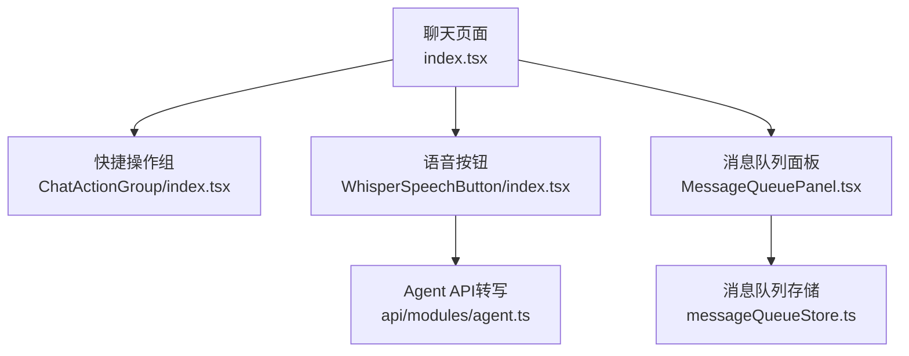
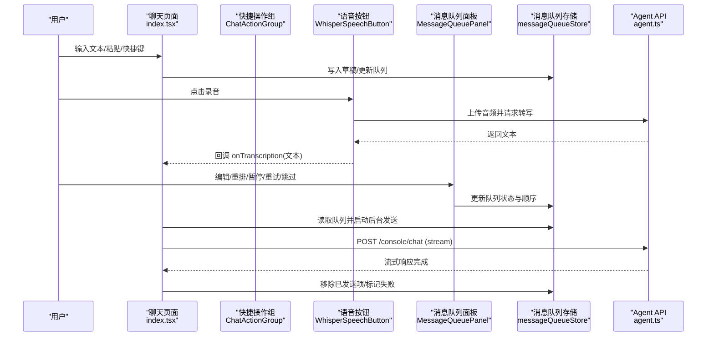
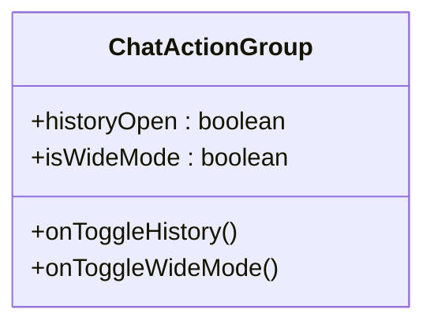
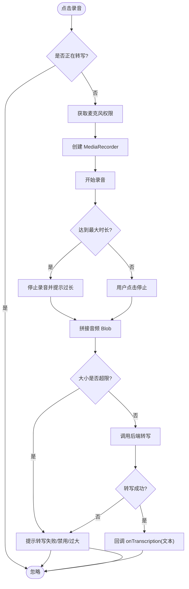
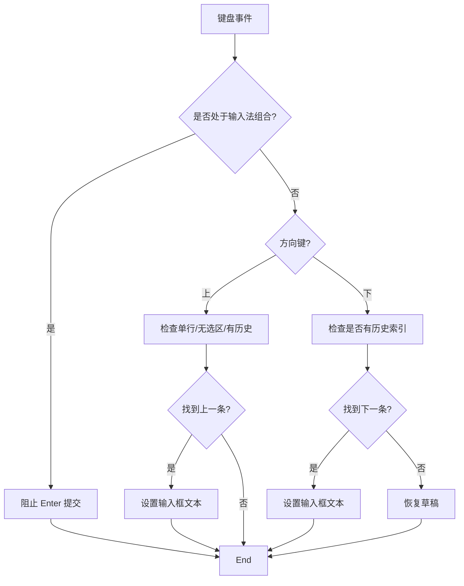
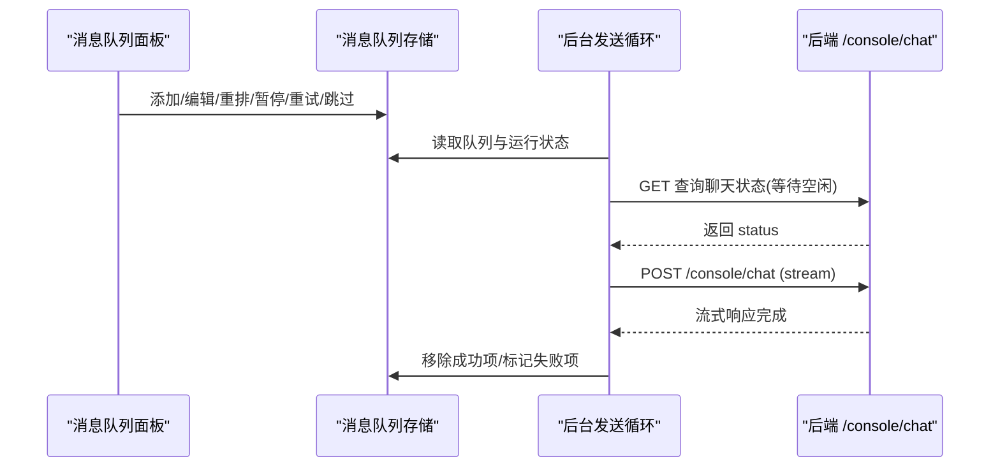
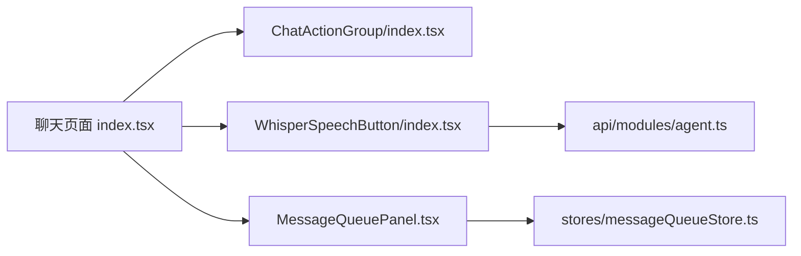

# 用户交互

<cite>
**本文引用的文件**
- [console/src/pages/Chat/index.tsx](file://console/src/pages/Chat/index.tsx)
- [console/src/pages/Chat/components/ChatActionGroup/index.tsx](file://console/src/pages/Chat/components/ChatActionGroup/index.tsx)
- [console/src/pages/Chat/components/WhisperSpeechButton/index.tsx](file://console/src/pages/Chat/components/WhisperSpeechButton/index.tsx)
- [console/src/pages/Chat/components/MessageQueuePanel.tsx](file://console/src/pages/Chat/components/MessageQueuePanel.tsx)
- [console/src/stores/messageQueueStore.ts](file://console/src/stores/messageQueueStore.ts)
- [console/src/api/modules/agent.ts](file://console/src/api/modules/agent.ts)
</cite>

## 目录
1. [简介](#简介)
2. [项目结构](#项目结构)
3. [核心组件](#核心组件)
4. [架构总览](#架构总览)
5. [详细组件分析](#详细组件分析)
6. [依赖关系分析](#依赖关系分析)
7. [性能与体验优化](#性能与体验优化)
8. [故障排查指南](#故障排查指南)
9. [结论](#结论)

## 简介
本文件聚焦 QwenPaw 聊天界面的用户交互系统，围绕输入处理、语音输入、快捷操作与键盘导航展开，深入解析 ChatActionGroup 组件设计、语音识别集成、消息发送控制与快捷键处理机制。文档同时覆盖输入验证、格式化与预处理流程，提供来自实际代码库的示例路径，帮助开发者实现自定义输入组件、扩展快捷操作并优化交互体验。文末包含常见问题与解决方案，如输入法兼容性、移动端适配和无障碍访问支持。

## 项目结构
本节从“页面级”视角梳理与用户交互相关的核心文件与职责：
- 页面主入口：负责组合 SDK 运行时、会话初始化、消息队列后台发送、IME 兼容、历史消息上下翻、草稿持久化、粘贴增强等。
- 快捷操作组：提供新建会话、历史面板切换、宽屏模式切换等按钮，在移动端自动折叠为“更多”下拉。
- 语音输入：基于浏览器 MediaRecorder 录音，调用后端转写接口，将文本回填到输入框。
- 消息队列面板：可视化展示待发送消息，支持编辑、重排、暂停/恢复、重试、跳过、中断并立即发送等。

图表来源
- [console/src/pages/Chat/index.tsx](file://console/src/pages/Chat/index.tsx)
- [console/src/pages/Chat/components/ChatActionGroup/index.tsx](file://console/src/pages/Chat/components/ChatActionGroup/index.tsx)
- [console/src/pages/Chat/components/WhisperSpeechButton/index.tsx](file://console/src/pages/Chat/components/WhisperSpeechButton/index.tsx)
- [console/src/pages/Chat/components/MessageQueuePanel.tsx](file://console/src/pages/Chat/components/MessageQueuePanel.tsx)
- [console/src/stores/messageQueueStore.ts](file://console/src/stores/messageQueueStore.ts)
- [console/src/api/modules/agent.ts](file://console/src/api/modules/agent.ts)

章节来源
- [console/src/pages/Chat/index.tsx](file://console/src/pages/Chat/index.tsx)
- [console/src/pages/Chat/components/ChatActionGroup/index.tsx](file://console/src/pages/Chat/components/ChatActionGroup/index.tsx)
- [console/src/pages/Chat/components/WhisperSpeechButton/index.tsx](file://console/src/pages/Chat/components/WhisperSpeechButton/index.tsx)
- [console/src/pages/Chat/components/MessageQueuePanel.tsx](file://console/src/pages/Chat/components/MessageQueuePanel.tsx)
- [console/src/stores/messageQueueStore.ts](file://console/src/stores/messageQueueStore.ts)
- [console/src/api/modules/agent.ts](file://console/src/api/modules/agent.ts)

## 核心组件
- 聊天页面（index.tsx）
  - IME 兼容：监听 compositionstart/compositionend 与 keydown/keypress，防止中文输入法下误触回车提交。
  - 历史消息导航：在输入框中通过上/下箭头遍历历史用户消息，支持光标位置判断与多行保护。
  - 草稿持久化：按 agentId 维度缓存 textarea 内容与选区，进入页面时轮询恢复。
  - 粘贴增强：当从编码编辑器复制的内容粘贴到聊天输入框时，替换为带路径与行号的格式。
  - 后台队列发送：跨标签页持久化发送，等待后端空闲后顺序发送，失败可重试或跳过。
- 快捷操作组（ChatActionGroup）
  - 桌面端常驻显示“新建会话”“历史面板”“宽屏模式”；移动端自动折叠为“更多”下拉。
  - 使用 i18n 文案与 Tooltip 提示，提升可发现性。
- 语音输入（WhisperSpeechButton）
  - 使用 MediaRecorder 采集音频，限制最大时长与文件大小，调用后端转写接口，错误分类提示。
  - 暴露 ref 方法供外部控制录制状态。
- 消息队列面板（MessageQueuePanel）
  - 列表展示待发送项，支持拖拽排序、内联编辑、暂停/恢复、重试、跳过、删除、中断并立即发送。
  - 状态条颜色区分 pending/sending/failed，悬停显示操作按钮。

章节来源
- [console/src/pages/Chat/index.tsx](file://console/src/pages/Chat/index.tsx)
- [console/src/pages/Chat/components/ChatActionGroup/index.tsx](file://console/src/pages/Chat/components/ChatActionGroup/index.tsx)
- [console/src/pages/Chat/components/WhisperSpeechButton/index.tsx](file://console/src/pages/Chat/components/WhisperSpeechButton/index.tsx)
- [console/src/pages/Chat/components/MessageQueuePanel.tsx](file://console/src/pages/Chat/components/MessageQueuePanel.tsx)

## 架构总览
下图展示了用户交互的关键数据流与控制流：从输入与语音到消息队列，再到后台发送与 UI 反馈。

图表来源
- [console/src/pages/Chat/index.tsx](file://console/src/pages/Chat/index.tsx)
- [console/src/pages/Chat/components/ChatActionGroup/index.tsx](file://console/src/pages/Chat/components/ChatActionGroup/index.tsx)
- [console/src/pages/Chat/components/WhisperSpeechButton/index.tsx](file://console/src/pages/Chat/components/WhisperSpeechButton/index.tsx)
- [console/src/pages/Chat/components/MessageQueuePanel.tsx](file://console/src/pages/Chat/components/MessageQueuePanel.tsx)
- [console/src/stores/messageQueueStore.ts](file://console/src/stores/messageQueueStore.ts)
- [console/src/api/modules/agent.ts](file://console/src/api/modules/agent.ts)

## 详细组件分析

### 快捷操作组 ChatActionGroup
- 设计要点
  - 根据移动端检测决定是否折叠次要操作至“更多”菜单。
  - 提供“新建会话”“历史面板切换”“宽屏模式切换”三个主要动作。
  - 使用 Tooltip 与 i18n 文案，确保可访问性与国际化。
- 关键行为
  - 历史记录开关：onToggleHistory + historyOpen 控制右侧面板显隐。
  - 宽屏模式：isWideMode + onToggleWideMode 控制内容宽度。
  - 新建会话：useCreateNewSession 钩子触发创建。

图表来源
- [console/src/pages/Chat/components/ChatActionGroup/index.tsx](file://console/src/pages/Chat/components/ChatActionGroup/index.tsx)

章节来源
- [console/src/pages/Chat/components/ChatActionGroup/index.tsx](file://console/src/pages/Chat/components/ChatActionGroup/index.tsx)

### 语音输入 WhisperSpeechButton
- 功能概述
  - 使用浏览器 MediaRecorder 采集音频，默认优先 audio/webm，回退 audio/mp4。
  - 限制最大录音时长（5 分钟），并在停止后校验文件大小是否超过上传上限。
  - 调用后端转写接口，成功则将文本回填到输入框，失败则分类提示。
- 状态与交互
  - loading：转写中禁用按钮，显示加载图标。
  - recording：录音中显示动态波形图标，再次点击停止。
  - 暴露 ref：toggleRecording/isRecording/isLoading，便于父组件控制。

图表来源
- [console/src/pages/Chat/components/WhisperSpeechButton/index.tsx](file://console/src/pages/Chat/components/WhisperSpeechButton/index.tsx)
- [console/src/api/modules/agent.ts](file://console/src/api/modules/agent.ts)

章节来源
- [console/src/pages/Chat/components/WhisperSpeechButton/index.tsx](file://console/src/pages/Chat/components/WhisperSpeechButton/index.tsx)
- [console/src/api/modules/agent.ts](file://console/src/api/modules/agent.ts)

### 输入处理与键盘导航
- IME 兼容
  - 监听 compositionstart/compositionend 与 keydown/keypress，在输入法组合期间阻止 Enter 提交，避免中文输入被截断。
- 历史消息导航
  - 在输入框中按上/下箭头遍历历史用户消息，仅在单行且无选区时生效；首次上翻保存当前草稿，下翻到底恢复草稿。
- 草稿持久化
  - 按 agentId 维度将 textarea 内容与选区保存到 localStorage，进入页面时轮询恢复，未发送前离开页面也会保存。
- 粘贴增强
  - 若粘贴内容为最近从编码编辑器复制的片段，将其替换为“路径:行号[-行号]”格式，并保留可选的代码围栏。

图表来源
- [console/src/pages/Chat/index.tsx](file://console/src/pages/Chat/index.tsx)

章节来源
- [console/src/pages/Chat/index.tsx](file://console/src/pages/Chat/index.tsx)

### 消息发送控制与后台队列
- 前台发送
  - 通过 SDK 的输入提交回调组装 content（文本+附件），携带 session_id、user_id、channel 等字段，开启 stream 模式。
- 后台队列
  - 每个会话独立队列，支持跨标签页持久化；仅一个标签持有发送锁，避免重复发送。
  - 发送前轮询后端状态，等待当前任务结束（status !== running）再发送下一项，保证顺序。
  - 发送过程中将用户文本与附件镜像到 lastUserMessage，以便页面重新挂载时能正确显示。
  - 失败项保留 failed 状态与错误信息，支持重试或跳过；成功完成后从队列移除。
- 队列面板
  - 提供编辑、重排、暂停/恢复、重试、跳过、删除、中断并立即发送等操作。

图表来源
- [console/src/pages/Chat/index.tsx](file://console/src/pages/Chat/index.tsx)
- [console/src/pages/Chat/components/MessageQueuePanel.tsx](file://console/src/pages/Chat/components/MessageQueuePanel.tsx)
- [console/src/stores/messageQueueStore.ts](file://console/src/stores/messageQueueStore.ts)

章节来源
- [console/src/pages/Chat/index.tsx](file://console/src/pages/Chat/index.tsx)
- [console/src/pages/Chat/components/MessageQueuePanel.tsx](file://console/src/pages/Chat/components/MessageQueuePanel.tsx)
- [console/src/stores/messageQueueStore.ts](file://console/src/stores/messageQueueStore.ts)

## 依赖关系分析
- 组件耦合
  - 聊天页面聚合多个能力：IME 兼容、历史导航、草稿持久化、粘贴增强、后台队列、语音输入回调等。
  - 快捷操作组与页面通过 props 解耦，易于复用与测试。
  - 语音按钮与 Agent API 解耦，通过回调将结果注入输入框。
  - 消息队列面板与 store 解耦，通过受控 props 驱动 UI。
- 外部依赖
  - 浏览器 API：MediaRecorder、navigator.mediaDevices.getUserMedia。
  - 后端 API：/console/chat（POST）、转写接口（agent.ts）。
  - 本地存储：localStorage 用于草稿与队列持久化。

图表来源
- [console/src/pages/Chat/index.tsx](file://console/src/pages/Chat/index.tsx)
- [console/src/pages/Chat/components/ChatActionGroup/index.tsx](file://console/src/pages/Chat/components/ChatActionGroup/index.tsx)
- [console/src/pages/Chat/components/WhisperSpeechButton/index.tsx](file://console/src/pages/Chat/components/WhisperSpeechButton/index.tsx)
- [console/src/pages/Chat/components/MessageQueuePanel.tsx](file://console/src/pages/Chat/components/MessageQueuePanel.tsx)
- [console/src/stores/messageQueueStore.ts](file://console/src/stores/messageQueueStore.ts)
- [console/src/api/modules/agent.ts](file://console/src/api/modules/agent.ts)

章节来源
- [console/src/pages/Chat/index.tsx](file://console/src/pages/Chat/index.tsx)
- [console/src/pages/Chat/components/ChatActionGroup/index.tsx](file://console/src/pages/Chat/components/ChatActionGroup/index.tsx)
- [console/src/pages/Chat/components/WhisperSpeechButton/index.tsx](file://console/src/pages/Chat/components/WhisperSpeechButton/index.tsx)
- [console/src/pages/Chat/components/MessageQueuePanel.tsx](file://console/src/pages/Chat/components/MessageQueuePanel.tsx)
- [console/src/stores/messageQueueStore.ts](file://console/src/stores/messageQueueStore.ts)
- [console/src/api/modules/agent.ts](file://console/src/api/modules/agent.ts)

## 性能与体验优化
- 输入体验
  - IME 兼容避免误提交，减少用户挫败感。
  - 历史消息导航与草稿持久化提升连续输入效率。
  - 粘贴增强让从编辑器复制的代码更结构化，便于后续处理。
- 语音体验
  - 自动停止与大小限制避免长时间占用资源与超大文件传输。
  - 错误分类提示明确问题原因，便于用户快速定位。
- 队列发送
  - 等待后端空闲再发送，保证顺序与一致性。
  - 跨标签页持久化与发送锁避免重复与丢失。
  - 失败项保留错误信息，支持重试与跳过，提高容错性。

[本节为通用指导，不直接分析具体文件]

## 故障排查指南
- 输入法导致回车误提交
  - 现象：中文输入时按下回车直接发送，文本不完整。
  - 排查：确认是否监听了 compositionstart/compositionend 与 keydown/keypress，并在组合期间阻止默认行为。
  - 参考实现路径：[console/src/pages/Chat/index.tsx](file://console/src/pages/Chat/index.tsx)
- 语音无法录音或转写失败
  - 现象：点击录音无反应或提示权限错误；转写失败。
  - 排查：检查浏览器权限、MediaRecorder 类型支持、文件大小限制与后端转写配置。
  - 参考实现路径：[console/src/pages/Chat/components/WhisperSpeechButton/index.tsx](file://console/src/pages/Chat/components/WhisperSpeechButton/index.tsx)、[console/src/api/modules/agent.ts](file://console/src/api/modules/agent.ts)
- 队列发送顺序错乱或重复
  - 现象：多条消息未按序发送或重复发送。
  - 排查：确认后台发送循环是否正确等待后端空闲、是否持有发送锁、是否在成功完成后移除队列项。
  - 参考实现路径：[console/src/pages/Chat/index.tsx](file://console/src/pages/Chat/index.tsx)、[console/src/stores/messageQueueStore.ts](file://console/src/stores/messageQueueStore.ts)
- 草稿丢失或未恢复
  - 现象：刷新或切换会话后输入内容丢失。
  - 排查：检查 localStorage 读写逻辑、按 agentId 维度存储、页面挂载时的轮询恢复与最终保存时机。
  - 参考实现路径：[console/src/pages/Chat/index.tsx](file://console/src/pages/Chat/index.tsx)

章节来源
- [console/src/pages/Chat/index.tsx](file://console/src/pages/Chat/index.tsx)
- [console/src/pages/Chat/components/WhisperSpeechButton/index.tsx](file://console/src/pages/Chat/components/WhisperSpeechButton/index.tsx)
- [console/src/api/modules/agent.ts](file://console/src/api/modules/agent.ts)
- [console/src/stores/messageQueueStore.ts](file://console/src/stores/messageQueueStore.ts)

## 结论
QwenPaw 聊天界面的用户交互系统在输入处理、语音输入、快捷操作与键盘导航方面提供了完善的能力与良好的用户体验。通过 IME 兼容、历史导航、草稿持久化、粘贴增强、后台队列与语音转写等机制，既保证了易用性，也兼顾了健壮性与可扩展性。开发者可基于现有组件与流程，快速实现自定义输入组件、扩展快捷操作与优化交互体验。