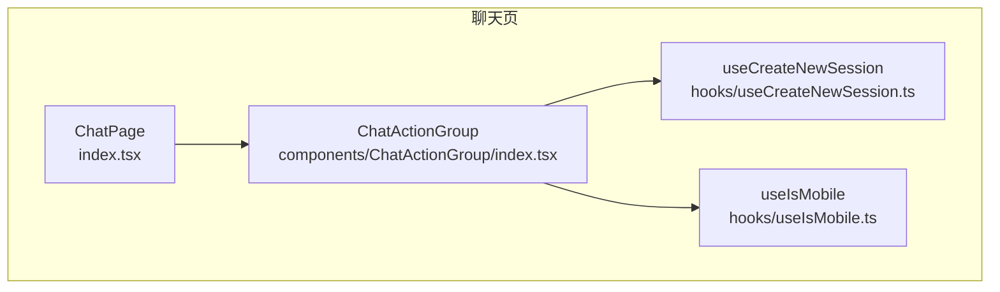
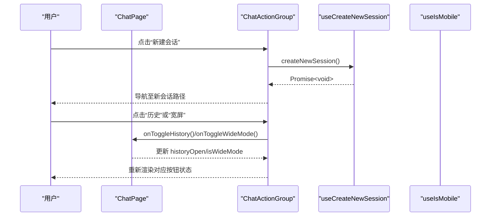
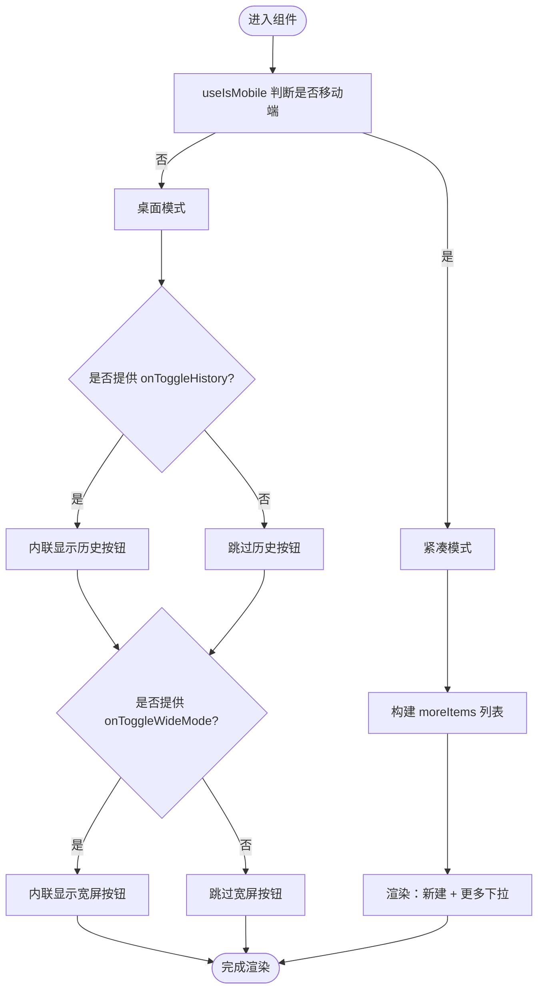
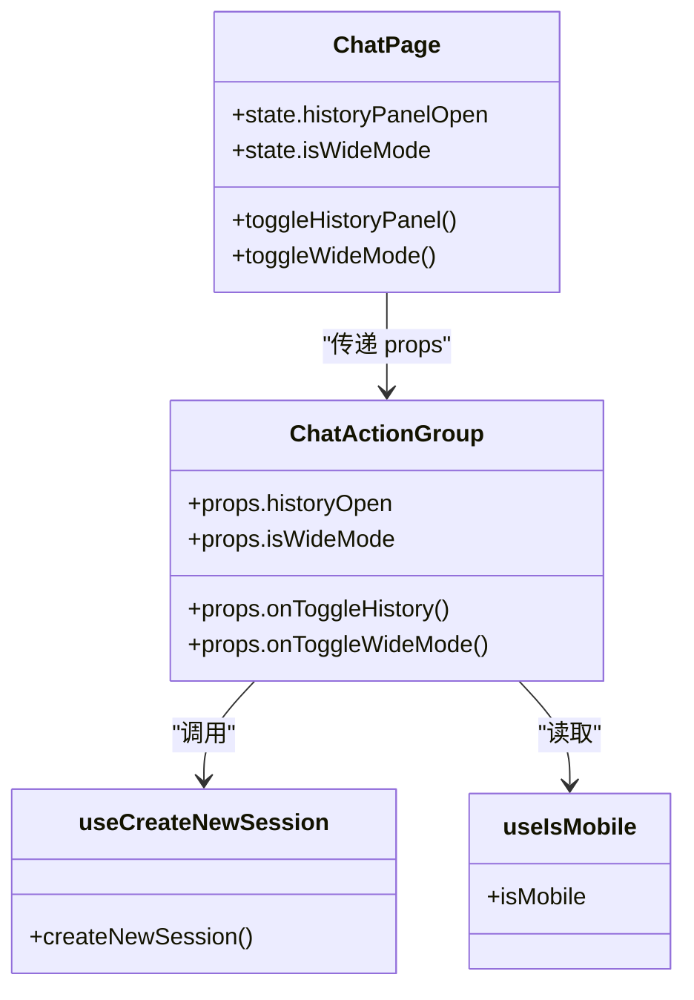

# 聊天动作组

<cite>
**本文引用的文件**
- [console/src/pages/Chat/components/ChatActionGroup/index.tsx](file://console/src/pages/Chat/components/ChatActionGroup/index.tsx)
- [console/src/pages/Chat/components/ChatActionGroup/ChatActionGroup.test.tsx](file://console/src/pages/Chat/components/ChatActionGroup/ChatActionGroup.test.tsx)
- [console/src/pages/Chat/hooks/useCreateNewSession.ts](file://console/src/pages/Chat/hooks/useCreateNewSession.ts)
- [console/src/pages/Chat/index.tsx](file://console/src/pages/Chat/index.tsx)
- [console/src/hooks/useIsMobile.ts](file://console/src/hooks/useIsMobile.ts)
</cite>

## 目录
1. [简介](#简介)
2. [项目结构](#项目结构)
3. [核心组件](#核心组件)
4. [架构总览](#架构总览)
5. [详细组件分析](#详细组件分析)
6. [依赖关系分析](#依赖关系分析)
7. [性能与可访问性](#性能与可访问性)
8. [故障排查指南](#故障排查指南)
9. [结论](#结论)
10. [附录：扩展与集成示例](#附录扩展与集成示例)

## 简介
本文件聚焦于 QwenPaw 聊天界面中的 ChatActionGroup 组件，系统性阐述其设计模式、实现细节与使用方式。内容覆盖响应式布局适配（紧凑模式与宽屏模式）、历史面板控制、新会话创建、Props 接口设计、移动端与桌面端差异化展示策略、Dropdown 菜单动态构建机制，以及扩展自定义动作按钮、集成第三方图标库和优化交互体验的实践建议。同时提供常见问题与解决方案，包括状态同步、国际化支持与无障碍访问。

## 项目结构
ChatActionGroup 位于聊天页面右侧头部区域，作为一组快捷操作入口，负责“新建会话”、“打开/关闭历史面板”和“切换宽屏模式”。在移动端采用紧凑模式，将次要操作折叠到“更多”下拉菜单中；在桌面端则直接内联显示这些按钮。

图表来源
- [console/src/pages/Chat/index.tsx](file://console/src/pages/Chat/index.tsx)
- [console/src/pages/Chat/components/ChatActionGroup/index.tsx](file://console/src/pages/Chat/components/ChatActionGroup/index.tsx)
- [console/src/pages/Chat/hooks/useCreateNewSession.ts](file://console/src/pages/Chat/hooks/useCreateNewSession.ts)
- [console/src/hooks/useIsMobile.ts](file://console/src/hooks/useIsMobile.ts)

章节来源
- [console/src/pages/Chat/index.tsx](file://console/src/pages/Chat/index.tsx)
- [console/src/pages/Chat/components/ChatActionGroup/index.tsx](file://console/src/pages/Chat/components/ChatActionGroup/index.tsx)

## 核心组件
ChatActionGroup 是一个无状态的 React 函数组件，通过 Props 接收外部状态与回调，内部根据设备类型决定渲染策略：
- 始终可见：新建会话按钮
- 条件可见：历史面板开关、宽屏模式开关（非紧凑模式下内联显示）
- 紧凑模式：将历史与宽屏操作合并为“更多”下拉菜单项

关键特性
- 响应式布局：基于 useIsMobile 判断是否处于紧凑模式
- 国际化：所有提示文案通过 i18n 的 t 函数获取
- 可访问性：Tooltip 提供鼠标悬停提示，IconButton 具备语义化点击行为
- 可扩展性：通过 onToggleHistory 与 onToggleWideMode 暴露能力给父组件

章节来源
- [console/src/pages/Chat/components/ChatActionGroup/index.tsx](file://console/src/pages/Chat/components/ChatActionGroup/index.tsx)

## 架构总览
ChatActionGroup 由 ChatPage 注入上下文数据与回调，形成“受控组件”模式：
- ChatPage 维护 historyOpen、isWideMode 等状态，并定义 toggleHistoryPanel、toggleWideMode 回调
- ChatActionGroup 仅消费 props，不持有自身状态，保证 UI 与逻辑解耦
- useCreateNewSession 封装新会话创建流程，避免竞态与重复选择问题
- useIsMobile 驱动紧凑模式分支，确保移动端体验一致

图表来源
- [console/src/pages/Chat/index.tsx](file://console/src/pages/Chat/index.tsx)
- [console/src/pages/Chat/components/ChatActionGroup/index.tsx](file://console/src/pages/Chat/components/ChatActionGroup/index.tsx)
- [console/src/pages/Chat/hooks/useCreateNewSession.ts](file://console/src/pages/Chat/hooks/useCreateNewSession.ts)

## 详细组件分析

### 组件 Props 接口
- onToggleHistory?: () => void
  - 作用：切换右侧历史面板的显示/隐藏
  - 使用方式：由 ChatPage 传入 toggleHistoryPanel 回调
- historyOpen?: boolean
  - 作用：当前历史面板是否可见
  - 使用方式：由 ChatPage 传入 historyPanelOpen 状态
- isWideMode?: boolean
  - 作用：当前是否为宽屏模式
  - 使用方式：由 ChatPage 传入 isWideMode 状态
- onToggleWideMode?: () => void
  - 作用：切换宽屏模式
  - 使用方式：由 ChatPage 传入 toggleWideMode 回调

章节来源
- [console/src/pages/Chat/components/ChatActionGroup/index.tsx](file://console/src/pages/Chat/components/ChatActionGroup/index.tsx)
- [console/src/pages/Chat/index.tsx](file://console/src/pages/Chat/index.tsx)

### 响应式布局与紧凑模式
- 紧凑模式判定：useIsMobile 返回 true 时启用紧凑模式
- 紧凑模式下的行为：
  - 历史与宽屏按钮隐藏
  - 显示“更多”下拉菜单，包含历史与宽屏两个选项
- 非紧凑模式下的行为：
  - 历史与宽屏按钮以内联形式显示
  - 历史按钮根据 historyOpen 高亮显示激活状态

图表来源
- [console/src/pages/Chat/components/ChatActionGroup/index.tsx](file://console/src/pages/Chat/components/ChatActionGroup/index.tsx)
- [console/src/hooks/useIsMobile.ts](file://console/src/hooks/useIsMobile.ts)

章节来源
- [console/src/pages/Chat/components/ChatActionGroup/index.tsx](file://console/src/pages/Chat/components/ChatActionGroup/index.tsx)

### 历史面板控制
- 触发源：ChatActionGroup 的历史按钮点击
- 处理逻辑：调用 onToggleHistory 回调
- 状态管理：ChatPage 维护 historyPanelOpen 状态，并通过 localStorage 持久化
- 移动端适配：当 sidebarMode 不是 full 时，移动端仍强制显示历史面板入口

章节来源
- [console/src/pages/Chat/index.tsx](file://console/src/pages/Chat/index.tsx)
- [console/src/pages/Chat/components/ChatActionGroup/index.tsx](file://console/src/pages/Chat/components/ChatActionGroup/index.tsx)

### 宽屏模式切换
- 触发源：ChatActionGroup 的宽屏按钮或“更多”菜单项
- 处理逻辑：调用 onToggleWideMode 回调
- 状态管理：ChatPage 维护 isWideMode 状态，并通过 localStorage 持久化
- 视觉反馈：按钮图标随状态变化（展开/压缩），Tooltip 文案也相应切换

章节来源
- [console/src/pages/Chat/index.tsx](file://console/src/pages/Chat/index.tsx)
- [console/src/pages/Chat/components/ChatActionGroup/index.tsx](file://console/src/pages/Chat/components/ChatActionGroup/index.tsx)

### 新会话创建
- 触发源：ChatActionGroup 的新建会话按钮
- 处理逻辑：调用 useCreateNewSession 返回的异步函数
- 行为说明：先导航到基础路径（/chat 或 /coding），再调用 SDK 的 createSession，避免竞态导致旧会话被错误选中

章节来源
- [console/src/pages/Chat/hooks/useCreateNewSession.ts](file://console/src/pages/Chat/hooks/useCreateNewSession.ts)
- [console/src/pages/Chat/components/ChatActionGroup/index.tsx](file://console/src/pages/Chat/components/ChatActionGroup/index.tsx)

### Dropdown 菜单动态构建
- 构建时机：紧凑模式下，根据提供的回调动态生成菜单项
- 菜单项：
  - 历史：key="history"，图标 SparkHistoryLine，点击触发 onToggleHistory
  - 宽屏：key="wideMode"，图标随 isWideMode 切换，点击触发 onToggleWideMode
- 文本国际化：label 使用 t("chat.xxxTooltip") 获取本地化文案

章节来源
- [console/src/pages/Chat/components/ChatActionGroup/index.tsx](file://console/src/pages/Chat/components/ChatActionGroup/index.tsx)

### 测试用例要点
- 组件在无 props 情况下不会崩溃
- 提供 onToggleHistory 时渲染历史按钮
- 不提供 onToggleHistory 时不渲染历史按钮
- 始终渲染新建会话按钮

章节来源
- [console/src/pages/Chat/components/ChatActionGroup/ChatActionGroup.test.tsx](file://console/src/pages/Chat/components/ChatActionGroup/ChatActionGroup.test.tsx)

## 依赖关系分析
- 外部依赖
  - @agentscope-ai/design：IconButton 组件
  - @agentscope-ai/icons：SparkHistoryLine、SparkNewChatFill 图标
  - @ant-design/icons：ExpandAltOutlined、CompressOutlined、MoreOutlined 图标
  - antd：Dropdown、Flex、Tooltip 组件
  - react-i18next：useTranslation 国际化钩子
  - 内部 hooks：useCreateNewSession、useIsMobile
- 组件耦合
  - 与 ChatPage 松耦合：仅通过 props 通信
  - 与 useCreateNewSession 弱耦合：通过回调间接调用
  - 与 useIsMobile 强耦合：用于紧凑模式分支

图表来源
- [console/src/pages/Chat/components/ChatActionGroup/index.tsx](file://console/src/pages/Chat/components/ChatActionGroup/index.tsx)
- [console/src/pages/Chat/index.tsx](file://console/src/pages/Chat/index.tsx)
- [console/src/pages/Chat/hooks/useCreateNewSession.ts](file://console/src/pages/Chat/hooks/useCreateNewSession.ts)
- [console/src/hooks/useIsMobile.ts](file://console/src/hooks/useIsMobile.ts)

章节来源
- [console/src/pages/Chat/components/ChatActionGroup/index.tsx](file://console/src/pages/Chat/components/ChatActionGroup/index.tsx)
- [console/src/pages/Chat/index.tsx](file://console/src/pages/Chat/index.tsx)

## 性能与可访问性
- 性能
  - 组件无内部状态，仅在 props 变化时重渲染
  - Tooltip 设置 mouseEnterDelay 减少频繁弹出带来的开销
  - Dropdown 仅在紧凑模式且存在菜单项时渲染，避免多余 DOM
- 可访问性
  - Tooltip 提供键盘友好的标题信息
  - IconButton 具备语义化点击行为，便于屏幕阅读器识别
  - 建议在后续迭代中为按钮添加 aria-label 以增强无障碍支持

[本节为通用指导，无需具体文件引用]

## 故障排查指南
- 状态不同步
  - 现象：点击历史或宽屏按钮后 UI 未更新
  - 排查：确认 ChatPage 是否正确传递 historyOpen/isWideMode 与对应的回调
  - 参考：
    - [console/src/pages/Chat/index.tsx](file://console/src/pages/Chat/index.tsx)
    - [console/src/pages/Chat/components/ChatActionGroup/index.tsx](file://console/src/pages/Chat/components/ChatActionGroup/index.tsx)
- 国际化缺失
  - 现象：Tooltip 文案为空或英文
  - 排查：确认 i18n 资源文件中是否存在 chat.chatHistoryTooltip、chat.wideModeTooltip、chat.normalModeTooltip、chat.newChatTooltip
  - 参考：
    - [console/src/pages/Chat/components/ChatActionGroup/index.tsx](file://console/src/pages/Chat/components/ChatActionGroup/index.tsx)
- 无障碍访问不足
  - 现象：屏幕阅读器无法正确播报按钮功能
  - 建议：为 IconButton 增加 aria-label，或使用 Tooltip 的 title 属性配合 a11y 工具验证
  - 参考：
    - [console/src/pages/Chat/components/ChatActionGroup/index.tsx](file://console/src/pages/Chat/components/ChatActionGroup/index.tsx)

章节来源
- [console/src/pages/Chat/components/ChatActionGroup/index.tsx](file://console/src/pages/Chat/components/ChatActionGroup/index.tsx)
- [console/src/pages/Chat/index.tsx](file://console/src/pages/Chat/index.tsx)

## 结论
ChatActionGroup 通过简洁的 Props 接口与受控模式，实现了聊天界面常用操作的统一入口。其响应式布局与紧凑模式确保了移动端与桌面端的最佳体验，Dropdown 的动态构建机制提供了良好的扩展性。结合 useCreateNewSession 与 useIsMobile，该组件在保持低耦合的同时，有效提升了用户交互效率与一致性。

[本节为总结性内容，无需具体文件引用]

## 附录：扩展与集成示例

### 扩展自定义动作按钮
- 思路：在 ChatPage 的 rightHeader 插槽中插入新的按钮，或通过插件系统注册 actions/requestActions
- 步骤：
  - 在 ChatPage 的 options.theme.rightHeader 中添加自定义节点
  - 如需与 ChatActionGroup 风格一致，复用 IconButton 与 Tooltip
- 参考：
  - [console/src/pages/Chat/index.tsx](file://console/src/pages/Chat/index.tsx)

### 集成第三方图标库
- 思路：替换 @agentscope-ai/icons 或 @ant-design/icons 的图标
- 步骤：
  - 引入第三方图标组件
  - 在 ChatActionGroup 中替换现有图标元素
- 参考：
  - [console/src/pages/Chat/components/ChatActionGroup/index.tsx](file://console/src/pages/Chat/components/ChatActionGroup/index.tsx)

### 优化用户交互体验
- 建议：
  - 为 Tooltip 增加延迟与定位优化，避免遮挡
  - 为 Dropdown 菜单项增加快捷键提示
  - 在紧凑模式下，考虑长按手势或侧滑菜单
- 参考：
  - [console/src/pages/Chat/components/ChatActionGroup/index.tsx](file://console/src/pages/Chat/components/ChatActionGroup/index.tsx)