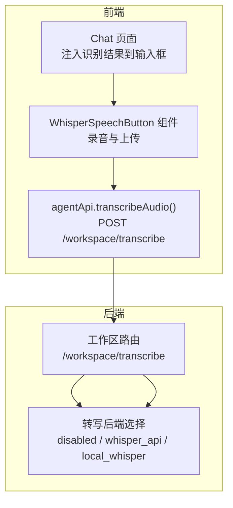
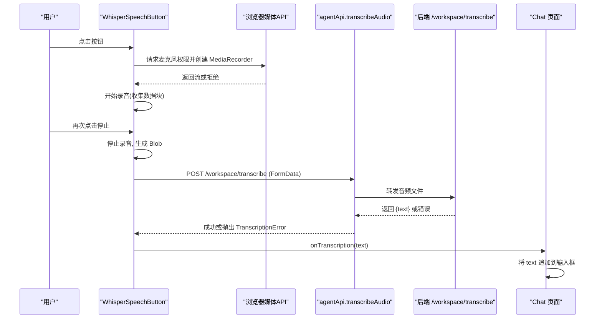
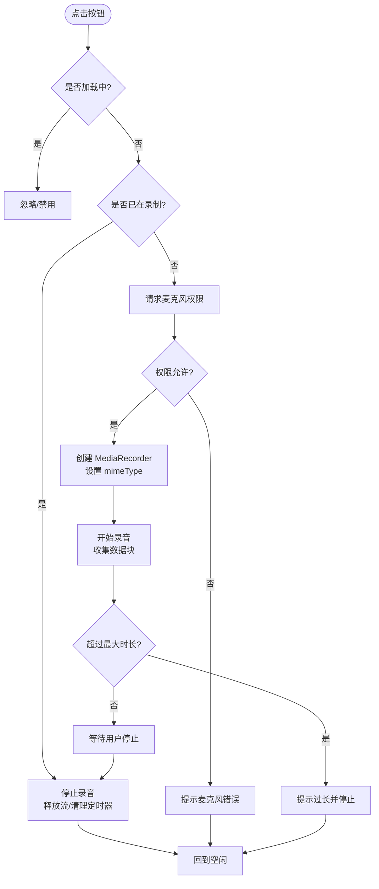
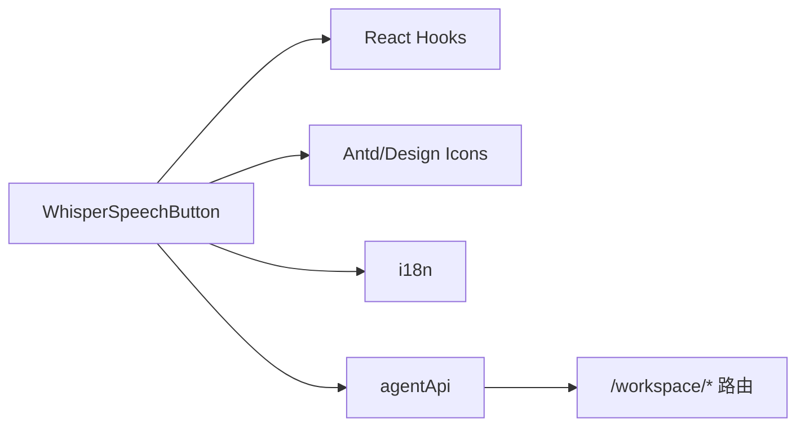

# 语音输入按钮

<cite>
**本文引用的文件**   
- [console/src/pages/Chat/components/WhisperSpeechButton/index.tsx](file://console/src/pages/Chat/components/WhisperSpeechButton/index.tsx)
- [console/src/pages/Chat/index.tsx](file://console/src/pages/Chat/index.tsx)
- [console/src/api/modules/agent.ts](file://console/src/api/modules/agent.ts)
- [src/qwenpaw/config/config.py](file://src/qwenpaw/config/config.py)
</cite>

## 目录
1. [简介](#简介)
2. [项目结构](#项目结构)
3. [核心组件](#核心组件)
4. [架构总览](#架构总览)
5. [详细组件分析](#详细组件分析)
6. [依赖分析](#依赖分析)
7. [性能考虑](#性能考虑)
8. [故障排查指南](#故障排查指南)
9. [结论](#结论)
10. [附录](#附录)

## 简介
本文件为 QwenPaw 聊天界面中的 WhisperSpeechButton 组件提供完整技术文档。该组件负责在浏览器端采集麦克风音频、控制录音生命周期、将音频上传至后端进行转写，并将识别结果回填到聊天输入框。它通过 Web Audio API（MediaRecorder）完成录制，通过后端工作区接口 /workspace/transcribe 调用 Whisper 转写能力（支持禁用、远程 Whisper API、本地 Whisper 三种模式），并处理权限请求、错误提示与用户体验优化。

## 项目结构
与 WhisperSpeechButton 相关的代码主要分布在以下位置：
- 前端组件：console/src/pages/Chat/components/WhisperSpeechButton/index.tsx
- 父级集成：console/src/pages/Chat/index.tsx
- 转写 API 封装：console/src/api/modules/agent.ts
- 后端配置（转写后端类型等）：src/qwenpaw/config/config.py



图表来源
- [console/src/pages/Chat/components/WhisperSpeechButton/index.tsx:90-258](file://console/src/pages/Chat/components/WhisperSpeechButton/index.tsx#L90-L258)
- [console/src/pages/Chat/index.tsx:1602-1629](file://console/src/pages/Chat/index.tsx#L1602-L1629)
- [console/src/api/modules/agent.ts:107-132](file://console/src/api/modules/agent.ts#L107-L132)
- [src/qwenpaw/config/config.py:1516-1543](file://src/qwenpaw/config/config.py#L1516-L1543)

章节来源
- [console/src/pages/Chat/components/WhisperSpeechButton/index.tsx:90-258](file://console/src/pages/Chat/components/WhisperSpeechButton/index.tsx#L90-L258)
- [console/src/pages/Chat/index.tsx:1602-1629](file://console/src/pages/Chat/index.tsx#L1602-L1629)
- [console/src/api/modules/agent.ts:107-132](file://console/src/api/modules/agent.ts#L107-L132)
- [src/qwenpaw/config/config.py:1516-1543](file://src/qwenpaw/config/config.py#L1516-L1543)

## 核心组件
- WhisperSpeechButton 组件
  - 职责：管理录音状态、访问麦克风、控制 MediaRecorder、限制最大录音时长、上传音频、处理错误与用户提示、将文本回调给父组件。
  - 对外暴露方法：toggleRecording、isRecording、isLoading（通过 ref）。
  - 关键状态：recording（是否正在录制）、loading（是否正在转写中）。
  - 关键资源：MediaRecorder、Blob chunks、定时器（自动停止）、内部录制标志位。
  - 交互：点击切换开始/停止；加载态禁用；Tooltip 显示当前操作语义。

- 父级 Chat 页面集成
  - 初始化时查询后端是否启用转写功能（transcription_provider_type !== "disabled"）。
  - 接收 onTranscription(text) 回调后，定位输入框并追加文本，保持光标聚焦。

- 转写 API 封装 agentApi
  - transcribeAudio(file): 使用 FormData 上传音频，携带认证头，解析错误码并抛出 TranscriptionError。
  - getTranscriptionProviderType(): 返回后端转写后端类型，用于前端决定是否展示语音按钮。

章节来源
- [console/src/pages/Chat/components/WhisperSpeechButton/index.tsx:90-258](file://console/src/pages/Chat/components/WhisperSpeechButton/index.tsx#L90-L258)
- [console/src/pages/Chat/index.tsx:1602-1629](file://console/src/pages/Chat/index.tsx#L1602-L1629)
- [console/src/api/modules/agent.ts:86-132](file://console/src/api/modules/agent.ts#L86-L132)

## 架构总览
从用户点击到文本落盘的端到端流程如下：



图表来源
- [console/src/pages/Chat/components/WhisperSpeechButton/index.tsx:110-199](file://console/src/pages/Chat/components/WhisperSpeechButton/index.tsx#L110-L199)
- [console/src/api/modules/agent.ts:107-132](file://console/src/api/modules/agent.ts#L107-L132)
- [console/src/pages/Chat/index.tsx:1618-1629](file://console/src/pages/Chat/index.tsx#L1618-L1629)

## 详细组件分析

### 组件类与方法关系
```mermaid
classDiagram
class WhisperSpeechButton {
+toggleRecording() void
+isRecording() boolean
+isLoading() boolean
-startRecording() Promise~void~
-stopRecording() void
-recording : boolean
-loading : boolean
-mediaRecorderRef : MediaRecorder?
-chunksRef : Blob[]
-internalRecordingRef : boolean
-recordingTimerRef : Timeout?
}
class AgentApi {
+transcribeAudio(file) Promise~{text}~
+getTranscriptionProviderType() Promise~{type}~
}
class ChatPage {
+handleWhisperTranscription(text) void
+whisperEnabled : boolean
}
WhisperSpeechButton --> AgentApi : "调用转写接口"
ChatPage --> WhisperSpeechButton : "onTranscription 回调"
```

图表来源
- [console/src/pages/Chat/components/WhisperSpeechButton/index.tsx:90-258](file://console/src/pages/Chat/components/WhisperSpeechButton/index.tsx#L90-L258)
- [console/src/api/modules/agent.ts:86-132](file://console/src/api/modules/agent.ts#L86-L132)
- [console/src/pages/Chat/index.tsx:1602-1629](file://console/src/pages/Chat/index.tsx#L1602-L1629)

### 录音控制与状态机


图表来源
- [console/src/pages/Chat/components/WhisperSpeechButton/index.tsx:110-199](file://console/src/pages/Chat/components/WhisperSpeechButton/index.tsx#L110-L199)

### 错误处理与用户反馈
- 麦克风权限拒绝：捕获异常并提示“麦克风错误”。
- 转写失败：根据后端返回的错误码区分提示：
  - TRANSCRIPTION_DISABLED：转写未启用。
  - FILE_TOO_LARGE：文件大小超限。
  - 其他：通用“转写失败”提示。
- 录音超时：超过最大时长自动停止并提示。

章节来源
- [console/src/pages/Chat/components/WhisperSpeechButton/index.tsx:153-198](file://console/src/pages/Chat/components/WhisperSpeechButton/index.tsx#L153-L198)
- [console/src/api/modules/agent.ts:107-132](file://console/src/api/modules/agent.ts#L107-L132)

### 权限请求流程与浏览器兼容性
- 使用 navigator.mediaDevices.getUserMedia({ audio: true }) 请求麦克风权限。
- 若浏览器不支持或权限被拒绝，进入错误分支并提示用户。
- 组件不直接使用 Web Speech API 的 SpeechRecognition，而是采用 MediaRecorder 录制音频后由后端转写，从而避免浏览器差异导致的识别不一致问题。

章节来源
- [console/src/pages/Chat/components/WhisperSpeechButton/index.tsx:110-132](file://console/src/pages/Chat/components/WhisperSpeechButton/index.tsx#L110-L132)

### 用户体验优化策略
- 图标与 Tooltip：
  - 空闲：麦克风图标，Tooltip 提示“开始录音”。
  - 录制中：动态波形图标，Tooltip 提示“停止录音”。
  - 转写中：加载图标，Tooltip 提示“转写中”，同时禁用按钮防止重复触发。
- 自动停止：最长录音时间保护，避免长时间占用麦克风。
- 大小校验：上传前检查文件大小，结合后端限制给出友好提示。
- 结果回填：识别完成后自动插入输入框并保持焦点，便于继续编辑。

章节来源
- [console/src/pages/Chat/components/WhisperSpeechButton/index.tsx:221-252](file://console/src/pages/Chat/components/WhisperSpeechButton/index.tsx#L221-L252)
- [console/src/pages/Chat/index.tsx:1618-1629](file://console/src/pages/Chat/index.tsx#L1618-L1629)

### 自定义语音识别引擎与多语言支持
- 自定义转写引擎：
  - 通过修改后端配置 transcription_provider_type 可切换不同转写后端（禁用、远程 Whisper API、本地 Whisper）。
  - 前端通过 getTranscriptionProviderType 判断是否可用，并在 UI 层做相应控制。
- 多语言支持：
  - 后端配置包含 language 字段，可用于指定转写语言（具体语言参数由后端实现决定）。
  - 前端 i18n 文案通过 useTranslation 渲染，确保错误提示与交互文案本地化。

章节来源
- [src/qwenpaw/config/config.py:1516-1543](file://src/qwenpaw/config/config.py#L1516-L1543)
- [console/src/pages/Chat/index.tsx:1608-1616](file://console/src/pages/Chat/index.tsx#L1608-L1616)
- [console/src/pages/Chat/components/WhisperSpeechButton/index.tsx:94](file://console/src/pages/Chat/components/WhisperSpeechButton/index.tsx#L94)

### 添加语音转文字的后处理逻辑
- 在父组件 Chat 页面的 handleWhisperTranscription 中，可将识别文本追加到输入框末尾，并可在此处扩展后处理逻辑（如清洗标点、拼接历史内容、触发搜索等）。
- 示例路径参考：[console/src/pages/Chat/index.tsx:1618-1629](file://console/src/pages/Chat/index.tsx#L1618-L1629)

章节来源
- [console/src/pages/Chat/index.tsx:1618-1629](file://console/src/pages/Chat/index.tsx#L1618-L1629)

## 依赖分析
- 组件依赖
  - React Hooks：useState、useCallback、useRef、forwardRef、useImperativeHandle。
  - UI 库：antd（Tooltip、message）、@agentscope-ai/design（IconButton）、@agentscope-ai/icons（SparkMicLine）。
  - 国际化：react-i18next（useTranslation）。
  - 业务 API：agentApi（转写与配置查询）。
  - 全局存储：uploadLimitStore（获取上传大小限制）。

- 外部接口
  - GET /workspace/transcription-provider-type：查询转写后端类型。
  - POST /workspace/transcribe：上传音频并返回转写文本。



图表来源
- [console/src/pages/Chat/components/WhisperSpeechButton/index.tsx:1-15](file://console/src/pages/Chat/components/WhisperSpeechButton/index.tsx#L1-L15)
- [console/src/api/modules/agent.ts:86-132](file://console/src/api/modules/agent.ts#L86-L132)

章节来源
- [console/src/pages/Chat/components/WhisperSpeechButton/index.tsx:1-15](file://console/src/pages/Chat/components/WhisperSpeechButton/index.tsx#L1-L15)
- [console/src/api/modules/agent.ts:86-132](file://console/src/api/modules/agent.ts#L86-L132)

## 性能考虑
- 录音时长上限：默认 5 分钟，避免长录音导致内存与网络压力。
- 流式收集：使用 Blob 分片收集，减少中间对象开销。
- 上传前大小校验：结合 uploadMaxSizeMb 配置，提前拦截大文件，降低无效传输。
- 加载态防抖：loading 状态下禁用按钮，避免并发上传。
- 资源释放：停止录音后立即关闭媒体轨道，避免后台持续占用麦克风。

章节来源
- [console/src/pages/Chat/components/WhisperSpeechButton/index.tsx:16](file://console/src/pages/Chat/components/WhisperSpeechButton/index.tsx#L16)
- [console/src/pages/Chat/components/WhisperSpeechButton/index.tsx:126-132](file://console/src/pages/Chat/components/WhisperSpeechButton/index.tsx#L126-L132)
- [console/src/pages/Chat/components/WhisperSpeechButton/index.tsx:134-145](file://console/src/pages/Chat/components/WhisperSpeechButton/index.tsx#L134-L145)
- [console/src/pages/Chat/components/WhisperSpeechButton/index.tsx:179-199](file://console/src/pages/Chat/components/WhisperSpeechButton/index.tsx#L179-L199)

## 故障排查指南
- 麦克风权限拒绝
  - 现象：点击按钮无响应或提示“麦克风错误”。
  - 排查：确认浏览器地址为 HTTPS 或 localhost；检查系统/浏览器麦克风权限；查看控制台错误日志。
  - 相关代码路径：[console/src/pages/Chat/components/WhisperSpeechButton/index.tsx:195-198](file://console/src/pages/Chat/components/WhisperSpeechButton/index.tsx#L195-L198)

- 转写未启用
  - 现象：按钮不可用或提示“转写已禁用”。
  - 排查：检查后端 transcription_provider_type 是否为 "disabled"；前端通过 getTranscriptionProviderType 判断可用性。
  - 相关代码路径：
    - [console/src/pages/Chat/index.tsx:1608-1616](file://console/src/pages/Chat/index.tsx#L1608-L1616)
    - [src/qwenpaw/config/config.py:1516-1528](file://src/qwenpaw/config/config.py#L1516-L1528)

- 文件过大
  - 现象：提示“文件过大”且无法上传。
  - 排查：检查 uploadMaxSizeMb 配置与后端限制；缩短录音时长或压缩音频格式。
  - 相关代码路径：
    - [console/src/pages/Chat/components/WhisperSpeechButton/index.tsx:134-145](file://console/src/pages/Chat/components/WhisperSpeechButton/index.tsx#L134-L145)
    - [console/src/api/modules/agent.ts:115-132](file://console/src/api/modules/agent.ts#L115-L132)

- 网络超时或服务不可用
  - 现象：转写失败，提示“转写失败”。
  - 排查：检查后端服务状态与网络连通性；查看后端日志；确认认证头是否正确传递。
  - 相关代码路径：
    - [console/src/api/modules/agent.ts:107-132](file://console/src/api/modules/agent.ts#L107-L132)

- 离线模式支持
  - 现状：当前实现依赖后端转写服务，无内置离线方案。
  - 建议：如需离线，可在前端引入本地 STT 引擎（如 WebAssembly 版 Whisper）作为降级方案，或在移动端使用原生录音+本地模型。

章节来源
- [console/src/pages/Chat/components/WhisperSpeechButton/index.tsx:153-198](file://console/src/pages/Chat/components/WhisperSpeechButton/index.tsx#L153-L198)
- [console/src/api/modules/agent.ts:107-132](file://console/src/api/modules/agent.ts#L107-L132)
- [console/src/pages/Chat/index.tsx:1608-1616](file://console/src/pages/Chat/index.tsx#L1608-L1616)
- [src/qwenpaw/config/config.py:1516-1528](file://src/qwenpaw/config/config.py#L1516-L1528)

## 结论
WhisperSpeechButton 以简洁的前端实现配合灵活的后端转写配置，提供了稳定可靠的语音输入体验。通过 MediaRecorder 录制与后端统一转写，规避了浏览器差异带来的识别不一致问题；完善的错误处理与用户提示提升了鲁棒性与易用性。开发者可通过后端配置快速切换转写引擎，并在父组件中轻松扩展后处理逻辑，满足多语言与个性化需求。

## 附录
- 关键 API 定义
  - GET /workspace/transcription-provider-type：返回转写后端类型。
  - POST /workspace/transcribe：上传音频文件，返回转写文本。
- 配置项
  - transcription_provider_type：disabled | whisper_api | local_whisper
  - transcription_model：例如 whisper-1、whisper-large-v3
  - language：转写语言（由后端实现决定）

章节来源
- [console/src/api/modules/agent.ts:86-132](file://console/src/api/modules/agent.ts#L86-L132)
- [src/qwenpaw/config/config.py:1516-1543](file://src/qwenpaw/config/config.py#L1516-L1543)