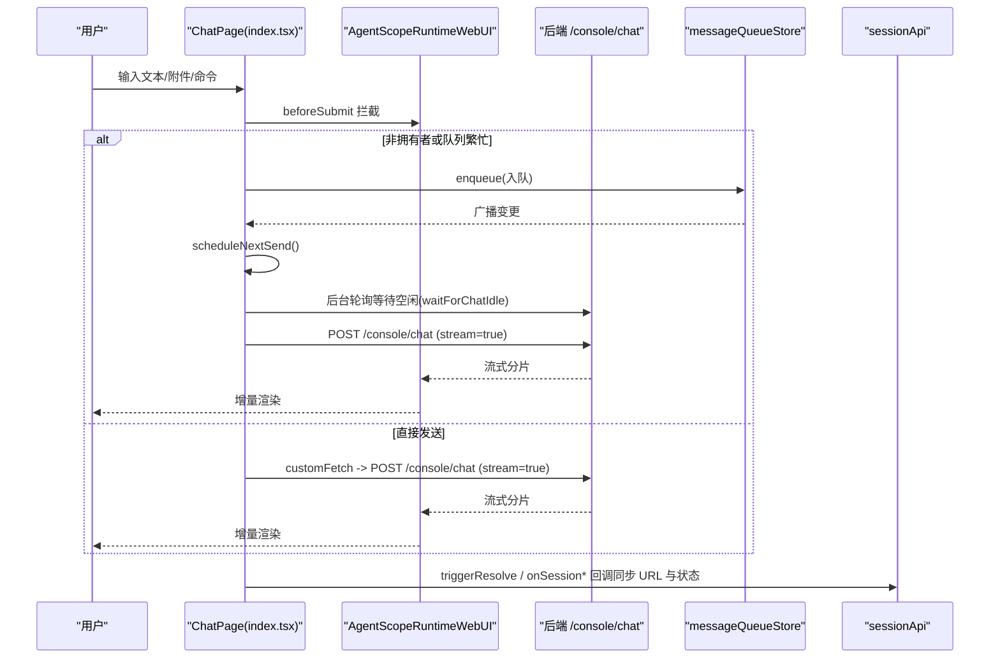
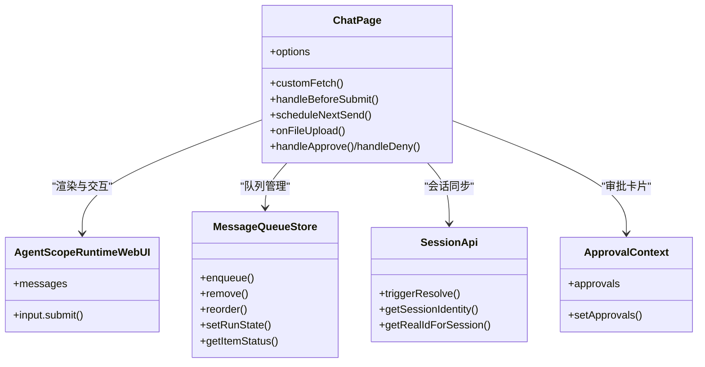
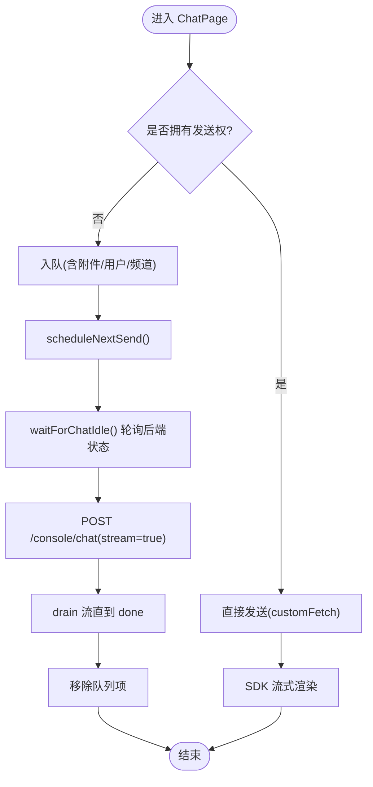
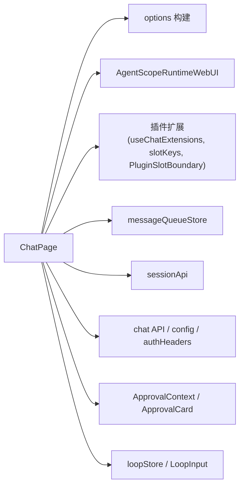

# 聊天界面

<cite>
**本文引用的文件**
- [console/src/pages/Chat/index.tsx](file://console/src/pages/Chat/index.tsx)
- [console/src/pages/Chat/utils.ts](file://console/src/pages/Chat/utils.ts)
- [console/src/pages/Chat/sessionApi/index.ts](file://console/src/pages/Chat/sessionApi/index.ts)
- [console/src/stores/messageQueueStore.ts](file://console/src/stores/messageQueueStore.ts)
- [console/src/components/Chat/ToolCards/adapters/v1Adapter.ts](file://console/src/components/Chat/ToolCards/adapters/v1Adapter.ts)
- [console/src/plugins/registry/useChatExtensions.ts](file://console/src/plugins/registry/useChatExtensions.ts)
- [console/src/plugins/registry/slotKeys.ts](file://console/src/plugins/registry/slotKeys.ts)
- [console/src/plugins/registry/PluginSlotBoundary.tsx](file://console/src/plugins/registry/PluginSlotBoundary.tsx)
- [console/src/api/modules/chat.ts](file://console/src/api/modules/chat.ts)
- [console/src/api/config.ts](file://console/src/api/config.ts)
- [console/src/api/authHeaders.ts](file://console/src/api/authHeaders.ts)
- [console/src/hooks/useAppMessage.ts](file://console/src/hooks/useAppMessage.ts)
- [console/src/contexts/ApprovalContext.tsx](file://console/src/contexts/ApprovalContext.tsx)
- [console/src/components/ApprovalCard/ApprovalCard.tsx](file://console/src/components/ApprovalCard/ApprovalCard.tsx)
- [console/src/components/LoopInput/index.tsx](file://console/src/components/LoopInput/index.tsx)
- [console/src/stores/loopStore.ts](file://console/src/stores/loopStore.ts)
- [console/src/stores/sidebarModeStore.ts](file://console/src/stores/sidebarModeStore.ts)
- [console/src/stores/uploadLimitStore.ts](file://console/src/stores/uploadLimitStore.ts)
- [console/src/utils/sessionRoute.ts](file://console/src/utils/sessionRoute.ts)
</cite>

## 目录
1. [简介](#简介)
2. [项目结构](#项目结构)
3. [核心组件](#核心组件)
4. [架构总览](#架构总览)
5. [详细组件分析](#详细组件分析)
6. [依赖关系分析](#依赖关系分析)
7. [性能与内存优化](#性能与内存优化)
8. [故障排查指南](#故障排查指南)
9. [结论](#结论)
10. [附录：扩展与自定义示例](#附录扩展与自定义示例)

## 简介
本文件聚焦 QwenPaw 控制台“聊天界面”的实现，围绕消息渲染、会话管理、工具卡片显示与用户交互逻辑展开。重点解析 ChatPage 组件的结构、消息队列处理、流式响应渲染、工具调用可视化、会话状态管理、消息持久化、搜索与批量操作等能力，并提供来自代码库的具体路径示例，帮助初学者快速上手，同时为有经验的开发者提供深入的技术细节与优化建议。

## 项目结构
聊天界面位于 console/src/pages/Chat 下，核心入口为 index.tsx，配合 utils.ts、sessionApi/index.ts 以及多个子组件与 hooks 共同实现完整功能。关键模块包括：
- 页面主组件：ChatPage（index.tsx）
- 工具与适配器：v1Adapter（用于工具卡片渲染适配）
- 插件扩展点：useChatExtensions、slotKeys、PluginSlotBoundary
- 消息队列：messageQueueStore
- 会话路由与 API：sessionApi、chat API、authHeaders、config
- 审批与工具执行级别：ApprovalContext、ApprovalCard、ApprovalLevelToggle
- 循环技能与输入增强：LoopInput、loopStore
- 上传限制与侧边栏模式：uploadLimitStore、sidebarModeStore

```mermaid
graph TB
subgraph "聊天页面"
CP["ChatPage<br/>index.tsx"]
OPT["options 配置构建<br/>index.tsx"]
QP["消息队列面板<br/>components/MessageQueuePanel.tsx"]
end
subgraph "运行时与渲染"
SDK["AgentScopeRuntimeWebUI<br/>外部库"]
TRB["RuntimeLoadingBridge<br/>index.tsx"]
HST["HostBubbles(请求/响应卡片)<br/>HostBubbles.tsx"]
V1A["v1Adapter(工具卡片适配)<br/>adapters/v1Adapter.ts"]
end
subgraph "数据与状态"
MQS["messageQueueStore<br/>stores/messageQueueStore.ts"]
SA["sessionApi<br/>pages/Chat/sessionApi/index.ts"]
APPMSG["useAppMessage<br/>hooks/useAppMessage.ts"]
APPRCTX["ApprovalContext<br/>contexts/ApprovalContext.tsx"]
LOOP["loopStore / LoopInput<br/>stores/loopStore.ts / components/LoopInput/index.tsx"]
end
subgraph "API 与网络"
CHATAPI["chat API<br/>api/modules/chat.ts"]
CFG["getApiUrl<br/>api/config.ts"]
AUTH["buildAuthHeaders<br/>api/authHeaders.ts"]
end
CP --> SDK
CP --> OPT
CP --> QP
CP --> TRB
CP --> HST
CP --> V1A
CP --> MQS
CP --> SA
CP --> APPMSG
CP --> APPRCTX
CP --> LOOP
CP --> CHATAPI
CP --> CFG
CP --> AUTH
```

图表来源
- [console/src/pages/Chat/index.tsx:1079-3200](file://console/src/pages/Chat/index.tsx#L1079-L3200)
- [console/src/components/Chat/ToolCards/adapters/v1Adapter.ts](file://console/src/components/Chat/ToolCards/adapters/v1Adapter.ts)
- [console/src/stores/messageQueueStore.ts](file://console/src/stores/messageQueueStore.ts)
- [console/src/pages/Chat/sessionApi/index.ts](file://console/src/pages/Chat/sessionApi/index.ts)
- [console/src/api/modules/chat.ts](file://console/src/api/modules/chat.ts)
- [console/src/api/config.ts](file://console/src/api/config.ts)
- [console/src/api/authHeaders.ts](file://console/src/api/authHeaders.ts)
- [console/src/hooks/useAppMessage.ts](file://console/src/hooks/useAppMessage.ts)
- [console/src/contexts/ApprovalContext.tsx](file://console/src/contexts/ApprovalContext.tsx)
- [console/src/components/LoopInput/index.tsx](file://console/src/components/LoopInput/index.tsx)
- [console/src/stores/loopStore.ts](file://console/src/stores/loopStore.ts)

章节来源
- [console/src/pages/Chat/index.tsx:1079-3200](file://console/src/pages/Chat/index.tsx#L1079-L3200)

## 核心组件
- ChatPage：聊天界面的顶层容器，负责会话生命周期、消息队列、流式请求封装、插件扩展装配、工具卡片注册、审批弹窗、语音输入、宽屏模式、历史面板等。
- AgentScopeRuntimeWebUI：外部运行时 UI 组件，承载消息气泡列表、发送器、会话选择等核心 UI。
- MessageQueuePanel：展示并管理当前会话的待发消息队列，支持编辑、重排、暂停/恢复、重试、跳过、中断并立即发送等。
- RuntimeLoadingBridge：桥接运行时加载状态到 ChatPage，驱动自动发送与队列调度。
- HostRequestCard/HostResponseCard：宿主包装的请求/响应卡片，结合插件插槽进行渲染扩展。
- v1Adapter：将旧版工具卡片格式适配为新版渲染接口，保证兼容性与一致性。

章节来源
- [console/src/pages/Chat/index.tsx:1079-3200](file://console/src/pages/Chat/index.tsx#L1079-L3200)
- [console/src/components/Chat/ToolCards/adapters/v1Adapter.ts](file://console/src/components/Chat/ToolCards/adapters/v1Adapter.ts)

## 架构总览
聊天界面采用“页面编排 + 运行时渲染 + 插件扩展 + 跨标签页队列”的架构。页面层通过 options 注入主题、欢迎页、发送器行为、API 请求/响应处理、卡片与动作扩展；运行时负责消息渲染与流式增量更新；插件系统允许在多个插槽中注入自定义渲染与行为；消息队列确保多标签页并发场景下的顺序与幂等。

图表来源
- [console/src/pages/Chat/index.tsx:2200-2312](file://console/src/pages/Chat/index.tsx#L2200-L2312)
- [console/src/pages/Chat/index.tsx:2846-2918](file://console/src/pages/Chat/index.tsx#L2846-L2918)
- [console/src/pages/Chat/index.tsx:1242-1280](file://console/src/pages/Chat/index.tsx#L1242-L1280)
- [console/src/pages/Chat/index.tsx:2014-2140](file://console/src/pages/Chat/index.tsx#L2014-L2140)

## 详细组件分析

### ChatPage 组件结构与职责
- 会话路由与切换：根据 URL 解析 chatId，维护 lastActiveChatId，监听 sessionApi 事件以同步 URL 与本地存储。
- 模型与多模态能力：动态获取活跃模型能力，控制附件上传提示与限制。
- 发送前处理：beforeSubmit 拦截，非拥有者入队；注入 loop 命令前缀；清理草稿与附件预览。
- 流式请求与响应：customFetch 组装请求体、附加认证头、写入最后一条用户消息缓存；responseParser 处理空输出、速率限制、历史清空指令；reconnect 断线重连；cancel 停止生成。
- 插件扩展：合并默认与插件提供的工具渲染、卡片、动作、请求动作、右侧头部、发送器前缀与建议项。
- 审批与执行级别：从 ApprovalContext 拉取当前会话的审批请求，渲染 ApprovalCard，支持批准/拒绝/取消，并将执行级别注入请求体。
- 消息队列：跨标签页所有权锁定、后台发送器、自动发送、暂停/恢复、重试/跳过、中断并立即发送、队列面板集成。
- 输入增强：IME 组合防误触、上下键历史导航、粘贴编辑器上下文、语音转写快捷键、Loop 芯片识别与删除。

章节来源
- [console/src/pages/Chat/index.tsx:1079-3200](file://console/src/pages/Chat/index.tsx#L1079-L3200)

#### 类图（概念映射）

图表来源
- [console/src/pages/Chat/index.tsx:1079-3200](file://console/src/pages/Chat/index.tsx#L1079-L3200)
- [console/src/stores/messageQueueStore.ts](file://console/src/stores/messageQueueStore.ts)
- [console/src/pages/Chat/sessionApi/index.ts](file://console/src/pages/Chat/sessionApi/index.ts)
- [console/src/contexts/ApprovalContext.tsx](file://console/src/contexts/ApprovalContext.tsx)

### 消息渲染与流式响应
- 流式接收：customFetch 使用 fetch 发起 POST /console/chat，设置 stream=true；responseParser 对每个 JSON 分片进行处理，如补全空输出、忽略 turn_usage、处理 rate_limited 提示。
- 增量渲染：SDK 内部消费流式分片，按消息类型追加内容，保持滚动与性能。
- 媒体与链接：replaceMediaURL 将存储名转换为可展示 URL；onFileCardClick 打开外部链接。
- 历史清空：当 payload 包含 clear_history 标记时，pendingClearHistoryRef 置位并在 response 完成后异步清空消息列表。

章节来源
- [console/src/pages/Chat/index.tsx:2200-2312](file://console/src/pages/Chat/index.tsx#L2200-L2312)
- [console/src/pages/Chat/index.tsx:2846-2918](file://console/src/pages/Chat/index.tsx#L2846-L2918)
- [console/src/pages/Chat/index.tsx:481-519](file://console/src/pages/Chat/index.tsx#L481-L519)
- [console/src/pages/Chat/index.tsx:1994-2000](file://console/src/pages/Chat/index.tsx#L1994-L2000)

### 会话管理与 URL 同步
- 会话 ID 解析与迁移：onSessionIdResolved 将临时 ID 迁移至真实 ID，更新 lastActiveChatId 并替换 URL。
- 会话创建/删除/选择：onSessionCreated 清理 "new" 队列并导航；onSessionRemoved 清理队列与后台发送器；onSessionSelected 避免重复导航与抑制过时回调。
- 编码模式联动：当 codingMode 激活时，自动重定向到 /coding/<id> 并保持会话存活。

章节来源
- [console/src/pages/Chat/index.tsx:2014-2140](file://console/src/pages/Chat/index.tsx#L2014-L2140)
- [console/src/pages/Chat/index.tsx:1114-1123](file://console/src/pages/Chat/index.tsx#L1114-L1123)

### 工具卡片与插件扩展
- 工具渲染：customToolRenderConfig 合并 toolRenderConfig 与插件注册的 render，统一通过 PluginSlotBoundary 包裹，支持错误边界与隔离。
- 卡片扩展：cards 字段注册 HostRequestCard/HostResponseCard 及插件自定义卡片名称。
- 动作与请求动作：actions.list 与 requestActions.list 支持复制、时间戳、用量统计等，并可由插件注入更多动作。
- 发送器扩展：sender.prefix、sender.suggestions、rightHeader 等插槽允许插件注入按钮、建议项与头部组件。

章节来源
- [console/src/pages/Chat/index.tsx:2501-2658](file://console/src/pages/Chat/index.tsx#L2501-L2658)
- [console/src/components/Chat/ToolCards/adapters/v1Adapter.ts](file://console/src/components/Chat/ToolCards/adapters/v1Adapter.ts)
- [console/src/plugins/registry/PluginSlotBoundary.tsx](file://console/src/plugins/registry/PluginSlotBoundary.tsx)
- [console/src/plugins/registry/useChatExtensions.ts](file://console/src/plugins/registry/useChatExtensions.ts)
- [console/src/plugins/registry/slotKeys.ts](file://console/src/plugins/registry/slotKeys.ts)

### 用户交互逻辑
- IME 组合：useIMEComposition 防止输入法组合期间 Enter 误提交。
- 历史导航：useMessageHistoryNavigation 支持上/下键在用户消息间跳转，仅单行且无选区时生效。
- 粘贴增强：useChatPasteFromEditor 将编辑器复制的上下文转为 path:line[-line] 格式粘贴到聊天框。
- 语音转写：WhisperSpeechButton 快捷键 Ctrl/Cmd+Shift+M 触发录音并插入文本。
- Loop 芯片：输入检测 __loop__ 前缀自动选中技能；Backspace 首次高亮、二次删除。

章节来源
- [console/src/pages/Chat/index.tsx:554-613](file://console/src/pages/Chat/index.tsx#L554-L613)
- [console/src/pages/Chat/index.tsx:716-874](file://console/src/pages/Chat/index.tsx#L716-L874)
- [console/src/pages/Chat/index.tsx:992-1028](file://console/src/pages/Chat/index.tsx#L992-L1028)
- [console/src/pages/Chat/index.tsx:1607-1629](file://console/src/pages/Chat/index.tsx#L1607-L1629)
- [console/src/pages/Chat/index.tsx:1635-1703](file://console/src/pages/Chat/index.tsx#L1635-L1703)
- [console/src/components/LoopInput/index.tsx](file://console/src/components/LoopInput/index.tsx)
- [console/src/stores/loopStore.ts](file://console/src/stores/loopStore.ts)

### 消息队列与跨标签页发送
- 所有权锁定：holdOwnershipLock 基于 Web Lock 确保每会话仅一个标签页拥有发送权，其他标签页仅入队。
- 后台发送器：startBackgroundQueue 持续轮询后端状态，等待空闲后发送，逐条 drain 流直至完成，再移除队列项。
- 自动发送：scheduleNextSend 在 loading→idle 或队列从无到有时延迟触发，避免竞态。
- 队列面板：支持编辑、重排、暂停/恢复、重试、跳过、中断并立即发送、清空等操作。
- 持久化：localStorage 持久化队列与 runState，页面卸载后仍可由后台发送器继续发送。

图表来源
- [console/src/pages/Chat/index.tsx:1242-1280](file://console/src/pages/Chat/index.tsx#L1242-L1280)
- [console/src/pages/Chat/index.tsx:239-396](file://console/src/pages/Chat/index.tsx#L239-L396)
- [console/src/pages/Chat/index.tsx:1705-1743](file://console/src/pages/Chat/index.tsx#L1705-L1743)
- [console/src/stores/messageQueueStore.ts](file://console/src/stores/messageQueueStore.ts)

### 审批与工具执行级别
- 审批请求：从 ApprovalContext 过滤当前会话的审批，渲染 ApprovalCard，支持 Approve Pattern/Exact、Deny、Cancel。
- 执行级别：ApprovalLevelToggle 提供会话级覆盖，applyApprovalLevelToRequestBody 将级别注入请求体。

章节来源
- [console/src/pages/Chat/index.tsx:1429-1565](file://console/src/pages/Chat/index.tsx#L1429-L1565)
- [console/src/components/ApprovalCard/ApprovalCard.tsx](file://console/src/components/ApprovalCard/ApprovalCard.tsx)
- [console/src/contexts/ApprovalContext.tsx](file://console/src/contexts/ApprovalContext.tsx)

## 依赖关系分析
- 页面与运行时：ChatPage 通过 options 注入 theme、welcome、sender、api、cards、actions 等，驱动 AgentScopeRuntimeWebUI 渲染。
- 插件体系：useChatExtensions 提供快照，slotKeys 定义插槽键，PluginSlotBoundary 包裹渲染节点，确保插件隔离与错误边界。
- 队列与存储：messageQueueStore 提供内存与 localStorage 持久化，跨标签广播同步状态。
- API 层：chat API、config、authHeaders 提供统一的请求构建与鉴权。
- 会话路由：sessionApi 与 sessionRoute 工具函数协同，维护 URL 与本地存储的一致性。

图表来源
- [console/src/pages/Chat/index.tsx:2501-2658](file://console/src/pages/Chat/index.tsx#L2501-L2658)
- [console/src/plugins/registry/useChatExtensions.ts](file://console/src/plugins/registry/useChatExtensions.ts)
- [console/src/plugins/registry/slotKeys.ts](file://console/src/plugins/registry/slotKeys.ts)
- [console/src/plugins/registry/PluginSlotBoundary.tsx](file://console/src/plugins/registry/PluginSlotBoundary.tsx)
- [console/src/stores/messageQueueStore.ts](file://console/src/stores/messageQueueStore.ts)
- [console/src/pages/Chat/sessionApi/index.ts](file://console/src/pages/Chat/sessionApi/index.ts)
- [console/src/api/modules/chat.ts](file://console/src/api/modules/chat.ts)
- [console/src/api/config.ts](file://console/src/api/config.ts)
- [console/src/api/authHeaders.ts](file://console/src/api/authHeaders.ts)
- [console/src/contexts/ApprovalContext.tsx](file://console/src/contexts/ApprovalContext.tsx)
- [console/src/components/ApprovalCard/ApprovalCard.tsx](file://console/src/components/ApprovalCard/ApprovalCard.tsx)
- [console/src/components/LoopInput/index.tsx](file://console/src/components/LoopInput/index.tsx)
- [console/src/stores/loopStore.ts](file://console/src/stores/loopStore.ts)

## 性能与内存优化
- 大会话性能：
  - 使用 React Window 或虚拟列表（由运行时 SDK 提供）减少 DOM 节点数量。
  - 避免在每次渲染中重建 options，利用 useMemo 缓存（已实现）。
  - 合理拆分插件渲染，避免重型计算阻塞主线程。
- 内存管理：
  - 及时清理事件监听与定时器（已在多处 useEffect 返回清理函数）。
  - 队列项在完成或失败后及时移除，避免 localStorage 膨胀。
  - 附件预览在发送后清理，防止引用残留。
- 错误恢复：
  - reconnect 支持断线重连，重新建立流式通道。
  - cancel 调用后端停止生成，释放资源。
  - 队列失败项保留以便重试，避免丢失。

[本节为通用指导，不直接分析具体文件]

## 故障排查指南
- 无法发送或重复发送：
  - 检查是否处于非拥有者标签页，确认 Web Lock 状态与 isOwner 标志。
  - 查看队列运行状态是否为 paused/error，必要时恢复或重试。
- 流式渲染异常：
  - 检查 responseParser 是否正确处理空输出与 rate_limited。
  - 确认 replaceMediaURL 与 onFileCardClick 配置正确。
- 会话不同步：
  - 核对 onSessionIdResolved/onSessionSelected/onSessionCreated 回调是否被正确触发。
  - 检查 preferredChatId 与 lastActiveChatId 的设置时机。
- 审批卡片未出现：
  - 确认 ApprovalContext 中的 approvals 是否包含当前 root_session_id。
  - 检查执行级别是否被正确注入请求体。

章节来源
- [console/src/pages/Chat/index.tsx:1200-1229](file://console/src/pages/Chat/index.tsx#L1200-L1229)
- [console/src/pages/Chat/index.tsx:2846-2918](file://console/src/pages/Chat/index.tsx#L2846-L2918)
- [console/src/pages/Chat/index.tsx:2014-2140](file://console/src/pages/Chat/index.tsx#L2014-L2140)
- [console/src/pages/Chat/index.tsx:1429-1565](file://console/src/pages/Chat/index.tsx#L1429-L1565)

## 结论
QwenPaw 聊天界面通过 ChatPage 集中编排，结合运行时 SDK、插件扩展与跨标签页消息队列，实现了高性能、可扩展、可恢复的聊天体验。其设计兼顾了易用性与工程性，既满足初学者的直观需求，也为高级用户提供丰富的定制点与优化空间。

[本节为总结，不直接分析具体文件]

## 附录：扩展与自定义示例
- 自定义消息类型：
  - 在 cards 字段注册新的卡片名称与渲染函数，并通过 PluginSlotBoundary 包裹，参考 HostRequestCard/HostResponseCard 的用法。
  - 参考路径：[console/src/pages/Chat/index.tsx:2650-2658](file://console/src/pages/Chat/index.tsx#L2650-L2658)
- 添加工具卡片：
  - 使用 customToolRenderConfig 注册工具名对应的渲染组件，或通过插件 slots 注入。
  - 参考路径：[console/src/pages/Chat/index.tsx:2622-2648](file://console/src/pages/Chat/index.tsx#L2622-L2648)
- 处理用户输入：
  - 在 sender.beforeSubmit 中拦截发送，注入 loop 前缀或执行入队逻辑。
  - 参考路径：[console/src/pages/Chat/index.tsx:2431-2499](file://console/src/pages/Chat/index.tsx#L2431-L2499)
- 接入审批与执行级别：
  - 使用 ApprovalLevelToggle 设置会话级执行级别，并在请求体中应用。
  - 参考路径：[console/src/pages/Chat/index.tsx:2789-2797](file://console/src/pages/Chat/index.tsx#L2789-L2797)
- 队列与后台发送：
  - 使用 messageQueueStore 的 enqueue/remove/reorder/setRunState 等方法管理队列。
  - 参考路径：[console/src/stores/messageQueueStore.ts](file://console/src/stores/messageQueueStore.ts)
- 会话路由与 API：
  - 使用 sessionApi 的 triggerResolve/getRealIdForSession 等方法同步 URL 与状态。
  - 参考路径：[console/src/pages/Chat/sessionApi/index.ts](file://console/src/pages/Chat/sessionApi/index.ts)

章节来源
- [console/src/pages/Chat/index.tsx:2622-2658](file://console/src/pages/Chat/index.tsx#L2622-L2658)
- [console/src/pages/Chat/index.tsx:2431-2499](file://console/src/pages/Chat/index.tsx#L2431-L2499)
- [console/src/pages/Chat/index.tsx:2789-2797](file://console/src/pages/Chat/index.tsx#L2789-L2797)
- [console/src/stores/messageQueueStore.ts](file://console/src/stores/messageQueueStore.ts)
- [console/src/pages/Chat/sessionApi/index.ts](file://console/src/pages/Chat/sessionApi/index.ts)