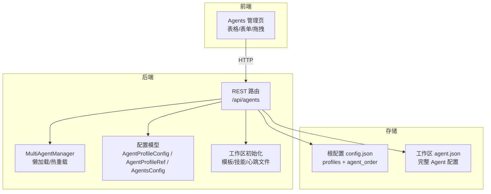
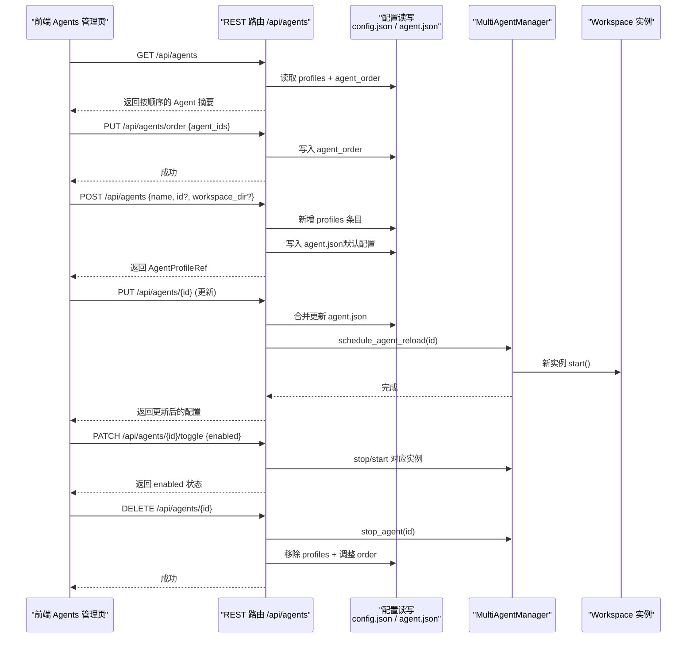
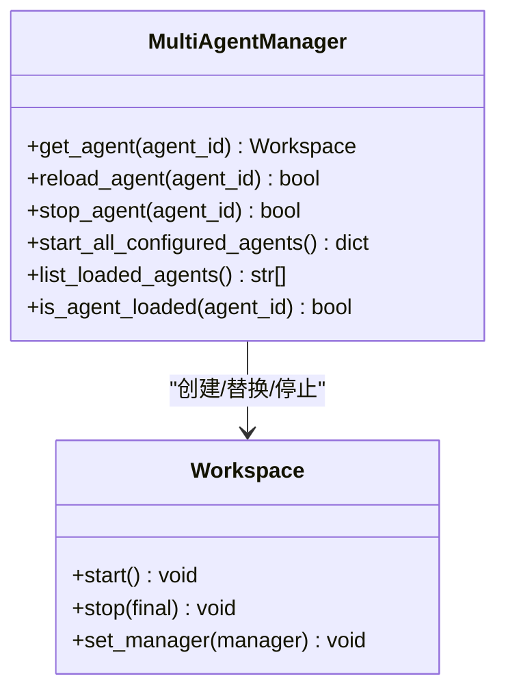
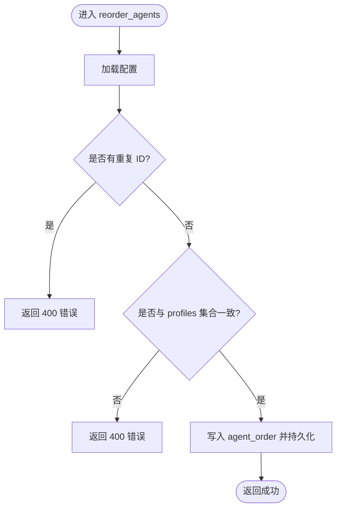
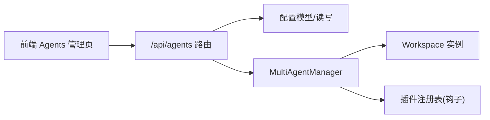

# Agent 配置

<cite>
**本文引用的文件**   
- [src/qwenpaw/app/routers/agents.py](file://src/qwenpaw/app/routers/agents.py)
- [src/qwenpaw/config/config.py](file://src/qwenpaw/config/config.py)
- [src/qwenpaw/app/multi_agent_manager.py](file://src/qwenpaw/app/multi_agent_manager.py)
- [e2e/pages/agents_page.py](file://e2e/pages/agents_page.py)
- [e2e/tests/test_agents.py](file://e2e/tests/test_agents.py)
- [tests/integration/test_multi_agent_lifecycle.py](file://tests/integration/test_multi_agent_lifecycle.py)
- [tests/integration/test_multi_agent_config_isolation.py](file://tests/integration/test_multi_agent_config_isolation.py)
- [src/qwenpaw/backup/_ops/restore_helpers.py](file://src/qwenpaw/backup/_ops/restore_helpers.py)
</cite>

## 目录
1. [简介](#简介)
2. [项目结构](#项目结构)
3. [核心组件](#核心组件)
4. [架构总览](#架构总览)
5. [详细组件分析](#详细组件分析)
6. [依赖关系分析](#依赖关系分析)
7. [性能与并发特性](#性能与并发特性)
8. [故障排查指南](#故障排查指南)
9. [结论](#结论)
10. [附录：API 与数据模型速查](#附录api-与数据模型速查)

## 简介
本章节面向 QwenPaw 的 Agent 配置模块，系统性阐述 Agent 的生命周期管理、配置系统与前端交互。内容覆盖：
- Agent 的创建、编辑、删除、排序（拖拽）操作
- Agent 数据模型定义与校验规则
- 拖拽排序算法与持久化策略
- 批量操作处理与状态同步机制
- 表格组件的数据渲染、分页加载与状态同步
- 自定义字段扩展、权限控制与外部配置源集成
- 常见问题与解决方案（配置迁移、备份恢复、并发冲突）

## 项目结构
Agent 配置相关代码主要分布在以下位置：
- 后端 API 路由：负责 Agent 列表、详情、创建、更新、删除、排序等 REST 接口
- 配置模型：Pydantic 模型定义 Agent Profile、引用、全局 Agents 配置等
- 多 Agent 管理器：负责工作区实例的懒加载、热重载、启停与并发安全
- 前端页面对象与 E2E 测试：封装 Agent 管理页交互，验证拖拽排序、增删改、启用/禁用等

图表来源
- [src/qwenpaw/app/routers/agents.py:157-236](file://src/qwenpaw/app/routers/agents.py#L157-L236)
- [src/qwenpaw/config/config.py:1336-1489](file://src/qwenpaw/config/config.py#L1336-L1489)
- [src/qwenpaw/app/multi_agent_manager.py:54-159](file://src/qwenpaw/app/multi_agent_manager.py#L54-L159)

章节来源
- [src/qwenpaw/app/routers/agents.py:157-236](file://src/qwenpaw/app/routers/agents.py#L157-L236)
- [src/qwenpaw/config/config.py:1336-1489](file://src/qwenpaw/config/config.py#L1336-L1489)
- [src/qwenpaw/app/multi_agent_manager.py:54-159](file://src/qwenpaw/app/multi_agent_manager.py#L54-L159)

## 核心组件
- Agent 配置模型
  - AgentProfileRef：根配置中仅保存 ID 与工作区路径，以及是否启用
  - AgentProfileConfig：工作区下的完整 Agent 配置，包含通道、MCP、心跳、工具、安全、ACP、计划模式、编码模式等
  - AgentsConfig：根配置中的 agents 子段，维护 active_agent、agent_order、profiles 引用
- 多 Agent 管理器
  - 懒加载：首次访问时创建工作区实例并启动
  - 热重载：零停机替换旧实例，后台清理旧实例任务
  - 并发安全：细粒度锁，避免阻塞其他 Agent 的启动
- Agent 管理 API
  - 列表、详情、创建、更新、删除、启用/禁用、排序持久化

章节来源
- [src/qwenpaw/config/config.py:1336-1489](file://src/qwenpaw/config/config.py#L1336-L1489)
- [src/qwenpaw/app/multi_agent_manager.py:23-159](file://src/qwenpaw/app/multi_agent_manager.py#L23-L159)
- [src/qwenpaw/app/routers/agents.py:157-407](file://src/qwenpaw/app/routers/agents.py#L157-L407)

## 架构总览
下图展示了从前端到后端的端到端流程，包括 Agent 列表渲染、拖拽排序、创建/更新/删除、启用/禁用与热重载。

图表来源
- [src/qwenpaw/app/routers/agents.py:157-407](file://src/qwenpaw/app/routers/agents.py#L157-L407)
- [src/qwenpaw/app/multi_agent_manager.py:321-448](file://src/qwenpaw/app/multi_agent_manager.py#L321-L448)

## 详细组件分析

### 数据模型与校验规则
- AgentProfileRef
  - 字段：id、workspace_dir、enabled
  - 作用：根配置中声明式引用，控制实例加载
- AgentProfileConfig
  - 字段：id、name、description、workspace_dir、template_id、channels、mcp、heartbeat、running、llm_routing、active_model、language、approval_level、system_prompt_files、tools、security、acp、plan、coding_mode
  - 校验：字段类型与默认值由 Pydantic 约束；ID 校验在创建时进行
- AgentsConfig
  - 字段：active_agent、agent_order、profiles
  - 作用：维护当前活跃 Agent、UI 排序、所有 Agent 引用

ID 校验规则（创建时）
- 长度限制：最小 2，最大 64
- 字符集：字母数字、连字符、下划线，且不能以 - 或 _ 开头/结尾
- 保留字：default 不可用
- 唯一性：不得与现有 ID 重复

章节来源
- [src/qwenpaw/config/config.py:1336-1489](file://src/qwenpaw/config/config.py#L1336-L1489)
- [src/qwenpaw/config/config.py:156-195](file://src/qwenpaw/config/config.py#L156-L195)

### 生命周期管理（懒加载、热重载、启停）
- 懒加载
  - 首次 get_agent(agent_id) 时检查配置是否存在，若不存在则抛出配置异常
  - 使用事件去重：同一时刻多个请求等待首个创建者完成
- 热重载
  - 先创建并启动新实例，再原子替换旧实例，最后后台优雅停止旧实例
  - 若有活动任务，等待完成或超时后强制停止
- 启停
  - stop_agent：停止并移除内存实例
  - start_all_configured_agents：并行启动所有 enabled=True 的 Agent

图表来源
- [src/qwenpaw/app/multi_agent_manager.py:54-159](file://src/qwenpaw/app/multi_agent_manager.py#L54-L159)
- [src/qwenpaw/app/multi_agent_manager.py:321-448](file://src/qwenpaw/app/multi_agent_manager.py#L321-L448)

章节来源
- [src/qwenpaw/app/multi_agent_manager.py:54-159](file://src/qwenpaw/app/multi_agent_manager.py#L54-L159)
- [src/qwenpaw/app/multi_agent_manager.py:321-448](file://src/qwenpaw/app/multi_agent_manager.py#L321-L448)

### 创建、编辑、删除与排序（API 实现）
- 列表
  - 按 agent_order 排序输出，缺失描述时尝试从 PROFILE.md 提取身份段落作为补充
- 排序
  - PUT /api/agents/order：校验输入为全量且无重复，写入 agent_order
- 创建
  - POST /api/agents：支持可选 id（经校验），自动填充语言与全局模型，初始化工作区（目录、模板、心跳、初始技能）
- 更新
  - PUT /api/agents/{id}：增量合并更新 agent.json，触发热重载
- 删除
  - DELETE /api/agents/{id}：禁止删除 default，停止实例并从 profiles 移除，重新规范化 order

图表来源
- [src/qwenpaw/app/routers/agents.py:208-236](file://src/qwenpaw/app/routers/agents.py#L208-L236)

章节来源
- [src/qwenpaw/app/routers/agents.py:157-236](file://src/qwenpaw/app/routers/agents.py#L157-L236)
- [src/qwenpaw/app/routers/agents.py:272-364](file://src/qwenpaw/app/routers/agents.py#L272-L364)
- [src/qwenpaw/app/routers/agents.py:367-407](file://src/qwenpaw/app/routers/agents.py#L367-L407)
- [src/qwenpaw/app/routers/agents.py:401-433](file://src/qwenpaw/app/routers/agents.py#L401-L433)

### 前端表格渲染、分页与状态同步
- 表格列：拖拽手柄、名称、ID、描述、工作区、模型、操作（编辑、启用/禁用、删除）
- 拖拽排序：通过拖拽手柄改变行序，前端调用排序接口持久化
- 刷新与一致性：页面刷新后依据 server 侧 agent_order 渲染，保证前后端一致
- 状态同步：启用/禁用、删除等操作后，前端应刷新列表或局部更新状态

章节来源
- [e2e/pages/agents_page.py:45-66](file://e2e/pages/agents_page.py#L45-L66)
- [e2e/tests/test_agents.py:809-905](file://e2e/tests/test_agents.py#L809-L905)

### 拖拽排序算法与持久化
- 算法要点
  - 输入：用户拖拽后的完整 ID 序列
  - 校验：必须包含全部已配置 Agent，且无重复
  - 持久化：写入根配置的 agent_order
- 删除联动
  - 删除 Agent 后，系统会规范化 order，确保剩余项保持正确顺序

章节来源
- [src/qwenpaw/app/routers/agents.py:208-236](file://src/qwenpaw/app/routers/agents.py#L208-L236)
- [src/qwenpaw/app/routers/agents.py:401-433](file://src/qwenpaw/app/routers/agents.py#L401-L433)
- [tests/integration/test_multi_agent_lifecycle.py:325-393](file://tests/integration/test_multi_agent_lifecycle.py#L325-L393)

### 批量操作与状态同步
- 批量排序：一次提交完整的新顺序，避免多次写盘
- 启用/禁用：切换后立即影响运行时实例（停止或启动）
- 更新：增量合并，减少不必要的全量覆盖
- 列表展示：基于 agent_order 渲染，确保 UI 与配置一致

章节来源
- [src/qwenpaw/app/routers/agents.py:208-236](file://src/qwenpaw/app/routers/agents.py#L208-L236)
- [src/qwenpaw/app/routers/agents.py:435-484](file://src/qwenpaw/app/routers/agents.py#L435-L484)

### 配置验证规则与默认值
- ID 校验：长度、字符集、保留字、唯一性
- 语言与模型：创建时可继承全局模型；语言优先取请求参数，其次全局设置，否则默认
- 工作区初始化：创建目录、复制模板、生成心跳清单、安装初始技能、初始化 jobs/chats 文件

章节来源
- [src/qwenpaw/config/config.py:156-195](file://src/qwenpaw/config/config.py#L156-L195)
- [src/qwenpaw/app/routers/agents.py:272-364](file://src/qwenpaw/app/routers/agents.py#L272-L364)
- [src/qwenpaw/app/routers/agents.py:568-612](file://src/qwenpaw/app/routers/agents.py#L568-L612)

### 自定义 Agent 字段、权限控制与外部配置源集成
- 自定义字段
  - 在 AgentProfileConfig 中添加新字段，并在前端表单中暴露
  - 更新接口使用 exclude_unset 增量合并，避免覆盖未修改字段
- 权限控制
  - approval_level 控制工具执行安全级别（STRICT/SMART/AUTO/OFF）
  - 可在运行期配置中覆盖，并回写到 Agent 配置
- 外部配置源
  - ACP 配置允许外部 Agent 通信协议接入
  - 可通过插件钩子在 workspace_created 阶段注入额外配置或资源

章节来源
- [src/qwenpaw/config/config.py:1383-1467](file://src/qwenpaw/config/config.py#L1383-L1467)
- [src/qwenpaw/app/multi_agent_manager.py:160-203](file://src/qwenpaw/app/multi_agent_manager.py#L160-L203)

### 配置隔离与继承
- 全局与 Agent 级配置隔离：对某 Agent 的 running-config 修改不影响全局
- 新建 Agent 继承全局默认：如 tool-guard 默认值在新建 Agent 中保持一致

章节来源
- [tests/integration/test_multi_agent_config_isolation.py:80-100](file://tests/integration/test_multi_agent_config_isolation.py#L80-L100)
- [tests/integration/test_multi_agent_config_isolation.py:146-191](file://tests/integration/test_multi_agent_config_isolation.py#L146-L191)

## 依赖关系分析
- 路由层依赖配置模型与多 Agent 管理器
- 多 Agent 管理器依赖工作区实例与插件注册表
- 前端依赖后端 REST 接口，并通过 agent_order 驱动渲染顺序

图表来源
- [src/qwenpaw/app/routers/agents.py:157-407](file://src/qwenpaw/app/routers/agents.py#L157-L407)
- [src/qwenpaw/app/multi_agent_manager.py:54-159](file://src/qwenpaw/app/multi_agent_manager.py#L54-L159)

章节来源
- [src/qwenpaw/app/routers/agents.py:157-407](file://src/qwenpaw/app/routers/agents.py#L157-L407)
- [src/qwenpaw/app/multi_agent_manager.py:54-159](file://src/qwenpaw/app/multi_agent_manager.py#L54-L159)

## 性能与并发特性
- 懒加载与并行启动：get_agent 仅在字典检查时持有锁，慢启动过程不阻塞其他 Agent
- 热重载零停机：新实例启动完成后原子替换，旧实例后台清理
- 批量排序：单次写入 agent_order，降低写放大
- 列表渲染优化：按 agent_order 直接遍历，避免二次排序

[本节为通用性能建议，无需特定文件来源]

## 故障排查指南
- 无法删除 default Agent
  - 现象：删除 default 返回 400
  - 原因：系统保护默认 Agent
  - 解决：选择其他 Agent 或删除其工作区后再重建
- 拖拽排序无效
  - 现象：刷新后顺序不变
  - 排查：确认前端是否正确调用排序接口；检查 agent_order 是否被覆盖
- 更新后未生效
  - 现象：更新后仍显示旧配置
  - 排查：确认是否触发热重载；查看日志中 reload 结果
- 并发冲突
  - 现象：同时创建相同 ID 失败
  - 原因：ID 唯一性校验
  - 解决：使用自动生成 ID 或确保客户端重试前查询现有 ID
- 跨机器恢复路径不一致
  - 现象：恢复后 workspace_dir 指向不存在的路径
  - 解决：使用 restore_helpers 重写 agent.json 中的 workspace_dir

章节来源
- [src/qwenpaw/app/routers/agents.py:401-433](file://src/qwenpaw/app/routers/agents.py#L401-L433)
- [src/qwenpaw/backup/_ops/restore_helpers.py:112-142](file://src/qwenpaw/backup/_ops/restore_helpers.py#L112-L142)

## 结论
QwenPaw 的 Agent 配置模块通过清晰的模型定义、健壮的 API 设计与高效的运行时管理，实现了多 Agent 的灵活编排与稳定运行。结合前端表格与拖拽能力，提供了直观的配置体验。对于扩展场景，建议在 AgentProfileConfig 中按需添加字段，并通过插件钩子与外部配置源集成，同时遵循幂等与隔离原则保障系统稳定性。

[本节为总结性内容，无需特定文件来源]

## 附录：API 与数据模型速查
- 关键 API
  - GET /api/agents：列出所有 Agent（按 agent_order）
  - PUT /api/agents/order：持久化排序
  - POST /api/agents：创建 Agent（可选 id、workspace_dir、language、skill_names、active_model）
  - GET /api/agents/{agentId}：获取 Agent 完整配置
  - PUT /api/agents/{agentId}：更新 Agent 配置并触发热重载
  - PATCH /api/agents/{agentId}/toggle：启用/禁用 Agent
  - DELETE /api/agents/{agentId}：删除 Agent（禁止 default）
- 关键数据模型
  - AgentProfileRef：id、workspace_dir、enabled
  - AgentProfileConfig：完整配置（含 channels、mcp、heartbeat、tools、security、acp、plan、coding_mode 等）
  - AgentsConfig：active_agent、agent_order、profiles

章节来源
- [src/qwenpaw/app/routers/agents.py:157-407](file://src/qwenpaw/app/routers/agents.py#L157-L407)
- [src/qwenpaw/config/config.py:1336-1489](file://src/qwenpaw/config/config.py#L1336-L1489)