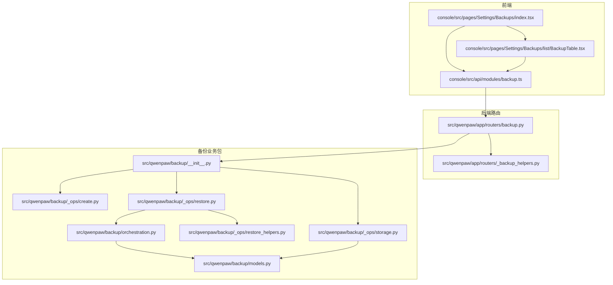
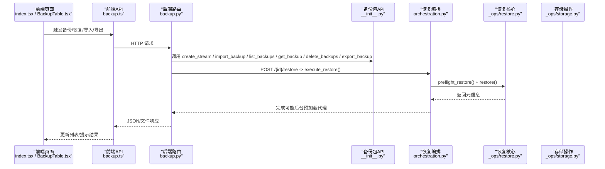
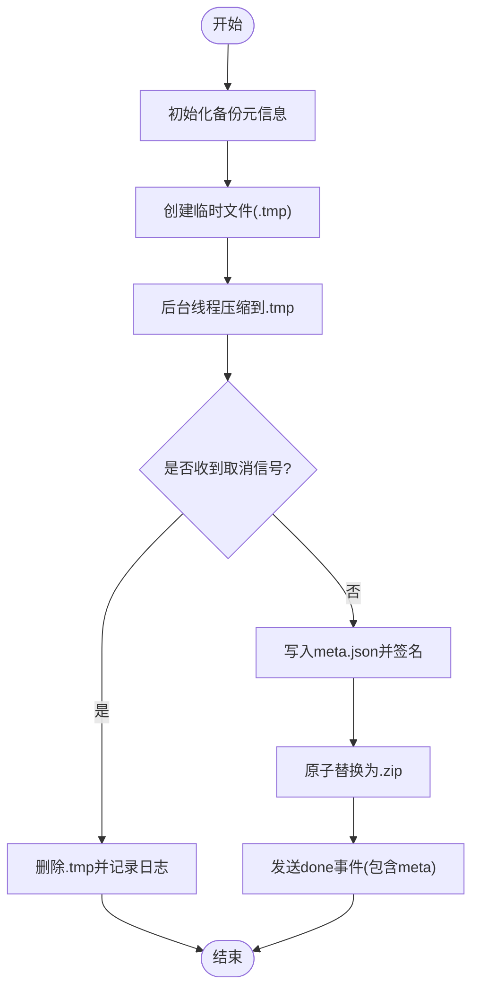
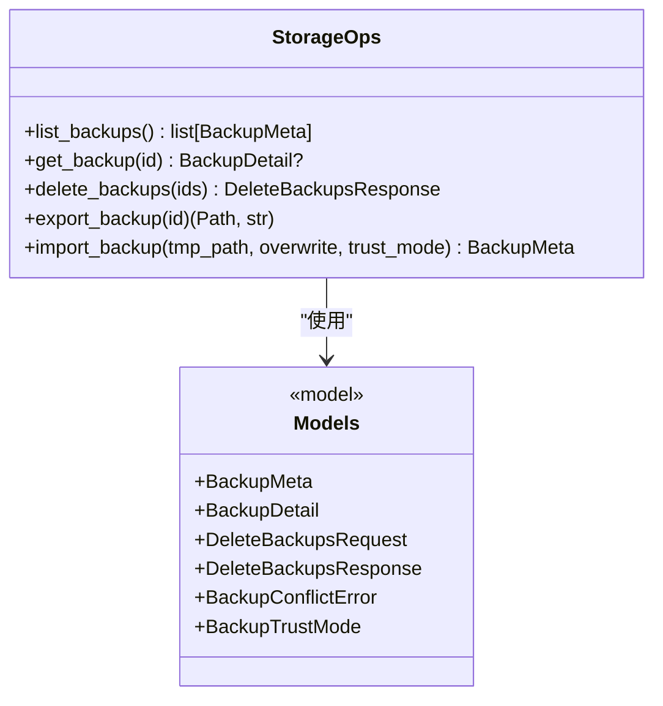
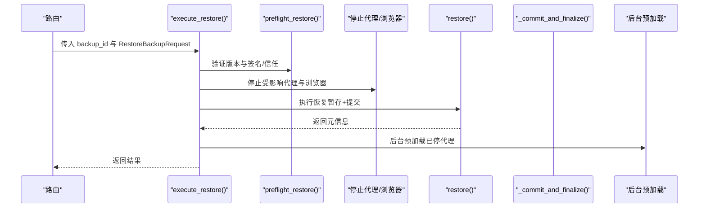
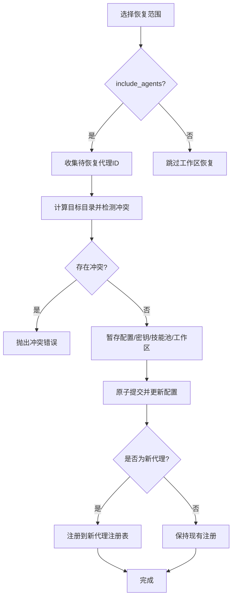
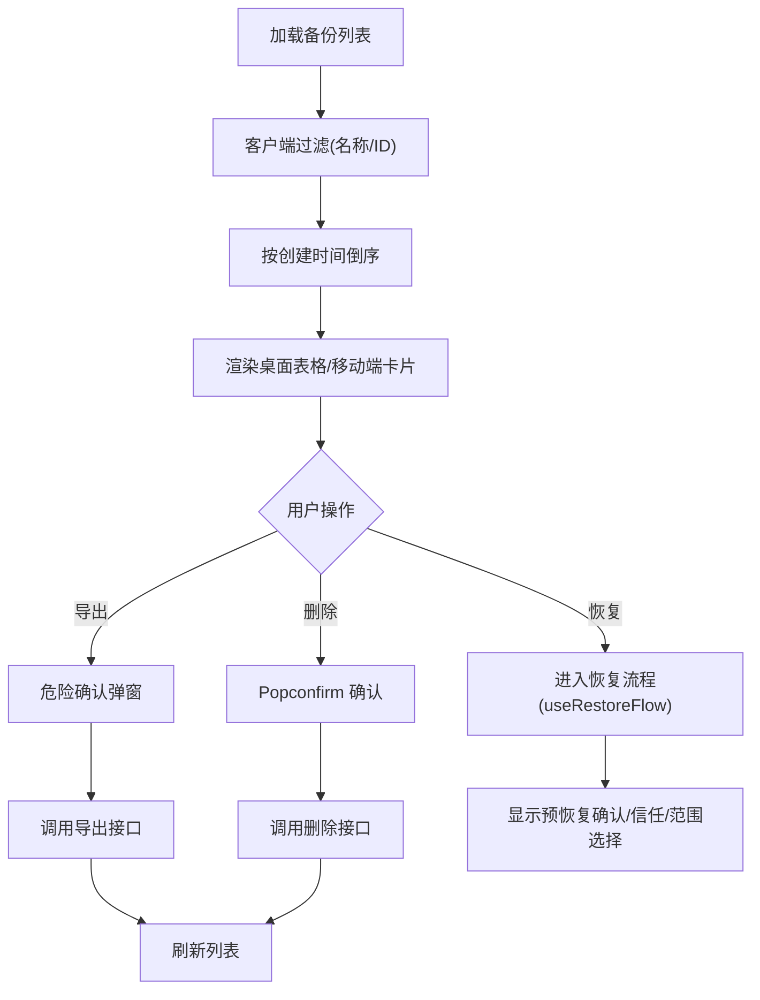
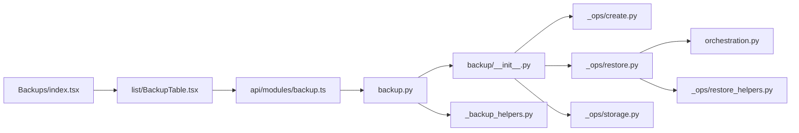

# 备份恢复

<cite>
**本文引用的文件**   
- [backup.py](file://src/qwenpaw/app/routers/backup.py)
- [_backup_helpers.py](file://src/qwenpaw/app/routers/_backup_helpers.py)
- [__init__.py](file://src/qwenpaw/backup/__init__.py)
- [models.py](file://src/qwenpaw/backup/models.py)
- [orchestration.py](file://src/qwenpaw/backup/orchestration.py)
- [create.py](file://src/qwenpaw/backup/_ops/create.py)
- [restore.py](file://src/qwenpaw/backup/_ops/restore.py)
- [restore_helpers.py](file://src/qwenpaw/backup/_ops/restore_helpers.py)
- [storage.py](file://src/qwenpaw/backup/_ops/storage.py)
- [index.tsx](file://console/src/pages/Settings/Backups/index.tsx)
- [BackupTable.tsx](file://console/src/pages/Settings/Backups/list/BackupTable.tsx)
- [useRestoreFlow.test.ts](file://console/src/pages/Settings/Backups/restore/useRestoreFlow.test.ts)
- [backup.ts](file://console/src/api/modules/backup.ts)
</cite>

## 目录
1. [简介](#简介)
2. [项目结构](#项目结构)
3. [核心组件](#核心组件)
4. [架构总览](#架构总览)
5. [详细组件分析](#详细组件分析)
6. [依赖关系分析](#依赖关系分析)
7. [性能与可扩展性](#性能与可扩展性)
8. [故障排查指南](#故障排查指南)
9. [结论](#结论)
10. [附录：API 与前端交互要点](#附录api-与前端交互要点)

## 简介
本章节面向 QwenPaw 的“备份恢复”模块，系统性阐述其数据备份与恢复的架构设计、策略配置、增量与完整性校验思路、任务调度与进度展示、冲突解决与回滚机制，以及前端表格的数据展示、筛选排序与操作确认流程。文档同时提供来自实际代码库的具体示例路径，帮助读者实现自定义备份目标、配置恢复范围与自动化备份计划，并给出常见问题（存储空间管理、大文件传输优化、损坏数据修复）的处理建议。

## 项目结构
QwenPaw 的备份恢复能力由后端路由层、备份业务包、以及控制台前端页面共同组成：
- 后端路由层负责 HTTP API 暴露（创建、列表、详情、导入、导出、删除、恢复）。
- 备份业务包封装了备份创建、存储管理、恢复编排与具体恢复逻辑。
- 前端页面提供备份列表、创建、导入、信任确认、恢复等交互。

**图表来源** 
- [index.tsx:1-157](file://console/src/pages/Settings/Backups/index.tsx#L1-L157)
- [BackupTable.tsx:1-305](file://console/src/pages/Settings/Backups/list/BackupTable.tsx#L1-L305)
- [backup.ts:1-140](file://console/src/api/modules/backup.ts#L1-L140)
- [backup.py:1-323](file://src/qwenpaw/app/routers/backup.py#L1-L323)
- [_backup_helpers.py](file://src/qwenpaw/app/routers/_backup_helpers.py)
- [__init__.py:1-22](file://src/qwenpaw/backup/__init__.py#L1-L22)
- [models.py:1-164](file://src/qwenpaw/backup/models.py#L1-L164)
- [orchestration.py:1-188](file://src/qwenpaw/backup/orchestration.py#L1-L188)
- [create.py:1-225](file://src/qwenpaw/backup/_ops/create.py#L1-L225)
- [restore.py:1-739](file://src/qwenpaw/backup/_ops/restore.py#L1-L739)
- [restore_helpers.py:1-36](file://src/qwenpaw/backup/_ops/restore_helpers.py#L1-L36)
- [storage.py:1-288](file://src/qwenpaw/backup/_ops/storage.py#L1-L288)

**章节来源**
- [index.tsx:1-157](file://console/src/pages/Settings/Backups/index.tsx#L1-L157)
- [backup.py:1-323](file://src/qwenpaw/app/routers/backup.py#L1-L323)
- [__init__.py:1-22](file://src/qwenpaw/backup/__init__.py#L1-L22)

## 核心组件
- 数据模型与请求体
  - 备份元信息、作用域、恢复请求参数、删除请求/响应、备份详情扩展字段等。
- 备份创建与 SSE 进度流
  - 后台线程压缩、事件队列、取消与原子落盘、签名与信任标记。
- 备份存储与清单
  - 列表、详情（含工作区统计）、删除、导出、导入（含冲突与信任处理）。
- 恢复编排与执行
  - 前置校验与信任决策、停止代理与浏览器、分阶段暂存与原子提交、配置合并与回写、新代理注册与工作区路径修正。
- 前端页面与表格
  - 列表渲染、搜索过滤、分页、操作确认（导出/删除）、恢复流程状态机。

**章节来源**
- [models.py:1-164](file://src/qwenpaw/backup/models.py#L1-L164)
- [create.py:1-225](file://src/qwenpaw/backup/_ops/create.py#L1-L225)
- [storage.py:1-288](file://src/qwenpaw/backup/_ops/storage.py#L1-L288)
- [restore.py:1-739](file://src/qwenpaw/backup/_ops/restore.py#L1-L739)
- [orchestration.py:1-188](file://src/qwenpaw/backup/orchestration.py#L1-L188)
- [BackupTable.tsx:1-305](file://console/src/pages/Settings/Backups/list/BackupTable.tsx#L1-L305)

## 架构总览
备份恢复的整体调用链如下：
- 前端通过 REST/SSE 与后端路由交互；
- 路由将请求委派至备份包的公共 API；
- 创建与导入走存储与签名流程；
- 恢复由编排器协调停止/重启代理与浏览器，再调用恢复核心进行两阶段（暂存→提交）原子化写入。

**图表来源** 
- [index.tsx:1-157](file://console/src/pages/Settings/Backups/index.tsx#L1-L157)
- [BackupTable.tsx:1-305](file://console/src/pages/Settings/Backups/list/BackupTable.tsx#L1-L305)
- [backup.ts:1-140](file://console/src/api/modules/backup.ts#L1-L140)
- [backup.py:1-323](file://src/qwenpaw/app/routers/backup.py#L1-L323)
- [__init__.py:1-22](file://src/qwenpaw/backup/__init__.py#L1-L22)
- [orchestration.py:1-188](file://src/qwenpaw/backup/orchestration.py#L1-L188)
- [restore.py:1-739](file://src/qwenpaw/backup/_ops/restore.py#L1-L739)
- [storage.py:1-288](file://src/qwenpaw/backup/_ops/storage.py#L1-L288)

## 详细组件分析

### 备份创建与进度流（SSE）
- 关键特性
  - 后台线程执行压缩，使用 asyncio.Queue 与 loop.call_soon_threadsafe 推送事件，避免阻塞事件循环。
  - 支持客户端断开时取消（设置 stop_event），在下一个可取消点退出且不写入最终文件。
  - 先写入 .tmp，成功后原子替换为 .zip；完成后对 meta.json 进行本地签名与信任标记。
- 事件类型
  - start、agent、saving、done、error，用于前端进度条与状态展示。
- 参考实现
  - 生成器式 SSE 输出、事件形状定义、线程安全推送、取消与清理。

**图表来源** 
- [create.py:1-225](file://src/qwenpaw/backup/_ops/create.py#L1-L225)
- [backup.py:81-103](file://src/qwenpaw/app/routers/backup.py#L81-L103)

**章节来源**
- [create.py:1-225](file://src/qwenpaw/backup/_ops/create.py#L1-L225)
- [backup.py:81-103](file://src/qwenpaw/app/routers/backup.py#L81-L103)

### 备份存储与清单（列表/详情/删除/导入/导出）
- 列表与详情
  - 遍历 BACKUP_DIR 下的 .zip，读取 meta.json 构建列表；详情额外扫描工作区文件统计与 agent.json 名称。
- 删除
  - 批量删除，记录成功与失败项。
- 导入
  - 首次上传保存为临时文件；若 ID 冲突返回 409 与 pending_token，用户确认后重试覆盖；对非本地签名的归档需显式信任（legacy/foreign），并在接受后以本地签名绑定。
- 导出
  - 直接返回 zip 文件下载。
- 参考实现
  - 列表/详情/删除/导入/导出的异步包装与同步实现、冲突异常、信任模式处理。

**图表来源** 
- [storage.py:1-288](file://src/qwenpaw/backup/_ops/storage.py#L1-L288)
- [models.py:1-164](file://src/qwenpaw/backup/models.py#L1-L164)

**章节来源**
- [storage.py:1-288](file://src/qwenpaw/backup/_ops/storage.py#L1-L288)
- [models.py:1-164](file://src/qwenpaw/backup/models.py#L1-L164)
- [backup.py:106-244](file://src/qwenpaw/app/routers/backup.py#L106-L244)

### 恢复编排与执行（停止代理/浏览器 → 恢复 → 重启）
- 编排器职责
  - 获取备份详情、前置校验与信任决策、计算受影响代理集合、必要时扩大停止集（当 include_secrets/include_skill_pool 为真）、停止代理与受管浏览器、调用恢复核心、失败也保证后台预加载已停代理。
- 恢复核心
  - 两阶段：暂存（staging）→ 提交（commit）。
  - 暂存阶段：全局配置（full/custom 合并策略）、secrets、skill pool、各代理工作区；任何失败均丢弃所有暂存产物。
  - 提交阶段：原子替换 config.json、逐个 commit_tmp 目录、必要时重载 master key、重写工作区路径、注册新代理并持久化配置。
- 并发与锁
  - 进程内异步锁串行化恢复请求；进程级锁保护文件系统 swap 段，避免 Windows 下句柄导致的重命名失败。
- 参考实现
  - 编排函数、代理停止/重启、浏览器关闭、目标可用性与冲突检测、配置合并与保留策略。

**图表来源** 
- [orchestration.py:1-188](file://src/qwenpaw/backup/orchestration.py#L1-L188)
- [restore.py:1-739](file://src/qwenpaw/backup/_ops/restore.py#L1-L739)
- [backup.py:261-303](file://src/qwenpaw/app/routers/backup.py#L261-L303)

**章节来源**
- [orchestration.py:1-188](file://src/qwenpaw/backup/orchestration.py#L1-L188)
- [restore.py:1-739](file://src/qwenpaw/backup/_ops/restore.py#L1-L739)
- [restore_helpers.py:1-36](file://src/qwenpaw/backup/_ops/restore_helpers.py#L1-L36)
- [backup.py:261-303](file://src/qwenpaw/app/routers/backup.py#L261-L303)

### 恢复范围与冲突解决策略
- 恢复范围
  - 支持选择性恢复：agents、global_config、secrets、skill pool；可通过 default_workspace_dir 控制新代理工作区根目录。
- 冲突检测
  - 同一批次中不同代理解析到相同物理目录会报错；新代理目标与未参与恢复的现有代理工作区冲突也会报错。
- 配置合并
  - full 模式：整体替换（包括 agents.profiles）。
  - custom 模式：顶层键取自备份，但 agents.profiles 基于当前本地 profiles 重建，仅覆盖被恢复的代理，避免“幽灵代理”。
- 本地受保护键保留
  - 对于显式信任的 legacy/foreign 备份，默认保留本地 security/mcp 等关键键，防止外来配置覆盖本地管控。
- 参考实现
  - 目的地规划、冲突断言、配置合并与覆盖、master_key 冲突处理。

**图表来源** 
- [restore.py:122-191](file://src/qwenpaw/backup/_ops/restore.py#L122-L191)
- [restore.py:579-624](file://src/qwenpaw/backup/_ops/restore.py#L579-L624)
- [restore_helpers.py:1-36](file://src/qwenpaw/backup/_ops/restore_helpers.py#L1-L36)

**章节来源**
- [restore.py:122-191](file://src/qwenpaw/backup/_ops/restore.py#L122-L191)
- [restore.py:579-624](file://src/qwenpaw/backup/_ops/restore.py#L579-L624)
- [restore_helpers.py:1-36](file://src/qwenpaw/backup/_ops/restore_helpers.py#L1-L36)
- [models.py:83-138](file://src/qwenpaw/backup/models.py#L83-L138)

### 前端备份表格组件（展示、筛选、排序、操作确认）
- 数据展示
  - 列表字段：ID、名称、作用域摘要、描述、创建时间；移动端卡片视图。
- 筛选与排序
  - 客户端过滤（名称/ID），按创建时间倒序；分页控件支持切换每页大小。
- 操作确认
  - 导出前弹出危险确认对话框；删除使用 Popconfirm 二次确认；恢复委托给 useRestoreFlow 的状态机。
- 参考实现
  - 表格列定义、搜索与分页、操作按钮与确认弹窗、移动端适配。

**图表来源** 
- [BackupTable.tsx:1-305](file://console/src/pages/Settings/Backups/list/BackupTable.tsx#L1-L305)
- [index.tsx:1-157](file://console/src/pages/Settings/Backups/index.tsx#L1-L157)
- [useRestoreFlow.test.ts:1-110](file://console/src/pages/Settings/Backups/restore/useRestoreFlow.test.ts#L1-L110)

**章节来源**
- [BackupTable.tsx:1-305](file://console/src/pages/Settings/Backups/list/BackupTable.tsx#L1-L305)
- [index.tsx:1-157](file://console/src/pages/Settings/Backups/index.tsx#L1-L157)
- [useRestoreFlow.test.ts:1-110](file://console/src/pages/Settings/Backups/restore/useRestoreFlow.test.ts#L1-L110)

## 依赖关系分析
- 路由层依赖
  - 路由依赖备份包公共 API（创建流、列表、详情、导入、导出、删除、恢复编排）。
  - 路由还依赖辅助工具（信任模式后缀、签名剥离、验证细节转换等）。
- 备份包内部依赖
  - 公共 API 聚合 _ops 子模块；恢复编排依赖恢复核心与存储操作；恢复核心依赖常量、元信息、签名、安全密钥重载等。
- 前端依赖
  - 页面组合多个子功能模块（列表、创建、导入、信任、恢复），并通过统一 API 模块访问后端。

**图表来源** 
- [backup.py:1-323](file://src/qwenpaw/app/routers/backup.py#L1-L323)
- [_backup_helpers.py](file://src/qwenpaw/app/routers/_backup_helpers.py)
- [__init__.py:1-22](file://src/qwenpaw/backup/__init__.py#L1-L22)
- [create.py:1-225](file://src/qwenpaw/backup/_ops/create.py#L1-L225)
- [restore.py:1-739](file://src/qwenpaw/backup/_ops/restore.py#L1-L739)
- [restore_helpers.py:1-36](file://src/qwenpaw/backup/_ops/restore_helpers.py#L1-L36)
- [storage.py:1-288](file://src/qwenpaw/backup/_ops/storage.py#L1-L288)
- [index.tsx:1-157](file://console/src/pages/Settings/Backups/index.tsx#L1-L157)
- [BackupTable.tsx:1-305](file://console/src/pages/Settings/Backups/list/BackupTable.tsx#L1-L305)
- [backup.ts:1-140](file://console/src/api/modules/backup.ts#L1-L140)

**章节来源**
- [backup.py:1-323](file://src/qwenpaw/app/routers/backup.py#L1-L323)
- [__init__.py:1-22](file://src/qwenpaw/backup/__init__.py#L1-L22)
- [backup.ts:1-140](file://console/src/api/modules/backup.ts#L1-L140)

## 性能与可扩展性
- 大文件与高吞吐
  - 创建采用后台线程压缩与事件队列，避免阻塞事件循环；导入/导出使用流式读写与分块传输，降低内存占用。
- 并发与锁
  - 恢复过程通过进程内异步锁与进程级锁双重保护，确保多请求不交错，尤其在 Windows 上避免句柄导致的重命名失败。
- 原子性与回滚
  - 暂存→提交的二阶段策略，失败时丢弃所有暂存产物，保证一致性。
- 可扩展点
  - 自定义备份目标：可在 create 流程中扩展 add_files_to_zip 的扫描与打包逻辑，或新增 scope 选项。
  - 自动化备份计划：结合系统 cron 或应用内定时任务，周期性调用 /backups/stream 并持久化结果。
  - 增量备份：当前实现为全量快照；如需增量，可在 meta 中记录上次备份指纹，对比变更后再追加差异条目（需在 create 与 storage 中扩展）。

[本节为通用指导，无需特定文件引用]

## 故障排查指南
- 常见错误与定位
  - 备份不存在：GET/POST 恢复时返回 404，检查 backup_id 与 ZIP 是否存在。
  - 备份冲突：导入时返回 409，携带 existing 与 pending_token，前端需引导用户确认覆盖。
  - 信任问题：legacy/foreign 备份需显式信任，否则拒绝恢复/导入；根据错误码自动推断信任模式。
  - 目标目录占用：恢复时报错 restore_target_busy，需关闭浏览器或外部进程，必要时重启系统。
- 存储空间管理
  - 定期清理旧备份与临时文件（路由层已内置过期上传清理逻辑）；监控 BACKUP_DIR 容量。
- 大文件传输优化
  - 使用 SSE 进度反馈；导入分块写入；导出直连文件下载；必要时启用 CDN 或对象存储中转。
- 损坏数据修复
  - 若 ZIP 损坏或缺少 meta.json，导入/详情会失败；尝试重新创建备份或使用最近有效副本恢复。
- 参考实现
  - 路由层的错误映射与清理、存储层的异常处理、恢复核心的冲突断言与回滚。

**章节来源**
- [backup.py:52-79](file://src/qwenpaw/app/routers/backup.py#L52-L79)
- [backup.py:124-244](file://src/qwenpaw/app/routers/backup.py#L124-L244)
- [storage.py:141-161](file://src/qwenpaw/backup/_ops/storage.py#L141-L161)
- [restore.py:349-378](file://src/qwenpaw/backup/_ops/restore.py#L349-L378)

## 结论
QwenPaw 的备份恢复模块以清晰的层次划分与严格的原子性保障为核心，提供了从创建、导入、导出、删除到恢复的完整能力。通过 SSE 进度流、信任与签名机制、两阶段暂存与提交、以及前端完善的交互与确认流程，系统在易用性与可靠性之间取得良好平衡。针对大规模场景，建议结合增量策略与外部存储优化，并完善监控告警与自动化计划，以提升整体运维效率与数据安全。

[本节为总结性内容，无需特定文件引用]

## 附录：API 与前端交互要点
- 主要 API
  - 创建备份（SSE）：POST /backups/stream
  - 列表：GET /backups
  - 详情：GET /backups/{backup_id}
  - 导入：POST /backups/import（支持 pending_token 与 trust_mode）
  - 导出：GET /backups/{backup_id}/export
  - 删除：POST /backups/delete
  - 恢复：POST /backups/{backup_id}/restore
- 前端要点
  - 列表页并行拉取备份与代理列表；表格支持搜索、分页、排序；导出/删除有确认弹窗；恢复流程通过 useRestoreFlow 管理状态（预恢复确认、信任、范围选择）。
- 参考实现
  - 路由端点定义与错误映射；前端 API 模块封装与 SSE 解析；页面组合与状态流转。

**章节来源**
- [backup.py:81-323](file://src/qwenpaw/app/routers/backup.py#L81-L323)
- [backup.ts:1-140](file://console/src/api/modules/backup.ts#L1-L140)
- [index.tsx:1-157](file://console/src/pages/Settings/Backups/index.tsx#L1-L157)
- [BackupTable.tsx:1-305](file://console/src/pages/Settings/Backups/list/BackupTable.tsx#L1-L305)