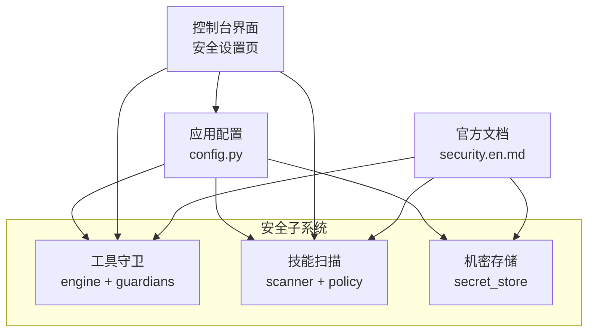
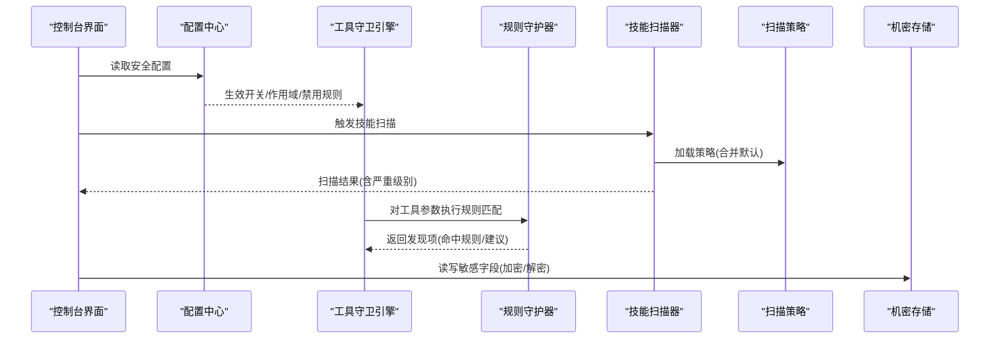
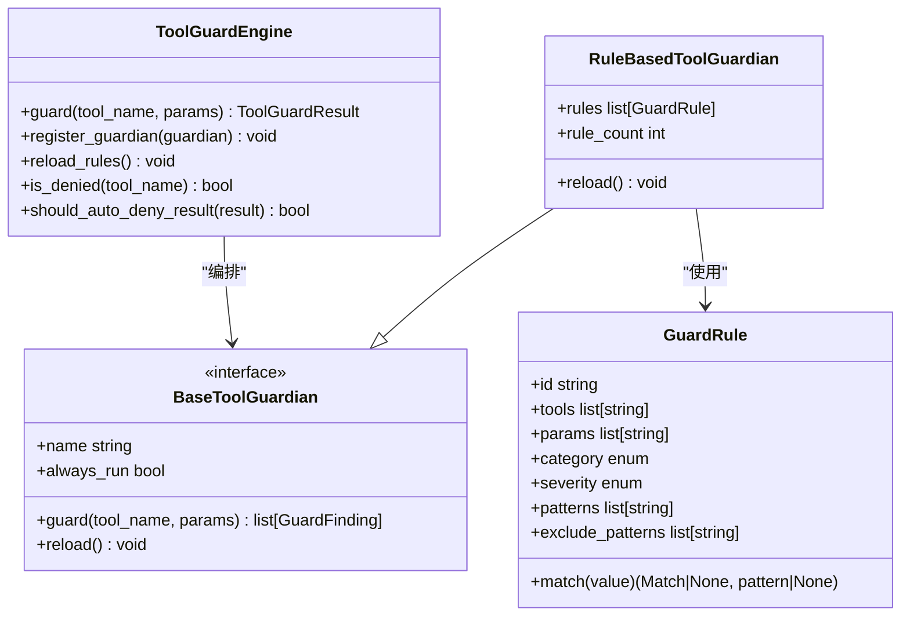
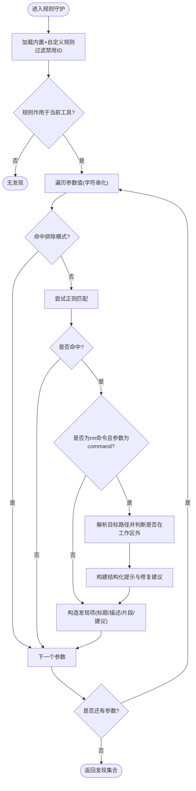
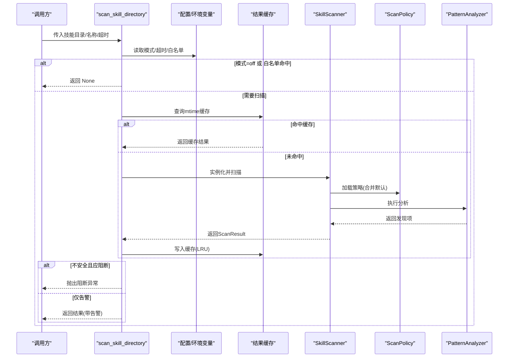
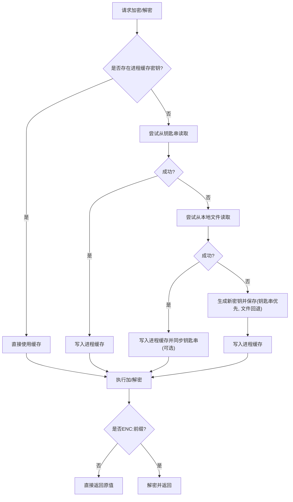
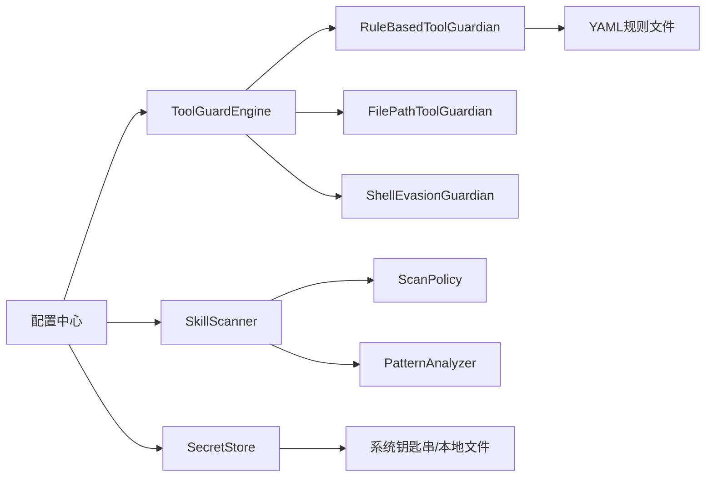

# 安全策略

<cite>
**本文引用的文件**   
- [security/__init__.py](file://src/qwenpaw/security/__init__.py)
- [tool_guard/engine.py](file://src/qwenpaw/security/tool_guard/engine.py)
- [tool_guard/guardians/rule_guardian.py](file://src/qwenpaw/security/tool_guard/guardians/rule_guardian.py)
- [skill_scanner/__init__.py](file://src/qwenpaw/security/skill_scanner/__init__.py)
- [skill_scanner/scanner.py](file://src/qwenpaw/security/skill_scanner/scanner.py)
- [skill_scanner/scan_policy.py](file://src/qwenpaw/security/skill_scanner/scan_policy.py)
- [secret_store.py](file://src/qwenpaw/security/secret_store.py)
- [config/config.py](file://src/qwenpaw/config/config.py)
- [website/public/docs/security.en.md](file://website/public/docs/security.en.md)
</cite>

## 目录
1. [简介](#简介)
2. [项目结构](#项目结构)
3. [核心组件](#核心组件)
4. [架构总览](#架构总览)
5. [详细组件分析](#详细组件分析)
6. [依赖关系分析](#依赖关系分析)
7. [性能与可扩展性](#性能与可扩展性)
8. [故障排查指南](#故障排查指南)
9. [结论](#结论)
10. [附录：配置与示例](#附录配置与示例)

## 简介
本章节面向 QwenPaw 的安全策略模块，系统性阐述多层安全防护体系的设计与实现，包括工具守卫规则、技能扫描策略与访问控制政策。文档覆盖以下关键主题：
- 工具调用前置防护（参数级正则签名匹配、路径保护、Shell 逃逸检测）
- 技能包静态扫描（YAML 规则、组织策略、白名单与阻断历史）
- 敏感信息存储加密（主密钥管理、Fernet 加解密、降级策略）
- 动态配置与实时验证（热重载、环境变量优先级、UI 联动）
- 威胁检测与风险评估（严重等级、自动拒绝、审计记录）
- 合规检查机制（默认策略、可覆盖项、迁移标记）
- 常见问题处理（误报、性能影响、策略更新）

## 项目结构
安全子系统位于 src/qwenpaw/security 下，按职责拆分为三个子域：
- tool_guard：工具调用前置守卫，基于 YAML 规则与守护器编排
- skill_scanner：技能包安装/启用前的静态扫描与策略控制
- secret_store：透明加密层，用于持久化敏感字段

图表来源
- [security/__init__.py:1-21](file://src/qwenpaw/security/__init__.py#L1-L21)
- [config/config.py:2073-2106](file://src/qwenpaw/config/config.py#L2073-L2106)
- [website/public/docs/security.en.md:847-904](file://website/public/docs/security.en.md#L847-L904)

章节来源
- [security/__init__.py:1-21](file://src/qwenpaw/security/__init__.py#L1-L21)
- [config/config.py:2073-2106](file://src/qwenpaw/config/config.py#L2073-L2106)

## 核心组件
- 工具守卫引擎（ToolGuardEngine）
  - 负责发现并运行所有已注册的守护器（规则匹配、文件路径、Shell 逃逸），聚合结果为统一结果对象，支持动态开关、作用域与自动拒绝规则。
- 规则型守护器（RuleBasedToolGuardian）
  - 从 YAML 加载规则，对工具参数进行字符串化后的正则匹配；支持排除模式、自定义规则、禁用规则 ID、rm 命令工作区外目标增强提示。
- 技能扫描器（SkillScanner）
  - 遍历技能目录，执行注册的分析器（默认 PatternAnalyzer），合并结果并按策略去重；提供超时、大小与数量上限等安全阈值。
- 扫描策略（ScanPolicy）
  - 组织级策略定义：文件分类、规则范围、凭据白名单、严重级别覆盖、禁用规则等；支持从 YAML 加载并与内置默认策略合并。
- 机密存储（secret_store）
  - 使用 Fernet（AES-128-CBC + HMAC-SHA256）对敏感字段加解密；主密钥优先存放于系统钥匙串，回退到本地文件；提供字典字段批量加解密接口。

章节来源
- [tool_guard/engine.py:1-269](file://src/qwenpaw/security/tool_guard/engine.py#L1-L269)
- [tool_guard/guardians/rule_guardian.py:1-780](file://src/qwenpaw/security/tool_guard/guardians/rule_guardian.py#L1-L780)
- [skill_scanner/__init__.py:1-487](file://src/qwenpaw/security/skill_scanner/__init__.py#L1-L487)
- [skill_scanner/scanner.py:1-319](file://src/qwenpaw/security/skill_scanner/scanner.py#L1-L319)
- [skill_scanner/scan_policy.py:1-476](file://src/qwenpaw/security/skill_scanner/scan_policy.py#L1-L476)
- [secret_store.py:1-467](file://src/qwenpaw/security/secret_store.py#L1-L467)

## 架构总览
下图展示安全子系统与外部交互的关键路径：配置驱动、运行时守卫、离线扫描与机密存储。

图表来源
- [tool_guard/engine.py:1-269](file://src/qwenpaw/security/tool_guard/engine.py#L1-L269)
- [tool_guard/guardians/rule_guardian.py:1-780](file://src/qwenpaw/security/tool_guard/guardians/rule_guardian.py#L1-L780)
- [skill_scanner/scanner.py:1-319](file://src/qwenpaw/security/skill_scanner/scanner.py#L1-L319)
- [skill_scanner/scan_policy.py:1-476](file://src/qwenpaw/security/skill_scanner/scan_policy.py#L1-L476)
- [secret_store.py:1-467](file://src/qwenpaw/security/secret_store.py#L1-L467)
- [website/public/docs/security.en.md:847-904](file://website/public/docs/security.en.md#L847-L904)

## 详细组件分析

### 工具守卫（Tool Guard）
- 设计要点
  - 守护器可插拔：FilePathToolGuardian、RuleBasedToolGuardian、ShellEvasionGuardian 由引擎统一编排。
  - 动态配置：支持环境变量覆盖、配置热重载、作用域与无条件拒绝工具列表。
  - 自动拒绝：命中特定规则 ID 可直接拒绝，无需人工审批。
- 关键流程
  - 初始化时加载默认守护器，解析 guarded_tools/denied_tools/auto_denied_rules。
  - guard() 遍历守护器收集发现项，统计耗时与失败情况。
  - RuleBasedToolGuardian 从 YAML 加载规则，支持 exclude_patterns 与自定义规则。
  - rm 命令增强：解析目标路径，检测是否在工作区外，生成结构化提示供 UI 展示。

图表来源
- [tool_guard/engine.py:1-269](file://src/qwenpaw/security/tool_guard/engine.py#L1-L269)
- [tool_guard/guardians/rule_guardian.py:1-780](file://src/qwenpaw/security/tool_guard/guardians/rule_guardian.py#L1-L780)

章节来源
- [tool_guard/engine.py:1-269](file://src/qwenpaw/security/tool_guard/engine.py#L1-L269)
- [tool_guard/guardians/rule_guardian.py:1-780](file://src/qwenpaw/security/tool_guard/guardians/rule_guardian.py#L1-L780)

#### 规则匹配与 rm 增强流程图

图表来源
- [tool_guard/guardians/rule_guardian.py:1-780](file://src/qwenpaw/security/tool_guard/guardians/rule_guardian.py#L1-L780)

### 技能扫描（Skill Scanner）
- 设计要点
  - 插件式分析器：默认 PatternAnalyzer（YAML 正则签名），可扩展 LLM 或语义分析器。
  - 组织策略：通过 ScanPolicy 控制文件分类、规则范围、凭据白名单、严重级别覆盖与禁用规则。
  - 安全阈值：最大文件数、单文件大小、跳过扩展集、去重策略。
  - 白名单与阻断历史：支持按名称与内容哈希的白名单；阻断记录持久化便于审计。
- 关键流程
  - scan_skill_directory 根据模式（block/warn/off）、超时、白名单决定是否扫描与是否阻断。
  - SkillScanner.scan_skill 发现文件、执行分析器、去重、汇总结果。
  - ScanPolicy.from_yaml 与默认策略合并，支持导出完整策略以供编辑。

图表来源
- [skill_scanner/__init__.py:1-487](file://src/qwenpaw/security/skill_scanner/__init__.py#L1-L487)
- [skill_scanner/scanner.py:1-319](file://src/qwenpaw/security/skill_scanner/scanner.py#L1-L319)
- [skill_scanner/scan_policy.py:1-476](file://src/qwenpaw/security/skill_scanner/scan_policy.py#L1-L476)

章节来源
- [skill_scanner/__init__.py:1-487](file://src/qwenpaw/security/skill_scanner/__init__.py#L1-L487)
- [skill_scanner/scanner.py:1-319](file://src/qwenpaw/security/skill_scanner/scanner.py#L1-L319)
- [skill_scanner/scan_policy.py:1-476](file://src/qwenpaw/security/skill_scanner/scan_policy.py#L1-L476)

### 机密存储（Secret Store）
- 设计要点
  - 主密钥获取顺序：进程缓存 → 系统钥匙串 → 本地文件 → 生成新密钥并落盘。
  - 环境适配：在容器、无桌面、CI 环境下跳过钥匙串访问，避免阻塞。
  - 透明加解密：ENC: 前缀识别，解密失败时降级返回明文，保证调用方不崩溃。
  - 字典字段批量加解密：针对 provider/auth 等 JSON 中的敏感字段。
- 关键流程
  - encrypt/decrypt 使用 Fernet；reload_master_key_from_disk 支持备份恢复后刷新缓存与钥匙串。

图表来源
- [secret_store.py:1-467](file://src/qwenpaw/security/secret_store.py#L1-L467)

章节来源
- [secret_store.py:1-467](file://src/qwenpaw/security/secret_store.py#L1-L467)

### 访问控制政策（Access Policy）
- 概念说明
  - 声明式策略引擎，决定每次能力调用是允许、拒绝还是要求人工审批。
  - 每客户端独立策略，支持工具级覆盖与源感知（来源渠道、主体身份）。
  - 评估优先级：目标精确度 > 目标类型 > 主体字段数量 > 主体精确度 > 严格程度。
  - 当结果为 ask 时，控制台弹出审批卡片，用户批准或拒绝。
- 参考文档
  - 详见官方文档中“访问控制”章节，包含模型字段、评估流程与审批流。

章节来源
- [website/public/docs/security.en.md:708-798](file://website/public/docs/security.en.md#L708-L798)

## 依赖关系分析
- 组件耦合
  - 工具守卫引擎依赖多个守护器，但通过抽象接口解耦，新增守护器不影响编排逻辑。
  - 规则守护器依赖 YAML 规则与配置，支持热重载，降低重启成本。
  - 技能扫描器依赖策略与默认分析器，策略可被组织自定义覆盖。
  - 机密存储与配置中心解耦，通过环境变量与文件系统协同。
- 外部依赖
  - 配置文件（config.json）与环境变量共同决定行为优先级。
  - 控制台界面提供可视化配置入口，变更即时生效。

图表来源
- [tool_guard/engine.py:1-269](file://src/qwenpaw/security/tool_guard/engine.py#L1-L269)
- [tool_guard/guardians/rule_guardian.py:1-780](file://src/qwenpaw/security/tool_guard/guardians/rule_guardian.py#L1-L780)
- [skill_scanner/scanner.py:1-319](file://src/qwenpaw/security/skill_scanner/scanner.py#L1-L319)
- [skill_scanner/scan_policy.py:1-476](file://src/qwenpaw/security/skill_scanner/scan_policy.py#L1-L476)
- [secret_store.py:1-467](file://src/qwenpaw/security/secret_store.py#L1-L467)
- [config/config.py:2073-2106](file://src/qwenpaw/config/config.py#L2073-L2106)

章节来源
- [tool_guard/engine.py:1-269](file://src/qwenpaw/security/tool_guard/engine.py#L1-L269)
- [skill_scanner/scanner.py:1-319](file://src/qwenpaw/security/skill_scanner/scanner.py#L1-L319)
- [secret_store.py:1-467](file://src/qwenpaw/security/secret_store.py#L1-L467)
- [config/config.py:2073-2106](file://src/qwenpaw/config/config.py#L2073-L2106)

## 性能与可扩展性
- 性能特性
  - 规则匹配采用预编译正则与快速字符串化扫描，适合高频调用场景。
  - 技能扫描具备 mtime 缓存与 LRU 限制，减少重复扫描开销。
  - 机密存储使用进程内缓存与线程锁，避免并发竞争与重复 IO。
- 可扩展性
  - 守护器与分析器均遵循抽象接口，可按需替换或新增（如引入 LLM 判定）。
  - 策略与规则以 YAML 形式维护，便于版本管理与灰度发布。
- 优化建议
  - 合理设置 guarded_tools 作用域，缩小扫描面以降低延迟。
  - 调整扫描策略的文件分类与阈值，平衡覆盖率与性能。
  - 定期清理阻断历史与缓存，避免磁盘膨胀。

## 故障排查指南
- 常见误报
  - 现象：某些合法命令被规则命中。
  - 处理：在规则中添加 exclude_patterns，或在配置中禁用对应规则 ID。
  - 参考：规则守护器的排除模式与禁用规则机制。
- 性能影响评估
  - 现象：工具调用延迟增加。
  - 处理：缩小 guarded_tools 范围、关闭不必要的守护器、优化正则复杂度。
  - 参考：引擎的守护器注册与只执行 always_run 的模式。
- 策略更新与生效
  - 现象：修改规则/策略后未生效。
  - 处理：调用 reload_rules 或重新加载配置；确认环境变量优先级高于配置文件。
  - 参考：引擎的热重载与配置读取顺序。
- 机密存储问题
  - 现象：解密失败或无法读取主密钥。
  - 处理：检查钥匙串可用性、回退文件权限；必要时调用 reload_master_key_from_disk 刷新缓存。
  - 参考：主密钥获取顺序与降级策略。

章节来源
- [tool_guard/engine.py:1-269](file://src/qwenpaw/security/tool_guard/engine.py#L1-L269)
- [tool_guard/guardians/rule_guardian.py:1-780](file://src/qwenpaw/security/tool_guard/guardians/rule_guardian.py#L1-L780)
- [skill_scanner/__init__.py:1-487](file://src/qwenpaw/security/skill_scanner/__init__.py#L1-L487)
- [secret_store.py:1-467](file://src/qwenpaw/security/secret_store.py#L1-L467)

## 结论
QwenPaw 的安全策略模块通过“工具守卫 + 技能扫描 + 机密存储 + 访问控制”的多层防护体系，实现了从参数级到包级的全面安全保障。其模块化设计与声明式策略使得系统具备良好的可扩展性与可运维性。结合控制台可视化配置与热重载能力，管理员可在不中断服务的前提下持续优化安全基线。

## 附录：配置与示例
- 全局安全配置（节选）
  - security.tool_guard.enabled：是否启用工具守卫
  - security.tool_guard.guarded_tools：守卫作用域（null 表示全部）
  - security.tool_guard.denied_tools：无条件拒绝的工具列表
  - security.tool_guard.custom_rules：自定义规则数组
  - security.tool_guard.disabled_rules：禁用的内置规则 ID
  - security.file_guard.enabled：是否启用文件守卫
  - security.skill_scanner.mode：block/warn/off
  - security.sandbox_enabled：沙箱执行开关
  - security.allow_no_auth_hosts：免认证主机白名单
  - security.trusted_proxies：可信代理 IP/CIDR 列表
- 参考文档
  - 完整配置示例与字段说明见官方文档“安全”与“配置”章节。

章节来源
- [config/config.py:2073-2106](file://src/qwenpaw/config/config.py#L2073-L2106)
- [website/public/docs/security.en.md:847-904](file://website/public/docs/security.en.md#L847-L904)
- [website/public/docs/config.en.md:537-556](file://website/public/docs/config.en.md#L537-L556)