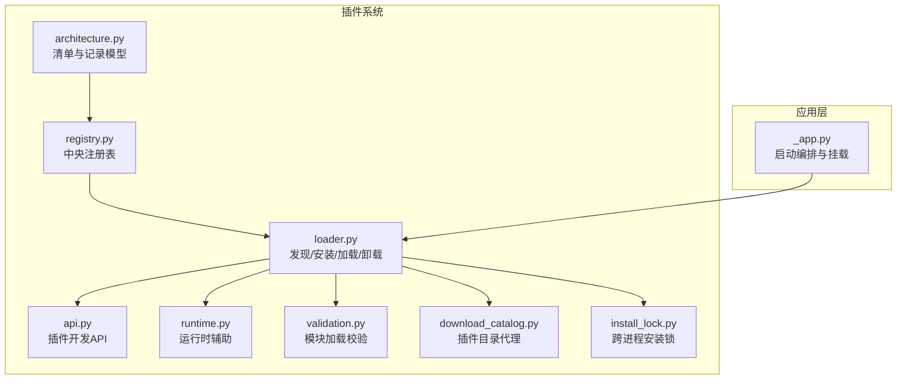
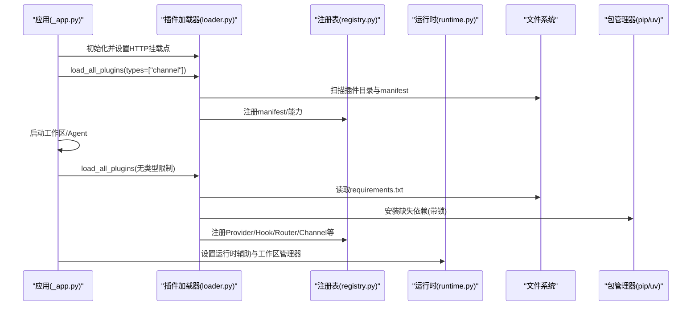
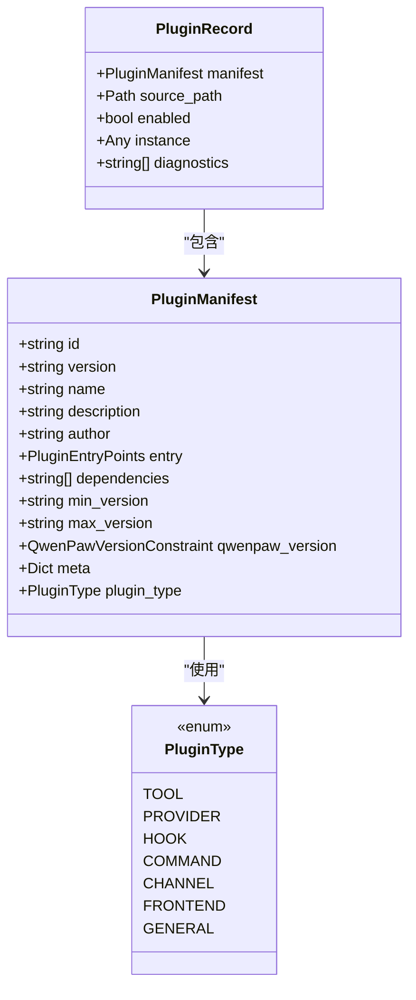
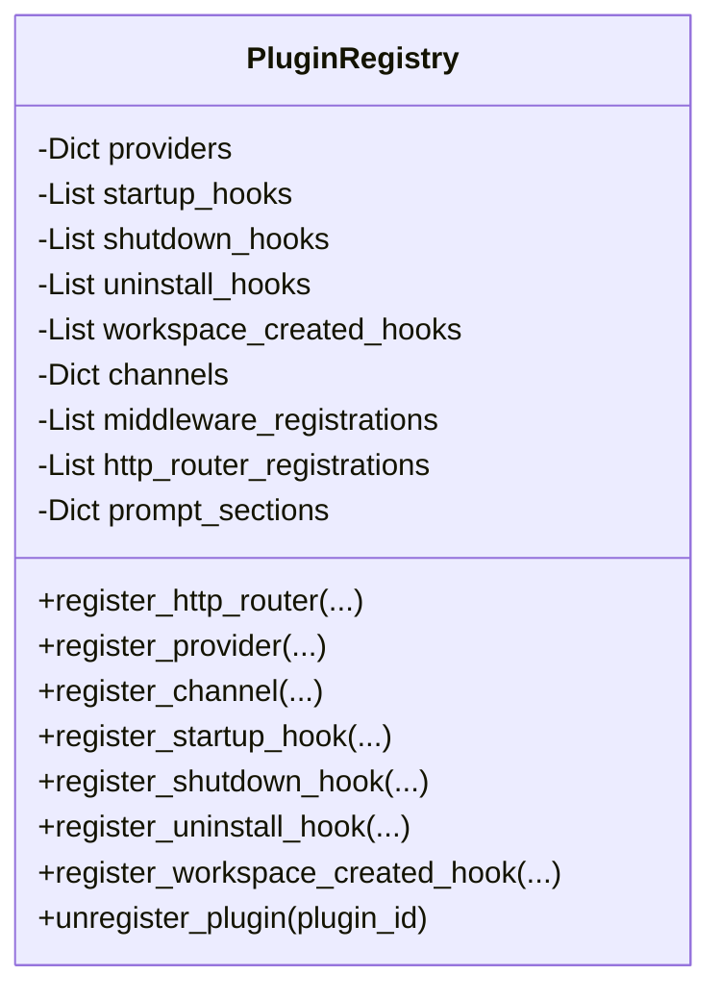
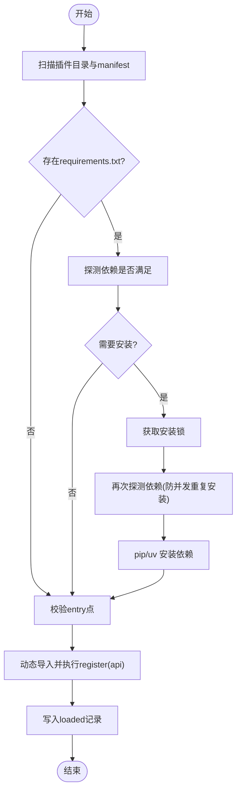
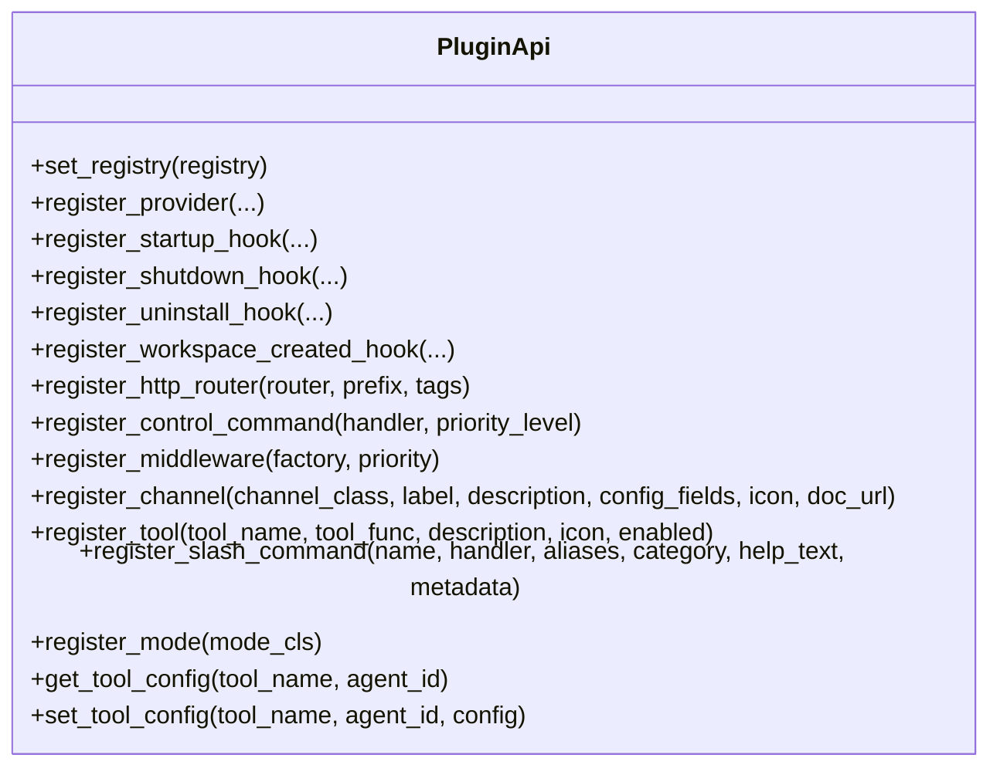
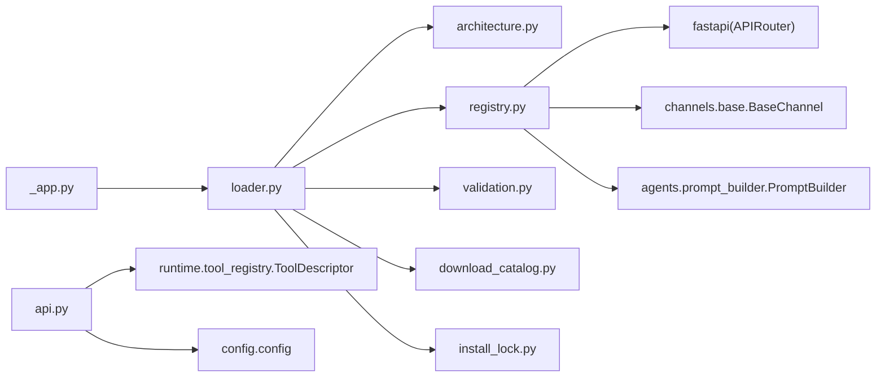

# 插件管理

<cite>
**本文引用的文件**
- [src/qwenpaw/plugins/__init__.py](file://src/qwenpaw/plugins/__init__.py)
- [src/qwenpaw/plugins/architecture.py](file://src/qwenpaw/plugins/architecture.py)
- [src/qwenpaw/plugins/api.py](file://src/qwenpaw/plugins/api.py)
- [src/qwenpaw/plugins/loader.py](file://src/qwenpaw/plugins/loader.py)
- [src/qwenpaw/plugins/registry.py](file://src/qwenpaw/plugins/registry.py)
- [src/qwenpaw/plugins/runtime.py](file://src/qwenpaw/plugins/runtime.py)
- [src/qwenpaw/plugins/validation.py](file://src/qwenpaw/plugins/validation.py)
- [src/qwenpaw/plugins/download_catalog.py](file://src/qwenpaw/plugins/download_catalog.py)
- [src/qwenpaw/plugins/install_lock.py](file://src/qwenpaw/plugins/install_lock.py)
- [src/qwenpaw/app/_app.py](file://src/qwenpaw/app/_app.py)
- [tests/integration/test_plugins.py](file://tests/integration/test_plugins.py)
- [tests/integration/test_plugin_types.py](file://tests/integration/test_plugin_types.py)
</cite>

## 目录
1. [简介](#简介)
2. [项目结构](#项目结构)
3. [核心组件](#核心组件)
4. [架构总览](#架构总览)
5. [详细组件分析](#详细组件分析)
6. [依赖关系分析](#依赖关系分析)
7. [性能与并发特性](#性能与并发特性)
8. [故障排查指南](#故障排查指南)
9. [结论](#结论)
10. [附录：前端插件卡片与状态管理（概念性）](#附录前端插件卡片与状态管理概念性)

## 简介
本文件系统性梳理 QwenPaw 的插件管理系统，覆盖插件的发现、安装、卸载、版本控制、元数据解析、依赖管理、安全扫描流程、动态加载机制，以及插件生命周期钩子。同时给出插件市场集成路径、自定义安装流程的实现要点，并总结常见问题与解决方案（如依赖冲突、崩溃隔离、热更新）。文档既面向初学者，也为有经验的开发者提供足够的技术深度与可追溯的代码级来源。

## 项目结构
插件系统位于 src/qwenpaw/plugins 下，围绕“清单模型 + 注册表 + 加载器 + API + 运行时辅助”展开；下载目录与锁机制分别由 download_catalog.py 与 install_lock.py 提供；应用启动阶段在 _app.py 中完成插件加载编排。

图表来源
- [src/qwenpaw/plugins/architecture.py:1-221](file://src/qwenpaw/plugins/architecture.py#L1-L221)
- [src/qwenpaw/plugins/registry.py:1-200](file://src/qwenpaw/plugins/registry.py#L1-L200)
- [src/qwenpaw/plugins/loader.py:120-200](file://src/qwenpaw/plugins/loader.py#L120-L200)
- [src/qwenpaw/plugins/api.py:170-250](file://src/qwenpaw/plugins/api.py#L170-L250)
- [src/qwenpaw/plugins/runtime.py:1-68](file://src/qwenpaw/plugins/runtime.py#L1-L68)
- [src/qwenpaw/plugins/validation.py:1-78](file://src/qwenpaw/plugins/validation.py#L1-L78)
- [src/qwenpaw/plugins/download_catalog.py:188-274](file://src/qwenpaw/plugins/download_catalog.py#L188-L274)
- [src/qwenpaw/plugins/install_lock.py:82-155](file://src/qwenpaw/plugins/install_lock.py#L82-L155)
- [src/qwenpaw/app/_app.py:513-550](file://src/qwenpaw/app/_app.py#L513-L550)

章节来源
- [src/qwenpaw/plugins/__init__.py:1-17](file://src/qwenpaw/plugins/__init__.py#L1-L17)
- [src/qwenpaw/app/_app.py:513-550](file://src/qwenpaw/app/_app.py#L513-L550)

## 核心组件
- 清单与记录模型（PluginManifest、PluginRecord、PluginType）
  - 负责解析 plugin.json，兼容旧字段与国际化文本，推断插件类型，声明 QwenPaw 版本约束。
- 中央注册表（PluginRegistry）
  - 统一管理 Provider、Hook、Channel、HTTP Router、Prompt Section、Control Command、Middleware 等注册项，支持按插件 ID 清理。
- 加载器（PluginLoader）
  - 负责发现、依赖检查与安装、动态导入、热加载/卸载、工具注入、sys.modules/sys.path 清理。
- 插件 API（PluginApi）
  - 为插件开发者暴露 register_tool/register_channel/register_provider/register_*_hook 等能力。
- 运行时辅助（RuntimeHelpers）
  - 提供 provider 查询、日志等运行时能力。
- 下载目录代理（build_plugin_catalog）
  - 从 CDN 拉取主索引与插件索引，过滤不兼容条目，生成控制台可用的列表。
- 安装锁（plugin_install_lock）
  - 基于 OS 文件锁的跨进程互斥，避免重复 pip install 导致 OOM 或 .dist-info 损坏。
- 校验器（validate_plugin_module）
  - 以与加载器一致的语义进行模块导入验证，用于 CLI 校验与安装前检查。

章节来源
- [src/qwenpaw/plugins/architecture.py:100-221](file://src/qwenpaw/plugins/architecture.py#L100-L221)
- [src/qwenpaw/plugins/registry.py:129-200](file://src/qwenpaw/plugins/registry.py#L129-L200)
- [src/qwenpaw/plugins/loader.py:119-200](file://src/qwenpaw/plugins/loader.py#L119-L200)
- [src/qwenpaw/plugins/api.py:172-250](file://src/qwenpaw/plugins/api.py#L172-L250)
- [src/qwenpaw/plugins/runtime.py:10-68](file://src/qwenpaw/plugins/runtime.py#L10-L68)
- [src/qwenpaw/plugins/download_catalog.py:188-274](file://src/qwenpaw/plugins/download_catalog.py#L188-L274)
- [src/qwenpaw/plugins/install_lock.py:82-155](file://src/qwenpaw/plugins/install_lock.py#L82-L155)
- [src/qwenpaw/plugins/validation.py:15-78](file://src/qwenpaw/plugins/validation.py#L15-L78)

## 架构总览
插件系统在应用启动时分两阶段加载：先加载 channel 类插件，再加载其余插件；随后设置运行时辅助与工作区管理器引用。插件通过 PluginApi 向注册表登记能力，注册表将 HTTP 路由插入到 SPA 捕获路由之前，确保 /api/* 优先匹配。

图表来源
- [src/qwenpaw/app/_app.py:513-550](file://src/qwenpaw/app/_app.py#L513-L550)
- [src/qwenpaw/plugins/loader.py:609-640](file://src/qwenpaw/plugins/loader.py#L609-L640)
- [src/qwenpaw/plugins/registry.py:209-293](file://src/qwenpaw/plugins/registry.py#L209-L293)
- [src/qwenpaw/plugins/runtime.py:10-68](file://src/qwenpaw/plugins/runtime.py#L10-L68)

## 详细组件分析

### 清单与版本约束（PluginManifest/PluginRecord）
- 支持 name/description/author 的国际化映射自动转字符串。
- 兼容旧 entry_point 字段合并至 entry.backend。
- 未显式 type 时根据 meta 与 entry 推断插件类型。
- qwenpaw_version 采用左闭右开区间；缺失时回退 min/max 字段。
- PluginRecord 承载已加载实例、源路径、启用状态与诊断信息。

图表来源
- [src/qwenpaw/plugins/architecture.py:100-221](file://src/qwenpaw/plugins/architecture.py#L100-L221)

章节来源
- [src/qwenpaw/plugins/architecture.py:114-221](file://src/qwenpaw/plugins/architecture.py#L114-L221)

### 中央注册表（PluginRegistry）
- 统一维护 Provider、Hook（启动/关闭/卸载/工作区创建）、Channel、HTTP Router、Prompt Section、Control Command、Middleware 等。
- HTTP 路由在 FastAPI 应用中插入到 SPA catch-all 之前，保证 /api/* 优先命中。
- 支持按插件 ID 批量注销，包括路由、通道、提示段等。

图表来源
- [src/qwenpaw/plugins/registry.py:129-200](file://src/qwenpaw/plugins/registry.py#L129-L200)
- [src/qwenpaw/plugins/registry.py:209-293](file://src/qwenpaw/plugins/registry.py#L209-L293)
- [src/qwenpaw/plugins/registry.py:749-855](file://src/qwenpaw/plugins/registry.py#L749-L855)
- [src/qwenpaw/plugins/registry.py:934-993](file://src/qwenpaw/plugins/registry.py#L934-L993)

章节来源
- [src/qwenpaw/plugins/registry.py:129-200](file://src/qwenpaw/plugins/registry.py#L129-L200)
- [src/qwenpaw/plugins/registry.py:209-293](file://src/qwenpaw/plugins/registry.py#L209-L293)
- [src/qwenpaw/plugins/registry.py:749-855](file://src/qwenpaw/plugins/registry.py#L749-L855)
- [src/qwenpaw/plugins/registry.py:934-993](file://src/qwenpaw/plugins/registry.py#L934-L993)

### 插件加载器（PluginLoader）
- 发现：遍历插件目录，跳过隐藏与 .disabled 后缀目录，解析 manifest。
- 依赖：检测 requirements.txt，双探针（importlib.metadata + importlib.util.find_spec）判定是否满足；必要时调用 pip/uv 安装。
- 动态加载：按 module_name=plugin_{id} 命名空间执行模块，要求导出 plugin.register(api)。
- 热卸载：执行 shutdown/uninstall 钩子，清理 sys.modules/sys.path、注册表与 tools 模块引用。
- 安装入口：load_plugin_from_path 支持复制源码、安装依赖、重新读取 manifest 后加载。

图表来源
- [src/qwenpaw/plugins/loader.py:132-173](file://src/qwenpaw/plugins/loader.py#L132-L173)
- [src/qwenpaw/plugins/loader.py:209-268](file://src/qwenpaw/plugins/loader.py#L209-L268)
- [src/qwenpaw/plugins/loader.py:322-335](file://src/qwenpaw/plugins/loader.py#L322-L335)
- [src/qwenpaw/plugins/loader.py:376-458](file://src/qwenpaw/plugins/loader.py#L376-L458)
- [src/qwenpaw/plugins/loader.py:514-608](file://src/qwenpaw/plugins/loader.py#L514-L608)
- [src/qwenpaw/plugins/loader.py:894-974](file://src/qwenpaw/plugins/loader.py#L894-L974)
- [src/qwenpaw/plugins/loader.py:975-1096](file://src/qwenpaw/plugins/loader.py#L975-L1096)

章节来源
- [src/qwenpaw/plugins/loader.py:119-200](file://src/qwenpaw/plugins/loader.py#L119-L200)
- [src/qwenpaw/plugins/loader.py:209-268](file://src/qwenpaw/plugins/loader.py#L209-L268)
- [src/qwenpaw/plugins/loader.py:322-335](file://src/qwenpaw/plugins/loader.py#L322-L335)
- [src/qwenpaw/plugins/loader.py:376-458](file://src/qwenpaw/plugins/loader.py#L376-L458)
- [src/qwenpaw/plugins/loader.py:514-608](file://src/qwenpaw/plugins/loader.py#L514-L608)
- [src/qwenpaw/plugins/loader.py:894-974](file://src/qwenpaw/plugins/loader.py#L894-L974)
- [src/qwenpaw/plugins/loader.py:975-1096](file://src/qwenpaw/plugins/loader.py#L975-L1096)

### 插件 API（PluginApi）
- 提供 register_tool/register_channel/register_provider/register_*_hook/register_middleware/register_slash_command/register_mode 等接口。
- register_tool 会在启动钩子中将函数注入 qwenpaw.agents.tools 与运行时 ToolRegistry，并持久化默认配置。
- register_channel 支持 config_fields 描述，便于前端渲染配置表单。
- register_http_router 将 FastAPI APIRouter 挂载到 /api/{prefix}，并在注册表中记录以便卸载时移除。

图表来源
- [src/qwenpaw/plugins/api.py:172-250](file://src/qwenpaw/plugins/api.py#L172-L250)
- [src/qwenpaw/plugins/api.py:614-698](file://src/qwenpaw/plugins/api.py#L614-L698)
- [src/qwenpaw/plugins/api.py:483-571](file://src/qwenpaw/plugins/api.py#L483-L571)
- [src/qwenpaw/plugins/api.py:394-424](file://src/qwenpaw/plugins/api.py#L394-L424)

章节来源
- [src/qwenpaw/plugins/api.py:172-250](file://src/qwenpaw/plugins/api.py#L172-L250)
- [src/qwenpaw/plugins/api.py:614-698](file://src/qwenpaw/plugins/api.py#L614-L698)
- [src/qwenpaw/plugins/api.py:483-571](file://src/qwenpaw/plugins/api.py#L483-L571)
- [src/qwenpaw/plugins/api.py:394-424](file://src/qwenpaw/plugins/api.py#L394-L424)

### 运行时辅助（RuntimeHelpers）
- 提供 get_provider/list_providers/log_info/log_error/log_debug 等便捷方法，供插件在运行期访问宿主能力。

章节来源
- [src/qwenpaw/plugins/runtime.py:10-68](file://src/qwenpaw/plugins/runtime.py#L10-L68)

### 插件目录代理（Catalog）
- 从 CDN 拉取主索引与插件索引，过滤不兼容条目（qwenpaw_version 或 min/max），返回 plugins 列表与错误信息。
- 对本地已安装插件标注 installed/installed_version/upgrade_available 等信息，供控制台展示。

章节来源
- [src/qwenpaw/plugins/download_catalog.py:188-274](file://src/qwenpaw/plugins/download_catalog.py#L188-L274)

### 安装锁（跨进程互斥）
- 基于 OS 文件锁（fcntl/msvcrt），非阻塞尝试+轮询等待，超时后仍允许继续安装以避免永久阻塞。
- 每个插件独立锁文件，避免无关插件互相影响。

章节来源
- [src/qwenpaw/plugins/install_lock.py:82-155](file://src/qwenpaw/plugins/install_lock.py#L82-L155)

### 模块加载校验（CLI/安装前）
- 以与加载器一致的命名空间与搜索路径执行模块，确保相对导入正确，并在 finally 中清理临时模块。

章节来源
- [src/qwenpaw/plugins/validation.py:15-78](file://src/qwenpaw/plugins/validation.py#L15-L78)

## 依赖关系分析
- loader 依赖 architecture（清单模型）、registry（注册表）、api（插件API）、install_lock（安装锁）、download_catalog（目录代理）。
- registry 依赖 fastapi（路由挂载）、app.channels.base（通道基类校验）、agents.prompt_builder（提示段锚点校验）。
- api 依赖 runtime.tool_registry（工具描述符）、config.config（工具配置读写）、app.agent_context（当前 Agent 上下文）。
- app._app 在启动时编排加载顺序并注入运行时与工作区管理器。

图表来源
- [src/qwenpaw/plugins/loader.py:1-25](file://src/qwenpaw/plugins/loader.py#L1-L25)
- [src/qwenpaw/plugins/registry.py:1-20](file://src/qwenpaw/plugins/registry.py#L1-L20)
- [src/qwenpaw/plugins/api.py:54-113](file://src/qwenpaw/plugins/api.py#L54-L113)
- [src/qwenpaw/app/_app.py:513-550](file://src/qwenpaw/app/_app.py#L513-L550)

章节来源
- [src/qwenpaw/plugins/loader.py:1-25](file://src/qwenpaw/plugins/loader.py#L1-L25)
- [src/qwenpaw/plugins/registry.py:1-20](file://src/qwenpaw/plugins/registry.py#L1-L20)
- [src/qwenpaw/plugins/api.py:54-113](file://src/qwenpaw/plugins/api.py#L54-L113)
- [src/qwenpaw/app/_app.py:513-550](file://src/qwenpaw/app/_app.py#L513-L550)

## 性能与并发特性
- 依赖安装串行化：同一插件的安装操作通过文件锁串行，避免重复 pip 进程导致的内存峰值与 .dist-info 损坏。
- 双重探测：先查 importlib.metadata（--target 安装有效），再查 find_spec（冻结构建内嵌包），减少误报与重复安装。
- 异步友好：安装过程通过 asyncio.to_thread 在后台线程执行，不阻塞事件循环。
- 路由插入优化：插件路由插入到 SPA catch-all 之前，避免额外匹配开销。

章节来源
- [src/qwenpaw/plugins/install_lock.py:82-155](file://src/qwenpaw/plugins/install_lock.py#L82-L155)
- [src/qwenpaw/plugins/loader.py:209-268](file://src/qwenpaw/plugins/loader.py#L209-L268)
- [src/qwenpaw/plugins/loader.py:300-305](file://src/qwenpaw/plugins/loader.py#L300-L305)
- [src/qwenpaw/plugins/registry.py:29-52](file://src/qwenpaw/plugins/registry.py#L29-L52)

## 故障排查指南
- 插件无法加载
  - 检查 manifest 是否包含有效的 entry.backend/entry.frontend；缺少会抛出 FileNotFoundError。
  - 确认插件实现了 plugin.register(api)，否则抛出 AttributeError。
  - 参考：[src/qwenpaw/plugins/loader.py:336-374](file://src/qwenpaw/plugins/loader.py#L336-L374)、[src/qwenpaw/plugins/loader.py:414-458](file://src/qwenpaw/plugins/loader.py#L414-L458)
- 依赖安装失败或超时
  - 查看日志中的 pip/uv 输出；若 pip 不可用，会自动尝试 uv；均失败则抛出 RuntimeError。
  - 参考：[src/qwenpaw/plugins/loader.py:721-835](file://src/qwenpaw/plugins/loader.py#L721-L835)
- 热卸载后工具仍可见
  - 确认卸载流程已清理 qwenpaw.agents.tools 与 sys.modules；必要时重启后端。
  - 参考：[src/qwenpaw/plugins/loader.py:1098-1146](file://src/qwenpaw/plugins/loader.py#L1098-L1146)
- 插件路由冲突或未生效
  - 检查 prefix 是否唯一且不以 "/" 单独出现；确认 FastAPI 应用已设置。
  - 参考：[src/qwenpaw/plugins/registry.py:220-293](file://src/qwenpaw/plugins/registry.py#L220-L293)
- 频道注册被拒绝
  - 键名需小写且不与内置冲突；类型必须为 BaseChannel 子类。
  - 参考：[src/qwenpaw/plugins/registry.py:749-855](file://src/qwenpaw/plugins/registry.py#L749-L855)
- 目录代理不可用
  - CDN 不可达时返回空列表与 error 字段，不会抛 5xx；检查网络与代理配置。
  - 参考：[src/qwenpaw/plugins/download_catalog.py:188-274](file://src/qwenpaw/plugins/download_catalog.py#L188-L274)

章节来源
- [src/qwenpaw/plugins/loader.py:336-374](file://src/qwenpaw/plugins/loader.py#L336-L374)
- [src/qwenpaw/plugins/loader.py:414-458](file://src/qwenpaw/plugins/loader.py#L414-L458)
- [src/qwenpaw/plugins/loader.py:721-835](file://src/qwenpaw/plugins/loader.py#L721-L835)
- [src/qwenpaw/plugins/loader.py:1098-1146](file://src/qwenpaw/plugins/loader.py#L1098-L1146)
- [src/qwenpaw/plugins/registry.py:220-293](file://src/qwenpaw/plugins/registry.py#L220-L293)
- [src/qwenpaw/plugins/registry.py:749-855](file://src/qwenpaw/plugins/registry.py#L749-L855)
- [src/qwenpaw/plugins/download_catalog.py:188-274](file://src/qwenpaw/plugins/download_catalog.py#L188-L274)

## 结论
QwenPaw 的插件系统以强类型清单与集中注册表为核心，配合健壮的安装器与安全的动态加载机制，提供了完善的插件生态管理能力。通过明确的钩子体系、严格的依赖与版本约束、跨进程安装锁与热卸载清理，系统在易用性与稳定性之间取得良好平衡。结合目录代理与前端能力扩展点，可实现从市场浏览到一键安装的完整闭环。

## 附录：前端插件卡片与状态管理（概念性）
- 信息展示
  - 名称、描述（支持多语言）、作者、版本、大小、SHA256、安装来源、是否已安装、是否有可用升级。
- 状态管理
  - 本地已安装版本 vs 目录最新版本比较，标记 upgrade_available。
- 操作反馈
  - 安装/卸载/升级按钮触发对应 API，返回成功/失败消息，刷新列表与状态。
- 示例参考（后端契约）
  - 目录接口返回结构与字段定义见目录代理实现。
  - 安装/卸载/状态接口行为见集成测试用例。

章节来源
- [src/qwenpaw/plugins/download_catalog.py:188-274](file://src/qwenpaw/plugins/download_catalog.py#L188-L274)
- [tests/integration/test_plugins.py:392-446](file://tests/integration/test_plugins.py#L392-L446)
- [tests/integration/test_plugins.py:451-498](file://tests/integration/test_plugins.py#L451-L498)
- [tests/integration/test_plugins.py:505-576](file://tests/integration/test_plugins.py#L505-L576)