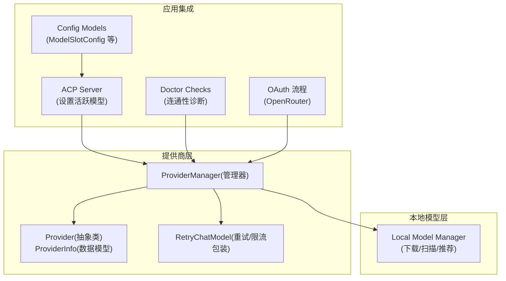
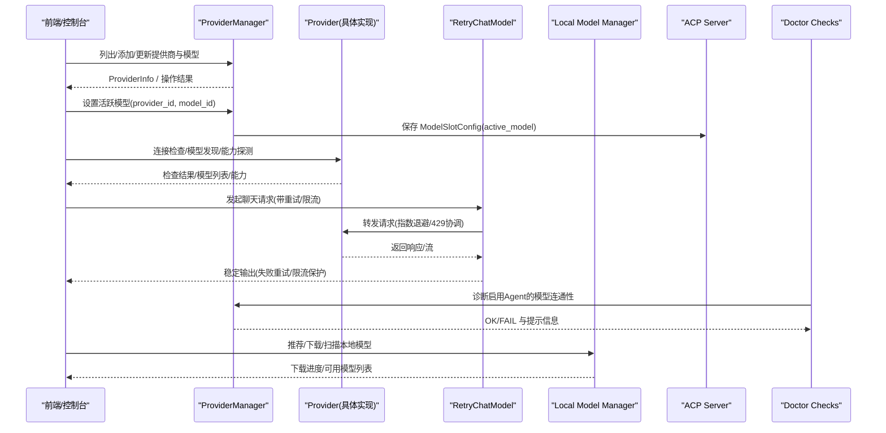
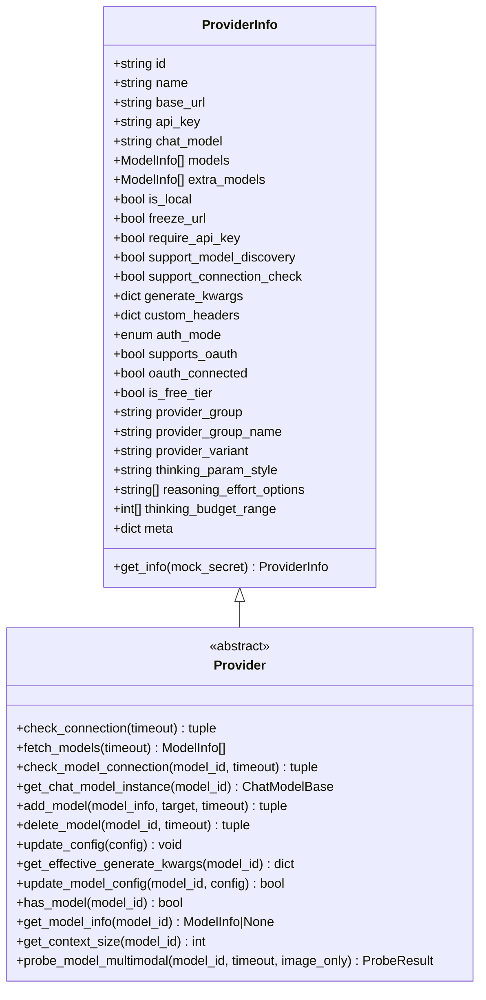
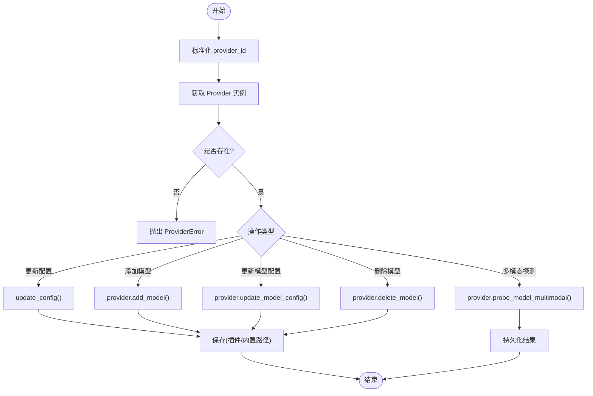
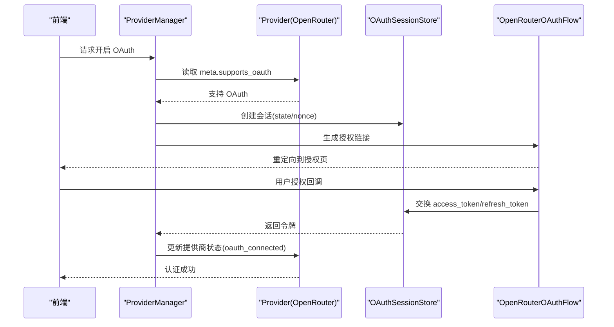
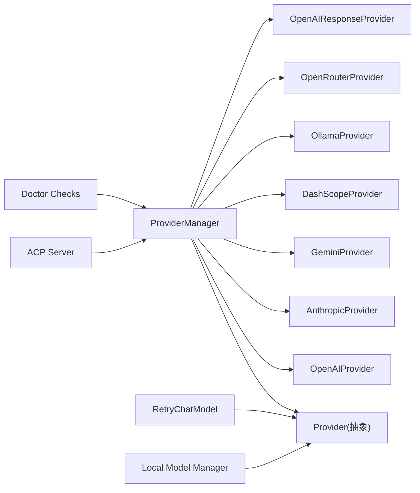

# 模型管理

<cite>
**本文引用的文件**   
- [provider.py](file://src/qwenpaw/providers/provider.py)
- [provider_manager.py](file://src/qwenpaw/providers/provider_manager.py)
- [retry_chat_model.py](file://src/qwenpaw/providers/retry_chat_model.py)
- [model_manager.py](file://src/qwenpaw/local_models/model_manager.py)
- [server.py](file://src/qwenpaw/agents/acp/server.py)
- [__init__.py](file://src/qwenpaw/providers/oauth/__init__.py)
- [config.py](file://src/qwenpaw/config/config.py)
- [doctor_checks.py](file://src/qwenpaw/cli/doctor_checks.py)
</cite>

## 目录
1. [简介](#简介)
2. [项目结构](#项目结构)
3. [核心组件](#核心组件)
4. [架构总览](#架构总览)
5. [详细组件分析](#详细组件分析)
6. [依赖关系分析](#依赖关系分析)
7. [性能与可靠性](#性能与可靠性)
8. [故障排查指南](#故障排查指南)
9. [结论](#结论)
10. [附录：扩展与最佳实践](#附录扩展与最佳实践)

## 简介
本章节面向 QwenPaw 的“模型管理”模块，系统性阐述提供商（Provider）配置与管理机制、云端与本地模型的区分、提供商分组逻辑与模型选择策略；并深入解析 ProviderInfo 数据结构、配置校验规则、OAuth 认证流程、模型列表同步与能力探测。同时覆盖提供商卡片组件的状态管理、搜索过滤算法与性能优化策略，给出添加新提供商、自定义配置表单与处理认证错误的实操指引，以及网络超时重试、配置冲突检测、版本兼容性检查等常见问题解决方案。

## 项目结构
模型管理相关代码主要分布在以下位置：
- 提供商抽象与数据模型：src/qwenpaw/providers/provider.py
- 提供商管理器与内置定义：src/qwenpaw/providers/provider_manager.py
- 重试与限流封装：src/qwenpaw/providers/retry_chat_model.py
- 本地模型下载与管理：src/qwenpaw/local_models/model_manager.py
- ACP 服务中模型选择与持久化：src/qwenpaw/agents/acp/server.py
- OAuth 基础与 OpenRouter 流程：src/qwenpaw/providers/oauth/__init__.py
- 配置模型（含 ModelSlotConfig）：src/qwenpaw/config/config.py
- 诊断与连通性检查：src/qwenpaw/cli/doctor_checks.py

图表来源
- [provider.py:137-272](file://src/qwenpaw/providers/provider.py#L137-L272)
- [provider_manager.py:1334-1338](file://src/qwenpaw/providers/provider_manager.py#L1334-L1338)
- [retry_chat_model.py:318-350](file://src/qwenpaw/providers/retry_chat_model.py#L318-L350)
- [model_manager.py:63-77](file://src/qwenpaw/local_models/model_manager.py#L63-L77)
- [server.py:1323-1363](file://src/qwenpaw/agents/acp/server.py#L1323-L1363)
- [config.py:1562-1569](file://src/qwenpaw/config/config.py#L1562-L1569)
- [doctor_checks.py:1211-1284](file://src/qwenpaw/cli/doctor_checks.py#L1211-L1284)

章节来源
- [provider.py:137-272](file://src/qwenpaw/providers/provider.py#L137-L272)
- [provider_manager.py:1334-1338](file://src/qwenpaw/providers/provider_manager.py#L1334-L1338)
- [retry_chat_model.py:318-350](file://src/qwenpaw/providers/retry_chat_model.py#L318-L350)
- [model_manager.py:63-77](file://src/qwenpaw/local_models/model_manager.py#L63-L77)
- [server.py:1323-1363](file://src/qwenpaw/agents/acp/server.py#L1323-L1363)
- [config.py:1562-1569](file://src/qwenpaw/config/config.py#L1562-L1569)
- [doctor_checks.py:1211-1284](file://src/qwenpaw/cli/doctor_checks.py#L1211-L1284)

## 核心组件
- ProviderInfo 与 Provider
  - ProviderInfo 描述提供商元数据与配置项，包括 id、name、base_url、api_key、chat_model、models、extra_models、is_local、freeze_url、require_api_key、support_model_discovery、support_connection_check、generate_kwargs、custom_headers、auth_mode、supports_oauth、oauth_connected、is_free_tier、provider_group/group_name/variant、thinking 参数风格与范围、meta 等。
  - Provider 继承自 ProviderInfo，提供抽象方法 check_connection、fetch_models、check_model_connection、get_chat_model_instance，以及 add/delete/update 模型、合并生成参数、上下文窗口解析、思考参数注入等通用能力。
- ProviderManager
  - 统一管理内置、插件与自定义提供商；负责加载、保存、迁移配置；提供新增/更新/删除提供商与模型、多模态能力探测、活跃模型持久化等接口。
- RetryChatModel
  - 对 ChatModelBase 进行透明重试与并发/速率限制包装，支持指数退避、全局暂停协调、流式重试与错误分类。
- Local Model Manager
  - 本地模型推荐、下载、进度跟踪、源自动切换（HuggingFace/ModelScope）、GGUF 存在性检查与最终目录提升。
- ACP Server
  - 在 Agent 上下文中根据 provider_id 或 model_id 解析并设置活跃模型槽位（ModelSlotConfig）。
- Doctor Checks
  - 针对启用 Agent 的模型连通性进行诊断，包含 base_url、API Key、是否跳过连接检查、本地模型提示等。

章节来源
- [provider.py:20-114](file://src/qwenpaw/providers/provider.py#L20-L114)
- [provider.py:137-272](file://src/qwenpaw/providers/provider.py#L137-L272)
- [provider.py:274-659](file://src/qwenpaw/providers/provider.py#L274-L659)
- [provider_manager.py:1334-1338](file://src/qwenpaw/providers/provider_manager.py#L1334-L1338)
- [retry_chat_model.py:318-350](file://src/qwenpaw/providers/retry_chat_model.py#L318-L350)
- [model_manager.py:63-77](file://src/qwenpaw/local_models/model_manager.py#L63-L77)
- [server.py:1323-1363](file://src/qwenpaw/agents/acp/server.py#L1323-L1363)
- [doctor_checks.py:1211-1284](file://src/qwenpaw/cli/doctor_checks.py#L1211-L1284)

## 架构总览
下图展示模型管理的端到端交互：上层通过 ProviderManager 获取 Provider 实例，调用其模型发现/连接检查/能力探测；运行时请求经 RetryChatModel 包装后进入具体提供商实现；本地模型由 Local Model Manager 管理；ACP 服务负责将活跃模型写入 Agent 配置；Doctor 工具用于连通性诊断。

图表来源
- [provider_manager.py:1334-1338](file://src/qwenpaw/providers/provider_manager.py#L1334-L1338)
- [provider.py:274-659](file://src/qwenpaw/providers/provider.py#L274-L659)
- [retry_chat_model.py:318-350](file://src/qwenpaw/providers/retry_chat_model.py#L318-L350)
- [model_manager.py:63-77](file://src/qwenpaw/local_models/model_manager.py#L63-L77)
- [server.py:1323-1363](file://src/qwenpaw/agents/acp/server.py#L1323-L1363)
- [doctor_checks.py:1211-1284](file://src/qwenpaw/cli/doctor_checks.py#L1211-L1284)

## 详细组件分析

### 提供商数据模型与抽象
- ProviderInfo
  - 关键字段：id/name/base_url/api_key/chat_model/models/extra_models、is_local/freeze_url、require_api_key/support_model_discovery/support_connection_check、generate_kwargs/custom_headers/auth_mode、supports_oauth/oauth_connected/is_free_tier、provider_group/group_name/variant、thinking 相关 UI 控制字段、meta。
  - get_info 会屏蔽敏感字段（如 api_key），并根据 meta 推导 supports_oauth 与 oauth_connected。
- Provider
  - 抽象方法：check_connection、fetch_models、check_model_connection、get_chat_model_instance。
  - 通用能力：add/delete/update 模型、update_config 深度更新、get_effective_generate_kwargs 合并生成参数、get_context_size 上下文窗口解析、_apply_thinking_config 思考参数注入、probe_model_multimodal 多模态探测。
  - has_model/get_model_info/_get_relay_reasoning/_get_thinking_config 为上层提供查询与行为控制。

图表来源
- [provider.py:137-272](file://src/qwenpaw/providers/provider.py#L137-L272)
- [provider.py:274-659](file://src/qwenpaw/providers/provider.py#L274-L659)

章节来源
- [provider.py:137-272](file://src/qwenpaw/providers/provider.py#L137-L272)
- [provider.py:274-659](file://src/qwenpaw/providers/provider.py#L274-L659)

### 提供商管理器（ProviderManager）
- 职责
  - 统一加载/保存/迁移提供商配置（内置、插件、自定义）。
  - 提供 list/add/update/delete 提供商与模型、多模态能力探测、活跃模型持久化等 API。
  - 按 provider_id 解析具体 Provider 类型（OpenAI/Anthropic/Gemini/DashScope/Ollama/OpenRouter/Response 等）。
- 关键流程
  - 更新提供商配置：update_provider -> 更新内存实例 -> 判断是否为插件/内置 -> 保存到对应路径。
  - 添加自定义提供商：add_custom_provider -> 生成唯一 ID -> 标记 is_custom -> 禁用连接检查避免误报 -> 持久化。
  - 添加/更新/删除模型：add_model_to_provider/update_model_config/delete_model_from_provider -> 持久化 -> 返回最新 ProviderInfo。
  - 多模态探测：probe_model_multimodal -> 调用 Provider.probe_model_multimodal -> 对比期望能力日志 -> 持久化。
  - 活跃模型：save_active_model/clear_active_model -> active_model.json。

图表来源
- [provider_manager.py:1472-1496](file://src/qwenpaw/providers/provider_manager.py#L1472-L1496)
- [provider_manager.py:1581-1596](file://src/qwenpaw/providers/provider_manager.py#L1581-L1596)
- [provider_manager.py:1677-1709](file://src/qwenpaw/providers/provider_manager.py#L1677-L1709)
- [provider_manager.py:1711-1741](file://src/qwenpaw/providers/provider_manager.py#L1711-L1741)
- [provider_manager.py:1743-1767](file://src/qwenpaw/providers/provider_manager.py#L1743-L1767)
- [provider_manager.py:1769-1792](file://src/qwenpaw/providers/provider_manager.py#L1769-L1792)
- [provider_manager.py:1817-1853](file://src/qwenpaw/providers/provider_manager.py#L1817-L1853)
- [provider_manager.py:2009-2022](file://src/qwenpaw/providers/provider_manager.py#L2009-L2022)

章节来源
- [provider_manager.py:1472-1496](file://src/qwenpaw/providers/provider_manager.py#L1472-L1496)
- [provider_manager.py:1581-1596](file://src/qwenpaw/providers/provider_manager.py#L1581-L1596)
- [provider_manager.py:1677-1709](file://src/qwenpaw/providers/provider_manager.py#L1677-L1709)
- [provider_manager.py:1711-1741](file://src/qwenpaw/providers/provider_manager.py#L1711-L1741)
- [provider_manager.py:1743-1767](file://src/qwenpaw/providers/provider_manager.py#L1743-L1767)
- [provider_manager.py:1769-1792](file://src/qwenpaw/providers/provider_manager.py#L1769-L1792)
- [provider_manager.py:1817-1853](file://src/qwenpaw/providers/provider_manager.py#L1817-L1853)
- [provider_manager.py:2009-2022](file://src/qwenpaw/providers/provider_manager.py#L2009-L2022)

### 云端 vs 本地模型
- 云端提供商
  - 通过 Provider.fetch_models/check_connection/check_model_connection 与上游 API 交互；部分提供商支持模型发现（support_model_discovery=True）与连接检查（support_connection_check=True）。
  - 示例：LM Studio 被标记为 is_local=True，但作为 OpenAI 兼容接口暴露，支持模型发现。
- 本地模型
  - Local Model Manager 负责基于系统内存/显存推荐模型、从 HuggingFace/ModelScope 下载 GGUF、计算进度、最终提升至目标目录。
  - 本地模型通常通过本地推理后端（如 llama.cpp）以 OpenAI 兼容接口提供服务，再由 Provider 层接入。

章节来源
- [provider_manager.py:1254-1263](file://src/qwenpaw/providers/provider_manager.py#L1254-L1263)
- [model_manager.py:78-135](file://src/qwenpaw/local_models/model_manager.py#L78-L135)
- [model_manager.py:181-244](file://src/qwenpaw/local_models/model_manager.py#L181-L244)

### 提供商分组与模型选择策略
- 分组
  - ProviderInfo 提供 provider_group/group_name/variant 字段，用于同一品牌下的不同变体（如 Volcano Engine Coding Plan）。
- 模型选择
  - ACP Server 在设置活跃模型时，若未指定 provider_id，则遍历所有提供商的 models 与 extra_models 匹配 model_id，再写入 ModelSlotConfig。
  - 诊断工具在检查启用 Agent 的模型时，会读取有效模型槽位并执行连通性检查。

章节来源
- [provider_manager.py:1310-1322](file://src/qwenpaw/providers/provider_manager.py#L1310-L1322)
- [server.py:1323-1363](file://src/qwenpaw/agents/acp/server.py#L1323-L1363)
- [doctor_checks.py:1211-1284](file://src/qwenpaw/cli/doctor_checks.py#L1211-L1284)

### 配置验证与持久化
- 验证
  - Provider.update_config 对 name/base_url/api_key/chat_model/api_key_prefix/api_key_prefixes/generate_kwargs/custom_headers/auth_mode/extra_models 等进行安全更新与类型转换。
  - Provider.get_info 屏蔽敏感字段，并按 meta 推导 supports_oauth 与 oauth_connected。
- 持久化
  - ProviderManager 根据是否为插件/内置决定保存路径；active_model.json 保存当前活跃模型槽位。

章节来源
- [provider.py:328-384](file://src/qwenpaw/providers/provider.py#L328-L384)
- [provider.py:601-659](file://src/qwenpaw/providers/provider.py#L601-L659)
- [provider_manager.py:2009-2022](file://src/qwenpaw/providers/provider_manager.py#L2009-L2022)

### OAuth 认证流程（以 OpenRouter 为例）
- 入口
  - providers.oauth.__init__ 导出 OAuthFlow、OAuthSessionStore、OpenRouterOAuthFlow。
- 流程要点
  - 提供商元数据 meta.supports_oauth 为 True 时，Provider.get_info 会将 oauth_connected 置为 True（当存在 api_key 时）。
  - 典型流程：前端触发登录 -> 后端启动 OAuth 会话 -> 跳转授权页 -> 回调交换 token -> 存储到会话/密钥库 -> 更新提供商状态。

图表来源
- [__init__.py:1-15](file://src/qwenpaw/providers/oauth/__init__.py#L1-L15)
- [provider.py:601-659](file://src/qwenpaw/providers/provider.py#L601-L659)

章节来源
- [__init__.py:1-15](file://src/qwenpaw/providers/oauth/__init__.py#L1-L15)
- [provider.py:601-659](file://src/qwenpaw/providers/provider.py#L601-L659)

### 模型列表同步与能力探测
- 模型列表
  - 内置提供商在 provider_manager.py 中预定义大量 ModelInfo；Provider.fetch_models 可动态拉取；Provider.add_model/update_model_config/delete_model 支持用户维护 extra_models。
- 能力探测
  - ProviderManager.probe_model_multimodal 调用 Provider.probe_model_multimodal，并将结果与期望能力对比记录日志，随后持久化。

章节来源
- [provider_manager.py:1769-1792](file://src/qwenpaw/providers/provider_manager.py#L1769-L1792)
- [provider_manager.py:1817-1853](file://src/qwenpaw/providers/provider_manager.py#L1817-L1853)

### 重试与限流（网络超时重试）
- RetryChatModel 对 ChatModelBase 进行透明包装，支持：
  - 指数退避重试（429/5xx/超时等）
  - 全局并发上限与 QPM 滑动窗口
  - 429 时协调所有调用者统一暂停（加抖动）
  - 流式场景下首次分片到达后释放信号量
- 适用问题
  - 网络超时重试、突发流量导致的 429、并发风暴等。

章节来源
- [retry_chat_model.py:318-350](file://src/qwenpaw/providers/retry_chat_model.py#L318-L350)
- [retry_chat_model.py:353-371](file://src/qwenpaw/providers/retry_chat_model.py#L353-L371)

### 本地模型下载与推荐
- 推荐
  - 根据系统内存/显存推荐不同规格模型。
- 下载
  - 自动选择 HuggingFace/ModelScope 源，先探测可达性；支持进度估算、临时目录、最终提升、清理。
- 使用
  - 下载完成后，本地推理后端以 OpenAI 兼容接口暴露，Provider 层即可接入。

章节来源
- [model_manager.py:78-135](file://src/qwenpaw/local_models/model_manager.py#L78-L135)
- [model_manager.py:181-244](file://src/qwenpaw/local_models/model_manager.py#L181-L244)
- [model_manager.py:287-319](file://src/qwenpaw/local_models/model_manager.py#L287-L319)

## 依赖关系分析
- 组件耦合
  - ProviderManager 强依赖 Provider 抽象与各具体实现；通过 _provider_from_data 按 id/chat_model 路由到具体类。
  - RetryChatModel 依赖 LLMRateLimiter 与常量配置，透明包装任意 ChatModelBase。
  - ACP Server 依赖 ProviderManager 与 Config 模型完成活跃模型设置。
  - Doctor Checks 依赖 ProviderManager 与 Provider 的诊断能力。
- 外部依赖
  - agentscope.model.ChatModelBase
  - huggingface_hub / modelscope（本地模型下载）
  - httpx（网络探测）

图表来源
- [provider_manager.py:1995-2007](file://src/qwenpaw/providers/provider_manager.py#L1995-L2007)
- [retry_chat_model.py:318-350](file://src/qwenpaw/providers/retry_chat_model.py#L318-L350)
- [server.py:1323-1363](file://src/qwenpaw/agents/acp/server.py#L1323-L1363)
- [doctor_checks.py:1211-1284](file://src/qwenpaw/cli/doctor_checks.py#L1211-L1284)

章节来源
- [provider_manager.py:1995-2007](file://src/qwenpaw/providers/provider_manager.py#L1995-L2007)
- [retry_chat_model.py:318-350](file://src/qwenpaw/providers/retry_chat_model.py#L318-L350)
- [server.py:1323-1363](file://src/qwenpaw/agents/acp/server.py#L1323-L1363)
- [doctor_checks.py:1211-1284](file://src/qwenpaw/cli/doctor_checks.py#L1211-L1284)

## 性能与可靠性
- 并发与限流
  - 通过 RetryChatModel 的全局信号量与 LLMRateLimiter 控制并发与 QPM，避免雪崩与 429 风暴。
- 重试策略
  - 指数退避+最大重试次数+回退上限；流式场景下首次分片到达即释放资源，降低阻塞风险。
- 本地模型下载
  - 并行度受限于子进程与 SDK；建议优先选择就近源（自动探测 HuggingFace/ModelScope），减少下载耗时。
- 上下文窗口
  - Provider.get_context_size 结合静态目录与显式配置，确保压缩触发与显示一致，避免过度截断或浪费。

[本节为通用指导，不直接分析具体文件]

## 故障排查指南
- 常见错误与定位
  - 提供商不存在/模型不存在：ProviderManager 与 ACP Server 会在查找阶段抛出明确异常。
  - 缺少 base_url 或 API Key：Doctor Checks 会报告缺失并提供修复建议。
  - 不支持连接检查：某些提供商（如部分本地/特殊通道）标记 support_connection_check=False，诊断会跳过实时检查。
- 诊断步骤
  - 使用 Doctor Checks 检查启用 Agent 的模型连通性与配置完整性。
  - 查看多模态探测日志，确认实际能力与期望差异。
  - 检查 active_model.json 与提供商配置文件是否正确持久化。
- 恢复与容错
  - 配置损坏时，系统具备备份与默认值恢复机制（参考集成测试用例）。
  - 重试与限流可缓解瞬时网络波动与上游限流。

章节来源
- [doctor_checks.py:1211-1284](file://src/qwenpaw/cli/doctor_checks.py#L1211-L1284)
- [doctor_checks.py:1286-1323](file://src/qwenpaw/cli/doctor_checks.py#L1286-L1323)
- [server.py:1323-1363](file://src/qwenpaw/agents/acp/server.py#L1323-L1363)
- [provider_manager.py:1769-1792](file://src/qwenpaw/providers/provider_manager.py#L1769-L1792)

## 结论
QwenPaw 的模型管理模块以 Provider/ProviderManager 为核心，统一抽象了云端与本地模型接入方式，提供了完善的配置管理、模型发现与能力探测、活跃模型持久化、重试与限流保障，以及诊断与恢复能力。通过分组与变体字段，便于同品牌多产品线的组织与展示；通过 OAuth 与密钥管理，提升了安全性与易用性。整体设计兼顾可扩展性与稳定性，适合复杂多提供商环境下的生产部署。

[本节为总结，不直接分析具体文件]

## 附录：扩展与最佳实践

### 如何添加新的模型提供商
- 步骤概览
  - 在 provider_manager.py 中定义新的 PROVIDER_* 实例，设置 id/name/base_url/api_key_prefix/models/meta 等。
  - 如需支持特定 chat_model，可在 _provider_from_data 中添加路由分支。
  - 若需默认模型，可在 Provider 子类中实现 get_default_models。
  - 重启服务后，ProviderManager 会自动加载并持久化。
- 注意事项
  - 对于需要 OAuth 的提供商，在 meta 中设置 supports_oauth=True。
  - 对于本地兼容接口（如 LM Studio），设置 is_local=True 与 support_model_discovery=True。

章节来源
- [provider_manager.py:1208-1263](file://src/qwenpaw/providers/provider_manager.py#L1208-L1263)
- [provider_manager.py:1995-2007](file://src/qwenpaw/providers/provider_manager.py#L1995-L2007)

### 如何实现自定义配置表单
- 思路
  - 利用 ProviderInfo.meta 字段传递 UI 所需元信息（如 api_key_url、hint、thinking 参数样式等）。
  - 前端根据 meta 渲染相应控件（滑块/下拉/输入框），提交后通过 ProviderManager.update_provider 持久化。
- 关键点
  - update_config 已支持 generate_kwargs/custom_headers/auth_mode 等字段的更新。
  - 对 extra_models 的变更应通过 add/update/delete 模型接口，确保一致性。

章节来源
- [provider.py:246-272](file://src/qwenpaw/providers/provider.py#L246-L272)
- [provider.py:328-384](file://src/qwenpaw/providers/provider.py#L328-L384)
- [provider_manager.py:1472-1496](file://src/qwenpaw/providers/provider_manager.py#L1472-L1496)

### 如何处理认证错误
- 认证模式
  - auth_mode 支持 api_key 与 auth_token 两种；Provider.get_info 会根据实际 key 前缀进行掩码显示。
- OAuth
  - 通过 providers.oauth 提供的 OpenRouterOAuthFlow 与 OAuthSessionStore 完成会话管理与令牌交换。
- 错误处理
  - 诊断工具会检查 base_url 与 API Key 是否配置；必要时给出本地模型提示。
  - RetryChatModel 对 429/5xx/超时进行重试与限流协调，避免级联失败。

章节来源
- [provider.py:601-659](file://src/qwenpaw/providers/provider.py#L601-L659)
- [__init__.py:1-15](file://src/qwenpaw/providers/oauth/__init__.py#L1-L15)
- [doctor_checks.py:1211-1284](file://src/qwenpaw/cli/doctor_checks.py#L1211-L1284)
- [retry_chat_model.py:318-350](file://src/qwenpaw/providers/retry_chat_model.py#L318-L350)

### 搜索过滤算法与性能优化（提供商卡片）
- 搜索过滤
  - 前端可按名称、分组、是否免费、是否本地等维度筛选；建议采用惰性加载与分页，避免一次性渲染过多卡片。
- 性能优化
  - 懒加载 ProviderInfo：仅在展开详情时拉取模型列表与能力探测结果。
  - 缓存：对稳定的元数据（如分组、免费标识）做短期缓存；对动态能力探测结果按模型粒度缓存。
  - 去抖：搜索输入防抖，减少频繁刷新。
  - 批量探测：对多个模型的多模态能力探测采用并发控制与超时保护。

[本节为通用指导，不直接分析具体文件]

### 版本兼容性检查
- 迁移与兼容
  - ProviderManager 在加载时会进行旧版配置迁移（如 copaw-local -> qwenpaw-local），并合并 per-model 配置。
  - ModelInfo 兼容 preserve_thinking -> relay_reasoning 的别名映射。
- 建议
  - 升级后运行 Doctor Checks 验证连通性与配置完整性。
  - 关注多模态探测日志，及时修正期望与实际能力的差异。

章节来源
- [provider_manager.py:2139-2161](file://src/qwenpaw/providers/provider_manager.py#L2139-L2161)
- [provider.py:73-79](file://src/qwenpaw/providers/provider.py#L73-L79)