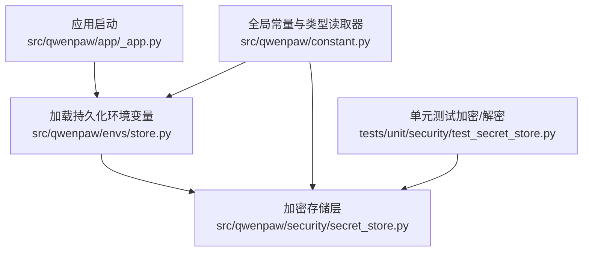
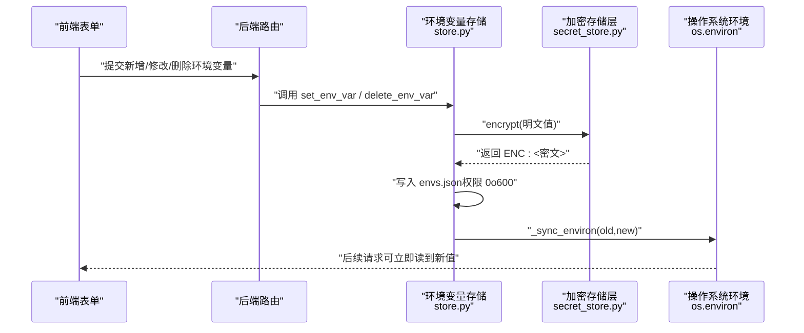
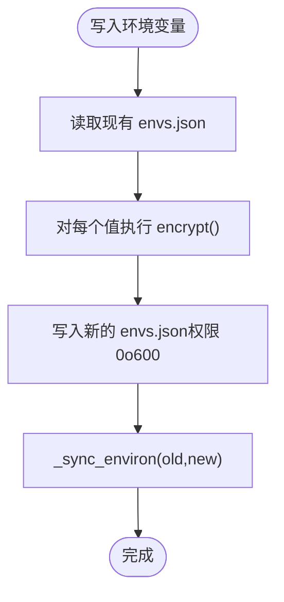
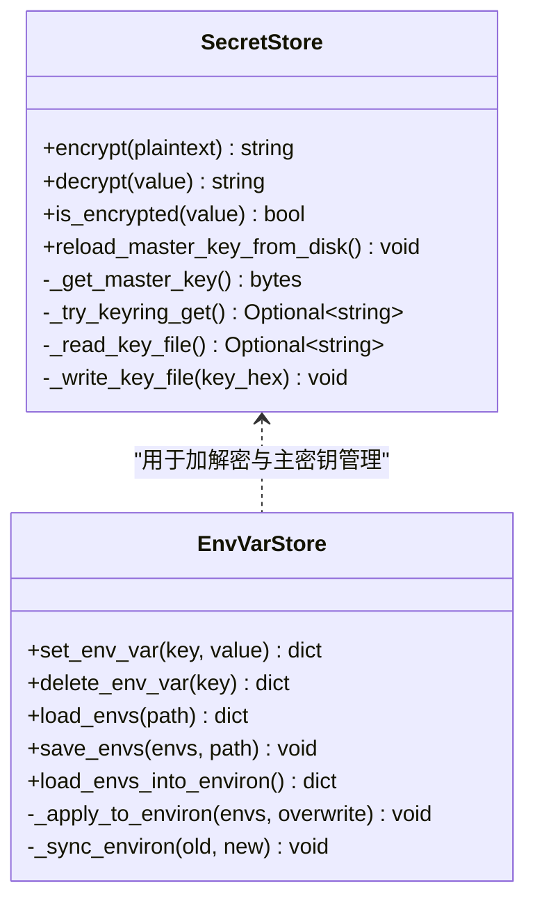
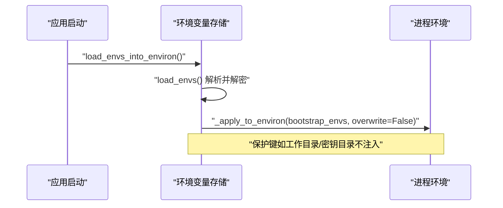
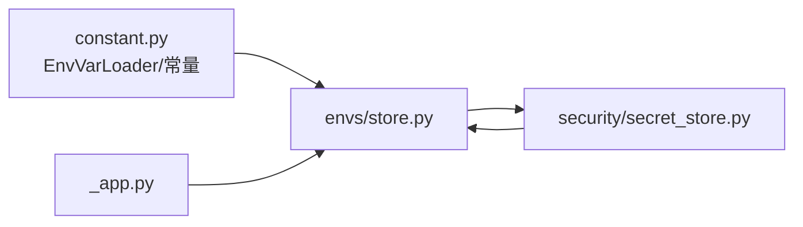

# 环境设置

<cite>
**本文引用的文件**   
- [src/qwenpaw/envs/store.py](file://src/qwenpaw/envs/store.py)
- [src/qwenpaw/security/secret_store.py](file://src/qwenpaw/security/secret_store.py)
- [src/qwenpaw/constant.py](file://src/qwenpaw/constant.py)
- [src/qwenpaw/app/_app.py](file://src/qwenpaw/app/_app.py)
- [tests/unit/security/test_secret_store.py](file://tests/unit/security/test_secret_store.py)
</cite>

## 目录
1. [简介](#简介)
2. [项目结构](#项目结构)
3. [核心组件](#核心组件)
4. [架构总览](#架构总览)
5. [详细组件分析](#详细组件分析)
6. [依赖关系分析](#依赖关系分析)
7. [性能考虑](#性能考虑)
8. [故障排查指南](#故障排查指南)
9. [结论](#结论)
10. [附录](#附录)

## 简介
本章节面向 QwenPaw 的环境设置模块，系统性阐述环境变量管理系统与安全密钥存储机制。内容覆盖：
- 环境变量的增删改查、类型验证与持久化策略
- 敏感信息加密存储（主密钥管理、Fernet 加解密、迁移兼容）
- 配置热重载机制（进程内缓存失效与键值同步）
- 环境变量表单组件的交互设计要点、实时预览与错误提示系统
- 自定义变量类型、导入导出能力与外部配置服务集成示例
- 常见问题与解决方案（配置同步冲突、安全漏洞防护、性能优化）

## 项目结构
与环境设置相关的核心代码位于以下位置：
- 环境变量持久化与注入：src/qwenpaw/envs/store.py
- 安全密钥存储层（主密钥、Fernet 加解密）：src/qwenpaw/security/secret_store.py
- 全局常量与 EnvVarLoader（类型安全的读取器）：src/qwenpaw/constant.py
- 应用启动时加载持久化环境变量到进程环境：src/qwenpaw/app/_app.py
- 单元测试（加密/解密行为验证）：tests/unit/security/test_secret_store.py

**图示来源** 
- [src/qwenpaw/app/_app.py:71-73](file://src/qwenpaw/app/_app.py#L71-L73)
- [src/qwenpaw/envs/store.py:142-180](file://src/qwenpaw/envs/store.py#L142-L180)
- [src/qwenpaw/security/secret_store.py:346-379](file://src/qwenpaw/security/secret_store.py#L346-L379)
- [src/qwenpaw/constant.py:28-81](file://src/qwenpaw/constant.py#L28-L81)
- [tests/unit/security/test_secret_store.py:36-48](file://tests/unit/security/test_secret_store.py#L36-L48)

**章节来源**
- [src/qwenpaw/envs/store.py:1-270](file://src/qwenpaw/envs/store.py#L1-L270)
- [src/qwenpaw/security/secret_store.py:1-467](file://src/qwenpaw/security/secret_store.py#L1-L467)
- [src/qwenpaw/constant.py:1-271](file://src/qwenpaw/constant.py#L1-L271)
- [src/qwenpaw/app/_app.py:59-73](file://src/qwenpaw/app/_app.py#L59-L73)
- [tests/unit/security/test_secret_store.py:1-48](file://tests/unit/security/test_secret_store.py#L1-L48)

## 核心组件
- 环境变量持久化与注入（envs.json + os.environ）
  - 持久化路径位于 SECRET_DIR/envs.json，支持从旧位置迁移
  - 提供 set_env_var、delete_env_var、load_envs、save_envs、load_envs_into_environ 等接口
  - 写入后自动同步到当前进程的 os.environ，并清理不再存在的键
- 安全密钥存储层（secret_store）
  - 主密钥优先存储在 OS Keychain，回退到 SECRET_DIR/.master_key（权限 0o600）
  - 使用 Fernet（AES-128-CBC + HMAC-SHA256）对敏感字段进行透明加解密
  - 提供 encrypt/decrypt/is_encrypted 以及批量字典字段加解密工具
- 全局常量与类型读取器（EnvVarLoader）
  - 统一读取 QWENPAW_* 环境变量，兼容 COPAW_* 前缀的遗留键
  - 提供 get_bool/get_int/get_float/get_str 等类型安全方法，支持边界校验与默认值

**章节来源**
- [src/qwenpaw/envs/store.py:142-270](file://src/qwenpaw/envs/store.py#L142-L270)
- [src/qwenpaw/security/secret_store.py:287-379](file://src/qwenpaw/security/secret_store.py#L287-L379)
- [src/qwenpaw/constant.py:28-81](file://src/qwenpaw/constant.py#L28-L81)

## 架构总览
下图展示环境变量从前端表单到后端持久化、再到进程环境生效的整体流程，以及加密存储层的参与点。

**图示来源** 
- [src/qwenpaw/envs/store.py:223-239](file://src/qwenpaw/envs/store.py#L223-L239)
- [src/qwenpaw/envs/store.py:198-221](file://src/qwenpaw/envs/store.py#L198-L221)
- [src/qwenpaw/security/secret_store.py:346-379](file://src/qwenpaw/security/secret_store.py#L346-L379)

## 详细组件分析

### 环境变量数据模型与持久化（EnvVar 模型）
- 存储格式
  - 以 JSON 字典形式保存于 SECRET_DIR/envs.json
  - 所有非空值在写入前通过加密层处理，带 ENC: 前缀表示密文
- 生命周期
  - 启动阶段：load_envs_into_environ 将持久化变量注入到 os.environ（保护键除外）
  - 运行时：set_env_var/delete_env_var 更新持久化并同步进程环境
- 迁移与兼容性
  - 首次访问时尝试从历史位置迁移 envs.json 至 SECRET_DIR
  - 若发现明文值，自动重写为加密值

**图示来源** 
- [src/qwenpaw/envs/store.py:198-221](file://src/qwenpaw/envs/store.py#L198-L221)
- [src/qwenpaw/envs/store.py:126-135](file://src/qwenpaw/envs/store.py#L126-L135)
- [src/qwenpaw/security/secret_store.py:346-379](file://src/qwenpaw/security/secret_store.py#L346-L379)

**章节来源**
- [src/qwenpaw/envs/store.py:56-82](file://src/qwenpaw/envs/store.py#L56-L82)
- [src/qwenpaw/envs/store.py:142-180](file://src/qwenpaw/envs/store.py#L142-L180)
- [src/qwenpaw/envs/store.py:198-221](file://src/qwenpaw/envs/store.py#L198-L221)

### 表单验证规则与类型安全
- 类型读取器 EnvVarLoader
  - get_bool：识别 true/1/yes 等常见真值
  - get_int/get_float：支持最小/最大边界校验，浮点允许控制是否接受无穷大
  - get_str：直接返回字符串，支持 COPAW_* 前缀的遗留键自动回退
- 建议在前端表单侧结合后端提供的类型读取器约定进行校验
  - 例如：布尔开关映射到 get_bool；数值范围映射到 get_int/get_float 的 min/max
  - 对于密码或密钥类字段，应标记为“password”类型并在传输中避免明文日志

**章节来源**
- [src/qwenpaw/constant.py:28-81](file://src/qwenpaw/constant.py#L28-L81)

### 敏感信息加密算法与主密钥管理
- 主密钥获取顺序
  1) 进程内缓存（快速路径）
  2) OS Keychain（keyring），支持显式账户名覆盖与按安装路径派生账户
  3) 本地文件 SECRET_DIR/.master_key（权限 0o600）
  4) 生成新密钥并尝试写入 keyring，同时落盘作为回退
- 加解密实现
  - 使用 Fernet（基于 AES-128-CBC + HMAC-SHA256）
  - 密文以 ENC: 前缀标识，便于兼容明文迁移
- 热重载
  - reload_master_key_from_disk：清除进程内缓存并从磁盘重新加载主密钥，必要时同步 keyring

**图示来源** 
- [src/qwenpaw/security/secret_store.py:287-379](file://src/qwenpaw/security/secret_store.py#L287-L379)
- [src/qwenpaw/security/secret_store.py:382-423](file://src/qwenpaw/security/secret_store.py#L382-L423)
- [src/qwenpaw/envs/store.py:198-221](file://src/qwenpaw/envs/store.py#L198-L221)

**章节来源**
- [src/qwenpaw/security/secret_store.py:93-131](file://src/qwenpaw/security/secret_store.py#L93-L131)
- [src/qwenpaw/security/secret_store.py:168-241](file://src/qwenpaw/security/secret_store.py#L168-L241)
- [src/qwenpaw/security/secret_store.py:287-379](file://src/qwenpaw/security/secret_store.py#L287-L379)
- [src/qwenpaw/security/secret_store.py:382-423](file://src/qwenpaw/security/secret_store.py#L382-L423)
- [tests/unit/security/test_secret_store.py:36-48](file://tests/unit/security/test_secret_store.py#L36-L48)

### 配置热重载机制
- 进程内缓存失效
  - secret_store 的主密钥与 Fernet 实例采用缓存，reload_master_key_from_disk 会清空缓存并重新从磁盘加载
- 环境变量热同步
  - save_envs 在写入 envs.json 后调用 _sync_environ，增量更新 os.environ，确保子进程与后续请求能立即读取最新值
- 启动时注入
  - app 启动阶段调用 load_envs_into_environ，将持久化变量注入到进程环境（保护键不注入）

**图示来源** 
- [src/qwenpaw/app/_app.py:71-73](file://src/qwenpaw/app/_app.py#L71-L73)
- [src/qwenpaw/envs/store.py:242-269](file://src/qwenpaw/envs/store.py#L242-L269)
- [src/qwenpaw/envs/store.py:104-135](file://src/qwenpaw/envs/store.py#L104-L135)

**章节来源**
- [src/qwenpaw/app/_app.py:71-73](file://src/qwenpaw/app/_app.py#L71-L73)
- [src/qwenpaw/envs/store.py:242-269](file://src/qwenpaw/envs/store.py#L242-L269)
- [src/qwenpaw/security/secret_store.py:382-423](file://src/qwenpaw/security/secret_store.py#L382-L423)

### 环境变量表单组件的交互设计与错误提示
- 交互设计要点
  - 字段类型映射：text/password/number/switch/select，对应后端 EnvVarLoader 的类型读取器
  - 必填与占位符：required/placeholder/help 等元数据驱动前端校验与提示
  - 实时预览：在输入框失焦或防抖后触发后端校验（类型、范围、长度），即时反馈错误
- 错误提示系统
  - 类型错误：如整数越界、浮点非法、布尔值不可解析
  - 安全提示：对 password 类型字段禁止明文回显，仅显示掩码
  - 网络与持久化错误：如磁盘权限不足、JSON 损坏、加密失败等，需给出明确用户可读的错误消息

[本节为概念性说明，不直接分析具体文件]

### 自定义变量类型、导入导出与外部配置服务集成
- 自定义变量类型
  - 在后端扩展 EnvVarLoader 的读取逻辑（例如枚举、正则校验、复合对象），并在前端表单定义对应的 type 与校验规则
- 导入导出功能
  - 导出：读取 envs.json 的明文视图（由后端解密后输出），供用户备份或迁移
  - 导入：接收 JSON 文件，逐条写入并通过加密层处理，最后调用 save_envs 完成持久化与同步
- 集成外部配置服务
  - 在应用启动阶段通过 load_envs_into_environ 注入基础配置
  - 对外部服务变更，可通过定时任务或事件回调触发 save_envs 或 set_env_var，实现热更新

[本节为概念性说明，不直接分析具体文件]

## 依赖关系分析
- 模块耦合
  - envs/store.py 依赖 security/secret_store.py 进行加解密
  - envs/store.py 依赖 constant.py 中的 WORKING_DIR/SECRET_DIR 常量
  - app/_app.py 在启动阶段调用 store.load_envs_into_environ
- 外部依赖
  - cryptography.Fernet 用于对称加密
  - keyring 用于 OS Keychain 存取（可选，受运行环境检测影响）
  - dotenv 用于加载 .env 文件（开发期常用）

**图示来源** 
- [src/qwenpaw/envs/store.py:20-22](file://src/qwenpaw/envs/store.py#L20-L22)
- [src/qwenpaw/app/_app.py:71-73](file://src/qwenpaw/app/_app.py#L71-L73)
- [src/qwenpaw/constant.py:28-81](file://src/qwenpaw/constant.py#L28-L81)

**章节来源**
- [src/qwenpaw/envs/store.py:1-270](file://src/qwenpaw/envs/store.py#L1-L270)
- [src/qwenpaw/security/secret_store.py:1-467](file://src/qwenpaw/security/secret_store.py#L1-L467)
- [src/qwenpaw/constant.py:1-271](file://src/qwenpaw/constant.py#L1-L271)
- [src/qwenpaw/app/_app.py:59-73](file://src/qwenpaw/app/_app.py#L59-L73)

## 性能考虑
- 主密钥与 Fernet 缓存
  - 进程内缓存避免重复 I/O 与加解密开销
  - 仅在需要时（如恢复主密钥）主动失效缓存
- 环境变量同步
  - _sync_environ 仅对差异项操作，减少不必要的写入
- 磁盘权限与文件系统
  - 使用 0o600 限制文件权限，避免额外权限检查带来的开销
- 容器与无头环境
  - 跳过 keyring 访问以避免阻塞，提升启动与运行稳定性

[本节为通用指导，不直接分析具体文件]

## 故障排查指南
- 无法解密或解密失败
  - 现象：解密函数返回原始密文或明文
  - 排查：确认主密钥是否被替换或损坏；调用 reload_master_key_from_disk 刷新缓存
  - 参考：解密失败时的降级行为与日志
- 环境变量未生效
  - 现象：修改后进程仍读取旧值
  - 排查：确认 save_envs 是否成功写入并调用了 _sync_environ；检查保护键是否被意外覆盖
- 磁盘权限问题
  - 现象：写入 envs.json 失败
  - 排查：确认 SECRET_DIR 及其父目录权限；检查 chmod 是否被系统拒绝
- Keyring 不可用或超时
  - 现象：主密钥无法从 keyring 读取
  - 排查：在非桌面环境或容器中会自动跳过 keyring；必要时禁用 keyring 并依赖文件回退

**章节来源**
- [src/qwenpaw/security/secret_store.py:355-379](file://src/qwenpaw/security/secret_store.py#L355-L379)
- [src/qwenpaw/security/secret_store.py:382-423](file://src/qwenpaw/security/secret_store.py#L382-L423)
- [src/qwenpaw/envs/store.py:198-221](file://src/qwenpaw/envs/store.py#L198-L221)

## 结论
QwenPaw 的环境设置模块通过“持久化 + 进程环境注入 + 加密存储”的分层设计，实现了安全、可靠且易用的环境变量管理。EnvVarLoader 提供了类型安全的读取能力，secret_store 保障了敏感信息的机密性与可用性，配合热重载与迁移机制，既满足生产环境的稳定性需求，也兼顾了开发与运维的便捷性。

[本节为总结性内容，不直接分析具体文件]

## 附录
- 关键环境变量与用途（示例）
  - QWENPAW_WORKING_DIR：工作目录（保护键，不注入进程环境）
  - QWENPAW_SECRET_DIR：密钥目录（保护键，不注入进程环境）
  - QWENPAW_KEYRING_ACCOUNT：覆盖 OS Keychain 账户名
  - QWENPAW_RUNNING_IN_CONTAINER：指示容器环境（影响 keyring 行为）
  - QWENPAW_OPENAPI_DOCS：是否暴露 OpenAPI 文档（开发期）
  - QWENPAW_LOG_LEVEL：日志级别
  - QWENPAW_CONSOLE_STATIC_DIR：控制台静态资源目录

**章节来源**
- [src/qwenpaw/constant.py:89-114](file://src/qwenpaw/constant.py#L89-L114)
- [src/qwenpaw/constant.py:223-271](file://src/qwenpaw/constant.py#L223-L271)
- [src/qwenpaw/app/_app.py:812-838](file://src/qwenpaw/app/_app.py#L812-L838)